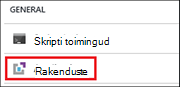
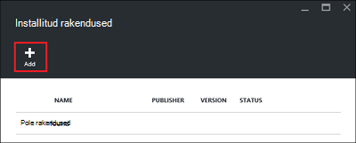
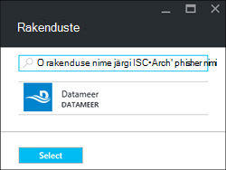
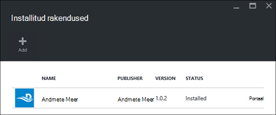

<properties
    pageTitle="Hadoopi rakenduste installimine Hdinsightiga | Microsoft Azure'i"
    description="Saate teada, kuidas Hdinsightiga rakenduste installimine Hdinsightiga rakendused."
    services="hdinsight"
    documentationCenter=""
    authors="mumian"
    manager="jhubbard"
    editor="cgronlun"
    tags="azure-portal"/>

<tags
    ms.service="hdinsight"
    ms.devlang="na"
    ms.topic="hero-article"
    ms.tgt_pltfrm="na"
    ms.workload="big-data"
    ms.date="09/14/2016"
    ms.author="jgao"/>

# Hdinsightiga rakenduste installimine

Rakenduse Hdinsightiga on rakendus, mida kasutajad saavad installida Linux-põhine Hdinsightiga klaster. Need rakendused saate välja töötada Microsoft sõltumatu tarkvara tarnijate (ISV) või ise. Sellest artiklist saate teada, kuidas avaldatud rakenduse installimiseks. Oma rakenduste installimist vaadake [kohandatud Hdinsightiga rakenduste installimine](hdinsight-apps-install-custom-applications.md). 

Praegu on avaldatud ühe:

- **Datameer**: [Datameer](http://www.datameer.com/documentation/display/DAS50/Home?ls=Partners&lsd=Microsoft&c=Partners&cd=Microsoft) pakub ärianalüütikud interaktiivselt avastamine, analüüsimiseks ja tulemuste suur andmete visualiseerimiseks. Täiendavad andmeallikate hõlpsalt leida uued seosed ja saada vastuseid, peate kiiresti tõmmata.

>[AZURE.NOTE] Datameer pole praegu toetatud ainult Windows Azure Hdinsightiga versioon 3,2 rühmades.

Selles artiklis esitatud juhiste kasutada Azure portaali. Saate malli Azure'i ressursihaldur eksportimine portaali või saada koopia ressursihaldur malli müüjad ja Azure PowerShelli ja Azure CLI malli abil.  Vaadake [loomine Linux-põhine Hadoopi le Hdinsightiga ressursihaldur mallide kasutamine](hdinsight-hadoop-create-linux-clusters-arm-templates.md).

## Eeltingimused

Kui soovite mõne olemasoleva Hdinsightiga kobar Hdinsightiga rakenduste installimine, peab teil olema ka Hdinsightiga kobar. Üks loomiseks vaadake teemat [kogumite loomine](hdinsight-hadoop-linux-tutorial-get-started.md#create-cluster). Hdinsightiga rakenduste installimist saate ka mõne Hdinsightiga kobar loomisel.

## Kui soovite olemasoleva kogumite rakenduste installimine

Järgnevalt kirjeldatakse, kuidas installida mõne olemasoleva Hdinsightiga kobar Hdinsightiga rakendusi.

**Hdinsightiga rakenduse installimiseks**

1. [Azure'i portaali](https://portal.azure.com)sisse logida.
2. Klõpsake vasakpoolses menüüs **Hdinsightiga kogumite** .  Kui te ei näe seda, klõpsake nuppu **Sirvi**ja seejärel nuppu **Hdinsightiga kogumite**.
3. Klõpsake soovitud Hdinsightiga kobar.  Kui teil pole ühte, peate looma ühte esimese.  lugege teemat [kogumite loomine](hdinsight-hadoop-linux-tutorial-get-started.md#create-cluster).
4. Keelest **sätted** , klõpsake jaotises kategooria **üldist** **rakendused** . **Installitud rakendused** tera loetleb kõik installitud rakendused. 

    

5. Klõpsake nuppu **Lisa** tera menüüst. 

    

    Näete peab olemasoleva Hdinsightiga rakenduste loendist.

    

6. Klõpsake ühte rakenduste, juriidilised nõustumine ja **nuppu**.

Saate vaadata installioleku portaali teatiste (klõpsake kellaikooni portaali peal). Kui rakendus on installitud, kuvatakse rakenduse enne installitud rakendused.

## Rakenduste installimine kobar loomise ajal

Teil on võimalus Hdinsightiga rakenduste installimine klaster loomisel. Käigus installitakse Hdinsightiga rakenduste pärast klaster on loodud ja töötab olekus. Järgnevalt kirjeldatakse, kuidas installida Hdinsightiga rakenduste klaster loomisel.

**Hdinsightiga rakenduse installimiseks**

1. [Azure'i portaali](https://portal.azure.com)sisse logida.
2. Klõpsake nuppu **Uus**, klõpsake **andmete + Analytics**, ja seejärel käsku **Hdinsightiga**.
3. Sisestage **Kobar nimi**: see nimi peab olema kordumatu globaalselt.
4. Klõpsake **tellimuse** Azure'i tellimus, mida kasutatakse klaster valimiseks.
5. Klõpsake nuppu **Vali kobar tüüp**ja seejärel valige.

    - **Kobar tüüp**: kui te ei tea, mida soovite valida, valige **Hadoopi**. See on kõige populaarsemate kobar tüüp.
    - **Operatsioonisüsteem**: valige **Linux**.
    - **Versioon**: vaikeversiooniks kasutada, kui te ei tea, mida soovite valida. Lisateabe saamiseks vt [Hdinsightiga kobar versioonid](hdinsight-component-versioning.md).
    - **Kobar taseme**: Windows Azure Hdinsightiga pakub suur andmete pilve pakkumisi kahte kategooriasse: Standard taseme- ja Premium taseme. Lisateavet leiate teemast [kobar astme](hdinsight-hadoop-provision-linux-clusters.md#cluster-tiers).
6. Valige **rakendused**, klõpsake ühte avaldatud rakendusi ja **nuppu**.
6. Klõpsake **mandaat** ja sisestage administraatori kasutaja parooli. Peate sisestama mõne **SSH kasutajanimi** ja kas **parooli** või **Avalik võti**, mida kasutatakse SSH autentida. Soovitatav on avalik võti abil. Klõpsake allosas identimisteabe konfiguratsiooni salvestamiseks **Valige** .
8. Klõpsake **Andmeallika**, valige üks järgmistest olemasoleva salvestusruumi konto või salvestusruumi konto kasutamiseks klaster salvestusruumi uue konto loomine.
9. **Ressursirühm** ressursi olemasolevasse rühma valimiseks klõpsake, või klõpsake nuppu **Uus** , et luua uue ressursirühma

10. Enne **Uue Hdinsightiga kobar** , veenduge, et **Kinnita Startboard** on valitud, ja klõpsake nuppu **Loo**. 

## Loendi installitud rakenduste Hdinsightiga ja atribuudid

Portaali kuvatakse installitud Hdinsightiga taotlused klaster loendit ja iga rakenduse atribuutide.

**Hdinsightiga rakenduste loend ja atribuutide kuvamine**

1. [Azure'i portaali](https://portal.azure.com)sisse logida.
2. Klõpsake vasakpoolses menüüs **Hdinsightiga kogumite** .  Kui te ei näe seda, klõpsake nuppu **Sirvi**ja seejärel nuppu **Hdinsightiga kogumite**.
3. Klõpsake soovitud Hdinsightiga kobar.
4. Keelest **sätted** , klõpsake jaotises kategooria **üldist** **rakendused** . Installitud rakendused tera loetleb kõik installitud rakendused. 

    

5. Klõpsake installitud rakenduste atribuudi kuvamiseks. Atribuut tera on loetletud.

    - Rakenduse nimi: rakenduse nimi.
    - Olek: rakenduse olek. 
    - Veebilehe: URL-i veebirakenduse, mis on juurutatud serva sõlme, kui on olemas. Mandaat on sama mis HTTP kasutajatunnust, mille olete konfigureerinud klaster.
    - HTTP lõpp-punkt: mandaat on sama mis HTTP kasutajatunnust, mille olete konfigureerinud klaster. 
    - SSH lõpp-punkt: saate [SSH](hdinsight-hadoop-linux-use-ssh-unix.md) ühenduse sõlme serva. SSH identimisteave on sama, mis on konfigureeritud jaoks klaster SSH kasutajatunnust.

6. Luua rakenduse kustutamiseks paremklõpsake rakenduse ja seejärel klõpsake kontekstimenüüs käsku **Kustuta** .

## Ühenduse loomine serva sõlm

Saate luua ühenduse sõlme serva HTTP ja SSH abil. Lõpp-punkti teave leiate [portaalis](#list-installed-hdinsight-apps-and-properties). SSH kasutamise kohta leiate lisateavet teemast [Kasutamine SSH koos Linux-põhine Hadoopi Hdinsightiga Linux, Unix, või OS X](hdinsight-hadoop-linux-use-ssh-unix.md). 

HTTP lõpp-punkti mandaat on HTTP kasutaja identimisteavet, mida olete konfigureerinud Hdinsightiga kobar; SSH lõpp-punkti mandaat on SSH identimisteavet, mida olete konfigureerinud Hdinsightiga kobar.

## Tõrkeotsing

Vaadake teemat [installimise tõrkeotsing](hdinsight-apps-install-custom-applications.md#troubleshoot-the-installation).

## Järgmised sammud

- [Kohandatud Hdinsightiga rakenduste installimine](hdinsight-apps-install-custom-applications.md): saate teada, kuidas un avaldatud Hdinsightiga taotluse Hdinsightiga juurutamine.
- [Avaldamine Hdinsightiga rakenduste](hdinsight-apps-publish-applications.md): saate teada, kuidas avaldada oma kohandatud Hdinsightiga rakenduste Azure'i turuplatsilt.
- [MSDN: Hdinsightiga rakenduse installimiseks](https://msdn.microsoft.com/library/mt706515.aspx): saate teada, kuidas määratleda Hdinsightiga rakendused.
- [Kohandamine Linux-põhine Hdinsightiga kogumite skripti toimingu abil](hdinsight-hadoop-customize-cluster-linux.md): saate teada, kuidas skripti toimingu abil saate installida täiendavad rakendused.
- [Hadoopi loomine Linux-põhine le Hdinsightiga ressursihaldur mallide kasutamine](hdinsight-hadoop-create-linux-clusters-arm-templates.md): saate teada, kuidas kõne ressursihaldur Mallid Hdinsightiga kogumite loomiseks.
- [Kasutage tühja serva sõlmed Hdinsightile](hdinsight-apps-use-edge-node.md): saate teada, kuidas kasutada mõnda tühja serva sõlm juurdepääs Hdinsightiga kobar, Hdinsightiga rakenduste testimine ja majutusteenuse Hdinsightiga rakendused.

