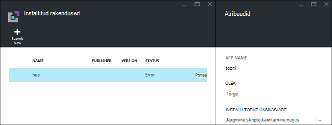
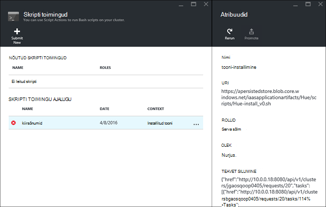

<properties
    pageTitle="Hadoopi rakenduste installimine Hdinsightiga | Microsoft Azure'i"
    description="Saate teada, kuidas Hdinsightiga rakenduste installimine Hdinsightiga rakendused."
    services="hdinsight"
    documentationCenter=""
    authors="mumian"
    manager="jhubbard"
    editor="cgronlun"
    tags="azure-portal"/>

<tags
    ms.service="hdinsight"
    ms.devlang="na"
    ms.topic="hero-article"
    ms.tgt_pltfrm="na"
    ms.workload="big-data"
    ms.date="09/14/2016"
    ms.author="jgao"/>

# Kohandatud Hdinsightiga rakenduste installimine

Rakenduse Hdinsightiga on rakendus, mida kasutajad saavad installida Linux-põhine Hdinsightiga klaster.  Need rakendused saate välja töötada Microsoft sõltumatu tarkvara tarnijate (ISV) või ise. Sellest artiklist saate teada, kuidas installida rakendus Hdinsightiga, mis ei ole avaldatud Azure Hdinsightiga sisse portaali. Pärast installimist rakendus ei [toon](http://gethue.com/). 

Muud seotud artiklid:

- [Rakenduste installimine Hdinsightiga](hdinsight-apps-install-applications.md): saate teada, kuidas installida rakendus Hdinsightile oma kogumite.
- [Avaldamine Hdinsightiga rakenduste](hdinsight-apps-publish-applications.md): saate teada, kuidas avaldada oma kohandatud Hdinsightiga rakenduste Azure'i turuplatsilt.
- [MSDN: Hdinsightiga rakenduse installimiseks](https://msdn.microsoft.com/library/mt706515.aspx): saate teada, kuidas määratleda Hdinsightiga rakendused.

 
## Eeltingimused

Kui soovite mõne olemasoleva Hdinsightiga kobar Hdinsightiga rakenduste installimine, peab teil olema ka Hdinsightiga kobar. Üks loomiseks vaadake teemat [kogumite loomine](hdinsight-hadoop-linux-tutorial-get-started.md#create-cluster). Hdinsightiga rakenduste installimist saate ka mõne Hdinsightiga kobar loomisel.

## Hdinsightiga rakenduste installimine

Hdinsightiga rakenduste installimist klaster loomisel või mõne olemasoleva Hdinsightiga kobar. Leiate Azure'i ressursihaldur Mallid määratlemiseks [MSDN: Hdinsightiga rakenduse installimiseks](https://msdn.microsoft.com/library/mt706515.aspx).

Faile vaja (tooni) selle rakenduse kasutamise kohta:

- [azuredeploy.JSON](https://github.com/hdinsight/Iaas-Applications/blob/master/Hue/azuredeploy.json): The ressursihaldur malli Hdinsightiga rakenduste installimist. Vt [MSDN: Hdinsightiga rakenduse installimiseks](https://msdn.microsoft.com/library/mt706515.aspx) arendamise ressursihaldur malli.
- [tooni-install_v0.sh](https://github.com/hdinsight/Iaas-Applications/blob/master/Hue/scripts/Hue-install_v0.sh): The Script toimingu kutsutud ressursihaldur malli konfigureerida sõlme serva. 
- [tooni-binaries.tgz](https://hdiconfigactions.blob.core.windows.net/linuxhueconfigactionv01/hue-binaries-14-04.tgz): on nõutud hui-install_v0.sh tooni kahendfailina. 
- [tooni kahendfaile-14 04.tgz](https://hdiconfigactions.blob.core.windows.net/linuxhueconfigactionv01/hue-binaries-14-04.tgz): tooni kahendfailina on nõutud hui-install_v0.sh. 
- [webwasb-tomcat.tar.gz](https://hdiconfigactions.blob.core.windows.net/linuxhueconfigactionv01/webwasb-tomcat.tar.gz): on nõutud hui-install_v0.sh valimi veebirakenduse (kõuts).

**Mõne olemasoleva Hdinsightiga kobar tooni installimiseks**

1. Klõpsake järgmisel pildil Azure'i sisse logida ja avage Mall, ressursihaldur Azure'i portaalis. 

    

    Selle nupu klõpsamisel avaneb ressursihaldur malli Azure'i portaalis.  Ressursihaldur Mall asub [https://github.com/hdinsight/Iaas-Applications/tree/master/Hue](https://github.com/hdinsight/Iaas-Applications/tree/master/Hue).  Saate teada, kuidas kirjutada selle ressursihaldur malli, lugege teemat [MSDN: Hdinsightiga rakenduse installimiseks](https://msdn.microsoft.com/library/mt706515.aspx).
    
2. Keelest **Parameetrid** sisestage järgmine:

    - **ClusterName**: sisestage klaster nimi, kuhu soovite installida rakendus. See peab olema mõne olemasoleva kobar.
    
3. Klõpsake nuppu parameetrid salvestamiseks nuppu **OK** .
4. Sisestage keelest **kohandatud juurutamise** **Ressursirühma**.  Ressursirühma on ümbris, mis pakuvad klaster, sõltuvad salvestusruumi konto ja muud ressursid. See on vajalik kasutada ühte ressursirühma klaster.
5. Klõpsake **õiguslikult**ja seejärel klõpsake nuppu **Loo**.
6. Veenduge, et **PIN-koodi armatuurlauale** ruut oleks märgitud, ja seejärel klõpsake nuppu **Loo**. Saate vaadata installioleku paani kinnitatud portaali armatuurlaua ja portaali teatis (klõpsake portaali peal kellaikooni) kaudu.  Kulub umbes 10 minutit installida rakendus.

**Installimise ajal luua klaster tooni**

1. Klõpsake järgmisel pildil Azure'i sisse logida ja avage Mall, ressursihaldur Azure'i portaalis. 

    

    Selle nupu klõpsamisel avaneb ressursihaldur malli Azure'i portaalis.  Ressursihaldur Mall asub [https://hditutorialdata.blob.core.windows.net/hdinsightapps/create-linux-based-hadoop-cluster-in-hdinsight.json](https://hditutorialdata.blob.core.windows.net/hdinsightapps/create-linux-based-hadoop-cluster-in-hdinsight.json).  Saate teada, kuidas kirjutada selle ressursihaldur malli, lugege teemat [MSDN: Hdinsightiga rakenduse installimiseks](https://msdn.microsoft.com/library/mt706515.aspx).

2. Järgige juhiseid, et luua kobar ja installige toon. Hdinsightiga kogumite loomise kohta leiate lisateavet teemast [loomine Linux-põhine Hadoopi kogumite Hdinsightiga sisse](hdinsight-hadoop-provision-linux-clusters.md).

Azure'i portaali lisaks ka saate [Azure PowerShelli](hdinsight-hadoop-create-linux-clusters-arm-templates.md#deploy-with-powershell) ja [Azure CLI](hdinsight-hadoop-create-linux-clusters-arm-templates.md#deploy-with-azure-cli) helistamiseks ressursihaldur mallid.

## Installimise

Saate vaadata rakenduse oleku rakenduse installimise Azure'i portaalis. Lisaks võite kinnitada ka kõik HTTP lõpp-punktid välja eeldatud ja veebilehe, kui see on olemas:

**Tooni portaali avamine**

1. [Azure'i portaali](https://portal.azure.com)sisse logida.
2. Klõpsake vasakpoolses menüüs **Hdinsightiga kogumite** .  Kui te ei näe seda, klõpsake nuppu **Sirvi**ja seejärel nuppu **Hdinsightiga kogumite**.
3. Klõpsake kobar, kuhu installisite rakenduse.
4. Keelest **sätted** , klõpsake jaotises kategooria **üldist** **rakendused** . Näete peab **tooni** tera **Installitud rakenduste** loendis.
5. Valige loendist, loendisse atribuutide **toon** .  
6. Klõpsake veebilehe lingi valideerimiseks veebisait; Avage brauseris valideerimiseks tooni web UI, avage SSH lõpp-punkti [PuTTY](hdinsight-hadoop-linux-use-ssh-windows.md) või muude [SSH kliendid](hdinsight-hadoop-linux-use-ssh-unix.md)abil HTTP lõpp-punkti.
 
## Installimise tõrkeotsing

Saate vaadata rakenduse installioleku portaali etteteatamisaja (klõpsake kellaikooni portaali peal). 

Kui ka rakenduse installimine nurjus, saate kuvada tõrketeated ja silumine teavet 3 kohast.

- Hdinsightiga rakendused: Üldine tõrketeave.

    Avage klaster portaalist ja klõpsake nuppu Applications keelest sätted.

    

- Hdinsightiga skripti toiming: kui Hdinsightiga rakenduste tõrketeade näitab skripti toimingu tõrge, skripti paanil esitatakse skripti tõrke kohta rohkem üksikasju.

    Klõpsake nuppu sätted keelest skripti toiming. Skripti toimingu ajalugu kuvatakse tõrketeated

    
    
- Ambari Web UI: Kui installi script on selle põhjus, kasutage Ambari Web UI vaadata täielik logisid skriptide installimise kohta.

    Lisateavet leiate teemast [tõrkeotsing](hdinsight-hadoop-customize-cluster-linux.md#troubleshooting).

## Hdinsightiga rakenduste eemaldamine

On mitu võimalust Hdinsightiga rakenduste kustutamine.

### Portaali kasutamine

**Portaalis rakenduse eemaldamine**

1. [Azure'i portaali](https://portal.azure.com)sisse logida.
2. Klõpsake vasakpoolses menüüs **Hdinsightiga kogumite** .  Kui te ei näe seda, klõpsake nuppu **Sirvi**ja seejärel nuppu **Hdinsightiga kogumite**.
3. Klõpsake kobar, kuhu installisite rakenduse.
4. Keelest **sätted** , klõpsake jaotises kategooria **üldist** **rakendused** . Näete peab installitud rakenduste loend. Selles õpetuses **tooni** loetletud tera **Installitud rakendused** .
5. Paremklõpsake rakendus, mille soovite eemaldada, ja seejärel klõpsake käsku **Kustuta**.
6. Klõpsake nuppu **Jah** kinnitamiseks.

Portaalist, saate ka kustutada klaster või ressursirühm, mis sisaldab rakenduse kustutamine.

### Azure'i PowerShelli kasutamine

Azure'i PowerShelli abil saate kustutada klaster või kustutada ressursirühma. Leiate [Azure'i PowerShelli abil kogumite kustutada](hdinsight-administer-use-powershell.md#delete-clusters).

### Azure'i CLI kasutamine

Azure'i CLI kasutamisel saate kustutada klaster või kustutada ressursirühma. Vt [kogumite, kasutades Azure CLI kustutada](hdinsight-administer-use-command-line.md#delete-clusters).

## Järgmised sammud

- [MSDN: Hdinsightiga rakenduse installimiseks](https://msdn.microsoft.com/library/mt706515.aspx): saate teada, kuidas töötada ressursihaldur Mallid Hdinsightiga rakenduste kasutamise kohta.
- [Rakenduste installimine Hdinsightiga](hdinsight-apps-install-applications.md): saate teada, kuidas installida rakendus Hdinsightile oma kogumite.
- [Avaldamine Hdinsightiga rakenduste](hdinsight-apps-publish-applications.md): saate teada, kuidas avaldada oma kohandatud Hdinsightiga rakenduste Azure'i turuplatsilt.
- [Kohandamine Linux-põhine Hdinsightiga kogumite skripti toimingu abil](hdinsight-hadoop-customize-cluster-linux.md): saate teada, kuidas skripti toimingu abil saate installida täiendavad rakendused.
- [Hadoopi loomine Linux-põhine le Hdinsightiga ressursihaldur mallide kasutamine](hdinsight-hadoop-create-linux-clusters-arm-templates.md): saate teada, kuidas kõne ressursihaldur Mallid Hdinsightiga kogumite loomiseks.
- [Kasutage tühja serva sõlmed Hdinsightile](hdinsight-apps-use-edge-node.md): saate teada, kuidas kasutada mõnda tühja serva sõlm juurdepääs Hdinsightiga kobar, Hdinsightiga rakenduste testimine ja majutusteenuse Hdinsightiga rakendused.
