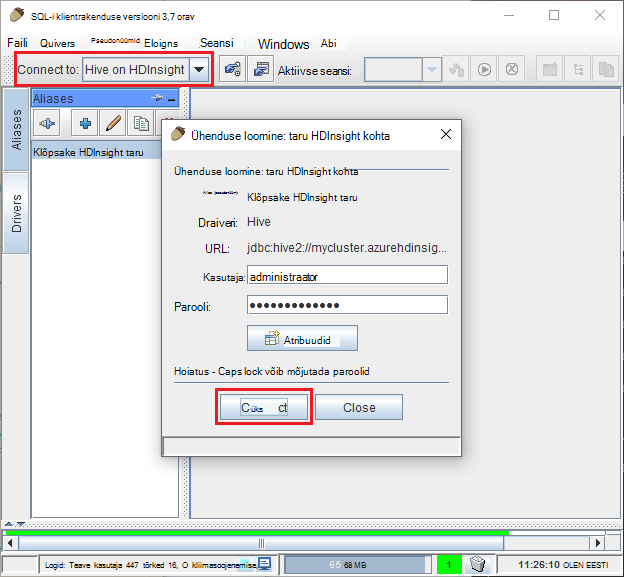

<properties
 pageTitle="JDBC abil päringu taru kohta Windows Azure Hdinsightiga"
 description="Saate teada, kuidas kasutada JDBC ühenduse taru kohta Windows Azure Hdinsightiga ja kaugühenduse teel käivitada päringute pilves talletatud andmed."
 services="hdinsight"
 documentationCenter=""
 authors="Blackmist"
 manager="jhubbard"
 editor="cgronlun"
    tags="azure-portal"/>

<tags
 ms.service="hdinsight"
 ms.devlang="java"
 ms.topic="article"
 ms.tgt_pltfrm="na"
 ms.workload="big-data"
 ms.date="08/23/2016"
 ms.author="larryfr"/>

#Ühenduse loomine taru kohta taru JDBC draiveri kasutamine Windows Azure Hdinsightiga

[AZURE.INCLUDE [ODBC-JDBC-selector](../../includes/hdinsight-selector-odbc-jdbc.md)]

Selles dokumendis saate teada, kuidas kasutada JDBC Java rakendusest kaugühenduse teel esitada taru päringuid mõne Hdinsightiga kobar. Saate teada, kuidas ühendada orav SQL-i klient ja kuidas ühenduse programmiliselt Java.

Taru JDBC kasutajaliidese kohta leiate lisateavet teemast [HiveJDBCInterface](https://cwiki.apache.org/confluence/display/Hive/HiveJDBCInterface).

##Eeltingimused

Selles artiklis toodud juhiseid tegemiseks on vaja järgmist:

* Hadoopi Hdinsightiga kobar. Kas Linux-põhine või Windowsi-põhiste kogumite töötab.

* [Orav SQL-i](http://squirrel-sql.sourceforge.net/). Orav on JDBC kliendi rakendus.

Koostamine ja lingitud käesolevast artiklist näide Java rakenduse käivitada, on vaja järgmist.

* [Java arendaja Kit (JDK) versioon 7](https://www.oracle.com/technetwork/java/javase/downloads/jdk7-downloads-1880260.html) või uuem versioon.

* [Apache Maven](https://maven.apache.org). Maven on projekti luua süsteemi Java projektide jaoks, mida kasutatakse projektiga seotud selles artiklis.

##Ühendusstring

JDBC ühendused on Azure Hdinsightiga kobar tehakse üle 443 ja liiklus on turvatud SSL-i. Avaliku lüüsi, mis rühmad istuda taga suunab liikluse HiveServer2 on tegelikult kuulamise port. Nii tüüpiline ühendusstring järgmiselt:

    jdbc:hive2://CLUSTERNAME.azurehdinsight.net:443/default;ssl=true?hive.server2.transport.mode=http;hive.server2.thrift.http.path=/hive2

Asendage __CLUSTERNAME__ klaster Hdinsightiga nime.

##Autentimine

Kui ühenduse loomisel kasutage Hdinsightiga kobar administraatori nimi ja parool kobar lüüsi autentimiseks. Loomisel JDBC klientide nagu orav SQL-i, peate sisestama administraatori nimi ja parool klientrakenduse sätted.

Java rakendusest, peate kasutama kasutajanimi ja parool sisestada ühenduse loomisel. Näiteks järgmine kood Java avab uue ühenduse ühendusstringi, administraatori nimi ja parool.

    DriverManager.getConnection(connectionString,clusterAdmin,clusterPassword);

##Kasutajaga orav SQL-i kliendile

SQL-i orav on JDBC klient, mida saab kasutada kaugühenduse teel käivitada taru päringute Hdinsightiga klaster. Järgmiste juhiste korral eeldatakse on juba installitud orav SQL-i ja annab teile allalaadimist ja taru draiverid konfigureerimise kaudu.

1. Kopeerige taru JDBC juhtide Hdinsightiga klaster.

    * Kasutamiseks __Linux-põhine Hdinsightiga__, nõutav jar-failide allalaadimiseks toimige järgmiselt.

        1. Looge uus kaust sisaldavad failid. Näiteks `mkdir hivedriver`.

        2. Käsuviip, Bash, PowerShelli või muude käsurea viip, muuta kataloogide uue kataloogi ja Hdinsightiga kobar failide kopeerimiseks kasutada järgmisi käske.

                scp USERNAME@CLUSTERNAME:/usr/hdp/current/hive-client/lib/hive-jdbc*standalone.jar .
                scp USERNAME@CLUSTERNAME:/usr/hdp/current/hadoop-client/hadoop-common.jar .
                scp USERNAME@CLUSTERNAME:/usr/hdp/current/hadoop-client/hadoop-auth.jar .

            Asendage SSH konto kasutajanimi klaster __kasutajanimi__ . Asendage __CLUSTERNAME__ Hdinsightiga kobar nimi.

            > [AZURE.NOTE] Klõpsake Windows keskkonnas, peate PSCP kasuliku scp asemel kasutada. Te saate alla laadida [http://www.chiark.greenend.org.uk/~sgtatham/putty/download.html](http://www.chiark.greenend.org.uk/~sgtatham/putty/download.html).

    * Jaoks __Windowsi-põhiste Hdinsightiga__, kasutage järgmist jar faile alla laadida.

        1. Azure'i portaalis valige Hdinsightiga klaster ja valige __Kaugtöölaua__ ikooni.

            

        2. Kaugtöölaua enne, kasutada ühenduse klaster nuppu __Ühenda__ . Kui kaugtöölaua pole lubatud, vormi abil sisestada kasutajanimi ja parool, seejärel valige __Luba__ kaugtöölaua klaster lubamise kohta.

            

            Pärast valiku __ühendus__, laaditakse RDP-faili. Kasutage seda faili käivitada kaugtöölaua klient. Kui kuvatakse vastav viip, kasutage kasutajanimi ja parool kaugtöölaua juurdepääsu.

        3. Kui ühendus on loodud, kopeerige järgmised failid kaugtöölaua seansi oma arvutisse. Panna neid kohalikku kausta nimega `hivedriver`.

            * C:\apps\dist\hive-0.14.0.2.2.9.1-7\lib\hive-JDBC-0.14.0.2.2.9.1-7-standalone.jar
            * C:\apps\dist\hadoop-2.6.0.2.2.9.1-7\share\hadoop\common\hadoop-Common-2.6.0.2.2.9.1-7.jar
            * C:\apps\dist\hadoop-2.6.0.2.2.9.1-7\share\hadoop\common\lib\hadoop-Auth-2.6.0.2.2.9.1-7.jar

            > [AZURE.NOTE] Versioonide numbrid, teed ja faili nimi võib olla erinev klaster.

        4. Kui olete lõpetanud failide kopeerimine kaugtöölaua katkestada.

3. Käivitage rakendus orav SQL-i. Valige akna vasakus ääres __draiverid__.

    

4. __Draiverite__ dialoogiboksi ülaosas ikoonid, valige soovitud __+__ ikooni Loo uus draiver.

    

5. Dialoogiboksis Lisa draiver lisamine järgmine teave.

    * __Nimi__: taru
    * __Näide URL__: jdbc:hive2://localhost:443/default;ssl=true?hive.server2.transport.mode=http;hive.server2.thrift.http.path=/hive2
    * __Täiendav klassi tee__: jar failide lisamine nuppu Lisa alla laaditud varem kasutamine
    * __Klassi nimi__: org.apache.hive.jdbc.HiveDriver

    

    Klõpsake nende sätete salvestamiseks nuppu __OK__ .

6. Valige orav SQL-i akna vasakus ääres asuval __pseudonüümid__. Klõpsake soovitud __+__ ikooni Loo uus ühendus pseudonüüm.

    

7. Kasutada dialoogiboksi __Lisamine alias (pseudonüüm)__ järgmised väärtused.

    * __Nimi__: taru Hdinsightiga kohta
    * __Draiveri__: ripploendi abil saate valida __taru__ draiver
    * __URL__: jdbc:hive2://CLUSTERNAME.azurehdinsight.net:443/default;ssl=true?hive.server2.transport.mode=http;hive.server2.thrift.http.path=/hive2

        Asendage __CLUSTERNAME__ klaster Hdinsightiga nime.

    * __Kasutajanimi__: Hdinsightiga klaster kobar login konto nimi. Vaikimisi on `admin`.
    * __Parooli__: kobar login konto parooli. See on Hdinsightiga kobar loomisel sisestatud parool.

    

    __Test__ nupu abil saate kontrollida, kas ühendus töötab. Kui __ühenduse: klõpsake Hdinsightiga taru__ dialoogiboks kuvatakse, valige __Loo ühendus__ testida. Kui test õnnestub, kuvatakse __ühendus on loodud__ dialoogiboksi.

    Ühenduse pseudonüüm salvestamiseks kasutage __Pseudonüümi lisamine__ dialoogiboksi allservas nuppu __Ok__ .

8. __Ühenduse__ rippmenüüst ülaosas orav SQL-i, valige __taru Hdinsightiga kohta__. Vastava viiba kuvamisel valige __Loo ühendus__.

    

9. Kui ühendus on loodud, sisestage järgmine päring SQL-päringu dialoogiboks ja seejärel valige ikoon __käivitada__ . Tulemite ala peaks kuva päringu tulemused.

        select * from hivesampletable limit 10;

    

##Ühenduse näiteks Java rakendus

Näiteks Java kliendi päringule taru kasutamine Hdinsightiga on saadaval veebisaidil [https://github.com/Azure-Samples/hdinsight-java-hive-jdbc](https://github.com/Azure-Samples/hdinsight-java-hive-jdbc). Järgige hoidlas, luua ja käivitada valimi.

##Tõrkeotsing

### Ka SQL-i ühendus avamisel ilmnes ootamatu tõrge.

__Sümptomid__: ühendamisel Hdinsightiga kobar, mis on 3.3 või 3.4 versiooni, võidakse kuvada tõrketeade, mis ilmnes ootamatu tõrge. Selle tõrke virnas Jälita alguses järgmised read on:

    java.util.concurrent.ExecutionException: java.lang.RuntimeException: java.lang.NoSuchMethodError: org.apache.commons.codec.binary.Base64.<init>(I)V
    at java.util.concurrent.FutureTas...(FutureTask.java:122)
    at java.util.concurrent.FutureTask.get(FutureTask.java:206)

__Põhjus__: tõrke põhjuseks vastuolu Commonsi-codec.jar faili, mis kasutavad orav ja nõutud taru JDBC komponendid Hdinsightiga kobar alla laadinud.

__Eraldusvõime__: selle tõrke lahendamiseks tehke järgmist.

1. Commonsi kodekifaili jar laadida Hdinsightiga klaster.

        scp USERNAME@CLUSTERNAME:/usr/hdp/current/hive-client/lib/commons-codec*.jar ./commons-codec.jar

2. Väljuge orav ja seejärel minge kataloogi, kus orav on teie arvutisse installitud. Kataloogis orav jaotises selle `lib` kataloogi Asenda olemasolev Commonsi codec.jar on üks alla laadida Hdinsightiga kobar.

3. Taaskäivitage orav. Viga peaks toimuma enam ühendamisel taru Hdinsightiga kohta.

##Järgmised sammud

Nüüd, kui olete õppinud, kuidas kasutada JDBC taru töötamiseks, kasutage järgmisi linke uurida muul viisil töötada Windows Azure Hdinsightiga.

* [Laadi andmed Hdinsightiga](hdinsight-upload-data.md)
* [Hdinsightiga taru kasutamine](hdinsight-use-hive.md)
* [Kasutage siga Hdinsightiga](hdinsight-use-pig.md)
* [Hdinsightiga MapReduce töö kasutamine](hdinsight-use-mapreduce.md)
