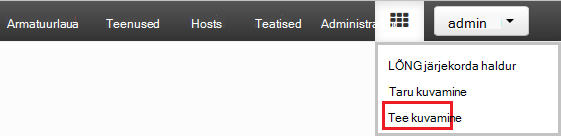

<properties
pageTitle="Ambari Tez vaate kasutamine Hdinsightiga | Azure'i"
description="Saate teada, kuidas silumine Tez tööd Hdinsightiga Ambari Tez vaate abil."
services="hdinsight"
documentationCenter=""
authors="Blackmist"
manager="jhubbard"
editor="cgronlun"/>

<tags
ms.service="hdinsight"
ms.devlang="na"
ms.topic="article"
ms.tgt_pltfrm="na"
ms.workload="big-data"
ms.date="10/04/2016"
ms.author="larryfr"/>

# Silumine Tez tööd Hdinsightiga Ambari vaadete abil

Ambari Web UI Hdinsightiga sisaldab Tez vaadet, mida saab kasutada silumine kui täitmise mootor Tez kasutavate ja mõistmiseks. Vaate Tez võimaldab teil visualiseerida töö ühendatud üksuste diagrammina, minge iga üksuse süvitsi ja tuua statistika ja logiteabe.

> [AZURE.NOTE] Teave selles dokumendis on Linux-põhine Hdinsightiga kogumite. Silumine Tez töö Windowsi-põhiste Hdinsightiga abil leiate teemast [kasutada Tez UI silumine Tez tööd Windowsi-põhiste Hdinsightiga](hdinsight-debug-tez-ui.md).

## Eeltingimused

* Linux-põhine Hdinsightiga kobar. Luua uus klaster juhised leiate teemast [Linux-põhine Hdinsightiga kasutamise alustamine](hdinsight-hadoop-linux-tutorial-get-started.md).

* Tänapäevane veebibrauseri, mis toetab HTML5.

## Tez mõistmine

Tez on suurem kui traditsiooniline MapReduce töötlemise kiirust sisaldava Hadoopi andmete töötlemiseks laiendatav raamistik. Linux-põhine Hdinsightiga kogumite, on vaikimisi mootori mesilaspere.

Kui töö on esitatud Tez, loob see on suunatud atsüklilised graafik (DAG), mis kirjeldab poolt, töö teostamise järjestuse. Üksikute toimingute nimetatakse tipud ning üldise töö tükk käivitada. Tegelik töö kirjeldatud tipp nimetatakse tööülesande ning võib jaotatud üle mitme sõlmed klaster.

### Vaate Tez mõistmine

Vaate Tez pakub teavet protsessid, mis töötavad või teil on varem parandusfunktsiooni Tez abil. Võimaldab vaadata DAG loodud Tez, kuidas levitatakse üle kogumite, nt mälu, mida kasutatakse tööülesannete ja tipud tõrketeabe letid. See võib anda kasulikku teavet järgmistel juhtudel:

* Jälgimise pikaajalisi töötleb kaardi edenemise vaatamine ja tööülesannete vähendada.

* Saate teada, kuidas töötlemine saaks parandada või miks ei õnnestunud või nurjunud protsesside ajalooliste andmete analüüsimine.

## Luua on DAG

Tez vaate sisaldab ainult andmeid, kui tööd, mis kasutab Tez mootor töötab praegu või on juba varem parandusfunktsiooni. Lihtne taru päringute tavaliselt saab kasutamata Tez, kuid keerukamaid päringuid, mis teevad filtreerimine, rühmitamise, tellimine ühendused jne tavaliselt vajavad Tez lahendada.

Järgmiste juhiste abil saate käivitada taru päring, mis käivitatakse Tez abil.

1. Veebibrauseris, liikuge https://CLUSTERNAME.azurehdinsight.net, kus __CLUSTERNAME__ on klaster Hdinsightiga nimi.

2. Valige lehe ülaosas käsku __vaadete__ ikoon. See näeb välja nagu ruutude sarja. Rippmenüü, mis kuvatakse, valige __taru vaade__. 

    

3. Kui taru kuvada laadimise, kleepige järgmine Päringuredaktori sisse ja klõpsake __käivitada__.

        select market, state, country from hivesampletable where deviceplatform='Android' group by market, country, state;
    
    Kui töö on lõpetanud, peaksite nägema väljund kuvatakse jaotises __päringu protsess__ . Tulemused peaks sarnanema järgmisega
    
        market  state       country
        en-GB   Hessen      Germany
        en-GB   Kingston    Jamaica
        
4. Valige vahekaart __Log__ . Kuvatakse järgmine teave:
    
        INFO : Session is already open
        INFO :

        INFO : Status: Running (Executing on YARN cluster with App id application_1454546500517_0063)

    Salvestage __rakenduse id__ väärtus, kui seda kasutatakse järgmises jaotises.

## Tez vaate kasutamine

1. Valige lehe ülaosas käsku __vaadete__ ikoon. Rippmenüü, mis kuvatakse, valige __Tez vaade__.

    

2. Kui Tez vaate laadib, kuvatakse loendi DAGs, mida praegu töötab, või on parandusfunktsiooni klaster. Vaikevaade sisaldab Dag nimi, Id, saatja, olek, alguskellaaeg, lõppaega, kestus, rakenduse ID ja järjekorda. Rohkem veerge saab lisada, lehe paremas servas hammasrattaikooni abil.

    

3. Kui teil on ainult üks kirje, on päring, mis eelmises jaotises käivitasite. Kui teil on mitu kirjet, saate otsida, sisestades rakenduse ID __Rakenduste ID__ -väli ja seejärel vajutage enter.

4. Valige __Dag nimi__. See kuvab teavet DAG, samuti võimalus Laadige alla zip JSON faile, mis sisaldavad teavet DAG.

    

5. __DAG üksikasjad__ üle on mitmeid linke, mida saab kasutada DAG kohta teabe kuvamiseks.

    * __DAG hinnale__ kuvatakse see DAG hinnale teave.
    
    * __Graafilise vaates__ kuvatakse see DAG graafiliselt.
    
    * __Kõik tipud__ kuvab selle DAG tipud loendit.
    
    * __Kõik tööülesanded__ kuvatakse see DAG jaoks kõik tipud tööülesannete loend.
    
    * __Kõik TaskAttempts__ kuvatakse teave selle DAG tööülesannete tähtaeg katsete.
    
    > [AZURE.NOTE] Kui kerite veeru Kuva tipud, tööülesannete ja TaskAttempts, märkate, et seal on linkide kuvamiseks __hinnale__ ja __vaadata või alla logid__ iga rea kohta.

    Kui ilmnes tõrge töö, DAG üksikasjad kuvatakse olek on NURJUNUD, koos linkidega teabele nurjunud tööülesande kohta. Diagnostika teave kuvatakse all DAG üksikasjad.
    
    

7. Valige __graafiline vaade__. Kuvatakse DAG graafiliselt. Saate paigutada hiirega üle iga tipp selle teabe kuvamiseks.

    

8. Klõpsates tipp laaditakse selle üksuse __Tipp üksikasjad__ . __Kaardi 1__ tipp selle üksuse üksikasjade kuvamiseks klõpsake nuppu.

    

9. Pange tähele, et peate lehe ülaosas lingid, mis on seotud tipud ja tööülesannete.

    > [AZURE.NOTE] Sellel lehel saate saabuma ka naasmine __DAG üksikasjad__, valides __Tipp üksikasjad__ja seejärel valides __kaarti 1__ tipp.

    * __Tipp hinnale__ kuvatakse counter tipp see teave.
    
    * __Tööülesanded__ kuvatakse see tipp ülesanded.
    
    * __Tööülesande avaldab__ kuvatakse teave katsete käivitamiseks selle tipp ülesanded.
    
    * __Allikate ja neeldajate__ kuvatakse andmeallikate ja valamud tipp see.

    > [AZURE.NOTE] Kui eelmise kiirmenüü abil saate kerida veeru Kuva tööülesanded, tööülesande katsete, ja andmeallikate ja Sinks__ linkide kuvamiseks rohkem teavet iga üksuse jaoks.

10. Valige __Tööülesanded__ja seejärel valige üksus nimega __00_000000__. __Tööülesande üksikasjad__ kuvatakse selle ülesande jaoks. Selle kuval saate vaadata __Tööülesande hinnale__ ja __Tööülesande katsete__.

    

## Järgmised sammud

Nüüd, kui olete õppinud, kuidas kasutada Tez vaadet, lugege lisateavet [Abil taru Hdinsightiga kohta](hdinsight-use-hive.md).

Vt Täpsemat tehnilist teavet Tez, [Tez leht veebisaidil Hortonworks](http://hortonworks.com/hadoop/tez/).

Hdinsightiga Ambari kasutamise kohta leiate lisateavet teemast [haldamine Hdinsightiga kogumite Ambari Web Kasutajaliidese abil](hdinsight-hadoop-manage-ambari.md)
