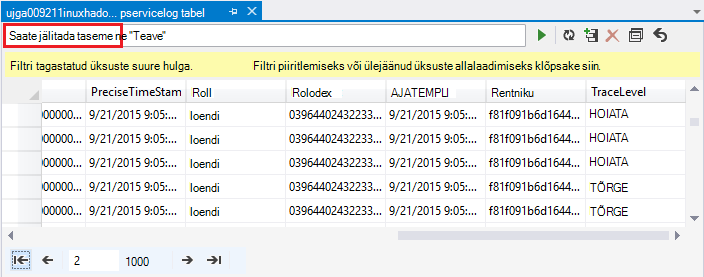

<properties
    pageTitle="Hadoopi rakenduses Hdinsightiga silumine: logide kuvamine ja tõlgendamine tõrketeated | Microsoft Azure'i"
    description="Teavet tõrketeated, mis võidakse kuvada, kui HDInsight PowerShelli kaudu haldamise ja te saate teha taastada."
    services="hdinsight"
    tags="azure-portal"
    editor="cgronlun"
    manager="jhubbard"
    authors="mumian"
    documentationCenter=""/>

<tags
    ms.service="hdinsight"
    ms.workload="big-data"
    ms.tgt_pltfrm="na"
    ms.devlang="na"
    ms.topic="article"
    ms.date="09/02/2016"
    ms.author="jgao"/>

# Analüüsi Hdinsightiga logid

Iga Hadoopi kobar rakenduses Windows Azure Hdinsightiga on kasutada failisüsteemi Azure storage konto. Salvestusruumi konto nimetatakse salvestusruumi konto. Kobar kasutab Azure'i tabelimälu ja selle bloobimälu salvestusruumi vaikekonto selle Logide salvestamine.  Klaster salvestusruumi vaikekonto, lugege teemast [haldamine Hadoopi kogumite Hdinsightiga sisse](hdinsight-administer-use-management-portal.md#find-the-default-storage-account). Logide säilitamise salvestusruumi konto isegi juhul, kui klaster kustutatakse.

##Logide kirjutada Azure'i tabelitele

Azure'i tabelitele kirjutada logid pakuvad ühe taseme, mis toimub mõne Hdinsightiga kobar ülevaate.

Mõne Hdinsightiga kobar loomisel 6 tabelid on automaatselt loodud Linuxi-põhiste kogumite sisse vaikimisi tabelimälu:

- hdinsightagentlog
- Logi
- daemonlog
- hadoopservicelog
- ambariserverlog
- ambariagentlog

3 tabelid on loodud Windowsi-põhiste kogumite:

- SetupLog: Logi sündmuste/erandite tekkinud ettevalmistamise/loomist Hdinsightiga kogumite.
- hadoopinstalllog: Logi sündmuste/erandite klaster Hadoopi installimisel ilmnes. Selles tabelis võib olla kasulik silumine kogumite loodud kohandatud parameetritega seotud probleemid.
- hadoopservicelog: Logi sündmuste/erandite salvestatud kõigi Hadoopi teenused. Selles tabelis võib olla kasulik silumine töö tõrkeid, Hdinsightiga kogumite seotud probleemid.

Tabelinimede fail on **u<ClusterName>DDMonYYYYatHHMMSSsss<TableName>**.

Järgmised tabelid sisaldab järgmised väljad:

- ClusterDnsName
- ComponentName
- EventTimestamp
- Host
- MALoggingHash
- Sõnumi
- N
- PreciseTimeStamp
- Roll
- RowIndex
- Rentniku
- AJATEMPLI
- TraceLevel

### Logide tööriistad

Nendes tabelites andmetele juurdepääsuks saadaval on palju tööriistu.

-  Visual Studio
-  Azure'i salvestusruumi Explorer
-  Power Query for Excel

#### Kasutage Power Query for Excel

Power Query saate installida [www.microsoft.com/en-us/download/details.aspx?id=39379]( http://www.microsoft.com/en-us/download/details.aspx?id=39379). Vaadake allalaadimise lehelt süsteeminõuded

**Power Query abil saate avada ja analüüsida teenuse Logi**

1. Avage **Microsoft Excel**.
2. Klõpsake menüü **Power Query** nuppu **: Azure'i**ja klõpsake **: Microsoft Azure tabelimäluga**.
 
    
3. Sisestage salvestusruumikonto nimi. See võib olla lühike nime või FQDN.
4. Sisestage salvestusruumi konto võti. Peab vaadata tabelite loendi:

    
5. Paremklõpsake paanil **navigaator** tabelit hadoopservicelog ja valige **Redigeeri**. 4 veeru peab näete. Soovi korral saate kustutada **Sektsiooni võti**, **Rida võti**ja **ajatempli** veerud, valides need ja seejärel klõpsake nuppu **Eemalda veerud** suvandite lindi kaudu.
6. Klõpsake ikooni Laienda veergu sisu, et valida veerud, mida soovite Exceli arvutustabeli importimine. See näide valisin TraceLevel ja ComponentName: see saab mulle põhiteave, mis oli probleemid komponendid.

    
7. Klõpsake nuppu **OK** , et importida andmed.
8. Valige **TraceLevel**, rolli ja **ComponentName** veerud ja klõpsake **Group By** juhtelement lindil.
9. Klõpsake nuppu **OK** dialoogiboksis Rühmitusalus
10. Klõpsake nuppu** Rakenda ja Sule**.
 
Exceli abil saate nüüd filtreerimine ja sortimine vastavalt vajadusele. Ilmselt soovite kaasata muude veergude (nt sõnumi), et süvitsiminek probleemid neil tekkida, kuid on eespool kirjeldatud veergude valimist ja rühmitamist pakub korralik pilt, mis toimub Hadoopi teenustega. Sama idee saab rakendada setuplog ja hadoopinstalllog tabelid.

#### Visual Studio kasutamine

**Visual Studio kasutamiseks**

1. Avage Visual Studio.
2. Klõpsake menüü **Vaade** nuppu **Cloud Explorer**. Või klõpsake lihtsalt **klahvikombinatsiooni CTRL +\, klahvikombinatsiooni CTRL + X**.
3. **Cloud Explorer**, valida **Ressursi**.  Muude saadaolevate suvandite on **Ressurss rühmad**.
4. Laiendage **Salvestusruumi kontod**, klaster salvestusruumi vaikekonto ja **tabeleid**.
5. Topeltklõpsake **hadoopservicelog**.
6. Lisage filter. Näiteks:
    
        TraceLevel eq 'ERROR'

    

    Filtrite ehitamine kohta leiate lisateavet teemast [Ehitada Filter stringide tabeli Designer](../vs-azure-tools-table-designer-construct-filter-strings.md).
 
##Logide kirjutada Azure'i bloobimälu

[Azure'i tabelitele kirjutada logid](#log-written-to-azure-tables) pakuvad ühe taseme, mis toimub mõne Hdinsightiga kobar ülevaate. Siiski ei paku nende tabelite tööülesande taseme logid, mis võib olla kasulik süveneda just edasise, kui neil tekkida probleeme. Detailsuse järgmine tase esitada Hdinsightiga kogumite on konfigureeritud kirjutamiseks tööülesande logid bloobimälu kontoga, mis tahes töö, mis on esitatud Templeton kaudu. Praktiliselt tähendab see, kasutades Microsoft Azure'i PowerShelli cmdlet-käskude või .NET töö esitamise API ei RDP/command-liik juurdepääsu klaster tööd töö. 

Logide, Kuva [LÕNG Accessi rakenduste logib Linux-põhine Hdinsightiga](hdinsight-hadoop-access-yarn-app-logs-linux.md).

Vaadake lisateavet logid [lihtsustamine kasutaja logib haldus ja juurdepääsu LÕNG](http://hortonworks.com/blog/simplifying-user-logs-management-and-access-in-yarn/).
 
 
## Kobar seisundi ja töö logide kuvamine

###Accessi Hadoopi kasutajaliides

Klõpsake portaalist Azure Hdinsightiga kobar nime kobar tera avamiseks. Valige keelest kobar **armatuurlaud**.

Küsimise korral sisestage kobar administraatori identimisteave. Klõpsake avanevas konsooli päringu **Hadoopi UI**.

###Accessi lõng kasutajaliides

Klõpsake portaalist Azure Hdinsightiga kobar nime kobar tera avamiseks. Valige keelest kobar **armatuurlaud**. Küsimise korral sisestage kobar administraatori identimisteave. Klõpsake avanevas konsooli päringu **LÕNG UI**.

LÕNG Kasutajaliidese abil saate teha järgmist:

* **Saada kobar olek**. Klõpsake vasakpoolsel paanil laiendage **kobar**, ja klõpsake käsku **kohta**. Selle kohal klaster olek üksikasju, näiteks kokku eraldatud mälu tuuma kasutanud, kobar ressursihaldur olek, klaster versioon jne.

    

* **Saada sõlm olek**. Klõpsake vasakpoolsel paanil laiendage **kobar**, ja klõpsake käsku **sõlmed**. See on loetletud kõik sõlmed kobar, HTTP-aadressi iga sõlme eraldatud iga sõlm jne.

* **Kuvari töö olek**. Klõpsake vasakpoolsel paanil laiendage **kobar**ja valige **rakenduste** loendis klaster tööde haldamine. Kui soovite vaadata töö teatud olekus (nt uus, esitatud, töötab jne), klõpsake jaotises **rakenduste**vastavat linki. Võite klõpsata täpsemaks töö nime Lisateave töö selline, sh väljundi logid jne.

###Accessi HBase kasutajaliides

Klõpsake portaalist Azure Hdinsightiga HBase kobar nime kobar tera avamiseks. Valige keelest kobar **armatuurlaud**. Küsimise korral sisestage kobar administraatori identimisteave. Klõpsake avanevas konsooli päringu **HBase UI**.

## Tõrkekoodid Hdinsightiga

Selles jaotises loetletud tõrketeadete pakutakse aitab kasutajatel, Hadoop rakenduses Windows Azure Hdinsightiga mõista võimaliku vea tingimused, mis neil võib tekkida siis, kui teenuse Azure PowerShelli kaudu haldamise ja nõu toimingud, mida saab taastada viga võtta.

Mõni järgmised tõrketeated võib vaadelda ka portaalis Azure Hdinsightiga kogumite haldamiseks kasutamisel. Kuid muud tõrketeated, mis võivad ilmneda on väiksem Varundustöö tõttu võimalik sellega parandusmeetmed piirangud. Muud tõrketeated on esitatud kontekstis, kus on vähendamiseks on selge. 

### AtleastOneSqlMetastoreMustBeProvided
- **Kirjeldus**: sisestage SQL Azure'i andmebaasi üksikasjad vähemalt üks osa kasutamiseks taru ja Oozie metastores kohandatud sätteid.
- **Vähendamiseks**: kasutaja peab sisestama kehtiv SQL Azure'i metastore ja proovige uuesti taotluse.  

### AzureRegionNotSupported
- **Kirjeldus**: ei saa luua kobar piirkond *nameOfYourRegion*. Kutse uuesti kasutada lubatud Hdinsightiga piirkond.
- **Vähendamiseks**: klient looks kobar piirkond, mis toetab praegu neid: Kagu-Aasia, Lääne Euroopa, Põhja-Euroopa, Ida-USA või Lääne US.  

### ClusterContainerRecordNotFound
- **Kirjeldus**: server ei leia soovitud klaster kirje.  
- **Vähendamiseks**: proovige uuesti.

### ClusterDnsNameInvalidReservedWord
- **Kirjeldus**: kobar DNS-i nimi *yourDnsName* on kehtetu. Veenduge nimi algab ja lõpeb tähtedest ja numbritest koosnev ja võib sisaldada ainult "-" erimärk  
- **Vähendamiseks**: Veenduge, et olete kasutanud kehtiv DNS-i nimi jaoks klaster, mis algab ja lõpeb tähtedest ja numbritest koosnev ja sisaldab pole teisiti märki, välja arvatud kriips "-" ja proovige seejärel uuesti.

### ClusterNameUnavailable
- **Kirjeldus**: kobar nime *yourClusterName* pole saadaval. Valige mõni muu nimi.  
- **Vähendamiseks**: kasutaja peaks määrata clustername, mis on kordumatu ja pole olemas ja proovige uuesti. Kui kasutaja on kasutusel portaali, UI teavitab neid kui kobar nimi on juba kasutusel ajal loomine juhiseid.

### ClusterPasswordInvalid
- **Kirjeldus**: kobar parool on kehtetu. Parool peab olema vähemalt 10 märki peab sisaldama vähemalt ühte numbrit, suurtäht, väike ja ilma tühikuteta erimärk ja sellega kasutajanimi ei tohi sisaldada.  
- **Vähendamiseks**: lubatud kobar parooli ja proovige uuesti.

### ClusterUserNameInvalid
- **Kirjeldus**: kobar kasutajanimi on kehtetu. Veenduge, et kasutajanimi ei sisalda erimärke või tühikuid.  
- **Vähendamiseks**: Sisestage kehtiv kobar kasutajanime ja proovige uuesti.

### ClusterUserNameInvalidReservedWord
- **Kirjeldus**: kobar DNS-i nimi *yourDnsClusterName* on kehtetu. Veenduge nimi algab ja lõpeb tähtedest ja numbritest koosnev ja võib sisaldada ainult "-" erimärk  
- **Vähendamiseks**: sisestage õige DNS-i kobar kasutajanime ja proovige uuesti.

### ContainerNameMisMatchWithDnsName
- **Kirjeldus**: URI *yourcontainerURI* Container nime ja DNS-i nimi *yourDnsName* koosolekukutse kehasse peab olema sama.  
- **Vähendamiseks**: Veenduge, et teie container nimi ja oma DNS-i nimi on samad ja proovige uuesti.

### DataNodeDefinitionNotFound
- **Kirjeldus**: sobimatu kobar konfigureerimine. Ei leia mis tahes andmete sõlm määratlused sõlm suurus.  
- **Vähendamiseks**: proovige uuesti.

### DeploymentDeletionFailure
- **Kirjeldus**: juurutamise kustutamine nurjus klaster jaoks  
- **Vähendamiseks**: kustutamine toimingut.

### DnsMappingNotFound
- **Kirjeldus**: teenuse konfiguratsiooni tõrge. Nõutavad DNS-i vastenduse teavet ei leitud.  
- **Vähendamiseks**: kustutada kobar ja luua uus klaster.

### DuplicateClusterContainerRequest
- **Kirjeldus**: dubleerimine kobar container loomise katse. Jaoks *nameOfYourContainer* kirje olemas, kuid Etags ei vasta.
- **Vähendamiseks**: ümbris kordumatu nimi ja proovige uuesti loomine.

### DuplicateClusterInHostedService
- **Kirjeldus**: majutatud teenuse *nameOfYourHostedService* juba sisaldab klaster. Majutatud teenus ei tohi sisaldada mitut kogumite  
- **Vähendamiseks**: majutada kobar teise majutatud teenuses.

### FailureToUpdateDeploymentStatus
- **Kirjeldus**: server ei saanud värskendada kobar juurutamise olek.  
- **Vähendamiseks**: proovige uuesti. Kui see juhtub mitu korda, võtke ühendust CSS-i.

### HdiRestoreClusterAltered
- **Kirjeldus**: kobar *yourClusterName* on kustutatud hooldus. Palun looge klaster.
- **Vähendamiseks**: klaster uuesti luua.

### HeadNodeConfigNotFound
- **Kirjeldus**: sobimatu kobar konfigureerimine. Nõutav pea sõlme konfiguratsiooni sõlm suuruses ei leitud.
- **Vähendamiseks**: proovige uuesti.

### HostedServiceCreationFailure
- **Kirjeldus**: ei saa luua majutatud teenuse *nameOfYourHostedService*. Proovige uuesti taotluse.  
- **Vähendamiseks**: kutse uuesti.

### HostedServiceHasProductionDeployment
- **Kirjeldus**: majutatud teenuse *nameOfYourHostedService* on juba tootmise juurutamine. Majutatud teenus ei tohi sisaldada mitut tootmise juurutuste. Erinevate kobar nimega kutse uuesti.
- **Vähendamiseks**: kasutada eri kobar nime ja proovige uuesti taotluse.

### HostedServiceNotFound
- **Kirjeldus**: majutatud teenuse *nameOfYourHostedService* jaoks klaster ei leitud.  
- **Vähendamiseks**: kui klaster on tõrkeolekus, kustutage see ja proovige seejärel uuesti.

### HostedServiceWithNoDeployment
- **Kirjeldus**: majutatud teenuse *nameOfYourHostedService* on seotud installimine.  
- **Vähendamiseks**: kui klaster on tõrkeolekus, kustutage see ja proovige seejärel uuesti.

### InsufficientResourcesCores
- **Kirjeldus**: The SubscriptionId *yourSubscriptionId* ei ole tuuma vasakule kobar *yourClusterName*loomiseks. Nõutav: *resourcesRequired*, Saadaval: *resourcesAvailable*.  
- **Vähendamiseks**: ressursid teie tellimus või suurendada ressursse, mis on saadaval tellimus ja proovige uuesti luua klaster.

### InsufficientResourcesHostedServices
- **Kirjeldus**: Tellimuse ID *yourSubscriptionId* ei saa uue HostedService loomiseks kobar *yourClusterName*piirmäära.  
- **Vähendamiseks**: ressursid teie tellimus või suurendada ressursse, mis on saadaval tellimus ja proovige uuesti luua klaster.

### InternalErrorRetryRequest
- **Kirjeldus**: server ilmnes sisemine tõrge. Proovige uuesti taotluse.  
- **Vähendamiseks**: kutse uuesti.

### InvalidAzureStorageLocation
- **Kirjeldus**: Azure'i salvestusruumi asukoht *dataRegionName* pole kehtiv asukoht. Veenduge, et piirkond on õige kutse uuesti.
- **Vähendamiseks**: valige talletuskoht, mis toetab Hdinsightiga, kontrollige, et klaster asub ja proovige uuesti.

### InvalidNodeSizeForDataNode
- **Kirjeldus**: andmete sõlmed sobimatu VM suurust. Kõik andmed sõlmed on toetatud ainult suurte VM-i suurus.  
- **Vähendamiseks**: määrake andmete sõlme toetatud sõlm suurus ja proovige uuesti.

### InvalidNodeSizeForHeadNode
- **Kirjeldus**: pea sõlme sobimatu VM suurust. Ainult ExtraLarge VM-i maht on toetatud pea sõlme.  
- **Vähendamiseks**: määrake pea sõlme jaoks toetatud sõlm suurus ja proovige uuesti

### InvalidRightsForDeploymentDeletion
- **Kirjeldus**: Tellimuse ID *yourSubscriptionId* kasutatava ei saa käivitada Kustutustoimingu kobar *yourClusterName*jaoks piisavaid õigusi.  
- **Vähendamiseks**: kui klaster on tõrkeolekus, kukutage see ja proovige seejärel uuesti.  

### InvalidStorageAccountBlobContainerName
- **Kirjeldus**: välise salvestusruumi konto bloobimälu container nimi *yourContainerName* on kehtetu. Veenduge, et nimi algab tähega ning sisaldab ainult väiketähed, arvude ja mõttekriipsu.  
- **Vähendamiseks**: Määrake sobiv salvestusruumi konto bloobimälu container nimi ja proovige uuesti.

### InvalidStorageAccountConfigurationSecretKey
- **Kirjeldus**: konfigureerimine välise salvestusruumi konto *yourStorageAccountName* peavad olema salajane olulisi üksikasju, et määrata.  
- **Vähendamiseks**: Määrake sobiv salajane võti salvestusruumi konto ja proovige uuesti.

### InvalidVersionHeaderFormat
- **Kirjeldus**: Version päise *yourVersionHeader* pole lubatud vormingus, aaaa-mm-dd.  
- **Vähendamiseks**: Määrake sobiv vorming versioon päise- ja proovige uuesti taotluse.

### MoreThanOneHeadNode
- **Kirjeldus**: sobimatu kobar konfigureerimine. Leitud rohkem kui üks pea sõlme konfigureerimine.  
- **Vähendamiseks**: muuta konfiguratsiooni nii, et selle onloy ühe pea sõlme on määratud.

### OperationTimedOutRetryRequest
- **Kirjeldus**: toimingut ei saa lõpetada lubatud aja jooksul või maksimaalne uuesti avaldab võimalik. Proovige uuesti taotluse.  
- **Vähendamiseks**: kutse uuesti.

### ParameterNullOrEmpty
- **Kirjeldus**: parameetri *yourParameterName* ei saa null või tühi.  
- **Vähendamiseks**: määrake parameetri jaoks sobiv väärtus.

### PreClusterCreationValidationFailure
- **Kirjeldus**: üks või mitu kobar loomise taotluse sisendeid on kehtetu. Veenduge, et sisestatud andmed on õiged ja proovige uuesti taotluse.  
- **Vähendamiseks**: Veenduge, et sisestatud andmed on õiged ja proovige uuesti taotluse.

### RegionCapabilityNotAvailable
- **Kirjeldus**: piirkond võimalus pole saadaval, piirkond *yourRegionName* ja Tellimuse ID *yourSubscriptionId*.  
- **Vähendamiseks**: määrake piirkond, mis toetab Hdinsightiga kogumite. Avalikult toetatud regioonide on: Kagu-Aasia, Lääne Euroopa, Põhja-Euroopa, Ida-USA või Lääne US.

### StorageAccountNotColocated
- **Kirjeldus**: salvestusruumi konto *yourStorageAccountName* on piirkond *currentRegionName*. See peaks olema sama mis kobar piirkond *yourClusterRegionName*.  
- **Vähendamiseks**: määrake salvestusruumi konto klaster on sama piirkonnas või kui teie andmed on juba salvestusruumi konto, luua uus klaster piirkonna olemasoleva salvestusruumi konto. Kui kasutate portaali, UI sellest need probleemi ette.

### SubscriptionIdNotActive
- **Kirjeldus**: antud tellimuse ID *yourSubscriptionId* pole aktiivne.  
- **Vähendamiseks**: oma tellimuse uuesti aktiveerimiseks või hankige kehtiv uude tellimusse.

### SubscriptionIdNotFound
- **Kirjeldus**: Tellimuse ID *yourSubscriptionId* ei leitud.  
- **Vähendamiseks**: Veenduge, et teie tellimuse ID on lubatud ja proovige uuesti.

### UnableToResolveDNS
- **Kirjeldus**: ei saa lahendada DNS-i *yourDnsUrl*. Veenduge, et täielik URL-i lõpp-punkti bloobimälu on esitatud.  
- **Vähendamiseks**: esitama kehtiv bloobimälu URL-i. URL-i peab olema täielikult kehtiv, sh *http://* ja lõpeb on *.com*.

### UnableToVerifyLocationOfResource
- **Kirjeldus**: ei saa kontrollida ressursi *yourDnsUrl*asukoht. Veenduge, et täielik URL-i lõpp-punkti bloobimälu on esitatud.  
- **Vähendamiseks**: esitama kehtiv bloobimälu URL-i. URL-i peab olema täielikult kehtiv, sh *http://* ja lõpeb on *.com*.

### VersionCapabilityNotAvailable
- **Kirjeldus**: versiooni võimalus pole saadaval versioonis *specifiedVersion* ja Tellimuse ID *yourSubscriptionId*.  
- **Vähendamiseks**: valige versioon, mis on saadaval ja proovige uuesti.

### VersionNotSupported
- **Kirjeldus**: versiooni *specifiedVersion* ei toetata.
- **Vähendamiseks**: valige versioon, mis on toetatud ja proovige uuesti.

### VersionNotSupportedInRegion
- **Kirjeldus**: versiooni *specifiedVersion* ei ole saadaval Azure piirkond *specifiedRegion*.  
- **Vähendamiseks**: valige versioon, mis on toetatud määratud piirkonna ja proovige uuesti.

### WasbAccountConfigNotFound
- **Kirjeldus**: sobimatu kobar konfigureerimine. Nõutav WASB konto konfigureerimine välise kontod ei leitud.  
- **Vähendamiseks**: Veenduge, et konto on olemas ja on õigesti määratud konfiguratsiooni ja proovige uuesti.

## Järgmised sammud

- [Silumine Tez tööd HDInsight Ambari vaadete abil](hdinsight-debug-ambari-tez-view.md)
- [Hunnik puistab Hadoopi Hdinsightiga Linuxi-põhiste teenuste lubamine](hdinsight-hadoop-collect-debug-heap-dump-linux.md)
- [Haldamine Hdinsightiga kogumite Ambari Web Kasutajaliidese abil](hdinsight-hadoop-manage-ambari.md)
