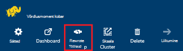
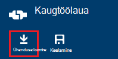
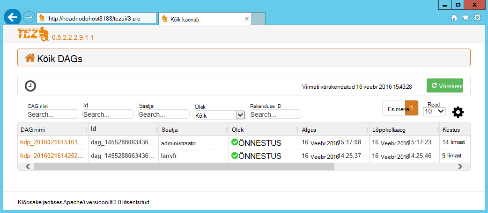
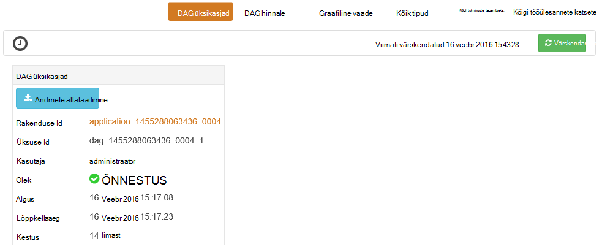
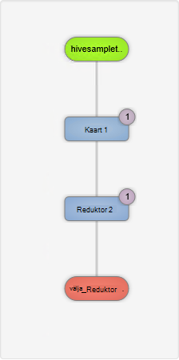
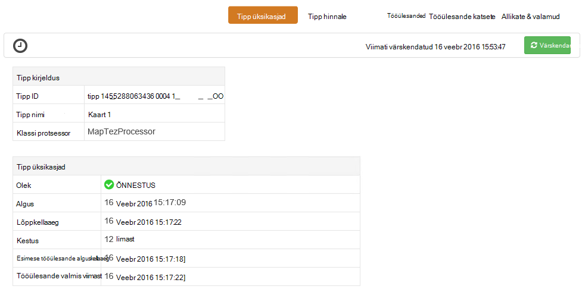
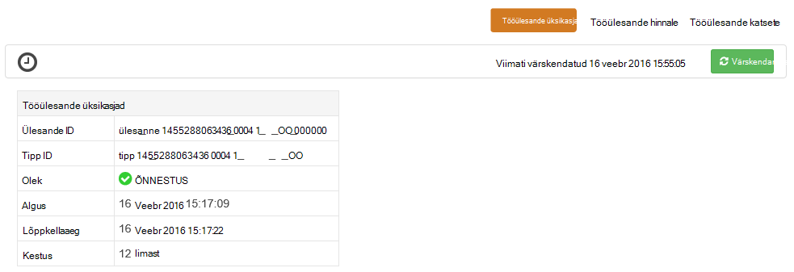

<properties
pageTitle="Windowsi-põhiste Hdinsightiga Tez Kasutajaliidese abil | Azure'i"
description="Saate teada, kuidas silumine Tez tööd Windowsi-põhiste Hdinsightiga Hdinsightiga Tez Kasutajaliidese abil."
services="hdinsight"
documentationCenter=""
authors="Blackmist"
manager="jhubbard"
editor="cgronlun"/>

<tags
ms.service="hdinsight"
ms.devlang="na"
ms.topic="article"
ms.tgt_pltfrm="na"
ms.workload="big-data"
ms.date="10/04/2016"
ms.author="larryfr"/>

# Windowsi-põhiste Hdinsightiga Tez tööd silumine Tez UI abil

Tez UI on mõista ja silumine kui täitmise mootor sisse Windowsi-põhiste Hdinsightiga kogumite Tez kasutavate kasutatavate veebilehele. Tez UI võimaldab teil visualiseerida töö ühendatud üksuste diagrammina, minge iga üksuse süvitsi ja tuua statistika ja logiteabe.

> [AZURE.NOTE] Teave selles dokumendis on Windowsi-põhiste Hdinsightiga kogumite. Vaatamine ja silumine Tez Linux-põhine Hdinsightiga kohta leiate teemast [Kasutamine Ambari vaated silumine Hdinsightiga Tez tööd](hdinsight-debug-ambari-tez-view.md).

## Eeltingimused

* Windowsi-põhiste Hdinsightiga kobar. Juhised uus klaster loomise kohta leiate teemast [Windowsi-põhiste Hdinsightiga kasutamise alustamine](hdinsight-hadoop-tutorial-get-started-windows.md).

    > [AZURE.IMPORTANT] Tez UI on loodud pärast 8 veebruar 2016 Windowsi-põhiste Hdinsightiga kogumite saadaval ainult.

* Windowsi-põhiste kaugtöölaua kliendi.

## Tez mõistmine

Tez on suurem kui traditsiooniline MapReduce töötlemise kiirust sisaldava Hadoopi andmete töötlemiseks laiendatav raamistik. Windowsi-põhiste Hdinsightiga kogumite, on valikuline engine, et mesilaspere taru päringu osana järgmise käsu abil saate lubada:

    set hive.execution.engine=tez;

Kui töö on esitatud Tez, loob see on suunatud atsüklilised graafik (DAG), mis kirjeldab poolt, töö teostamise järjestuse. Üksikute toimingute nimetatakse tipud ning üldise töö tükk käivitada. Tegelik töö kirjeldatud tipp nimetatakse tööülesande ning võib jaotatud üle mitme sõlmed klaster.

### Tez UI mõistmine

Tez UI on veebilehe leiate teavet protsessid, mis töötavad või teil on varem parandusfunktsiooni Tez abil. Võimaldab vaadata DAG loodud Tez, kuidas levitatakse üle kogumite, nt mälu, mida kasutatakse tööülesannete ja tipud tõrketeabe letid. See võib anda kasulikku teavet järgmistel juhtudel:

* Jälgimise pikaajalisi töötleb kaardi edenemise vaatamine ja tööülesannete vähendada.

* Saate teada, kuidas töötlemine saaks parandada või miks ei õnnestunud või nurjunud protsesside ajalooliste andmete analüüsimine.

## Luua on DAG

Tez UI sisaldab ainult andmeid, kui tööd, mis kasutab Tez mootor töötab praegu või on juba varem parandusfunktsiooni. Lihtne taru päringute tavaliselt saab kasutamata Tez, kuid keerukamaid päringuid, mis teevad filtreerimine, rühmitamise, tellimine ühendused jne tavaliselt vajavad Tez lahendada.

Järgmiste juhiste abil saate käivitada taru päring, mis käivitatakse Tez abil.

1. Veebibrauseris, liikuge https://CLUSTERNAME.azurehdinsight.net, kus __CLUSTERNAME__ on klaster Hdinsightiga nimi.

2. Valige lehe ülaosas käsku __Redaktori taru__. See kuvab lehe näiteks järgmine päring.

        Select * from hivesampletable

    Näide päringu kustutada ja asendage see järgmist.

        set hive.execution.engine=tez;
        select market, state, country from hivesampletable where deviceplatform='Android' group by market, country, state;

3. Klõpsake nuppu __Edasta__ . Klõpsake lehe allosas jaotise __Töö seansi__ kuvab päringu oleku. Kui olekuks on __lõpule viidud__, valige tulemuste vaatamiseks linki __Kuva üksikasjad__ . __Töö väljund__ peaks olema umbes järgmine:
        
        en-GB   Hessen      Germany
        en-GB   Kingston    Jamaica
        en-GB   Nairobi Area    Kenya

## Kasutage Tez kasutajaliides

> [AZURE.NOTE] Tez UI on saadaval, kobar pea sõlmed töölaualt ainult nii, et peate kasutama kaugtöölaua ühenduse pea sõlmed.

1. Valige [Azure portaali](https://portal.azure.com)Hdinsightiga klaster. Valige Hdinsightiga tera ülaosas __Kaugtöölaua__ ikoon. See kuvab Remote'i töölaua tera

    

2. Valige keelest kaugtöölaua __ühendus__ kobar pea sõlme ühendamiseks. Kui kuvatakse vastav viip, kasutage autentida kobar kaugtöölaua kasutajanimi ja parool.

    

    > [AZURE.NOTE] Kui teil on lubatud kaugtöölaua ühendus, kasutajanimi, parool ja aegumiskuupäeva ja seejärel valige __Luba__ kaugtöölaua lubamiseks. Kui see on lubatud, kasutage ühendamiseks eelmisi juhiseid.

3. Kui ühendus on loodud, avage Internet Explorer Remote'i töölaua, valige brauseri paremas ülaservas hammasrattaikooni ja valige __Ühilduvust vaate sätted__.

4. __Ühilduvuse vaatesätted__alt, tühjendage ruut __Kuva sisevõrgu saitide ühilduvuse vaates__ ja __kasutada Microsofti ühilduvus on loetletud__ja seejärel valige __Sule__.

5. Internet Exploreris, liikuge sirvides http://headnodehost:8188/tezui / #/. See kuvab Tez kasutajaliides

    

    Kui Tez UI laadib, kuvatakse loendi DAGs, mida praegu töötab, või on parandusfunktsiooni klaster. Vaikevaade sisaldab Dag nimi, Id, saatja, olek, alguskellaaeg, lõppaega, kestus, rakenduse ID ja järjekorda. Rohkem veerge saab lisada, lehe paremas servas hammasrattaikooni abil.

    Kui teil on ainult üks kirje, on päring, mis eelmises jaotises käivitasite. Kui teil on mitu kirjet, saate otsida kohal olevat DAGs väljadel otsingukriteeriumide sisestamise abil, siis vajutage __sisestusklahvi__.

4. Valige __Dag nimi__ DAG viimase kirje. See kuvab teavet DAG, samuti võimalus Laadige alla zip JSON faile, mis sisaldavad teavet DAG.

    

5. __DAG üksikasjad__ üle on mitmeid linke, mida saab kasutada DAG kohta teabe kuvamiseks.

    * __DAG hinnale__ kuvatakse see DAG hinnale teave.
    
    * __Graafilise vaates__ kuvatakse see DAG graafiliselt.
    
    * __Kõik tipud__ kuvab selle DAG tipud loendit.
    
    * __Kõik tööülesanded__ kuvatakse see DAG jaoks kõik tipud tööülesannete loend.
    
    * __Kõik TaskAttempts__ kuvatakse teave selle DAG tööülesannete tähtaeg katsete.
    
    > [AZURE.NOTE] Kui kerite veeru Kuva tipud, tööülesannete ja TaskAttempts, märkate, et seal on linkide kuvamiseks __hinnale__ ja __vaadata või alla logid__ iga rea kohta.

    Kui ilmnes tõrge töö, DAG üksikasjad kuvatakse olek on NURJUNUD, koos linkidega teabele nurjunud tööülesande kohta. Diagnostika teave kuvatakse all DAG üksikasjad.

7. Valige __graafiline vaade__. Kuvatakse DAG graafiliselt. Saate paigutada hiirega üle iga tipp selle teabe kuvamiseks.

    

8. Klõpsates tipp laaditakse selle üksuse __Tipp üksikasjad__ . __Kaardi 1__ tipp selle üksuse üksikasjade kuvamiseks klõpsake nuppu. Valige kinnitamiseks navigeerimise __kinnitamine__ .

    

9. Pange tähele, et peate lehe ülaosas lingid, mis on seotud tipud ja tööülesannete.

    > [AZURE.NOTE] Sellel lehel saate saabuma ka naasmine __DAG üksikasjad__, valides __Tipp üksikasjad__ja seejärel valides __kaarti 1__ tipp.

    * __Tipp hinnale__ kuvatakse counter tipp see teave.
    
    * __Tööülesanded__ kuvatakse see tipp ülesanded.
    
    * __Tööülesande avaldab__ kuvatakse teave katsete käivitamiseks selle tipp ülesanded.
    
    * __Allikate ja neeldajate__ kuvatakse andmeallikate ja valamud tipp see.

    > [AZURE.NOTE] Kui eelmise kiirmenüü abil saate kerida veeru Kuva tööülesanded, tööülesande katsete, ja andmeallikate ja Sinks__ linkide kuvamiseks rohkem teavet iga üksuse jaoks.

10. Valige __Tööülesanded__ja seejärel valige üksus nimega __00_000000__. __Tööülesande üksikasjad__ kuvatakse selle ülesande jaoks. Selle kuval saate vaadata __Tööülesande hinnale__ ja __Tööülesande katsete__.

    

## Järgmised sammud

Nüüd, kui olete õppinud, kuidas kasutada Tez vaadet, lugege lisateavet [Abil taru Hdinsightiga kohta](hdinsight-use-hive.md).

Vt Täpsemat tehnilist teavet Tez, [Tez leht veebisaidil Hortonworks](http://hortonworks.com/hadoop/tez/).
