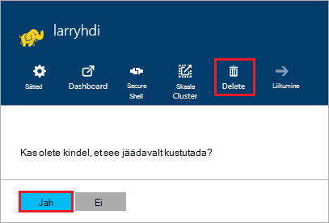

<properties
pageTitle="Kuidas kustutada mõne Hdinsightiga kobar | Azure'i"
description="Kui kustutate mõne Hdinsightiga kobar mitmesuguseid võimalusi teave."
services="hdinsight"
documentationCenter=""
authors="Blackmist"
manager="jhubbard"
editor="cgronlun"/>

<tags
ms.service="hdinsight"
ms.devlang="na"
ms.topic="article"
ms.tgt_pltfrm="na"
ms.workload="big-data"
ms.date="10/28/2016"
ms.author="larryfr"/>

#Kuidas kustutada mõne Hdinsightiga kobar

Hdinsightiga kobar arveldus käivitamise kui klaster on loodud ja peatub, kui klaster kustutatakse ja on proportsionaalse minutis, et alati kustutada klaster, kui see pole enam kasutuses. Selles dokumendis saate teada, kuidas kustutada Azure portaali, Azure PowerShelli ja Azure CLI klaster.

> [AZURE.IMPORTANT] Mõne Hdinsightiga kobar kustutamisel ei kustutata seostatud klaster Azure Storage kontod. See võimaldab teil säilitada ja uuesti kasutada mis tahes klaster talletatud andmed.

##Azure'i portaal

1. [Azure'i portaali](https://portal.azure.com) sisse logida ja valige Hdinsightiga klaster. Kui Hdinsightiga klaster on kinnitatud armatuurlaud, otsimiseks selle nimi otsinguväljale (suurendusklaasi ikooni), kasutades navigeerimisriba paremal.

    

2. Kui tera avaneb klaster jaoks, valige ikooni __Kustuta__ . Vastava viiba kuvamisel valige __Jah__ klaster kustutada.

    

##Azure'i PowerShelli

PowerShelli käsuviiba kaudu, kasutage kustutamiseks klaster järgmine käsk:

    Remove-AzureRmHDInsightCluster -ClusterName CLUSTERNAME

Asendage __CLUSTERNAME__ klaster Hdinsightiga nime.

##Azure'i CLI

Käsuviiba kaudu, kasutage klaster kustutamiseks järgmist:

    azure hdinsight cluster delete CLUSTERNAME
    
Asendage __CLUSTERNAME__ klaster Hdinsightiga nime.
