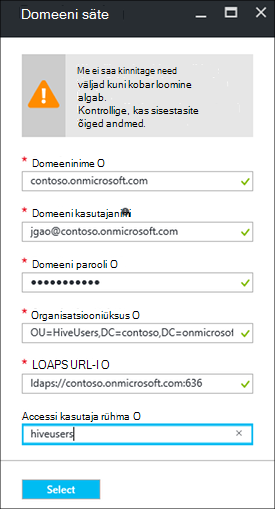

<properties
    pageTitle="Domeeni ühendatud Hdinsightiga kogumite konfigureerimine | Microsoft Azure'i"
    description="Saate teada, kuidas häälestada ja konfigureerida domeeni ühendatud Hdinsightiga kogumite"
    services="hdinsight"
    documentationCenter=""
    authors="saurinsh"
    manager="jhubbard"
    editor="cgronlun"
    tags=""/>

<tags
    ms.service="hdinsight"
    ms.devlang="na"
    ms.topic="article"
    ms.tgt_pltfrm="na"
    ms.workload="big-data"
    ms.date="10/26/2016"
    ms.author="saurinsh"/>

# Konfigureerida domeeni ühendatud Hdinsightiga kogumite (eelvaade)

Saate teada, kuidas häälestada mõne Windows Azure Hdinsightiga kobar Azure Active Directory (Azure AD) ja [Apache Ranger](http://hortonworks.com/apache/ranger/) tugeva autentimise ja rikkaliku Rollipõhine pääsu juhtimine (RBAC) poliitikate eeliseid.  Domeeni ühendatud Hdinsightiga saab konfigureerida ainult Linuxi-põhiste kogumite kohta. Lisateabe saamiseks vt [tutvustamine domeeni ühendatud Hdinsightiga kogumite](hdinsight-domain-joined-introduction.md).

See artikkel on sarja esimene õpetus:

- Luua Apache Ranger lubatud Hdinsightiga kobar, mis ühendatud Azure AD (kaudu Azure'i Directory domeeniteenused võimalus).
- Loomine ja taru poliitikate kaudu Apache Ranger ja lubada kasutajatel (nt andmeteadlaste) ühenduse taru abil ODBC-põhiste tööriistad, näiteks Exceli sellele jne. Microsoft teeb koostööd muude töökoormus, nt HBase, säde ja Storm, domeeni ühendatud Hdinsightiga kiiresti lisamise kohta.

Lõplik topoloogia näide näeb välja järgmine:

Kuna Azure AD praegu toetab ainult klassikaline virtuaalne võrkude (VNets) ja Linux-põhine Hdinsightiga kogumite ainult tugi Azure ressursihaldur vastavalt VNets, Hdinsightiga Azure AD integreerimise jaoks on vaja kahte VNets ja nende vahel silmitsemine. Kahe juurutamise mudelite vahel võrdluse leiate teemast [Azure ressursihaldur vs klassikaline juurutamise: mõista juurutamise mudelite ja oma seisundi](../resource-manager-deployment-model.md). Kahe VNets peab olema sama piirkonna Azure AD DS.

Azure'i teenus nimed peavad olema kordumatud globaalselt. Selles õpetuses kasutatakse järgmist nimesid. Contoso on väljamõeldud nimi. *Contoso* peate asendama mõni muu nimi, kui lähete õpetuse kaudu. 
    
**Nimed:**

|Atribuut|Väärtus|
|--------|-----|
| Azure'i AD VNet|contosoaadvnet|
| Azure AD virtuaalse masina (VM)|contosoaadadmin. See VM kasutatakse konfigureerimine Organisatsiooniüksus ja DNS-i tsooni tühistada.|
| Azure'i AD-kataloog|contosoaaddirectory|
| Azure'i AD domeeni nimi|contoso (contoso.onmicrosoft.com)|
| Hdinsightiga VNet|contosohdivnet|
| Hdinsightiga VNet ressursirühm|contosohdirg|
| Hdinsightiga kobar|contosohdicluster|

Selle õpetuse juhised domeeni ühendatud Hdinsightiga kobar konfigureerida. Iga jaotise on tausta rohkem teavet teiste artiklite linke.

## Nõutav:

- Tutvumine [Azure AD domeeniteenused](https://azure.microsoft.com/services/active-directory-ds/) [hinnad](https://azure.microsoft.com/pricing/details/active-directory-ds/) struktuurist.
- Veenduge, et teie tellimus on whitelisted selle avaliku eelvaade. Saate seda teha, saates e-posti hdipreview@microsoft.com oma tellimuse ID-ga.
- Oma domeeni allkirjastamiseks asutuse allkirjastatud SSL-sert. Serdi on vajalik turvaline LDAP konfigureerimisega. Ei saa kasutada iseallkirjastatud serdid.

## Juhised

1. Luua oma Azure AD on Azure klassikaline VNet.  
2. Loomine ja konfigureerimine Azure AD ja Azure AD DS.
3. Klassikaline VNet loomise Organisatsiooniüksus VM lisada. 
4. Saate luua ka Organisatsiooniüksus Azure AD DS.
5. Luua ka Hdinsightiga VNet Azure ressursside juhtimist.
6. Install tühistada DNS-i tsoonid Azure AD DS.
6. Omavahelistes kahe VNets.
7. Saate luua ka Hdinsightiga kobar.

> [AZURE.NOTE] Selle õpetuse eeldab, et teil on mõni Azure AD. Kui teil on üks, võite osa toimingus 2 vahele jätta.
    
## Mõne Azure klassikaline VNet loomine

Selles jaotises saate luua klassikaline VNet, Azure'i portaalis. Järgmise jaotise lubate Azure AD DS oma Azure AD klassikaline VNet sisse. Järgmiste toimingute ja kasutamise muud VNet loomise kohta leiate lisateavet teemast [loomine (klassikaline), kasutades Azure portaali virtuaalse võrgus](../virtual-network/virtual-networks-create-vnet-classic-portal.md).

**Klassikaline VNet loomiseks**

1. [Azure'i portaali](https://portal.azure.com)sisse logida. 
2. Klõpsake nuppu **Uus** > **Networking** > **virtuaalse võrgu**.
3. **Valige juurutamise mudeli**, valige **klassikaline**ja seejärel klõpsake nuppu **Loo**.
4. Sisestage või valige järgmised väärtused:

    - **Nimi**: contosoaadvnet
    - **Aadressiruumi**: 10.1.0.0/16
    - **Alamvõrgu nimi**: Subnet1
    - **Alamvõrgu aadress vahemiku**: 10.1.0.0/24
    - **Tellimus**: (valige see VNet loomiseks kasutatud tellimuse).
    - **ResourceGroup**:
    - **Asukoht**: (valige regioon klaster Hdinsightiga.)

        > [AZURE.IMPORTANT] Peate valima asukoht, mis toetab Azure AD DS. Lisateabe saamiseks vt [tooted on saadaval regiooniti](https://azure.microsoft.com/en-us/regions/services/). 
        >
        > Klassikaline VNet nii ressursi rühma VNet peab olema sama piirkonna Azure AD DS.

5. Klõpsake nuppu **Loo** on VNet loomiseks.

## Loomine ja konfigureerimine oma Azure AD Azure AD DS

Selles jaotises saate küll:

1. Luua Azure AD.
2. Azure AD kasutajate loomiseks. Need kasutajad on domeeni kasutajad. Saate kasutada esimene Kasutaja seadistamine Hdinsightiga kobar Azure AD.  Kaks kasutajat valikulised selles õpetuses. Need on kasutada [domeeni ühendatud Hdinsightiga kogumite poliitikate konfigureerimine taru](hdinsight-domain-joined-run-hive.md) Apache Ranger poliitikate konfigureerimisel.
3. AAD näiteks Põhiliselt administraatorite rühma loomine ja Azure AD kasutaja lisamiseks rühma. Selle kasutaja abil saate luua soovitud Organisatsiooniüksus.
4. Luba Azure AD Azure AD domeeni teenused (Azure AD DS).
7. Azure AD LDAPS konfigureerimine. Lightweight Directory Access Protocol (LDAP) abil lugemise ja kirjutamise Azure AD.

Kui eelistate kasutada mõne olemasoleva Azure AD, võite juhiseid 1 ja 2 vahele jätta.

**Kui soovite luua Azure AD**

1. [Azure'i klassikaline portaalis](https://manage.windowsazure.com), klõpsake nuppu **Uus** > **Rakenduse teenuste** > **Active Directory** > **Directory** > **Kohandatud loomine**. 
3. Sisestage või valige järgmised väärtused:

    - **Nimi**: contosoaaddirectory
    - **Domeeninime**: contoso.  See nimi peab olema globaalselt kordumatu.
    - **Riik või regioon**: valige oma riik või regioon.
4. Klõpsake nuppu **valmis**.

**Azure'i AD kasutaja loomine**

1. [Azure'i klassikaline portaalis](https://manage.windowsazure.com), klõpsake käsku **Active Directory** -> **contosoaaddirectory**. 
3. Klõpsake linki **Kasutajad** , ülalt menüüst.
4. Klõpsake nuppu **Lisa kasutaja**.
4. Sisestage **Kasutaja nimi**ja klõpsake siis nuppu **edasi**. 
5. Konfigureerida kasutajaprofiile; Valige **roll**, **Üldadministraator**; ja seejärel klõpsake nuppu **edasi**.  Üldadministraatori rolliga on vaja organisatsiooniliste üksuste loomine.
6. Klõpsake nuppu **Loo** saada ajutine parool.
7. Kopeerimiseks parool ja seejärel klõpsake nuppu **valmis**. Allpool olevat selles õpetuses kasutate selle üldadministraator kasutaja administraator VM sisse logima Organisatsiooniüksus loomise ja vastupidise DNS-i konfigureerimine.

Kasutage sama toimingut, luua kaks kasutajaid **kasutaja** rolli, hiveuser1 ja hiveuser2. Järgmiste kasutajate kasutatakse [domeeni ühendatud Hdinsightiga kogumite poliitikate konfigureerimine taru](hdinsight-domain-joined-run-hive.md).

**AAD näiteks Põhiliselt administraatorite rühma loomine ja Azure AD kasutaja lisamine**

1. [Azure'i klassikaline portaalis](https://manage.windowsazure.com), klõpsake käsku **Active Directory** > **contosoaaddirectory**. 
3. Klõpsake ülemisel menüüst **rühmad** .
4. Klõpsake nuppu **Lisa rühm** või **lisa rühma**.
5. Sisestage või valige järgmised väärtused:

    - **Nimi**: AAD näiteks Põhiliselt administraatorid.  Ärge muutke rühma nime.
    - **Rühma tüüp**: turvalisus.
6. Klõpsake nuppu **valmis**.
7. Klõpsake **AAD näiteks Põhiliselt administraatorite** rühma avamiseks.
8. Klõpsake nuppu **Lisa liikmeid**.
9. Valige esimene kasutaja eelmises juhises loodud ja seejärel klõpsake nuppu **valmis**.
10. Korrake samu juhiseid teise rühma nimega **HiveUsers**loomiseks ja nende kahe taru kasutajate lisamine rühma.

Lisateabe saamiseks vaadake [Azure AD domeeniteenused (eelvaade) – luua ' AAD näiteks Põhiliselt administraatorite ' rühma](../active-directory-domain-services/active-directory-ds-getting-started.md).

**Azure'i AD DS oma Azure AD lubamise kohta**

1. [Azure'i klassikaline portaalis](https://manage.windowsazure.com), klõpsake käsku **Active Directory** > **contosoaaddirectory**. 
3. Klõpsake nuppu **Konfigureeri** ülalt menüüst.
4. Kerige **Domeeni teenuste**ja määrake järgmised väärtused:

    - **Luba selle kataloogi domeeniteenused**: Jah.
    - **Domeeni teenuste DNS-i domeeninimi**: see näitab Azure'i directory vaikimisi DNS-i nimi. Näiteks contoso.onmicrosoft.com.
    - **Selle virtuaalse võrguga ühenduse loomine domeeniteenused**: valige varem loodud, st **contosoaadvnet**klassikaline virtuaalse võrgu.
    
6. Klõpsake lehe allosas **salvestada** . Kuvatakse **pooleli...** kõrval **lubada domeeniteenused selle kausta jaoks**.  
7. Oodake, kuni **pooleli...** kaob, ja **IP-aadressi** saab täidetud. Kaks IP-aadressid on täidetud saada. Need on IP-aadresside hulka kuuluvad selle domeeni ette valmistatud domeeni teenused. Iga IP-aadress on nähtav, kui vastav domeenikontrolleri on ettevalmistatud ja kasutusvalmis. Kirjutage kaks IP-aadressid. Te peate neid hiljem.

Lisateabe saamiseks lugege teemat [Azure AD domeeniteenused (eelvaade) – lubada Azure AD domeeniteenused](../active-directory-domain-services/active-directory-ds-getting-started-enableaadds.md).

**Parooli sünkroonimiseks**

Kui kasutate oma domeeni, peate sünkroonima parool. Vt [lubamine parooli sünkroonimine Azure AD domeeniteenused vaid Azure AD directory](../active-directory-domain-services/active-directory-ds-getting-started-password-sync.md).

**Konfigureerida LDAPS Azure AD**

1. Saada allkirjastatud allkirjastamiseks asutuse domeeni jaoks SSL-sert. Ei saa kasutada iseallkirjastatud serdid. Kui te ei saa SSL-sert, palun jõuda hdipreview@microsoft.com erand.
1. [Azure'i klassikaline portaalis](https://manage.windowsazure.com), klõpsake käsku **Active Directory** > **contosoaaddirectory**. 
3. Klõpsake nuppu **Konfigureeri** ülalt menüüst.
4. Liikuge kerides **domeeniteenused**.
5. Klõpsake nuppu **Konfigureeri sert**.
6. Järgige juhiseid, et määrata serdi faili ja parool. Kuvatakse **pooleli...** kõrval **lubada domeeniteenused selle kausta jaoks**.  
7. Oodake, kuni **pooleli...** kaob, ja **Secure LDAP serdi** kas teil on täidetud.  See võib kuluda kuni 10 minutit või rohkem.
 
>[AZURE.NOTE] Kui mõni tausttoimingud juhivad Azure AD DS, võidakse kuvada tõrge ajal serdi üleslaadimine - <i>seal on rentniku jaoks tehtud toimingu. Proovige hiljem uuesti</i>.  Kui teil tekib tõrge, proovige mõne aja pärast uuesti. Teine domeeni domeenikontrolleri IP võib kuluda kuni 3 tundi ette valmistada.

Lisateabe saamiseks vt [Konfigureerida Secure LDAP (LDAPS) Azure AD domeeniteenused hallatavate domeeni jaoks](../active-directory-domain-services/active-directory-ds-admin-guide-configure-secure-ldap.md).

## Konfigureerimine on Organisatsiooniüksus ja DNS-i tühistada.

Selle jaotise lisada virtuaalse masina Azure AD VNet ja installida Haldustööriistad selle VM, nii et saate konfigureerida mõne Organisatsiooniüksus ja DNS-i tühistada. Vastupidise DNS-i otsingu jaoks on vaja Kerberos-autentimine.

**Luua virtuaalse masina virtual võrku**

1. [Azure'i klassikaline portaalis](https://manage.windowsazure.com), klõpsake nuppu **Uus** > **arvutada** > **virtuaalse masina** > **Galeriist**.
3. Valige pilt ja klõpsake siis nuppu **edasi**.  Kui te ei tea, millise neist soovite kasutada, valige vaikimisi, **Windows Server 2012 R2 andmekeskuse**.
4. Sisestage või valige järgmised väärtused:

    - Virtuaalse masina nimi: **contosoaadadmin**
    - Tase: **Lihtsa**
    - Uue kasutaja nimi: (Sisestage kasutajanimi)
    - Parool: (Sisestage parool)
    
    Pange tähele, kasutajanimi ja parool on kohalik administraator.
    
5. Klõpsake nuppu **Järgmine**
6. **Piirkond/Virtual võrgu**, valige uue virtuaalse võrgu loodud viimases etapis (contosoaadvnet) ja seejärel klõpsake nuppu **edasi**.
7. Klõpsake nuppu **valmis**.

**Kui soovite VM RDP**

1. [Azure'i klassikaline portaalis](https://manage.windowsazure.com), klõpsake **Virtuaalmasinates** > **contosoaadadmin**.
3. Valige **armatuurlaud** , ülalt menüüst.
4. Klõpsake nuppu **Loo ühendus** lehe allservast.
5. Järgige juhiseid ja ühenduse loomine kohaliku administraatori kasutajanime ja parooli abil.

**Liitumiseks VM Azure AD domeeni**

1. RDP-seansi, klõpsake nuppu **Start**ja klõpsake **Serveri haldur**.
2. Klõpsake vasakpoolses menüüs **Kohaliku serveri** .
3. Töörühm, klõpsake nuppu **töörühm**.
4. Klõpsake nuppu **Muuda**.
5. Klõpsake **domeeni**, sisestage **contoso.onmicrosoft.com**ja seejärel klõpsake nuppu **OK**.
6. Sisestage kasutajatunnust domeen ja seejärel klõpsake nuppu **OK**.
7. Klõpsake nuppu **OK**.
8. Klõpsake nuppu **OK** , et nõustute taaskäivitage arvuti.
9. Klõpsake nuppu **Sule**.
10. Klõpsake käsku **Taaskäivita kohe**.

Lisateabe saamiseks lugege teemat [liitumine Windows Server virtuaalse masina hallatava domeeni](../active-directory-domain-services/active-directory-ds-admin-guide-join-windows-vm.md).

**Active Directory haldamise tööriistad ja DNS-i tööriistade installimiseks**

1. RDP **contosoaadadmin** Azure AD kasutaja konto abil sisse.
2. Klõpsake nuppu **Start**ja valige **Serveri haldur**.
3. Klõpsake vasakpoolses menüüs **armatuurlaud** .
4. Klõpsake käsku **Halda**ja seejärel klõpsake nuppu **Lisa rollid ja funktsioonid**.
5. Klõpsake nuppu **edasi**.
6. Valige **roll või funktsiooni installimise**ja seejärel klõpsake nuppu **edasi**.
7. Valige praegune virtuaalse masina kaustast server ja klõpsake nuppu **edasi**.
8. Klõpsake nuppu **Järgmine** vahele rollid.
9. Laiendage **Remote Haldustööriistad**, laiendage **Rolli haldus tööriistad**, valige **AD DS ja AD LDS tööriistad** ja **DNS-serveri tööriistad**ja klõpsake nuppu **edasi**. 
10. Klõpsake nuppu **Järgmine**
10. Klõpsake nuppu **Installi**.

Lisateabe saamiseks vt [virtual arvutisse installida Active Directory Haldustööriistad](../active-directory-domain-services/active-directory-ds-admin-guide-administer-domain.md#task-2---install-active-directory-administration-tools-on-the-virtual-machine).

**Vastupidise DNS-i konfigureerimine**

1. Põhjused, mida contosoaadadmin Azure AD kasutajakonto.
2. Klõpsake nuppu **Start**, käsku **Haldusriistad**ja klõpsake **DNS-i**. 
3. Klõpsake nuppu **ei** vahele lisada ContosoAADAdmin.
4. Valige **Järgmine arvuti**, sisestage esimene DNS-i server varem konfigureeritud IP-aadress ja seejärel klõpsake nuppu **OK**.  Näete peab näiteks Põhiliselt/DNS-i lisatakse vasakul paanil.
3. Laiendage AV/DNS-i server, paremklõpsake **Vastupidi otsingu tsoonid**ja seejärel klõpsake nuppu **Uus Zone**. Avatakse uus tsoon viisardi.
4. Klõpsake nuppu **edasi**.
5. Valige **esmane ala**ja seejärel klõpsake nuppu **edasi**.
6. Valige **selle domeeni domeenikontrollerite töötavate kõik DNS-serverid**, ja seejärel klõpsake nuppu **edasi**.
6. Valige **IPv4 tühistada otsing tsoon**, ja seejärel klõpsake nuppu **edasi**.
7. **Võrgu ID -d**, sisestage eesliide Hdinsightiga VNET võrgu vahemiku ja seejärel klõpsake nuppu **edasi**. Loote Hdinsightiga VNet kohta järgmisest jaotisest.
8. Klõpsake nuppu **edasi**.
9. Klõpsake nuppu **edasi**.
10. Klõpsake nuppu **valmis**.

Loote Organisatsiooniüksus edasi kasutatakse Hdinsightiga kobar loomisel. See OU paigutatakse Hadoopi kasutajaid ja arvuti kontod.

**Looge organisatsiooni üksus (OU) on Azure AD domeeniteenused hallatava domeeni**

1. RDP sisse **contosoaadadmin** domeeni kontoga, mis on **AAD näiteks Põhiliselt administraatorite** rühma.
2. Klõpsake nuppu **Start**, käsku **Haldusriistad**ja klõpsake **Active Directory haldus Center**.
5. Klõpsake vasakpoolsel paanil domeeni nime. Näiteks contoso.
6. Klõpsake nuppu **Uus** jaotises domain name **tööpaanil** ja seejärel klõpsake nuppu **Organisatsiooniüksus**.
7. Sisestage nimi, näiteks **HDInsightOU**, ja seejärel klõpsake nuppu **OK**. 

Lisateavet leiate teemast [loomine ettevõtte üksus (Organisatsiooniüksusega) on Azure AD domeeniteenused hallatavate domeenis](../active-directory-domain-services/active-directory-ds-admin-guide-create-ou.md).

## Ressursihaldur VNet jaoks Hdinsightiga kobar loomine

Selles jaotises loote Azure'i ressursihaldur VNet Hdinsightiga kobar jaoks kasutatud. Azure'i VNET teiste meetodite abil loomise kohta leiate lisateavet teemast [virtuaalse võrgu loomine](../virtual-network/virtual-networks-create-vnet-arm-pportal.md)

Pärast soovitud VNet loomist tuleb konfigureerida ressursihaldur VNet kasutada sama DNS-serverid nagu Azure AD VNet. Kui järgisite juhiseid selles õpetuses luua klassikaline VNet ja Azure AD, DNS-serverid on 10.1.0.4 ja 10.1.0.5.

**Ressursihaldur VNet loomiseks**

1. [Azure'i portaali](https://portal.azure.com)sisse logida.
2. Klõpsake nuppu **Uus**, **Networking**ja seejärel **Virtual võrku**. 
3. **Valige juurutamise mudeli**, valige **Ressursihaldur**ja seejärel klõpsake nuppu **Loo**.
4. Tippige või valige järgmised väärtused:

    - **Nimi**: contosohdivnet
    - **Aadressiruumi**: 10.2.0.0/16. Veenduge, et aadress vahemiku ei kattuks IP address paljude klassikaline VNet.
    - **Alamvõrgu nimi**: Subnet1
    - **Alamvõrgu aadress vahemiku**: 10.2.0.0/24
    - **Tellimus**: (valige Azure tellimuse).
    - **Ressursirühm**: contosohdirg
    - **Asukoht**: (valige samas kohas nimega Azure AD VNet, st contosoaadvnet.)

5. Klõpsake nuppu **Loo**.

**Seadistada DNS-i ressursihaldur VNet**

1. [Azure'i portaal](https://portal.azure.com), klõpsake nuppu **rohkem teenuseid** -> **Virtual võrkude**. Tagada klõpsake **virtuaalne võrkude (klassikaline)**.
2. Klõpsake **contosohdivnet**.
4. Klõpsake soovitud vasakul pool uue ketast **DNS-serverid** .
6. Klõpsake nuppu **kohandatud**ja sisestage järgmised väärtused:

    - 10.1.0.4
    - 10.1.0.5

    DNS-i serverid Azure AD VNet (klassikaline VNet) peab vastama need DNS-i serveri IP-aadressid.
7. Klõpsake nuppu **Salvesta**.

## Azure'i AD VNet ja Hdinsightiga VNet vastastikune

**Kui soovite vastastikune kaks VNet**

1. [Azure'i portaali](https://portal.azure.com)sisse logida.
2. Klõpsake vasakpoolses menüüs **rohkem teenuseid** .
3. Klõpsake nuppu **virtuaalse võrgu**. Ärge klõpsake **virtuaalne võrkude (klassikaline)**.
4. Klõpsake **contosohdivnet**.  See on Hdinsightiga VNet.
5. Klõpsake vasakul menüüs tera **Peerings** .
6. Klõpsake nuppu **Lisa** ülalt menüüst. Avaneb **lisada silmitsemine** tera.
7. **Lisage silmitsemine** enne seadmine või valige järgmised väärtused:

    - **Nimi**: ContosoAADHDIVNetPeering
    - **Virtuaalne võrgu juurutamise mudeli**: klassikaline
    - **Tellimus**: valige oma tellimuse nime, mida kasutatakse vnet klassikaline (Azure AD).
    - **Virtuaalne võrgu**: contosoaadvnet.
    - **Luba virtuaalse võrgupääs**: (märkige)
    - **Luba edasisaatmist liikluse**: (kontrollimine). Jätke kaks märkeruutu märkimata.

8. Klõpsake nuppu **OK**.

## Looge Hdinsightiga kobar

Selles jaotises saate luua Linux-põhine Hadoopi kobar Hdinsightiga Azure portaali või [Azure ressursihaldur malli](../resource-group-template-deploy.md)abil sisse. Muud kobar loomise võimalused ja mõistmine vt [loomine Hdinsightiga kogumite](hdinsight-hadoop-provision-linux-clusters.md). Ressursihaldur malli loomine Hadoopi kogumite Hdinsightiga kasutamise kohta leiate lisateavet teemast [loomine Hadoopi kogumite Hdinsightiga ressursihaldur mallide kasutamine rakenduses](hdinsight-hadoop-create-windows-clusters-arm-templates.md)

**Azure'i portaalis domeeni ühendatud Hdinsightiga klaster loomiseks**

1. [Azure'i portaali](https://portal.azure.com)sisse logida.
2. Klõpsake nuppu **Uus**, **ärianalüüsi + analüüsi**ja seejärel **Hdinsightiga**.
3. **Uue Hdinsightiga kobar** keelest, sisestage või valige järgmised väärtused:

    - **Kobar nimi**: sisestage domeeni ühendatud Hdinsightiga kobar kobar uus nimi.
    - **Tellimus**: valige see loomiseks kasutatud Azure tellimuse.
    - **Kobar konfigureerimine**:

        - **Kobar tüüp**: Hadoopi. Domeeni ühendatud Hdinsightiga praegu ainult toetatakse Hadoopi kogumite.
        - **Operatsioonisüsteem**: Linux.  Domeeni ühendatud Hdinsightiga on toetatud ainult Linuxi-põhiste Hdinsightiga kogumite.
        - **Versioon**: Hadoopi 2.7.3 (HDI 3.5). Domeeni ühendatud Hdinsightiga on toetatud ainult Hdinsightiga kobar versiooni 3.5.
        - **Kobar tüüp**: PREMIUM

        Klõpsake muudatuste salvestamiseks **Valige** .

    - **Mandaadi**: konfigureerimine kobar kasutaja ja kasutajale SSH korral kasutatav mandaat.
    - **Andmeallikas**: salvestusruumi uue konto loomine või olemasoleva salvestusruumi konto salvestusruumi konto kasutamiseks Hdinsightiga kobar. Asukoht peab olema sama mis kahe VNets.  Asukoht on ka Hdinsightiga kobar asukoht.
    - **Hinnakirjad**: Valige töötaja sõlmed klaster arv.
    - **Täpsemad konfiguratsioone**: 

        - **Domeeni liitumine ja Vnet/alamvõrgu**: 

            - **Domeeni sätted**: 

                - **Domeeninime**: contoso.onmicrosoft.com
                - **Domeeni kasutajanimi**: sisestage domeeni kasutajanimi. Selle domeeni peab olema järgmised õigused: liitumine masinad domeeni ja paigutada need Organisatsiooniüksus konfigureeritud varem; Looge teenuse põhisumma ettevõtte üksuses konfigureeritud varem; Vastupidise DNS-i kirjete loomine. Selle domeeni kasutaja muutub domeeni ühendatud Hdinsightiga kobar administraator.
                - **Domeeni parooli**: sisestage domeeni kasutaja parooli.
                - **Organisatsiooniüksus**: sisestage OU üles, mis on konfigureeritud varem eristatav nimi. Näide: OU = HDInsightOU, AV = contoso, näiteks Põhiliselt onmicrosoft AV = = com
                - **LDAPS URL**: ldaps://contoso.onmicrosoft.com:636
                - **Accessi kasutaja rühma**: turvalisus rühma nime, kelle te wan sünkroonimine klaster kasutajatele määrata. Näiteks HiveUsers.

                Klõpsake muudatuste salvestamiseks **Valige** .

                
            - **Virtuaalse võrgu**: contosohdivnet
            - **Alamvõrgu**: Subnet1

            Klõpsake muudatuste salvestamiseks **Valige** .       
        Klõpsake muudatuste salvestamiseks **Valige** .
    - **Ressursirühm**: valige ressursirühma kasutatakse Hdinsightiga VNet (contosohdirg).

4. Klõpsake nuppu **Loo**.  

Teine võimalus luua domeeni ühendatud Hdinsightiga kobar on Azure ressursihalduse malli kasutamiseks. Järgmist toimingut saate teada, kuidas:

**Luua domeeni ühendatud Hdinsightiga kobar, ressursside haldamine malli abil**

1. Järgmisel pildil Azure'i portaalis ressursihaldur malli avamiseks klõpsake. Ressursihaldur Mall asub avaliku bloobimälu ümbrises. 

    

2. Keelest **Parameetrid** sisestage järgmised väärtused:

    - **Tellimus**: (valige Azure tellimuse).
    - **Ressursirühm**: klõpsake käsku **Kasuta olemasolevat**, ja määrake sama ressursirühma te kasutate.  Näiteks contosohdirg. 
    - **Asukoht**: ressursi rühma asukoha määramine.
    - **Kobar nimi**: sisestage nimi Hadoopi kobar, mida loote. Näiteks contosohdicluster.
    - **Kobar tüüp**: valige kobar tüüp.  Vaikeväärtus on **Hadoopi**.
    - **Asukoht**: valige asukoht klaster.  Salvestusruumi vaikekonto kasutab samasse asukohta.
    - **Kobar töötaja sõlm count**: Valige töötaja sõlmed arv.
    - **Kobar kasutajanime ja parooli**: login vaikenimi on **administraator**.
    - **SSH kasutajanimi ja parool**: vaikimisi kasutajanimi on **sshuser**.  Saate selle ümber nimetada. 
    - **Virtuaalse võrgu Id**: /subscriptions/&lt;SubscriptionID > /resourceGroups/&lt;ResourceGroupName > /providers/Microsoft.Network/virtualNetworks/&lt;VNetName >
    - **Virtuaalne alamvõrku**: /subscriptions/&lt;SubscriptionID > /resourceGroups/&lt;ResourceGroupName > /providers/Microsoft.Network/virtualNetworks/&lt;VNetName >/alamvõrku/Subnet1
    - **Domeeninime**: contoso.onmicrosoft.com
    - **Ettevõtte ühiku DN**: OU = HDInsightOU, näiteks Põhiliselt = contoso, näiteks Põhiliselt onmicrosoft AV = = com
    - **Kobar kasutajate rühma D Ns**: "\"CN = HiveUsers OU = AADDC kasutajad, AV =<DomainName>, näiteks Põhiliselt onmicrosoft AV = = com\""
    - **LDAPUrls**: ["ldaps://contoso.onmicrosoft.com:636"]
    - **DomainAdminUserName**: (sisestage kasutajanimi domeeni haldus)
    - **DomainAdminPassword**: (Sisestage kasutaja domeeni administraatoriparooli)
    - **Nõustun eespool tingimused**: (märkige)
    - **PIN-koodi armatuurlaud**: (märkige)

6. Klõpsake nuppu **osta**. Teile kuvatakse uue nimega **malli juurutamine juurutamise**paani. Kulub umbes 20 minutit klaster loomiseks. Kui klaster on loodud, saate klõpsata kobar tera portaalis selle avamiseks.

Pärast lõpetamist õpetuse, mida soovite kustutada klaster. Hdinsightiga, kus teie andmed on salvestatud Azure Storage, nii, et saate turvaline kustutada klaster, kui seda ei kasuta. Saate ka ostmisega on Hdinsightiga kobar isegi siis, kui seda ei kasuta. Kuna kulude klaster jaoks on mitu korda rohkem mäluruumi kui, on mõistlik economic kustutamiseks kogumite, kui nad ei kasuta. Kustutamine klaster juhised leiate teemast [haldamine Hadoopi kogumite Hdinsightiga, kasutades Azure portaali sisse](hdinsight-administer-use-management-portal.md#delete-clusters).

## Järgmised sammud

- Konfigureerida taru poliitikate ja käitamine taru päringuid, leiate teemast [domeeni ühendatud Hdinsightiga kogumite poliitikate konfigureerimine taru](hdinsight-domain-joined-run-hive.md).
- Operatsioonisüsteemi taru päringute abil SSH domeeni ühendatud Hdinsightiga kogumite, leiate teemast [Kasutamine SSH koos Linux-põhine Hadoopi Hdinsightiga Linux, Unix, või OS X](hdinsight-hadoop-linux-use-ssh-unix.md#connect-to-a-domain-joined-hdinsight-cluster).
