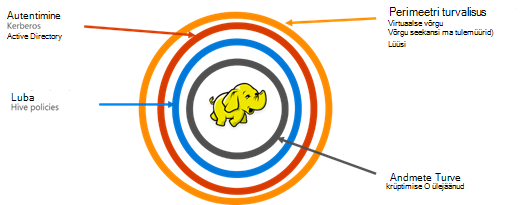

<properties
    pageTitle="Turvaline Hdinsightiga ülevaade | Microsoft Azure'i"
    description="Siit saate teada..."
    services="hdinsight"
    documentationCenter=""
    authors="saurinsh"
    manager="jhubbard"
    editor="cgronlun"
    tags="azure-portal"/>

<tags
    ms.service="hdinsight"
    ms.devlang="na"
    ms.topic="hero-article"
    ms.tgt_pltfrm="na"
    ms.workload="big-data"
    ms.date="10/24/2016"
    ms.author="saurinsh"/>

# Tutvustamine domeeni ühendatud Hdinsightiga kogumite (eelvaade)

Azure Hdinsightiga kuni täna toetatud ainult ühe kasutaja kohaliku admin. See töötas suur väiksemad rakenduse meeskondadel või osakondade jaoks. Hadoopi vastavalt saanud rohkem populaarsus enterprise sektori töökoormus, sai järjest oluline on vaja ärifunktsioonide hinde nagu active directory vastavalt autentimine, mitme kasutaja tugi ja Rollipõhine juurdepääsu reguleerimine. Kasutades domeeni ühendatud Hdinsightiga kogumite, saate luua Hdinsightiga kobar, mis Active Directory domeeni liidetud, konfigureerimine loendi ettevõtte töötajad, kes saab autentida Azure Active Directory Hdinsightiga kobar sisselogimiseks kaudu. Keegi väljastpoolt ettevõtet ei saa sisse logida ega juurdepääsuks Hdinsightiga klaster. Ettevõtte administraator saab konfigureerida rollipõhise juurdepääsu reguleerimine taru turvalisuse abil [Apache Ranger](http://hortonworks.com/apache/ranger/), seega juurdepääsu piiramine andmed ainult siis, kui vaja. Lisaks saate admin audit töötaja juurdepääs andmetele ja juurdepääsu juhtimine poliitikad, seega saavutada kõrge oma ettevõtte ressursside haldamine tehtud muudatused.

[AZURE.NOTE]> Kirjeldatud selles eelvaates uued funktsioonid on saadaval ainult Linuxi-põhiste Hdinsightiga kogumite jaoks taru töökoormus. Muud töökoormus HBase, säde, torm ja Kafka, nagu on lubatud tulevaste versioonidega. 

## Eelised

Ettevõtte turvalisus sisaldab nelja suur samba – perimeetri turvalisus, autentimine, autoriseerimine ja krüptimine.

.

### Perimeetri turvalisus

Hdinsightiga perimeetri turvalisuse saavutamiseks virtuaalse võrgu ja lüüsi teenuse abil. Täna, ettevõtte administraator saate luua mõne Hdinsightiga kobar virtuaalse võrgu sees ja juurdepääsu piiramiseks virtuaalse võrgu Network turberühmad (sissetulevaid või väljaminevaid tulemüüri reeglid) abil. Ainult IP-aadresside määratletud sissetuleva tulemüüri reegleid saab suhelda Hdinsightiga kobar, andes perimeetri turvalisus. Teine kiht perimeetri turvalisuse saavutamiseks lüüsi teenuse abil. Lüüs on teenus, mis toimib kaitse Hdinsightiga klaster võivad sissetulevad esitada. See taotluse vastu võtab, kinnitatakse see ja alles siis võimaldab taotluse sõlmi kobar, andes perimeetri turvalisuse klaster nime ja andmetüübiga sõlmi edasi.

### Autentimine

Ettevõtte administraator saab avaliku eelvaatega säte domeeni ühendatud Hdinsightiga kobar, [virtuaalse võrgu](https://azure.microsoft.com/services/virtual-network/). Hdinsightiga kobar sõlmed on liitunud hallata ettevõtte domeeniks. See on saavutada [Azure Active Directory domeeniteenused](https://technet.microsoft.com/library/cc770946.aspx)kasutamine. Kõik sõlmed klaster on ühendatud domeeniga, ettevõtte haldava. Selle setup ettevõtte töötajad saavad logida kobar sõlmed domeeni mandaadi abil. Volituste domeeni saab kasutada ka autentimiseks muude nagu toon, Ambari vaateid, ODBC, JDBC, PowerShelli ja REST API-de suhelda klaster kinnitatud lõpp-punktid. Administraator peab suheldes kobar kaudu nende lõpp-punktid kasutajate arv piirata üle täielik kontroll.

### Luba

Enamik ettevõtteid, millele järgneb hea tava on mitte iga töötaja juurdepääs Kõik ettevõtteressursid. Samuti selles versioonis admin saate määratleda Rollipõhine juurdepääsu juhtimine poliitika kobar ressursid. Näiteks admin saate konfigureerida [Apache Ranger](http://hortonworks.com/apache/ranger/) määrata juurdepääsu juhtimine poliitikad mesilaspere. See funktsioon tagab, et töötajad on võimalik ainult nii palju andmeid, nagu need on vaja oma töö edukaks. SSH klaster juurdepääs ainult ainult administraator.

### Auditi

Koos Hdinsightiga kobar ressursside kaitsmine volitamata ja andmete turvamise, auditeerimine kõik juurdepääsu kobar materjale ja andmeid on vaja jälgida ressursside tahtmatu või volitamata juurdepääsu. Selles eelvaates admin saate vaadata ja kõik Accessi aruande Hdinsightiga kobar materjale ja andmed. Admin saab vaadata ja kõik muudatused aruande juhtelemendi juurdepääsupoliitikaid tehtud Apache Ranger toetatud lõpp-punktid. Auditilogide otsimiseks kasutab domeeni ühendatud Hdinsightiga kobar tuttavad Apache Ranger UI. Taustväärtus, kasutab Ranger [Apache Solri]( http://hortonworks.com/apache/solr/) talletamiseks ja otsimise logid.

### Krüptimine

Andmete kaitsmine on oluline, et koosoleku ettevõtte turvalisus ja nõuetele ja koos andmetega töötajate volitamata juurdepääsu piiramine see peaks tagada ka krüptimise teel. Nii on andmete poed Hdinsightiga kogumite, Azure'i salvestusruumi bloobimälu ja Azure andmesalv Lake toeta läbipaistvaid serveripoolne ja [krüptimise andmete](../storage/storage-service-encryption.md) ülejäänud. Turvaline Hdinsightiga kogumite sujuvalt tööd selle serveri pool andmete krüptimise abil ülejäänud võimalus.

## Järgmised sammud

- Konfigureerida domeeni ühendatud Hdinsightiga kobar, leiate teemast [konfigureerimine domeeni ühendatud Hdinsightiga kogumite](hdinsight-domain-joined-configure.md).
- Haldamise domeeni ühendatud Hdinsightiga kogumite, vt [domeenihalduse liitunud Hdinsightiga kogumite](hdinsight-domain-joined-manage.md).
- Konfigureerida taru poliitikate ja käitamine taru päringuid, leiate teemast [domeeni ühendatud Hdinsightiga kogumite poliitikate konfigureerimine taru](hdinsight-domain-joined-run-hive.md).
- Töötab taru päringute abil SSH domeeni ühendatud Hdinsightiga kogumite, leiate teemast [Kasutamine SSH koos Linux-põhine Hadoopi Hdinsightiga Linux, Unix, või OS X](hdinsight-hadoop-linux-use-ssh-unix.md#connect-to-a-domain-joined-hdinsight-cluster).