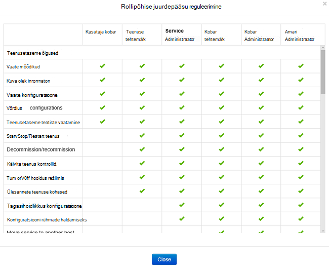
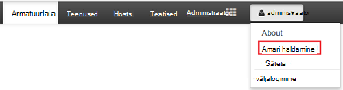
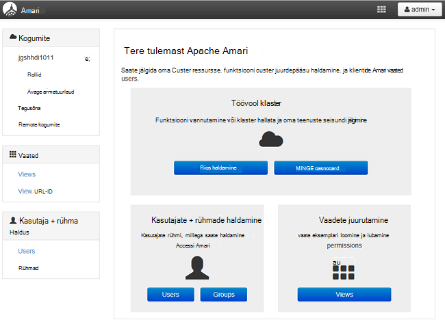
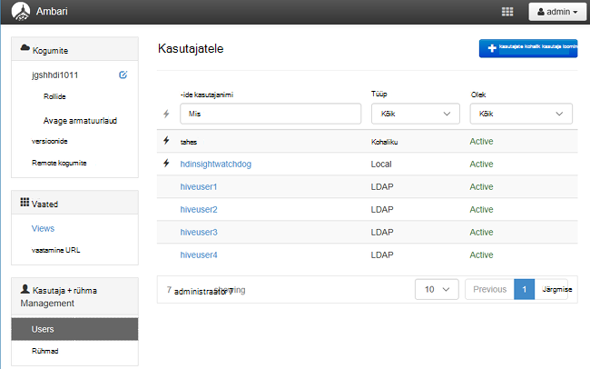
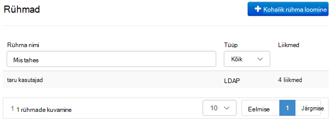
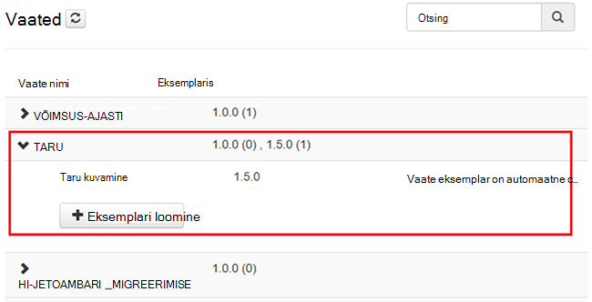
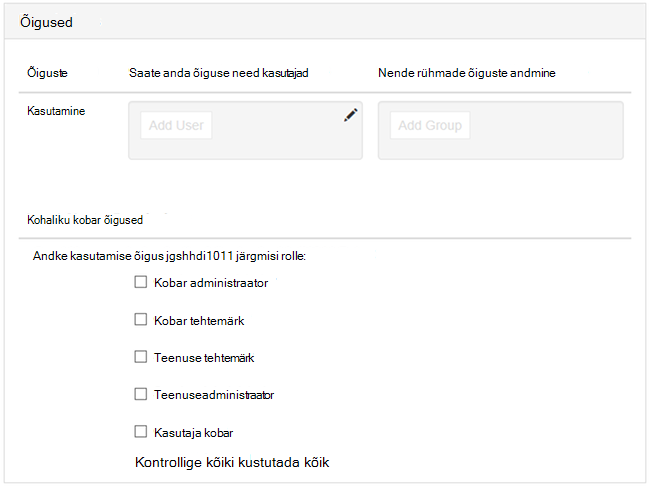

<properties
    pageTitle="Domeeni ühendatud Hdinsightiga kogumite haldamine | Microsoft Azure'i"
    description="Saate teada, kuidas hallata domeeni ühendatud Hdinsightiga kogumite"
    services="hdinsight"
    documentationCenter=""
    authors="saurinsh"
    manager="jhubbard"
    editor="cgronlun"
    tags=""/>

<tags
    ms.service="hdinsight"
    ms.devlang="na"
    ms.topic="article"
    ms.tgt_pltfrm="na"
    ms.workload="big-data"
    ms.date="10/25/2016"
    ms.author="saurinsh"/>

# Haldamine domeeni ühendatud Hdinsightiga kogumite (eelvaade)

Siit saate teada, kasutajate ja domeeni ühendatud Hdinsightiga ja kuidas hallata domeeni ühendatud Hdinsightiga kogumite rollid.

## Domeeni ühendatud Hdinsightiga kogumite kasutajad

Hdinsightiga kobar, mis on domeeni ühendatud on kaks Kasutajakontod, mis on loodud kobar loomise ajal.

- **Ambari administraator**: see konto on ka *Hadoopi kasutaja* või *HTTP kasutaja*. Saab kasutada selle kontoga sisselogimiseks Ambari https://&lt;clustername >. azurehdinsight.net. See saab päringuid käivitada Ambari vaadetes, käivitada töid välise tööriistad (st PowerShelli Templeton, Visual Studio) ja autentimiseks taru ODBC-draiver ja Ärianalüüsi tööriistade kohta (nt Exceli, PowerBI või sellele).

- **SSH kasutaja**: selle konto saab kasutada SSH ja käivitada sudo käsud. See on administraatoriõigusi Linux vms.

Domeeni ühendatud Hdinsightiga kobar on kolm uued kasutajad Lisaks Ambari administraator ja SSH kasutaja.

- **Ranger administraator**: see konto on kohalik Apache Ranger administraatori konto. See pole rakendust active directory domeeni. Poliitikate häälestamine ja teiste kasutajate administraatorid või delegeeritud administraatorid (nii, et need kasutajad saavad poliitikate haldamine) saab selle kontoga. Vaikimisi kasutajanimi on *admin* ja parool on sama, mis Ambari administraatori parooli. Parooli saate värskendada Ranger sätete lehe kaudu.

- **Kobar administraator domeeni kasutaja**: see konto on active directory domeeni kasutaja määratud Hadoopi kobar administraator, sh Ambari ja Ranger. Peate määrama selle kasutaja mandaat kobar loomise ajal. See kasutaja on järgmised õigused.

    - Liitumine masinad domeeni ja paigutage need OU, mis teie määratud kobar loomise ajal.
    - Saate luua teenuse põhisumma OU kobar loomise ajal määratud sees. 
    - Vastupidise DNS-i kirjete loomine.

    Pange tähele, et AD teised kasutajad on ka järgmisi õigusi. 

    Siin on mõned end punktid sees kobar (nt Templeton), mis haldab Ranger ja seega ei ole turvaline. Kõigi kasutajate jaoks peale kobar administraator domeeni kasutaja on lukustatud lõpp-punktid. 

- **Tavaline**: kobar loomise ajal saate sisestada mitu active directory rühma. Nende rühmade kasutajate sünkroonitakse Ranger ja Ambari. Need kasutajad on domeeni kasutajad ja on juurdepääs ainult Ranger haldusega lõpp-punktid (nt Hiveserver2). RBAC poliitikate ja Auditeerimispoliitika saab kehtivad need kasutajad.

## Domeeni ühendatud Hdinsightiga kogumite rollid

Domeeni ühendatud Hdinsightiga kuuluvad järgmised rollid.

- Kobar administraator
- Kobar tehtemärk
- Teenuseadministraator
- Teenuse tehtemärk
- Kasutaja kobar

**Õiguste rollidest**

1. Avage Ambari haldamise kasutajaliides.  Vaadake, [avage Ambari haldamise kasutajaliides](#open-the-ambari-management-ui).
2. Klõpsake vasakpoolses menüüs nuppu **rollid**.
3. Klõpsake oma õiguste sinise küsimärki:

    

## Avage Ambari haldamise kasutajaliides

1. [Azure'i portaali](https://portal.azure.com)sisse logida.
2. Avage Hdinsightiga klaster tera. Vaadake [loendi ja Kuva kogumite](hdinsight-administer-use-management-portal.md#list-and-show-clusters).
3. Valige **armatuurlaud** , ülalt menüüst Ambari avamiseks.
4. Logige sisse Ambari kobar administraatori domeeni kasutajanime ja parooli abil.
5. Klõpsake paremas ülanurgas kaudu rippmenüü **administraator** ja klõpsake **Ambari haldamine**.

    

    UI näeb välja selline:

    

## Sünkroonitud teie Active Directory domeeni kasutajate loend

1. Avage Ambari haldamise kasutajaliides.  Vaadake, [avage Ambari haldamise kasutajaliides](#open-the-ambari-management-ui).
2. Klõpsake vasakpoolses menüüs **Kasutajad**. Peab näete kõigi kasutajate sünkroonitud Hdinsightiga klaster Active Directoryst.

    

## Sünkroonitud teie Active Directory domeeni rühmade loendi

1. Avage Ambari haldamise kasutajaliides.  Vaadake, [avage Ambari haldamise kasutajaliides](#open-the-ambari-management-ui).
2. Klõpsake vasakpoolses menüüs **rühmad**. Näete peab kõikide rühmade sünkroonitud Hdinsightiga klaster Active Directoryst.

    

## Vaadete taru õiguste konfigureerimine

1. Avage Ambari haldamise kasutajaliides.  Vaadake, [avage Ambari haldamise kasutajaliides](#open-the-ambari-management-ui).
2. Klõpsake vasakpoolses menüüs **vaated**.
3. Klõpsake üksikasjade kuvamiseks **TARU** .

    

4. Linki **Kuva taru** taru vaadete konfigureerimine.
5. Liikuge kerides jaotiseni **õigused** .

    

6. Klõpsake nuppu **Lisa kasutaja** või **Rühma**ja seejärel määrake kasutajad ja rühmad, mida saate kasutada taru vaated. 

## Kasutajate rollid konfigureerimine

 Rollide ja õiguste loendi leiate artiklist [rollid, domeeni liitunud Hdinsightiga kogumite](#roles-of-domain---joined-hdinsight-clusters).

1. Avage Ambari haldamise kasutajaliides.  Vaadake, [avage Ambari haldamise kasutajaliides](#open-the-ambari-management-ui).
2. Klõpsake vasakpoolses menüüs nuppu **rollid**.
3. Klõpsake nuppu **Lisa kasutaja** või **Rühma** kasutajatele ja rühmadele määrata erinevad rollid.
 
## Järgmised sammud

- Konfigureerida domeeni ühendatud Hdinsightiga kobar, leiate teemast [konfigureerimine domeeni ühendatud Hdinsightiga kogumite](hdinsight-domain-joined-configure.md).
- Konfigureerida taru poliitikate ja käitamine taru päringuid, leiate teemast [domeeni ühendatud Hdinsightiga kogumite poliitikate konfigureerimine taru](hdinsight-domain-joined-run-hive.md).
- Töötab taru päringute abil SSH domeeni ühendatud Hdinsightiga kogumite, leiate teemast [Kasutamine SSH koos Linux-põhine Hadoopi Hdinsightiga Linux, Unix, või OS X](hdinsight-hadoop-linux-use-ssh-unix.md#connect-to-a-domain-joined-hdinsight-cluster).
