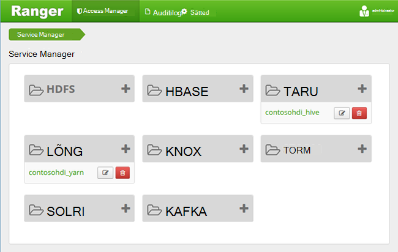
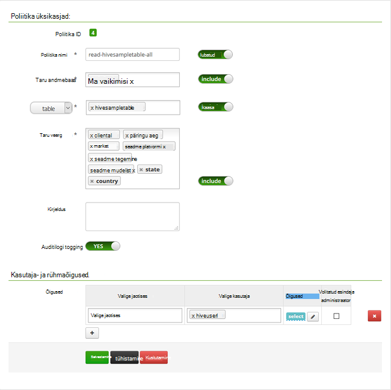

<properties
    pageTitle="Domeeni ühendatud Hdinsightiga taru poliitikate konfigureerimine | Microsoft Azure'i"
    description="Siit saate teada..."
    services="hdinsight"
    documentationCenter=""
    authors="saurinsh"
    manager="jhubbard"
    editor="cgronlun"
    tags="azure-portal"/>

<tags
    ms.service="hdinsight"
    ms.devlang="na"
    ms.topic="hero-article"
    ms.tgt_pltfrm="na"
    ms.workload="big-data"
    ms.date="10/25/2016"
    ms.author="saurinsh"/>

# Taru poliitikate konfigureerimine domeeni ühendatud Hdinsightiga (eelvaade)

Saate teada, kuidas mesilaspere Apache Ranger poliitikate konfigureerimine. Selles artiklis loote kahe Ranger poliitika on hivesampletable juurdepääsu piiramiseks. Funktsiooni hivesampletable kaasas Hdinsightiga kogumite. Pärast seda, kui olete konfigureerinud poliitikatega, saate Excelis ja ODBC draiver ühenduse Hdinsightiga taru tabelid.

## Eeltingimused

- Domeeni ühendatud Hdinsightiga kobar. Lugege teemat [konfigureerimine domeeni ühendatud Hdinsightiga kogumite](hdinsight-domain-joined-configure.md).
- Office 2016, Office 2013 Professional Plus, Office 365 Pro Plusi, Excel 2013 eraldiseisev versioon või Office 2010 Professional Plus töökoha.

## Ühenduse loomine Apache Ranger administraator kasutajaliides

**Ühenduse loomiseks Ranger administraator kasutajaliides**

1. Brauseri kaudu ühenduse Ranger administraator UI. URL on https://&lt;ClusterName >.azurehdinsight.net/Ranger/. 

    >[AZURE.NOTE] Ranger kasutab eri mandaati kui Hadoopi kobar. Selleks, et brauserites vahemällu talletatud Hadoopi mandaadi abil, brauseriaknas InPrivate-ühenduse loomiseks kasutada Ranger administraator UI.
4. Logige sisse kobar administraatori domeeni kasutajanime ja parooli abil:

    

    Praegu Ranger töötab ainult lõng ja taru.

## Domeeni kasutajate loomiseks

[Domeeni konfigureerimine liitunud Hdinsightiga kogumite](hdinsight-domain-joined-configure.md#create-and-configure-azure-ad-ds-for-your-azure-ad), olete loonud hiveruser1 ja hiveuser2. Kasutage kahe kasutajakonto selles õpetuses.

## Ranger poliitikate loomine

Selles jaotises loote kahe Ranger poliitikate juurdepääsuks hivesampletable. Saate anda teistsuguseid veergude valige Luba. Mõlemad kasutajad on loodud [konfigureerimine domeeni ühendatud Hdinsightiga](hdinsight-domain-joined-configure.md#create-and-configure-azure-ad-ds-for-your-azure-ad)rühmades.  Järgmises jaotises te katsetada, kaks poliitikate Excelis.

**Ranger poliitikate loomine**

1. Avatud Ranger administraator UI. Vt [ühenduse Apache Ranger administraator UI](#connect-to-apache-ranager-admin-ui).
2. Klõpsake ** &lt;ClusterName > _hive**, klõpsake jaotises **taru**. Näete peab kaks eelnevalt poliitikate konfigureerimine.
3. Klõpsake nuppu **Lisa uus poliitika**, ja seejärel sisestage järgmised väärtused:

    - Poliitika nimi: lugemis-hivesampletable-kõik
    - Taru andmebaasi: vaikimisi
    - Tabel: hivesampletable
    - Veeru taru: *
    - Valige kasutaja: hiveuser1
    - Õiguste: valige

    .

    >[AZURE.NOTE] Kui domeeni kasutaja on pole täidetud, valige kasutaja, oodake Ranger sünkroonimiseks AAD mõne hetke aega.

4. Klõpsake nuppu **Lisa** poliitika salvestamiseks.
5. Kaks viimast korrake luua muu poliitika järgmised atribuudid:

    - Poliitika nimi: lugemis-hivesampletable-devicemake
    - Taru andmebaasi: vaikimisi
    - Tabel: hivesampletable
    - Veeru taru: clientid devicemake
    - Valige kasutaja: hiveuser2
    - Õiguste: valige

## Taru ODBC andmeallika loomine

Juhiseid leiate [loomine taru ODBC-andmeallikas](hdinsight-connect-excel-hive-odbc-driver.md).  

    Atribuut|Kirjeldus
    ---|---
    Andmeallika nime järgi.|Andmeallika nime andmine
    Host|Sisestage &lt;HDInsightClusterName >. azurehdinsight.net. Näiteks myHDICluster.azurehdinsight.net
    Port|Kasutage <strong>443</strong>. (See port on muudetud: 563 443.)
    Andmebaasi|Saate kasutada <strong>vaikimisi</strong>.
    Taru serveri tüüp|Valige <strong>taru Server 2</strong>
    Süsteem|Valige <strong>Azure Hdinsightiga</strong>
    HTTP-tee|Selle tühjaks jätta.
    Kasutajanimi|Sisestage hiveuser1@contoso158.onmicrosoft.com. Värskendage domeeni nimi, kui see on erinev.
    Parooli|Sisestage parool hiveuser1.
    </table>

Veenduge, et enne salvestamist andmeallika nuppu **testi** .

##Andmete importimine rakendusse Excel hdinsightist

Viimase jaotises olete konfigureerinud kahe poliitika.  hiveuser1 on valige Luba kõik veerud ja hiveuser2 on kaks veergude valige Luba. Selles jaotises saate jäljendada kaks kasutajate andmed Excelisse importida.

1. Uue või olemasoleva töövihiku Excelis avada.
2. Klõpsake menüüs **andmed** nuppu **Andmete muust allikast**ja klõpsake **Kaudu andmeühendusviisardi** **Andmeühenduse viisardi**käivitamiseks.

    ! [Avatud andmeühendusviisardi] [img-hdi-simbahiveodbc.excel.dataconnection]

3. **DSN-i ODBC** andmeallika valimine ja seejärel klõpsake nuppu **edasi**.
4. ODBC-andmeallikatest, valige eelmises etapis loodud andmeallika nimi ja klõpsake siis nuppu **edasi**.
5. Sisestage kobar viisardi parool uuesti ja seejärel klõpsake nuppu **OK**. Oodake, kuni dialoogiboksi avamiseks **Valige andmebaas ja tabel** . See võib võtta mõne hetke.
8. Valige **hivesampletable**ja seejärel klõpsake nuppu **edasi**. 
8. Klõpsake nuppu **valmis**.
9. Dialoogiboksis **Andmete importimine** saate muuta või määrata päringu. Selleks klõpsake nuppu **Atribuudid**. See võib võtta mõne hetke. 
10. Klõpsake vahekaarti **määratlus** . Käsu tekst on:

        SELECT * FROM "HIVE"."default"."hivesampletable"

    Hiveuser1 on kõigi veergude Ranger poliitika määratletud, valige Luba.  Nii see päring töötab hiveuser1 kasutaja mandaat, kuid see päring ei tööta ei hiveuser2 kasutaja mandaat.

    ! [Ühenduse atribuudid] [img-hdi-simbahiveodbc – Exceli-connectionproperties]

11. Klõpsake nuppu **OK** , et sulgeda dialoogiboks ühenduse atribuudid.
12. Klõpsake nuppu **OK** , et sulgeda dialoogiboks **Andmete importimine** .  
13. Sisestage hiveuser1 parool uuesti ja seejärel klõpsake nuppu **OK**. Kulub mõne hetke enne andmeid saab importida Excelisse. Kui see on tehtud, peab näete 11 andmeveergu.

Teine poliitika testimiseks (lugemis-hivesampletable-devicemake) loodud viimases osas

1. Lisage uuele lehele Excelis.
2. Kasutage andmete importimiseks viimast toimingut.  Te teha ainult muudatus on hiveuser2 kasutaja mandaat hiveuser1 isiku asemel kasutada. See ei õnnestu, kuna hiveuser2 ainult on õigus näha kaks veergu. Teil peab kuvatakse järgmine tõrketeade:

        [Microsoft][HiveODBC] (35) Error from Hive: error code: '40000' error message: 'Error while compiling statement: FAILED: HiveAccessControlException Permission denied: user [hiveuser2] does not have [SELECT] privilege on [default/hivesampletable/clientid,country ...]'.

3. Kasutage sama toimingut saate importida andmed. Seekord kasutada hiveuser2 kasutaja mandaat ja ka muuta: select-lause:

        SELECT * FROM "HIVE"."default"."hivesampletable"

    Kui soovite:

        SELECT clientid, devicemake FROM "HIVE"."default"."hivesampletable"

    Kui see on tehtud, peab näete kahte andmeveergu imporditud.

## Järgmised sammud

- Konfigureerida domeeni ühendatud Hdinsightiga kobar, leiate teemast [konfigureerimine domeeni ühendatud Hdinsightiga kogumite](hdinsight-domain-joined-configure.md).
- Haldamise domeeni ühendatud Hdinsightiga kogumite, vt [domeenihalduse liitunud Hdinsightiga kogumite](hdinsight-domain-joined-manage.md).
- Töötab taru päringute abil SSH domeeni ühendatud Hdinsightiga kogumite, leiate teemast [Kasutamine SSH koos Linux-põhine Hadoopi Hdinsightiga Linux, Unix, või OS X](hdinsight-hadoop-linux-use-ssh-unix.md#connect-to-a-domain-joined-hdinsight-cluster).
- Jaoks ühenduse taru taru JDBC abil, vt [ühenduse loomine taru kohta taru JDBC draiveri kasutamine Windows Azure Hdinsightiga](hdinsight-connect-hive-jdbc-driver.md)
- Exceli ühenduse loomine Hadoopi taru ODBC abil, vt [Microsoft taru ODBC Drive Hadoopi Exceli ühendamine](hdinsight-connect-excel-hive-odbc-driver.md)
- Exceli ühenduse loomine Hadoopi Power Query abil, vt [Hadoopi Power Query abil Exceli ühendamine](hdinsight-connect-excel-power-query.md)