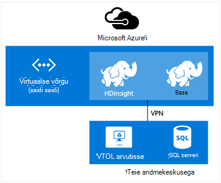

<properties
    pageTitle="Laiendamine Hdinsightiga virtuaalse võrguga | Microsoft Azure'i"  
    description="Saate teada, kuidas kasutada Azure virtuaalse võrgu Hdinsightile ühenduse loomiseks muu cloud, või oma andmekeskuses"
    services="hdinsight"
    documentationCenter=""
    authors="Blackmist"
    manager="jhubbard"
    editor="cgronlun"/>

<tags
   ms.service="hdinsight"
   ms.devlang="na"
   ms.topic="article"
   ms.tgt_pltfrm="na"
   ms.workload="big-data"
   ms.date="10/21/2016"
   ms.author="larryfr"/>


#<a name="extend-hdinsight-capabilities-by-using-azure-virtual-network"></a>Azure'i virtuaalse võrgu kaudu Hdinsightiga võimaluste laiendamine

Azure virtuaalse võrgu võimaldab teil oma kohapealse ressursid, nt SQL serveri lisada, ühendada mitu Hdinsightiga kobar tüüpi või luua turvalist vahel ressursid pilveteenuses võrgud Hadoopi lahenduste täiendamiseks.

[AZURE.INCLUDE [upgrade-powershell](../../includes/hdinsight-use-latest-powershell-and-cli.md)]


##<a id="whatis"></a>Mis on Azure virtuaalse võrgu?

[Azure virtuaalse võrgu](https://azure.microsoft.com/documentation/services/virtual-network/) võimaldab teil luua turvalist, püsivate võrgu sisaldavad ressursid, peate oma lahenduse. Virtuaalse võrgu abil saate:

* Ühenduse loomine pilveteenuses ressursse koos privaatvõrk (ainult pilveteenuses).

    

    Link: Azure'i teenuste Windows Azure Hdinsightiga virtuaalse võrgu kaudu võimaldab järgmistel juhtudel:

    * **Töö- või teenuseid kasutada Hdinsightiga** Azure veebisaitide või teenuste Azure'i virtuaalmasinates töötab.

    * **Otse andmeedastuse** Hdinsightiga ja Azure'i SQL-andmebaasi, SQL serveri või mõne muu andmete salvestamise lahendus töötab virtuaalse masina vahel.

    * **Ühendab mitu Hdinsightiga serverid** ühe lahenduse. Hdinsightiga kogumite tulevad erinevaid töökoormus või klaster on häälestatud, mis vastavad tüüpi. Ei ole toetatud meetodit klaster, mis ühendab mitu tüüpi, nt torm ja HBase sisse ühe kobar loomiseks. Virtuaalse võrgu kasutamine võimaldab mitme kogumite otse omavahel suhelda.

* Ühendage oma pilveteenuses ressursse, mis kohaliku andmekeskuse võrgu (-saidilt või saidi punkti) virtuaalse privaatvõrgu (VPN) abil.

    Saitide konfiguratsioon võimaldab teil ühendada mitu ressursse oma andmekeskuse Azure virtuaalse võrgu riistvara VPN- või marsruutimine ja kaugpöördus teenuse abil.

    

    Punkti saidi konfiguratsioon võimaldab võrguga teatud ressursi Azure virtuaalse tarkvara VPN-i abil.

    

    Link cloud ja oma andmekeskuse virtuaalse võrgu kaudu võimaldab sarnased stsenaariumid vaid konfiguratsioonis. Kuid asemel on piiratud töötamine ressursid pilves, saate töötada ka ressurssidega oma andmekeskuses.

    * **Otse andmeedastuse** Hdinsightiga ja oma andmekeskuse vahel. Näide kasutab Sqoop andmete või SQL serveri või lugemine line business (LOB) rakenduse loodud andmete edastamiseks.

    * **Töö- või teenuseid kasutada Hdinsightiga** LOB rakendusest. Näide kasutab HBase Java API-de talletada ja andmete toomiseks on Hdinsightiga HBase kobar.

Virtuaalse võrgu funktsioone, eelised ja võimaluste kohta leiate lisateavet teemast [Azure virtuaalse võrgu ülevaade](../virtual-network/virtual-networks-overview.md).

> [AZURE.NOTE] Peate looma Azure virtuaalse võrgu enne ettevalmistamise mõne Hdinsightiga kobar. Lisateavet leiate teemast [virtuaalse võrgu konfigureerimise toimingud](https://azure.microsoft.com/documentation/services/virtual-network/).

## <a name="virtual-network-requirements"></a>Virtuaalse võrgu nõuded

> [AZURE.IMPORTANT] Loomine on Hdinsightiga kobar virtuaalse võrgus nõuab teatud virtuaalse võrgu konfiguratsiooni, mis on selles jaotises kirjeldatud.

###<a name="location-based-virtual-networks"></a>Virtuaalne võrkude asukoht põhineb

Azure Hdinsightiga toetab ainult asukoht põhineb virtuaalse võrgu ja praegu ei tööta koos virtuaalse võrgu osaleja rühma alusel.

###<a name="classic-or-v2-virtual-network"></a>Klassikaline või v2 virtuaalse võrgu

Windowsi-põhiste kogumite nõuab klassikaline virtuaalse võrk, Linux-põhine kogumite nõua Azure'i ressursihaldur virtuaalse võrgu. Kui teil pole õiget tüüpi võrku, seda ei saa kasutuskõlblikud klaster loomisel.

Kui teil on virtuaalse võrgus, mis pole kasutatavaks kavatsete luua klaster ressursse, saate luua uue virtuaalse võrgu, mis on kasutatavaks klaster ja mitteühilduvad virtuaalse võrguga ühenduse loomiseks. Seejärel saate luua klaster võrgu versiooni, mis eeldab, ja seda saab juurdepääsu ressurssidele muud võrgu kuna kahe on liitunud. Klassikaline ja uus virtuaalne võrkude ühendamise kohta leiate lisateavet teemast [ühenduse loomine klassikaline VNets uue VNets abil](../vpn-gateway/vpn-gateway-connect-different-deployment-models-portal.md).

###<a name="custom-dns"></a>Kohandatud DNS-i

Virtuaalse võrgu loomisel pakub Azure'i Azure teenuste nt Hdinsightiga võrgus installitud vaikeeraldusvõime nimi. Siiski võib-olla peate kasutama teie enda domeeninime süsteemi (DNS) olukordades, näiteks rist võrgu domeeninimede lahendamine. Näiteks kui suhtlemine teenuste vahel asub kaks liitunud virtuaalse võrgu. Hdinsightiga toetab nii on vaikimisi Azure nimelahendus kui ka kohandatud DNS-i kasutamisel koos Azure virtuaalse võrgu.

Oma DNS-i server Azure'i virtuaalse võrguga kasutamise kohta leiate lisateavet jaotisest __nimelahendus abil oma DNS-i server__ dokumendi [Nimelahendus VMs ja rolli aknad](../virtual-network/virtual-networks-name-resolution-for-vms-and-role-instances.md#name-resolution-using-your-own-dns-server) .

###<a name="secured-virtual-networks"></a>Virtuaalne võrkude turvatud

Hdinsightiga teenus on hallatav teenus ja ajal ettevalmistamise ja töötab samal ajal on vaja Interneti-ühendus. See on nii, et selle Azure saate jälgida seisundi kobar, algatada Tõrkesiirde kobar ressursside, sõlmed kobar skaleerimise toimingute kaudu ja muude haldustoimingute arvu muutmine.

Kui teil on vaja installida Hdinsightiga turvalise virtuaalse võrku, tuleb teil lubada sissetuleva juurdepääs pordi 443 jaoks järgmisi IP-aadresse, mis võimaldavad Azure Hdinsightiga klaster juhtida.

* 168.61.49.99
* 23.99.5.239
* 168.61.48.131
* 138.91.141.162

Lubamisel sissetuleva pordi 443 nende aadressid access võimaldab teil installimiseks Hdinsightiga turvalise virtuaalse võrku.

> [AZURE.IMPORTANT] Hdinsightiga ei toeta piiramine väljaminev liiklus ainult sissetulev liiklus. Võrgu turberühma reeglid alamvõrku, mis sisaldab Hdinsightiga määratlemisel kasutada ainult sissetulevad reeglid.

Järgmised näited demonstreerivad seda, kuidas luua uue võrgu turberühma võimaldab nõutav aadressid, mis on alamvõrgu oma virtuaalse võrgustikus turberühma kehtib. Nende juhiste korral eeldatakse, et olete juba loonud virtuaalse võrgu ja alamvõrgu, mida soovite installida Hdinsightiga sisse.

__Azure'i PowerShelli abil__

    $vnetName = "Replace with your virtual network name"
    $resourceGroupName = "Replace with the resource group the virtual network is in"
    $subnetName = "Replace with the name of the subnet that HDInsight will be installed into"
    # Get the Virtual Network object
    $vnet = Get-AzureRmVirtualNetwork `
        -Name $vnetName `
        -ResourceGroupName $resourceGroupName
    # Get the region the Virtual network is in.
    $location = $vnet.Location
    # Get the subnet object
    $subnet = $vnet.Subnets | Where-Object Name -eq $subnetName
    # Create a new Network Security Group.
    # And add exemptions for the HDInsight health and management services.
    $nsg = New-AzureRmNetworkSecurityGroup `
        -Name "hdisecure" `
        -ResourceGroupName $resourceGroupName `
        -Location $location `
        | Add-AzureRmNetworkSecurityRuleConfig `
            -name "hdirule1" `
            -Description "HDI health and management address 168.61.49.99" `
            -Protocol "*" `
            -SourcePortRange "*" `
            -DestinationPortRange "443" `
            -SourceAddressPrefix "168.61.49.99" `
            -DestinationAddressPrefix "VirtualNetwork" `
            -Access Allow `
            -Priority 300 `
            -Direction Inbound `
        | Add-AzureRmNetworkSecurityRuleConfig `
            -Name "hdirule2" `
            -Description "HDI health and management 23.99.5.239" `
            -Protocol "*" `
            -SourcePortRange "*" `
            -DestinationPortRange "443" `
            -SourceAddressPrefix "23.99.5.239" `
            -DestinationAddressPrefix "VirtualNetwork" `
            -Access Allow `
            -Priority 301 `
            -Direction Inbound `
        | Add-AzureRmNetworkSecurityRuleConfig `
            -Name "hdirule3" `
            -Description "HDI health and management 168.61.48.131" `
            -Protocol "*" `
            -SourcePortRange "*" `
            -DestinationPortRange "443" `
            -SourceAddressPrefix "168.61.48.131" `
            -DestinationAddressPrefix "VirtualNetwork" `
            -Access Allow `
            -Priority 302 `
            -Direction Inbound `
        | Add-AzureRmNetworkSecurityRuleConfig `
            -Name "hdirule4" `
            -Description "HDI health and management 138.91.141.162" `
            -Protocol "*" `
            -SourcePortRange "*" `
            -DestinationPortRange "443" `
            -SourceAddressPrefix "138.91.141.162" `
            -DestinationAddressPrefix "VirtualNetwork" `
            -Access Allow `
            -Priority 303 `
            -Direction Inbound
    # Set the changes to the security group
    Set-AzureRmNetworkSecurityGroup -NetworkSecurityGroup $nsg
    # Apply the NSG to the subnet
    Set-AzureRmVirtualNetworkSubnetConfig `
        -VirtualNetwork $vnet `
        -Name $subnetName `
        -AddressPrefix $subnet.AddressPrefix `
        -NetworkSecurityGroupId $nsg

__Azure'i CLI abil__

1. Järgmise käsu abil saate luua uue võrgu turberühma nimega `hdisecure`. Asendage ressursi rühm, mis sisaldab Azure virtuaalse võrgu ja asukoht (piirkond) rühma loodud __RESOURCEGROUPNAME__ ja __asukoht__ .

        azure network nsg create RESOURCEGROUPNAME hdisecure LOCATION
    
    Pärast rühma loomist saate uue rühma teabe. Otsige järgmine rida ja salvestada selle `/subscriptions/GUID/resourceGroups/RESOURCEGROUPNAME/providers/Microsoft.Network/networkSecurityGroups/hdisecure` teavet. Seda kasutatakse hiljem.
    
        data:    Id                              : /subscriptions/GUID/resourceGroups/RESOURCEGROUPNAME/providers/Microsoft.Network/networkSecurityGroups/hdisecure

2. Kasutada järgmisi reegleid lisada uue võrgu turberühma, mis võimaldavad sissetuleva teatis pordi 443 kaudu Windows Azure Hdinsightiga teenuse seisundi ja haldus. Asendage __RESOURCEGROUPNAME__ ressursirühm, mis sisaldab Azure virtuaalse võrgu nimi.

        azure network nsg rule create RESOURCEGROUPNAME hdisecure hdirule1 -p "*" -o "*" -u "443" -f "168.61.49.99" -e "VirtualNetwork" -c "Allow" -y 300 -r "Inbound"
        azure network nsg rule create RESOURCEGROUPNAME hdisecure hdirule2 -p "*" -o "*" -u "443" -f "23.99.5.239" -e "VirtualNetwork" -c "Allow" -y 301 -r "Inbound"
        azure network nsg rule create RESOURCEGROUPNAME hdisecure hdirule3 -p "*" -o "*" -u "443" -f "168.61.48.131" -e "VirtualNetwork" -c "Allow" -y 302 -r "Inbound"
        azure network nsg rule create RESOURCEGROUPNAME hdisecure hdirule4 -p "*" -o "*" -u "443" -f "138.91.141.162" -e "VirtualNetwork" -c "Allow" -y 303 -r "Inbound"

3. Kui reegleid on loodud, kasutage järgmist rakendada uue võrgu turberühma lisamine alamvõrgu. Asendage __RESOURCEGROUPNAME__ ressursirühm, mis sisaldab Azure virtuaalse võrgu nimi. Asendage nimi Azure virtuaalse võrgu ja alamvõrgu, mida te kasutate installimisel Hdinsightiga __VNETNAME__ ja __SUBNETNAME__ .

        azure network vnet subnet set RESOURCEGROUPNAME VNETNAME SUBNETNAME -w "/subscriptions/GUID/resourceGroups/RESOURCEGROUPNAME/providers/Microsoft.Network/networkSecurityGroups/hdisecure"
    
    Kui see käsk on lõpule jõudnud, saate installida Hdinsightiga edukalt kasutatakse järgmist alamvõrgu turvalise virtuaalse võrku.

> [AZURE.IMPORTANT] Teenuse seisundi ja haldus Hdinsightiga ülaltoodud juhiseid ainult avatud juurdepääsu Azure pilveteenuse kaudu. See võimaldab teil edukalt installida mõne Hdinsightiga kobar alamvõrku, kuid vaikimisi on blokeeritud Hdinsightiga klaster väljaspool virtuaalse võrgu kaudu juurdepääsu. On teil täiendavad võrgu turberühma reeglite lisamine, kui soovite väljaspool virtuaalse võrgu kaudu juurdepääsu lubamine.
>
> Näiteks Interneti kaudu SSH juurdepääsu lubamiseks peate järgmise reegli lisamine: 
>
> * Azure'i PowerShelli-```Add-AzureRmNetworkSecurityRuleConfig -Name "SSSH" -Description "SSH" -Protocol "*" -SourcePortRange "*" -DestinationPortRange "22" -SourceAddressPrefix "*" -DestinationAddressPrefix "VirtualNetwork" -Access Allow -Priority 304 -Direction Inbound```
> * Azure'i CLI-```azure network nsg rule create RESOURCEGROUPNAME hdisecure hdirule4 -p "*" -o "*" -u "22" -f "*" -e "VirtualNetwork" -c "Allow" -y 304 -r "Inbound"```

Võrgu turberühmad kohta leiate lisateavet teemast [võrgu turberühmad ülevaade](../virtual-network/virtual-networks-nsg.md). Juhtimine Azure virtuaalse võrgu marsruutimise kohta leiate teavet teemast [kasutaja määratletud marsruudib ja IP-ümbersuunamine](../virtual-network/virtual-networks-udr-overview.md).

##<a id="tasks"></a>Ülesannete ja teave

See jaotis sisaldab teavet levinud toiminguid ja teavet võib juhtuda, virtuaalse võrguga Hdinsightiga kasutamisel.

###<a name="determine-the-fqdn"></a>FQDN määratlemine

Mõne kindla täielik domeeninimi (FQDN) virtuaalse võrgu kasutajaliidese määratakse Hdinsightiga kobar. See on meiliaadress, mida tuleks kasutada ühendamisel klaster muud ressursid, virtuaalse võrgus. FQDN määramiseks kasutada päringu Ambari halduse teenuse URL-i järgmist:

    https://<clustername>.azurehdinsight.net/ambari/api/v1/clusters/<clustername>.azurehdinsight.net/services/<servicename>/components/<componentname>

> [AZURE.NOTE] Hdinsightiga Ambari kasutamise kohta leiate lisateavet teemast [kuvari Hadoopi kogumite Hdinsightiga Ambari API abil sisse](hdinsight-monitor-use-ambari-api.md).

Määrake kobar nime ja teenuseid ja töötavate kobar, nt LÕNG ressursihaldur komponent.

> [AZURE.NOTE] Tagastatavad andmed on JavaScript Object märke (JSON) dokument, mis sisaldab palju teavet osa. Ainult FQDN eraldada tuleks kasutada JSON-parseri allalaadimiseks on `host_components[0].HostRoles.host_name` väärtus.

Näiteks tagastamiseks FQDN on Hdinsightiga Hadoopi kobar, saate üht järgmistest meetoditest andmete toomiseks LÕNG ressursihaldur jaoks:

* [Azure'i PowerShelli](../powershell-install-configure.md)

        $ClusterDnsName = <clustername>
        $Username = <cluster admin username>
        $Password = <cluster admin password>
        $DnsSuffix = ".azurehdinsight.net"
        $ClusterFQDN = $ClusterDnsName + $DnsSuffix

        $webclient = new-object System.Net.WebClient
        $webclient.Credentials = new-object System.Net.NetworkCredential($Username, $Password)

        $Url = "https://" + $ClusterFQDN + "/ambari/api/v1/clusters/" + $ClusterFQDN + "/services/yarn/     components/resourcemanager"
        $Response = $webclient.DownloadString($Url)
        $JsonObject = $Response | ConvertFrom-Json
        $FQDN = $JsonObject.host_components[0].HostRoles.host_name
        Write-host $FQDN

* [cURL](http://curl.haxx.se/) ja [jq](http://stedolan.github.io/jq/)

        curl -G -u <username>:<password> https://<clustername>.azurehdinsight.net/ambari/api/v1/clusters/<clustername>.azurehdinsight.net/services/yarn/components/resourcemanager | jq .host_components[0].HostRoles.host_name

###<a name="connecting-to-hbase"></a>Ühenduse loomine HBase

Ühenduse HBase eemalt Java API abil, tuleb määratleda ZooKeeper kvoorumi aadressid HBase kobar ja määrata selle rakenduse.

Soovitud ZooKeeper kvoorumi aadressi saamiseks kasutage päringu Ambari halduse teenuse ühte järgmistest:

* [Azure'i PowerShelli](../powershell-install-configure.md)

        $ClusterDnsName = <clustername>
        $Username = <cluster admin username>
        $Password = <cluster admin password>
        $DnsSuffix = ".azurehdinsight.net"
        $ClusterFQDN = $ClusterDnsName + $DnsSuffix

        $webclient = new-object System.Net.WebClient
        $webclient.Credentials = new-object System.Net.NetworkCredential($Username, $Password)

        $Url = "https://" + $ClusterFQDN + "/ambari/api/v1/clusters/" + $ClusterFQDN + "/configurations?type=hbase-site&tag=default&fields=items/properties/hbase.zookeeper.quorum"
        $Response = $webclient.DownloadString($Url)
        $JsonObject = $Response | ConvertFrom-Json
        Write-host $JsonObject.items[0].properties.'hbase.zookeeper.quorum'

* [cURL](http://curl.haxx.se/) ja [jq](http://stedolan.github.io/jq/)

        curl -G -u <username>:<password> "https://<clustername>.azurehdinsight.net/ambari/api/v1/clusters/<clustername>.azurehdinsight.net/configurations?type=hbase-site&tag=default&fields=items/properties/hbase.zookeeper.quorum" | jq .items[0].properties[]

> [AZURE.NOTE] Hdinsightiga Ambari kasutamise kohta leiate lisateavet teemast [kuvari Hadoopi kogumite Hdinsightiga Ambari API abil sisse](hdinsight-monitor-use-ambari-api.md).

Kui olete kvoorumi andmed, kasutage seda oma klientrakendusega.

Näiteks Java rakenduse, mis kasutab HBase API oleks **hbase-site.xml** faili lisada projekti ja määrata kvoorumi teabe faili järgmiselt:

```
<configuration>
  <property>
    <name>hbase.cluster.distributed</name>
    <value>true</value>
  </property>
  <property>
    <name>hbase.zookeeper.quorum</name>
    <value>zookeeper0.address,zookeeper1.address,zookeeper2.address</value>
  </property>
  <property>
    <name>hbase.zookeeper.property.clientPort</name>
    <value>2181</value>
  </property>
</configuration>
```

###<a name="verify-network-connectivity"></a>Võrguühenduse kontrollimiseks

Mõned teenused, SQL Server, nagu saate piirata sissetulevate võrguühenduste. See aitab vältida Hdinsightiga edukalt töötamine nende teenuste kaudu.

Kui teil tekib probleeme, mis on juurdepääs teenuse hdinsightist, tutvuge teenuse, et tagada, et teil on lubatud võrgule juurdepääsu. Saate kontrollida võrgule juurdepääsu loomisega on Azure virtuaalse masina samas virtuaalse võrgus, ja veenduge, et virtuaalse masina saate luua ühenduse teenuse üle virtuaalse võrgu kliendi Utiliidid abil.

##<a id="nextsteps"></a>Järgmised sammud

Järgmised näited demonstreerivad seda virtuaalse võrguga Azure Hdinsightiga kasutamise kohta:

* [Analüüsi andurite andmeid Storm ja HBase Hdinsightiga sisse](hdinsight-storm-sensor-data-analysis.md) - näitab torm ja HBase kobar virtuaalse võrgu konfigureerimise kohta, samuti kaugühenduse teel kirjutamist andmete HBase torm.

* [Sätte Hadoopi kogumite sisse Hdinsightiga](hdinsight-hadoop-provision-linux-clusters.md) - annab teavet ettevalmistamise Hadoopi kogumite, sh teave Azure virtuaalse võrgu kasutamise kohta.

* [Kasuta Sqoop koos Hadoopi sisse Hdinsightile](hdinsight-use-sqoop-mac-linux.md) - annab teavet SQL serveri andmeid üle virtuaalse võrgu Sqoop abil.

Azure'i kohta leiate lisateavet teemast [Azure virtuaalse võrgu ülevaade](../virtual-network/virtual-networks-overview.md).
