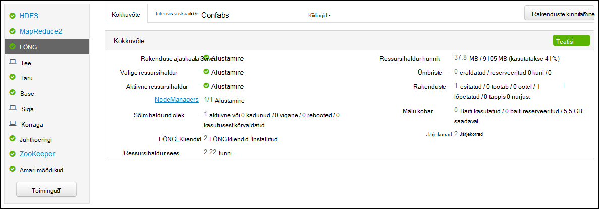
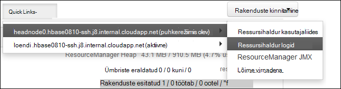

<properties
    pageTitle="Accessi Hadoopi LÕNG rakenduse logib Linux-põhine Hdinsightiga | Microsoft Azure'i"
    description="Saate teada, kuidas juurdepääs LÕNG logid Linux-põhine Hdinsightiga (Hadoopi) klaster käsurea ja veebibrauseri abil."
    services="hdinsight"
    documentationCenter=""
    tags="azure-portal"
    authors="Blackmist" 
    manager="jhubbard"
    editor="cgronlun"/>

<tags
    ms.service="hdinsight"
    ms.workload="big-data"
    ms.tgt_pltfrm="na"
    ms.devlang="na"
    ms.topic="article"
    ms.date="10/21/2016"
    ms.author="larryfr"/>

# Accessi LÕNG rakenduse logib Linuxi-põhiste Hdinsightiga 

Selles dokumendis selgitatakse, kuidas juurde pääseda LÕNG (veel mõne muu ressursi läbirääkija) rakendusi, mis on lõpule jõudnud, Hadoop klaster rakenduses Windows Azure Hdinsightiga logid.

> [AZURE.NOTE] Teave selles dokumendis on Linux-põhine Hdinsightiga kogumite. Windowsi-põhiste kogumite kohta leiate teavet teemast [LÕNG Accessi rakenduste logib Windowsi-põhiste Hdinsightiga](hdinsight-hadoop-access-yarn-app-logs.md)

## Eeltingimused

* Linux-põhine Hdinsightiga kobar.

* Peate [mõne SSH tunneliga loomine](hdinsight-linux-ambari-ssh-tunnel.md) juurdepääsuks ResourceManager logid web UI.

## LÕNG ajaskaala Server

[LÕNG ajaskaala serveri](http://hadoop.apache.org/docs/r2.4.0/hadoop-yarn/hadoop-yarn-site/TimelineServer.html) teave üldise lõplikus rakenduste kui ka raamistiku kohased teenuserakenduse teabe kahe eri liideste kaudu. Täpsemalt:

* Üldise rakenduse teabe Hdinsightiga kogumite ja on lubatud versiooniga 3.1.1.374 või uuem versioon.
* Raamistiku konkreetse rakenduse teabe osa ajaskaala Server pole praegu saadaval Hdinsightiga kogumite.

Üldist teavet rakenduste sisaldab järgmist tüüpi andmete.

* Rakenduse ID, rakenduse ainuidentifikaator
* Rakenduse käivitanud kasutaja
* Katsete lõpuleviimiseks rakenduse kohta
* Ümbriste, kasutada mis tahes rakenduse katse

## LÕNG rakenduste ja logid

LÕNG toetab mitut programmeerimise mudelite (MapReduce on üks neist) lahutamine ressursside haldamine kaudu rakenduse plaanimine ja jälgimine. Seda tehakse globaalne *ResourceManager* (RM), kohta töötaja sõlm *NodeManagers* (uute liikmesriikide) ja rakenduse kohta *ApplicationMasters* (AMs) kaudu. Rakenduse kohta EL negotsieerib ressursid (CPU, mälu, vaba, võrgu) soovitud RM. töötavad rakenduse jaoks Uute liikmesriikide anda need ressursid, mis on antud *ümbriste*RM töötab. AM vastutab ümbriste, on RM. poolt määratud edenemise jälgimine Rakendus võib olla vaja palju ümbriste sõltuvalt rakenduse.

Lisaks rakendusele võib koosneda mitme *rakenduse avaldab* lõpetamiseks juuresolekul jookseb või mõne EL suhtlemine vähenemist ja mõne RM. Seega ümbriste antakse teatud katse rakenduse. Mõttes ümbris pakub põhiühik LÕNG rakenduse töö kontekst ja ümbris raames tehtud töö sooritatakse sõlme ühe töötaja kohta, mis on eraldatud ümbris. Vt [LÕNG põhimõtet] [ YARN-concepts] edaspidiseks kasutamiseks.

Probleemne Hadoopi rakenduste silumine on logid (ja seotud container logid). LÕNG raamistik kena kogumiseks, liitmise ja talletamise logid koos [Log koondamine] [ log-aggregation] funktsiooni. Funktsiooni Log koondamine muudab juurdepääsul logid rohkem tarkadeks, sest see üle kõik ümbriste töötaja sõlme logide liitmise ja salvestab need ühe liidetud logifaili ühe töötaja sõlme failisüsteemi vaikimisi, kui rakendus on lõpule viidud. Rakenduse võib kasutada sadu või tuhandetele ümbriste, kuid alati liidetakse kõik ümbriste käivitada ühe töötaja sõlme logisid, ühte faili, tulemuseks ühe töötaja sõlme teie rakendus kasutab üks logifail. Log koondamine on vaikimisi Hdinsightiga kogumite kohta (versiooni 3.0 ja uuemad), ja liidetud logid leiate vaikimisi ümbrises, klaster järgmises asukohas:

    wasbs:///app-logs/<user>/logs/<applicationId>

Asukoht, *kasutaja* on rakenduse käivitanud kasutaja nimi ja *applicationId* on rakenduse määratud LÕNG RM. ainuidentifikaator

Liidetud logid pole otse loetav, nagu need on kirjutatud mõne [TFile][T-file], [kahendvormingus] [ binary-format] indekseeritud container järgi. Peate kasutama LÕNG ResourceManager logid või CLI tööriistad kuvamiseks need logid või huvide ümbriste lihttekstina. 

##LÕNG CLI tööriistad

LÕNG CLI vahendite kasutamiseks tuleb esmalt ühendada Hdinsightiga klaster SSH abil. Kasutades SSH Hdinsightiga saamiseks kasutage ühte järgmistest dokumentidest:

- [Kasutada SSH Linux-põhine Hadoopi Hdinsightiga Linux, Unix või OS X](hdinsight-hadoop-linux-use-ssh-unix.md)

- [Kasutada SSH Linux-põhine Hadoopi Windows Hdinsightiga](hdinsight-hadoop-linux-use-ssh-windows.md)
    
Saate vaadata nende logid lihttekstina käitades ühte järgmistest käskudest:

    yarn logs -applicationId <applicationId> -appOwner <user-who-started-the-application>
    yarn logs -applicationId <applicationId> -appOwner <user-who-started-the-application> -containerId <containerId> -nodeAddress <worker-node-address>
    
Määrake soovitud &lt;applicationId >, &lt;kasutaja-kes-alustamine – the-rakendus >, &lt;containerId >, ja & ltworker-sõlm-aadress > andmed, kui need käsud.

##LÕNG ResourceManager kasutajaliides

LÕNG ResourceManager UI käivitatakse kobar headnode ja pääseb Ambari web UI; Siiski peate esimese [luua mõne SSH tunneliga](hdinsight-linux-ambari-ssh-tunnel.md) ResourceManager UI juurdepääsuks.

Kui olete loonud mõne SSH tunneliga, järgmiste juhiste abil saate vaadata LÕNG logid:

1. Avage oma veebibrauseris https://CLUSTERNAME.azurehdinsight.net. Asendage CLUSTERNAME klaster Hdinsightiga nime.

2. Valige loendis teenuste vasakul, __LÕNG__.

    

3. __Kiirlingid__ rippmenüüst, valige üks kobar pea sõlmed ja seejärel valige __ResourceManager Log__.

    
    
    Ilmub LÕNG logid linkide loendit.

[YARN-timeline-server]:http://hadoop.apache.org/docs/r2.4.0/hadoop-yarn/hadoop-yarn-site/TimelineServer.html
[log-aggregation]:http://hortonworks.com/blog/simplifying-user-logs-management-and-access-in-yarn/
[T-file]:https://issues.apache.org/jira/secure/attachment/12396286/TFile%20Specification%2020081217.pdf
[binary-format]:https://issues.apache.org/jira/browse/HADOOP-3315
[YARN-concepts]:http://hortonworks.com/blog/apache-hadoop-yarn-concepts-and-applications/
