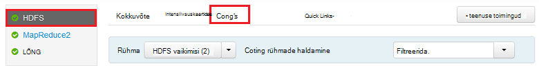
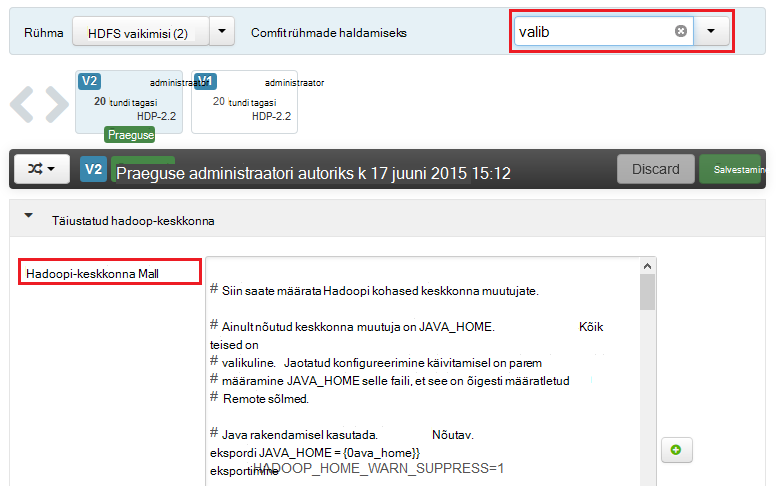
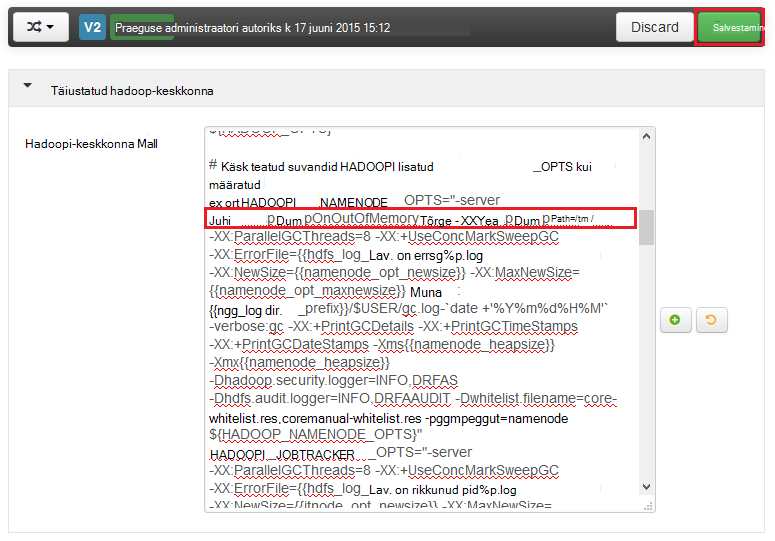
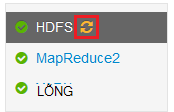
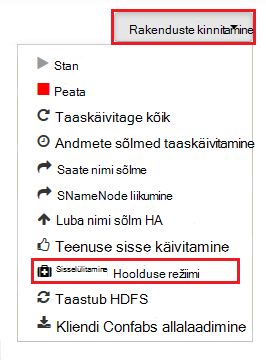
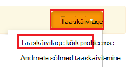

<properties
    pageTitle="Luba hunnik puistab Hadoopi teenuste kohta Hdinsightiga | Microsoft Azure'i"
    description="Luba hunnik puistab Hadoopi teenused Linux-põhine Hdinsightiga kogumite silumine ja analüüsi jaoks."
    services="hdinsight"
    documentationCenter=""
    authors="Blackmist"
    manager="jhubbard"
    editor="cgronlun"
    tags="azure-portal"/>

<tags
    ms.service="hdinsight"
    ms.workload="big-data"
    ms.tgt_pltfrm="na"
    ms.devlang="na"
    ms.topic="article"
    ms.date="09/27/2016"
    ms.author="larryfr"/>

#Luba hunnik puistab Hadoopi teenuste kohta Linux-põhine Hdinsightiga (eelvaade)

[AZURE.INCLUDE [heapdump-selector](../../includes/hdinsight-selector-heap-dump.md)]

Hunnik puistab sisaldavad hetktõmmise rakenduse mälu, sealhulgas muutujate väärtusi prügimäele loomise ajal. Need on väga kasulik diagnoosimise probleemid, mis ilmnevad käitusajal.

> [AZURE.NOTE] Selle artikli teave kehtib ainult Linux-põhine Hdinsightiga. Windowsi-põhiste Hdinsightiga kohta leiate teavet teemast [hunnik puistab Hadoopi Hdinsightiga Windowsi-põhiste teenuste lubamine](hdinsight-hadoop-collect-debug-heap-dumps.md)

## Teenused

Saate lubada hunnik puistab teenuse.

*  **hcatalog** - tempelton
*  **taru** - hiveserver2, metastore, derbyserver
*  **mapreduce** - jobhistoryserver
*  **lõng** - resourcemanager, nodemanager, timelineserver
*  **hdfs** - datanode, secondarynamenode, namenode

Saate lubada hunnik puistab kaardi ja vähendada protsesside parandusfunktsiooni Hdinsightiga järgi.

## Mõistmine hunnik dump konfigureerimine

Hunnik puistab on lubatud, läbides suvandid (mõnikord nimetatakse valib, või parameetrid) abil töötab teenus käivitamisel. Enamik Hadoopi teenuste, saate seda teha muutes shell script kasutatud teenuse käivitamine.

Iga skripti on ekspordi jaoks ** \* \_OPTS**, mis sisaldab edasi töötab soovitud suvandid. Näiteks **hadoop-env.sh** skript, joone mis algab väärtusega `export HADOOP_NAMENODE_OPTS=` sisaldab teenuse NameNode suvandid.

Vastendage ja vähendamiseks protsessid on pisut erinev, nagu need on teenuse MapReduce alluv protsess. Iga kaart või vähendada protsess töötab lapse ümbrises ja sisaldavad töötab suvandid need kaks kirjeid. Mõlemad sisalduvad **mapred-site.xml**:

* **mapreduce.admin.map.Child.Java.opts**
* **mapreduce.admin.reduce.Child.Java.opts**

> [AZURE.NOTE] Soovitame kasutada Ambari muutmiseks skripte ja mapred-site.xml sätted, nagu Ambari tegeleb imitatsiooniga muudatused üle sõlmed klaster. Teatud juhised jaotisest [Ambari abil](#using-ambari) .

###Hunnik puistab lubamine

Järgmine suvand võimaldab hunnik puistab mõne OutOfMemoryError ilmnemisel.

    -XX:+HeapDumpOnOutOfMemoryError

Funktsiooni **+** näitab, et see suvand on lubatud. Vaikimisi on keelatud.

> [AZURE.WARNING] Hunnik puistab pole lubatud Hadoopi teenust Hdinsightiga vaikimisi dump faile võib olla suur. Kui te neid luba tõrkeotsingu jaoks, ärge unustage neid keelata, kui teil on esitatud probleemi ja kogutud mälutõmmise failid.

###Dump asukoht

Tõmmisefaili vaikeasukoht on praegust töötavat kausta. Saate määrata, kus fail on salvestatud järgmine käsk:

    -XX:HeapDumpPath=/path

Olemasolevat `-XX:HeapDumpPath=/tmp` põhjustab puistab talletamise /tmp kataloogis.

###Skriptide

Samuti võite käivitada skripti mõne **OutOfMemoryError** ilmnemisel. Näiteks käivitamise teatise, seega teate, et tõrke tõttu. See on kontrollida järgmine käsk:

    -XX:OnOutOfMemoryError=/path/to/script

> [AZURE.NOTE] Kuna Hadoopi on jaotatud süsteem, mis tahes kasutatud skript peab asuma kõik sõlmed klaster, mis töötab teenus.
>
> Skripti ka olema kohas, kus on kättesaadav konto teenuse töötab ja edastama täitma õigused. Näiteks võite soovida talletada skriptide `/usr/local/bin` ja kasutada `chmod go+rx /usr/local/bin/filename.sh` lugemine ja käivitada õigused.

##Ambari abil

Teenuse konfiguratsiooni muutmiseks tehke järgmist:

1. Avage Ambari veebist UI klaster. URL-i saab https://YOURCLUSTERNAME.azurehdinsight.net.

    Vastava viiba kuvamisel autentida saidi kasutades HTTP konto nimi (vaikimisi: administraator,) ja parool klaster.

    > [AZURE.NOTE] Võidakse teilt teist korda, Ambari kasutajanime ja parooli. Sel juhul lihtsalt uuesti sisestama sama konto nimi ja parool

2. Valige loendist abil vasakul teenuse ala, mida soovite muuta. Näiteks **HDFS**. Valige jaotises keskmist **Configs** menüü.

    

3. Kasuta **filtreerimine...** kirje, sisestage **valib**. See kuvatakse ainult need, mis sisaldavad seda teksti konfiguratsiooni üksuste loendit filtreerida, ja saate kiiresti leida shell script või **malli** , mida saab kasutada nende suvandite määramiseks.

    

4. Otsige üles soovitud ** \* \_OPTS** teenuse kirjet, mida soovite lubada hunnik puistab jaoks ja lisage soovitud suvandid, mida soovite lubada. Järgmisel pildil lisatud `-XX:+HeapDumpOnOutOfMemoryError -XX:HeapDumpPath=/tmp/` abil soovitud **HADOOPI\_NAMENODE\_OPTS** kirje:

    

    > [AZURE.NOTE] Kui lubamine hunnik puistab kaardi või vähendada protsessi, saate selle asemel vaadata väljad on **mapreduce.admin.map.child.java.opts** ja **mapreduce.admin.reduce.child.java.opts**.

    Kasutage muudatuste salvestamiseks nuppu **Salvesta** . Teil on lubatud lühike märge, mis kirjeldab muudatuste sisestamiseks.

5. Kui muudatused on rakendatud, **taaskäivitage nõutav** ikoon kuvatakse ühe või mitme teenuse kõrval.

    

6. Valige iga teenus, mis tuleb uuesti ja kasutada **Rakenduste kinnitamine** nuppu **Lülita sisse hooldustööd**režiim. See takistab teatiste loodud seda teenust kui taaskäivitate selle.

    

7. Kui teil on lubatud hooldus režiimis, kasutada **taaskäivitamiseks** nuppu teenuse, et **Taaskäivitage kõik tehtud**

    

    > [AZURE.NOTE] **taaskäivitage** nupp kirjeid võivad olla erinevad muude teenuste jaoks.

8. Kui teenuste uuesti käivitada, kasutada **Rakenduste kinnitamine** nuppu **hooldustööd**režiimi välja lülitada. Selle jälgimise kohta teatiste saamiseks teenuse jätkamiseks Ambari.
