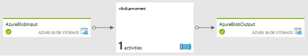
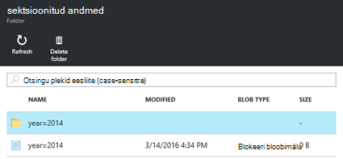
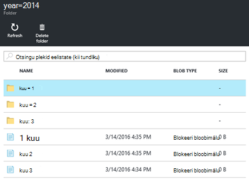

<properties
   pageTitle="Nõudmisel Linux-põhine Hadoopi kogumite loomine abil Azure'i andmed Factory Hdinsightiga | Microsoft Azure'i"
    description="Saate teada, kuidas luua nõudmisel Hdinsightiga kogumite abil Azure'i andmed Factory."
   services="hdinsight"
   documentationCenter=""
   tags="azure-portal"
   authors="mumian"
   manager="jhubbard"
   editor="cgronlun"/>

<tags
   ms.service="hdinsight"
   ms.devlang="na"
   ms.topic="article"
   ms.tgt_pltfrm="na"
   ms.workload="big-data"
   ms.date="10/06/2016"
   ms.author="jgao"/>

# Nõudmisel Linux-põhine Hadoopi kogumite loomine abil Azure'i andmed Factory Hdinsightiga

[AZURE.INCLUDE [selector](../../includes/hdinsight-selector-create-clusters.md)]

[Azure'i andmed Factory](../data-factory/data-factory-introduction.md) on pilvepõhist andmete integreerimine teenus, mis orchestrates ja automatiseerib liikumine ja andmete teisendus. Sellest artiklist saate teada, kuidas Azure'i andmed Factory Looge [Windows Azure Hdinsightiga nõudmisel lingitud teenuse](../data-factory/data-factory-compute-linked-services.md#azure-hdinsight-on-demand-linked-service)ja klaster abil saate käivitada taru töö. Siin on üksikasjalik voogu.

1. Saate luua ka Hdinsightiga kobar nõudmisel.
2. Käivitage taru töö lugeda töötlemata web log andmete allikas bloobimälu salvestusruumi konto, muuta andmeid ja kirjutage väljundi sihtkoha bloobimälu salvestusruumi konto. 
3. Kustutage põhjal aja live klaster.

Taru tegevuse määratletud andmete factory müügivõimaluste kõned eelmääratletud HiveQL skripti. Skript loob välise tabeli, töötlemata web log andmed salvestatakse Azure'i bloobimälu ja seejärel piirded töötlemata andmete aasta ja kuu.

Siin on valimi read iga kuu Sisestuskeel failis.

    2014-01-01,02:01:09,SAMPLEWEBSITE,GET,/blogposts/mvc4/step2.png,X-ARR-LOG-ID=2ec4b8ad-3cf0-4442-93ab-837317ece6a1,80,-,1.54.23.196,Mozilla/5.0+(Windows+NT+6.3;+WOW64)+AppleWebKit/537.36+(KHTML,+like+Gecko)+Chrome/31.0.1650.63+Safari/537.36,-,http://weblogs.asp.net/sample/archive/2007/12/09/asp-net-mvc-framework-part-4-handling-form-edit-and-post-scenarios.aspx,\N,200,0,0,53175,871 
    2014-02-01,02:01:10,SAMPLEWEBSITE,GET,/blogposts/mvc4/step7.png,X-ARR-LOG-ID=d7472a26-431a-4a4d-99eb-c7b4fda2cf4c,80,-,1.54.23.196,Mozilla/5.0+(Windows+NT+6.3;+WOW64)+AppleWebKit/537.36+(KHTML,+like+Gecko)+Chrome/31.0.1650.63+Safari/537.36,-,http://weblogs.asp.net/sample/archive/2007/12/09/asp-net-mvc-framework-part-4-handling-form-edit-and-post-scenarios.aspx,\N,200,0,0,30184,871
    2014-03-01,02:01:10,SAMPLEWEBSITE,GET,/blogposts/mvc4/step7.png,X-ARR-LOG-ID=d7472a26-431a-4a4d-99eb-c7b4fda2cf4c,80,-,1.54.23.196,Mozilla/5.0+(Windows+NT+6.3;+WOW64)+AppleWebKit/537.36+(KHTML,+like+Gecko)+Chrome/31.0.1650.63+Safari/537.36,-,http://weblogs.asp.net/sample/archive/2007/12/09/asp-net-mvc-framework-part-4-handling-form-edit-and-post-scenarios.aspx,\N,200,0,0,30184,871

Skripti loob kolm väljund kausta eelmise sisendeid. Iga kaust sisaldab fail, mille kirjed alates iga kuu.

    adfgetstarted/partitioneddata/year=2014/month=1/000000_0
    adfgetstarted/partitioneddata/year=2014/month=2/000000_0
    adfgetstarted/partitioneddata/year=2014/month=3/000000_0

Andmete Factory andmete teisendus tegevuste Lisaks taru tegevuste loendi leiate teemast [transformatsioon ja analüüsida Azure'i andmed Factory abil](../data-factory/data-factory-data-transformation-activities.md).

Seal on palju kasu koos funktsiooniga andmete factory Hdinsightile:

- Hdinsightiga kogumite arveldus on proportsionaalse minutis, kas kasutate neid või mitte. Andmete Factory kasutamisel luuakse rühmad nõudmisel. Ja rühmad kustutatakse automaatselt, kui töökohtade täitmist.  Nii, et ainult maksate töö töötab ja lühike aja jõudeolekus (--eluiga).
- Saate luua töövoo abil andmete Factory kohaletoimetamisel.
- Saate ajastada Rekursiivsed tööde haldamine.  

> [AZURE.NOTE] Praegu saab luua ainult Linuxi-põhiste Hdinsightiga kobar versioon 3,2 Azure'i andmed Factory.

##Eeltingimused

Enne alustamist selles artiklis antud juhiseid, peab teil olema järgmised üksused:

- [Azure'i tellimus](https://azure.microsoft.com/documentation/videos/get-azure-free-trial-for-testing-hadoop-in-hdinsight/).
- Azure'i CLI või Azure PowerShelli. 

    [AZURE.INCLUDE [use-latest-version](../../includes/hdinsight-use-latest-powershell-and-cli.md)]

##Salvestusruumi konto ettevalmistamine

Sel juhul saate kasutada kuni kolm salvestusruumi kontod:

- vaikekonto salvestusruumi Hdinsightiga kobar
- sisendandmete salvestusruumi konto
- salvestusruumi konto väljundi andmete jaoks

Õpetuse lihtsustamiseks saate ühe salvestusruumi konto otstarvet kolm. Azure'i CLI ja Azure PowerShelli skripti näide selle jaotise leitud teha järgmisi toiminguid:

1. Azure'i sisse logida.
2. Azure'i ressursi rühma loomine.
3. Looge konto Azure Storage.
4. Bloobimälu container salvestusruumi konto loomine
5. Järgmised kaks failide kopeerimine bloobimälu container:

    - Sisendandmete fail: [https://hditutorialdata.blob.core.windows.net/adfhiveactivity/inputdata/input.log](https://hditutorialdata.blob.core.windows.net/adfhiveactivity/inputdata/input.log)
    - HiveQL skripti: [https://hditutorialdata.blob.core.windows.net/adfhiveactivity/script/partitionweblogs.hql](https://hditutorialdata.blob.core.windows.net/adfhiveactivity/script/partitionweblogs.hql)

    Mõlemad failid avaliku bloobimälu ümbrises. 

>[AZURE.IMPORTANT] Kirjutage ressursi rühma nimi, salvestusruumikonto nimi ja kasutada oma skripti salvestusruumi konto võti.  Järgmises jaotises on vaja need.

**Ettevalmistused talletamist ja Azure CLI faile kopeerida**

    azure login
    
    azure config mode arm

    azure group create --name "<Azure Resource Group Name>" --location "East US 2"

    azure storage account create --resource-group "<Azure Resource Group Name>" --location "East US 2" --type "LRS" <Azure Storage Account Name>

    azure storage account keys list --resource-group "<Azure Resource Group Name>" "<Azure Storage Account Name>"
    azure storage container create "adfgetstarted" --account-name "<Azure Storage AccountName>" --account-key "<Azure Storage Account Key>"

    azure storage blob copy start "https://hditutorialdata.blob.core.windows.net/adfhiveactivity/inputdata/input.log" --dest-account-name "<Azure Storage Account Name>" --dest-account-key "<Azure Storage Account Key>" --dest-container "adfgetstarted" 
    azure storage blob copy start "https://hditutorialdata.blob.core.windows.net/adfhiveactivity/script/partitionweblogs.hql" --dest-account-name "<Azure Storage Account Name>" --dest-account-key "<Azure Storage Account Key>" --dest-container "adfgetstarted" 

Container nimi on *adfgetstarted*.  Jätke see, et see on. Muul juhul peate värskendama ressursihalduse mall.

Kui vajate abi selle CLI skripti, leiate [Azure'i CLI Azure Storage abil](../storage/storage-azure-cli.md).

**Ette valmistada talletamist ja kopeerige failid Azure PowerShelli kaudu**

    $resourceGroupName = "<Azure Resource Group Name>"
    $storageAccountName = "<Azure Storage Account Name>"
    $location = "East US 2"

    $sourceStorageAccountName = "hditutorialdata"  
    $sourceContainerName = "adfhiveactivity"

    $destStorageAccountName = $storageAccountName
    $destContainerName = "adfgetstarted" # don't change this value.

    ####################################
    # Connect to Azure
    ####################################
    #region - Connect to Azure subscription
    Write-Host "`nConnecting to your Azure subscription ..." -ForegroundColor Green
    try{Get-AzureRmContext}
    catch{Login-AzureRmAccount}
    #endregion

    ####################################
    # Create a resource group, storage, and container
    ####################################

    #region - create Azure resources
    Write-Host "`nCreating resource group, storage account and blob container ..." -ForegroundColor Green

    New-AzureRmResourceGroup -Name $resourceGroupName -Location $location 
    New-AzureRmStorageAccount `
        -ResourceGroupName $resourceGroupName `
        -Name $destStorageAccountName `
        -type Standard_LRS `
        -Location $location 

    $destStorageAccountKey = (Get-AzureRmStorageAccountKey `
        -ResourceGroupName $resourceGroupName `
        -Name $destStorageAccountName)[0].Value

    $sourceContext = New-AzureStorageContext `
        -StorageAccountName $sourceStorageAccountName `
        -Anonymous
    $destContext = New-AzureStorageContext `
        -StorageAccountName $destStorageAccountName `
        -StorageAccountKey $destStorageAccountKey

    New-AzureStorageContainer -Name $destContainerName -Context $destContext
    #endregion

    ####################################
    # Copy files
    ####################################
    #region - copy files
    Write-Host "`nCopying files ..." -ForegroundColor Green

    $blobs = Get-AzureStorageBlob `
        -Context $sourceContext `
        -Container $sourceContainerName 

    $blobs|Start-AzureStorageBlobCopy `
        -DestContext $destContext `
        -DestContainer $destContainerName

    Write-Host "`nCopied files ..." -ForegroundColor Green
    Get-AzureStorageBlob -Context $destContext -Container $destContainerName 
    #endregion

    Write-host "`nYou will use the following values:" -ForegroundColor Green
    write-host "`nResource group name: $resourceGroupName"
    Write-host "Storage Account Name: $destStorageAccountName"
    write-host "Storage Account Key: $destStorageAccountKey"

    Write-host "`nScript completed" -ForegroundColor Green

Kui vajate abi selle PowerShelli skripti, leiate [Azure'i PowerShelli Azure Storage kaudu](../storage/storage-powershell-guide-full.md).

**Kui soovite uurida salvestusruumi konto ja sisu**

1. [Azure'i portaali](https://portal.azure.com)sisse logida.
2. Klõpsake vasakpoolsel paanil **Ressursi rühmad** .
3. Topeltklõpsake oma CLI või PowerShelli skripti loodud ressursi rühma nime. Kui teil on liiga palju ressursi rühmade loetletud, kasutage filter. 
4. **Ressursside** paan, tuleb teil kui ressursirühma ühiskasutusse teiste projektide üks ressurss. Selle ressursi on salvestusruumi konto teie määratud varem nimega. Klõpsake soovitud salvestusruumikonto nimi.
5. Klõpsake **plekid** paanid.
6. Klõpsake **adfgetstarted** ümbris. Näete kahte kausta: **sisendandmete** ja **skripti**.
7. Avage kaust, ja märkige ruut failid, kaustad.
 
## Andmete factory loomine

Salvestusruumi konto, sisendandmete ja HiveQL skripti, mis on valmis, olete valmis looma on Azure andmete factory. On mitu võimalust andmete factory loomise kohta. Azure portaali abil saate helistada ressursihalduse kohandatud malli selles õpetuses. [Azure'i CLI](../resource-group-template-deploy.md#deploy-with-azure-cli-for-mac-linux-and-windows) ja [Azure PowerShelli](../resource-group-template-deploy.md#deploy-with-powershell)kaudu saate helistada ka ressursihalduse mall. Muud andmed factory loomise meetodid, leiate teemast [õpetus: koostamiseks oma andmeid esimese factory](../data-factory/data-factory-build-your-first-pipeline.md).

Kõrgeima taseme ressursihalduse Mall sisaldab:

    {
        "contentVersion": "1.0.0.0",
        "$schema": "http://schema.management.azure.com/schemas/2015-01-01/deploymentTemplate.json#",
        "parameters": { ...
        },
        "variables": { ...
        },
        "resources": [
            {
                "name": "[parameters('dataFactoryName')]",
                "apiVersion": "[variables('apiVersion')]",
                "type": "Microsoft.DataFactory/datafactories",
                "location": "westus",
                "resources": [
                    { ... },
                    { ... },
                    { ... },
                    { ... }
                ]
            }
        ]
    }

See sisaldab üks andmete factory ressurss nimetatakse *hdinsightiga taru nõudmisel* (nime ei kuvata pildil). Andmete factory pole praegu toetatud üksnes Lääne USA piirkonnas ja Põhja-Euroopa piirkonna. 

Ressursi *hdinsightiga taru nõudmisel* sisaldab nelja ressursse:

- Mõne linkedservice kasutatakse Hdinsightiga salvestusruumi vaikekonto, sisendandmete salvestusruumi ja väljundi andmesalv salvestusruumi kontole.
- Mõne linkedservice Hdinsightiga klaster luua:

        {
            "dependsOn": [ ... ],
            "type": "linkedservices",
            "name": "[variables('hdInsightOnDemandLinkedServiceName')]",
            "apiVersion": "[variables('apiVersion')]",
            "properties": {
                "type": "HDInsightOnDemand",
                "typeProperties": {
                    "osType": "linux",
                    "version": "3.2",
                    "clusterSize": 1,
                    "sshUserName": "myuser",                            
                    "sshPassword": "MyPassword!",
                    "timeToLive": "00:30:00",
                    "linkedServiceName": "[variables('storageLinkedServiceName')]"
                }
            }
        },

    Isegi juhul, kui see pole määratud, luuakse klaster piirkonna salvestusruumi konto.
    
    Pange tähele *timeToLive* säte. Andmete factory kustutab klaster automaatselt pärast klaster on jõude 30 minutit.
- Andmekomplekt sisendandmete. Faili nime ja kausta nimi on määratletud siin.

        "fileName": "input.log",
        "folderPath": "adfgetstarted/inputdata",
        
- Andmekomplekt väljundi andmed ja seejärel müügivõimaluste andmete töötlemiseks. Väljundi tee määratletakse järgnevalt:
        
        "folderPath": "adfgetstarted/partitioneddata",

    [Andmekomplekti-saadavus](../data-factory/data-factory-create-datasets.md#Availability) säte on järgmine:
    
        "availability": {
            "frequency": "Month",
            "interval": 1,
            "style": "EndOfInterval"
        },

    Azure'i andmed Factory, klõpsake väljundi andmekomplekti kättesaadavus draivid tulemas. See tähendab, et sektorit valmistatakse iga kuu viimase päevani, kuu. Lisateavet leiate teemast [andmete Factory plaanimis- ja täitmise](../data-factory/data-factory-scheduling-and-execution.md).

    Müügivõimaluste määratlus on järgmine:
    
        {
            "dependsOn": [ ... ],
            "type": "datapipelines",
            "name": "[parameters('dataFactoryName')]",
            "apiVersion": "[variables('apiVersion')]",
            "properties": {
                "description": "Azure Data Factory pipeline with an Hadoop Hive activity",
                "activities": [
                    { ...}
                ],
                "start": "2016-01-01T00:00:00Z",
                "end": "2016-01-31T00:00:00Z",
                "isPaused": false
            }
        }
                
    See sisaldab üks tegevus. Nii *algus* ja *lõpp* tegevuse on viimase kuupäeva, mis tähendab, on ainult üks. Kui lõpp on kuupäev, loob andmete factory teise sektorit, kui saabub aeg. Lisateavet leiate teemast [andmete Factory plaanimis- ja täitmise](../data-factory/data-factory-scheduling-and-execution.md).

    Järgmise Json skripti on tegevuste määratlus.
    
        "activities": [
            {
                "type": "HDInsightHive",
                "typeProperties": {
                    "scriptPath": "adfgetstarted/script/partitionweblogs.hql",
                    "scriptLinkedService": "[variables('storageLinkedServiceName')]",
                    "defines": {
                        "inputtable": "[concat('wasbs://adfgetstarted@', parameters('storageAccountName'), '.blob.core.windows.net/inputdata')]",
                        "partitionedtable": "[concat('wasbs://adfgetstarted@', parameters('storageAccountName'), '.blob.core.windows.net/partitioneddata')]"
                    }
                },
                "inputs": [
                    {
                        "name": "AzureBlobInput"
                    }
                ],
                "outputs": [
                    {
                        "name": "AzureBlobOutput"
                    }
                ],
                "policy": {
                    "concurrency": 1,
                    "retry": 3
                },
                "name": "RunSampleHiveActivity",
                "linkedServiceName": "HDInsightOnDemandLinkedService"
            }
        ],
    
    Sisendeid, väljundeid ja skripti tee on määratletud.
    
**Andmete factory loomiseks**

1. Klõpsake järgmisel pildil Azure'i sisse logida ja avage Mall, ressursside haldamine Azure'i portaalis. Mall on https://hditutorialdata.blob.core.windows.net/adfhiveactivity/data-factory-hdinsight-on-demand.json. 

    

2. Sisestage **DATAFACTORYNAME**, **STORAGEACCOUNTNAME** ja **STORAGEACCOUNTKEY** loodud viimase jaotises konto ja seejärel klõpsake nuppu **OK**. Andmete Factory nimi peab olema globaalselt kordumatu.
3. **Ressursirühm**valige jaotises viimati kasutatud sama ressursirühma.
4. Klõpsake **õiguslikult**ja seejärel klõpsake nuppu **Loo**.
5. Klõpsake nuppu **Loo**. Kuvatakse paan nimega **malli juurutamine juurutamise**armatuurlaual. Oodake, kuni paani tekst on muutunud ressursi rühma nime. Luua ka Hdinsightiga kobar kulub tavaliselt umbes 20 minutit.
6. Klõpsake paani avamiseks ressursirühma. Nüüd kuvatakse üks rohkem andmeid factory ressurss loetletud Lisaks salvestusruumi konto ressursi.
7. Klõpsake **hdinsightiga taru nõudmisel**.
8. Klõpsake **diagrammi** paani. Joonisel on Sisestuskeel andmekomplekti ja mõne väljundi andmekomplekti ühe tegevuse:

    
    
    Ressursside haldamine mall on määratletud nimed.
9. Topeltklõpsake **AzureBlobOutput**.
10. Klõpsake **hiljutised värskendatud sektorid**näete ühe sektorit. Kui olek on **pooleli**, oodake, kuni see muutub **valmis**.

**Andmete factory väljundi kontrollitavad**

1. Sama toimingut kasutamine liigutakse ümbriste adfgetstarted-ümbrisest kontrollida. On kaks uut ümbriste Lisaks **adfgetsarted**.

    - adfhdinsight-Hive-on-demand-hdinsightondemandlinked-xxxxxxxxxxxxx: see on vaikimisi container Hdinsightiga kobar jaoks. Container vaikenime järgib muster: "adf<yourdatafactoryname>- linkedservicename-datetimestamp". 
    - adfjobs: see on ADF töö logide ümbrises.
    
    Andmete factory väljund on salvestatud afgetstarted nagu ressursihalduse malli konfigureeritud. 
2. Klõpsake **adfgetstarted**.
3. Topeltklõpsake **partitioneddata**. Kuvatakse soovitud **aasta = 2014** kausta sest web logid on kirjas aasta 2014. 

    

    Kui te süvitsi loend, kuvatakse kolm kausta jaoks jaanuar, veebruari ja märtsi. Ja ei Logi iga kuu.

    

##Õpetuse puhastamiseks

Nõudmisel Hdinsightiga lingitud teenusega on Hdinsightiga kobar luuakse iga kord, kui mõnda sektorit peab olema töödeldud juhul, kui seal on olemasolev reaalajas kobar (timeToLive); ja klaster on kustutatud, kui töötlemine on lõpule jõudnud. Iga kobar Azure'i andmed Factory loob Azure'i bloobimälu, kasutada failisüsteemi klaster.  Kuigi Hdinsightiga kobar on kustutatud, vaikimisi bloobimälu salvestusruumi container ja seotud salvestusruumi konto ei kustutata. See on kujundus. Nagu töödeldakse veel sektoritele, näete oma Azure'i bloobimälu ümbriste palju. Kui te ei pea neid tõrkeotsingu tööd, võite kustutage need salvestusruumi kuidagi vähendada. Järgige neid ümbriste nimed mustri: "adfyourdatafactoryname-linkedservicename-datetimestamp". 

[Azure'i ressursihaldur](../azure-resource-manager/resource-group-overview.md) kasutatakse juurutada, hallata ja jälgida oma lahenduse rühmana.  Ressursirühma kustutamisel kustutatakse kõik komponendid rühma sees.  

**Ressursirühma kustutamine**

1. [Azure'i portaali](https://portal.azure.com)sisse logida.
2. Klõpsake vasakpoolsel paanil **Ressursi rühmad** .
3. Topeltklõpsake oma CLI või PowerShelli skripti loodud ressursi rühma nime. Kui teil on liiga palju ressursi rühmade loetletud, kasutage filter. See avatakse uus laba ressursirühma.
4. Klõpsake paani **ressursse** , tuleb teil salvestusruumi vaikekonto ja andmete factory, kui muud projektide ressursirühma ühiskasutusse.
5. Peal tera nuppu **Kustuta** . Nii saate kustutatakse ka salvestusruumi konto ja konto salvestusruumi talletatud andmed.
6. Sisestage ressursi rühma nime ja seejärel klõpsake käsku **Kustuta**.

Juhuks, kui te ei soovi salvestusruumi konto kustutamine kui kustutate ressursirühma, võite kaaluda järgmist arhitektuur kujundus, eraldades äriandmete vaikekonto salvestusruumi. Sel juhul peate ühe ressursirühm andmetega Businessi salvestusruumi konto ja muud ressursirühm vaikekonto salvestusruumi ja andmete factory.  Teine ressursirühm kustutamisel ei mõjuta business andmete salvestusruumi konto.  Selleks: 

- Lisage järgmine ülataseme ressursirühm koos Microsoft.DataFactory/datafactories ressursi malli ressursside haldamine. See loob uue salvestusruumi konto:

        {
            "name": "[parameters('defaultStorageAccountName')]",
            "type": "Microsoft.Storage/storageAccounts",
            "location": "[parameters('location')]",
            "apiVersion": "[variables('defaultApiVersion')]",
            "dependsOn": [ ],
            "tags": {

            },
            "properties": {
                "accountType": "Standard_LRS"
            }
        },

- Uue konto salvestusruumi uue lingitud teenuse punkti lisamiseks tehke järgmist.

        {
            "dependsOn": [ "[concat('Microsoft.DataFactory/dataFactories/', parameters('dataFactoryName'))]" ],
            "type": "linkedservices",
            "name": "[variables('defaultStorageLinkedServiceName')]",
            "apiVersion": "[variables('apiVersion')]",
            "properties": {
                "type": "AzureStorage",
                "typeProperties": {
                    "connectionString": "[concat('DefaultEndpointsProtocol=https;AccountName=',parameters('defaultStorageAccountName'),';AccountKey=',listKeys(resourceId('Microsoft.Storage/storageAccounts', variables('defaultStorageAccountName')), variables('defaultApiVersion')).key1)]"
                }
            }
        },
    
- Ei leia soovitud täiendavad dependsOn ja mõne additionalLinkedServiceNames Hdinsightiga nõudmisel lingitud teenuse konfigureerimine:

        {
            "dependsOn": [
                "[concat('Microsoft.DataFactory/dataFactories/', parameters('dataFactoryName'))]",
                "[concat('Microsoft.DataFactory/dataFactories/', parameters('dataFactoryName'), '/linkedservices/', variables('defaultStorageLinkedServiceName'))]",
                "[concat('Microsoft.DataFactory/dataFactories/', parameters('dataFactoryName'), '/linkedservices/', variables('storageLinkedServiceName'))]"
                
            ],
            "type": "linkedservices",
            "name": "[variables('hdInsightOnDemandLinkedServiceName')]",
            "apiVersion": "[variables('apiVersion')]",
            "properties": {
                "type": "HDInsightOnDemand",
                "typeProperties": {
                    "osType": "linux",
                    "version": "3.2",
                    "clusterSize": 1,
                    "sshUserName": "myuser",                            
                    "sshPassword": "MyPassword!",
                    "timeToLive": "00:30:00",
                    "linkedServiceName": "[variables('storageLinkedServiceName')]",
                    "additionalLinkedServiceNames": "[variables('defaultStorageLinkedServiceName')]"
                }
            }
        },            

##Järgmised sammud
Selles artiklis on õppinud, kuidas Azure'i andmed Factory abil saate luua nõudmisel Hdinsightiga kobar töödelda taru tööde haldamine. Lugeda Lisateavet:

- [Hadoopi õpetus: alustamine Hdinsightiga Linux-põhine Hadoopi kasutamine](hdinsight-hadoop-linux-tutorial-get-started.md)
- [Loomine Hadoopi Linux-põhine kogumite Hdinsightiga](hdinsight-hadoop-provision-linux-clusters.md)
- [Hdinsightiga dokumentatsioon](https://azure.microsoft.com/documentation/services/hdinsight/)
- [Andmete factory dokumentatsioon](https://azure.microsoft.com/documentation/services/data-factory/)

