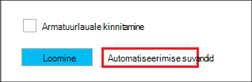

<properties
   pageTitle="Loomine Hadoopi Linux-põhine kogumite Hdinsightiga Azure ressursihaldur mallide kasutamine | Microsoft Azure'i"
    description="Saate teada, kuidas luua kogumite Azure'i Azure ressursihaldur mallide kasutamine Windows Azure Hdinsightiga."
   services="hdinsight"
   documentationCenter=""
   tags="azure-portal"
   authors="mumian"
   manager="jhubbard"
   editor="cgronlun"/>

<tags
   ms.service="hdinsight"
   ms.devlang="na"
   ms.topic="article"
   ms.tgt_pltfrm="na"
   ms.workload="big-data"
   ms.date="09/02/2016"
   ms.author="jgao"/>

# Loomine Hadoopi Linux-põhine kogumite Hdinsightiga Azure ressursihaldur mallide kasutamine

[AZURE.INCLUDE [selector](../../includes/hdinsight-selector-create-clusters.md)]

Saate teada, kuidas luua Hdinsightiga kogumite Azure'i ressursi Manager(ARM) mallide kasutamine. Lisateabe saamiseks vt [Deploy rakenduse Azure'i ressursihaldur malli abil](../resource-group-template-deploy.md). Muud kobar loomise tööriistade ja funktsioonide klõpsake selle lehe ülaosas valige menüü või näha [kobar loomise võimalused](hdinsight-provision-clusters.md#cluster-creation-methods).

##Eeltingimused

[AZURE.INCLUDE [delete-cluster-warning](../../includes/hdinsight-delete-cluster-warning.md)]

Enne alustamist selles artiklis antud juhiseid, peab teil olema järgmised:

- [Azure'i tellimus](https://azure.microsoft.com/documentation/videos/get-azure-free-trial-for-testing-hadoop-in-hdinsight/).
- Azure'i PowerShelli ja/või Azure'i CLI

    [AZURE.INCLUDE [use-latest-version](../../includes/hdinsight-use-latest-powershell-and-cli.md)]

### Accessi kontrolli nõuded

[AZURE.INCLUDE [access-control](../../includes/hdinsight-access-control-requirements.md)]

## Ressursihaldur Mallid

Ressursihaldur malli abil on lihtne luua rakenduse ühe koordineeritud kasutusel Hdinsightiga kogumite, nende sõltuvad ressursid (nt vaikekonto salvestusruumi) ja muud ressursid (nt Azure'i SQL-andmebaasi kasutama Apache Sqoop). Malli, saate ressursse, mis on vajalikud rakenduse määratlemine ja juurutamise parameetrite väärtused viibite sisestamiseks. Mall sisaldab JSON ja avaldised, mille abil saate koostada oma juurutamiseks väärtused.

Ressursihaldur mall on Hdinsightiga kobar ja sõltuvad Azure Storage konto loomise kohta leiate [A lisa](#appx-a-arm-template). Kasutage platvormidel [VSCode](https://code.visualstudio.com/#alt-downloads) [ressursihaldur pikendamine](https://marketplace.visualstudio.com/items?itemName=msazurermtools.azurerm-vscode-tools) või tekstiredaktoris malli salvestamiseks klõpsake oma töökoha-failiks. Saate teada, kuidas kutsuda malli abil mitmel viisil.

Ressursihaldur malli kohta leiate lisateavet teemast

- [Autori Azure'i ressursihaldur Mallid](../resource-group-authoring-templates.md)
- [Azure'i ressursihaldur malliga rakenduse juurutamine](../resource-group-template-deploy.md)

Välja selgitada JSON skeemi teatud elemente, saate tehke järgmist.

1. Avage [Azure'i portaalis](https://porta.azure.com) on Hdinsightiga kobar loomiseks.  Vaadake [rakenduses portaalis Azure Hdinsightiga kogumite loomine Linux-põhine](hdinsight-hadoop-create-linux-clusters-portal.md).
2. Nõutavat elementi ja vajate JSON skeemi elementide konfigureerimine.
3. Klõpsake enne nupu **Loo**, **automatiseerimise suvandid** , nagu on näidatud järgmine pilt:

    

    Portaali loob ressursihaldur malli põhjal oma konfiguratsioone.
## PowerShelliga juurutamine

Järgmine toiming loob Linux-põhine Hdinsightiga kobar.

**Juurutamiseks klaster ressursihaldur malli abil**

1. Salvestage fail json liites [A](#appx-a-arm-template) oma töökoha. PowerShelli skripti, faili nimi on *C:\HDITutorials-ARM\hdinsight-arm-template.json*.
2. Vajaduse korral saate määrata parameetrid ja muutujat.
3. Käivitage malli, kasutades järgmist PowerShelli skripti:

        ####################################
        # Set these variables
        ####################################
        #region - used for creating Azure service names
        $nameToken = "<Enter an Alias>" 
        $templateFile = "C:\HDITutorials-ARM\hdinsight-arm-template.json"
        #endregion

        ####################################
        # Service names and varialbes
        ####################################
        #region - service names
        $namePrefix = $nameToken.ToLower() + (Get-Date -Format "MMdd")

        $resourceGroupName = $namePrefix + "rg"
        $hdinsightClusterName = $namePrefix + "hdi"
        $defaultStorageAccountName = $namePrefix + "store"
        $defaultBlobContainerName = $hdinsightClusterName

        $location = "East US 2"

        $armDeploymentName = $namePrefix
        #endregion

        ####################################
        # Connect to Azure
        ####################################
        #region - Connect to Azure subscription
        Write-Host "`nConnecting to your Azure subscription ..." -ForegroundColor Green
        try{Get-AzureRmContext}
        catch{Login-AzureRmAccount}
        #endregion

        # Create a resource group
        New-AzureRmResourceGroup -Name $resourceGroupName -Location $Location

        # Create cluster and the dependent storage accounge
        $parameters = @{clusterName="$hdinsightClusterName"}

        New-AzureRmResourceGroupDeployment `
            -Name $armDeploymentName `
            -ResourceGroupName $resourceGroupName `
            -TemplateFile $templateFile `
            -TemplateParameterObject $parameters

        # List cluster
        Get-AzureRmHDInsightCluster -ResourceGroupName $resourceGroupName -ClusterName $hdinsightClusterName 

    PowerShelli skripti konfigureerib ainult kobar nimi. Salvestusruumikonto nimi on kõva malli. Teil palutakse sisestada kobar kasutaja parooli (vaikimisi kasutajanimi on *admin*); ja SSH kasutaja parooli (vaikimisi SSH kasutajanimi on *sshuser*).  
    
Lisateavet leiate teemast [Deploy PowerShelli abil](../resource-group-template-deploy.md#deploy-with-powershell).

## Azure'i CLI juurutamine

Järgmises näites luuakse klaster ning sõltuvad salvestusruumi konto ja container ressursihaldur malli helistades:

    azure login
    azure config mode arm
    azure group create -n hdi1229rg -l "East US"
    azure group deployment create --resource-group "hdi1229rg" --name "hdi1229" --template-file "C:\HDITutorials-ARM\hdinsight-arm-template.json"
    
Teil palutakse sisestada kobar nimi, kobar kasutaja parooli (vaikimisi kasutajanimi on *admin*) ja SSH kasutaja parooli (vaikimisi SSH kasutajanimi on *sshuser*). Anda reas-parameetrid:

    azure group deployment create --resource-group "hdi1229rg" --name "hdi1229" --template-file "c:\Tutorials\HDInsightARM\create-linux-based-hadoop-cluster-in-hdinsight.json" --parameters '{\"clusterName\":{\"value\":\"hdi1229\"},\"clusterLoginPassword\":{\"value\":\"Pass@word1\"},\"sshPassword\":{\"value\":\"Pass@word1\"}}'

## REST API-ga juurutamine

Vt [juurutamine REST API-ga](../resource-group-template-deploy.md#deploy-with-the-rest-api).

## Visual Studio juurutamine

Visual Studio saate projekti ressursside rühma loomine ja juurutamine Azure kasutajaliidese kaudu. Valige ressursse, mis sisaldavad projekti tüüpi ja nende ressursside lisatakse automaatselt ressursihaldur malli. Projekti käigus pakutakse PowerShelli skripti malli.

Vaadake lühitutvustust Visual Studio abil ressursi rühmad, [loomine ja juurutamine Azure ressursi rühma kaudu Visual Studio](../vs-azure-tools-resource-groups-deployment-projects-create-deploy.md).

##Järgmised sammud
Selles artiklis on õppinud loomiseks Hdinsightiga kobar on mitu võimalust. Lisateabe saamiseks lugege järgmisi artikleid:

- Näiteks juurutamine .net-i kliendi teek abil, vt [Deploy ressursid .NET teekide ja malli abil](../virtual-machines/virtual-machines-windows-csharp-template.md).
- Põhjalikumat näiteks rakenduse juurutamine, lugege teemat [ettevalmistamine ja juurutamine microservices ootuspäraselt sisse Azure'i](../app-service-web/app-service-deploy-complex-application-predictably.md).
- Oma lahenduse juurutamine viibite juhised leiate teemast [arendamine ja testi keskkonnas Microsoft Azure](../solution-dev-test-environments.md).
- Azure'i ressursihaldur malli jaotiste kohta leiate teemast [funktsiooniga Mallid](../resource-group-authoring-templates.md).
- Saate kasutada Azure ressursihaldur mallis funktsioonide loendi leiate teemast [malli funktsioonid](../resource-group-template-functions.md).

##Appx-v: ressursihaldur Mall

Järgmised Azure'i ressursi sõim mall loob Linux-põhine Hadoopi kobar sõltuvad Azure storage konto. 

> [AZURE.NOTE] Valimi sisaldab konfiguratsiooniteavet taru metastore ja Oozie metastore.  Jaotise eemaldamine või konfigureerimine jaotises enne malli abil.

    {
    "$schema": "https://schema.management.azure.com/schemas/2015-01-01/deploymentTemplate.json#",
    "contentVersion": "1.0.0.0",
    "parameters": {
        "clusterName": {
        "type": "string",
        "metadata": {
            "description": "The name of the HDInsight cluster to create."
        }
        },
        "clusterLoginUserName": {
        "type": "string",
        "defaultValue": "admin",
        "metadata": {
            "description": "These credentials can be used to submit jobs to the cluster and to log into cluster dashboards."
        }
        },
        "clusterLoginPassword": {
        "type": "securestring",
        "metadata": {
            "description": "The password must be at least 10 characters in length and must contain at least one digit, one non-alphanumeric character, and one upper or lower case letter."
        }
        },
        "sshUserName": {
        "type": "string",
        "defaultValue": "sshuser",
        "metadata": {
            "description": "These credentials can be used to remotely access the cluster."
        }
        },
        "sshPassword": {
        "type": "securestring",
        "metadata": {
            "description": "The password must be at least 10 characters in length and must contain at least one digit, one non-alphanumeric character, and one upper or lower case letter."
        }
        },
        "location": {
        "type": "string",
        "defaultValue": "East US",
        "allowedValues": [
            "East US",
            "East US 2",
            "North Central US",
            "South Central US",
            "West US",
            "North Europe",
            "West Europe",
            "East Asia",
            "Southeast Asia",
            "Japan East",
            "Japan West",
            "Australia East",
            "Australia Southeast"
        ],
        "metadata": {
            "description": "The location where all azure resources will be deployed."
        }
        },
        "clusterType": {
        "type": "string",
        "defaultValue": "hadoop",
        "allowedValues": [
            "hadoop",
            "hbase",
            "storm",
            "spark"
        ],
        "metadata": {
            "description": "The type of the HDInsight cluster to create."
        }
        },
        "clusterWorkerNodeCount": {
        "type": "int",
        "defaultValue": 2,
        "metadata": {
            "description": "The number of nodes in the HDInsight cluster."
        }
        }
    },
    "variables": {
        "defaultApiVersion": "2015-05-01-preview",
        "clusterApiVersion": "2015-03-01-preview",
        "clusterStorageAccountName": "[concat(parameters('clusterName'),'store')]"
    },
    "resources": [
        {
        "name": "[variables('clusterStorageAccountName')]",
        "type": "Microsoft.Storage/storageAccounts",
        "location": "[parameters('location')]",
        "apiVersion": "[variables('defaultApiVersion')]",
        "dependsOn": [ ],
        "tags": { },
        "properties": {
            "accountType": "Standard_LRS"
        }
        },
        {
        "name": "[parameters('clusterName')]",
        "type": "Microsoft.HDInsight/clusters",
        "location": "[parameters('location')]",
        "apiVersion": "[variables('clusterApiVersion')]",
        "dependsOn": [ "[concat('Microsoft.Storage/storageAccounts/',variables('clusterStorageAccountName'))]" ],
        "tags": {

        },
        "properties": {
            "clusterVersion": "3.4",
            "osType": "Linux",
            "tier": "standard",
            "clusterDefinition": {
            "kind": "[parameters('clusterType')]",
            "configurations": {
                "gateway": {
                "restAuthCredential.isEnabled": true,
                "restAuthCredential.username": "[parameters('clusterLoginUserName')]",
                "restAuthCredential.password": "[parameters('clusterLoginPassword')]"
                },
                "hive-site": {
                    "javax.jdo.option.ConnectionDriverName": "com.microsoft.sqlserver.jdbc.SQLServerDriver",
                    "javax.jdo.option.ConnectionURL": "jdbc:sqlserver://myadla0901dbserver.database.windows.net;database=myhive20160901;encrypt=true;trustServerCertificate=true;create=false;loginTimeout=300",
                    "javax.jdo.option.ConnectionUserName": "johndole",
                    "javax.jdo.option.ConnectionPassword": "myPassword$"
                },
                "hive-env": {
                    "hive_database": "Existing MSSQL Server database with SQL authentication",
                    "hive_database_name": "myhive20160901",
                    "hive_database_type": "mssql",
                    "hive_existing_mssql_server_database": "myhive20160901",
                    "hive_existing_mssql_server_host": "myadla0901dbserver.database.windows.net",
                    "hive_hostname": "myadla0901dbserver.database.windows.net"
                },
                "oozie-site": {
                    "oozie.service.JPAService.jdbc.driver": "com.microsoft.sqlserver.jdbc.SQLServerDriver",
                    "oozie.service.JPAService.jdbc.url": "jdbc:sqlserver://myadla0901dbserver.database.windows.net;database=myhive20160901;encrypt=true;trustServerCertificate=true;create=false;loginTimeout=300",
                    "oozie.service.JPAService.jdbc.username": "johndole",
                    "oozie.service.JPAService.jdbc.password": "myPassword$",
                    "oozie.db.schema.name": "oozie"
                },
                "oozie-env": {
                    "oozie_database": "Existing MSSQL Server database with SQL authentication",
                    "oozie_database_name": "myhive20160901",
                    "oozie_database_type": "mssql",
                    "oozie_existing_mssql_server_database": "myhive20160901",
                    "oozie_existing_mssql_server_host": "myadla0901dbserver.database.windows.net",
                    "oozie_hostname": "myadla0901dbserver.database.windows.net"
                }            
            }
            },
            "storageProfile": {
            "storageaccounts": [
                {
                "name": "[concat(variables('clusterStorageAccountName'),'.blob.core.windows.net')]",
                "isDefault": true,
                "container": "[parameters('clusterName')]",
                "key": "[listKeys(resourceId('Microsoft.Storage/storageAccounts', variables('clusterStorageAccountName')), variables('defaultApiVersion')).key1]"
                }
            ]
            },
            "computeProfile": {
            "roles": [
                {
                "name": "headnode",
                "targetInstanceCount": "2",
                "hardwareProfile": {
                    "vmSize": "Standard_D3"
                },
                "osProfile": {
                    "linuxOperatingSystemProfile": {
                    "username": "[parameters('sshUserName')]",
                    "password": "[parameters('sshPassword')]"
                    }
                }
                },
                {
                "name": "workernode",
                "targetInstanceCount": "[parameters('clusterWorkerNodeCount')]",
                "hardwareProfile": {
                    "vmSize": "Standard_D3"
                },
                "osProfile": {
                    "linuxOperatingSystemProfile": {
                    "username": "[parameters('sshUserName')]",
                    "password": "[parameters('sshPassword')]"
                    }
                }
                }
            ]
            }
        }
        }
    ],
    "outputs": {
        "cluster": {
        "type": "object",
        "value": "[reference(resourceId('Microsoft.HDInsight/clusters',parameters('clusterName')))]"
        }
    }
    }
