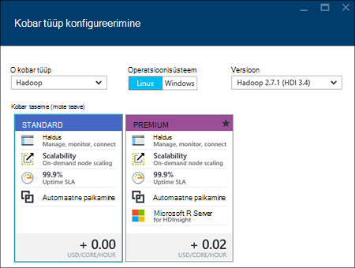

<properties
    pageTitle="Loomine Hadoopi, HBase, torm või säde kogumite Linux Hdinsightiga portaali sisse | Microsoft Azure'i"
    description="Saate teada, kuidas luua Hadoopi, HBase, torm või säde kogumite Linux Hdinsightiga veebibrauseri ja Azure eelvaade portaali abil."
    services="hdinsight"
    documentationCenter=""
    authors="nitinme"
    manager="jhubbard"
    editor="cgronlun"
    tags="azure-portal"/>

<tags
    ms.service="hdinsight"
    ms.devlang="na"
    ms.topic="article"
    ms.tgt_pltfrm="na"
    ms.workload="big-data"
    ms.date="10/05/2016"
    ms.author="nitinme"/>

#Luua Linux-põhine kogumite portaalis Azure Hdinsightiga

[AZURE.INCLUDE [selector](../../includes/hdinsight-selector-create-clusters.md)]

Azure'i portaal on veebipõhine haldustööriista teenuste ja Microsoft Azure'i pilves majutatud ressursid. Sellest artiklist saate teada, kuidas luua Linux-põhine Hdinsightiga kogumite portaalis.

## Eeltingimused

[AZURE.INCLUDE [delete-cluster-warning](../../includes/hdinsight-delete-cluster-warning.md)]

- **An Azure'i tellimus**. Leiate [Azure'i saada tasuta prooviversioon](https://azure.microsoft.com/documentation/videos/get-azure-free-trial-for-testing-hadoop-in-hdinsight/).
- __Tänapäevane veebibrauseris__. Azure'i portaal kasutab HTML5-versioonis ja JavaScripti ja ei pruugi õigesti vanemate veebibrauseris.

### Accessi kontrolli nõuded

[AZURE.INCLUDE [access-control](../../includes/hdinsight-access-control-requirements.md)]

##Kogumite loomine

Azure'i portaalis seab enamik kobar atribuudid. Azure'i ressursihaldur malli abil saate peita palju üksikasjad. Lisateabe saamiseks lugege teemat [loomine Linux-põhine Hadoopi le Hdinsightiga Azure ressursihaldur mallide kasutamine](hdinsight-hadoop-create-linux-clusters-arm-templates.md).

1. [Azure'i portaali](https://portal.azure.com)sisse logida.

2. Klõpsake nuppu **Uus**, klõpsake **Andmete analüüsimise**ja seejärel käsku **Hdinsightiga**.

    ![Uus klaster Azure portaali loomine] (./media/hdinsight-hadoop-create-linux-cluster-portal/HDI.CreateCluster.1.png "Uus klaster Azure portaali loomine")
3. Sisestage **Kobar nimi**: see nimi peab olema kordumatu globaalselt.
4. Klõpsake nuppu **Vali kobar tüüp**ja seejärel valige.

    - **Kobar tüüp**: kui te ei tea, mida soovite valida, valige **Hadoopi**. See on kõige populaarsemate kobar tüüp.

        > [AZURE.IMPORTANT] Hdinsightiga kogumite tulevad erinevaid töökoormus või klaster on häälestatud, mis vastavad tüüpi. Ei ole toetatud meetodit klaster, mis ühendab mitu tüüpi, nt torm ja HBase sisse ühe kobar loomiseks. 

    - **Operatsioonisüsteem**: valige **Linux**.
    - **Versioon**: vaikeversiooniks kasutada, kui te ei tea, mida soovite valida. Lisateabe saamiseks vt [Hdinsightiga kobar versioonid](hdinsight-component-versioning.md).
    - **Kobar taseme**: Windows Azure Hdinsightiga pakub suur andmete pilve pakkumisi kahte kategooriasse: Standard taseme- ja Premium taseme. Lisateavet leiate teemast [kobar astme](hdinsight-hadoop-provision-linux-clusters.md#cluster-tiers).
    
    

4. Klõpsake **tellimuse** Azure'i tellimus, mida kasutatakse klaster valimiseks.

5. **Ressursirühm** ressursi olemasolevasse rühma valimiseks klõpsake, või klõpsake nuppu **Uus** , et luua uue ressursirühma

    > [AZURE.NOTE] See kirje vaikimisi ühte ressursi rühmi, kui mõni on saadaval.

6. Klõpsake **mandaat** ja sisestage administraatori kasutaja parooli. Peate sisestama mõne **SSH kasutajanimi** ja kas **parooli** või **Avalik võti**, mida kasutatakse SSH autentida. Soovitatav on avalik võti abil. Klõpsake allosas identimisteabe konfiguratsiooni salvestamiseks **Valige** .

    ![Mandaadi kobar] (./media/hdinsight-hadoop-create-linux-cluster-portal/HDI.CreateCluster.3.png "Mandaadi kobar")

    HDInsight SSH kasutamise kohta lisateabe saamiseks vt ühte järgmistest artiklitest:

    * [Kasutada SSH Linux-põhine Hadoopi Hdinsightiga Linux, Unix või OS X](hdinsight-hadoop-linux-use-ssh-unix.md)
    * [Kasutada SSH Linux-põhine Hadoopi Windows Hdinsightiga](hdinsight-hadoop-linux-use-ssh-windows.md)

7. Klõpsake **Andmeallika** olemasoleva andmeallika jaoks klaster valimiseks või looge uus.

    ![Andmeallika blade] (./media/hdinsight-hadoop-create-linux-cluster-portal/HDI.CreateCluster.4.png "Sisesta andmeallika konfiguratsiooni")

    Praegu saate valida mõne Hdinsightiga kobar andmeallikas konto Azure salvestusruumi. Kasutage järgmist mõista **Andmeallika** enne kirjeid.

    - **Valiku meetod**: määrata **kõigi tellimuste kaudu** lubamiseks salvestusruumi kontode kaudu kõigi tellimuste sirvimine. See **Kiirklahv** kui väärtuseks soovite sisestada **Salvestusruumi nime** ja **Kiirklahv** olemasoleva salvestusruumi konto.

    - **Valige salvestusruumi konto / uus**: klõpsake nuppu **Valige salvestusruumi konto** sirvida ja valige soovitud klaster seostada olemasoleva salvestusruumi konto. Või klõpsake nuppu **Uus** salvestusruumi uue konto loomiseks. Kasutage välja, mis kuvatakse Sisestage salvestusruumi konto nimi. Roheline märge kuvatakse, kui nimi on saadaval.

    - **Valige vaikimisi Container**: selle abil sisestage vaikimisi container klaster jaoks nimi. Ajal siia nime saate sisestada, soovitame kasutada sama nime nagu klaster, nii, et saate hõlpsasti ära ümbris kasutatakse seda teatud kobar.

    - **Asukoht**: geograafilised piirkond, mis on salvestusruumi konto või luuakse.

        > [AZURE.IMPORTANT] Vaikimisi andmeallika asukoha valimine seadnud Hdinsightiga kobar asukoht. Andmeallika kobar ja vaikimisi peavad asuma samas piirkonnas.
        
    - **Kobar AAD identiteedi**: konfigureerimisega, saate muuta klaster kättesaadavaks Azure'i andmed Lake salvestab, AAD konfiguratsiooni põhjal.

    Klõpsake andmeallika konfiguratsiooni salvestamiseks **Valige** .

8. Valige **Sõlm hinnad astme** sõlmed, mis luuakse see kohta teabe kuvamiseks. Seadke soovitud klaster töötaja sõlmed. Prognoositud kulud klaster kuvatakse tera sees.

    ![Sõlm hinnakirjad astme blade] (./media/hdinsight-hadoop-create-linux-cluster-portal/HDI.CreateCluster.5.png "Määrake kobar sõlmed arv")
    
    > [AZURE.IMPORTANT] Kui plaanite rohkem kui 32 töötaja sõlmed kobar loomisel või skaala klaster pärast loomist, siis peate valima pea sõlme suurus koos vähemalt 8 14GB RAM-i ja -vormid.
    >
    > Sõlm suurused ja seotud kulude kohta leiate lisateavet teemast [Hdinsightiga hinnad](https://azure.microsoft.com/pricing/details/hdinsight/).

    Klõpsake nuppu, **Valige** sõlm hinnakirjad konfiguratsiooni salvestamiseks.

9. Klõpsake nuppu **Valikuline konfigureerimine** valige kobar versioon, samuti muud valikulised sätted, nt liituda **Virtuaalse võrgu**konfigureerimine, häälestada mõne **Välise Metastore** andmete mahutamiseks taru ja Oozie, skripti toimingute abil saate kohandada klaster kohandatud komponentide installimine või täiendava salvestusruumi kontod kasutamine klaster.

    * **Virtuaalse võrgu**: valige mõni Azure virtuaalse võrgu ja alamvõrgu, kui soovite paigutada kobar virtuaalse võrku.  

        ![Virtuaalne võrgu blade] (./media/hdinsight-hadoop-create-linux-cluster-portal/HDI.CreateCluster.6.png "Määrake virtuaalse võrgu üksikasjad")

        Hdinsightiga virtuaalse võrguga, sh teatud konfiguratsiooni nõuded on virtuaalse võrgu kasutamise kohta teavet teemast [laiendamine Hdinsightiga võimaluste on Azure virtuaalse võrgu kaudu](hdinsight-extend-hadoop-virtual-network.md).

    * Klõpsake **Väliste Metastores** määramiseks SQL-andmebaasi, mida soovite kasutada taru ja Oozie klaster seotud metaandmed salvestada.
    
        > [AZURE.NOTE] Metastore konfiguratsioon pole saadaval HBase kobar tüüpi.

        ![Kohandatud metastores tera] (./media/hdinsight-hadoop-create-linux-cluster-portal/HDI.CreateCluster.7.png "Määrake välise metastores")

        **Mõne olemasoleva SQL DB mesilaspere kasutada** metaandmete, klõpsake nuppu **Jah**, valige SQL-andmebaasi ja sisestage andmebaasi kasutajanime ja parooli. Korrake neid juhiseid, kui soovite **kasutada mõne olemasoleva SQL DB Oozie metaandmete jaoks**. Kuni olete uuesti sisse **Valikuline konfigureerimine** tera, klõpsake nuppu **Vali** .

        >[AZURE.NOTE] Azure'i SQL-andmebaasiga, kasutatakse selle metastore peavad lubama Ühenduvus muude Azure'i teenustele, sh Windows Azure Hdinsightiga. Klõpsake armatuurlaual SQL Azure'i andmebaasi paremas servas asuvas serveri nime. See on SQL-i andmebaasi eksemplari serveris. Kui on vaates server, klõpsake nuppu **Konfigureeri**ja **Azure teenused**, klõpsake nuppu **Jah**, ja klõpsake siis nuppu **Salvesta**.

        &nbsp;

        > [AZURE.IMPORTANT] Mõne metastore loomisel kasutada andmebaasi nimi, mis sisaldab kriipsjooned või sidekriipse, kuna see võib põhjustada kobar loomisprotsessi nurjumise.

    * **Skripti toimingud** kui soovite kohandatud skripti abil saate kohandada klaster, kui klaster on loomisel. Skripti toimingute kohta leiate lisateavet teemast [kohandamine Hdinsightiga kogumite skripti toimingu abil](hdinsight-hadoop-customize-cluster-linux.md). Skripti toimingud enne üksikasjad nagu on näidatud ekraanipildi.

        ![Skripti tiiviknoad] (./media/hdinsight-hadoop-create-linux-cluster-portal/HDI.CreateCluster.8.png "Määrake skripti toiming")

    * Klõpsake nuppu **Lingitud salvestusruumi kontod** täiendav salvestusruum kontode seostada klaster määramiseks. **Azure'i salvestusruumi klahvid** tera, klõpsake nuppu **Lisa salvestusruumi klahvi**, ja seejärel valige salvestusruumi konto või uue konto loomine.

        ![Täiendav salvestusruum blade] (./media/hdinsight-hadoop-create-linux-cluster-portal/HDI.CreateCluster.9.png "Määrake täiendavat salvestusruumi kontod")

        Pärast klaster on loodud, saate lisada ka täiendavat salvestusruumi kontod.  Lugege teemat [kohandamine Linux-põhine Hdinsightiga kogumite skripti toimingu abil](hdinsight-hadoop-customize-cluster-linux.md).

        Kuni olete uuesti sisse **uue Hdinsightiga kobar** tera, klõpsake nuppu **Vali** .
        
        Lisaks bloobimälu salvestusruumi konto, saate ka link Azure'i andmed Lake poed. Konfiguratsiooni saab konfigureerida AAD andmeallikast, kus olete konfigureerinud vaikekonto salvestusruumi ja vaikimisi ümbrises.

10. Enne **Uue Hdinsightiga kobar** , veenduge, et **Kinnita Startboard** on valitud, ja klõpsake nuppu **Loo**. See loob klaster ja seda paani lisamine oma Azure portaali Startboard. Ikoon näitab, et klaster on ettevalmistamise ja muudab kuvamiseks ikooni Hdinsightiga kui ettevalmistamise on lõppenud.

  	| Ettevalmistamise ajal | Ettevalmistamise lõpetamine |
  	| ------------------ | --------------------- |
  	|  |  |

    > [AZURE.NOTE] Kulub aega kobar luuakse tavaliselt umbes 15 minutit. Kasutada paani soovitud Startboard või klõpsake lehe vasakus servas **teatised** kirje ebausaldusväärsete kontrollida.

11. Kui loomisprotsessi on lõpule jõudnud, klõpsake paani kaudu käivitada kobar tera Startboard klaster. Kobar tera pakub olulist teavet kobar, näiteks nimi, kuulub ressursirühma, asukoht, operatsioonisüsteem, URL-i kobar armatuurlaua jne.

    ![Kobar blade] (./media/hdinsight-hadoop-create-linux-cluster-portal/HDI.Cluster.Blade.png "Kobar atribuudid")

    Kasutage järgmist mõista ning selle tera **Essentialsi** jaotise ülaosas ikoonid:

    * **Sätted** ja **Kõik sätted**: kuvatakse **sätted** höövlitera kobar, mis võimaldab kasutada üksikasjalik konfiguratsiooniteavet klaster.

    * **Armatuurlaua**, **Kobar armatuurlaua**ja **URL**: need kõik võimalused kobar armatuurlaud, mis on veebiportaali töö klaster juhtida.

    * **Secure Shell**: juurdepääsuks klaster SSH abil vajalik teave.

    * **Kustuta**: kustutab Hdinsightiga kobar.

    * **Kiirjuhend** (): kuvatakse teave, mis aitavad teil Hdinsightiga kasutamise alustamine.

    * **Kasutajatele** (): võimaldab teil määrata teiste kasutajate õiguste _portaali haldus_ , see Azure tellimuse.

        > [AZURE.IMPORTANT] See _ainult_ mõjutab juurdepääsu ja selle kobar Azure'i portaalis õigused ja kes saab ühenduse või edastab Hdinsightiga kobar tööd ei mõjuta.

    * **Sildid** (): Sildid saate seada määratleda kohandatud taksonoomia oma pilveteenuste /-väärtuse paarideks. Näiteks võib luua nimega __projekti__klahvi ja seejärel kasutage kõigi teenuste teatud projektiga seotud ühise väärtuse.

##Kogumite kohandamine

- Lugege teemat [kohandamine Hdinsightiga kogumite alglaaduri abil](hdinsight-hadoop-customize-cluster-bootstrap.md).
- Lugege teemat [kohandamine Linux-põhine Hdinsightiga kogumite skripti toimingu abil](hdinsight-hadoop-customize-cluster-linux.md).

##Klaster kustutamine

[AZURE.INCLUDE [delete-cluster-warning](../../includes/hdinsight-delete-cluster-warning.md)]

##Järgmised sammud

Nüüd, kui olete loonud mõne Hdinsightiga kobar, järgmine abil saate teada, kuidas töötada klaster.

###Hadoopi kogumite

* [Hdinsightiga taru kasutamine](hdinsight-use-hive.md)
* [Kasutage siga Hdinsightiga](hdinsight-use-pig.md)
* [Hdinsightiga MapReduce kasutamine](hdinsight-use-mapreduce.md)

###HBase kogumite

* [Klõpsake Hdinsightiga HBase kasutamise alustamine](hdinsight-hbase-tutorial-get-started-linux.md)
* [Arendamise kohta Hdinsightiga HBase taotlused](hdinsight-hbase-build-java-maven-linux.md)

###Torm kogumite

* [Java topoloogiatest arendamise Storm Hdinsightiga kohta](hdinsight-storm-develop-java-topology.md)
* [Kasutage Python komponendid Storm Hdinsightiga kohta](hdinsight-storm-develop-python-topology.md)
* [Juurutada ja kontrollida topoloogiatest torm Hdinsightiga kohta](hdinsight-storm-deploy-monitor-topology-linux.md)

###Kogumite säde

* [Kasutades Scala rakendusena loomine](hdinsight-apache-spark-create-standalone-application.md)
* [Käivitage töö eemalt säde klaster Liviuse abil](hdinsight-apache-spark-livy-rest-interface.md)
* [Bi säde: andmeanalüüside interaktiivsed Hdinsightiga säde kasutamine koos Ärianalüüsi tööriistade kohta](hdinsight-apache-spark-use-bi-tools.md)
* [Seadme õppimisega säde: kasutamine säde Hdinsightiga prognoosida toiduga kontrollitulemuste rakenduses](hdinsight-apache-spark-machine-learning-mllib-ipython.md)
* [Säde Streaming: Kasutamine säde rakenduses reaalajas streaming rakenduste Hdinsightiga](hdinsight-apache-spark-eventhub-streaming.md)
