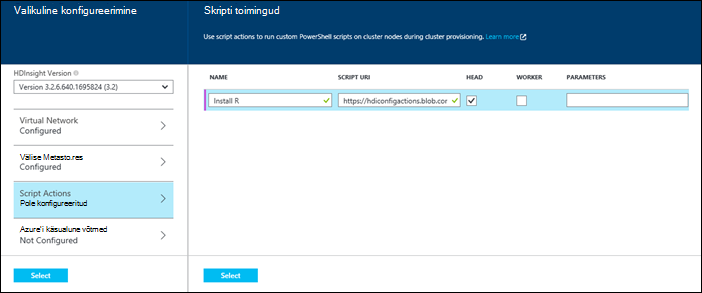
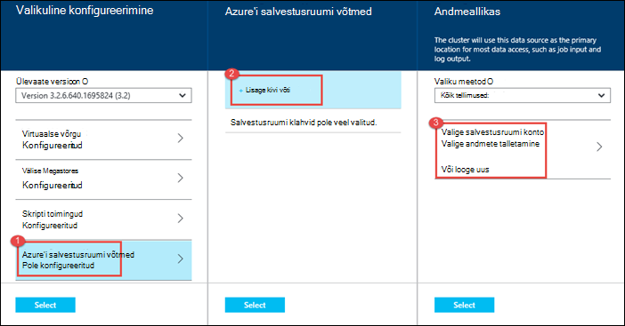

<properties
   pageTitle="Loomine Hadoopi kogumite Hdinsightiga | Microsoft Azure'i"
    description="Saate teada, kuidas luua kogumite Windows Azure Hdinsightiga Azure portaali kaudu."
   services="hdinsight"
   documentationCenter=""
   tags="azure-portal"
   authors="mumian"
   manager="jhubbard"
   editor="cgronlun"/>

<tags
   ms.service="hdinsight"
   ms.devlang="na"
   ms.topic="article"
   ms.tgt_pltfrm="na"
   ms.workload="big-data"
   ms.date="09/02/2016"
   ms.author="jgao"/>

# Windowsi-põhiste Hadoopi kogumite loomist portaalis Azure Hdinsightiga

[AZURE.INCLUDE [selector](../../includes/hdinsight-selector-create-clusters.md)]

Saate teada, kuidas luua mõne Hadoopi kobar portaalis Azure Hdinsightiga. Microsoft [Azure'i portaal](../azure-portal-overview.md) on keskne koht, kus saate ettevalmistamine ja hallata oma Azure ressursse. Azure'i portaalis on üks tööriistade abil saate luua või Linuxi-põhiste Windowsi-põhiste Hadoopi kobar Hdinsightiga. Muud kobar loomise tööriistade ja funktsioonide klõpsake selle lehe ülaosas valige menüü või näha [kobar loomise võimalused](hdinsight-provision-clusters.md#cluster-creation-methods).

##Eeltingimused

[AZURE.INCLUDE [delete-cluster-warning](../../includes/hdinsight-delete-cluster-warning.md)]

Enne alustamist selles artiklis antud juhiseid, peab teil olema järgmised:

- Azure'i tellimuse. Leiate [Azure'i saada tasuta prooviversioon](https://azure.microsoft.com/documentation/videos/get-azure-free-trial-for-testing-hadoop-in-hdinsight/).

### Accessi kontrolli nõuded

[AZURE.INCLUDE [access-control](../../includes/hdinsight-access-control-requirements.md)]

## Kogumite loomine

**Luua ka Hdinsightiga kobar**

1. [Azure'i portaali](https://portal.azure.com)sisse logima.
2. Klõpsake nuppu **Uus**, klõpsake **Andmete analüüsimise**ja seejärel käsku **Hdinsightiga**.

    ![Uus klaster Azure portaali loomine] (./media/hdinsight-provision-clusters/HDI.CreateCluster.1.png "Uus klaster Azure portaali loomine")

3. Tippige või valige järgmised väärtused:

    * **Kobar nimi**: sisestage klaster nimi. Roheline märge kuvatakse kobar nime kõrval, kui nimi on saadaval.

    * **Kobar tüüp**: valige **Hadoopi**. Muud suvandid inclue **HBase**, **Storm**ja **säde**.

        > [AZURE.IMPORTANT] Hdinsightiga kogumite tulevad erinevaid töökoormus või klaster on häälestatud, mis vastavad tüüpi. Ei ole toetatud meetodit klaster, mis ühendab mitu tüüpi, nt torm ja HBase sisse ühe kobar loomiseks.

    * **Kobar opsüsteem**: **Windows**valige. Linux-base kobar loomiseks valige **Linux**.
    * **Versioon**: vt [Hdinsightiga versioonid](hdinsight-component-versioning.md).
    * **Tellimus**: valige see loomiseks kasutatud Azure'i tellimus.
    * **Ressursirühm**: valige olemasolev või luua uue ressursirühma. See kirje vaikimisi ühte ressursi rühmi, kui mõni on saadaval.
    * **Mandaadi**: kasutajanime ja parooli Hadoopi kasutaja (HTTP kasutaja) konfigureerimine. Kui lubate kaugtöölaua klaster, peate serveri töölaua kasutaja kasutajanimi ja parool ning aegumiskuupäeva konto konfigureerimine. Muudatuste salvestamiseks allosas nuppu **valimine** .

        ![Mandaadi kobar] (./media/hdinsight-provision-clusters/HDI.CreateCluster.3.png "Mandaadi kobar")

    * **Andmeallikas**: saate luua uue või olemasoleva Azure Storage konto klaster failisüsteemi vaikimisi kasutatavad valige.

        ![Andmeallika blade] (./media/hdinsight-provision-clusters/HDI.CreateCluster.4.png "Sisesta andmeallika konfiguratsiooni")

        * **Valiku meetod**: määrata **kõigi tellimuste kaudu** lubamiseks salvestusruumi kontode kaudu kõigi tellimuste sirvimine. See **Kiirklahv** kui väärtuseks soovite sisestada **Salvestusruumi nime** ja **Kiirklahv** olemasoleva salvestusruumi konto.
        * **Valige salvestusruumi konto / Loo uus**: klõpsake nuppu **Valige salvestusruumi konto** sirvida ja valige soovitud klaster seostada olemasoleva salvestusruumi konto. Või klõpsake käsku **Loo uus** salvestusruumi uue konto loomiseks. Kasutage välja, mis kuvatakse Sisestage salvestusruumi konto nimi. Roheline märge kuvatakse, kui nimi on saadaval.
        * **Valige vaikimisi Container**: selle abil sisestage vaikimisi container klaster jaoks nimi. Ajal siia nime saate sisestada, soovitame kasutada sama nime nagu klaster, nii, et saate hõlpsasti ära ümbris kasutatakse seda teatud kobar.
        * **Asukoht**: geograafilised piirkond, mis on salvestusruumi konto või luuakse. Selle asukoha määrab kobar asukohta.  Klaster ning selle salvestusruumi vaikekonto peab asukohti sama Azure andmekeskuse.
    
    * **Sõlm hinnad astme**: Määrake töötaja sõlmed, mida vajate klaster arv. Prognoositud kulud klaster kuvatakse tera sees.
  

        ![Sõlm hinnakirjad astme blade] (./media/hdinsight-provision-clusters/HDI.CreateCluster.5.png "Määrake kobar sõlmed arv")

    * **Valikuline konfigureerimine** valige kobar versioon, kui ka muude liitumise **Virtuaalse võrgu**häälestamiseks on **Välised Metastore** andmete mahutamiseks taru ja Oozie, nt valikuline sätete konfigureerimine skripti toimingute abil saate kohandada klaster kohandatud komponentide installimine või täiendava salvestusruumi kontod kasutamine klaster.

    * **Hdinsightiga versioon**: valige versioon, mida soovite kasutada klaster. Lisateabe saamiseks vt [Hdinsightiga kobar versioonid](hdinsight-component-versioning.md).
    * **Virtuaalse võrgu**: valige mõni Azure virtuaalse võrgu ja alamvõrgu, kui soovite paigutada kobar virtuaalse võrku.  

        ![Virtuaalne võrgu blade] (./media/hdinsight-provision-clusters/HDI.CreateCluster.6.png "Määrake virtuaalse võrgu üksikasjad")

        Hdinsightiga virtuaalse võrguga, sh teatud konfiguratsiooni nõuded on virtuaalse võrgu kasutamise kohta teavet teemast [laiendamine Hdinsightiga capbilities on Azure virtuaalse võrgu kaudu](hdinsight-extend-hadoop-virtual-network.md).
  

        
    * **Välise Metastores**: määrake Azure'i SQL-andmebaasiga taru ja Oozie klaster seotud metaandmed salvestada.
 
        > [AZURE.NOTE] Metastore konfiguratsioon pole saadaval HBase kobar tüüpi.

    ![Kohandatud metastores tera] (./media/hdinsight-provision-clusters/HDI.CreateCluster.7.png "Määrake välise metastores")

    **Mõne olemasoleva SQL DB mesilaspere kasutada** metaandmete, klõpsake nuppu **Jah**, valige SQL-andmebaasi ja sisestage andmebaasi kasutajanime ja parooli. Korrake neid juhiseid, kui soovite **kasutada mõne olemasoleva SQL DB Oozie metaandmete jaoks**. Kuni olete uuesti sisse **Valikuline konfigureerimine** tera, klõpsake nuppu **Vali** .

    >[AZURE.NOTE] Azure'i SQL-andmebaasiga, kasutatakse selle metastore peavad lubama Ühenduvus muude Azure'i teenustele, sh Windows Azure Hdinsightiga. Klõpsake armatuurlaual SQL Azure'i andmebaasi paremas servas asuvas serveri nime. See on SQL-i andmebaasi eksemplari serveris. Kui on vaates server, klõpsake nuppu **Konfigureeri**ja **Azure teenused**, klõpsake nuppu **Jah**, ja klõpsake siis nuppu **Salvesta**.

            &nbsp;

            > [AZURE.IMPORTANT] Mõne metastore loomisel kasutada andmebaasi nimi, mis sisaldab kriipsjooned või sidekriipse, kuna see võib põhjustada kobar loomisprotsessi nurjumise.
        
        * **Script Actions** if you want to use a custom script to customize a cluster, as the cluster is being created. For more information about script actions, see [Customize HDInsight clusters using Script Action](hdinsight-hadoop-customize-cluster.md). On the Script Actions blade provide the details as shown in the screen capture.
    

            

        * **Azure Storage Keys**: Specify additional storage accounts to associate with the cluster. In the **Azure Storage Keys** blade, click **Add a storage key**, and then select an existing storage account or create a new account.
    

            

4. Klõpsake nuppu **Loo**. Valige **Kinnita Startboard** lisab kobar paani Startboard oma portaali. Ikoon näitab, et klaster on loomisel ja muudab Hdinsightiga ikooni kuvamise pärast loomine on lõpule viidud.
    
    Kulub aega kobar luuakse tavaliselt umbes 15 minutit. Kasutada paani soovitud Startboard või klõpsake lehe vasakus servas **teatised** kirje ebausaldusväärsete kontrollida.
    

5. Kui loomine on lõpule jõudnud, klõpsake paani kaudu käivitada kobar tera Startboard klaster. Kobar tera pakub olulist teavet kobar, näiteks nimi, kuulub ressursirühma, asukoht, operatsioonisüsteem, URL-i kobar armatuurlaua jne.

    ![Kobar blade] (./media/hdinsight-provision-clusters/HDI.Cluster.Blade.png "Kobar atribuudid")

    Kasutage järgmist mõista ning selle tera **Essentialsi** jaotise ülaosas ikoonid:

    * **Sätted** ja **Kõik sätted**: kuvatakse **sätted** höövlitera kobar, mis võimaldab kasutada üksikasjalik konfiguratsiooniteavet klaster.
    * **Armatuurlaua**, **Kobar armatuurlaua**ja **URL**: need kõik võimalused kobar armatuurlaud, mis on veebiportaali töö klaster juhtida.
    * **Kaugtöölaua**: võimaldab teil lubada või keelata kaugtöölaua kobar sõlmed.
    * **Skaala kobar**: võimaldab teil muuta töötaja sõlmed see arv.
    * **Kustuta**: kustutab Hdinsightiga kobar.
    * **Kiirjuhend** (): kuvatakse teave, mis aitavad teil Hdinsightiga kasutamise alustamine.
    * **Kasutajatele** (): võimaldab teil määrata teiste kasutajate õiguste _portaali haldus_ , see Azure tellimuse.
    

        > [AZURE.IMPORTANT] See _ainult_ mõjutab juurdepääsu ja selle kobar portaalis õigused ja kes saab ühenduse või edastab Hdinsightiga kobar tööd ei mõjuta.
        
    * **Sildid** (): Sildid saate seada määratleda kohandatud taksonoomia oma pilveteenuste /-väärtuse paarideks. Näiteks võib luua nimega __projekti__klahvi ja seejärel kasutage kõigi teenuste teatud projektiga seotud ühise väärtuse.

##Kogumite kohandamine

- Lugege teemat [kohandamine Hdinsightiga kogumite alglaaduri abil](hdinsight-hadoop-customize-cluster-bootstrap.md).
- Lugege teemat [Windows kohandada vastavalt Hdinsightiga kogumite skripti toimingu abil](hdinsight-hadoop-customize-cluster.md).

##Järgmised sammud
Selles artiklis on õppinud loomiseks Hdinsightiga kobar on mitu võimalust. Lisateabe saamiseks lugege järgmisi artikleid:

* [Alustamine Windows Azure Hdinsightiga](hdinsight-hadoop-linux-tutorial-get-started.md) – saate teada, kuidas alustada tööd oma Hdinsightiga kobar
* [Esitage Hadoopi töö programmiliselt](hdinsight-submit-hadoop-jobs-programmatically.md) – saate teada, kuidas programmiliselt edastab tööd Hdinsightiga
* [Hadoopi kogumite rakenduses Hdinsightiga abil Azure portaali haldamine](hdinsight-administer-use-management-portal.md)

