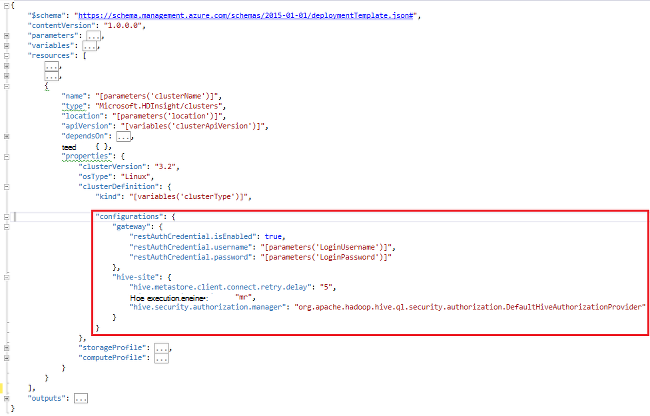

<properties
    pageTitle="Kohandada Hdinsightiga kogumite alglaaduri abil | Microsoft Azure'i"
    description="Saate teada, kuidas kohandada Hdinsightiga kogumite alglaaduri abil."
    services="hdinsight"
    documentationCenter=""
    authors="mumian"
    manager="jhubbard"
    editor="cgronlun"
    tags="azure-portal"/>

<tags
    ms.service="hdinsight"
    ms.workload="big-data"
    ms.tgt_pltfrm="na"
    ms.devlang="na"
    ms.topic="article"
    ms.date="09/02/2016"
    ms.author="jgao"/>

# Hdinsightiga kogumite abil alglaaduri kohandamine

Mõnikord, mida soovite konfigureerida konfiguratsiooni failid, mis sisaldavad:

- clusterIdentity.xml
- Core-site.xml
- Gateway.XML
- hbase-env.xml
- hbase-site.xml
- hdfs-site.xml
- taru-env.xml
- taru-site.xml
- mapred – saidile
- oozie-site.xml
- oozie-env.xml
- torm-site.xml
- Tez-site.xml
- webhcat-site.xml
- lõng-site.xml

Rühmad ei saa muutuste tõttu uuesti Imagingi säilitada. Uuesti Imagingi kohta leiate lisateavet teemast [Rolli eksemplari taaskäivitamist tingitud OS uuendamine](http://blogs.msdn.com/b/kwill/archive/2012/09/19/role-instance-restarts-due-to-os-upgrades.aspx). Muudatuste kaudu soovitud kogumite eluiga hoidmiseks saate Hdinsightiga kobar kohandamise käigus loomine. See on soovitatav viis muuta klaster konfiguratsioone ja püsivad üle nende Azure reimage taaskäivitage arvuti taaskäivitamist sündmused. Nende konfiguratsiooni muudatused rakendatakse enne teenuse käivitamine, et teenuseid ei pea uuesti. 

On 3 meetodit kasutada alglaaduri.

- Azure'i PowerShelli kasutamine

    [AZURE.INCLUDE [upgrade-powershell](../../includes/hdinsight-use-latest-powershell.md)]
    
- .NET SDK kasutamine
- Kasutage Azure'i ressursihaldur Mall

Lisakomponentide installimine Hdinsightiga kobar loomise ajal kohta leiate teavet teemast:

- [Kohandada Hdinsightiga kogumite kasutamata Script (Linux)](hdinsight-hadoop-customize-cluster-linux.md)
- [Kohandada Hdinsightiga kogumite kasutamata Script (Windows)](hdinsight-hadoop-customize-cluster.md)

## Azure'i PowerShelli kasutamine

Järgmine kood PowerShelli kohandab taru konfigureerimine:

    # hive-site.xml configuration
    $hiveConfigValues = @{ "hive.metastore.client.socket.timeout"="90" }
    
    $config = New-AzureRmHDInsightClusterConfig `
        | Set-AzureRmHDInsightDefaultStorage `
            -StorageAccountName "$defaultStorageAccountName.blob.core.windows.net" `
            -StorageAccountKey $defaultStorageAccountKey `
        | Add-AzureRmHDInsightConfigValues `
            -HiveSite $hiveConfigValues 
    
    New-AzureRmHDInsightCluster `
        -ResourceGroupName $existingResourceGroupName `
        -ClusterName $clusterName `
        -Location $location `
        -ClusterSizeInNodes $clusterSizeInNodes `
        -ClusterType Hadoop `
        -OSType Windows `
        -Version "3.2" `
        -HttpCredential $httpCredential `
        -Config $config 

Täieliku töötamise PowerShelli skripti leiate [A lisa](#hdinsight-hadoop-customize-cluster-bootstrap.md/appx-a:-powershell-sample).

**Muudatuse kinnitamiseks:**

1. [Azure'i portaali](https://portal.azure.com)sisse logida.
2. Klõpsake vasakpoolsel paanil nuppu **Sirvi**ja klõpsake **Hdinsightiga kogumite**.
3. Klõpsake äsja loodud PowerShelli skripti abil klaster.
4. **Armatuurlaua** ülaosas tera Ambari UI avamiseks klõpsake.
5. Klõpsake vasakpoolses menüüs **taru** .
6. Klõpsake **HiveServer2** **Kokkuvõte**kaudu.
7. Klõpsake vahekaarti **Configs** .
8. Klõpsake vasakpoolses menüüs **taru** .
9. Klõpsake vahekaarti **Täpsemalt** .
10. Kerige alla ja seejärel laiendage **Täpsemalt taru – saidile**.
11. Otsige jaotises **hive.metastore.client.socket.timeout** .

Mõned rohkem näidiseid kohandamiseks muud failid:

    # hdfs-site.xml configuration
    $HdfsConfigValues = @{ "dfs.blocksize"="64m" } #default is 128MB in HDI 3.0 and 256MB in HDI 2.1

    # core-site.xml configuration
    $CoreConfigValues = @{ "ipc.client.connect.max.retries"="60" } #default 50

    # mapred-site.xml configuration
    $MapRedConfigValues = @{ "mapreduce.task.timeout"="1200000" } #default 600000

    # oozie-site.xml configuration
    $OozieConfigValues = @{ "oozie.service.coord.normal.default.timeout"="150" }  # default 120

Lisateabe saamiseks vt Azim Uddin ajaveebi nimega [kohandamise Hdinsightiga kobar loomine](http://blogs.msdn.com/b/bigdatasupport/archive/2014/04/15/customizing-hdinsight-cluster-provisioning-via-powershell-and-net-sdk.aspx).

## .NET SDK kasutamine

Lugege teemat [loomine Linux-põhine kogumite Hdinsightiga SDK .net-i abil rakenduses](hdinsight-hadoop-create-linux-clusters-dotnet-sdk.md#use-bootstrap).

## Kasutage ressursihaldur Mall

Kasutage alglaaduri ressursihaldur malli.

    "configurations": {
        …
        "hive-site": {
            "hive.metastore.client.connect.retry.delay": "5",
            "hive.execution.engine": "mr",
            "hive.security.authorization.manager": "org.apache.hadoop.hive.ql.security.authorization.DefaultHiveAuthorizationProvider"
        }
    }

## Vt ka

- [Loomine Hadoopi kogumite Hdinsightiga] [ hdinsight-provision-cluster] pakub juhiseid, kuidas luua mõne Hdinsightiga kobar muude kohandatud suvandite abil.
- [Töötada skripti toimingu skriptide Hdinsightiga][hdinsight-write-script]
- [Installimine ja kasutamine säde Hdinsightiga kogumite][hdinsight-install-spark]
- [Installimine ja kasutamine R Hdinsightiga kogumite][hdinsight-install-r]
- [Installimine ja kasutamine kogumite Solri Hdinsightiga kohta](hdinsight-hadoop-solr-install.md).
- [Installimine ja kasutamine kogumite Giraph Hdinsightiga kohta](hdinsight-hadoop-giraph-install.md).

[hdinsight-install-spark]: hdinsight-hadoop-spark-install.md
[hdinsight-install-r]: hdinsight-hadoop-r-scripts.md
[hdinsight-write-script]: hdinsight-hadoop-script-actions.md
[hdinsight-provision-cluster]: hdinsight-provision-clusters.md
[powershell-install-configure]: powershell-install-configure.md

[img-hdi-cluster-states]: ./media/hdinsight-hadoop-customize-cluster/HDI-Cluster-state.png "Etappide kobar loomise ajal"

## Appx-v: PowerShelli näidis

See PowerShelli skripti loob mõne Hdinsightiga kobar ja kohandab taru säte.

    ####################################
    # Set these variables
    ####################################
    #region - used for creating Azure service names
    $nameToken = "<ENTER AN ALIAS>" 
    #endregion

    #region - cluster user accounts
    $httpUserName = "admin"  #HDInsight cluster username
    $httpPassword = "<ENTER A PASSWORD>" #"<Enter a Password>"

    $sshUserName = "sshuser" #HDInsight ssh user name
    $sshPassword = "<ENTER A PASSWORD>" #"<Enter a Password>"
    #endregion

    ####################################
    # Service names and varialbes
    ####################################
    #region - service names
    $namePrefix = $nameToken.ToLower() + (Get-Date -Format "MMdd")

    $resourceGroupName = $namePrefix + "rg"
    $hdinsightClusterName = $namePrefix + "hdi"
    $defaultStorageAccountName = $namePrefix + "store"
    $defaultBlobContainerName = $hdinsightClusterName

    $location = "East US 2"
    #endregion

    # Treat all errors as terminating
    $ErrorActionPreference = "Stop"

    ####################################
    # Connect to Azure
    ####################################
    #region - Connect to Azure subscription
    Write-Host "`nConnecting to your Azure subscription ..." -ForegroundColor Green
    try{Get-AzureRmContext}
    catch{Login-AzureRmAccount}
    #endregion

    #region - Create an HDInsight cluster
    ####################################
    # Create dependent components
    ####################################
    Write-Host "Creating a resource group ..." -ForegroundColor Green
    New-AzureRmResourceGroup `
        -Name  $resourceGroupName `
        -Location $location

    Write-Host "Creating the default storage account and default blob container ..."  -ForegroundColor Green
    New-AzureRmStorageAccount `
        -ResourceGroupName $resourceGroupName `
        -Name $defaultStorageAccountName `
        -Location $location `
        -Type Standard_GRS

    $defaultStorageAccountKey = (Get-AzureRmStorageAccountKey `
                                    -ResourceGroupName $resourceGroupName `
                                    -Name $defaultStorageAccountName)[0].Value
    $defaultStorageContext = New-AzureStorageContext `
                                    -StorageAccountName $defaultStorageAccountName `
                                    -StorageAccountKey $defaultStorageAccountKey
    New-AzureStorageContainer `
        -Name $defaultBlobContainerName `
        -Context $defaultStorageContext #use the cluster name as the container name

    ####################################
    # Create a configuration object
    ####################################
    $hiveConfigValues = @{ "hive.metastore.client.socket.timeout"="90" }
        
    $config = New-AzureRmHDInsightClusterConfig `
        | Set-AzureRmHDInsightDefaultStorage `
            -StorageAccountName "$defaultStorageAccountName.blob.core.windows.net" `
            -StorageAccountKey $defaultStorageAccountKey `
        | Add-AzureRmHDInsightConfigValues `
            -HiveSite $hiveConfigValues 

    ####################################
    # Create an HDInsight cluster
    ####################################
    $httpPW = ConvertTo-SecureString -String $httpPassword -AsPlainText -Force
    $httpCredential = New-Object System.Management.Automation.PSCredential($httpUserName,$httpPW)

    $sshPW = ConvertTo-SecureString -String $sshPassword -AsPlainText -Force
    $sshCredential = New-Object System.Management.Automation.PSCredential($sshUserName,$sshPW)

    New-AzureRmHDInsightCluster `
        -ResourceGroupName $resourceGroupName `
        -ClusterName $hdinsightClusterName `
        -Location $location `
        -ClusterSizeInNodes 1 `
        -ClusterType Hadoop `
        -OSType Linux `
        -Version "3.2" `
        -HttpCredential $httpCredential `
        -SshCredential $sshCredential `
        -Config $config

    ####################################
    # Verify the cluster
    ####################################
    Get-AzureRmHDInsightCluster -ClusterName $hdinsightClusterName

    #endregion
