<properties
    pageTitle="Kohandada Hdinsightiga kogumite skripti toimingute kasutamine | Microsoft Azure'i"
    description="Siit saate teada, kuidas lisada kohandatud komponendid Linux-põhine Hdinsightiga kogumite skripti toimingute kasutamine. Skripti toimingud on Bash kobar sõlmed skripte ja saab kohandada kobar konfiguratsiooni või lisateenuse ja Utiliidid nagu tooni, Solri või R. lisamine"
    services="hdinsight"
    documentationCenter=""
    authors="Blackmist"
    manager="jhubbard"
    editor="cgronlun"
    tags="azure-portal"/>

<tags
    ms.service="hdinsight"
    ms.workload="big-data"
    ms.tgt_pltfrm="na"
    ms.devlang="na"
    ms.topic="article"
    ms.date="09/06/2016"
    ms.author="larryfr"/>

# Kohandamine Linux-põhine Hdinsightiga kogumite skripti toimingu abil

Hdinsightiga pakub nimetatakse **Skripti toiming** , mis käivitab kohandatud skriptid, et kohandamine klaster konfiguratsiooni valik. Nende skriptide saab kasutada kobar loomise ajal või on juba töötava kobar ja kasutatakse installida lisakomponentide või konfiguratsiooni sätteid muuta.

> [AZURE.NOTE] Võimalus kasutada skripti toimingud on juba töötava kobar on saadaval Linuxi-põhiste Hdinsightiga kogumite ainult. Kasutades Windowsi-põhiste kogumite skripti toimingud leiate teemast [kohandamine Hdinsightiga kogumite kasutamata Script (Windows)](hdinsight-hadoop-customize-cluster.md).

Skripti toiminguid saab avaldada ka Azure'i turuplatsi Hdinsightiga rakendusena. Mõned näited selle dokumendi näitavad, kuidas saate installida skripti toimingu käsud PowerShell ja .NET SDK rakendus Hdinsightile. Hdinsightiga rakenduste kohta leiate lisateavet teemast [Azure'i turuplatsi avaldamine Hdinsightiga rakendusi](hdinsight-apps-publish-applications.md). 

## Mõistmine skripti toimingud

Skripti toiming on lihtsalt Bash skripti, mis teil pakuvad URL-i ja parameetrid ja seejärel parandusfunktsiooni Hdinsightiga kobar sõlmed. Järgmised omadused ja funktsioonid skripti toimingud.

* Peavad olema talletatud URI, millele pääseb Hdinsightiga kobar; Järgnevalt on võimalik salvestusruumi asukohad.

    * Bloobimälu salvestusruumi konto, mis on kas esmane või täiendava salvestusruumi kobar HDInsight konto. Hdinsightiga antakse juurdepääsu nii järgmist tüüpi salvestusruumi kontod kobar loomise ajal, need võimalda – avaliku skripti toimingut kasutada.
    
    * Avalikult loetav URI nagu Azure'i bloobimälu, GitHub, OneDrive'i, Dropboxi, jne.
    
    Näiteid URI skriptide talletatud bloobimälu container (avalikult loetavad), leiate jaotisest [näide skripti toimingu skriptide](#example-script-action-scripts) .

* Saate piirata __töötab ainult teatud tüüpi__, näiteks pea sõlmed või töötaja sõlmed.

    > [AZURE.NOTE] Kasutamisel koos Hdinsightiga Premium, saate määrata, võib skript kasutada sõlme serva.

* Saab __säilis__ või __erakorralised__.

    __Persisted__ skriptide on skripte, mis on rakendatud töötaja sõlmed ja saab parandusfunktsiooni automaatselt uue sõlmed luua, kui klaster ülespoole.

    Nõutud skripti võib ka muudatused rakendada mõne muu sõlm tüüp, nt pea sõlme, kuid seisukohast funktsioonid on ainus põhjus püsima skripti nii, et see kehtib uue töötaja sõlmed luua, kui klaster on mastaabitud välja.

    > [AZURE.IMPORTANT] Nõutud skripti toiminguid peab olema kordumatu nimi.

    __Sihtotstarbeline__ skriptide on mitte hoitakse; Siiski saate hiljem esiletõstmine on nõutud skripti sihtotstarbelise skripti või nõutud script on sihtotstarbelise skripti langetamine.

    > [AZURE.IMPORTANT] Skripti toimingud kobar loomise ajal kasutatud on automaatselt jätkunud.
    >
    > Skriptide, mis fail pole säilis isegi juhul, kui näitate konkreetselt, et nad peaksid olema.

* Võite nõustuda skripti käitamise ajal kasutatavate __Parameetrid__ .

* Koos __root taseme õigusi__ on parandusfunktsiooni kobar sõlmed.

* Saab kasutada __Azure portaali__, __Azure PowerShelli__, __Azure'i CLI__või __Hdinsightiga .NET SDK__ kaudu

    [AZURE.INCLUDE [upgrade-powershell](../../includes/hdinsight-use-latest-powershell-cli-and-dotnet-sdk.md)]

Mõista, mis skriptide on rakendatud klaster ja määramisel ID-d skriptide edendamine või madaldamine, klaster hoiab kõik skriptid, mis on parandusfunktsiooni.

> [AZURE.IMPORTANT] Ei ole automaatselt nii skripti toimingu tehtud muudatused tagasi võtta. Kui teil on vaja Tühista skripti, peate aru, milliseid muudatusi tehtud ja käsitsi need (või skripti toiming, mis tühistab neid sisestada.)

### Skripti toimingu loomisprotsessi kobar

Skripti toimingud kobar loomise ajal kasutatud on veidi teistsugune toimingud oli mõne olemasoleva kobar skripti:

* Script on __automaatselt säilis__.

* Skripti __tõrke__ võib põhjustada kobar loomisprotsessi nurjumise.

Järgmine diagramm näitab, kui skripti toimingu käigus loomine.

![Hdinsightiga kobar kohandamine ja etappide kobar loomise ajal][img-hdi-cluster-states]

Skripti on parandusfunktsiooni ajal Hdinsightiga konfigureeritakse. Selles etapis script on parandusfunktsiooni paralleelselt määratud sõlme klaster ja on parandusfunktsiooni root kasutajana sõlmed.

> [AZURE.NOTE] Kuna script on parandusfunktsiooni koos root taseme õiguste kobar sõlmed, saate näiteks peatamine ja alates teenuste, sealhulgas Hadoopi seotud toiminguid teha. Kui lõpetate teenused, peate veenduge, et Ambari teenuse ja muude teenuste Hadoopi seotud oleks tööks enne script on töö lõpetanud. Need teenused on vaja määratlemiseks edukalt seisundi ja olek klaster ajal luua.

Kobar loomise ajal saate määrata mitu skripti toiminguid, mis on käivitas need olid määratud järjestuses.

> [AZURE.IMPORTANT] Skripti toimingud peate täitma 60 minutit või need kuvatakse ajalõpp. Kobar ettevalmistamise, script on alguspäeva samaaegselt muude häälestamise ja konfigureerimise protsessid. Ressursid, nt CPU kellaaja või võrgu läbilaskevõime konkurentsiga võib põhjustada skripti võtta enam lõpetada, kui teie arenduskeskkond.
>
> Aega kulub skripti käivitamiseks minimeerimiseks vältida toiminguid nagu allalaadimine ja koostamise rakenduste allikast. Selle asemel eelnevalt Rakenduse Kompileerimine ja salvestada selle kahendarvuks Azure'i bloobimälu, et seda saab kiiresti alla klaster.

###Skripti toimingu töötava klaster

Erinevalt skripti tõrke skripti kobar loomise ajal kasutatud toimingud on juba töötava kobar oli automaatselt põhjusta kobar tõrkeolekus muuta. Pärast skripti lõpulejõudmist klaster peaks tagastama "töötab" olekusse.

> [AZURE.IMPORTANT] See ei tähenda, et töötava klaster on immuunne skriptide, mis ei kajasta. Näiteks võib skripti kustutada failid nõutud kobar, konfiguratsiooni muutmine nii, et teenuste nurjuda jne.
>
> Skriptide toimingud käivitada administraatoriõigusi, seega veenduge, et saate aru, mida skripti enne rakendamist klaster.

Kasutades arvutikobaras skripti, kobar olek __töötab__ __aktsepteeritud__, siis __Hdinsightiga konfiguratsiooni__, muuta ja lõpuks tagasi __töötab__ eduka skripte. Skripti olek on sisse logitud skripti toimingu ajalugu ja abil saate määrata, kui skripti õnnestus või mitte. Näiteks kuvatakse `Get-AzureRmHDInsightScriptActionHistory` PowerShelli cmdlet-käsu saab kasutada skripti oleku vaatamine. See tagasi teabe umbes järgmine:

    ScriptExecutionId : 635918532516474303
    StartTime         : 2/23/2016 7:40:55 PM
    EndTime           : 2/23/2016 7:41:05 PM
    Status            : Succeeded

> [AZURE.NOTE] Kui olete muutnud kobar (haldus) kasutaja parooli pärast klaster on loodud, see võib põhjustada skripti toimingud oli see kobar nurjumise vastu. Kui teil on mis tahes nõutud skripti toimingud, mis puudutavad töötaja sõlmed, need võib nurjuda, kui lisate sõlmed klaster kaudu suuruse toimingud.

## Näide skripti toimingu skriptide

Skripti toimingu skriptide saab Azure'i portaalis Azure PowerShelli, Azure'i CLI või Hdinsightiga .NET SDK. Hdinsightiga pakub skriptide Hdinsightiga kogumite installida järgmised komponendid.

Nimi | Skripti
----- | -----
**Azure Storage konto lisamine** | https://hdiconfigactions.blob.Core.Windows.net/linuxaddstorageaccountv01/Add-Storage-Account-V01.sh. Artiklis [Skripti toimingu töötava arvutikobaras](#apply-a-script-action-to-a-running-cluster).
**Installige tooni** | https://hdiconfigactions.blob.Core.Windows.net/linuxhueconfigactionv02/install-Hue-Uber-v02.sh. Vt [installimine ja kasutamine kogumite tooni Hdinsightiga kohta](hdinsight-hadoop-hue-linux.md).
**Installi R** | https://hdiconfigactions.blob.Core.Windows.net/linuxrconfigactionv01/r-Installer-V01.sh. Lugege [installi ja kasutage R Hdinsightiga kogumite](hdinsight-hadoop-r-scripts-linux.md).
**Installige Solri** | https://hdiconfigactions.blob.Core.Windows.net/linuxsolrconfigactionv01/Solr-Installer-V01.sh. Vt [installimine ja kasutamine kogumite Solri Hdinsightiga kohta](hdinsight-hadoop-solr-install-linux.md).
**Installige Giraph** | https://hdiconfigactions.blob.Core.Windows.net/linuxgiraphconfigactionv01/giraph-Installer-V01.sh. Vt [installimine ja kasutamine kogumite Giraph Hdinsightiga kohta](hdinsight-hadoop-giraph-install-linux.md).
| **Eel-laadida taru teegid** | https://hdiconfigactions.blob.Core.Windows.net/linuxsetupcustomhivelibsv01/setup-customhivelibs-V01.sh. Vt [Hdinsightiga kogumite teekides taru lisamine](hdinsight-hadoop-add-hive-libraries.md) |

## Skripti toiminguga kobar loomise ajal

Käesolevas jaotises antakse ülevaade eri viisid saate kasutada skripti toimingud loomisel Hdinsightiga kobar - Azure'i portaalis on Azure ressursihaldur malli abil, PowerShelli cmdlet-käskude abil ja kasutades .NET SDK.

### Skripti toiminguga Azure portaalist kobar loomise ajal

1. Käivitage luua klaster, nagu on kirjeldatud aadressil [loomine Hadoopi kogumite Hdinsightiga sisse](hdinsight-provision-clusters.md#portal).

2. __Valikuline konfiguratsiooni__ **Skripti toimingud** Blade, klõpsake jaotises **skripti toimingu lisamine** üksikasjad skripti kohta, nagu allpool näidatud:

    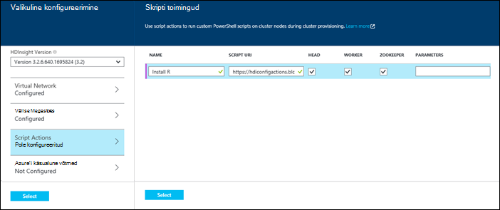

  	| Atribuut | Väärtus |
  	| -------- | ----- |
  	| Nimi | Määrake skripti toimingu nimi. |
  	| Skripti URI | Määrake URI skripti, mis on vaja järgida klaster kohandamiseks. |
  	| Juhi/töötaja | Saate määrata kohandamine skripti käitatakse sõlmed (**juhi**, **töötaja**või **ZooKeeper**). |
  	| Parameetrid | Määrake soovitud parameetrid skripti vajadusel. |

    Vajutage sisestusklahvi ENTER lisada rohkem kui ühe skripti toimingu klaster mitme komponentide installimine.

3. Klõpsake nuppu **Valige** konfiguratsiooni salvestamiseks ja jätkake kobar loomine.

### Skripti toiminguga Azure'i ressursihaldur mallide põhjal

Selles jaotises kasutame Azure'i ressursihaldur Mallid luua ka Hdinsightiga kobar ja ka kohandatud komponendid (R selles näites) installimine klaster skripti toimingu abil. Selles jaotises antakse valimi malli loomiseks klaster skripti toimingu abil.

> [AZURE.NOTE] Selle jaotise juhised näitavad, et luua skripti toimingu abil klaster. Näiteks luua klaster mallist Hdinsightiga rakendust, vt [kohandatud Hdinsightiga rakenduste installimine](hdinsight-apps-install-custom-applications.md).

#### Enne alustamist

* Töökoha Hdinsightiga PowerShelli cmdlet-käskude käivitamiseks konfigureerimise kohta leiate teemast [installida ja konfigureerida Azure PowerShelli](../powershell-install-configure.md).
* Juhised mallide loomise kohta leiate teemast [loome Azure'i ressursihaldur Mallid](../resource-group-authoring-templates.md).
* Kui te pole varem kasutanud Azure PowerShelli abil ressursihaldur, leiate [Azure'i ressursihaldur Azure PowerShelli kasutamine](../powershell-azure-resource-manager.md).

#### Kogumite skripti toimingu abil luua

1. Kopeerige järgmised malli asukoht teie arvutis. Selle malli installib Giraph on headnodes ka töötajal sõlmed klaster. Samuti saate kontrollida, kui JSON mall on lubatud. [JSONLint](http://jsonlint.com/), online JSON valideerimise vahend malli sisu kleepida.

            {
            "$schema": "http://schema.management.azure.com/schemas/2015-01-01/deploymentTemplate.json#",
            "contentVersion": "1.0.0.0",
            "parameters": {
                "clusterLocation": {
                    "type": "string",
                    "defaultValue": "West US",
                    "allowedValues": [ "West US" ]
                },
                "clusterName": {
                    "type": "string"
                },
                "clusterUserName": {
                    "type": "string",
                    "defaultValue": "admin"
                },
                "clusterUserPassword": {
                    "type": "securestring"
                },
                "sshUserName": {
                    "type": "string",
                    "defaultValue": "username"
                },
                "sshPassword": {
                    "type": "securestring"
                },
                "clusterStorageAccountName": {
                    "type": "string"
                },
                "clusterStorageAccountResourceGroup": {
                    "type": "string"
                },
                "clusterStorageType": {
                    "type": "string",
                    "defaultValue": "Standard_LRS",
                    "allowedValues": [
                        "Standard_LRS",
                        "Standard_GRS",
                        "Standard_ZRS"
                    ]
                },
                "clusterStorageAccountContainer": {
                    "type": "string"
                },
                "clusterHeadNodeCount": {
                    "type": "int",
                    "defaultValue": 1
                },
                "clusterWorkerNodeCount": {
                    "type": "int",
                    "defaultValue": 2
                }
            },
            "variables": {
            },
            "resources": [
                {
                    "name": "[parameters('clusterStorageAccountName')]",
                    "type": "Microsoft.Storage/storageAccounts",
                    "location": "[parameters('clusterLocation')]",
                    "apiVersion": "2015-05-01-preview",
                    "dependsOn": [ ],
                    "tags": { },
                    "properties": {
                        "accountType": "[parameters('clusterStorageType')]"
                    }
                },
                {
                    "name": "[parameters('clusterName')]",
                    "type": "Microsoft.HDInsight/clusters",
                    "location": "[parameters('clusterLocation')]",
                    "apiVersion": "2015-03-01-preview",
                    "dependsOn": [
                        "[concat('Microsoft.Storage/storageAccounts/', parameters('clusterStorageAccountName'))]"
                    ],
                    "tags": { },
                    "properties": {
                        "clusterVersion": "3.2",
                        "osType": "Linux",
                        "clusterDefinition": {
                            "kind": "hadoop",
                            "configurations": {
                                "gateway": {
                                    "restAuthCredential.isEnabled": true,
                                    "restAuthCredential.username": "[parameters('clusterUserName')]",
                                    "restAuthCredential.password": "[parameters('clusterUserPassword')]"
                                }
                            }
                        },
                        "storageProfile": {
                            "storageaccounts": [
                                {
                                    "name": "[concat(parameters('clusterStorageAccountName'),'.blob.core.windows.net')]",
                                    "isDefault": true,
                                    "container": "[parameters('clusterStorageAccountContainer')]",
                                    "key": "[listKeys(resourceId('Microsoft.Storage/storageAccounts', parameters('clusterStorageAccountName')), '2015-05-01-preview').key1]"
                                }
                            ]
                        },
                        "computeProfile": {
                            "roles": [
                                {
                                    "name": "headnode",
                                    "targetInstanceCount": "[parameters('clusterHeadNodeCount')]",
                                    "hardwareProfile": {
                                        "vmSize": "Large"
                                    },
                                    "osProfile": {
                                        "linuxOperatingSystemProfile": {
                                            "username": "[parameters('sshUserName')]",
                                            "password": "[parameters('sshPassword')]"
                                        }
                                    },
                                    "scriptActions": [
                                        {
                                            "name": "installGiraph",
                                            "uri": "https://hdiconfigactions.blob.core.windows.net/linuxgiraphconfigactionv01/giraph-installer-v01.sh",
                                            "parameters": ""
                                        }
                                    ]
                                },
                                {
                                    "name": "workernode",
                                    "targetInstanceCount": "[parameters('clusterWorkerNodeCount')]",
                                    "hardwareProfile": {
                                        "vmSize": "Large"
                                    },
                                    "osProfile": {
                                        "linuxOperatingSystemProfile": {
                                            "username": "[parameters('sshUserName')]",
                                            "password": "[parameters('sshPassword')]"
                                        }
                                    },
                                    "scriptActions": [
                                        {
                                            "name": "installR",
                                            "uri": "https://hdiconfigactions.blob.core.windows.net/linuxrconfigactionv01/r-installer-v01.sh",
                                            "parameters": ""
                                        }
                                    ]
                                }
                            ]
                        }
                    }
                }
            ],
            "outputs": {
                "cluster":{
                    "type" : "object",
                    "value" : "[reference(resourceId('Microsoft.HDInsight/clusters',parameters('clusterName')))]"
                }
            }
        }

2. Alustage Azure PowerShelli ja logige sisse Azure'i kontosse. Pärast oma mandaatide käsk tagastab oma konto teavet.

        Add-AzureRmAccount

        Id                             Type       ...
        --                             ----
        someone@example.com            User       ...

3. Kui teil on mitu tellimust, sisestage tellimuse id, mida soovite kasutada juurutamiseks.

        Select-AzureRmSubscription -SubscriptionID <YourSubscriptionId>

    > [AZURE.NOTE] Saate kasutada `Get-AzureRmSubscription` saada kõik tellimused oma konto, mis sisaldab iga tellimuse Id-ga seostatud loendit.

5. Kui teil pole olemasoleva ressursi rühma, luua uue ressursirühma. Sisestage nimi ja ressursirühm asukohta, et peate oma lahenduse. Uue ressursirühma kokkuvõtte tagastatakse.

        New-AzureRmResourceGroup -Name myresourcegroup -Location "West US"

        ResourceGroupName : myresourcegroup
        Location          : westus
        ProvisioningState : Succeeded
        Tags              :
        Permissions       :
                            Actions  NotActions
                            =======  ==========
                            *
        ResourceId        : /subscriptions/######/resourceGroups/ExampleResourceGroup

6. Uue ressursirühma juurutamise loomiseks käsu **New-AzureRmResourceGroupDeployment** ja sisestage vajalikud parameetrid. Parameetrid sisaldab juurutamiseks, olete loonud malli nimi oma ressursirühm ja tee või URL-i nimi. Kui teie malli nõuab parameetrid, peate läbima ka need parameetrid. Sel juhul ei nõua installida R klaster skripti toimingu parameetrid.

        New-AzureRmResourceGroupDeployment -Name mydeployment -ResourceGroupName myresourcegroup -TemplateFile <PathOrLinkToTemplate>

    Teil palutakse esitada määratletud malli parameetrite väärtused.

7. Ressursirühma juurutamisel kuvatakse juurutamise kokkuvõte.

          DeploymentName    : mydeployment
          ResourceGroupName : myresourcegroup
          ProvisioningState : Succeeded
          Timestamp         : 8/17/2015 7:00:27 PM
          Mode              : Incremental
          ...

8. Kui teie juurutamine nurjub, saate järgmised cmdlet-käsud ebaõnnestumisi kohta teabe saamiseks.

        Get-AzureRmResourceGroupDeployment -ResourceGroupName myresourcegroup -ProvisioningState Failed

### Skripti toiminguga Azure PowerShelli kaudu kobar loomise ajal

Selles jaotises kasutame autonoomsest skriptide abil skripti toimingu kohandamiseks klaster [Lisa-AzureRmHDInsightScriptAction](https://msdn.microsoft.com/library/mt603527.aspx) cmdlet-käsk. Enne jätkamist veenduge, et olete installinud ja konfigureerinud Azure PowerShelli. Töökoha Hdinsightiga PowerShelli cmdlet-käskude käivitamiseks konfigureerimise kohta leiate teemast [installida ja konfigureerida Azure PowerShelli](../powershell-install-configure.md).

Tehke järgmist.

1. Avage Azure'i PowerShelli konsooli ja kasutage Azure tellimuse sisselogimiseks järgmist ja mõned PowerShelli muutujad deklareerida.

        # LOGIN TO ZURE
        Login-AzureRmAccount

        # PROVIDE VALUES FOR THESE VARIABLES
        $subscriptionId = "<SubscriptionId>"        # ID of the Azure subscription
        $clusterName = "<HDInsightClusterName>"         # HDInsight cluster name
        $storageAccountName = "<StorageAccountName>"    # Azure storage account that hosts the default container
        $storageAccountKey = "<StorageAccountKey>"      # Key for the storage account
        $containerName = $clusterName
        $location = "<MicrosoftDataCenter>"             # Location of the HDInsight cluster. It must be in the same data center as the storage account.
        $clusterNodes = <ClusterSizeInNumbers>          # The number of nodes in the HDInsight cluster.
        $resourceGroupName = "<ResourceGroupName>"      # The resource group that the HDInsight cluster will be created in

2. Määrake konfiguratsioon väärtused (nt sõlmed klaster) ja talletamist vaikimisi kasutada.

        # SPECIFY THE CONFIGURATION OPTIONS
        Select-AzureRmSubscription -SubscriptionId $subscriptionId
        $config = New-AzureRmHDInsightClusterConfig
        $config.DefaultStorageAccountName="$storageAccountName.blob.core.windows.net"
        $config.DefaultStorageAccountKey=$storageAccountKey

3. **Lisa-AzureRmHDInsightScriptAction** cmdlet-käsu abil saate autonoomsest skripti. Järgmises näites kasutatakse skripti, mis installitakse Giraph klaster:

        # INVOKE THE SCRIPT USING THE SCRIPT ACTION FOR HEADNODE AND WORKERNODE
        $config = Add-AzureRmHDInsightScriptAction -Config $config -Name "Install Giraph"  -NodeType HeadNode -Uri https://hdiconfigactions.blob.core.windows.net/linuxgiraphconfigactionv01/giraph-installer-v01.sh
        $config = Add-AzureRmHDInsightScriptAction -Config $config -Name "Install Giraph"  -NodeType WorkerNode -Uri https://hdiconfigactions.blob.core.windows.net/linuxgiraphconfigactionv01/giraph-installer-v01.sh

    Cmdlet-käsu **Lisa-AzureRmHDInsightScriptAction** võtab järgmisi:

  	| Parameetri | Määratlus |
  	| --------- | ---------- |
  	| Config | Konfiguratsiooni objekti, mis skripti toimingu teave lisatakse. |
  	| Nimi | Skripti toimingu nimi. |
  	| NodeType | Saate määrata sõlm, mille kohandamine skript käivitatakse. Sobivad väärtused on **HeadNode** (installimiseks pea sõlme) **WorkerNode** (installimiseks andmete sõlme) või **ZookeeperNode** (installimiseks zookeeper sõlme). |
  	| Parameetrid | Parameetrite skripti nõutav. |
  	| URI | Saate määrata URI skripti, mis on täidetud. |

4. Administraator-või HTTPS kasutaja jaoks klaster seadmiseks tehke järgmist.

        $httpCreds = get-credential

    Küsimise korral sisestage 'admin' nimeks ja parooli.

5. SSH identimisteabe määramine:

        $sshCreds = get-credential

    Küsimise korral sisestage SSH kasutajanimi ja parool. Kui soovite secure SSH konto parooli asemel sertifikaadiga, kasutada tühja parooli ja seada `$sshPublicKey` sisu serdi avalik võti, mida soovite kasutada. Näiteks:

        $sshPublicKey = Get-Content .\path\to\public.key -Raw

4. Lõpuks luua klaster.

        New-AzureRmHDInsightCluster -config $config -clustername $clusterName -DefaultStorageContainer $containerName -Location $location -ResourceGroupName $resourceGroupName -ClusterSizeInNodes $clusterNodes -HttpCredential $httpCreds -SshCredential $sshCreds -OSType Linux

    Kui kasutate avalik võti SSH konto, peate määrama `-SshPublicKey $sshPublicKey` parameetrina.

Võib kuluda mitu minutit enne klaster on loodud.

### Skripti toiminguga Hdinsightiga .NET SDK kobar loomise ajal

Hdinsightiga .NET SDK pakub kliendi teegid, mis hõlbustab töötamine Hdinsightiga .net-i rakenduse kaudu. Proovi kood, vt [loomine Linux-põhine kogumite Hdinsightiga SDK .net-i abil rakenduses](hdinsight-hadoop-create-linux-clusters-dotnet-sdk.md#use-script-action).

## Skripti toimingu rakendamine töötava kobar

Käesolevas jaotises antakse ülevaade eri viisid skripti toiminguid saate rakendada töötava Hdinsightiga kobar; Azure'i portaalis PowerShelli cmdlet-käskude abil, kasutades platvormidel Azure'i CLI ja .NET SDK abil. Selles jaotises kasutatud nõutud skripti toimingu lisab töötava kobar Azure storage konto. Saate kasutada ka muude toimingute skripti, vt [näide skripti toimingu skriptide](#example-script-action-scripts).

### Azure'i portaalis esitatava kobar skripti toimingu rakendamine

1. Valige [Azure portaali](https://portal.azure.com)Hdinsightiga klaster.

2. Valige keelest Hdinsightiga kobar paani __Skripti toimingud__ .

    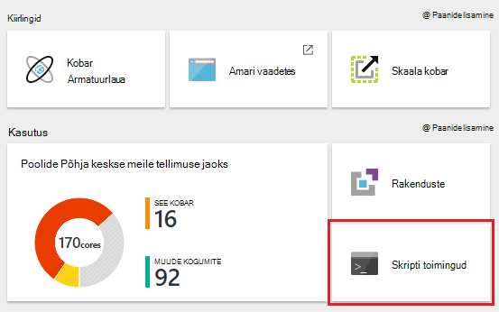

    > [AZURE.NOTE] Saate valida ka __Kõik sätted__ ja valige sätted keelest __Skripti toimingud__ .

4. Valige skripti toimingud tera ülaosas __uue Edasta__.

    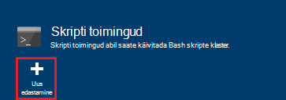

5. Keelest skripti toimingu lisada, sisestage järgmine teave.

    * __Nimi__: sõbralik nimi selle skripti jaoks kasutada. Selles näites `Add Storage account`.
    * __Skripti URI__: The URI skripti. Selles näites`https://hdiconfigactions.blob.core.windows.net/linuxaddstorageaccountv01/add-storage-account-v01.sh`
    * __Pea__, __töötaja__ja __Zookeeper__: märkige sõlmed, mis see skript peaks rakenduma. Selles näites on märgitud pea, töötaja ja Zookeeper.
    * __Parameetrite__: kui skripti aktsepteerib parameetrid, sisestage need siin. Selles näites sisestage salvestusruumikonto nimi ja salvestusruumi konto võti:

        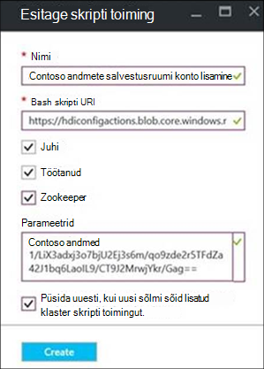

        Pildil, `contosodata` Azure Storage konto, on teine rida on salvestusruumi konto võti.
    * __PERSISTED__: märkige kirje, kui soovite kesta skript nii, et see rakendatakse uue töötaja sõlmed kui klaster skaalal.

6. Rakendamiseks skripti klaster kasutada lõpuks nuppu __Loo__ .

### Skripti toimingu rakendamine töötava kobar Azure PowerShelli kaudu

Enne jätkamist veenduge, et olete installinud ja konfigureerinud Azure PowerShelli. Töökoha Hdinsightiga PowerShelli cmdlet-käskude käivitamiseks konfigureerimise kohta leiate teemast [installida ja konfigureerida Azure PowerShelli](../powershell-install-configure.md).

1. Avage Azure'i PowerShelli konsooli ja kasutage Azure tellimuse sisselogimiseks järgmist ja mõned PowerShelli muutujad deklareerida.

        # LOGIN TO ZURE
        Login-AzureRmAccount

        # PROVIDE VALUES FOR THESE VARIABLES
        $clusterName = "<HDInsightClusterName>"         # HDInsight cluster name
        $saName = "<ScriptActionName>"                  # Name of the script action
        $saURI = "<URI to the script>"                  # The URI where the script is located
        $nodeTypes = "headnode", "workernode"
        
    > [AZURE.NOTE] Kui kasutusel on Hdinsightiga Premium kobar, saate kasutada, on nodetype `"edgenode"` serva sõlme skripti käivitamiseks.

2. Kasutage skripti rakendamiseks klaster järgmine käsk:

        Submit-AzureRmHDInsightScriptAction -ClusterName $clusterName -Name $saName -Uri $saURI -NodeTypes $nodeTypes -PersistOnSuccess

    Pärast töö lõpulejõudmist, peaksite nägema umbes järgmist teavet:

        OperationState  : Succeeded
        ErrorMessage    :
        Name            : Giraph
        Uri             : https://hdiconfigactions.blob.core.windows.net/linuxgiraphconfigactionv01/giraph-installer-v01.sh
        Parameters      :
        NodeTypes       : {HeadNode, WorkerNode}

### Azure'i CLI kaudu töötava kobar skripti toimingu rakendamine

Enne jätkamist veenduge, et olete installinud ja konfigureerinud Azure'i CLI. Lisateavet leiate teemast [installige Azure'i CLI](../xplat-cli-install.md).

    [AZURE.INCLUDE [use-latest-version](../../includes/hdinsight-use-latest-cli.md)] 

1. Avage shell seansi, terminalis, käsuviiba või muude käsurea teie süsteemi ja Azure ressursihaldur lülitumine järgmise käsu abil.

        azure config mode arm

2. Kasutage autentimiseks Azure tellimuse järgmist.

        azure login

3. Kasutage järgmist käsku skripti toimingu rakendamiseks töötava kobar

        azure hdinsight script-action create <clustername> -g <resourcegroupname> -n <scriptname> -u <scriptURI> -t <nodetypes>

    Kui jätate selle käsu parameetreid, kui teil palutakse neid. Kui skripti määrate koos `-u` aktsepteerib parameetrid, saate need määrata abil soovitud `-p` parameeter.

    Lubatud __nodetypes__ on __headnode__, __workernode__ja __zookeeper__. Kui skript peaks rakenduma mitut tüüpi, määrake eraldatud on ";". Näiteks `-n headnode;workernode`.

    Kesta skript, lisage soovitud `--persistOnSuccess`. Saate ka kesta skript hiljem abil `azure hdinsight script-action persisted set`.
    
    Pärast töö lõpulejõudmist saate väljund sarnaneb järgmisega.
    
        info:    Executing command hdinsight script-action create
        + Executing Script Action on HDInsight cluster
        data:    Operation Info
        data:    ---------------
        data:    Operation status:
        data:    Operation ID:  b707b10e-e633-45c0-baa9-8aed3d348c13
        info:    hdinsight script-action create command OK

### Töötava kobar, kasutades REST API skripti toimingu rakendamine

Lugege teemat [Töötava kobar käivitada skripti toimingud](https://msdn.microsoft.com/library/azure/mt668441.aspx).
### Skripti toimingu rakendamine töötava kobar Hdinsightiga .NET SDK

Näiteks kasutades .NET SDK skriptide rakendamiseks klaster, vt [https://github.com/Azure-Samples/hdinsight-dotnet-script-action](https://github.com/Azure-Samples/hdinsight-dotnet-script-action).

## Ajaloo kuvamine, esiletõstmine ja paremale liigendada skripti toimingud

### Azure'i portaalis

1. Valige [Azure portaali](https://portal.azure.com)Hdinsightiga klaster.

2. Valige keelest Hdinsightiga kobar __sätted__.

    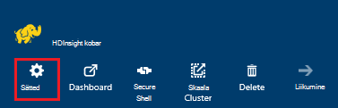

3. Valige keelest sätted __Skripti toimingud__.

    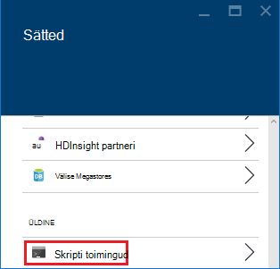

4. Skripti toimingud enne kuvatakse loend nõutud skripte kui ka skriptide rakendatud kobar, ajalugu. Pildil näete, et see oli Solri, script on, kuid et pole skripti toimingud on kestnud.

    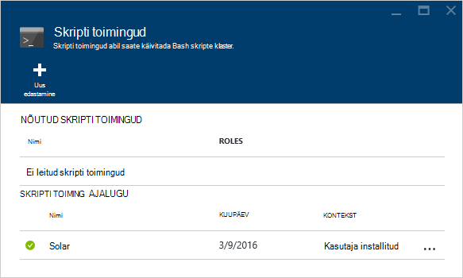

5. Skripti valimine ajalugu kuvatakse seda skripti tera atribuudid. Tera ülaosas saate uuesti skripti või edendada.

    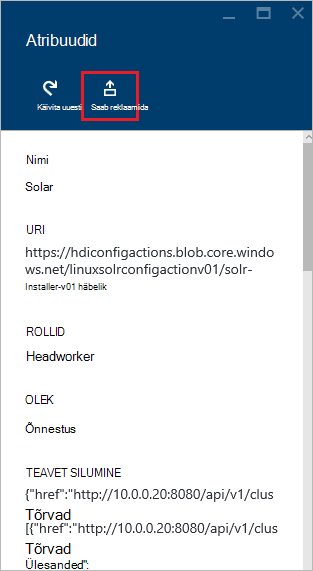

6. Saate kasutada ka __…__ paremal kirjed skripti toimingud enne toimingute sooritamiseks, nagu uuesti püsivad või kustutamine (jaoks nõutud toimingud).

    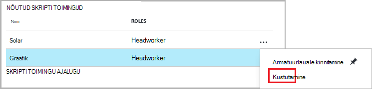

### Azure'i PowerShelli abil

| Kasutage järgmist... | Kui soovite... |
| ----- | ----- |
| Get-AzureRmHDInsightPersistedScriptAction | Saate tuua teavet nõutud skripti toimingud |
| Get-AzureRmHDInsightScriptActionHistory | Saate tuua ajalugu skripti toimingute rakendatud kobar või konkreetse skripti üksikasjad |
| Set-AzureRmHDInsightPersistedScriptAction | Tõstab esile nõutud skripti toimingu sihtotstarbelise skripti toiming |
| Eemalda – AzureRmHDInsightPersistedScriptAction | Viib nõutud skripti toimingu sihtotstarbelise toimingu |

> [AZURE.IMPORTANT] Kasutades `Remove-AzureRmHDInsightPersistedScriptAction` ei ei võta tagasi toiming teha skripti, see eemaldab ainult nõutud lipu, et script on parandusfunktsiooni ei uue töötaja sõlmed lisada klaster.

Järgmine näide skript näitab, esiletõstmine ja seejärel langetamine skripti cmdlet-käskude abil.

    # Get a history of scripts
    Get-AzureRmHDInsightScriptActionHistory -ClusterName mycluster

    # From the list, we want to get information on a specific script
    Get-AzureRmHDInsightScriptActionHistory -ClusterName mycluster -ScriptExecutionId 635920937765978529

    # Promote this to a persisted script
    # Note: the script must have a unique name to be promoted
    # if the name is not unique, you will receive an error
    Set-AzureRmHDInsightPersistedScriptAction -ClusterName mycluster -ScriptExecutionId 635920937765978529

    # Demote the script back to ad hoc
    # Note that demotion uses the unique script name instead of
    # execution ID.
    Remove-AzureRmHDInsightPersistedScriptAction -ClusterName mycluster -Name "Install Giraph"

### Azure'i CLI abil

| Kasutage järgmist... | Kui soovite... |
| ----- | ----- |
| `azure hdinsight script-action persisted list <clustername>` | Hankige skripti nõutud toimingute loend |
| `azure hdinsight script-action persisted show <clustername> <scriptname>` | Konkreetse nõutud skripti toimingu teabe toomiseks |
| `azure hdinsight script-action history list <clustername>` | Skripti toimingute rakendatud klaster ajaloo tuua |
| `azure hdinsight script-action history show <clustername> <scriptname>` | Konkreetse skripti toimingu teabe toomiseks |
| `azure hdinsight script action persisted set <clustername> <scriptexecutionid>` | Tõstab esile nõutud skripti toimingu sihtotstarbelise skripti toiming |
| `azure hdinsight script-action persisted delete <clustername> <scriptname>` | Viib nõutud skripti toimingu sihtotstarbelise toimingu |

> [AZURE.IMPORTANT] Kasutades `azure hdinsight script-action persisted delete` ei ei võta tagasi toiming teha skripti, see eemaldab ainult nõutud lipu, et script on parandusfunktsiooni ei uue töötaja sõlmed lisada klaster.

### Kasutades .NET SDK Hdinsightiga

Näide .NET SDK abil saate tuua skripti ajalugu klaster edendada või paremale liigendada skriptide leiate teemast [https://github.com/Azure-Samples/hdinsight-dotnet-script-action](https://github.com/Azure-Samples/hdinsight-dotnet-script-action).

> [AZURE.NOTE] Selles näites ka näitab, kuidas installida rakendus Hdinsightiga .NET SDK abil.

## Tõrkeotsing

Ambari web Kasutajaliidese abil saate vaadata teavet, mis on sisse logitud skripti toimingud. Skripti kasutamisel ajal klaster loomine ja kobar loomine nurjus skripti tõrke tõttu, logid on ka seotud klaster vaikimisi salvestusruumi konto jaoks saadaval. Sellest jaotisest leiate teavet kohta, kuidas tuua logid nii nende suvandite abil.

### Ambari Web Kasutajaliidese abil

1. Liikuge brauseris https://CLUSTERNAME.azurehdinsight.net. Asendage CLUSTERNAME klaster Hdinsightiga nime.

    Küsimise korral sisestage klaster administraatori konto nimi (haldus) ja parool. Teil võib vaja uuesti sisestada administraatori identimisteave veebivormi.

2. Valige lehe ülaosas oleval ribal, __ops__ kirje. See näitab loendi kaudu Ambari klaster praeguse ja eelmise toimingutest.

    

3. Leida kirjed, mis on __käivitada\_customscriptaction__ veerus __Operations__ . Need luuakse skripti toimingud on parandusfunktsiooni.

    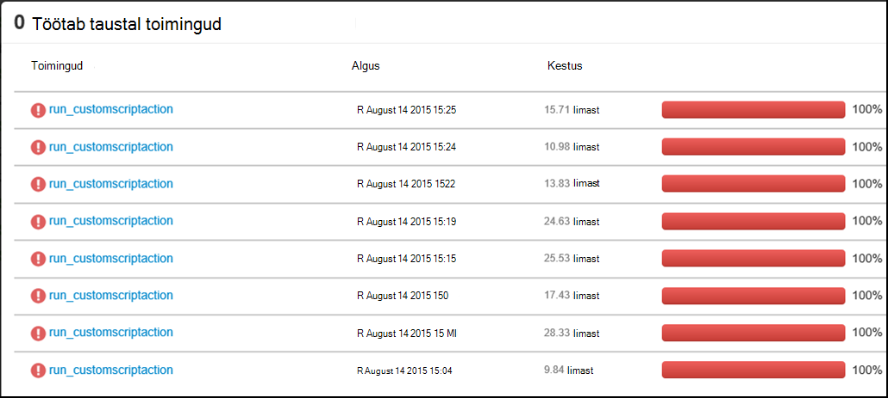

    Valige kirje ja klaster parandusfunktsiooni süvitsiminek vaatamiseks STDOUT ja STDERR väljund luuakse, kui skript oli linkide kaudu.

### Accessi logid vaikimisi salvestusruumi konto kaudu

Kui kobar loomine nurjus skripti toimingu tõrke tõttu, skripti toimingu logid endiselt pääseb juurde otse seostatud klaster salvestusruumi vaikekonto.

* Salvestusruumi logid on saadaval veebisaidil `\STORAGE_ACOCUNT_NAME\DEFAULT_CONTAINER_NAME\custom-scriptaction-logs\CLUSTER_NAME\DATE`.

    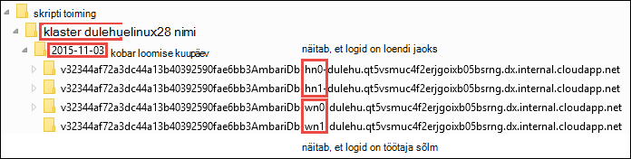

    See, klõpsake jaotises korrastatud headnode, workernode ja zookeeper sõlmed eraldi logid. Mõned näited:
    * **Headnode** - `<uniqueidentifier>AmbariDb-hn0-<generated_value>.cloudapp.net`
    * **Töötaja sõlm** - `<uniqueidentifier>AmbariDb-wn0-<generated_value>.cloudapp.net`
    * **Zookeeper sõlm** - `<uniqueidentifier>AmbariDb-zk0-<generated_value>.cloudapp.net`

* Kõik stdout ja stderr vastavate hosti on üles laaditud salvestusruumi kontole. On üks **väljundi -\*.txt** ja **tõrgete -\*.txt** skripti iga toimingu jaoks. Väljundi-txt-faili sisaldab teavet URI Script Host töötavad sai. Näide

        'Start downloading script locally: ', u'https://hdiconfigactions.blob.core.windows.net/linuxrconfigactionv01/r-installer-v01.sh'

* On võimalik, et korduvalt luua skripti toimingu kobar sama nimega. Sellisel juhul saate eristada oluline logid kuupäeva kausta nime järgi. Näiteks kausta struktuuri kobar (mycluster) loodud eri on:
    * `\STORAGE_ACOCUNT_NAME\DEFAULT_CONTAINER_NAME\custom-scriptaction-logs\mycluster\2015-10-04`
    * `\STORAGE_ACOCUNT_NAME\DEFAULT_CONTAINER_NAME\custom-scriptaction-logs\mycluster\2015-10-05`

* Kui loote skripti toimingu kobar sama nimega samal päeval, saate kordumatu eesliite tuvastamiseks oluline logifailid.

* Kui loote klaster päeva lõpus, on võimalik, et logifailid asuvad kaks päeva. Sellisel juhul kuvatakse kaks eri kuupäeva kaustade jaoks sama kobar.

* Failide üleslaadimine vaike-ümbrisest võib kuluda kuni 5 minutit, eriti suurtes rühmades. Jah, kui soovite logid juurde, ei tohiks kohe kustutada klaster skripti toimingu nurjumisel.

## Avatud lähtekoodi tarkvara kasutada Hdinsightiga kogumite tugi

Microsoft Azure Hdinsightiga teenus on paindlik platvorm, mis võimaldab teil luua andmete – suured rakendusi pilves, kasutades avatud lähtekoodi tehnoloogiad loodi Hadoopi ökosüsteemi. Microsoft Azure'i annab üldine toetustase avatud lähtekoodi tehnoloogiale, nagu [Azure'i toe KKK veebisaidi](https://azure.microsoft.com/support/faq/)jaotises **Ulatus toetavad** . Hdinsightiga teenus pakub toetavad mõned komponendid, nagu allpool kirjeldatud.

On kahte tüüpi avatud lähtekoodi komponendid, mis on saadaval teenuses Hdinsightiga.

- **Sisseehitatud komponendid** - järgmised komponendid on eelinstallitud opsüsteemi Hdinsightiga kogumite ja pakuvad klaster põhifunktsioone. Näiteks LÕNG ResourceManager, taru päringukeele (HiveQL) ja Mahout teegi kuuluvad kategooriasse. Täieliku loendi kobar komponendid on saadaval [mis on uut rakenduses Hadoopi kobar versioonide pakutavast Hdinsightiga?](hdinsight-component-versioning.md).

- **Kohandatud komponendid** -, kui kasutaja kobar, saate installida või kasutada mis tahes osa ühenduse või teie poolt loodud oma töökoormus.

> [AZURE.WARNING] Koos Hdinsightiga kobar komponendid on täielikult toetatud ja Microsoft Support aitab eristada ja nende komponentide seotud probleemide lahendamiseks.
>
> Kohandatud komponendid tugiteenuseid äriliselt mõistlik aidata teil selle probleemi tõrkeotsingu sooritamiseks. See võib põhjustada probleemi lahendamine või palub teil otsimist ja avatud allika tehnoloogiad, kui leitakse sügav teadmised selle tehnoloogia. Näiteks on palju kogukonnafoorumi saite, mida saab kasutada, nt: [MSDN-i Foorum Hdinsightiga](https://social.msdn.microsoft.com/Forums/azure/en-US/home?forum=hdinsight), [http://stackoverflow.com](http://stackoverflow.com). Ka Apache projektide on projekti saitidel [http://apache.org](http://apache.org), näiteks: [Hadoopi](http://hadoop.apache.org/).

Hdinsightiga teenus on mitu võimalust kasutada kohandatud komponendid. Sõltumata sellest, kuidas komponent on kasutatud või klaster installitud, kehtib tugi samal tasemel. Allpool on kõige levinum viise, et kohandatud komponendid saab kasutada Hdinsightiga kogumite loend.

1. Töö esitamise - Hadoopi või muud tüüpi tööd, käivitada või kasutada kohandatud komponendid saab esitada klaster.

2. Kobar kohandamine - kobar loomise ajal saate määrata täiendavaid sätteid ja kohandatud komponendid, mis installitakse kobar sõlmed.

3. Proovi - populaarsed kohandatud komponendid, Microsoft ja teistele anda näidised, kuidas need komponendid saab kasutada Hdinsightiga rühmad. Need näited on saadaval ilma tugi.

##Tõrkeotsing

###Ajalugu ei kuvata skripte kasutada kobar loomise ajal

Kui klaster loodi enne 15 märts 2016, ei pruugi te näha kirje skripti toimingu ajalugu mis tahes skriptide kobar loomisel kasutada. Siiski suuruse muutmisel klaster pärast 15 märts 2016 skriptide abil kobar loomise ajal kuvatakse ajaloo nagu need on rakendatud uusi sõlmi klaster suuruse muutmise toimingu käigus.

On kahe erandiga:

* Kui klaster loodi enne 1st mai 2015. See on kui võeti kasutusele skripti toimingud, mis tahes kobar enne seda kuupäeva ei kasutada skripti toimingud kobar loomiseks.

* Kui kasutada mitut skripti toimingud kobar loomise ajal ja kasutatakse mitut skriptide mitme skriptide sama nime või sama nime, sama URI, kuid erinevad parameetrid. Sellisel juhul kuvatakse järgmine tõrketeade.

    Klõpsake selle kobar tõttu vastuoluliste skripti nimede olemasoleva skriptide saab teostada pole uue skripti toimingud. Skripti nimede juures kobar loomine peab olema kordumatu kõik. Olemasoleva skriptide täidetakse endiselt suuruse muutmise kohta.

## Järgmised sammud

Vaadake järgmist teavet ning näited loomise ja kohandamise klaster skriptide kasutamise kohta:

- [Töötada skripti toimingu skriptide Hdinsightiga](hdinsight-hadoop-script-actions-linux.md)
- [Installimine ja kasutamine Solri Hdinsightiga kogumite](hdinsight-hadoop-solr-install-linux.md)
- [Installimine ja kasutamine Giraph Hdinsightiga kogumite](hdinsight-hadoop-giraph-install-linux.md)

[img-hdi-cluster-states]: ./media/hdinsight-hadoop-customize-cluster-linux/HDI-Cluster-state.png "Etappide kobar loomise ajal"
