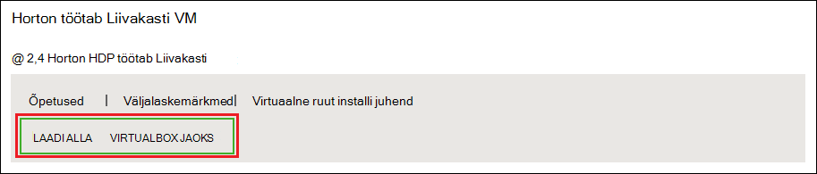
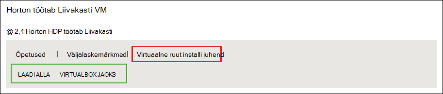
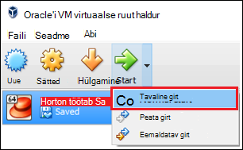

<properties
    pageTitle="Lisateavet Hadoopi Hadoopi Liivakasti abil | Microsoft Azure'i"
    description="Õppekeskuse Hadoopi ökosüsteemi kasutamise kohta alustamiseks saate häälestada Hadoopi Liivakasti Hortonworks: Azure'i virtual arvutis. "
    keywords="Hadoopi emulaator, hadoop Liivakasti"
    editor="cgronlun"
    manager="jhubbard"
    services="hdinsight"
    authors="nitinme"
    documentationCenter=""
    tags="azure-portal"/>

<tags
    ms.service="hdinsight"
    ms.workload="big-data"
    ms.tgt_pltfrm="na"
    ms.devlang="na"
    ms.topic="article"
    ms.date="08/24/2016"
    ms.author="nitinme"/>

# Hadoopi ökosüsteemis Hadoopi Liivakasti virtual arvutisse alustamine

Saate teada, kuidas installida Hadoopi Liivakasti Hortonworks virtuaalse masina Hadoopi ökosüsteemi kohta. Liivakasti pakub kohaliku arenduskeskkond Hadoopi, Hadoop jaotatud faili süsteemi (HDFS) ja töö esitamise kohta.

## Eeltingimused

* [Oracle'i VirtualBox](https://www.virtualbox.org/)

Kui olete tuttav Hadoopi, saate hakata Hadoopi Azure on Hdinsightiga kobar loomisega. Lisateavet selle kohta, kuidas alustada, lugege teemat [Alustamine Hadoopi Hdinsightiga](hdinsight-hadoop-linux-tutorial-get-started.md).

## Laadige alla ja installige virtuaalse masina

1. [Http://hortonworks.com/downloads/#sandbox](http://hortonworks.com/downloads/#sandbox), valige __Allalaadimine VIRTUALBOX__ üksuse HDP 2.4 Hortonworks Liivakasti kohta. Teil palutakse registreeruma Hortonworks enne allalaadimist hakkab.

    

2. Valige sama veebilehelt HDP 2,4 Hortonworks Liivakasti __VirtualBox installida juhend__ . Laadige alla PDF-faili sisaldava virtuaalse masina installimisjuhiseid.

    

## Virtuaalse masina käivitamine

1. Käivitage VirtualBox, valige Hortonworks Liivakasti, valige __Käivita__ja seejärel __Tavaline käivitamine__.

    

2. Kui virtuaalse masina on buutimine protsessi lõpule jõudnud, kuvatakse sisselogimise juhiseid. Avage veebibrauser ja liikuge kuvatakse URL (tavaliselt http://127.0.0.1:8888).

## Parooli seadmine

1. __Töö alustamine__ juhises Hortonworks Liivakasti lehe, valige __Kuva täpsemad suvandid__. Kasutage teavet sellel lehel login Liivakasti SSH abil. Kasutage nimi ja parool.

    > [AZURE.NOTE] Kui teil pole SSH kliendi installitud, saate kasutada veebisaidil esitatud virtuaalse masina veebisaidil veebipõhise SSH __http://localhost:4200 /__.

    Saate esimest korda, kui loote ühenduse SSH, palutakse teil root konto parooli muutmine. Sisestage uus parool, mida kasutatakse edaspidi SSH abil sisselogimisel.

2. Kui sisse loginud, sisestage järgmine käsk:

        ambari-admin-password-reset
    
    Küsimise korral sisestage Ambari administraatori konto parool. Seda kasutatakse, kui pöördute Ambari Web UI.

## Käsuga taru

1. SSH ühendus Liivakasti kasutada taru shell alustamiseks järgmine käsk:

        hive

2. Shell on käivitatud järgmine abil saate vaadata tabelite, mis on varustatud Liivakasti:

        show tables;

3. Järgmine 10 ridade toomiseks kasutada funktsiooni `sample_07` tabeli:

        select * from sample_07 limit 10;

## Järgmised sammud

* [Saate teada, kuidas Hortonworks Liivakasti Visual Studio abil](hdinsight-hadoop-emulator-visual-studio.md)
* [Õppekeskuse köite Hortonworks Liivakasti.](http://hortonworks.com/hadoop-tutorial/learning-the-ropes-of-the-hortonworks-sandbox/)
* [Hadoopi õppeteema – HDP töötamise alustamine](http://hortonworks.com/hadoop-tutorial/hello-world-an-introduction-to-hadoop-hcatalog-hive-and-pig/)