<properties
pageTitle="Microsoft Azure'i andmed Lake tööriistu saate kasutada Visual Studio Hortonworks Liivakasti | Microsoft Azure'i"
description="Saate teada, kuidas kasutada Azure Andmeriistad Lake VIsual Studio Hortonworks Liivakasti (töötab kohaliku VM.) Nende tööriistade saab luua ja käivitada taru ja siga töökohtade Liivakasti ja vaadata töö väljund ja ajalugu."
services="hdinsight"
documentationCenter=""
authors="Blackmist"
manager="paulettm"
editor="cgronlun"/>

<tags
ms.service="hdinsight"
ms.devlang="na"
ms.topic="article"
ms.tgt_pltfrm="na"
ms.workload="big-data"
ms.date="08/26/2016"
ms.author="larryfr"/>

# Azure'i andmed Lake tööriistu saate kasutada Visual Studio Hortonworks Liivakasti

Azure'i andmed Lake tööriistad Visual Studio hulka kuuluvad tööriistad töötamiseks üldise Hadoopi kogumite, lisaks tööriistad töötamiseks Azure'i andmed Lake ja Hdinsighti. Selles dokumendis on toodud juhiseid Azure'i andmed Lake tööriistade kasutamine Hortonworks Liivakasti kohalikus virtual arvutis töötab.

Liivakasti Hortonworks kasutamine võimaldab töötada Hadoopi kohalikult oma arenduskeskkond. Kui olete töötanud lahenduse ja soovite juurutada skaala, saate siis liikuda mõne Hdinsightiga kobar.

## Eeltingimused

* Hortonworks Liivakasti töötamise virtuaalse masina oma arenduskeskkond. Selles dokumendis on kirjutatud ja katsetada Liivakasti töötab Oracle'i VirtualBox, mis on konfigureeritud [Hadoopi ökosüsteemis alustada](hdinsight-hadoop-emulator-get-started.md) dokumendi teabe abil.

* Visual Studio 2013 või 2015, mis tahes versioon.

* [Azure'i SDK .net-i](https://azure.microsoft.com/downloads/) 2.7.1 või uuem versioon

* [Azure'i andmed Lake Tools for Visual Studio](https://www.microsoft.com/download/details.aspx?id=49504)

## Liivakasti paroolide konfigureerimine

Veenduge, et Hortonworks Liivakasti töötab, siis järgige [Alustamine Hadoopi ökosüsteemis](hdinsight-hadoop-emulator-get-started.md#set-passwords) konfigureerida parooli SSH `root` konto ja selle Ambari `admin` konto. Need paroolid kasutatakse ühendamisel Liivakasti Visual Studio.

## Liivakasti tööriistade ühendamine

1. Avage Visual Studio ja valige __Vaade__ja seejärel __Server Explorer__.

2. __Server Explorer__, paremklõpsake __Hdinsightiga__ kirjet ja valige __Hdinsightiga emulaator ühenduse loomine__.

    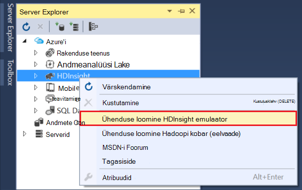

3. Dialoogiboksi __ühenduse Hdinsightiga emulaator__ sisestage parool, mida Ambari jaoks konfigureeritud.

    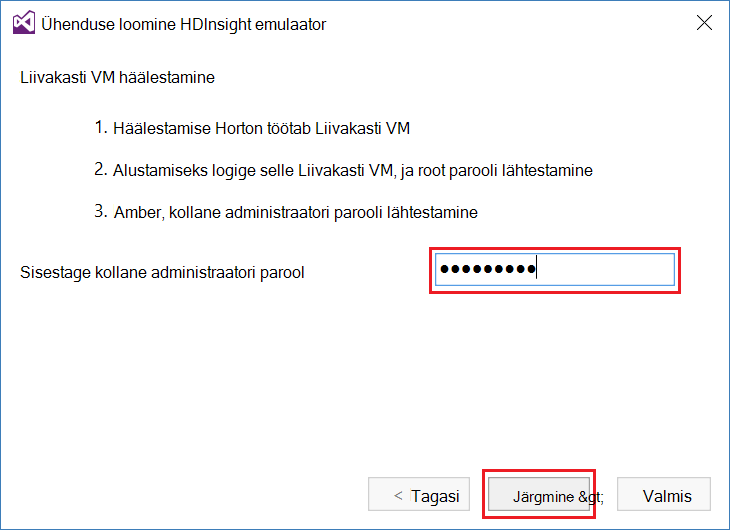

    Valige __edasi__ .

4. Sisestage parool jaoks konfigureeritud __parooliväli__ abil soovitud `root` konto. Jätke väljad vaikimisi väärtus.

    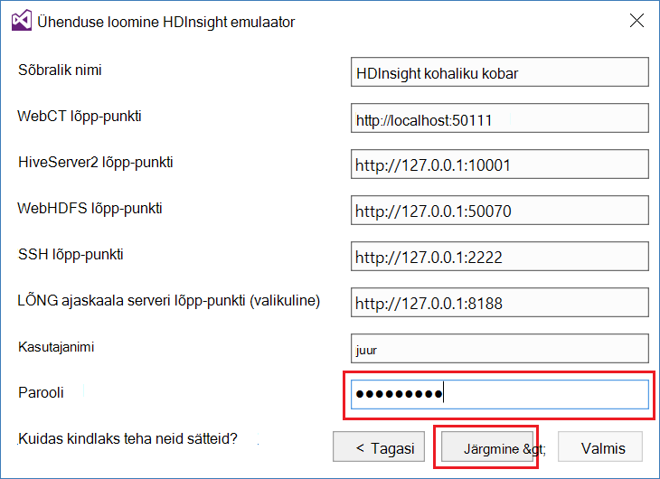

    Valige __edasi__ .

5. Oodake, kuni valideerimine teenuste lõpuleviimiseks. Mõnel juhul võib valideerimine nurjub töötamast ja vajavad värskendamist konfiguratsiooni. Kui see juhtub, klõpsake nuppu __Värskenda__ ja oodake konfiguratsiooni ja kontrollimise teenuse lõpuleviimiseks.

    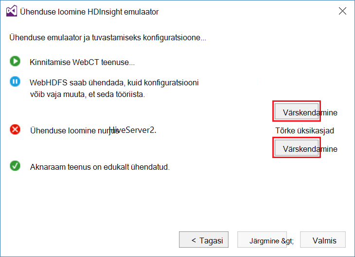

    > [AZURE.NOTE] Värskenduse toimingu kasutab Ambari Hortonworks Liivakasti konfiguratsioon, mida oodata tööriistadega Azure'i andmed Lake Visual Studio muutmiseks.

    Kui kinnitamine on lõpule jõudnud, valige konfigureerimise lõpuleviimiseks __valmis__ .

    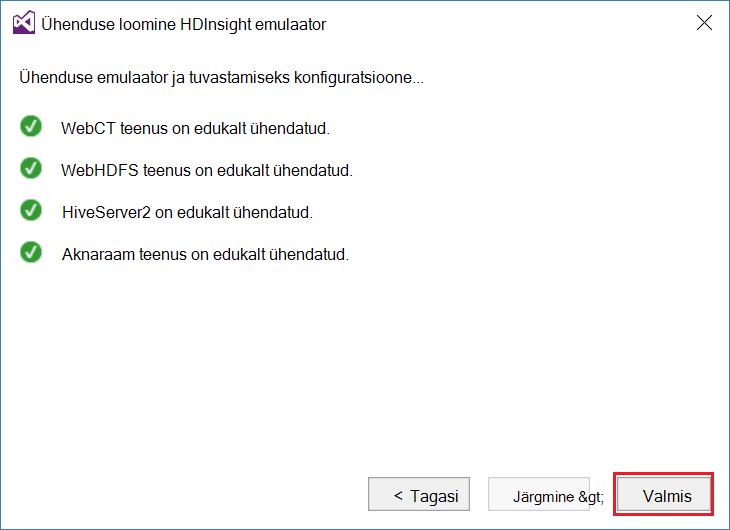

    > [AZURE.NOTE] Sõltuvalt teie arenduskeskkond ja mälu eraldatud virtuaalse masina kiirust, võib kuluda mitu minutit konfigureerimine ja kinnitage teenuseid.

Pärast nende juhiste teil on nüüd "Hdinsightiga kohaliku kobar" kirje Server Explorer jaotises Hdinsightiga.

## Kirjutage taru päring

Taru pakub SQL-like päringukeele (HiveQL), struktureeritud andmetega töötamiseks. Järgmiste juhiste abil saate teada, kuidas erakorralist päringuid käivitada vastu kohaliku kobar.

1. __Server Explorer__, paremklõpsake kohaliku klaster varem lisatud kirje ja valige __kirjutamine taru päringu__.

    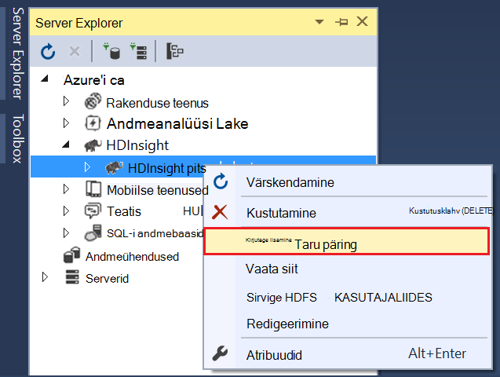

    See avab uue päringu aken, kus saate kiiresti üles tippige ja kohalik klaster päringu edastamist.

2. Päringu uues aknas, sisestage järgmine:

        select count(*) from sample_08;
    
    Päringu akna ülaosas veenduge, et selle konfiguratsiooni kohaliku kobar on valitud ja seejärel valige __Edasta__. Jätke vaikeväärtused muid väärtusi (__paketi__ ja serveri nimi).

    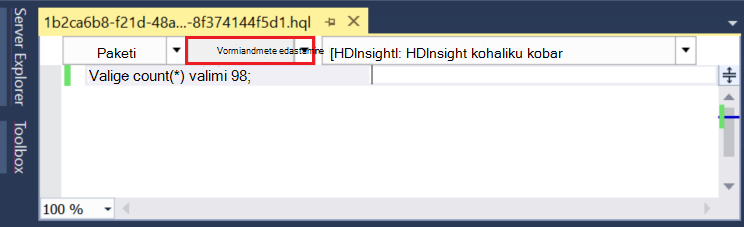

    Pange tähele, et saate __Edasta__ kõrval rippmenüü __Täpsemalt__valimiseks. Avaneb dialoogiboks, mis võimaldab teil esitada lisasuvandid töö esitamisel.

    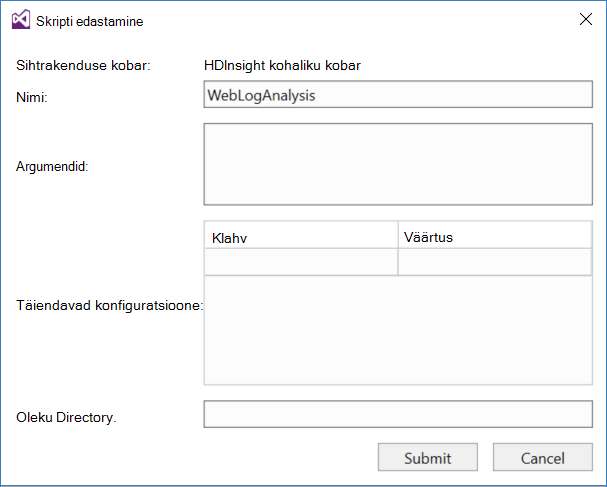

3. Pärast päringu edastamist, kuvatakse projekti olek. See teave töö, kui see on töödeldud Hadoopi järgi. __Töö oleku__ kirje pakub töö praegune olek. Riigi värskendatakse pidevalt või abil saate ikooni värskendamine käsitsi värskendada oleku.

    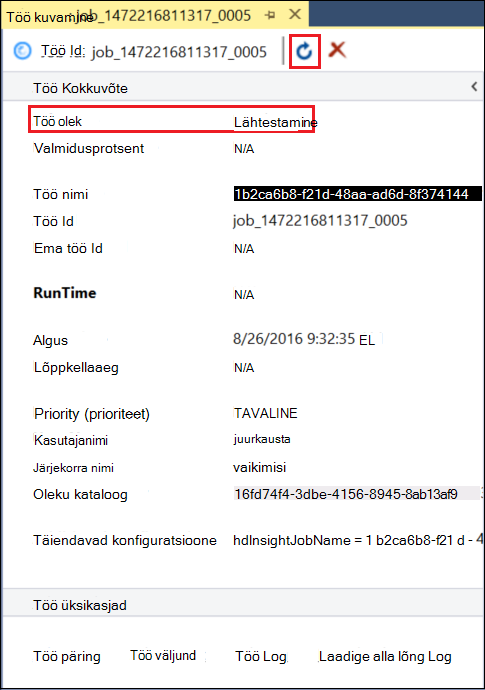

    Pärast __Töö olek__ muutub __lõpetatud__, kuvatakse on suunatud atsüklilised graafik (DAG). See kirjeldab täitmise tee, mis oli määratud Tez (vaikimisi täitmise mootor mesilaspere kohaliku klaster.) 
    
    > [AZURE.NOTE] Tez on vaikimisi, kasutades Linux-põhine Hdinsightiga kogumite. See ei ole vaikimisi sisse Windowsi-põhiste Hdinsightiga; Kasutage seda seal, peate lisama rea `set hive.execution.engine = tez;` taru päringu alguseni. 

    __Töö väljundi__ lingi abil saate vaadata väljund. Selles näites on __823__; sample_08 tabeli ridade arv. Saate vaadata teavet diagnostika töö __Töö registri__ ja __Laadige LÕNG__ linkide kaudu.

4. Saate käivitada taru tööd interaktiivseks __interaktiivne__ __paketi__ välja muuta, ja valige __Käivita__. 

    

    See andmevoogu väljundi Logi loodud __HiveServer2 väljundi__ aknas töötlemise ajal.
    
    > [AZURE.NOTE] See on sama teavet, mis on __Töö Log__ lingi, kui tööd on lõpule jõudnud.

    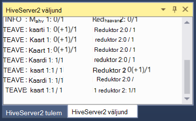

## Taru projekti loomine

Saate luua ka projekti, mis sisaldab mitut taru skriptide. See on kasulik, kui teil on seostuvaid skriptide, mida soovite koos hoida, või säilitada versioon juhtelemendi abil.

1. Visual Studio, valige __fail__, __Uus__ja then__Project__.

2. Projektide loendi laiendamine __Mallid__, __Azure'i andmed Lake__ ja seejärel valige __TARU (Hdinsightiga)__. Mallide loendi, valige __Proovi taru__. Sisestage nimi ja asukoht ning klõpsake nuppu __OK__.

    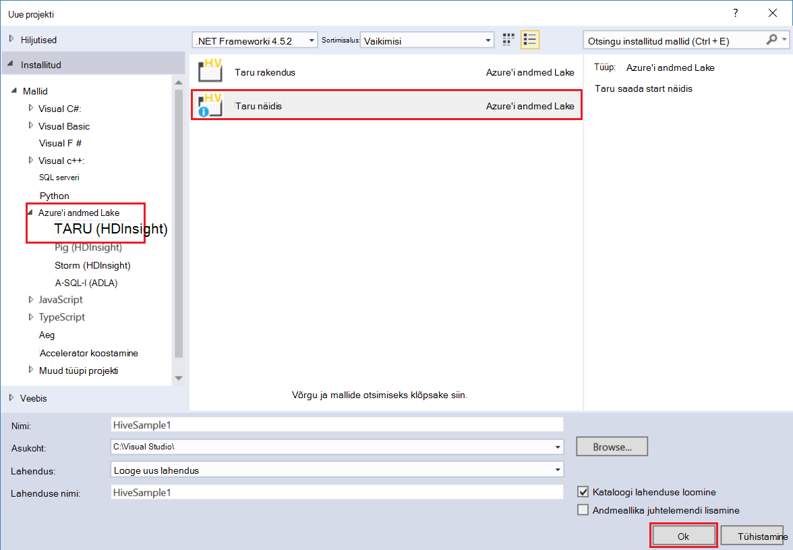

__Valimi taru__ projekt sisaldab kahte skriptide, __WebLogAnalysis.hql__ ja __SensorDataAnalysis.hql__. Need akna ülaosas nuppu sama __saada__ abil saate esitada.

## Siga projekti loomine

Taru pakub SQL-like keeles struktureeritud andmetega töötamiseks, pakub siga keele (Ladina siga,), mis võimaldab teil arendada müügivõimaluste teisendused, mis on rakendatud andmete. Järgmiste juhiste abil saate kohaliku kobar siga kasutamine.

1. Avage Visual Studio ja valige __fail__, __Uus__ja seejärel __projekti__. Projektide loendi laiendamine __Mallid__, __Azure'i andmed Lake__, ja seejärel valige __siga (Hdinsightiga)__. Valige loendist Mallid, __Siga rakendus__. Sisestage nimi, asukoht ja seejärel klõpsake __nuppu OK__.

    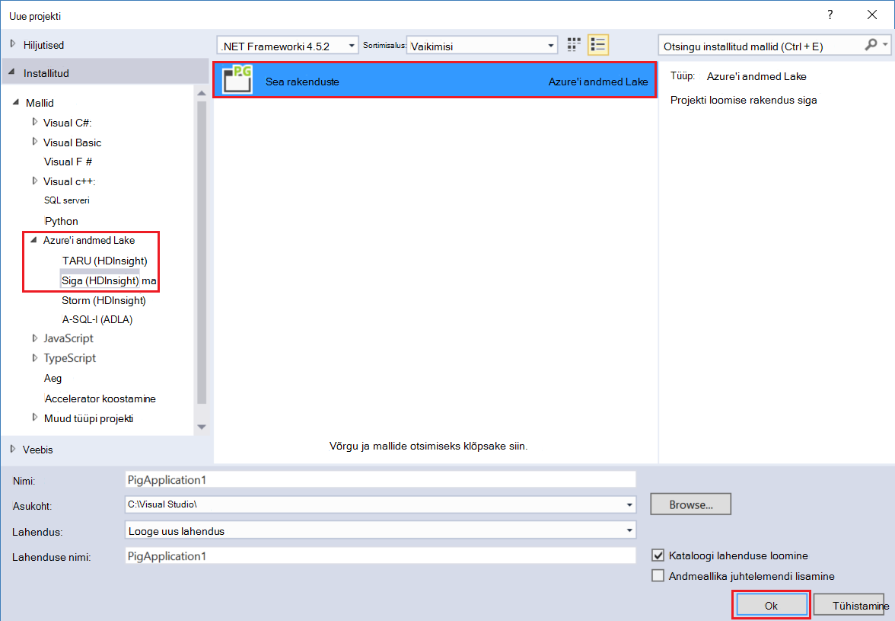

2. Sisestage järgmine __script.pig__ faili, mis on loodud projekti sisu.

        a = LOAD '/demo/data/Website/Website-Logs' AS (
            log_id:int, 
            ip_address:chararray, 
            date:chararray, 
            time:chararray, 
            landing_page:chararray, 
            source:chararray);
        b = FILTER a BY (log_id > 100);
        c = GROUP b BY ip_address;
        DUMP c;

    Ajal siga kasutab mõnes muus keeles, kui taru, kuidas te käitamist vastab nii keeltesse kaudu nupp __Edasta__ . Valige rippmenüüst alla __Edasta__ kõrval kuvatakse ka dialoogiboksi Täpsem Edasta siga.

    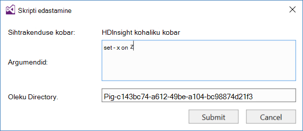
    
3. Töö oleku ja väljund on kuvatud sama taru päringu.

    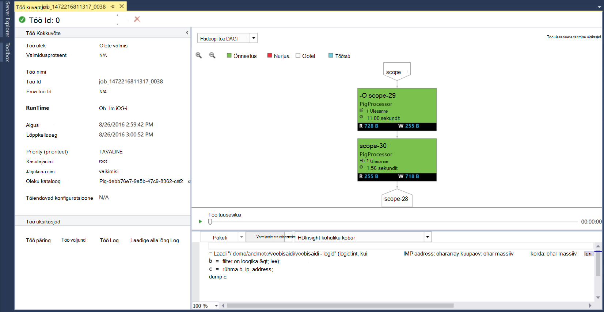

## Vaata siit

Azure'i Lake Andmeriistad lubada abil hõlpsasti saate vaadata teavet tööd, mis on käivitasite Hadoopi kohta. Järgmiste juhiste abil saate vaadata tööd, mis on parandusfunktsiooni kohaliku klaster.

1. __Server Explorer__, paremklõpsake kohaliku kobar ja valige __Vaata siit__. See kuvab loendis on esitatud töid klaster.

    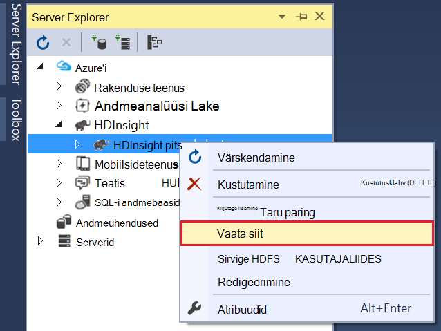

2. Tööde loendi, valige üks töö üksikasju soovite vaadata.

    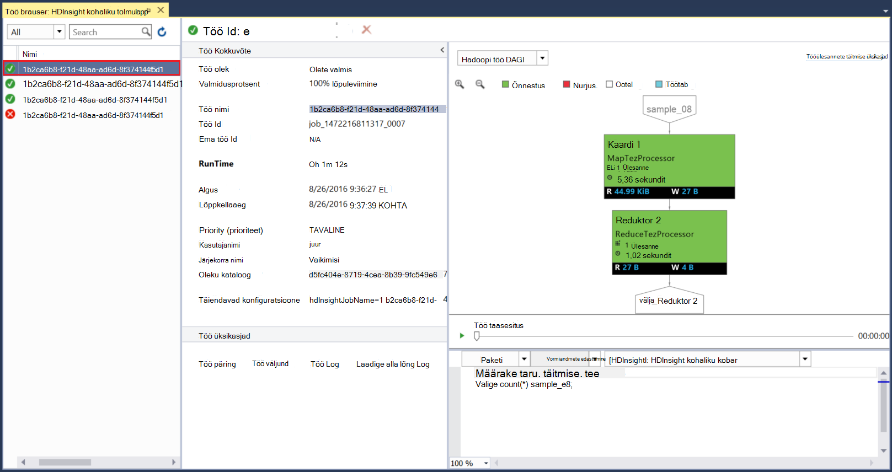

    Kuvatav teave on sarnane pärast töötab taru või siga päring koos linkide kuvamiseks väljund ja logiteave osad.

3. Saate muuta ja uuesti töö siit.

## Vaate taru andmebaasid

1. __Server Explorer__, laiendage __Hdinsightiga kohaliku kobar__ kirje ja seejärel laiendage __Taru andmebaasid__. See näitab kohaliku kobar __vaikimisi__ ja __xademo__ andmebaaside. Andmebaasi laiendamine näitab sees andmebaasi tabelid.

    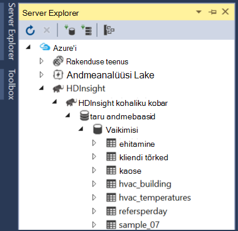

2. Tabeli laiendamise kuvatakse selle tabeli veerud. Saate tabeli paremklõpsake ja valige __Kuva ülemises 100 ridade__ teabe kuvamiseks.

    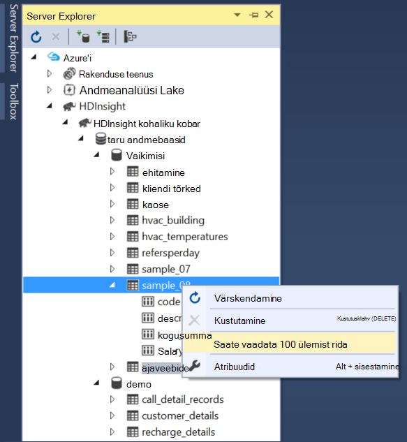

### Andmebaas ja tabel atribuudid

Võib-olla märganud, võite valida tabeli või andmebaasi __atribuutide__ vaatamiseks. See kuvab valitud üksuse üksikasjade aken Atribuudid.

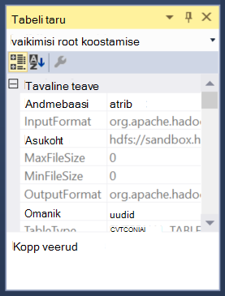

### Tabeli loomine

Uue tabeli loomine andmebaasi paremklõpsake ja seejärel valige __Tabeli loomine__.

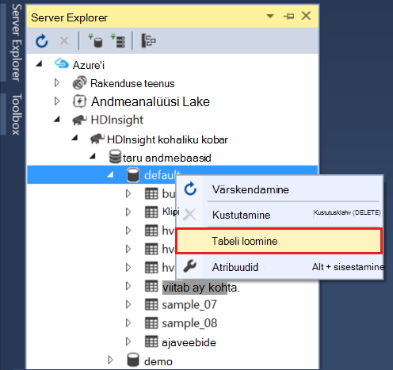

Seejärel saate luua tabeli, vormi abil. Saate vaadata töötlemata HiveQL, mida kasutatakse tabeli loomiseks selle lehe allservas.

## Järgmised sammud

* [Õppekeskuse köite Hortonworks Liivakasti.](http://hortonworks.com/hadoop-tutorial/learning-the-ropes-of-the-hortonworks-sandbox/)
* [Hadoopi õppeteema – HDP töötamise alustamine](http://hortonworks.com/hadoop-tutorial/hello-world-an-introduction-to-hadoop-hcatalog-hive-and-pig/)