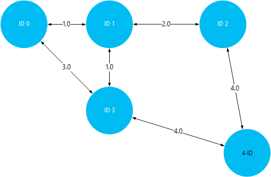
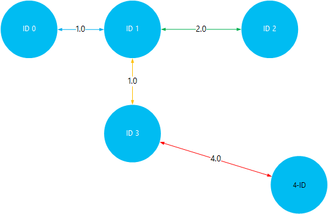

<properties
    pageTitle="Installimine ja kasutamine Giraph Hadoopi kogumite rakenduses Hdinsightiga | Microsoft Azure'i"
    description="Siit saate teada, kuidas kohandada Hdinsightiga kobar koos Giraph ja Giraph kasutamise kohta."
    services="hdinsight"
    documentationCenter=""
    authors="nitinme"
    manager="jhubbard"
    editor="cgronlun"
    tags="azure-portal"/>

<tags
    ms.service="hdinsight"
    ms.workload="big-data"
    ms.tgt_pltfrm="na"
    ms.devlang="na"
    ms.topic="article"
    ms.date="02/05/2016"
    ms.author="nitinme"/>

# Installimine ja kasutamine Giraph Hdinsightiga

Teada, kuidas kohandada Windowsi vastavalt Hdinsightiga kobar Giraph skripti toimingu abil ja töötlemine suuremahuliste graafikud Giraph abil. Linux-põhine kobar Giraph kasutamise kohta leiate teemast [Installida Giraph Hdinsightiga Hadoopi kogumite (Linux) kohta](hdinsight-hadoop-giraph-install-linux.md).
 
Klõpsake mis tahes tüüpi kobar (Hadoopi, torm, HBase, säde) Giraph saate installida Windows Azure Hdinsightiga *Skripti toimingu*abil. Proovi skripti Giraph installimiseks on Hdinsightiga kobar on kirjutuskaitstud salvestusruumi Azure'i bloobimälu [https://hdiconfigactions.blob.core.windows.net/giraphconfigactionv01/giraph-installer-v01.ps1](https://hdiconfigactions.blob.core.windows.net/giraphconfigactionv01/giraph-installer-v01.ps1)veebisaidil saadaval. Skripti näide töötab ainult Hdinsightiga kobar versioon 3,1. Hdinsightiga kobar versioonide kohta leiate lisateavet teemast [Hdinsightiga kobar versioonid](hdinsight-component-versioning.md).

**Seotud artiklid**

- [Installige Giraph Hdinsightiga Hadoopi kogumite (Linux)](hdinsight-hadoop-giraph-install-linux.md)
- [Rakenduses Hdinsightiga loomine Hadoopi kogumite](hdinsight-provision-clusters.md): üldist teavet Hdinsightiga kogumite loomise kohta.
- [Kohandada Hdinsightiga kobar skript toimingu abil][hdinsight-cluster-customize]: Üldteave kohandamise Hdinsightiga kogumite skript toimingu abil.
- [Arendamise skripti toimingu skriptid Hdinsightiga](hdinsight-hadoop-script-actions.md).

## Mis on Giraph?

<a href="http://giraph.apache.org/" target="_blank">Apache Giraph</a> võimaldab teil teha, kasutades Hadoopi töötlemine graafik ja saab kasutada Windows Azure Hdinsightiga. Graafikud mudeli objektid, nt ühendused marsruuteri nagu Internet suure võrgus, või seoseid inimeste suhtlusvõrkudesse (mõnikord nimetatakse social graafik) vahel seoseid. Graafik töötlemine võimaldab teil põhjuse kohta seoseid objektide graafiku, näiteks:

- Tuvastamise võimalikud sõprade vastavalt oma praeguse seosed.
- Tuvastamise lühima marsruutimiseks võrgus kahe arvuti vahel.
- Arvutamise veebilehtede lehe asukoha andmehulgas.

## Installige Giraph portaalis

1. Käivitage luua klaster **Luua kohandatud** suvandi abil, nagu on kirjeldatud aadressil [loomine Hadoopi kogumite Hdinsightiga sisse](hdinsight-provision-clusters.md#portal).
2. Viisardi lehel **Script toimingud** klõpsake **skripti toimingu lisamine** üksikasjad skripti kohta, nagu allpool näidatud:

    ![Kasutage skripti toimingu kohandamiseks on kobar] (./media/hdinsight-hadoop-giraph-install/hdi-script-action-giraph.png "Kasutage skripti toimingu kohandamiseks on kobar")

    <table border='1'>
        <tr><th>Atribuut</th><th>Väärtus</th></tr>
        <tr><td>Nimi</td>
            <td>Määrake skripti toimingu nimi. Näiteks <b>Installida Giraph</b>.</td></tr>
        <tr><td>Skripti URI</td>
            <td>Määrake soovitud ühtse identifikaator (URL) skripti, mis on vaja järgida klaster kohandamiseks. Näiteks <i>https://hdiconfigactions.blob.core.windows.net/giraphconfigactionv01/giraph-installer-v01.ps1</i></td></tr>
        <tr><td>Sõlme tüüp</td>
            <td>Määrake sõlmed, mille kohandamine skript käivitatakse. Saate valida <b>kõik sõlmed</b>, <b>ainult pea sõlmed</b>või <b>ainult töötaja sõlmed</b>.
        <tr><td>Parameetrid</td>
            <td>Määrake soovitud parameetrid skripti vajadusel. Skripti Giraph installimiseks ei nõua kõik parameetrid nii, et võite seda tühjaks jätta.</td></tr>
    </table>

    Saate lisada rohkem kui ühe skripti toimingu klaster mitme komponentide installimine. Kui olete lisanud skriptide, klõpsake klaster loomise alustamiseks märke.

## Kasutage Giraph

Kasutame SimpleShortestPathsComputation näide näidata lihtsa <a href = "http://people.apache.org/~edwardyoon/documents/pregel.pdf">Pregel</a> rakendamist lühima tee vahel graafik objektide leidmiseks. Näidisandmete ja valimi jar, üleslaadimiseks tehke järgmist Käivita töö SimpleShortestPathsComputation näide abil ja seejärel vaadata tulemusi.

1. Azure'i bloobimälu jaoks Näidisandmete faili üleslaadimiseks. Klõpsake oma kohaliku töökoha **tiny_graph.txt**nimega uue faili loomine. See peaks sisaldama järgmisi ridu:

        [0,0,[[1,1],[3,3]]]
        [1,0,[[0,1],[2,2],[3,1]]]
        [2,0,[[1,2],[4,4]]]
        [3,0,[[0,3],[1,1],[4,4]]]
        [4,0,[[3,4],[2,4]]]

    Tiny_graph.txt faili üleslaadimine soovitud klaster Hdinsightiga esmane salvestusruum. Juhised, kuidas üles laadida andmeid, vt [andmete Hadoopi töökohta, Hdinsightiga üles laadida](hdinsight-upload-data.md).

    Andmed kirjeldatakse suunatud graph, vormingus objektide vahel seose [allikas\_id, allikas\_väärtus, [[dest\_id], [serva\_väärtus];...]]. Iga rida tähistab vahelise seose lisamine **allika\_id** objekti ja üks või mitu **dest\_id** objektid. Funktsiooni **serva\_väärtus** (või kaal) saab kirjeldada kui tugevus või **source_id** vahelise ühenduse kaugus ja **dest\_id**.

    Välja tõmmata ja objektide vahelise kauguse väärtus (või kaal) kasutades, ülaltoodud andmete võib välja nägema järgmine:

    

4. Käivitage SimpleShortestPathsComputation näide. Järgmised Azure PowerShelli cmdlet-käskude abil saate käivitada näide, sisendina tiny_graph.txt-faili abil. 

    [AZURE.INCLUDE [upgrade-powershell](../../includes/hdinsight-use-latest-powershell.md)]

        $clusterName = "clustername"
        # Giraph examples jar
        $jarFile = "wasbs:///example/jars/giraph-examples.jar"
        # Arguments for this job
        $jobArguments = "org.apache.giraph.examples.SimpleShortestPathsComputation",
                        "-ca", "mapred.job.tracker=headnodehost:9010",
                        "-vif", "org.apache.giraph.io.formats.JsonLongDoubleFloatDoubleVertexInputFormat",
                        "-vip", "wasbs:///example/data/tiny_graph.txt",
                        "-vof", "org.apache.giraph.io.formats.IdWithValueTextOutputFormat",
                        "-op",  "wasbs:///example/output/shortestpaths",
                        "-w", "2"
        # Create the definition
        $jobDefinition = New-AzureHDInsightMapReduceJobDefinition
          -JarFile $jarFile
          -ClassName "org.apache.giraph.GiraphRunner"
          -Arguments $jobArguments

        # Run the job, write output to the Azure PowerShell window
        $job = Start-AzureHDInsightJob -Cluster $clusterName -JobDefinition $jobDefinition
        Write-Host "Wait for the job to complete ..." -ForegroundColor Green
        Wait-AzureHDInsightJob -Job $job
        Write-Host "STDERR"
        Get-AzureHDInsightJobOutput -Cluster $clusterName -JobId $job.JobId -StandardError
        Write-Host "Display the standard output ..." -ForegroundColor Green
        Get-AzureHDInsightJobOutput -Cluster $clusterName -JobId $job.JobId -StandardOutput

    Ülaltoodud näites, Asendage **clustername** klaster Hdinsightiga, kuhu on installitud Giraph nime.

5. Tulemusi vaadata. Kui töö on lõpule jõudnud, salvestatakse tulemused kaks väljundi faili selle __wasbs: / / / näide/välja/shotestpaths__ kausta. Failide nimetatakse __osa – m-00001__ ja __osa-m-00002__. Järgmiste toimingute alla laadida ja selle väljundi vaadata:

        $subscriptionName = "<SubscriptionName>"       # Azure subscription name
        $storageAccountName = "<StorageAccountName>"   # Azure Storage account name
        $containerName = "<ContainerName>"             # Blob storage container name

        # Select the current subscription
        Select-AzureSubscription $subscriptionName

        # Create the Storage account context object
        $storageAccountKey = Get-AzureStorageKey $storageAccountName | %{ $_.Primary }
        $storageContext = New-AzureStorageContext -StorageAccountName $storageAccountName -StorageAccountKey $storageAccountKey

        # Download the job output to the workstation
        Get-AzureStorageBlobContent -Container $containerName -Blob example/output/shortestpaths/part-m-00001 -Context $storageContext -Force
        Get-AzureStorageBlobContent -Container $containerName -Blob example/output/shortestpaths/part-m-00002 -Context $storageContext -Force

    See __näide/väljundi/shortestpaths__ kataloogi struktuuri loomine praegust kausta sisse oma töökoha ja sinna kahe väljundi faile alla laadida.

    __Kass__ cmdlet-käsu abil saate kuvada failide sisu:

        Cat example/output/shortestpaths/part*

    Väljund peaks kuvatama umbes järgmine:

        0   1.0
        4   5.0
        2   2.0
        1   0.0
        3   1.0

    SimpleShortestPathComputation, näiteks on raske kodeeritud alustada objekti ID-d 1 ja muude objektide lühima tee otsimine. Nii, et lugeda väljund `destination_id distance`, kus vahemaa on objekti ID 1 ja sihtrakenduse ID vahel tegi servade väärtuse (või kaal)

    Visualiseerimine seda, saate seda kontrollida tulemused reisil lühima teed ID 1 ja kõigi muude objektide vahel. Pange tähele, et lühima tee ID-d 1-ID 4 on 5. See on kokku vahemaa ID 1 ja 3, ja seejärel ID 3 ja 4.

    

## Installige Giraph Aure PowerShelli abil

Lugege teemat [kohandamine Hdinsightiga kogumite skripti toimingu abil](hdinsight-hadoop-customize-cluster.md#call_scripts_using_powershell).  Valimi näitab, kuidas installida Azure PowerShelli kaudu säde. Peate kohandada skripti [https://hdiconfigactions.blob.core.windows.net/giraphconfigactionv01/giraph-installer-v01.ps1](https://hdiconfigactions.blob.core.windows.net/giraphconfigactionv01/giraph-installer-v01.ps1)kasutama.

## Kasutades .NET SDK Giraph installimine

Lugege teemat [kohandamine Hdinsightiga kogumite skripti toimingu abil](hdinsight-hadoop-customize-cluster.md#call_scripts_using_azure_powershell). Valimi näitab, kuidas installida säde .NET SDK abil. Peate kohandada skripti [https://hdiconfigactions.blob.core.windows.net/giraphconfigactionv01/giraph-installer-v01.ps1](https://hdiconfigactions.blob.core.windows.net/giraphconfigactionv01/giraph-installer-v01.ps1)kasutama.

## Vt ka

- [Installige Giraph Hdinsightiga Hadoopi kogumite (Linux)](hdinsight-hadoop-giraph-install-linux.md)
- [Rakenduses Hdinsightiga loomine Hadoopi kogumite](hdinsight-provision-clusters.md): üldist teavet Hdinsightiga kogumite loomise kohta.
- [Kohandada Hdinsightiga kobar skripti toimingu abil][hdinsight-cluster-customize]: Üldteave kohandamiseks Hdinsightiga kogumite skripti toimingu abil.
- [Arendamise skript toimingu skriptid Hdinsightiga](hdinsight-hadoop-script-actions.md).
- [Installimine ja kasutamine säde Hdinsightiga kogumite][hdinsight-install-spark]: skripti toimingu valimi säde installimise kohta.
- [R installimine Hdinsightiga kogumite][hdinsight-install-r]: skripti toimingu valimi R. installimise kohta
- [Installige Solri Hdinsightiga kogumite kohta](hdinsight-hadoop-solr-install.md): skripti toimingu valimi Solri installimise kohta.

[tools]: https://github.com/Blackmist/hdinsight-tools
[aps]: http://azure.microsoft.com/documentation/articles/install-configure-powershell/

[powershell-install]: ../powershell-install-configure.md
[hdinsight-provision]: hdinsight-provision-clusters.md
[hdinsight-install-r]: hdinsight-hadoop-r-scripts.md
[hdinsight-install-spark]: hdinsight-hadoop-spark-install.md
[hdinsight-cluster-customize]: hdinsight-hadoop-customize-cluster.md
