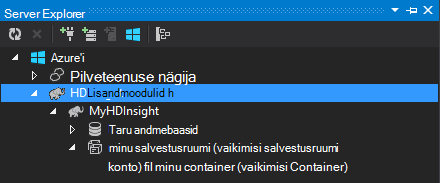
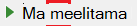

<properties
    pageTitle="Kasutada C# taru ja siga Hadoopi rakenduses Hdinsightiga | Microsoft Azure'i"
    description="Saate teada, kuidas kasutada taru ja Azure Hdinsighti streaming siga C# kasutaja määratletud funktsioonid (UDF)."
    services="hdinsight"
    documentationCenter=""
    authors="Blackmist"
    manager="jhubbard"
    editor="cgronlun"
    tags="azure-portal"/>

<tags
    ms.service="hdinsight"
    ms.workload="big-data"
    ms.tgt_pltfrm="na"
    ms.devlang="dotnet"
    ms.topic="article"
    ms.date="10/28/2016"
    ms.author="larryfr"/>

#C# kasutaja määratletud funktsioonide kasutamine taru ja voogesituse Hadoopi rakenduses Hdinsightiga siga

Taru ja siga on suurepärane Windows Azure Hdinsightiga andmetega töötamine, kuid mõnikord on vaja rohkem üldotstarbeline keel. Nii taru ja siga abil saate helistada välise koodi kasutaja määratletud funktsioonid (UDF) või streaming kaudu.

Selles dokumendis saate teada, kuidas kasutada C# taru ja siga.

##Eeltingimused

* Windows 7 või uuem versioon.

* Visual Studio versioonidega järgmist:

    * Visual Studio 2012 Professional/Premium/Ultimate abil [värskendada 4](http://www.microsoft.com/download/details.aspx?id=39305)

    * Visual Studio 2013 ühenduse/Professional/Premium/Ultimate abil [värskendada 4](https://www.microsoft.com/download/details.aspx?id=44921)

    * Visual Studio 2015

* Hadoopi Hdinsightiga kobar - vt [säte on Hdinsightiga kobar](hdinsight-provision-clusters.md) juhiseid klaster loomiseks

* Hadoopi Tools for Visual Studio. Installimist ja konfigureerimist tööriistade juhised teemast [Hdinsightiga Hadoopi Tools for Visual Studio kasutamise alustamine](hdinsight-hadoop-visual-studio-tools-get-started.md) .

##.NET Hdinsightiga kohta

Windowsi-põhiste Hdinsightiga kogumite vaikimisi installitakse .NET levinud keele runtime (CLR) ja raamistiku. See võimaldab teil C# rakenduste kasutamine taru ja siga streaming (andmed on möödunud taru/siga C# rakenduse kaudu stdout/stdin).

> [AZURE.NOTE] On praegu töötavate Linux-põhine Hdinsightiga kogumite .NET Framework UDF-ID ei toeta. 

##.Net-i ja streaming

Streaming hõlmab taru ja siga kulgevad andmeid mõnda teise programmi üle stdout ja üle stdin tulemuste saamist. C# rakenduste, see on kõige hõlpsalt täita kaudu `Console.ReadLine()` ja `Console.WriteLine()`.

Kuna taru ja siga vaja Käivita_rakendus käitusajal, võib kasutada **Konsooli rakendus** malli C# projektid.

##Taru ja C# 35;

###C# projekti loomine

1. Avage Visual Studio ja looge uus lahendus. Projekti tüüp, valige **Konsooli rakendus**ja **HiveCSharp**uue projekti nime.

2. Asendage sisu **Program.cs** järgmist:

        using System;
        using System.Security.Cryptography;
        using System.Text;
        using System.Threading.Tasks;

        namespace HiveCSharp
        {
            class Program
            {
                static void Main(string[] args)
                {
                    string line;
                    // Read stdin in a loop
                    while ((line = Console.ReadLine()) != null)
                    {
                        // Parse the string, trimming line feeds
                        // and splitting fields at tabs
                        line = line.TrimEnd('\n');
                        string[] field = line.Split('\t');
                        string phoneLabel = field[1] + ' ' + field[2];
                        // Emit new data to stdout, delimited by tabs
                        Console.WriteLine("{0}\t{1}\t{2}", field[0], phoneLabel, GetMD5Hash(phoneLabel));
                    }
                }
                /// 

                /// Returns an MD5 hash for the given string
                /// 

                /// <param name="input">string value</param>
                /// <returns>an MD5 hash</returns>
                static string GetMD5Hash(string input)
                {
                    // Step 1, calculate MD5 hash from input
                    MD5 md5 = System.Security.Cryptography.MD5.Create();
                    byte[] inputBytes = System.Text.Encoding.ASCII.GetBytes(input);
                    byte[] hash = md5.ComputeHash(inputBytes);

                    // Step 2, convert byte array to hex string
                    StringBuilder sb = new StringBuilder();
                    for (int i = 0; i < hash.Length; i++)
                    {
                        sb.Append(hash[i].ToString("x2"));
                    }
                    return sb.ToString();
                }
            }
        }

3. Projekti koostada.

###Salvestusruumi üles laadida

1. Visual Studio, avage **Server Explorer**.

3. Laiendage **Azure**ja seejärel laiendage **Hdinsightiga**.

4. Kui kuvatakse vastav viip, sisestage mandaat Azure'i tellimus ja seejärel klõpsake nuppu **Logi sisse**.

5. Laiendage Hdinsightiga kobar, mida soovite selle rakenduse juurutamine, ja seejärel laiendage **Salvestusruumi vaikekonto**.

    

6. Topeltklõpsake **Vaikimisi Container** klaster. See avatakse uus aken, kus kuvatakse vaikimisi container sisu.

7. Laadi ikooni ja seejärel avage **bin\debug** kaust **HiveCSharp** projekti. Lõpetuseks, valige **HiveCSharp.exe** fail ja klõpsake nuppu **Ok**.

    

8. Kui üleslaadimine on lõpule jõudnud, saab kasutada rakendust taru päringu.

###Taru päring

1. Visual Studio, avage **Server Explorer**.

2. Laiendage **Azure**ja seejärel laiendage **Hdinsightiga**.

5. Paremklõpsake juurutatud **HiveCSharp** rakenduse kobar ja valige **kirjutamine taru päringu**.

6. Taru päringus kasutada järgmist:

        add file wasbs:///HiveCSharp.exe;

        SELECT TRANSFORM (clientid, devicemake, devicemodel)
        USING 'HiveCSharp.exe' AS
        (clientid string, phoneLabel string, phoneHash string)
        FROM hivesampletable
        ORDER BY clientid LIMIT 50;

    See valib selle `clientid`, `devicemake`, ja `devicemodel` väljad alates `hivesampletable`, ja edastab väljad HiveCSharp.exe rakendus. Päringu eeldab, et tagastada kolme väljad, mis salvestatakse rakenduse `clientid`, `phoneLabel`, ja `phoneHash`. Päringu ka eeldab, et leida HiveCSharp.exe vaikimisi salvestusruumi container juurkaustas (`add file wasbs:///HiveCSharp.exe`).

5. Klõpsake nuppu **Edasta** töö Hdinsightiga klaster esitada. Avaneb aken **Taru töö kokkuvõte** .

6. Klõpsake käsku **Värskenda** värskendamiseks kokkuvõttele kuni **Töö** olekuks **lõpule viidud**. Töö väljundi kuvamiseks klõpsake nuppu **Töö väljund**.

##Siga ja C# 35;

###C# projekti loomine

1. Avage Visual Studio ja looge uus lahendus. Projekti tüüp, valige **Konsooli rakendus**ja **PigUDF**uue projekti nime.

2. Asendage **Program.cs** faili sisu järgmist:

        using System;

        namespace PigUDF
        {
            class Program
            {
                static void Main(string[] args)
                {
                    string line;
                    // Read stdin in a loop
                    while ((line = Console.ReadLine()) != null)
                    {
                        // Fix formatting on lines that begin with an exception
                        if(line.StartsWith("java.lang.Exception"))
                        {
                            // Trim the error info off the beginning and add a note to the end of the line
                            line = line.Remove(0, 21) + " - java.lang.Exception";
                        }
                        // Split the fields apart at tab characters
                        string[] field = line.Split('\t');
                        // Put fields back together for writing
                        Console.WriteLine(String.Join("\t",field));
                    }
                }
            }
        }

    See rakendus on sõeluda read, mis on saadetud siga ja vormindada read, mis algavad `java.lang.Exception`.

3. Salvestage **Program.cs**ja seejärel luua projekti.

###Rakenduse üleslaadimine

1. Siga streaming eeldab, et rakendus olema kohalikku kobar failisüsteemis. Luba kaugtöölaud Hdinsightiga kobar ja looge siis veebisaidil [Hdinsightiga kogumite abil RDP ühenduse](hdinsight-administer-use-management-portal.md#rdp)juhiste järgi.

2. Kui ühendus on loodud, Kopeeri **PigUDF.exe** **prügikasti/silumine** kataloogi PigUDF projekti oma kohalikus arvutis ja kleepige see kaust **PIG_HOME %** klaster.

###Kasutage rakenduste Ladina siga

1. Kaugtöölaua seansi, käivitage käsurea Hadoopi **Hadoopi käsurea** ikooni töölaual.

2. Käsurea siga alustamiseks kasutage järgmist:

        cd %PIG_HOME%
        bin\pig

    Esitatakse koos mõne `grunt>` küsimus.

3. Sisestage .NET Framework rakenduse abil saate käivitada lihtsa siga töö järgmist:

        DEFINE streamer `pigudf.exe` SHIP('pigudf.exe');
        LOGS = LOAD 'wasbs:///example/data/sample.log' as (LINE:chararray);
        LOG = FILTER LOGS by LINE is not null;
        DETAILS = STREAM LOG through streamer as (col1, col2, col3, col4, col5);
        DUMP DETAILS;

    Funktsiooni `DEFINE` lause loob pseudonüümi, `streamer` pigudf.exe rakenduste, ja `SHIP` jaotab selle klaster sõlmed üle. Hiljem `streamer` kasutatakse koos selle `STREAM` operaator töötlemine Logi ühe väljundkausta ja andmeid tagastada veergude reana.

> [AZURE.NOTE] Rakenduse nimi, mida kasutatakse streaming peab olema ümbritsetud soovitud \` (backtick) märkide Millal neile tuleks määrata pseudonüümid, ja ' (üksikjutumärk) kasutamisel koos `SHIP`.

3. Kui olete sisestanud Viimane rida, töö peaks algama. Lõpuks see tagasi väljundi umbes järgmine:

        (2012-02-03 20:11:56 SampleClass5 [WARN] problem finding id 1358451042 - java.lang.Exception)
        (2012-02-03 20:11:56 SampleClass5 [DEBUG] detail for id 1976092771)
        (2012-02-03 20:11:56 SampleClass5 [TRACE] verbose detail for id 1317358561)
        (2012-02-03 20:11:56 SampleClass5 [TRACE] verbose detail for id 1737534798)
        (2012-02-03 20:11:56 SampleClass7 [DEBUG] detail for id 1475865947)

##Kokkuvõte

Selles dokumendis on õppinud Hdinsightiga taru ja siga .NET Frameworki rakenduse kasutamise kohta. Kui soovite teada, kuidas kasutada Python taru ja siga, lugege teemat [Kasutada Python taru ja siga Hdinsightile](hdinsight-python.md).

Muul viisil kasutamiseks siga ja taru ja MapReduce kasutamise kohta lisateavet, lugege järgmist:

* [Hdinsightiga taru kasutamine](hdinsight-use-hive.md)

* [Kasutage siga Hdinsightiga](hdinsight-use-pig.md)

* [Hdinsightiga MapReduce kasutamine](hdinsight-use-mapreduce.md)
