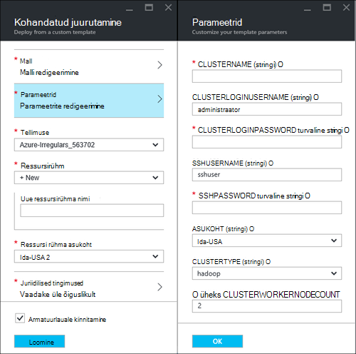
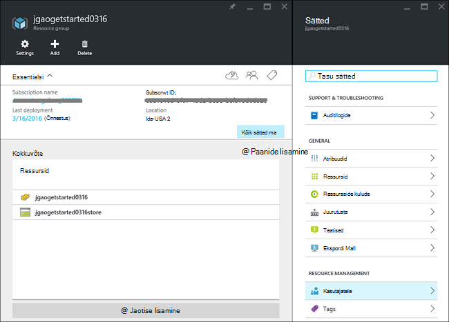
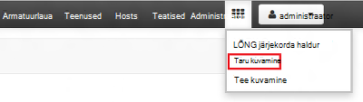
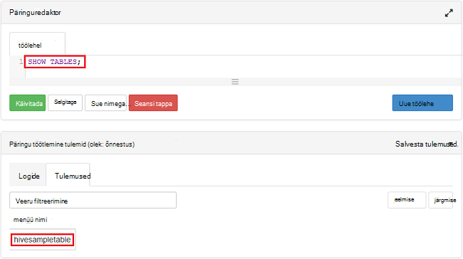

<properties
    pageTitle="Linux õpetus: alustamine Hadoopi ja taru | Microsoft Azure'i"
    description="Järgige Hadoopi kasutamine Hdinsightiga alustamiseks õppeteema Linux. Saate teada, kuidas Linux kogumite ettevalmistamine ja päringu taru andmeid."
    services="hdinsight"
    documentationCenter=""
    authors="mumian"
    manager="jhubbard"
    editor="cgronlun"
    tags="azure-portal"/>

<tags
    ms.service="hdinsight"
    ms.devlang="na"
    ms.topic="hero-article"
    ms.tgt_pltfrm="na"
    ms.workload="big-data"
    ms.date="09/14/2016"
    ms.author="jgao"/>

# Hadoopi õpetus: alustamine Hdinsightiga Linux-põhine Hadoopi kasutamine

> [AZURE.SELECTOR]
- [Linux-põhine](hdinsight-hadoop-linux-tutorial-get-started.md)
- [Windowsi-põhiste](hdinsight-hadoop-tutorial-get-started-windows.md)

Saate teada, Linux-põhine [Hadoopi](http://hadoop.apache.org/) kogumite loomist Hdinsightiga ning käivitamiseks taru töö Hdinsightiga. [Apache taru](https://hive.apache.org/) on kõige populaarsemate Hadoopi ökosüsteemis. Praegu Hdinsightiga kaasas 4 kobar eri tüüpi: [Hadoopi](hdinsight-hadoop-introduction.md), [säde](hdinsight-apache-spark-overview.md), [HBase](hdinsight-hbase-overview.md) ja [Storm](hdinsight-storm-overview.md).  Kindlat tüüpi kobar toetab erinevate osade kogum. Kõik 4 kobar toeta taru. Toetatud komponendid Hdinsightiga loendi leiate teemast [mis on uut rakenduses Hadoopi kobar versioonide pakutavast Hdinsightiga?](hdinsight-component-versioning.md)  

[AZURE.INCLUDE [delete-cluster-warning](../../includes/hdinsight-delete-cluster-warning.md)]

## Eeltingimused

Enne alustamist selles õpetuses, peab teil olema:

- **Azure'i tellimus**: [azure.microsoft.com/free](https://azure.microsoft.com/free)sirvides ühe kuu tasuta prooviversiooni konto loomiseks.

### Accessi kontrolli nõuded

[AZURE.INCLUDE [access-control](../../includes/hdinsight-access-control-requirements.md)]

## Looge kobar

Enamik Hadoopi tööd on pakett-tööde. Loote klaster, käivitage mõned tööd ja seejärel kustutage klaster. Selles jaotises loote Linux-põhine Hadoopi kobar Hdinsightiga [Azure ressursihaldur malli](../resource-group-template-deploy.md)abil sisse. Ressursihaldur mall on täielikult kohandatavat; See muudab lihtne luua Azure Hdinsightiga nagu ressursid. Ressursihaldur malli kogemus pole vaja pärast selle õpetuse. Muud kobar loomine ja selle õpetuse kasutatakse atribuutide mõistmine leiate teemast [loomine Hdinsightiga kogumite](hdinsight-hadoop-provision-linux-clusters.md). Selles õpetuses ressursihaldur malli asub [https://hditutorialdata.blob.core.windows.net/armtemplates/create-linux-based-hadoop-cluster-in-hdinsight.json](https://hditutorialdata.blob.core.windows.net/armtemplates/create-linux-based-hadoop-cluster-in-hdinsight.json)avaliku bloobimälu ümbrises. 

1. Klõpsake järgmisel pildil Azure'i sisse logida ja avage Mall, ressursihaldur Azure'i portaalis. 

    

2. Keelest **Parameetrid** sisestage järgmine:

    .

    - **ClusterName**: sisestage Hadoopi kobar loodava nimi.
    - **Kobar kasutajanime ja parooli**: login vaikenimi on **administraator**.
    - **SSH kasutajanimi ja parool**: vaikimisi kasutajanimi on **sshuser**.  Saate selle ümber nimetada. 
    
    Muud parameetrid on valikuline pärast selle õpetuse. Kui need on, võite need jätta. 
    
    Iga kobar on Azure'i bloobimälu salvestusruumi konto sõltuvus. See on tavaliselt nimetatud vaikekonto salvestusruumi. Hdinsightiga kobar ja selle salvestusruumi vaikekonto asuma koostööd Azure piirkonna. Kogumite kustutamisel ei kustutata salvestusruumi konto. Malli, kuvatakse vaikimisi salvestusruumikonto nimi määratletakse kobar nime "store" lisatud. 
    
3. Klõpsake nuppu parameetrid salvestamiseks nuppu **OK** .
4. **Kohandatud juurutus** keelest, sisestage **uue ressursirühma nimi** uue ressursirühma loomiseks.  Ressursirühma on ümbris, mis pakuvad klaster, sõltuvad salvestusruumi konto ja muu. Ressursi rühma asukoht võib olla erinev kobar asukohast.
5. Klõpsake **õiguslikult**ja seejärel klõpsake nuppu **Loo**.
6. Veenduge, et **PIN-koodi armatuurlaud** ruut oleks märgitud, ja seejärel klõpsake nuppu **Loo**. Teile kuvatakse uue nimega **malli juurutamine juurutamise**paani. Kulub umbes 20 minutit klaster loomiseks. 
7.  Kui klaster on loodud, muudetakse paani pealdis määratud ressursi rühma nime. Ja portaali avab automaatselt kaks noad klaster ja kobar sätted. 

    .

    On kaks ressursse, mis on loetletud, klaster ja salvestusruumi vaikekonto.

##Taru päringute sooritamine

[Apache taru](hdinsight-use-hive.md) on kõige populaarsemate Hdinsightiga kasutada. Seal on palju võimalusi käivitamiseks taru töö Hdinsightiga. Selles õpetuses kasutate Ambari taru vaate portaalist käivitamiseks mõned taru tööd. Muid viise taru töökohtade esitamise, leiate teemast [Kasutamine taru Hdinsightiga sisse](hdinsight-use-hive.md).

1. Liikuge sirvides **https://&lt;ClusterName >. azurehdinsight.net**, kus &lt;ClusterName > klaster on loodud eelmises jaotises Ambari avamiseks.
2. Sisestage Hadoopi kasutajanimi ja parool, mille määrasite eelmises jaotises. Vaikimisi kasutajanimi on **administraator**.
3. Avage **Taru vaade** , nagu on näidatud järgmine pilt:

    .
4. Lehe jaotises __Päringuredaktori__ kleepige töölehe HiveQL järgmistest:

        SHOW TABLES;

    >[AZURE.NOTE] Semikoolon nõutud taru.       
        
5. Klõpsake __käivitada__. Jaotise __Päringutulemite protsess__ peaks Päringuredaktori all kuvatakse ja kuvada teavet töö. 

    Kui päring on lõpule jõudnud, kuvatakse __Protsessi päringutulemite__ jaotise toimingu tulemusi. Näete peab nimetatakse **hivesampletable**ühest tabelist. Selle näidistabeli taru kaasas Hdinsightiga rühmad.

    .

6. Korrake toiminguid 4 ja 5 käivitamiseks järgmist päringut:

        SELECT * FROM hivesampletable;

    > [AZURE.TIP] Märkmete __salvestamine tulemid__ __Päringutulemite protsessi__ jaotise vasakus ülanurgas ripploend Saate selle tulemused alla laadida või neid Hdinsightiga salvestusruumi CSV-failina salvestada.

7. Klõpsake nuppu **ajalugu** , et tööde nimekirja.

Kui olete lõpetanud taru töö, saate [ekspordi tulemused SQL Azure'i andmebaasi või SQL serveri andmebaasi](hdinsight-use-sqoop-mac-linux.md), saate ka [Exceli kasutamise tulemused visualiseerida](hdinsight-connect-excel-power-query.md). Taru rakenduses Hdinsightiga kasutamise kohta lisateabe saamiseks vt [kasutamine taru ja HiveQL koos Hadoopi rakenduses HDInsight näidisfaili Apache log4j analüüsimiseks](hdinsight-use-hive.md).

##Õpetuse puhastamiseks

Kui olete õpetuse, võite klaster kustutamine. Hdinsightiga, kus teie andmed on salvestatud Azure Storage, nii, et saate turvaline kustutada klaster, kui seda ei kasuta. Saate ka ostmisega on Hdinsightiga kobar isegi siis, kui seda ei kasuta. Kuna kulude klaster jaoks on mitu korda rohkem mäluruumi kui, on mõistlik economic kustutamiseks kogumite, kui nad ei kasuta. 

>[AZURE.NOTE] [Azure'i andmed Factory](hdinsight-hadoop-create-linux-clusters-adf.md)abil saate luua Hdinsightiga kogumite nõudmisel ja TimeToLive sätet kustutamiseks rühmad automaatselt konfigureerida. 

**Klaster ja/või vaikekonto salvestusruumi kustutamine**

1. [Azure'i portaali](https://portal.azure.com)sisse logida.
2. Portaali armatuurlaual, klõpsake paani saate kasutada, kui olete loonud klaster ressursi rühma nime.
3. Klõpsake nuppu **Kustuta** ressursi enne kustutamiseks ressursirühm, mis sisaldab klaster ja vaikekonto salvestusruumi; või klõpsake paani **ressursid** kobar nime ja klõpsake **Kustuta** kobar enne. Pange tähele, et ressursirühma kustutamisel kustutatakse salvestusruumi konto. Kui te ei soovi säilitada salvestusruumi konto, valige ainult klaster kustutamiseks.

## Järgmised sammud

Selles õpetuses õppinud Linux-põhine Hdinsightiga klaster ressursihaldur malli abil loomise ja tavaline taru päringute sooritamiseks.

Lisateavet Hdinsightiga andmete analüüsimine, leiate järgmistest:

- Hdinsightiga taru kasutamise kohta lisateabe saamiseks taru päringute sooritamiseks Visual Studio, sh näha, [Kasutage taru koos Hdinsightiga][hdinsight-use-hive].

- Siga kohta lisateabe saamiseks vt keel, mida kasutatakse muuta andmete [Kasutamine siga Hdinsightiga][hdinsight-use-pig].

- MapReduce kohta lisateabe saamiseks vt võimalus kirjutada programme, mis töödelda andmeid Hadoopi, [Kasutamine MapReduce koos Hdinsightile][hdinsight-use-mapreduce].

- Hdinsightile Tools for Visual Studio analüüsimiseks Hdinsightiga kasutamise kohta leiate teemast [Visual Studio Hadoopi tööriistad Hdinsightiga kasutamise alustamine](hdinsight-hadoop-visual-studio-tools-get-started.md).

Kui olete valmis alustada tööd oma andmeid ja teil on vaja rohkem teada, kuidas Hdinsightiga talletab andmete või andmeid tuua Hdinsightiga kohta, vaadake järgmist.

- Kohta, kuidas Hdinsightiga kasutab Azure'i bloobimälu Lisateavet [kasutamine Azure'i bloobimälu Hdinsightiga](hdinsight-hadoop-use-blob-storage.md).

- Andmete üleslaadimiseks Hdinsightiga kohta teabe saamiseks leiate [üles laadida Hdinsightiga andmeid][hdinsight-upload-data].

Kui soovite lisateavet loomine ja haldamine on Hdinsightiga kobar, vaadake järgmist.

- Klaster Linux-põhine Hdinsightiga haldamise kohta leiate teemast [haldamine Hdinsightiga kogumite Ambari abil](hdinsight-hadoop-manage-ambari.md).

- Suvandi saate valida mõne Hdinsightiga kobar loomisel kohta lisateabe saamiseks lugege teemat [Loomise Hdinsightiga Linux kohandatud suvandite abil](hdinsight-hadoop-provision-linux-clusters.md).

- Kui tuttavaid Linux ja Hadoopi, kuid soovite leida üksikasjad on Hdinsightiga Hadoopi kohta, vt [töötamine Hdinsightiga Linux](hdinsight-hadoop-linux-information.md). Näiteks saate seda teavet.

    * URL-id teenuste majutatud kobar, nt Ambari ja WebHCat
    * Hadoopi failide ja näited kohaliku failisüsteemi asukoht
    * Kasutamine, Azure'i salvestusruumi (WASB) asemel HDFS vaikimisi andmete talletamine

[1]: ../HDInsight/hdinsight-hadoop-visual-studio-tools-get-started.md

[hdinsight-provision]: hdinsight-provision-clusters.md
[hdinsight-admin-powershell]: hdinsight-administer-use-powershell.md
[hdinsight-upload-data]: hdinsight-upload-data.md
[hdinsight-use-mapreduce]: hdinsight-use-mapreduce.md
[hdinsight-use-hive]: hdinsight-use-hive.md
[hdinsight-use-pig]: hdinsight-use-pig.md

[powershell-download]: http://go.microsoft.com/fwlink/p/?linkid=320376&clcid=0x409
[powershell-install-configure]: powershell-install-configure.md
[powershell-open]: powershell-install-configure.md#Install

[img-hdi-dashboard]: ./media/hdinsight-hadoop-tutorial-get-started-windows/HDI.dashboard.png
[img-hdi-dashboard-query-select]: ./media/hdinsight-hadoop-tutorial-get-started-windows/HDI.dashboard.query.select.png
[img-hdi-dashboard-query-select-result]: ./media/hdinsight-hadoop-tutorial-get-started-windows/HDI.dashboard.query.select.result.png
[img-hdi-dashboard-query-select-result-output]: ./media/hdinsight-hadoop-tutorial-get-started-windows/HDI.dashboard.query.select.result.output.png
[img-hdi-dashboard-query-browse-output]: ./media/hdinsight-hadoop-tutorial-get-started-windows/HDI.dashboard.query.browse.output.png
[image-hdi-clusterstatus]: ./media/hdinsight-hadoop-tutorial-get-started-windows/HDI.ClusterStatus.png
[image-hdi-gettingstarted-powerquery-importdata]: ./media/hdinsight-hadoop-tutorial-get-started-windows/HDI.GettingStarted.PowerQuery.ImportData.png
[image-hdi-gettingstarted-powerquery-importdata2]: ./media/hdinsight-hadoop-tutorial-get-started-windows/HDI.GettingStarted.PowerQuery.ImportData2.png
