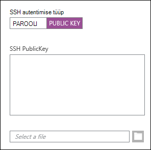
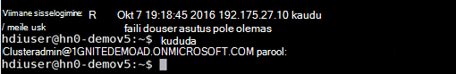
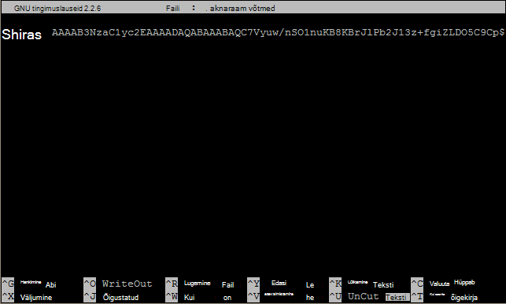

<properties
   pageTitle="SSH abil kasutada Linux, Unix või OS X Linux-põhine Hadoop | Microsoft Azure"
   description=" Pääsete Linuxi-põhiste konkreetne Secure Shell (SSH) abil. Käesolevas dokumendis esitatakse teave kasutades SSH konkreetne Linux, Unix või OS X kliendid."
   services="hdinsight"
   documentationCenter=""
   authors="Blackmist"
   manager="jhubbard"
   editor="cgronlun"
    tags="azure-portal"/>

<tags
   ms.service="hdinsight"
   ms.devlang="na"
   ms.topic="get-started-article"
   ms.tgt_pltfrm="na"
   ms.workload="big-data"
   ms.date="09/13/2016"
   ms.author="larryfr"/>

#<a name="use-ssh-with-linux-based-hadoop-on-hdinsight-from-linux-unix-or-os-x"></a>Kasutada SSH Linuxi-põhiste Hadoopi konkreetne Linux, Unix või OS X

> [AZURE.SELECTOR]
- [Windows](hdinsight-hadoop-linux-use-ssh-windows.md)
- [Linux, Unix, OS X](hdinsight-hadoop-linux-use-ssh-unix.md)

[Secure Shell (SSH)](https://en.wikipedia.org/wiki/Secure_Shell) võimaldab teil eemalt toiminguid oma Linuxi-põhiste konkreetne klastrite kasutades käsurea liides. Käesolevas dokumendis esitatakse teave kasutades SSH konkreetne Linux, Unix või OS X kliendid.

> [AZURE.NOTE] Käesoleva artikli juhised Oletagem, et kasutate Linux, Unix või OS X klient. Järgmiselt võib teha Windowsi-põhine klientrakendus on installitud pakett, mis annab `ssh` ja `ssh-keygen`, näiteks [Bash Ubuntu Windows](https://msdn.microsoft.com/commandline/wsl/about).
>
> Kui teil pole installitud teie Windowsi-põhine klientrakendus SSH, järgige [Kasutada SSH koos Linux-põhine konkreetne (Hadoop) Windows](hdinsight-hadoop-linux-use-ssh-windows.md) ja kitt kasutusjuhiste saamiseks.

##<a name="prerequisites"></a>Eeltingimused

* **SSH-keygen** ja **ssh** Linux, UNIX-i ja OS X jaoks. See utilities pakutakse tavaliselt koos teie operatsioonisüsteemi või kättesaadavaks pakettide süsteem.

* Kaasaegne veebibrauser, mis toetab HTML5.

VÕI

* [Azure'i CLI](../xplat-cli-install.md).

    [AZURE.INCLUDE [use-latest-version](../../includes/hdinsight-use-latest-cli.md)] 

##<a name="what-is-ssh"></a>Mis on SSH?

SSH on utiliit, ja eemalt sisselogimine täidesaatva, käsud kaugserverisse. Koos Linux-põhine konkreetne SSH kehtestatakse krüptitud ühendus klastri headnode ning luuakse käsureal, et te kasutate käsud. Käsud on täidetud siis otse serveris.

###<a name="ssh-user-name"></a>SSH kasutajanimi

SSH kasutajanimi on nimi, mida kasutate autentimiseks konkreetne klaster. SSH kasutajanimi määrates klastri loomisel luuakse see kasutaja kõik klastri sõlme. Kui klaster on loodud, saate selle kasutajanime konkreetne klastri headnodes ühenduse loomiseks. Alates headnodes, saate ühendada töötaja sõlmed.

###<a name="ssh-password-or-public-key"></a>SSH parooli või avalik võti

SSH kasutaja saate parooli või avaliku võtme autentimist. Parool on lihtsalt tekstistringi moodustavad, kuigi avalik võti on loodud unikaalselt identifitseerima sind paari osa.

Võti on turvalisem kui parooli, kuid see nõuab täiendavaid samme võtme genereerimiseks ja peate hoidma failid võtit turvalises kohas. Kui keegi saab juurdepääsu võtme faili, nad saavad juurdepääsu teie kontole. Või kui sa kaotad võtme faili, sa ei saa oma kontosse sisse logida.

Võti paari koosneb avalik võti (mis konkreetne kasutus) ja privaatvõtit (mida hoitakse kliendi masin.) Konkreetne kasutus kasutades SSH ühendamisel kasutab SSH kliendi isikliku võtme masin autentimiseks server.

##<a name="create-an-ssh-key"></a>Luua SSH võti

Kasutage järgmist teavet, kui te kavatsete kasutada SSH abil koos oma klastri. Kui te kavatsete kasutada parooli, saate te selle sammu vahele.

1. Terminali seansi avamine ja kui teil on mis tahes olemasolevate SSH abil kasutage järgmist käsku:

        ls -al ~/.ssh

    Otsige järgmised failid kataloogis. Need on levinud nimed avaliku SSH abil.

    * ID\_dsa.pub
    * ID\_ecdsa.pub
    * ID\_ed25519.pub
    * ID\_rsa.pub

2. Kui te ei soovi kasutada olemasoleva faili või ei ole olemasolevad SSH võtit, järgmine abil luua uue faili:

        ssh-keygen -t rsa

    Küsitakse jaoks järgmine teave:

    * Faili asukoht - asukoht on vaikimisi ~/.ssh/id\_rsa.
    * Parool - a teil palutakse uuesti sisestada see.

        > [AZURE.NOTE] Soovitame kasutada ka turvalise parooli võti. Aga kui unustasite parooli, ei saa kuidagi seda tagasi.

    Kui käsk on lõppenud, teil on kahe uue faili, privaatvõtit (näiteks **id\_rsa**) ja avalikku võtit (näiteks **id\_rsa.pub**).

##<a name="create-a-linux-based-hdinsight-cluster"></a>Konkreetne Linuxi põhises klastri loomine

Konkreetne Linuxi põhises klastri loomisel peate määrama varem loodud avaliku võtme. Linux, Unix või OS X kliendid on konkreetne klastri loomiseks kahte võimalust:

* **Azure portaali** - kasutab veebipõhine portaal luua klastri.

* **Mac, Linux ja Windows azure CLI** - kasutab käsurea käsud klastri loomiseks.

Eri viiside eeldab parooli või avalikku võtit. Täielik Linuxi-põhiste konkreetne klastri loomise kohta lisateavet [sätte Linuxi-põhiste konkreetne klastrite](hdinsight-hadoop-provision-linux-clusters.md).

###<a name="azure-portal"></a>Azure'i portaal

Kasutades [Azure portaali] [ preview-portal] konkreetne Linuxi põhises klastri loomiseks peate sisestama **SSH kasutajanimi**ja sisestage **parool** või **SSH avalik võti**.

Kui valite **SSH avalik võti**, te saate __SSH PublicKey__ väljale kleepida avalik võti ( **Pub** -laiendiga fail sisaldab) või valige, __Valige faili__ sirvida ja valida avaliku võtme faili.



> [AZURE.NOTE] Võtmefail on lihtsalt tekstifaili. Sisu tuleks kuvada järgmise sisuga:
> ```
ssh-rsa AAAAB3NzaC1yc2EAAAADAQABAAABAQCelfkjrpYHYiks4TM+r1LVsTYQ4jAXXGeOAF9Vv/KGz90pgMk3VRJk4PEUSELfXKxP3NtsVwLVPN1l09utI/tKHQ6WL3qy89WVVVLiwzL7tfJ2B08Gmcw8mC/YoieT/YG+4I4oAgPEmim+6/F9S0lU2I2CuFBX9JzauX8n1Y9kWzTARST+ERx2hysyA5ObLv97Xe4C2CQvGE01LGAXkw2ffP9vI+emUM+VeYrf0q3w/b1o/COKbFVZ2IpEcJ8G2SLlNsHWXofWhOKQRi64TMxT7LLoohD61q2aWNKdaE4oQdiuo8TGnt4zWLEPjzjIYIEIZGk00HiQD+KCB5pxoVtp user@system
> ```

See loob Logi sisse selle kasutaja, parool või pakute avalik võti.

###<a name="azure-command-line-interface-for-mac-linux-and-windows"></a>Azure'i käsurealiidesega Windows, Mac ja Linux

[Mac, Linux ja Windows Azure CLI](../xplat-cli-install.md) abil saate luua uus klastri abil on `azure hdinsight cluster create` käsk.

Selle käsu kohta lisateabe saamiseks vt [sätte Hadoop Linux klastrite konkreetne kohandatud valikuid kasutades](hdinsight-hadoop-provision-linux-clusters.md).

##<a name="connect-to-a-linux-based-hdinsight-cluster"></a>Ühendada konkreetne Linuxi põhises klastri

Terminali seansist, kasutage ühendamiseks klastri headnode sisestada aadress ja kasutaja nime SSH käsk:

* **SSH aadress** - on kaks aadressid, mida klastri kasutades SSH ühenduse loomiseks võib kasutada:

    * **Ühenda selle headnode**: klastri nimi, millele järgneb **-ssh.azurehdinsight.net**. Näiteks **mycluster-ssh.azurehdinsight.net**.
    
    * **Ühenda edge sõlm**: kui teie klastri on konkreetne R Server, klaster sisaldab serva sõlm, mida saab kasutada **RServer.CLUSTERNAME.ssh.azurehdinsight.net**, kus __CLUSTERNAME__ on klastri nimi.

* **Kasutajanimi** - The SSH kasutajanimi andsite klastri loomisel.

Järgmine näide loob ühenduse esmase headnode **mycluster** kui ka kasutaja **mulle**:

    ssh me@mycluster-ssh.azurehdinsight.net

Kui kasutasite kasutajakonto parooli, palutakse teil sisestada parool.

Kui kasutasite SSH võti, mis on kaitstud parooli, palutakse teil sisestada parool. Vastasel juhul SSH proovib automaatselt autentida kasutades ühte kohaliku privaatvõtmete oma klienti.

> [AZURE.NOTE] Kui SSH automaatselt Sisenen õige privaatvõti, kasutage parameetrit **-i** ja Määrake privaatvõtme tee. Järgmises näites laeb privaatvõti: `~/.ssh/id_rsa`:
>
> `ssh -i ~/.ssh/id_rsa me@mycluster-ssh.azurehdinsight.net`

Kui ühendate kasutades aadress on headnode ja porti pole määratud, vaikimisi SSH port 22, mis loob ühenduse konkreetne klastri esmane headnode. Kui kasutate port 23, loote teisesesse. Selle headnodes kohta lisateabe saamiseks vaadake [kättesaadavus ja usaldusväärsus Hadoop klastrite konkreetne](hdinsight-high-availability-linux.md).

###<a name="connect-to-worker-nodes"></a>Töötaja sõlmede loomiseks

Töötaja sõlmede ei ole otsest juurdepääsu alates Azure'i datacenter väljaspool, kuid pääseb klastri headnode kaudu SSH.

SSH võti kasutamisel autentimiseks kasutaja konto peate täitke järgmised juhised oma klienti:

1. Avada tekstiredaktoris, `~/.ssh/config`. Kui seda faili pole olemas, saate selle luua sisestades `touch ~/.ssh/config` terminalis.

2. Lisage faili järgmine. Asenda *CLUSTERNAME* oma konkreetne klastri nimi.

        Host CLUSTERNAME-ssh.azurehdinsight.net
          ForwardAgent yes

    See konfigureerib SSH agent suunamise eest konkreetne klastri.

3. Test SSH agent edastamine terminalist järgmise käsuga:

        echo "$SSH_AUTH_SOCK"

    See peaks tagasi teavet järgmise sisuga:

        /tmp/ssh-rfSUL1ldCldQ/agent.1792

    Kui midagi ei tagastata, näitab see, et **ssh-agent** ei tööta. Võtke ühendust oma arvuti opsüsteemi dokumentatsioonist konkreetseid juhiseid installimise ja konfigureerimise **ssh-agent**või kasutab [ssh-agent ssh](http://mah.everybody.org/docs/ssh).

4. Kui olete veendunud, et **ssh-agent** töötab, Kasuta järgmisi lisada privaatvõtme SSH agent:

        ssh-add ~/.ssh/id_rsa

    Kui teie isiklik võti asub eri faili, asendada `~/.ssh/id_rsa` faili asukoht.

Töötaja sõlmede oma klastri loomiseks toimige järgmiselt.

> [AZURE.IMPORTANT] SSH võti kasutamisel autentida oma konto peate täitma eelmisi samme, et agent edastab töötamise kontrollimiseks.

1. Ühendust konkreetne klastri abil SSH, nagu eespool kirjeldatud.

2. Kui olete ühendatud, kasutage järgmist kuvamiseks oma klastri sõlmed. Asenda *ADMINPASSWORD* oma klastri administraatori konto parooli. Asenda *CLUSTERNAME* oma klastri nimi.

        curl --user admin:ADMINPASSWORD https://CLUSTERNAME.azurehdinsight.net/api/v1/hosts

    Teave taastatakse JSON formaadis sõlmedele klastri, sh `host_name`, mis sisaldab täielikult kvalifitseeritud domeeni nimi (FQDN) iga sõlme. Järgnev on näide on `host_name` tagastatud **curl** käsku kanne:

        "host_name" : "workernode0.workernode-0-e2f35e63355b4f15a31c460b6d4e1230.j1.internal.cloudapp.net"

3. Kui soovite ühenduse luua, kasutage järgmist käsku SSH seansist serveriga ühenduse loomine töötaja sõlme töötaja sõlmede loetelu:

        ssh USERNAME@FQDN

    Sisesta *kasutajanimi* SSH kasutajanimi ja *FQDN* koos FQDN töötaja sõlme. Näiteks `workernode0.workernode-0-e2f35e63355b4f15a31c460b6d4e1230.j1.internal.cloudapp.net`.

    > [AZURE.NOTE] Kui kasutate parooli autentimine SSH seansist küsitakse uuesti parooli sisestama. SSH võti kasutamisel peaksid ühenduse lõpetada ilma üle küsimata.

4. Kui seanss on kindlaks tehtud, terminali viip muutub `username@hn#-clustername` et `username@wk#-clustername` näitamaks, et teil on ühendus töötaja sõlme. Kõik käsud käivitada sel hetkel töötab töötaja sõlme.

4. Pärast lõpetamist on töötaja sõlme toimingute sooritamist, kasutage selle `exit` käsu, et töötaja sõlme. See toob teil selle `username@hn#-clustername` kiire.

## <a name="connect-to-a-domain-joined-hdinsight-cluster"></a>Ühendamine domeeniga liitunud konkreetne klastri

[Domeeniga liitunud konkreetne](hdinsight-domain-joined-introduction.md) ühendab Kerberose Hadoop konkreetne. Sest SSH kasutaja pole aktiivne Direcotry domeeni kasutaja, selle kasutajakonto ei saa käivitada Hadoop käsud SSH shell domeeniga liitunud klastri otse. *Kinit* peate esmalt käivitama. 

**Domeeniga liitunud konkreetne kobarasse, kasutades SSH päringute käivitamiseks taru**

1. Ühendust domeeniga liitunud konkreetne klastri SSH abil.  Instrocutions, teemast [ühendamine Linux-põhine konkreetne klastri](#connect-to-a-linux-based-hdinsight-cluster).
2. Käivitage kinit. Ta küsib domeeni kasutajanimi ja domeeni kasutaja parooli. Rohkem infot konfigureerida domeeni kasutajad domeeni-ühendatud konkreetne klastrite, vt [HDInisight konfigureerida domeeni-ühendatud klastrid](hdinsight-domain-joined-configure.md).

    
3. Avatud taru konsool sisestada:

        hive

    Seejärel käivitada taru käske.

##<a name="add-more-accounts"></a>Lisada veel kontosid

1. Luua uue avaliku võtme ja privaatvõtme uue kasutajakonto [loomine SSH võti](#create-an-ssh-key-optional) kirjeldatud.

    > [AZURE.NOTE] Isikliku võtme tuleks luua kas klient, kus kasutaja kasutab klastri loomiseks või kindlalt üle sellise kliendi pärast loomist.

1. SSH seanss klaster, Lisa uus kasutaja järgmise käsu:

        sudo adduser --disabled-password <username>

    See loob uue kasutajakonto, kuid keelab parool autentimist.

2. Loo kataloogi ja faili hoidke kasutades järgmisi käske:

        sudo mkdir -p /home/<username>/.ssh
        sudo touch /home/<username>/.ssh/authorized_keys
        sudo nano /home/<username>/.ssh/authorized_keys

3. Nano toimetaja avanedes Kopeeri ja kleebi sisu avalik võti uue kasutajakonto. Kasutage **Ctrl-X** salvestage fail ja sulgege toimetaja.

    

4. Uue kasutajakonto .ssh kausta ja sisu muutmiseks kasutage järgmist käsku:

        sudo chown -hR <username>:<username> /home/<username>/.ssh

5. Nüüd peaks saama autentimiseks server uue kasutajakonto ja privaatvõti.

##<a id="tunnel"></a>SSH tunneling

SSH tunneli kohalike taotluste, nagu web nõuab konkreetne klaster kasutamist. Taotluse seejärel suunatakse taotletud ressurss, kui ta oli pärineb konkreetne klastri headnode.

> [AZURE.IMPORTANT] SSH tunnel on veebile UI teatud Hadoop teenuste puhul. Näiteks töö ajalugu Kasutajaliidese või ressursihaldur UI saab tutvuda kasutades SSH tunnel.

Loomise ja SSH tunneli kasutamise kohta lisateabe saamiseks vt [kasutamine SSH Tunneling Ambari web UI, ResourceManager, JobHistory, NameNode, Oozie, ja muud web UI's](hdinsight-linux-ambari-ssh-tunnel.md).

##<a name="next-steps"></a>Järgmised sammud

Nüüd, kui oskate autendiks SSH võti, Õpi kasutama MapReduce Hadoopi konkreetne.

* [Kasutada taru konkreetne](hdinsight-use-hive.md)

* [Kasutada siga konkreetne](hdinsight-use-pig.md)

* [Kasutada MapReduce töökohti konkreetne](hdinsight-use-mapreduce.md)

[preview-portal]: https://portal.azure.com/
