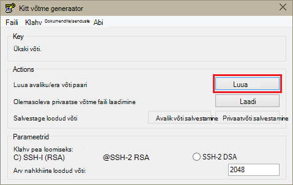

<properties
   pageTitle="SSH klahvide abil Hadoopi kasutamine Linux-põhine kogumite Windows | Microsoft Azure'i"
   description="Saate teada, kuidas luua ja Linux-põhine Hdinsightiga kogumite autentida SSH nooleklahvide abil. Ühendage kogumite Windowsi-põhiste kliendid PuTTY SSH kliendi abil."
   services="hdinsight"
   documentationCenter=""
   authors="Blackmist"
   manager="jhubbard"
   editor="cgronlun"
    tags="azure-portal"/>

<tags
   ms.service="hdinsight"
   ms.devlang="na"
   ms.topic="get-started-article"
   ms.tgt_pltfrm="na"
   ms.workload="big-data"
   ms.date="08/30/2016"
   ms.author="larryfr"/>

#Kasutada SSH Linux-põhine Hadoopi Windows Hdinsightiga

> [AZURE.SELECTOR]
- [Windows](hdinsight-hadoop-linux-use-ssh-windows.md)
- [Linux, Unix, OS X](hdinsight-hadoop-linux-use-ssh-unix.md)

[Secure Shell (SSH)](https://en.wikipedia.org/wiki/Secure_Shell) võimaldab teil eemalt toiminguid oma Linuxi-põhiste Hdinsightiga kogumite käsurea liidest kasutades. Selle dokumendi annab teavet ühenduse Hdinsightiga Windowsi-põhiste kliendid PuTTY SSH kliendi abil.

> [AZURE.NOTE] Selle artikli juhistes kasutate mõnda muud klienti Windowsi-põhiste. Kui kasutate mõnda muud klienti Linux, Unix või OS X, lugege teemat [Kasutamine SSH koos Linux-põhine Hadoopi Hdinsightiga Linux, Unix, või OS X](hdinsight-hadoop-linux-use-ssh-unix.md).
>
> Kui teil on Windows 10 ja kasutate [Windows Ubuntu Bash](https://msdn.microsoft.com/commandline/wsl/about), siis saate juhiseid dokumendis [Kasutada SSH koos Linux-põhine Hadoopi Hdinsightiga Linux, Unix, või OS X](hdinsight-hadoop-linux-use-ssh-unix.md) .

##Eeltingimused

* **Kitt** ja **PuTTYGen** Windowsi-põhise klientidele. Need Utiliidid on saadaval [http://www.chiark.greenend.org.uk/~sgtatham/putty/download.html](http://www.chiark.greenend.org.uk/~sgtatham/putty/download.html).

* Tänapäevane veebibrauseri, mis toetab HTML5.

VÕI

* [Azure'i CLI](../xplat-cli-install.md).

    [AZURE.INCLUDE [use-latest-version](../../includes/hdinsight-use-latest-cli.md)] 

##Mis on SSH?

SSH on kasuliku jaoks, ja eemalt logimine käivitamisel, kaugserverisse käske. Linux-põhine Hdinsightiga, SSH kobar pea sõlme krüptitud ühendus luuakse ja pakub käsk rida, mis on tippige käskude abil. Siis täidetakse käsud otse serveris.

###SSH kasutajanimi

Mõne SSH kasutaja nimi on nimi, mida kasutate Hdinsightiga klaster autentida. Kui määrate kobar loomise ajal kuvatakse SSH kasutajanimi, luuakse selle kasutaja kõik sõlmed klaster. Kui klaster on loodud, saate selle kasutaja nimi ühenduse Hdinsightiga kobar pea sõlmed. Pea sõlmed kaudu saate ühendada töötaja sõlmed.

###SSH parooli või avalik võti

SSH rakendust saate kasutada parooli või avalik võti autentimist. Parool on lihtsalt tekstistring teete, kuigi avalik võti on kordumatult tuvastada teie loodud paari osa.

Klahvi on parooli turvalisemaks, aga see nõuab lisatoimingud genereerida võti ja haldate faile, mis sisaldavad võti turvalises asukohas. Kui keegi saab juurdepääsu võtme faili, nad juurde pääseda oma konto. Või võtme faili unustamisel ei saa te oma kontosse sisse logida.

Võti paari koosneb avalik võti (mis on saadetud Hdinsightiga server) ja privaatvõti (mis on hoida oma klientarvutis.) Kui loote ühenduse Hdinsightiga serveriga SSH abil, kasutatakse SSH kliendi privaatvõti teie arvutis autentida serveriga.

##Saate luua ka SSH võti

Kui kavatsete koos klaster SSH klahvide abil, kasutage järgmist teavet. Kui kavatsete kasutada parooli, saate selle jaotise vahele jätta.

1. Avage PuTTYGen.

2. **Võti genereerida tüüp**, valige **SSH-2 RSA**ja seejärel klõpsake nuppu **Loo**.

    

3. Viige hiirekursor all riba edenemine, kuni riba täidab. Hiir genereeritud juhusliku võtme genereerimiseks kasutatav andmete.

    

    Kui võti on loodud, kuvatakse avalik võti.

4. Turvalisuse lisamiseks saate sisestage **võtme parool** väljale parool ja seejärel tippige väljale **parooli kinnitus** sama väärtuse.

    

    > [AZURE.NOTE] Soovitame kasutada turvalist parooli võti. Aga kui unustate parool, on kuidagi seda taastada.

5. Klõpsake nuppu **Salvesta privaatvõti** võti **.ppk** faili salvestada. Selle klahvi kasutatakse klaster Linux-põhine Hdinsightiga autentimiseks.

    > [AZURE.NOTE] Talletage see võti turvalises asukohas, nagu seda saab kasutada juurdepääsuks klaster Linux-põhine Hdinsightiga.

6. Klõpsake nuppu **Salvesta avalik võti** võti **.txt** failina salvestada. See võimaldab teil avalik võti loomisel täiendavate Linux-põhine Hdinsightiga kogumite edaspidi uuesti kasutada.

    > [AZURE.NOTE] Avalik võti kuvatakse ka PuTTYGen ülaosas. Saate Paremklõpsake selle välja, väärtus kopeerida ja kleepida selle vormi loomisel klaster Azure'i portaalis.

##Looge Linux-põhine Hdinsightiga kobar

Linux-põhine Hdinsightiga kobar loomisel peate sisestama varem loodud avalik võti. Windowsi-põhiste kliendid, on kaks võimalust Linux-põhine Hdinsightiga kobar loomiseks:

* **Azure portaali** - kasutab veebipõhine portaal klaster loomiseks.

* **Mac-arvutisse, Linux ja Windows Azure'i CLI** - kasutab käsurea käsud klaster loomiseks.

Eri viiside vajavad avalik võti. Täielik Linuxi-põhiste Hdinsightiga kobar loomise kohta lisateavet [sätte Linux-põhine Hdinsightiga kogumite](hdinsight-hadoop-provision-linux-clusters.md).

###Azure'i portaal

Kui [Azure portaali] [ preview-portal] Linux-põhine Hdinsightiga kobar loomiseks peate sisestama mõne **SSH kasutajanimi**, ja sisestage **parool** või **SSH avalik võti**.

Kui valite **SSH avalik võti**, kas saate kleepida avalik võti (kuvatakse soovitud __avalik võti OpenSSH volitatud kleepimine\_klahvid faili__ väljal PuttyGen,) __SSH PublicKey__ välja või valige __Faili valimiseks__ sirvida ja valige fail, mis sisaldab avalik võti.

See loob määratud kasutajale sisselogimist ja võimaldab teha Paroolautentimine või SSH võtme autentimist.

###Azure'i käsurea liides Mac, Windows ja Linux

[Mac-arvutisse, Linux ja Windows Azure'i CLI](../xplat-cli-install.md) abil saate luua uue kobar, kasutades funktsiooni `azure hdinsight cluster create` käsk.

Selle käsu kasutamise kohta leiate lisateavet teemast [sätte Hadoopi Linux kogumite Hdinsightiga kohandatud suvandite abil sisse](hdinsight-hadoop-provision-linux-clusters.md).

##Ühenduse loomine Linux-põhine Hdinsightiga kobar

1. Avage PuTTY.

    

2. Kui teil on SSH võti oma kasutajakonto loomisel, peate tegema järgmist toimingut valimiseks kasutada, kui autentimine klaster privaatvõti:

    **Kategooria**laiendamiseks **ühendust**, laiendage **SSH**, ja valige **Auth**. Lõpuks klõpsake nuppu **Sirvi** ja valige .ppk fail, mis sisaldab teie privaatvõti.

    

3. Valige jaotises **kategooria** **seanss**. Kuval **põhilisi võimalusi kitt seansi** sisestage SSH aadressi Hdinsightiga serveri välja **Host name (või IP-aadress)** . On kaks võimalikku SSH aadressid võite kasutada klaster ühendamisel.

    * __Juhi sõlm aadress__: klaster pea sõlme ühendamiseks kasutage oma kobar nime, siis **-ssh.azurehdinsight.net**. Näiteks **mycluster-ssh.azurehdinsight.net**.
    
    * __Serva sõlm aadress__: kui ühendate R serverisse Hdinsightiga kobar, saate luua ühenduse R Server serva sõlm aadressiga __RServer.CLUSTERNAME.ssh.azurehdinsight.net__, kus on CLUSTERNAME klaster nime. Näiteks __RServer.mycluster.ssh.azurehdinsight.net__.

    

4. Ühenduseteavet edaspidiseks kasutamiseks salvestada, sisestage see ühendus **Salvestatud seansid**jaotises nimi ja klõpsake siis nuppu **Salvesta**. Ühenduse lisatakse loendisse salvestatud seanssi.

5. Klõpsake nuppu **Ava** ühenduse klaster.

    > [AZURE.NOTE] Kui see on ühendatud klaster esimest korda, saate mõne turbeteates. See on tavaline. Valige **Jah** vahemälu serveri RSA2 klahvi jätkata.

6. Küsimise korral sisestage kasutaja sisestatud klaster loomisel. Kui teie kasutaja parooli, palutakse teil sisestada ka.

> [AZURE.NOTE] Ülaltoodud juhistes eeldatakse, et kasutate port 22, mis loob ühenduse esmane headnode Hdinsightiga klaster. Kui kasutate port 23, loote teisese. Pea sõlmed kohta leiate lisateavet teemast [kättesaadavus ja usaldusväärsus Hadoopi kogumite Hdinsightiga sisse](hdinsight-high-availability-linux.md).

###Töötaja sõlmed ühendamine

Töötaja sõlmed ei ole pääsema otse väljaspool Azure andmekeskusega, kuid pääseb kobar pea sõlme SSH.

Kui teil on SSH võti oma kasutajakonto loomisel, saate peab järgmiste toimingute abil privaatvõti klaster autentimine, kui soovite luua ühenduse töötaja sõlmi.

1. Installige võistlused [http://www.chiark.greenend.org.uk/~sgtatham/putty/download.html](http://www.chiark.greenend.org.uk/~sgtatham/putty/download.html). Selle kasuliku kasutatakse vahemälu SSH klahvid PuTTY jaoks.

2. Käivitage võistlused. See minimeerida ikooniks olek salves. Paremklõpsake ikooni ja valige **Nupp Lisa**.

    

3. Sirvi dialoogiboksi kuvamisel valige .ppk fail, mis sisaldab võti ja klõpsake siis nuppu **Ava**. Võti lisatakse võistlused, mis seda teavet PuTTY klaster ühendamisel.

    > [AZURE.IMPORTANT] Kui kasutasite mõne SSH võti konto, peate täitma eelmisi toiminguid enne saab ühenduse töötaja sõlmed.

4. Avage PuTTY.

5. Kui kasutate mõnda SSH võti autentida jaotises **kategooria** laiendamiseks **ühendust**, laiendage **SSH**ja valige **Auth**.

    Jaotises **autentimine parameetrite** lubada **Luba agent ümbersuunamine**. See võimaldab PuTTY automaatselt edastama serdi autentimist kaudu ühenduse kobar pea sõlme töötaja sõlmed ühendamisel.

    

6. Ühenduse klaster nagu varem dokumenteerida. Kui kasutate mõnda SSH võti autentimine, pole vaja valimiseks klahvi - SSH võti lisatakse võistlused kasutatakse klaster autentida.

7. Pärast seda, kui ühendus on loodud, kasutage järgmist alla laadida soovitud klaster sõlmed loendit. Asendage *ADMINPASSWORD* oma kobar administraatori konto parool. Asendage *CLUSTERNAME* klaster nime.

        curl --user admin:ADMINPASSWORD https://CLUSTERNAME.azurehdinsight.net/api/v1/hosts

    Teavet taastatakse JSON-vormingus sõlmed klaster, sh `host_name`, mis sisaldab iga sõlme täielik domeeninimi (FQDN). Järgmine on näide on `host_name` kirje tagastatud **curl** käsk:

        "host_name" : "workernode0.workernode-0-e2f35e63355b4f15a31c460b6d4e1230.j1.internal.cloudapp.net"

8. Kui olete loendi töötaja sõlmed, mida soovite ühendada, kasutada töötaja sõlm ühenduse avamiseks kitt seansi järgmine käsk:

        ssh USERNAME@FQDN

    Asendage *kasutajanimi* oma SSH kasutajanimi ja *FQDN* koos FQDN töötaja sõlme. Näiteks `workernode0.workernode-0-e2f35e63355b4f15a31c460b6d4e1230.j1.internal.cloudapp.net`.

    > [AZURE.NOTE] Kui kasutate parooli autentimise SSH seansi teil palutakse sisestada parool uuesti. Kui kasutate mõnda SSH võti, peaksid ühenduse lõpetada ilma viipasid.

9. Seansi koostatud kitt seansi Küsi muutub `username@hn#-clustername` et `username@wn#-clustername` näitamaks, et olete loonud ühenduse töötaja sõlm. Töötaja sõlme käivituvad kõik käsud käivitate sel hetkel.

10. Kui olete lõpetanud, toimingute töötaja sõlme, kasutage soovitud `exit` käsk töötaja sõlm seansi sulgemiseks. Tulemuseks saate selle `username@hn#-clustername` küsimus.

##Veel kontosid lisada

Kui teil on vaja lisada veel kontosid klaster, tehke järgmist.

1. Luua uus avalik võti ja privaatvõti uue kasutajakonto eelnevalt kirjeldatud.

2. SSH seanss klaster, lisada uue kasutaja järgmine käsk:

        sudo adduser --disabled-password <username>

    See loob uue kasutajakonto, kuid keelab Paroolautentimine.

3. Kataloogi ja hoidke, kasutades järgmisi käske failide loomiseks tehke järgmist.

        sudo mkdir -p /home/<username>/.ssh
        sudo touch /home/<username>/.ssh/authorized_keys
        sudo nano /home/<username>/.ssh/authorized_keys

4. Nano toimetaja avamisel kopeerige ja kleepige uue kasutajakonto avalik võti sisu. Kasutage **Ctrl + X** faili salvestamiseks ja välju toimetaja.

    

5. Uue kasutajakonto omandiõiguse .ssh kausta ja sisu muutmiseks kasutada järgmine käsk:

        sudo chown -hR <username>:<username> /home/<username>/.ssh

6. Nüüd peaks saama serveriga uue kasutajakonto ja privaatvõti autentida.

##SSH tunneling

SSH tunneli kohalikke päringuid, näiteks web nõuab Hdinsightiga klaster saab kasutada. Taotluse seejärel suunatakse installimisega, kui see oli pärineb Hdinsightiga kobar pea sõlme.

> [AZURE.IMPORTANT] Mõne SSH tunneliga on veebile UI teatud Hadoopi teenuste nõue. Näiteks nii töö ajaloo Kasutajaliidese või ressursihaldur UI ainult pääseb mõne SSH tunneliga abil.

Loomine ja kasutamine on SSH tunneliga kohta leiate lisateavet teemast [kasutamine SSH Tunneling Ambari web UI, ResourceManager, JobHistory, NameNode, Oozie, ja muud web UI's juurde pääseda](hdinsight-linux-ambari-ssh-tunnel.md).

##Järgmised sammud

Nüüd, kui on SSH võtme abil autentida, saate teada, kuidas kasutada MapReduce Hadoopi Hdinsightile.

* [Hdinsightiga taru kasutamine](hdinsight-use-hive.md)

* [Kasutage siga Hdinsightiga](hdinsight-use-pig.md)

* [Hdinsightiga MapReduce töö kasutamine](hdinsight-use-mapreduce.md)

[preview-portal]: https://portal.azure.com/
