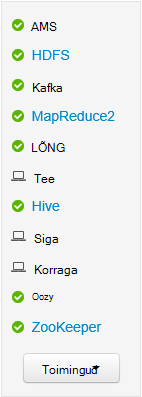

<properties
   pageTitle="Jälgimine ja haldamine Hdinsightiga kogumite Apache Ambari Web Kasutajaliidese abil | Microsoft Azure'i"
   description="Saate teada, kuidas kasutada Ambari jälgimine ja haldamine Linux-põhine Hdinsightiga kogumite. Selles dokumendis saate teada, kuidas kasutada Ambari Web UI Hdinsightiga kogumite kaasas."
   services="hdinsight"
   documentationCenter=""
   authors="Blackmist"
   manager="jhubbard"
   editor="cgronlun"
    tags="azure-portal"/>

<tags
   ms.service="hdinsight"
   ms.devlang="na"
   ms.topic="article"
   ms.tgt_pltfrm="na"
   ms.workload="big-data"
   ms.date="09/27/2016"
   ms.author="larryfr"/>

#Haldamine Hdinsightiga kogumite Ambari Web Kasutajaliidese abil

[AZURE.INCLUDE [ambari-selector](../../includes/hdinsight-ambari-selector.md)]

Apache Ambari lihtsustab haldamise ja järelevalve Hadoopi kobar, pakkudes lihtne kasutada kasutajaliides web ja REST API-ga. Ambari lisatud Linux-põhine Hdinsightiga kogumite ja kasutatakse jälgida klaster ja konfiguratsiooni muuta.

Selles dokumendis saate teada, kuidas kasutada Ambari Web UI mõne Hdinsightiga kobar.

##Mis on Ambari?

<a href="http://ambari.apache.org" target="_blank">Apache Ambari</a> muudab Hadoopi haldus on lihtne kasutada web UI, mida saab kasutada ette, hallata ja jälgida Hadoopi kogumite pakkudes lihtsamaks. Arendajad saate neid võimalusi integreerida nende rakenduste abil <a href="https://github.com/apache/ambari/blob/trunk/ambari-server/docs/api/v1/index.md" target="_blank">Ambari REST API-d</a>.

Ambari Web UI on esitatud Linux-põhine Hdinsightiga kogumite vaikimisi. 

##Ühenduvus

Ambari Web UI on saadaval veebisaidil HTTPS://CLUSTERNAME.azurehdidnsight.net, kus on __CLUSTERNAME__ klaster nime klaster Hdinsightile. 

> [AZURE.IMPORTANT] Klõpsake Hdinsightiga Ambari ühendamine nõuab HTTPS. Tuleb ka autentida Ambari administraatori konto nimi (vaikimisi __administraator__) ja registreerimisel klaster on loodud parooli abil.

##SSH puhverserveri

> [AZURE.NOTE] Kuigi Ambari jaoks klaster pääseb otse internetis, mõned lingid Ambari Web kasutajaliidese (nt JobTracker,) on avatud Internetis. Nii saate vigu "serveriga ei leitud" kui proovite need funktsioonid juurde, kui te ei kasuta Secure Shell (SSH) tunneliga, et puhverserveri web-liikluse kobar pea sõlme.

Mõne SSH tunneliga töötamiseks Ambari loomise kohta leiate teavet teemast [kasutamine SSH Tunneling Ambari web UI, ResourceManager, JobHistory, NameNode, Oozie, ja muud web UI's juurde pääseda](hdinsight-linux-ambari-ssh-tunnel.md).

##Ambari Web UI

Kui ühendate Ambari Web UI, palutakse teil autentida lehele. Kasutage kobar administraator kasutaja (vaikimisi administraator) ja parool, mida kasutasite kobar loomise ajal.

Lehe avamisel Märkus ülaosas oleval ribal. See sisaldab järgmist teavet ja juhtelemendid.

* **Ambari logo** – avatakse armatuurlaua, mida saab kasutada klaster jälgimiseks.

* **Kobar nimi # ops** - kuvab poolelioleva Ambari toimingute arv. Valides kobar nimi või **# ops** tausta toimingute loendi kuvamiseks.

* **teatiste #** - hoiatused või kriitilised teatisi, kui on klaster. Valige see teatiste loendi kuvamiseks.

* **Armatuurlaua** - kuvab armatuurlaud.

* **Teenuste** - ja konfiguratsioon sätted klaster teenuseid.

* **Hosts** - sõlmed klaster ja konfiguratsioon sätted.

* **Teatiste** - Logi teave, hoiatused ja kriitilised teatised.

* **Administraator** - tarkvara virnas/teenuseid, mis on installitud kobar, teenuse kontoteavet ja Kerberos turvalisus.

* **Administraator nuppu** - Ambari haldus, kasutajasätete ja välju.

##Jälgimine

###Teatised

Ambari pakub palju teateid, mis on üks järgmistest nimega olek.

* **Ok**

* **Hoiatus**

* **KRIITILINE**

* **POLE TEADA**

Teatiste peale **OK** põhjustab **# teatiste** kirje teatiste arvu kuvatava lehe ülaosas. Valige kirje kuvatakse teatisi ja nende oleku.

Teatiste on korraldatud mitu vaikerühmad, mida saab vaadata **teatiste** lehe kaudu.

Saate hallata rühmad, kasutades menüü **toimingud** ja valides **Teatiste rühmade haldamine**. See võimaldab teil muuta rühmi või luua uusi rühmi.

Teatiste saate luua ka menüü **toimingud** . See võimaldab teil luua päästikute, mis saadavad teatised e **-posti** või **SNMP** teatud teatise/raskusaste kombinatsioonide korral. Näiteks saate saata teatise, kui mis tahes teatiste jaotises **LÕNG vaikimisi** on seatud **kriitiline**.

###Kobar

Armatuurlaua menüü **mõõdikute** sisaldab sarja vidinate hõlpsalt jälgida olekut klaster ülevaade. Mitu vidinad, nt **CPU hõivatus**pakuvad lisateavet klõpsamisel.

Vahekaart **Heatmaps** kuvab mõõdikute värviline heatmaps, läheb roheline punane.

Üksikasjalikumat teavet sõlmed klaster sees, valige **Hosts**ja valige olete huvitatud teatud sõlme.

###Teenused

**Teenuste** külgriba armatuurlaual leiate kiire ülevaate töötavate klaster teenuste olekut. Erinevate ikoonid on kasutada olek ja toimingud, mida tuleb võtta, nt prügikast kollane tähis kui teenus peab taaskasutada.

Valige teenuse kuvatakse teenuse üksikasjalikumat teavet.

####Kiirlingid

Teatud teenuste kuvamine lehe ülaosas linki **Kiirlingid** . Seda saab kasutada juurdepääsu teenuse kohased web UIs, näiteks:

* **Varasem töökogemus** - MapReduce töö ajalugu.

* **Ressursihaldur** - LÕNG ResourceManager UI.

* **NameNode** - jaotatud Hadoopi fail (HDFS) süsteemi NameNode UI.

* **Oozie Web UI** - Oozie UI.

Valige mõni järgmistest linkidest avatakse uuel vahekaardil oma brauserit, mis kuvatakse valitud leht.

> [AZURE.NOTE] **Kiirlingid** linki iga teenuse tulemuseks "serveriga ei leitud" tõrge, kui kasutate turvasoklite kiht (SSL) tunneliga puhverserveri web liiklus klaster. See on Kuna veebirakenduste, kuvatakse see teave on avatud Internetis.
>
> Kasutades on SSL-i tunneliga Hdinsightiga leiate teemast [kasutamine SSH Tunneling Ambari web UI, ResourceManager, JobHistory, NameNode, Oozie, ja muud web UI's](hdinsight-linux-ambari-ssh-tunnel.md)

##Haldus

###Ambari kasutajate, rühmade ja õiguste

Kasutajate, rühmade ja õiguste haldamise ei tohi kasutada koos Hdinsightiga kogumite.

###Hosts

Lehe **Hosts** loetleb kõik hosts klaster. Hallata hosts, toimige järgmiselt.

> [AZURE.NOTE] Lisada, eemaldama või recommissioning host ei tohi kasutada koos Hdinsightiga kogumite.

1. Valige host(s), mida soovite hallata.

2. Valige toiming, mille soovite teha menüü **toimingud** abil:

    * **Käivitage kõik komponendid** - hosti kõik komponendid käivitamine.

    * **Lõpeta kõik komponendid** - hosti kõik komponendid peatamine.

    * **Taaskäivitage kõik komponendid** - Peata ja hakake hosti kõik komponendid.

    * **Hoolduse režiimi sisselülitamine** - tõkestab teatiste hosti jaoks. See peaks olema lubatud, kui teete toiminguid, mis loob teatisi, nt taaskäivitada teenus, mis töötavad teenused sõltuvad.

    * **Hoolduse režiimi väljalülitamine** – tagastab host, et tavaline teavitamine.

    * **Lõpeta** – astmed DataNode või NodeManagers hosti.

    * **Alustamine** – algab DataNode või NodeManagers hosti.

    * **Taaskäivitage** - peatub ja hakkab DataNode või NodeManagers hosti.

    * **Decommission** - eemaldab host klaster.

        > [AZURE.NOTE] Kasutage seda toimingut Hdinsightiga kogumite.

    * **Recommission** - lisab varem kasutusest kõrvaldatud host klaster.

        > [AZURE.NOTE] Kasutage seda toimingut Hdinsightiga kogumite.

###Teenused

Lehelt **armatuurlaud** või **teenuseid** kasutada nuppu **toimingud** teenuste loend allosas lõpetada ja kõigi teenuste alustada.

> [AZURE.WARNING] Ajal loendis selle menüü __Lisa teenus__ , ei peaks seda kasutada Hdinsightiga kobar teenuseid lisada. Kasutades skripti toimingu käigus kobar ettevalmistamise tuleks lisada uusi teenuseid. Skripti toimingud kasutamise kohta leiate lisateavet teemast [kohandamine Hdinsightiga kogumite skripti toimingute kasutamine](hdinsight-hadoop-customize-cluster-linux.md).

Ajal nuppu **toimingud** saate kõiki teenuseid taaskäivitamiseks sageli soovite käivitamiseks, peatamiseks või kindla teenuse taaskäivitama. Järgmiste juhiste abil saate üksikuid teenuse toiminguid:

1. **Armatuurlaua** või **teenuste** lehel Valige teenus.

2. Kasutage **Rakenduste kinnitamine** nuppu ülaosas vahekaarti **Kokkuvõte** ja valige toiming. Teenuse kõik sõlmed uuesti.

    

    > [AZURE.NOTE] Teatud teenuste taaskäivitamine klaster töötamise võib luua teatised. Selle vältimiseks saate **Rakenduste kinnitamine** nuppu Luba **hooldustööd režiim** teenuse uuesti sooritamiseks.

3. Kui toiming on valitud, kuvatakse **# op** kirje lehe ülaosas inkrementida tausta toiming toimub kuvamiseks. Kui kuvatakse konfigureeritud, kuvatakse tausta toimingute loend.

    > [AZURE.NOTE] Kui märkisite teenuse **hooldus režiimis** , pidage meeles, et see kasutades **Rakenduste kinnitamine** nuppu, kui toiming on lõpule jõudnud.

Teenuse konfigureerimiseks tehke järgmist:

1. **Armatuurlaua** või **teenuste** lehel Valige teenus.

2. Valige vahekaart **Configs** . Kuvatakse praegune konfiguratsioon. Kuvatakse ka loendi eelmise konfiguratsioone.

    

3. Muuta konfiguratsiooni kuvatud väljad kasutada, ja seejärel valige **Salvesta**. Või valige eelmise konfiguratsiooni ja seejärel valige **muuta praeguse** varasemate sätete tagasi pöörata.

##Ambari vaated

Ambari vaated võimaldavad arendajatel ühendage Kasutajaliidese elemendid Ambari Web UI [Ambari vaadete raamistiku](https://cwiki.apache.org/confluence/display/AMBARI/Views)abil. Hdinsightiga pakub järgmistest vaadetest Hadoopi kobar andmetüüpidega.

* Lõng järjekorda haldur ühte järgmistest: järjekorda manager pakub lihtne UI vaatamiseks ja muutmiseks LÕNG järjekorrad.
* Taru vaade: Taru vaate saate otse oma veebibrauseris taru päringute sooritamine. Saate salvestada päringud, tulemuste kuvamine, salvestada tulemused kobar salvestusruumi või kohalikust tulemused alla laadida. Taru vaadete kasutamise kohta leiate lisateavet teemast [Kasutamine taru vaadete Hdinsightiga](hdinsight-hadoop-use-hive-ambari-view.md).
* Tez: Tez The View vaadete abil saate paremini mõista ja töö optimeerida, kuidas Tez töid ja ressursse, mis kasutavad töö teabe vaatamine.
