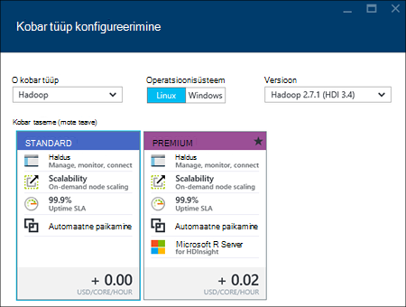
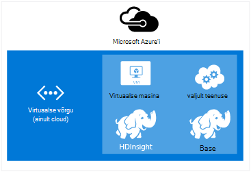

<properties
    pageTitle="Hadoopi, HBase, torm või säde kogumite loomine rakenduses Hdinsightiga Linux | Microsoft Azure'i"
    description="Saate teada, kuidas luua Hadoopi, HBase, torm või säde kogumite Linux Hdinsightiga brauseris, Azure'i CLI, Azure PowerShelli, ülejäänud, või ka SDK kaudu."
    services="hdinsight"
    documentationCenter=""
    authors="mumian"
    manager="jhubbard"
    editor="cgronlun"
    tags="azure-portal"/>

<tags
    ms.service="hdinsight"
    ms.devlang="na"
    ms.topic="article"
    ms.tgt_pltfrm="na"
    ms.workload="big-data"
    ms.date="10/18/2016"
    ms.author="jgao"/>

# Loomine Hadoopi Linux-põhine kogumite Hdinsightiga

[AZURE.INCLUDE [selector](../../includes/hdinsight-selector-create-clusters.md)]

Hadoopi kobar koosneb mitme virtuaalmasinates (sõlmed) jaotatud töötlemine tööülesannete klaster kasutatavate. Azure'i abstracts üksikasju installimine ja konfigureerimine üksikud sõlmed, seega tuleb konfiguratsiooni üldist teavet. Sellest artiklist saate teada, nende sätete konfigureerimise kohta.

## Accessi kontrolli nõuded

[AZURE.INCLUDE [access-control](../../includes/hdinsight-access-control-requirements.md)]

## Kobar tüübid

Praegu Windows Azure Hdinsightiga pakub viit eri tüüpi kogumite, igal versioonil komponentide esitada teatud funktsioone.

| Kobar tüüp | Funktsioonid |
| ------------ | ----------------------------- |
| Hadoopi       | Päringu ja analüüsi (pakett-tööde)     |
| HBase        | NoSQL andmete talletamine            |
| Torm        | Reaalajas event töötlus |
| Säde        | -Mälu töötlemine, interaktiivsed päringud mikro-paketi voo töötlemine |
| [Interaktiivne taru (eelvaade)](hdinsight-hadoop-use-interactive-hive.md) | -Mälu vahemällu interaktiivsed ja kiiremini taru päringuid|
| R Server säde (eelvaade) | Mitmesuguseid suur andmete statistika, ennustava modelleerimine ja seadme Õppekeskuse võimalused |

Iga kobar tüüp on oma arvu sõlmed klaster sees, terminoloogia sõlmed sees klaster ja vaikesuurust VM iga sõlm tüüp. Järgmises tabelis on sulgudes sõlmed iga sõlm tüübi arv.

| Tüüp| Sõlmed | Skeem|
|-----|------|--------|
|Hadoopi| Andmete sõlm (1 +) pea sõlme (2)||
|HBase|Juhi server (2), piirkond server (1 +), juhtslaidi/Zookeeper sõlm (3)||
|Torm|Nimbus sõlm (2) halduri server (1 +), Zookeeper sõlm (3)||
|Säde|Juhi sõlm (2) töötaja sõlm (1 +), Zookeeper sõlm (3) (tasuta A1 Zookeepers VM suurus)||

Järgmises tabelis on loetletud Hdinsightiga jaoks vaikimisi VM suurus:

- Kõigi toetatud regioonide peale Brasiilia Lõuna ja Lääne Jaapan:

  	|Kobar tüüp                     | Hadoopi               | HBase                | Torm                | Säde                                                                 | R-Server |
  	|---------------------------------|----------------------|----------------------|----------------------|-----------------------------------------------------------------------|-----------------------------------------------------------------------|
  	|Juht-vaikimisi VM suurus           | D3 v2                | D3 v2                | A3                   | D12 v2                                                                | D12 v2                                                                |
  	|Juht-VM suurused on soovitatav      | D3 v2, D4 v2, D12 v2 | D3 v2, D4 v2, D12 v2 | A3, A4 JA A5           | D12 v2, D13 v2, D14 v2                                                | D12 v2, D13 v2, D14 v2                                                |
  	|Töötaja – vaikimisi VM suurus         | D3 v2                | D3 v2                | D3 v2                | Windows: D12 v2; Linux: D4 v2                                         | Windows: D12 v2; Linux: D4 v2                                         |
  	|Töötaja – VM suurused on soovitatav    | D3 v2, D4 v2, D12 v2 | D3 v2, D4 v2, D12 v2 | D3 v2, D4 v2, D12 v2 | Windows: D12 v2, D13 v2, D14 v2; Linux: D4 v2, D12 v2, D13 v2, D14 v2 | Windows: D12 v2, D13 v2, D14 v2; Linux: D4 v2, D12 v2, D13 v2, D14 v2 |
  	|Zookeeper – vaikimisi VM suurus      |                      | A3                   | A2                   |                                                                       |
  	|Zookeeper – soovitatav VM suurused |                      | A3, A4 JA A5           | A2, A3 JA A4           |                                                                       |
  	|Serva - vaikimisi VM suurus           |                      |                      |                      |                                                                       | Windows: D12 v2; Linux: D4 v2                                         |
  	|Serva – soovitatav VM suurus       |                      |                      |                      |                                                                       | Windows: D12 v2, D13 v2, D14 v2; Linux: D4 v2, D12 v2, D13 v2, D14 v2 |

- Brasiilia Lõuna- ja Jaapan ainult (pole v2 suurused siin):

  	|Kobar tüüp                     | Hadoopi      | HBase       | Torm      | Säde                                          |R-Server|
  	|---------------------------------|-------------|-------------|------------|------------------------------------------------|--------|
  	|Juht-vaikimisi VM suurus           | D3          | D3          | A3         | D12                                            | D12|
  	|Juht-VM suurused on soovitatav      | D3, D4 D12 | D3, D4 D12 | A3, A4 JA A5 | D12 D13, D14                                  | D12 D13, D14|
  	|Töötaja – vaikimisi VM suurus         | D3          | D3          | D3         | Windows: D12; Linux: D4                        | Windows: D12; Linux: D4|
  	|Töötaja – VM suurused on soovitatav    | D3, D4 D12 | D3, D4 D12 | D3, D4 D12| Windows: D12 D13, D14; Linux: D4 D12 D13, D14| Windows: D12 D13, D14; Linux: D4 D12 D13, D14|
  	|Zookeeper – vaikimisi VM suurus      |             | A2          | A2         |                                                | |
  	|Zookeeper – VM suurused on soovitatav |             | A2, A3 JA A4  | A2, A3 JA A4 |                                                | |
  	|Serva – vaikimisi VM suurused          |             |             |            |                                                | Windows: D12; Linux: D4 |
  	|Serva – VM suurused on soovitatav      |             |             |            |                                                | Windows: D12 D13, D14; Linux: D4 D12 D13, D14 |

Pange tähele, et pea on teada *Nimbus* Storm kobar tüüp. Töötaja nimetatakse *piirkonna* jaoks HBase kobar tüüp ja *halduri* Storm kobar tüüp.

> [AZURE.IMPORTANT] Kui plaanite rohkem kui 32 töötaja sõlmed, millel on kobar loomisel või skaala klaster pärast loomist, peate valima pea sõlme suurus vähemalt 8 ja -vormid 14 GB RAM-i abil.

Muud komponendid, nt tooni või R saate lisada need põhitüüpi [Skripti toimingute](#customize-clusters-using-script-action)abil.

> [AZURE.IMPORTANT] Hdinsightiga kogumite tulevad erinevaid töökoormus või klaster on häälestatud, mis vastavad tüüpi. Ei ole toetatud meetodit klaster, mis ühendab mitut tüüpi, näiteks torm ja HBase sisse ühe kobar loomiseks. 

Kui teie lahendus nõuab tehnoloogiaid, mis on laiali mitme Hdinsightiga kobar tüübid, tuleks luua Azure virtuaalse ja loomine nõutav kobar tüüpi virtuaalse võrgustikus. See võimaldab rühmad ja mis tahes koodi juurutamist nende otse omavahel suhelda.

Hdinsightiga on Azure virtuaalse võrgu kasutamise kohta leiate lisateavet teemast [Azure virtuaalse võrgu laiendamine Hdinsightiga](hdinsight-extend-hadoop-virtual-network.md).

Näitena kasutades kahte tüüpi toiminguid kobar on Azure virtuaalse võrgustikus, vt [analüüsi andurite andmeid Storm ja HBase](hdinsight-storm-sensor-data-analysis.md).

## Astme kobar

Azure Hdinsightiga pakub suur andmete pilve pakkumisi kahte kategooriasse: Standard- ja [Premium](hdinsight-component-versioning.md#hdinsight-standard-and-hdinsight-premium). Hdinsightiga Premium sisaldab R ja muude lisakomponentide. Hdinsightiga Premium toetatakse ainult Hdinsightiga versiooni 3.4.

Järgmises tabelis on loetletud Hdinsightiga kobar tüüp ja Hdinsightiga Premium tugi maatriks.

| Kobar tüüp | Standard | Premium  |
|--------------|---------------|--------------|
| Hadoopi       | Jah           | Jah          |
| Säde        | Jah           | Jah          |
| HBase        | Jah           | Ei           |
| Torm        | Jah           | Ei           |
| R Server säde | Ei | Jah |

Selles tabelis värskendatakse, kui mitu kobar kaasatakse Hdinsightiga Premium. Järgmine pilt kuvatakse Azure portaali teabe valimise kobar tüübid.

## Seadistada suvandid

Saab luua ka Hdinsightiga kobar seadistada suvandid on järgmised.

### Kobar nimi ###

Klaster tuvastamiseks kasutatakse kobar nime. Kobar nimi peab olema kordumatu globaalselt ja see peab kinni nime järgmisi juhiseid.

- Väli peab olema string, mis sisaldab 3 kuni 63 märki.
- Väli võib sisaldada ainult tähti, numbreid ja sidekriipse.

### Kobar tüüp###

Lugege teemat [kobar tüübid](#cluster-types) ja [kobar astme](#cluster-tiers).

### Operatsioonisüsteem ###

Saate luua Hdinsightiga kogumite ühele kahest järgmised operatsioonisüsteemid.

- Hdinsightiga Linux.  Hdinsightiga pakub võimalust konfigureerimisel Linux kogumite Azure. Konfigureerimine Linux kobar, kui olete tuttav Linuxi või Unix, opsüsteemilt olemasoleva Hadoopi Linuxi-põhise lahenduse või soovite hõlbus integreerimine Hadoopi ökosüsteemi komponendid loodud Linuxi jaoks. Lisateabe saamiseks lugege teemat [Alustamine Hadoopi Hdinsightiga Linux](hdinsight-hadoop-linux-tutorial-get-started.md).
- Hdinsightiga Windows (Windows Server 2012 R2 andmekeskuse).

### Hdinsightiga versioon###

Seda kasutatakse Hdinsightiga vaja see versiooni määratlemine. Lisateabe saamiseks vt [Hadoopi kobar versioonid ja Hdinsightiga komponendid](https://go.microsoft.com/fwLink/?LinkID=320896&clcid=0x409).

### Tellimuse nimi###

Iga Hdinsightiga kobar on seotud üks Azure'i tellimus.

### Ressursi rühma nimi ###

[Azure'i ressursihaldur](../azure-resource-manager/resource-group-overview.md) aitab töötate ressursside rakenduse rühmana, nimetatakse on Azure ressursirühma. Saate juurutada, värskendamine, jälgida või kustutada kõik ressursse rakenduse koordineeritud ühekordne.

### Identimisteave###

Hdinsightiga kogumite, kus saate konfigureerida kaks Kasutajakontod kobar loomise ajal.

- HTTP kasutaja. Vaikimisi kasutajanimi on *admin* abil lihtsa konfiguratsiooni Azure'i portaalis. Mõnikord nimetatakse "Klaster kasutaja."
- SSH kasutaja (Linux kogumid). Seda kasutatakse ühenduse klaster SSH abil. Saate luua täiendavad SSH kasutajakontode klaster on loodud [Kasutamine SSH koos Linux-põhine Hadoopi Hdinsightiga Linux, Unix, või OS X](hdinsight-hadoop-linux-use-ssh-unix.md) või [Kasutage SSH koos Linux-põhine Hadoopi Hdinsightiga Windows](hdinsight-hadoop-linux-use-ssh-unix.md)juhiste järgi.

    >[AZURE.NOTE] Windowsi-põhiste kogumite, saate luua ühenduse abil RDP klaster RDP rakendust.

### Andmeallikas###

Faili algse Hadoopi hajusfailisüsteemiga (HDFS) kasutab palju kohaliku ketast klaster. Hdinsightiga kasutab Azure'i bloobimälu andmesalv. Azure'i bloobimälu on robustne, üldotstarbeline salvestusruumi lahenduse, mis ühendab sujuvalt Hdinsightiga. Kaudu HDFS liidest komponendid Hdinsightiga täiskomplekti saate töötada otse bloobimälu struktureeritud või struktureerimata andmed. Andmete talletamine bloobimälu aitab teil turvaline kustutamine Hdinsightiga rühmad kasutatavate arvutus ilma kasutaja andmeid.

Konfigureerimise käigus peate määrama Azure storage konto ja mis Azure'i bloobimälu salvestusruumi container Azure storage konto. Mõned loomise protsesside jaoks on vaja Azure storage konto ja bloobimälu salvestusruumi container eelnevalt luua. Bloobimälu salvestusruumi container kasutab vaikimisi juurtasemel klaster. Soovi korral saate määrata täiendavaid Azure Storage kontosid (lingitud salvestusruumi), mis on kättesaadav klaster. Klaster pääsete juurde ka bloobimälu salvestusruumi ümbriste, mis on konfigureeritud täielikku avaliku lugemisõigust või avaliku lugemisõigus plekid ainult.  Lisateabe saamiseks lugege teemat [Azure salvestusruumi ressursid juurdepääsu haldamine](../storage/storage-manage-access-to-resources.md).

>[AZURE.NOTE] Bloobimälu salvestusruumi container pakub rühmitamise plekid kogumi, nagu on näidatud järgmisel pildil.

Me ei soovita abil vaikimisi bloobimälu salvestusruumi container ettevõtte andmete talletamiseks. Pärast iga kasutamist vähendada salvestusruumi on hea tava, kustutamine vaikimisi bloobimälu salvestusruumi ümbrises. Teate, et vaike-ümbrisest sisaldab rakenduse ja logid. Veenduge, et enne kustutamist ümbris logid toomiseks.

>[AZURE.WARNING] Ühiskasutuse ühe bloobimälu salvestusruumi ümbris mitme kogumite ei toetata.

Teisene bloobimälu kasutamise kohta leiate lisateavet teemast [Abil Azure'i bloobimälu koos Hdinsightiga](hdinsight-hadoop-use-blob-storage.md).

Lisaks Azure'i bloobimälu samuti saate [Azure'i andmesalve Lake](../data-lake-store/data-lake-store-overview.md) HBase kobar Hdinsightiga rakenduses salvestusruumi vaikekonto ja kõik neli Hdinsightiga kobar tüüpi lingitud salvestusruumi. Lisateabe saamiseks lugege teemat [loomine mõne Hdinsightiga kobar andmete Lake poe kaudu Azure portaali](../data-lake-store/data-lake-store-hdinsight-hadoop-use-portal.md).

### Asukoht (piirkond) ###

Hdinsightiga kobar ja selle salvestusruumi vaikekonto peavad asuma samas kohas Azure.

Toetatud regioonide loendit, klõpsake [Hdinsightiga](https://go.microsoft.com/fwLink/?LinkID=282635&clcid=0x409)hinna **piirkond** ripploendist.

### Hinnad astme sõlm###

Kliendid on need sõlmed kasutamist arve soovitud klaster elu kestel. Arveldamine käivitamise klaster loomisel ja astmed klaster kustutamisel. Kogumite ei saa tühistage eraldatud või ootele panna.

Erinevate kobar tüübid on eri tüüpi, arvude sõlmed ja sõlm suurusega. Näiteks Hadoopi kobar tüüp on kaks _head sõlmed_ ja vaikimisi nelja _andmete sõlmed_, samal ajal torm kobar tüüp on kaks _nimbus sõlmed_, kolm _zookeeper sõlmed_ja neli _halduri sõlmed_vaikimisi. Hdinsightiga kogumite maksumus määratakse sõlmed ja virtuaalmasinates suurused jaoks sõlmed arv. Näiteks kui teate, et teile täita toimingute kohta, mida on vaja palju mälu, mida soovite valida Arvuta ressurss rohkem mälu. Õppimisega, on soovitatav kasutada ühte andmete sõlm. Hinnad Hdinsightiga kohta leiate lisateavet teemast [Hdinsightiga hinnad](https://go.microsoft.com/fwLink/?LinkID=282635&clcid=0x409).

>[AZURE.NOTE] Kobar mahupiirangu erinev Azure'i tellimused. Arvelduse tugiteenuste suurendamiseks limiit.

>Kasutatavad klaster sõlmed arvestatakse virtuaalmasinates Kuna virtuaalse masina pilte kasutada sõlmed on mõne Hdinsightiga teenuse rakendamise üksikasjad. Arvuta südamikud kasutatavaid sõlmed arvestata Arvuta valdkond saadaval tellimuse koguarv. Saate vaadata arvu saadaval tuuma, mis kasutab kobar kokkuvõtete jaotises sõlm hinnad astme tera loomisel on Hdinsightiga kobar ja -vormid.

Azure portaali kasutamisel konfigureerida klaster sõlm maht on saadaval __Sõlm hinnad taseme__ tera kaudu. Saate vaadata ka seostatud erinevate sõlm suurused maksumus. Järgmine pilt kuvatakse Linux-base Hadoopi kobar Valikud.

Järgmistes tabelites on toetatud Hdinsightiga kogumite ja nad pakuvad võimalusi suurusi.

#### Standardse taseme: A-sarja####

Klassikaline juurutamise mudeli, mõned VM suurused on veidi teistsugused PowerShelli ja CLI.
* Standard_A3 on suur
* Standard_A4 on ExtraLarge

|Suurus |Protsessorituuma|Mälu|NICs (Max)|Max. ketta suurus|Max. andmete ketast (iga 1023 GB)|Max. IOPS (500 / ketas)|
|---|---|---|---|---|---|---|
|Standard_A3\Large|4|7 GB|2|Ajutiste = 285 GB |8|8 x 500|
|Standard_A4\ExtraLarge|8|14 GB|4|Ajutiste = 605 GB |16|16-x 500|
|Standard_A6|4|28 GB|2|Ajutiste = 285 GB |8|8 x 500|
|Standard_A7|8|56 GB|4|Ajutiste = 605 GB |16|16-x 500|

#### Standardse taseme: D-sarja####

|Suurus |Protsessorituuma|Mälu|NICs (Max)|Max. ketta suurus|Max. andmete ketast (iga 1023 GB)|Max. IOPS (500 / ketas)|
|---|---|---|---|---|---|---|
|Standard_D3 |4|14 GB|4|Ajutised (SSD) = 200 GB |8|8 x 500|
|Standard_D4 |8|28 GB|8|Ajutised (SSD) = 400 GB |16|16-x 500|
|Standard_D12 |4|28 GB|4|Ajutised (SSD) = 200 GB |8|8 x 500|
|Standard_D13 |8|56 GB|8|Ajutised (SSD) = 400 GB |16|16-x 500|
|Standard_D14 |16|112 GB|8|Ajutised (SSD) = 800 GB |32|32-x 500|

#### Standardse taseme: Dv2-sarja####

|Suurus |Protsessorituuma|Mälu|NICs (Max)|Max. ketta suurus|Max. andmete ketast (iga 1023 GB)|Max. IOPS (500 / ketas)|
|---|---|---|---|---|---|---|
|Standard_D3_v2 |4|14 GB|4|Ajutised (SSD) = 200 GB |8|8 x 500|
|Standard_D4_v2 |8|28 GB|8|Ajutised (SSD) = 400 GB |16|16-x 500|
|Standard_D12_v2 |4|28 GB|4|Ajutised (SSD) = 200 GB |8|8 x 500|
|Standard_D13_v2 |8|56 GB|8|Ajutised (SSD) = 400 GB |16|16-x 500|
|Standard_D14_v2 |16|112 GB|8|Ajutised (SSD) = 800 GB |32|32-x 500|    

Juurutamise kaalutlused tuleb arvestada, kui plaanite järgmiste ressursside kaudu, leiate teemast [virtuaalmasinates suurused](../virtual-machines/virtual-machines-windows-sizes.md). Erinevas suuruses hindade kohta leiate teavet teemast [Hdinsightiga hinnad](https://azure.microsoft.com/pricing/details/hdinsight).   

> [AZURE.IMPORTANT] Kui plaanite rohkem kui 32 töötaja sõlmed, millel on kobar loomisel või skaala klaster pärast loomist, peate valima pea sõlme suurus vähemalt 8 ja -vormid 14 GB RAM-i abil.

Arveldamine käivitamise klaster loomisel ja astmed klaster kustutamisel. Hinnad kohta leiate lisateavet teemast [Hdinsightiga hinnakirjad üksikasjad](https://azure.microsoft.com/pricing/details/hdinsight/).

## Kasutage täiendav salvestusruum

Mõnel juhul võite lisada täiendavat salvestusruumi klaster. Näiteks võib olla mitu Azure salvestusruumi kontod eri geograafiliste piirkondade või erinevad teenused, kuid soovite need kõik koos Hdinsightiga analüüsida.

Mõne Hdinsightiga kobar loomisel või pärast klaster on loodud, saate salvestusruumi kontosid lisada.  Lugege teemat [kohandamine Linux-põhine Hdinsightiga kogumite skripti toimingu abil](hdinsight-hadoop-customize-cluster-linux.md).

Teisene bloobimälu kohta leiate lisateavet teemast [abil Azure'i bloobimälu koos Hdinsightiga](hdinsight-hadoop-use-blob-storage.md). Teisene Lake andmesalv kohta leiate lisateavet teemast [loomine Hdinsightiga kogumite andmete Lake poe Azure'i portaalis](../data-lake-store/data-lake-store-hdinsight-hadoop-use-portal.md).

## Kasutage taru/Oozie metastore

Soovitame kasutada kohandatud metastore, kui soovite säilitada oma taru tabelite pärast kustutamist Hdinsightiga klaster. Mida saab selle metastore manustamiseks teise Hdinsightiga kobar.

> [AZURE.IMPORTANT] Hdinsightiga metastore loodud ühe Hdinsightiga kobar versiooni ei saa ühiskasutusse anda kogu muu Hdinsightiga kobar versiooni. Hdinsightiga versioonide loendi leiate teemast [toetatud Hdinsightiga versioonid](hdinsight-component-versioning.md#supported-hdinsight-versions).

Funktsiooni metastore sisaldab taru ja Oozie metaandmeid, nt taru tabelid, sektsioonid, skeeme ja veerge. Funktsiooni metastore abil saate säilitada oma taru ja Oozie metaandmeid, seetõttu ei pea te uuesti luua taru tabelite või Oozie tööde haldamine, kui loote uue kobar. Vaikimisi kasutab taru manustatud Azure SQL-andmebaasi andmed salvestama. Manustatud andmebaasi ei saa säilitavad metaandmed, kui klaster kustutatakse. Taru tabeli loomisel taru metastore, konfigureeritud koos mõne Hdinsightiga kobar säilitatakse nende tabelite kui kobar, kasutades sama taru metastore uuesti luua.

Metastore konfiguratsioon pole saadaval HBase kobar tüüpi.

> [AZURE.IMPORTANT] Luues kohandatud metastore, ärge kasutage andmebaasi nimi, mis sisaldab kriipsjooned või sidekriipse. See võib põhjustada kobar loomisprotsessi nurjumise.

## Azure'i kasutamine

[Azure virtuaalse võrgu](https://azure.microsoft.com/documentation/services/virtual-network/), saate luua sisaldavad ressursid, peate oma lahenduse turvaline, püsivate võrgus. Virtuaalse võrguga, saate teha järgmist.

* Ühenduse loomine pilveteenuses ressursside koos privaatvõrk (ainult pilveteenuses).

    

* Ühendage oma pilveteenuses ressursse kohaliku andmekeskuse võrgu (-saidilt või saidi punkti) virtuaalse privaatvõrgu (VPN) abil.

| Saitide konfigureerimine | Punkti saidi konfigureerimine |
| -------------------------- | --------------------------- |
| Saitide konfiguratsiooni, saate luua ühenduse mitme ressursside kaudu oma andmekeskuse Azure virtuaalse võrgu riistvara VPN- või marsruutimine ja Remote Access Service abil.  | Punkti saidi konfiguratsiooni, saate luua ühenduse mõne kindla ressursi Azure virtuaalse võrgu tarkvara VPN-i abil.  |

Windowsi-põhiste kogumite nõua on v1 (klassikaline) virtuaalse võrgu, samal ajal kui Linuxi-põhiste kogumite v2 (Azure'i ressursihaldur) virtuaalse võrgu. Kui teil pole õiget tüüpi võrku, seda ei saa kasutuskõlblikud klaster loomisel.

Hdinsightiga virtuaalse võrguga, sh teatud konfiguratsiooni nõuded on virtuaalse võrgu kasutamise kohta leiate lisateavet teemast [laiendamine Hdinsightiga võimaluste on Azure virtuaalse võrgu kaudu](hdinsight-extend-hadoop-virtual-network.md).

## Kogumite abil Hdinsightiga kobar kohandamine (bootstrap) kohandamine

Mõnikord, mida soovite konfigureerida järgmised failid:

- clusterIdentity.xml
- Core-site.xml
- Gateway.XML
- hbase-env.xml
- hbase-site.xml
- hdfs-site.xml
- taru-env.xml
- taru-site.xml
- mapred – saidile
- oozie-site.xml
- oozie-env.xml
- torm-site.xml
- Tez-site.xml
- webhcat-site.xml
- lõng-site.xml

Muudatused läbi klaster kestuse säilitada Hdinsightiga kobar kohandamise käigus loomist saate kasutada või saate kasutada Ambari rühmades Linux-põhine. Lisateabe saamiseks vt [kohandamine Hdinsightiga kogumite alglaaduri abil](hdinsight-hadoop-customize-cluster-bootstrap.md).

>[AZURE.NOTE] Windowsi-põhiste rühmad ei saa säilitamise muudatuste tõttu uuesti pilti. Lisateavet leiate teemast [Rolli eksemplari taaskäivitamist tingitud OS uuendamine](http://blogs.msdn.com/b/kwill/archive/2012/09/19/role-instance-restarts-due-to-os-upgrades.aspx).  Muudatuste kaudu soovitud kogumite eluiga säilitamiseks peate kasutama Hdinsightiga kobar kohandamise käigus loomine.

## Kogumite skripti toimingu abil kohandamine

Saate installida lisakomponentide või kohandamine kobar konfiguratsiooni loomise ajal skriptide abil. Selliste skriptide käivitas **Skripti toiming**, mis on konfigureerimist, mida saab kasutada Azure portaali, Hdinsightiga Windows PowerShelli cmdlet-käskude või Hdinsightiga .NET SDK kaudu. Lisateabe saamiseks vt [kohandamine Hdinsightiga kobar skripti toimingu abil](hdinsight-hadoop-customize-cluster-linux.md).

Mõned kohalikke Java komponendid, nt Mahout ja Cascading, saab käitada klaster Java Archive (JAR) faile. Need JAR failid saate jaotatud Azure'i bloobimälu ja esitada Hdinsightiga kogumite Hadoopi töö esitamise menetlustele kaudu. Lisateabe saamiseks lugege teemat [esitada Hadoopi töö programmiliselt](hdinsight-submit-hadoop-jobs-programmatically.md).

>[AZURE.NOTE] Kui teil on probleeme juurutamist JAR failid Hdinsightiga kogumite või helistades JAR failid Hdinsightiga kogumite, pöörduge [Microsofti toe poole](https://azure.microsoft.com/support/options/).

> Kuhjuvate ei toeta Hdinsightiga ja Microsoft Support ei. Loendite toetatud komponendid, lugege teemat [mis on uut esitatud Hdinsightiga kobar versioonides?](hdinsight-component-versioning.md)

## Kasutage serva sõlm

 Mõnda tühja serva sõlm on Linux virtuaalse masina kliendi tööriistu installinud ja konfigureerinud selle headnodes nagu. Saate serva sõlm juurdepääs klaster, Testige oma klientrakendustes ja majutada oma klientrakendustes. Lisateabe saamiseks vt [kasutamine tühja serva sõlmed Hdinsightiga](hdinsight-apps-use-edge-node.md).
 
## Kobar loomise võimalused

Selles artiklis on õppinud põhiteabe Linux-põhine Hdinsightiga kobar loomise kohta. Järgmise tabeli abil saate otsida kindlat teavet selle kohta, kuidas luua klaster meetodil, mis sobib kõige paremini teie vajadustele.

| Kogumite, mis on loodud | Veebibrauser | Käsurea | REST API-GA | SDK | Linux, Mac OS X või Unix | Windows |
| ------------------------------- |:----------------------:|:--------------------:|:------------------:|:------------:|:-----------------------------:|:------------:|
| [Azure'i portaal](hdinsight-hadoop-create-linux-clusters-portal.md) | ✔     | &nbsp; | &nbsp; | &nbsp; | ✔      | ✔ |
| [Azure'i andmed Factory](hdinsight-hadoop-create-linux-clusters-adf.md) | ✔     | ✔  | ✔  |✔  | ✔      | ✔ |
| [Azure'i CLI](hdinsight-hadoop-create-linux-clusters-azure-cli.md)         | &nbsp; | ✔     | &nbsp; | &nbsp; | ✔      | ✔ |
| [Azure'i PowerShelli](hdinsight-hadoop-create-linux-clusters-azure-powershell.md) | &nbsp; | ✔     | &nbsp; | &nbsp; | ✔ | ✔ |
| [cURL](hdinsight-hadoop-create-linux-clusters-curl-rest.md) | &nbsp; | ✔     | ✔ | &nbsp; | ✔      | ✔ |
| [.NET SDK](hdinsight-hadoop-create-linux-clusters-dotnet-sdk.md) | &nbsp; | &nbsp; | &nbsp; | ✔ | ✔      | ✔ |
| [Azure'i ressursihaldur Mallid](hdinsight-hadoop-create-linux-clusters-arm-templates.md) | &nbsp; | ✔     | &nbsp; | &nbsp; | ✔      | ✔ |
