<properties
   pageTitle="Alustamine R Server (eelvaade) Hdinsightiga | Azure'i"
   description="Siit saate teada, kuidas luua Apache Spark Hdinsightiga (Hadoopi) kobar, mis sisaldab R Server (eelvaade) ja seejärel esitage soovitud klaster R skripti."
   services="HDInsight"
   documentationCenter=""
   authors="jeffstokes72"
   manager="jhubbard"
   editor="cgronlun"
/>

<tags
   ms.service="HDInsight"
   ms.devlang="R"
   ms.topic="article"
   ms.tgt_pltfrm="na"
   ms.workload="data-services"
   ms.date="08/19/2016"
   ms.author="jeffstok"
/>

# Klõpsake Hdinsightiga (eelvaade) R Server kasutamise alustamine

Premium taseme, pakkudes Hdinsightiga sisaldab R Server osana klaster Hdinsightiga (eelvaade). See võimaldab kasutada MapReduce ja säde jaotatud arvutuste R skriptide. Selles dokumendis saate teada, kuidas luua uus R Server Hdinsightiga ja seejärel käivitage R skripti, mis demonstreerib säde kasutamise jaotatud R arvutuste.

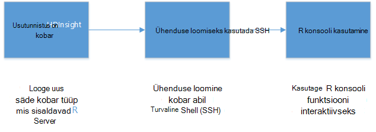

## Eeltingimused

* __An Azure'i tellimus__: enne alustamist selles õpetuses, peab teil olema Azure tellimuse. Lisateavet leiate [Azure'i saada tasuta prooviversioon](https://azure.microsoft.com/documentation/videos/get-azure-free-trial-for-testing-hadoop-in-hdinsight/) .

* __A Secure Shell (SSH) klient__: An SSH kliendi kasutatakse kaugühenduse teel ühenduse Hdinsightiga kobar ja käivitada käsud otse klaster. Linux, Unix ja OS X annab SSH kliendi kaudu soovitud `ssh` käsk. Windows süsteemidele, soovitame [PuTTY](http://www.chiark.greenend.org.uk/~sgtatham/putty/download.html).

    * __SSH klahvid (valikuline)__: saate turvaline SSH konto parooli või avalik võti klaster ühendamiseks. Parooli abil on lihtsam ja võimaldab teil alustada ilma vajaduseta luua avaliku/era võti paari; kasutades klahvi on turvalisem.
    
        Selles dokumendis juhistes eeldatakse, et kasutate parooli. Lisateavet selle kohta, kuidas luua ja kasutada SSH klahvide abil Hdinsightile, leiate järgmised dokumendid.
        
        * [SSH kasutamine Hdinsightiga Linux, Unix või OS X kliendid](hdinsight-hadoop-linux-use-ssh-unix.md)
        
        * [Windowsi klientide Hdinsightiga SSH kasutamine](hdinsight-hadoop-linux-use-ssh-windows.md)

### Accessi kontrolli nõuded

[AZURE.INCLUDE [access-control](../../includes/hdinsight-access-control-requirements.md)]

## Klaster loomine

> [AZURE.NOTE] Juhised selle dokumendi luua serveriks R Hdinsightiga seadistada teabe abil. Muud kobar konfiguratsiooni sätted (nt täiendava salvestusruumi kontod, kasutades on Azure virtuaalse võrgu või loomise on metastore mesilaspere) leiate teemast [loomine Linux-põhine Hdinsightiga kogumite](hdinsight-hadoop-provision-linux-clusters.md).

1. [Azure'i portaali](https://portal.azure.com)sisse logida.

2. Valige __Uus__, __andmete + Analytics__ja seejärel __Hdinsightiga__.

    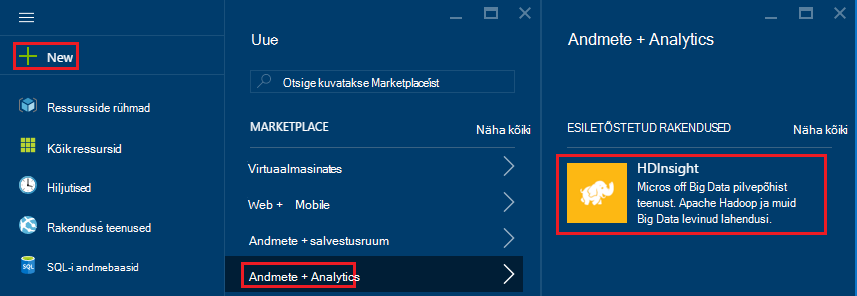

3. Sisestage väljale __Nimi kobar__ klaster nimi. Kui teil on mitu Azure tellimust, kasutage __tellimuse__ valige see, mida soovite kasutada.

    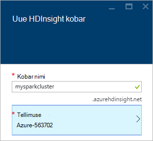

4. Valige __kobar tüübi valimine__. Enne __Kobar tüüp__ , valige järgmistest suvanditest:

    * __Kobar tüüp__: säde R serveris
    
    * __Kobar taseme__: Premium

    Jätke muude suvandite vaikeväärtused ja seejärel __Valige__ nupp abil salvestada kobar tüüp.
    
    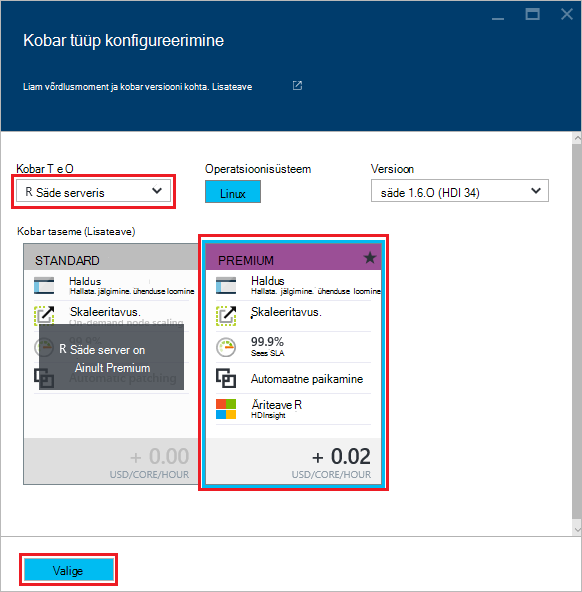
    
    > [AZURE.NOTE] R Server saate lisada ka muud Hdinsightiga kobar tüüpi (nt Hadoopi või HBase,) kobar tüüp, ja seejärel klõpsake __Premium__.

5. Valige **Ressursirühm** rühmi ressursside loendi ja seejärel valige üks sisse klaster loomiseks. Või valige **Loo uus** ja sisestage nimi uue ressursirühma. Roheline märge kuvatakse näitamaks, et uue rühma nimi on saadaval.

    > [AZURE.NOTE] See kirje vaikimisi ühte ressursi rühmi, kui mõni on saadaval.
    
    __Valige__ nupu abil saate salvestada ressursirühma.

6. Valige **mandaat**, seejärel sisestage **Kobar sisselogimise kasutajanimi** ja **Parool kobar**.

    Sisestage soovitud __SSH kasutajanimi__.  SSH __Secure Shell (SSH)__ kliendi klaster kaugühenduse kasutatakse. Saate määrata kas SSH kasutaja selles dialoogiboksis või klaster on loodud (klaster konfiguratsiooni). R Server on konfigureeritud oodata __SSH kasutajanimi__ , "remoteuser".  Kui kasutate muu kasutajanimi, on teil teha täiendav samm klaster loomise järel.
    
    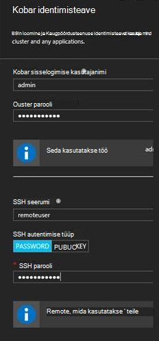

    __SSH autentimistüüp__: valige __parooli__ autentimise tüübi, kui te eelistate kasutamine avalik võti.  Kui soovite klaster kaudu serveri klient, nt RTVS, RStudio või mõne muu töölaua IDE R-serverile juurdepääsu, peate era/avalik võti paari.   

    Luua ja kasutada avaliku/privaatvõti sidumiseks valige "Avalik võti" ja järgmisel viisil.  Need juhised endale Cygwin ssh-keygen või samaväärne installitud.

    -    Luua oma sülearvutis käsuviibal avaliku/era võti paari:
      
            SSH-keygen - t rsa -b 2048 – f < era-klahv-faili nimi >
      
    -    See loob privaatse võtme faili ja avaliku võtme faili jaotises nimi < era-klahv-faili nimi > Pub, nt  davec ja davec.pub.  Määrake avalik võti fail (* pub) kui HDI kobar identimisteabe määramine:
      
        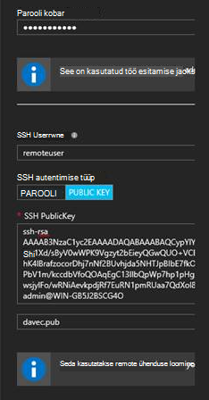  
      
    -    Privaatne keyfile sülearvuti õiguste muutmine
      
            chmod 600 < era-klahv-faili nimi >
      
    -    Kasutage privaatse võtme faili SSH kaugarvuti sisselogimine, nt
      
            SSH-i < era-klahv-faili nimi >remoteuser@<hostname public ip>
      
      või kui osa Hadoopi säde Arvuta kontekstis määratlus R serveri klient (vt Microsoft R serveri abil Hadoopi kliendi [säde on arvutada tausta loomiseks](https://msdn.microsoft.com/microsoft-r/scaler-spark-getting-started#creating-a-compute-context-for-spark) osas Online'i [RevoScaleR Hadoopi säde kasutusjuhend](https://msdn.microsoft.com/microsoft-r/scaler-spark-getting-started).)

7. **Andmeallika** valimine klaster andmeallika valimine. Valige salvestusruumi konto __Valige salvestusruumi konto__ ja seejärel klõpsake konto või luua uue konto abil __Uus__ link jaotises __Valige salvestusruumi konto__ .

    Kui valite __Uus__, sisestage uus salvestusruumi konto nimi. Roheline märge kuvatakse, kui nimi on aktsepteeritud.

    __Vaikimisi Container__ vaikimisi klaster nime. Jätke see väärtus.
    
    Valige __asukoht__ valige piirkond salvestusruumi konto loomiseks.
    
    > [AZURE.IMPORTANT] Vaikimisi andmeallika asukoha valimine seadnud Hdinsightiga kobar asukoht. Andmeallika kobar ja vaikimisi peavad asuma samas piirkonnas.

    **Valige** nupu abil saate andmeallika konfiguratsiooni salvestada.
    
    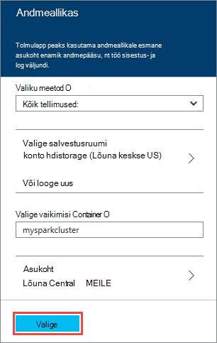

8. Valige **Sõlm hinnad astme** sõlmed, mis luuakse see kohta teabe kuvamiseks. Kui te ei tea, et peate suuremat kobar, jätke töötaja sõlmed arvu vaikimisi `4`. Prognoositud kulud klaster kuvatakse tera sees.

    > [AZURE.NOTE] Vajadusel uuesti suuruse hiljem portaali kaudu klaster (kobar -> Sätted -> skaala kobar) suurendamiseks või vähendamiseks töötaja sõlmed arv.  See võib olla kasulik tühikäigul alla kobar, kui ei ole kasutusel, või vajaduste suuremat tööülesannete lisamine.

    Mõned tegurid serva sõlm klaster ning sõlmed andmete sortimisel arvesse võtma järgmised.  
   
    - Jaotatud R Server analüüside säde jõudlus on proportsionaalne töötaja sõlmed arvu, kui andmed on suur.  
    - R Server analüüse on lineaarne andmed on analüüsitud suurust. Näiteks:  
        - Väike mõõdukas andmeid, saab jõudluse parim, kui kohalik Arvuta kontekstis serva sõlme analüüsida.  Stsenaariumid, mille kohta lisateabe saamiseks kohalik ja säde Arvuta kontekstides toimivad kõige paremini teemast Arvuta kontekstis suvandite R Server Hdinsightiga. 
        - Kui serva sõlm sisse logida ja käivitada oma R skripti, siis kõik, kuid mastaabimuundur rx-funktsioonide käivitatakse <strong>kohalikult</strong> serva sõlme nii mälu ja arvu valdkond serva sõlme tuleks suurusega vastavalt sellele. Sama kehtib juhul, kui kasutate R Server HDI nimega remote Arvuta kontekstis sülearvutist.
    
    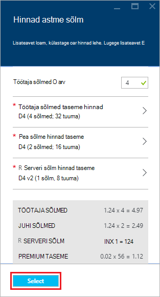

    **Valige** nupu abil saate salvestada sõlme hinnad konfigureerimine.
    
9. Enne **Uue Hdinsightiga kobar** , veenduge, et valitud oleks **Startboard Kinnita** ja seejärel nuppu **Loo**. See loob klaster ja seda paani lisamine oma Azure portaali Startboard. Ikoon näitab, et klaster loob ja muudab Hdinsightiga ikooni kuvamise pärast loomine on lõpule viidud.

  	| Loomisel | Täieliku loomine |
  	| ------------------ | --------------------- |
  	|  |  |

    > [AZURE.NOTE] Kulub aega kobar luuakse tavaliselt umbes 15 minutit. Kasutada paani soovitud Startboard või klõpsake lehe vasakus servas **teatised** kirje loomisprotsessi kontrollida.

## Ühenduse loomine R Server serva sõlm

Ühendada R Server serva sõlme Hdinsightiga klaster SSH abil.

    ssh USERNAME@r-server.CLUSTERNAME-ssh.azurehdinsight.net
    
> [AZURE.NOTE] Samuti võite leida selle `R-Server.CLUSTERNAME-ssh.azurehdinsight.net` aadress, valides kobar, siis __Kõik sätted__, __rakendused__ja __RServer__Azure'i portaalis. See kuvab serva sõlm SSH lõpp-punkti teave.
>
> 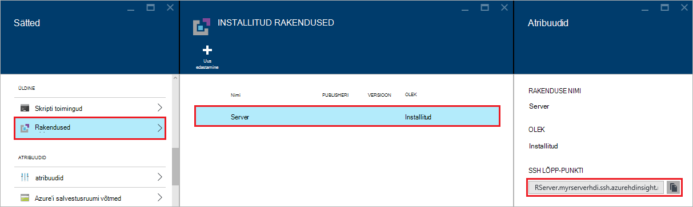
    
Kui kasutasite konto SSH kasutaja parooli, palutakse teil sisestada. Kui kasutasite avalik võti, peate kasutama funktsiooni `-i` parameetri määrama kattuvad privaatvõti. Näiteks `ssh -i ~/.ssh/id_rsa USERNAME@R-Server.CLUSTERNAME-ssh.azurehdinsight.net`.
    
Lisateavet kasutades SSH Linux-põhine Hdinsightiga leiate järgmistest artiklitest:

* [Kasutada SSH Linux-põhine Hadoopi Hdinsightiga Linux, Unix või OS X](hdinsight-hadoop-linux-use-ssh-unix.md)

* [Kasutada SSH Linux-põhine Hadoopi Windows Hdinsightiga](hdinsight-hadoop-linux-use-ssh-windows.md)

Kui ühendus on loodud, saate järgmine viip jõudma.

    username@ed00-myrser:~$

## R konsooli kasutamine

1. SSH seansi, kasutage alustamiseks R konsooli järgmine käsk.

        R
    
    Kuvatakse väljund sarnaneb järgmisega.
    
        R version 3.2.2 (2015-08-14) -- "Fire Safety"
        Copyright (C) 2015 The R Foundation for Statistical Computing
        Platform: x86_64-pc-linux-gnu (64-bit)

        R is free software and comes with ABSOLUTELY NO WARRANTY.
        You are welcome to redistribute it under certain conditions.
        Type 'license()' or 'licence()' for distribution details.

        Natural language support but running in an English locale

        R is a collaborative project with many contributors.
        Type 'contributors()' for more information and
        'citation()' on how to cite R or R packages in publications.

        Type 'demo()' for some demos, 'help()' for on-line help, or
        'help.start()' for an HTML browser interface to help.
        Type 'q()' to quit R.

        Microsoft R Server version 8.0: an enhanced distribution of R
        Microsoft packages Copyright (C) 2016 Microsoft Corporation

        Type 'readme()' for release notes.

        >

2. Kaudu soovitud `>` kiire, R koodi võite sisestada. R server sisaldab pakettide, mille abil saate hõlpsasti suhelda Hadoopi ja käivitage jaotatud arvutuste. Näiteks vaadata jaoks Hdinsightiga kobar failisüsteemi juurkaustas järgmise käsu abil.

        rxHadoopListFiles("/")
    
    Saate kasutada ka WASB laadi adressaatide valimiseks.
    
        rxHadoopListFiles("wasbs:///")

## HDI serveri eksemplari Microsoft R serveri või Microsoft R kliendi R serveri kasutamine

Jaotise kohal avaliku/era võtme paari klaster juurdepääsu kasutamise kohta on võimalik häälestamise juurdepääsu HDI Hadoopi säde Arvuta konteksti serveri eksemplari Microsoft R serveri või Microsoft R klient töötab lauaarvutis või sülearvutis (vt Hadoopi kliendi online [RevoScaleR Hadoopi säde kasutusjuhend](https://msdn.microsoft.com/microsoft-r/scaler-spark-getting-started)osas [on säde arvutada tausta loomiseks](https://msdn.microsoft.com/microsoft-r/scaler-spark-getting-started#creating-a-compute-context-for-spark) Microsoft R serveri abil).  Selleks on vaja määrata järgmised suvandid on RxSpark määratlemisel arvutada kontekstis oma sülearvutis: hdfsShareDir, shareDir, sshUsername, sshHostname, sshSwitches, ja sshProfileScript. Näiteks:

    
    myNameNode <- "default"
    myPort <- 0 
 
    mySshHostname  <- 'rkrrehdi1-ssh.azurehdinsight.net'  # HDI secure shell hostname
    mySshUsername  <- 'remoteuser'# HDI SSH username
    mySshSwitches  <- '-i /cygdrive/c/Data/R/davec'   # HDI SSH private key
 
    myhdfsShareDir <- paste("/user/RevoShare", mySshUsername, sep="/")
    myShareDir <- paste("/var/RevoShare" , mySshUsername, sep="/")
 
    mySparkCluster <- RxSpark(
      hdfsShareDir = myhdfsShareDir,
      shareDir     = myShareDir,
      sshUsername  = mySshUsername,
      sshHostname  = mySshHostname,
      sshSwitches  = mySshSwitches,
      sshProfileScript = '/etc/profile',
      nameNode     = myNameNode,
      port         = myPort,
      consoleOutput= TRUE
    )

    
 
## Arvuta konteksti kasutamine

Arvuta kontekstis võimaldab teil määrata, kas arvutus tehakse kohalikult serva sõlme, või kas see jagatakse Hdinsightiga klaster sõlmed üle.
        
1. R konsool, kasutage järgmist näidisandmetega laadimiseks vaikimisi salvestusruumi Hdinsightiga jaoks.

        # Set the HDFS (WASB) location of example data
        bigDataDirRoot <- "/example/data"
        # create a local folder for storaging data temporarily
        source <- "/tmp/AirOnTimeCSV2012"
        dir.create(source)
        # Download data to the tmp folder
        remoteDir <- "http://packages.revolutionanalytics.com/datasets/AirOnTimeCSV2012"
        download.file(file.path(remoteDir, "airOT201201.csv"), file.path(source, "airOT201201.csv"))
        download.file(file.path(remoteDir, "airOT201202.csv"), file.path(source, "airOT201202.csv"))
        download.file(file.path(remoteDir, "airOT201203.csv"), file.path(source, "airOT201203.csv"))
        download.file(file.path(remoteDir, "airOT201204.csv"), file.path(source, "airOT201204.csv"))
        download.file(file.path(remoteDir, "airOT201205.csv"), file.path(source, "airOT201205.csv"))
        download.file(file.path(remoteDir, "airOT201206.csv"), file.path(source, "airOT201206.csv"))
        download.file(file.path(remoteDir, "airOT201207.csv"), file.path(source, "airOT201207.csv"))
        download.file(file.path(remoteDir, "airOT201208.csv"), file.path(source, "airOT201208.csv"))
        download.file(file.path(remoteDir, "airOT201209.csv"), file.path(source, "airOT201209.csv"))
        download.file(file.path(remoteDir, "airOT201210.csv"), file.path(source, "airOT201210.csv"))
        download.file(file.path(remoteDir, "airOT201211.csv"), file.path(source, "airOT201211.csv"))
        download.file(file.path(remoteDir, "airOT201212.csv"), file.path(source, "airOT201212.csv"))
        # Set directory in bigDataDirRoot to load the data into
        inputDir <- file.path(bigDataDirRoot,"AirOnTimeCSV2012") 
        # Make the directory
        rxHadoopMakeDir(inputDir)
        # Copy the data from source to input
        rxHadoopCopyFromLocal(source, bigDataDirRoot)

2. Järgmiseks loome mõned andmed teave ja määratleda kahe andmeallikate, et töötame andmed.

        # Define the HDFS (WASB) file system
        hdfsFS <- RxHdfsFileSystem()
        # Create info list for the airline data
        airlineColInfo <- list(
            DAY_OF_WEEK = list(type = "factor"),
            ORIGIN = list(type = "factor"),
            DEST = list(type = "factor"),
            DEP_TIME = list(type = "integer"),
            ARR_DEL15 = list(type = "logical"))

        # get all the column names
        varNames <- names(airlineColInfo)

        # Define the text data source in hdfs
        airOnTimeData <- RxTextData(inputDir, colInfo = airlineColInfo, varsToKeep = varNames, fileSystem = hdfsFS)
        # Define the text data source in local system
        airOnTimeDataLocal <- RxTextData(source, colInfo = airlineColInfo, varsToKeep = varNames)

        # formula to use
        formula = "ARR_DEL15 ~ ORIGIN + DAY_OF_WEEK + DEP_TIME + DEST"

3. Vaatame käivitada logistilise regressiooni kohalikud andmed üle arvutada kontekstis.

        # Set a local compute context
        rxSetComputeContext("local")
        # Run a logistic regression
        system.time(
            modelLocal <- rxLogit(formula, data = airOnTimeDataLocal)
        )
        # Display a summary 
        summary(modelLocal)

    Peaksite nägema väljundit, mis lõpeb read, mis sarnaneb järgmisega.

        Data: airOnTimeDataLocal (RxTextData Data Source)
        File name: /tmp/AirOnTimeCSV2012
        Dependent variable(s): ARR_DEL15
        Total independent variables: 634 (Including number dropped: 3)
        Number of valid observations: 6005381
        Number of missing observations: 91381
        -2*LogLikelihood: 5143814.1504 (Residual deviance on 6004750 degrees of freedom)

        Coefficients:
                        Estimate Std. Error z value Pr(>|z|)
        (Intercept)   -3.370e+00  1.051e+00  -3.208  0.00134 **
        ORIGIN=JFK     4.549e-01  7.915e-01   0.575  0.56548
        ORIGIN=LAX     5.265e-01  7.915e-01   0.665  0.50590
        ......
        DEST=SHD       5.975e-01  9.371e-01   0.638  0.52377
        DEST=TTN       4.563e-01  9.520e-01   0.479  0.63172
        DEST=LAR      -1.270e+00  7.575e-01  -1.676  0.09364 .
        DEST=BPT         Dropped    Dropped Dropped  Dropped
        ---
        Signif. codes:  0 ‘***’ 0.001 ‘**’ 0.01 ‘*’ 0.05 ‘.’ 0.1 ‘ ’ 1

        Condition number of final variance-covariance matrix: 11904202
        Number of iterations: 7

4. Vaatame käivitada sama logistilise regressiooni, kasutades säde konteksti edasi. Säde konteksti jaotab töötlemise üle töötaja sõlmed Hdinsightiga kobar.

        # Define the Spark compute context 
        mySparkCluster <- RxSpark()
        # Set the compute context 
        rxSetComputeContext(mySparkCluster)
        # Run a logistic regression 
        system.time(  
            modelSpark <- rxLogit(formula, data = airOnTimeData)
        )
        # Display a summary
        summary(modelSpark)

    > [AZURE.NOTE] MapReduce abil saate levitada arvutus kobar sõlmed üle. Arvuta konteksti kohta leiate lisateavet teemast [kontekstis suvandite R Server Hdinsightiga Premium arvutada](hdinsight-hadoop-r-server-compute-contexts.md).

## Mitme sõlmed R koodi levitamine

R serveris saate teha R kood ja käivitage üle mitme sõlmed klaster abil `rxExec`. See on kasulik, kui parameeter Korrasta või simulatsioonid. Järgmine on näide sellest, kuidas kasutada `rxExec`.

    rxExec( function() {Sys.info()["nodename"]}, timesToRun = 4 )
    
Kui kasutate säde või MapReduce konteksti, taastatakse nodename väärtus töötaja sõlmed mis koodi (`Sys.info()["nodename"]`) on oli. Näiteks neli sõlm kobar, võidakse kuvada järgmine väljund.

    $rxElem1
        nodename
    "wn3-myrser"

    $rxElem2
        nodename
    "wn0-myrser"

    $rxElem3
        nodename
    "wn3-myrser"

    $rxElem4
        nodename
    "wn3-myrser"

## R-pakettide installimine

Kui soovite installida serva sõlme R pakette, saate kasutada `install.packages()` otse jooksul R console kui seotud SSH sõlm serva. Juhul, kui teil on vaja installida R pakettide töötaja sõlmed klaster, peate kasutama skripti toimingu.

Skripti toimingud on Bash skripte Hdinsightiga kobar konfiguratsiooni muudatuste tegemiseks või täiendavat tarkvara installimiseks kasutatud. Sel juhul installida täiendavad R paketid. Installimiseks pakette skripti toimingu abil, siis tehke järgmist.

> [AZURE.IMPORTANT] Skripti toimingute kasutamine installimiseks R pakette saab kasutada ainult pärast klaster loomist. See ei tohi kasutada kobar loomise ajal kui skripti tugineb R Server täielikult installinud ja konfigureerinud.

1. [Azure'i portaalis](https://portal.azure.com), valige oma R Server Hdinsightiga kobar.

2. Valige keelest kobar __Kõik sätted__ja seejärel valige __Skripti toimingud__. Keelest __Skripti toimingud__ valige __Esitada uue__ esitada uue skripti toimingu.

    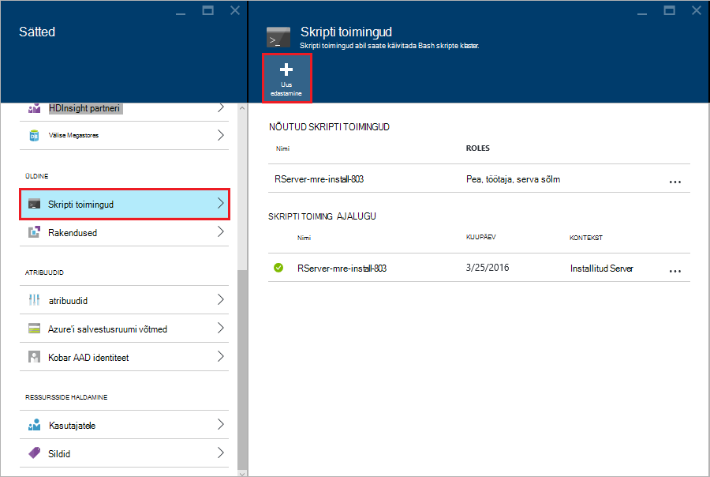

3. __Edasta skripti toimingu__ keelest, sisestage järgmine teave.

  - __Nimi__: sõbralik nimi selle skripti tuvastamiseks
  - __Bash skripti URI__:`http://mrsactionscripts.blob.core.windows.net/rpackages-v01/InstallRPackages.sh`
  - __Juht__: see peaks olema __märkimata__
  - __Töötaja__: see peaks olema __märgitud__
  - __Zookeeper__: see peaks olema __märkimata__
  - __Parameetrite__: The R pakettide installimiseks. Näiteks`bitops stringr arules`
  - __Persist skripti..__: see peaks olema __märgitud__  

    > [AZURE.NOTE] 1. vaikimisi kõik R paketid on installitud Microsoft MRAN hoidla ühtsete R Server, mis on installitud versiooniga hetktõmmise kaudu.  Kui soovite installida pakettide uuemad versioonid, siis on mõned riski ühildamatus, kuid see on võimalik, määrates `useCRAN` nagu esimene element paketi loend, nt  `useCRAN bitops, stringr, arules`.  
    > 2. Mõned R paketid on vaja Linuxi süsteemi teeke. Mugavuse huvides me eelnevalt installitud sõltuvuste nõutud ülemisel 100 populaarsemaid R paketid. Siiski kui installite R pakett või paketid nõuavad lisaks need teegid, siis peab siin kasutatud base skripti alla laadida ja lisada süsteemi teekide installimise juhiseid. Peate muudetud skripti üleslaadimine avalikule bloobimälu container Azure laos ja installige paketid muudetud skripti abil.
    > Lisateavet skripti tegevusi [skripti toimingu areng](hdinsight-hadoop-script-actions-linux.md).  

    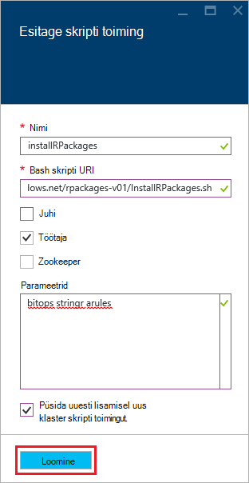

4. Valige __Loo__ skripti käivitamiseks. Kui skripti lõpule jõudnud, R paketid on saadaval kõigi töötaja sõlmed.
    
## Järgmised sammud

Nüüd, kui teil mõista, kuidas luua uus Hdinsightile klaster, mis sisaldab R Server ja olulisema teabe R konsooli SSH seanss, kasutage järgmist muude viiside töötamise Hdinsightiga R serveris.

- [Hdinsightiga premium RStudio serveri lisamine](hdinsight-hadoop-r-server-install-r-studio.md)

- [Arvutage kontekstis suvandite R Server Hdinsightiga Premium](hdinsight-hadoop-r-server-compute-contexts.md)

- [Azure'i talletamise võimalused R Server Hdinsightiga premium](hdinsight-hadoop-r-server-storage.md)

### Azure'i ressursihaldur Mallid

Kui olete huvitatud automatiseerimine R Server Azure'i ressursihaldur mallide kasutamine Hdinsightiga loomine, lugege teemat näiteks järgmised mallid.

* [Luua serveriks R Hdinsightiga kobar abil on SSH avalik võti](http://go.microsoft.com/fwlink/p/?LinkID=780809)
* [Luua serveriks R Hdinsightiga kobar on SSH parooli abil](http://go.microsoft.com/fwlink/p/?LinkID=780810)

Nii Mallid luua uue Hdinsightiga kobar ja seotud salvestusruumi konto ja saab kasutada Azure CLI, Azure PowerShelli või Azure'i portaal.

Üldise Azure'i ressursihaldur mallide kasutamise kohta leiate teemast [loomine Linux-põhine Hadoopi le Hdinsightiga Azure ressursihaldur mallide kasutamine](hdinsight-hadoop-create-linux-clusters-arm-templates.md).
