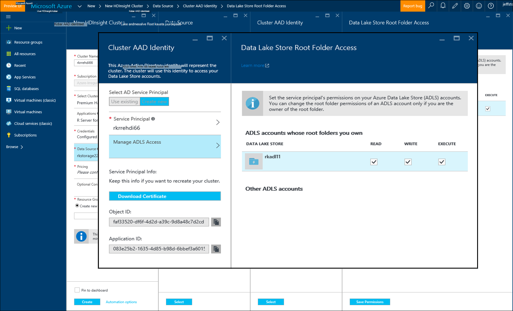

<properties
   pageTitle="Azure'i talletamise võimalused R Server (eelvaade) Hdinsightiga | Microsoft Azure'i"
   description="Lisateavet erinevate salvestusruumi jaoks saadaolevad suvandid kasutajatele R serveriga Hdinsightiga (eelvaade)"
   services="HDInsight"
   documentationCenter=""
   authors="jeffstokes72"
   manager="jhubbard"
   editor="cgronlun"
/>

<tags
   ms.service="HDInsight"
   ms.devlang="R"
   ms.topic="article"
   ms.tgt_pltfrm="na"
   ms.workload="data-services"
   ms.date="09/01/2016"
   ms.author="jeffstok"
/>

# <a name="azure-storage-options-for-r-server-on-hdinsight-preview"></a>Azure'i talletamise võimalused R Server Hdinsightiga (eelvaade)

Microsoft R Server (eelvaade) Hdinsightiga on juurdepääs nii Azure'i bloobimälu ja [Azure andmesalv Lake](https://azure.microsoft.com/services/data-lake-store/), püsib andmete koodi, mille abil tulemuseks analüüsi objektid jne.

Hadoopi kobar loomisel Hdinsightiga teie määratud Azure storage konto. Teatud bloobimälu salvestusruumi container sellelt kontolt hoiab loomist (nt Hadoopi hajutatud failisüsteemi) klaster failisüsteemis. Jõudluse huvides luuakse Hdinsightiga kobar sama andmekeskuse esmased konto teie määratud. Lisateabe saamiseks vt [kasutamine Azure'i bloobimälu Hdinsightiga](hdinsight-hadoop-use-blob-storage.md "kasutamine Azure'i bloobimälu Hdinsightiga").   


## <a name="use-multiple-azure-blob-storage-accounts"></a>Kasutage mitme Azure'i bloobimälu salvestusruumi kontod

Vajaduse korral võimaldab juurdepääsu mitme Azure'i salvestusruumi kontod või ümbriste HDI klaster. Selleks, peate määrama täiendavat salvestusruumi kontod UI, kui loote klaster, ja seejärel tehke R. kasutamine  

1.  Saate luua mõne Hdinsightiga kobar salvestusruumi konto nimi ja **storage1** vaikimisi container, nimetatakse **container1**.
2. Määrake konto täiendav salvestusruum nimetatakse **storage2**.  
3. Kopeerige fail mycsv.csv Share kataloogi ja analüüsi sooritada faili.  

    ````
    hadoop fs –mkdir /share
    hadoop fs –copyFromLocal myscsv.scv /share  
    ````

3.  R-koodi **vaikimisi** seatud sõlme nimi ja seadke oma kataloogi ja faili töötlemiseks.  

    ````
    myNameNode <- "default"
    myPort <- 0
    ````

  Andmete asukoht:  

    bigDataDirRoot <-"/ ühiskasutus"  

  Säde Arvuta kontekstis määratlemine

    mySparkCluster <-RxSpark(consoleOutput=TRUE)

  Arvuta konteksti seadmiseks tehke järgmist.

    rxSetComputeContext(mySparkCluster)

  Hadoopi jaotatud faili süsteemi (HDFS) failisüsteemi määratlemine

    hdfsFS <-RxHdfsFileSystem (hostName = myNameNode port = myPort)

  Määrake Sisestuskeel faili HDFS analüüsida.

    Sisendfail <-file.path(bigDataDirRoot,"mycsv.csv")

Valige kogu viiteid kataloogi ja faili salvestusruumi konto wasbs://container1@storage1.blob.core.windows.net. See on **vaikimisi salvestusruumi konto** seostatud Hdinsightiga kobar.

Nüüd Oletame, et soovite töödelda fail nimega mySpecial.csv, mis asub selle /private kataloog **container2** **storage2**sisse.

R koodi, osutage **storage2** salvestusruumi konto nimi sõlm viide.

    myNameNode <- "wasbs://container2@storage2.blob.core.windows.net"
    myPort <- 0

  Andmete asukoht:

    bigDataDirRoot <- "/private"

  Säde Arvuta kontekstis määratlemine

    mySparkCluster <- RxSpark(consoleOutput=TRUE, nameNode=myNameNode, port=myPort)

  Arvuta konteksti seadmiseks tehke järgmist.

    rxSetComputeContext(mySparkCluster)

  Määratlege HDFS failisüsteemis.

    hdfsFS <- RxHdfsFileSystem(hostName=myNameNode, port=myPort)

  Määrake Sisestuskeel faili HDFS analüüsida.

    inputFile <-file.path(bigDataDirRoot,"mySpecial.csv")

Nüüd valige kogu viiteid kataloogi ja faili salvestusruumi konto wasbs://container2@storage2.blob.core.windows.net. See on **Nimi sõlm** määratud.

Teate, et on teil konfigureerida planeerimist/RevoShare/<SSH username> kataloogi **storage2** järgmiselt:

    hadoop fs -mkdir wasbs://container2@storage2.blob.core.windows.net/user
    hadoop fs -mkdir wasbs://container2@storage2.blob.core.windows.net/user/RevoShare
    hadoop fs -mkdir wasbs://container2@storage2.blob.core.windows.net/user/RevoShare/<RDP username>

## <a name="use-an-azure-data-lake-store"></a>Azure'i andmed Lake poest kasutamine

Andmete Lake salvestab teie HDInsight konto kasutamiseks peate oma kobar juurdepääsu andmine iga Azure'i andmed Lake poe, mida soovite kasutada. Kasutate pood R skripti palju nagu kasutate teisene salvestusruumi kontot (nagu on kirjeldatud eelmise toimingu).

## <a name="add-cluster-access-to-your-azure-data-lake-stores"></a>Azure'i andmed Lake salvestab teie kobar juurdepääsu lisamine

Pääsete andmete Lake poe Azure Active Directory (Azure AD) teenuse põhilise, mis on seotud klaster Hdinsightiga abil.

### <a name="to-add-a-service-principal"></a>Teenuse põhisumma lisamine
1. Hdinsightiga klaster loomisel valida **Kobar AAD identiteedi** **Andmeallika** menüü.
2. Valige dialoogiboksis **Kobar AAD identiteedi** **Valige AD teenuse põhilise**, klõpsake jaotises **Loo uus**.

Anda teenuse põhilise nime ja parooli loomiseks, avatakse uus vahekaart, kus saate oma andmeid Lake poed teenuse põhilise seostada.

Teate, et võite sisestada ka Accessi andmed Lake Store hiljem, avades andmete Lake poe Azure portaali **Andmete Explorer**läheb > **juurdepääsu**.  Järgmine on näide dialoogiboks, mis näitab, kuidas luua teenuse põhisumma ja seostada "rkadl11" andmete Lake pood.




## <a name="use-the-data-lake-store-with-r-server"></a>Andmete Lake poe R serveri abil
Kui olete andnud juurdepääsu andmete Lake salvestada, saate kasutada poe R serveri Hdinsightiga nii, nagu teeksite teisene Azure storage konto. Ainus erinevus on see, et eesliite **wasb: / /** muutub **adl: / /** järgmiselt:

````
# Point to the ADL store (e.g. ADLtest)
myNameNode <- "adl://rkadl1.azuredatalakestore.net"
myPort <- 0

# Location of the data (assumes a /share directory on the ADL account)
bigDataDirRoot <- "/share"  

# Define Spark compute context
mySparkCluster <- RxSpark(consoleOutput=TRUE, nameNode=myNameNode, port=myPort)

# Set compute context
rxSetComputeContext(mySparkCluster)

# Define HDFS file system
hdfsFS <- RxHdfsFileSystem(hostName=myNameNode, port=myPort)

# Specify the input file in HDFS to analyze
inputFile <-file.path(bigDataDirRoot,"AirlineDemoSmall.csv")

# Create factors for days of the week
colInfo <- list(DayOfWeek = list(type = "factor",
               levels = c("Monday", "Tuesday", "Wednesday", "Thursday",
                          "Friday", "Saturday", "Sunday")))

# Define the data source
airDS <- RxTextData(file = inputFile, missingValueString = "M",
                    colInfo  = colInfo, fileSystem = hdfsFS)

# Run a linear regression
model <- rxLinMod(ArrDelay~CRSDepTime+DayOfWeek, data = airDS)
````

Järgnevalt on käske, mida kasutatakse andmete Lake salvestusruumi konto konfigureerimine RevoShare kataloogis ja lisada CSV-näidisfaili eelmises näites.

````
hadoop fs -mkdir adl://rkadl1.azuredatalakestore.net/user
hadoop fs -mkdir adl://rkadl1.azuredatalakestore.net/user/RevoShare
hadoop fs -mkdir adl://rkadl1.azuredatalakestore.net/user/RevoShare/<user>

hadoop fs -mkdir adl://rkadl1.azuredatalakestore.net/share

hadoop fs -copyFromLocal /usr/lib64/R Server-7.4.1/library/RevoScaleR/SampleData/AirlineDemoSmall.csv adl://rkadl1.azuredatalakestore.net/share

hadoop fs –ls adl://rkadl1.azuredatalakestore.net/share
````

## <a name="use-azure-files-on-the-edge-node"></a>Azure'i failide serva sõlme kasutamine

On ka mugav andmete salvestusruumi suvand kasutamiseks serva sõlm nimega [Azure'i failide](../storage/storage-how-to-use-files-linux.md "Azure'i failid"). See võimaldab teil Azure Storage failikettale, Linuxi failisüsteemi ühendada. See võib olla mugav andmefailid, R skripte ja tulem objekte, mis võib olla vaja hiljem, kui on mõistlik kasutada kohalikke failisüsteemi sõlm serva, mitte HDFS talletamiseks.

Suur kasu Azure'i faile, mis on faili osade saate ühendada ja kasutada mis tahes süsteemi, mis on toetatud OS, nt Windowsi või Linuxi. Näiteks saate kasutada teise Hdinsightiga kobar, mille teie või keegi teie meeskond on, on Azure VM või isegi mõni kohapealse süsteemi abil.


## <a name="next-steps"></a>Järgmised sammud

Nüüd, kui põhitõdesid kasutamine R konsooli SSH seanss ja kuidas luua uus Hdinsightiga klaster, mis sisaldab R Server, abil järgmisi linke muude viiside töötamise Hdinsightiga R serveris.

- [R Server Hdinsightiga ülevaade](hdinsight-hadoop-r-server-overview.md)
- [R server Hadoopi kasutamise alustamine](hdinsight-hadoop-r-server-get-started.md)
- [Hdinsightiga premium RStudio serveri lisamine](hdinsight-hadoop-r-server-install-r-studio.md)
- [Arvutage kontekstis Hdinsightile R-serveri suvandid](hdinsight-hadoop-r-server-compute-contexts.md)
