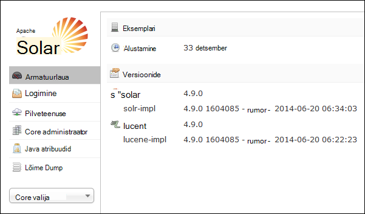
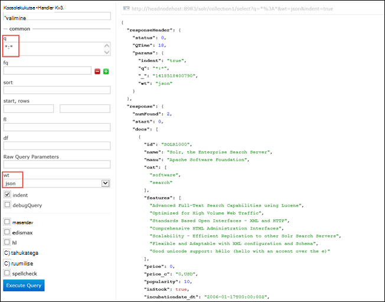

<properties
    pageTitle="Skripti toimingu abil saate installida Solri Linux-põhine Hdinsightiga | Microsoft Azure'i"
    description="Saate teada, kuidas installida Solri Linux-põhine Hdinsightiga Hadoopi kogumite skripti toimingute kasutamine."
    services="hdinsight"
    documentationCenter=""
    authors="Blackmist"
    manager="jhubbard"
    editor="cgronlun"
    tags="azure-portal"/>

<tags
    ms.service="hdinsight"
    ms.workload="big-data"
    ms.tgt_pltfrm="na"
    ms.devlang="na"
    ms.topic="article"
    ms.date="10/03/2016"
    ms.author="larryfr"/>

# Installimine ja kasutamine Solri Hdinsightiga Hadoopi kogumite

Selles teemas saate teada, kuidas installida Windows Azure Hdinsightiga Solri skripti toimingu abil. Solri on võimas otsing platvorm ja ettevõtte tasemel otsida võimalusi pakub haldab Hadoopi andmete põhjal. Kui teil on installitud Solri Hdinsightiga kobar, saate ka teada, kuidas andmeid otsida Solri abil.

> [AZURE.NOTE] Juhised selle dokumendi jaoks on vaja Linuxi-põhiste Hdinsightiga kobar. Windowsi-põhiste kobar Solri kasutamise kohta leiate teemast [installimine ja kasutamine Solri klõpsake Hdinsightiga Hadoopi kogumite (Windows)](hdinsight-hadoop-solr-install.md)

Selles teemas kasutatud skripti näide loob Solri kobar konkreetse konfiguratsiooni. Kui soovite konfigureerida Solri kobar erinevate saidikogumid, shards skeemid, koopiad jne, peate muutma skripte ja Solri kahendfaile vastavalt sellele.

## Mis on Solri?

[Apache Solri](http://lucene.apache.org/solr/features.html) on ettevõtte otsing platvorm, mis võimaldab võimsaid otsingu andmete põhjal. Kuigi Hadoopi võimaldab talletamine ja suure hulga andmete haldamine, pakub Apache Solri otsinguvõimalusi andmete toomiseks. Selles teemas antakse juhiseid kohta, kuidas kohandada mõne Hdinsightiga kobar Solri installimiseks.

> [AZURE.WARNING] Koos Hdinsightiga kobar komponendid on täielikult toetatud ja Microsoft Support aitab eristada ja nende komponentide seotud probleemide lahendamiseks.
>
> Kohandatud komponendid, nt Solri, tugiteenuseid äriliselt mõistlik aidata teil selle probleemi tõrkeotsingu sooritamiseks. See võib põhjustada probleemi lahendamine või palub teil otsimist ja avatud allika tehnoloogiad, kui leitakse sügav teadmised selle tehnoloogia. Näiteks on palju kogukonnafoorumi saite, mida saab kasutada, nt: [MSDN-i Foorum Hdinsightiga](https://social.msdn.microsoft.com/Forums/azure/en-US/home?forum=hdinsight), [http://stackoverflow.com](http://stackoverflow.com). Ka Apache projektide on projekti saitidel [http://apache.org](http://apache.org), näiteks: [Hadoopi](http://hadoop.apache.org/).

## Mida tähendab skript

See skript muudab Hdinsightiga klaster järgmisi muudatusi:

* Installib Solri sisse`/usr/hdp/current/solr`
* Luuakse uus kasutaja, __solrusr__, mida kasutatakse Solri teenuse käivitamine
* Määrab __solruser__ omanikuna`/usr/hdp/current/solr`
* Lisab [Upstart](http://upstart.ubuntu.com/) konfiguratsiooni, mis käivitab Solri kui kobar sõlm taaskäivitamist. Kobar sõlmed Solri käivitatakse automaatselt ka pärast installimist

## Installige Solri skripti toimingute kasutamine

Proovi skripti Solri installimiseks on Hdinsightiga kobar on saadaval järgmises asukohas.

    https://hdiconfigactions.blob.core.windows.net/linuxsolrconfigactionv01/solr-installer-v01.sh

Selles jaotises antakse juhiseid kohta, kuidas kasutada valimi skripti, kui loote uue kobar Azure portaali kaudu. 

> [AZURE.NOTE] Azure'i PowerShelli, Azure'i CLI, Hdinsightiga .NET SDK või Azure ressursihaldur malle saab kasutada skripti toimingute. Saate rakendada ka skripti toimingud juba töötab kogumite. Lisateabe saamiseks vt [kohandamine Hdinsightiga kogumite skripti toimingute](hdinsight-hadoop-customize-cluster-linux.md).

1. Alustage ettevalmistamise klaster juhiste abil [säte Linux-põhine Hdinsightiga](hdinsight-hadoop-create-linux-clusters-portal.md)rühmades, kuid täitke ettevalmistamise.

2. **Valikuline konfigureerimine** enne, valige **Skripti toimingud**ja allolev teave:

    * __Nimi__: sisestage skripti toimingu sõbralik nimi.
    * __Skripti URI__: https://hdiconfigactions.blob.core.windows.net/linuxsolrconfigactionv01/solr-installer-v01.sh
    * __Juht__: märkige see ruut
    * __Töötaja__: märkige see ruut
    * __ZOOKEEPER__: märkige see suvand, et installida Zookeeper sõlme
    * __Parameetrite__: jätke see väli tühjaks

3. **Skripti toimingud**allosas kasutada konfiguratsiooni salvestamiseks **Valige** nupp. Lõpuks nuppu **Valige** **Valikuline konfigureerimine** tera allosas salvestamiseks kasutage valikuline konfiguratsiooniteavet.

4. Jätkake ettevalmistamise klaster, nagu on kirjeldatud [sätte Linux-põhine Hdinsightiga](hdinsight-hadoop-create-linux-clusters-portal.md)rühmades.

## Kuidas kasutada Solri Hdinsightiga?

### Andmete indekseerimine

Peab algama indekseerimine Solri mõned andmefailid. Seejärel saate Solri käivitamiseks otsingupäringuid indekseeritud andmete põhjal. Järgmiste juhiste abil saate lisada Solri mõned näidisandmed ja seejärel selle päringu.

1. Ühendada Hdinsightiga klaster SSH abil.

        ssh USERNAME@CLUSTERNAME-ssh.azurehdinsight.net

    Hdinsightiga SSH kasutamise kohta lisateabe saamiseks vt järgmist:

    * [Kasutada SSH Linux-põhine Hadoopi Hdinsightiga Linux, Unix või OS X](hdinsight-hadoop-linux-use-ssh-unix.md)

    * [Kasutada SSH Linux-põhine Hadoopi Windows Hdinsightiga](hdinsight-hadoop-linux-use-ssh-windows.md)

    > [AZURE.IMPORTANT] Juhised hiljem selle dokumendi kasutama, on SSL-i tunneliga ühendust Solri veebisaidi kasutajaliides. Kasutage neid juhiseid, peate mõne SSL-i tunneliga luua ja konfigureerimist brauseri seda kasutada.
    >
    > Lisateabe saamiseks lugege teemat [kasutamine SSH Tunneling Ambari web UI, ResourceManager, JobHistory, NameNode, Oozie, ja muud web UI's](hdinsight-linux-ambari-ssh-tunnel.md)

2. Saate kasutada järgmisi käske Näidisandmete Solri indeks on:

        cd /usr/hdp/current/solr/example/exampledocs
        java -jar post.jar solr.xml monitor.xml

    Kuvatakse järgmine väljund konsooli.

        POSTing file solr.xml
        POSTing file monitor.xml
        2 files indexed.
        COMMITting Solr index changes to http://localhost:8983/solr/update..
        Time spent: 0:00:01.624

    Post.jar kasuliku indeksite Solri kahe valimi dokumente, **solr.xml** ja **monitor.xml**. Need salvestatakse __collection1__ Solri sees.

3. Kasutada järgmist päringu esitatud Solri REST API-ga.

        curl "http://localhost:8983/solr/collection1/select?q=*%3A*&wt=json&indent=true"

    See probleemid päring __collection1__ mis tahes sobivate dokumentide __ \*:\* __ (kodeeritud \*3%\* päringu stringi,) ja mille vastus tuleks tagastada siis, kui JSON. Vastuse peaks kuvatama umbes järgmine:

            "response": {
                "numFound": 2,
                "start": 0,
                "maxScore": 1,
                "docs": [
                  {
                    "id": "SOLR1000",
                    "name": "Solr, the Enterprise Search Server",
                    "manu": "Apache Software Foundation",
                    "cat": [
                      "software",
                      "search"
                    ],
                    "features": [
                      "Advanced Full-Text Search Capabilities using Lucene",
                      "Optimized for High Volume Web Traffic",
                      "Standards Based Open Interfaces - XML and HTTP",
                      "Comprehensive HTML Administration Interfaces",
                      "Scalability - Efficient Replication to other Solr Search Servers",
                      "Flexible and Adaptable with XML configuration and Schema",
                      "Good unicode support: héllo (hello with an accent over the e)"
                    ],
                    "price": 0,
                    "price_c": "0,USD",
                    "popularity": 10,
                    "inStock": true,
                    "incubationdate_dt": "2006-01-17T00:00:00Z",
                    "_version_": 1486960636996878300
                  },
                  {
                    "id": "3007WFP",
                    "name": "Dell Widescreen UltraSharp 3007WFP",
                    "manu": "Dell, Inc.",
                    "manu_id_s": "dell",
                    "cat": [
                      "electronics and computer1"
                    ],
                    "features": [
                      "30\" TFT active matrix LCD, 2560 x 1600, .25mm dot pitch, 700:1 contrast"
                    ],
                    "includes": "USB cable",
                    "weight": 401.6,
                    "price": 2199,
                    "price_c": "2199,USD",
                    "popularity": 6,
                    "inStock": true,
                    "store": "43.17614,-90.57341",
                    "_version_": 1486960637584081000
                  }
                ]
              }

### Armatuurlaua Solri

Armatuurlaua Solri on web kasutajaliides, mis võimaldab töötada Solri oma veebibrauseri kaudu. Armatuurlaua Solri otse internetis: Hdinsightiga klaster puudub, kuid pääseb juurde ka SSH tunneliga abil. Mõne SSH tunneliga kasutamise kohta leiate lisateavet teemast [kasutamine SSH Tunneling Ambari web UI, ResourceManager, JobHistory, NameNode, Oozie, ja muud web UI's juurde pääseda](hdinsight-linux-ambari-ssh-tunnel.md)

Kui olete loonud mõne SSH tunneliga, järgige järgmisi juhiseid Solri armatuurlaua kasutada:

1. Hosti nimi esmane headnode määratlemine

    1. Kasutage SSH ühenduse kobar port 22. Näiteks `ssh USERNAME@CLUSTERNAME-ssh.azurehdinsight.net` kus __kasutajanimi__ on teie SSH kasutajanimi ja __CLUSTERNAME__ on klaster nimi.

        SSH kasutamise kohta lisateabe saamiseks vaadake järgmisi dokumente:

        * [SSH kasutamine Linux-põhine Hdinsightiga kliendilt Linux, Unix või Mac OS X](hdinsight-hadoop-linux-use-ssh-unix.md)

        * [Windows kliendi Linux-põhine Hdinsightiga SSH kasutamine](hdinsight-hadoop-linux-use-ssh-windows.md)
    
    3. Täielikult kvalifitseeritud nimeks järgmise käsu abil:

            hostname -f

        See toob nimi umbes järgmine:

            hn0-myhdi-nfebtpfdv1nubcidphpap2eq2b.ex.internal.cloudapp.net
    
        See on hostname (hostinimi), mis tuleks kasutada järgmist.
    
1. Brauseris ühenduse __http://HOSTNAME:8983/Solri / #/__, kus __hostname (HOSTINIMI)__ on määratud eelmisi juhiseid nimi. 

    Taotluse peaks marsruutida läbi SSH tunneliga pea sõlme klaster Hdinsightiga jaoks. Peaksite nägema Järgmine leht:

    

2. Vasakpoolsel paanil **collection1**valimiseks kasutage **Core Vaateselektori** rippmenüü. Mitme kirjed peaks kuvatama nende all __collection1__.

3. Kirjete __collection1__all, valige __päring__. Kasutage otsingu lehele asustamiseks järgmised väärtused.

    * Sisestage väljale **k** ** \*:**\*. See naaseb kõik dokumendid, mis on indekseeritud Solri. Kui soovite otsida stringi teatud dokumendid, saate sisestada see string siin.

    * Valige väljal **wt** teksti vorming. Vaikimisi on **json**.

    Lõpuks nuppu **Käivitada päringu** otsing pealagi allosas.

    

    Väljund tagastab kahe dokumendid, mida kasutasime indekseerimise Solri. Väljund meenutab järgmist:

            "response": {
                "numFound": 2,
                "start": 0,
                "maxScore": 1,
                "docs": [
                  {
                    "id": "SOLR1000",
                    "name": "Solr, the Enterprise Search Server",
                    "manu": "Apache Software Foundation",
                    "cat": [
                      "software",
                      "search"
                    ],
                    "features": [
                      "Advanced Full-Text Search Capabilities using Lucene",
                      "Optimized for High Volume Web Traffic",
                      "Standards Based Open Interfaces - XML and HTTP",
                      "Comprehensive HTML Administration Interfaces",
                      "Scalability - Efficient Replication to other Solr Search Servers",
                      "Flexible and Adaptable with XML configuration and Schema",
                      "Good unicode support: héllo (hello with an accent over the e)"
                    ],
                    "price": 0,
                    "price_c": "0,USD",
                    "popularity": 10,
                    "inStock": true,
                    "incubationdate_dt": "2006-01-17T00:00:00Z",
                    "_version_": 1486960636996878300
                  },
                  {
                    "id": "3007WFP",
                    "name": "Dell Widescreen UltraSharp 3007WFP",
                    "manu": "Dell, Inc.",
                    "manu_id_s": "dell",
                    "cat": [
                      "electronics and computer1"
                    ],
                    "features": [
                      "30\" TFT active matrix LCD, 2560 x 1600, .25mm dot pitch, 700:1 contrast"
                    ],
                    "includes": "USB cable",
                    "weight": 401.6,
                    "price": 2199,
                    "price_c": "2199,USD",
                    "popularity": 6,
                    "inStock": true,
                    "store": "43.17614,-90.57341",
                    "_version_": 1486960637584081000
                  }
                ]
              }

### Käivitamine ja seiskamine Solri

Kui teil on vaja käsitsi peatamiseks või avamiseks Solar, kasutage järgmised käsud:

    sudo stop solr

    sudo start solr

## Indekseeritud varundatud andmete

Hea tava, peaksite varundama indekseeritud andmete Solri kobar üksuste sõlmi Azure'i bloobimälu kaudu. Tehke seda teha järgmist:

1. Ühenduse klaster SSH abil, siis kasutage järgmist käsku Saada pea sõlme hosti nimi:

        hostname -f
        
2. Indekseeritud andmete hetktõmmist loomiseks kasutada järgmist. Asendage tagastatud eelmise käsu nimi __hostname (HOSTINIMI)__ :

        curl http://HOSTNAME:8983/solr/replication?command=backup

    Peaksite nägema vastuse umbes järgmine:

        <?xml version="1.0" encoding="UTF-8"?>
        <response>
          <lst name="responseHeader">
            <int name="status">0</int>
            <int name="QTime">9</int>
          </lst>
          <str name="status">OK</str>
        </response>

2. Järgmiseks muuta kataloogide __/usr/hdp/current/solr/example/solr__. Alamkausta siin iga saidikogumi jaoks saab. Iga saidikogumi kataloog sisaldab __, kus on selle saidikogumi jaoks hetktõmmise andmekataloogi__ asub.

    Näiteks kui kasutasite juhiseid varem registrisse dokumentide näidised, __/usr/hdp/current/solr/example/solr/collection1/data__ kataloogi peaks nüüd sisaldama kataloogi __hetktõmmis. ###__ # 's paiknemise kuupäev ja kellaaeg hetktõmmis.

3. Tihendatud arhiivi järgmise käsu abil hetktõmmise kausta loomiseks tehke järgmist.

        tar -zcf snapshot.20150806185338855.tgz snapshot.20150806185338855

    See loob uue nimega __snapshot.20150806185338855.tgz__, mis sisaldab __snapshot.20150806185338855__ kataloogi sisu arhiivi.

3. Seejärel saate salvestada Arhiiv soovitud klaster esmane salvestusruumi abil järgmine käsk:

    Hadoopi fs - copyFromLocal snapshot.20150806185338855.tgz/näide/andmed

    > [AZURE.NOTE] Kui soovite sihtotstarbeline kausta salvestamiseks Solri hetktõmmiseid luua. Näiteks `hadoop fs -mkdir /solrbackup`.

Solri varundus ja taastab töötamise kohta leiate lisateavet teemast [tegemine ja taastamiseks SolrCores varukoopiaid](https://cwiki.apache.org/confluence/display/solr/Making+and+Restoring+Backups+of+SolrCores).

## Vt ka

- [Installimine ja kasutamine kogumite tooni Hdinsightiga kohta](hdinsight-hadoop-hue-linux.md). Tooni on web kasutajaliides, mis hõlbustab loomine, käivitamine ja Salvesta siga ja taru töö, samuti vaikimisi salvestusruumi otsige oma Hdinsightiga klaster.

- [R installimine Hdinsightiga kogumite][hdinsight-install-r]. R installimine Hdinsightiga Hadoopi kogumite kobar kohandamise abil. R on avatud lähtekoodi keel ja statistika arvutuste jaoks. Pakub sadu sisseehitatud statistikafunktsioonid ja oma programmeerimiskeel, mis ühendab objekti rakendusse ja funktsionaalne programmeerimise aspekte. See sisaldab ka olulisel graafiline võimalusi.

- [Installige Giraph Hdinsightiga kogumite kohta](hdinsight-hadoop-giraph-install-linux.md). Kobar kohandamise abil saate installida Giraph Hdinsightiga Hadoopi kogumite. Giraph võimaldab teil teha, kasutades Hadoopi töötlemine graafik ja saab kasutada Windows Azure Hdinsightiga.

- [Installige tooni Hdinsightiga kogumite kohta](hdinsight-hadoop-hue-linux.md). Kobar kohandamise abil saate installida tooni Hdinsightiga Hadoopi kogumite. Värvitoon on suhelda Hadoopi kobar veebirakenduste komplekt.

[hdinsight-install-r]: hdinsight-hadoop-r-scripts-linux.md
[hdinsight-cluster-customize]: hdinsight-hadoop-customize-cluster-linux.md
