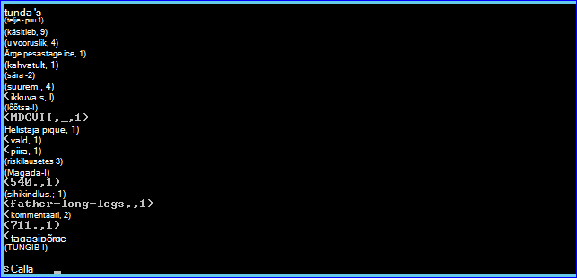
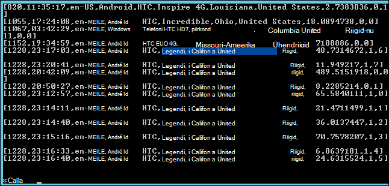

<properties
    pageTitle="Skripti toimingu abil saate installida säde Hadoopi kobar | Microsoft Azure'i"
    description="Saate teada, kuidas kohandada mõne Hdinsightiga kobar säde skripti toimingu abil."
    services="hdinsight"
    documentationCenter=""
    authors="nitinme"
    manager="jhubbard"
    editor="cgronlun"/>

<tags
    ms.service="hdinsight"
    ms.workload="big-data"
    ms.tgt_pltfrm="na"
    ms.devlang="na"
    ms.topic="article"
    ms.date="02/05/2016"
    ms.author="nitinme"/>

# Installimine ja kasutamine säde Hdinsightiga Hadoopi kogumite skripti toimingu abil

> [AZURE.IMPORTANT] Selles artiklis on nüüd aegunud. Hdinsightiga nüüd pakub säde tüübina esimese klassi kobar Windowsi-põhiste kogumite, mis tähendab, et saate nüüd otse luua säde kobar Hadoopi kobar, kasutades skripti toimingu muutmata. Kasuta säde kobar tüüp, saate mõne Hdinsightiga versioon 3,2 kobar säde versioon 1.3.1.  Skripti toimingut saate kasutada erinevaid versioone säde installimiseks. Hdinsightiga pakub valimi skripti toimingu skripti.

Siit saate teada, kuidas installida Windows säde vastavalt Hdinsightiga skripti toimingu abil ja kuidas panna säde päringute Hdinsightiga kogumite.

**Seotud artiklid**

- [Rakenduses Hdinsightiga loomine Hadoopi kogumite](hdinsight-provision-clusters.md): üldist teavet Hdinsightiga kogumite loomise kohta.

- [Alustamine Apache Spark Hdinsightiga kohta](hdinsight-apache-spark-jupyter-spark-sql.md): luua mõne Hdinsightiga säde kobar.

- [Kohandada Hdinsightiga kobar skripti toimingu abil][hdinsight-cluster-customize]: Üldteave kohandamiseks Hdinsightiga kogumite skripti toimingu abil.

- [Arendamise skripti toimingu skriptid Hdinsightiga](hdinsight-hadoop-script-actions.md).

## Mis on säde?

<a href="http://spark.apache.org/docs/latest/index.html" target="_blank">Apache Spark</a> on avatud lähtekoodi paralleelselt, mis töötlemine, mis toetab-mälu töötlemine andmete – suured analüütiline rakenduste jõudlust parandada. Säde tema mälu-arvutus võimaluste oleks hea valik iteratiivne algoritmide masina õppimine ja Graphi arvutuste.

Säde saate kasutada ka tavapärase kettapõhiste andmete töötlemise sooritamiseks. Säde parandab traditsiooniline MapReduce framework vahe järk-järgult kettale kirjutab vältimiseks. Lisaks säde ühildub Hadoopi jaotatud faili süsteemi (HDFS) ja Azure'i bloobimälu salvestusruumi nii olemasolevate andmete saab hõlpsasti töödelda säde kaudu.

Selles teemas antakse juhiseid kohta, kuidas kohandada mõne Hdinsightiga kobar säde installimiseks.

## Installige Azure'i portaalis säde

Proovi skripti säde installimiseks on Hdinsightiga kobar on kirjutuskaitstud salvestusruumi Azure'i bloobimälu [https://hdiconfigactions.blob.core.windows.net/sparkconfigactionv03/spark-installer-v03.ps1](https://hdiconfigactions.blob.core.windows.net/sparkconfigactionv03/spark-installer-v03.ps1)veebisaidil saadaval. Säde 1.2.0 ja säde 1.0.2 sõltuvalt versiooni Hdinsightiga klaster loomist saate installida selle skripti.

- Kui kasutate skripti loomisel on **Hdinsightiga 3,2** kobar, installib see **säde 1.2.0**.
- Kui kasutate skripti loomisel on **Hdinsightiga 3,1** kobar, installib see **säde 1.0.2**.

Saate muuta selle skripti või luua oma skript installida muid versioone säde.

> [AZURE.NOTE] Skripti näide töötab ainult Hdinsightiga 3,1 ja 3,2 kogumite. Hdinsightiga kobar versioonide kohta leiate lisateavet teemast [Hdinsightiga kobar versioonid](hdinsight-component-versioning.md).

1. Käivitage luua klaster **Luua kohandatud** suvandi abil, nagu on kirjeldatud aadressil [loomine Hadoopi kogumite Hdinsightiga sisse](hdinsight-provision-clusters.md#portal). Valige kobar versioon sõltuvalt järgmist:

    - Kui soovite installida **säde 1.2.0**, luua mõne Hdinsightiga 3,2 kobar.
    - Kui soovite installida **säde 1.0.2**, luua mõne Hdinsightiga 3,1 kobar.

2. Viisardi lehel **Script toimingud** klõpsake **skripti toimingu lisamine** üksikasjad skripti kohta, nagu allpool näidatud:

    ![Kasutage skripti toimingu kohandamiseks on kobar] (./media/hdinsight-hadoop-spark-install/HDI.CustomProvision.Page6.png "Kasutage skripti toimingu kohandamiseks on kobar")

    <table border='1'>
        <tr><th>Atribuut</th><th>Väärtus</th></tr>
        <tr><td>Nimi</td>
            <td>Määrake skripti toimingu nimi. Näiteks <b>Installida säde</b>.</td></tr>
        <tr><td>Skripti URI</td>
            <td>Määrake soovitud ühtse identifikaator (URL) skripti, mis on vaja järgida klaster kohandamiseks. Näiteks <i>https://hdiconfigactions.blob.core.windows.net/sparkconfigactionv03/spark-installer-v03.ps1</i></td></tr>
        <tr><td>Sõlme tüüp</td>
            <td>Määrake sõlmed, mille kohandamine skript käivitatakse. Saate valida <b>kõik sõlmed</b>, <b>ainult pea sõlmed</b>või <b>ainult töötaja sõlmed</b>.
        <tr><td>Parameetrid</td>
            <td>Määrake soovitud parameetrid skripti vajadusel. Skripti installimiseks säde ei nõua parameetrid nii, et võite seda tühjaks jätta.</td></tr>
    </table>

    Saate lisada rohkem kui ühe skripti toimingu klaster mitme komponentide installimine. Kui olete lisanud skriptide, klõpsake klaster loomise alustamiseks märke.

Skripti abil installida säde Hdinsightiga Azure PowerShelli või Hdinsightiga .NET SDK abil. Selles teemas allpool on esitatud juhised järgmiste toimingute jaoks.

## Kasutage säde Hdinsightiga
Spark pakub Scala, Python ja Java API-d. Interaktiivne säde shelli abil saate käivitada säde päringud. Selles jaotises antakse juhiseid töötamiseks säde erineval kasutamise kohta:

- [Säde shelli abil saate käivitada interaktiivsed päringud](#sparkshell)
- [Säde shelli abil saate käivitada säde SQL-päringud](#sparksql)
- [Autonoomse Scala programmi käivitamine](#standalone)

###Säde shelli abil saate käivitada interaktiivsed päringud
Järgmiste toimingute säde on interaktiivne säde kest päringuid käivitada. Selles jaotises võtame säde päringu jaoks Näidisandmete faili (/ example/data/gutenberg/davinci.txt), mis on saadaval, klõpsake Hdinsightiga kogumite vaikimisi.

1. Azure'i portaalis lubamine üheks klaster säde installitud ja seejärel remote loodud klaster Kaugtöölaud. Juhised leiate teemast [Hdinsightiga kogumite abil RDP ühenduse loomine](hdinsight-administer-use-management-portal.md#rdp).

2. Kaugtöölaua protokolli (RDP) seansiga töölaual, avage Hadoopi käsurea (töölaua otsetee) kaudu ja liikuge asukohta, kuhu on installitud säde; näiteks **C:\apps\dist\spark-1.2.0**.

3. Käivitage säde shell käivitage järgmine käsk:

         .\bin\spark-shell --master yarn

    Pärast käsu on töö lõpetanud, saate mõne Scala Küsi:

         scala>

5. Scala kuvatakse vastav viip, sisestage säde päringu allpool näidatud. Selle päringu loendab iga sõna davinci.txt faili, mis on saadaval siis/näide/andmete/Gutenbergi/seostatud klaster Azure'i bloobimälu esinemiskord.

        val file = sc.textFile("/example/data/gutenberg/davinci.txt")
        val counts = file.flatMap(line => line.split(" ")).map(word => (word, 1)).reduceByKey(_ + _)
        counts.toArray().foreach(println)

6. Väljund näeb välja järgmine:

    

7. Sisestage: k väljumiseks Scala küsimus.

        :q

###Säde shelli abil saate käivitada säde SQL-päringud

Säde SQL-i võimaldab kasutada säde liigendatud (SQL), HiveQL või Scala relatsiooniline päringuid käivitada. Selles jaotises vaatame taru päringut valimi taru tabeli säde abil. Selles jaotises (ehk **hivesampletable**) taru tabelis on vaikimisi saadaval klaster loomisel.

>[AZURE.NOTE] Allpool valimi loodi vastu **säde 1.2.0**, kuhu on installitud, kui käivitate skripti toimingu Hdinsightiga 3,2 kobar loomisel.

1. Azure'i portaalis lubamine üheks klaster säde installitud ja seejärel remote loodud klaster Kaugtöölaud. Juhised leiate teemast [Hdinsightiga kogumite abil RDP ühenduse loomine](hdinsight-administer-use-management-portal.md#rdp).

2. RDP-seansi, töölaual, avage Hadoopi käsurea (töölaua otsetee) kaudu ja liikuge asukohta, kuhu on installitud säde; näiteks **C:\apps\dist\spark-1.2.0**.

3. Käivitage säde shell käivitage järgmine käsk:

         .\bin\spark-shell --master yarn

    Pärast käsu on töö lõpetanud, saate mõne Scala Küsi:

         scala>

4. Seadke Scala kuvatakse vastav viip, taru kontekstis. See on nõutav töötamine taru päringute abil säde.

        val hiveContext = new org.apache.spark.sql.hive.HiveContext(sc)

    Pange tähele, et **sc** on vaikimisi säde konteksti, mis on seatud säde shell käivitamisel.

5. Käivitage taru päringu abil taru kontekstis ja printida väljundi konsooli. Päringu laadib andmed seadmetes teatud teha ja tuua 20 kirjete arv on piiratud.

        hiveContext.sql("""SELECT * FROM hivesampletable WHERE devicemake LIKE "HTC%" LIMIT 20""").collect().foreach(println)

6. Peaksite nägema umbes selline väljund:

    

7. Sisestage: k väljumiseks Scala küsimus.

        :q

### Autonoomse Scala programmi käivitamine

Selles jaotises me kirjutada Scala rakendus, mis loendab read, mis sisaldab tähtede "a" ja "b" andmete näidisfaili (/ example/data/gutenberg/davinci.txt), mis on saadaval, klõpsake Hdinsightiga kogumite vaikimisi. Kirjutamine ja kohandatud installiga säde klaster autonoomse Scala programmi abil, peab tegema järgmised toimingud:

- Kirjutage Scala programmi
- Saada laiendid faili Scala programmi koostamine
- Töö klaster

#### Kirjutage Scala programmi
Selles jaotises saate kirjutada Scala programm, mis loendab read, mis sisaldab "a" ja "b" näidis-faili.

1. Avage tekstiredaktor ja kleepige järgmine kood:

        /* SimpleApp.scala */
        import org.apache.spark.SparkContext
        import org.apache.spark.SparkContext._
        import org.apache.spark.SparkConf

        object SimpleApp {
          def main(args: Array[String]) {
            val logFile = "/example/data/gutenberg/davinci.txt"         //Location of the sample data file on Azure Blob storage
            val conf = new SparkConf().setAppName("SimpleApplication")
            val sc = new SparkContext(conf)
            val logData = sc.textFile(logFile, 2).cache()
            val numAs = logData.filter(line => line.contains("a")).count()
            val numBs = logData.filter(line => line.contains("b")).count()
            println("Lines with a: %s, Lines with b: %s".format(numAs, numBs))
          }
        }

2. Salvestage fail nimega **SimpleApp.scala**.

#### Scala programmi koostamine
Selles jaotises saate <a href="http://www.scala-sbt.org/0.13/docs/index.html" target="_blank">Koostada lihtsaid tööriist</a> (või sbt) koostada Scala programm. SBT nõuab Java 1,6 või uuem versioon, seega veenduge, et teil on õige versioon Java enne jätkamist selles jaotises installitud.

1. Installige sbt http://www.scala-sbt.org/0.13/tutorial/Installing-sbt-on-Windows.html.
2. Looge kaust nimega **SimpleScalaApp**ja selles kaustas looge fail nimega **simple.sbt**. See on konfiguratsioonifail, mis sisaldab teavet Scala versioon, teegi sõltuvused jne. Kleepige järgmine simple.sbt faili ja salvestage see.

        name := "SimpleApp"

        version := "1.0"

        scalaVersion := "2.10.4"

        libraryDependencies += "org.apache.spark" %% "spark-core" % "1.2.0"

    >[AZURE.NOTE] Veenduge, et teile jääb tühjad read failis.

3. Kaustas **SimpleScalaApp** directory struktuuri **\src\main\scala** ja kleepige varem loodud kaustas \src\main\scala Scala programm (**SimpleApp.scala**).
4. Avage käsuviip, liikuge SimpleScalaApp kataloogi ja sisestage järgmine käsk:

        sbt package

    Kui taotlus on koostatud, kuvatakse **simpleapp_2.10-1.0.jar** **\target\scala-2.10** Directory sees SimpleScalaApp juurkausta loodud fail.

#### Töö klaster
Selles jaotises saate üheks kobar, mis sisaldab säde remote installitud ja seejärel kopeerige SimpleScalaApp projekti sihtkaust. Saate seejärel käsu **säde esitada** töö klaster esitada.

1. Remote kobar, kuhu on installitud säde sisse. Arvutist, kuhu kirjutas ja ehitatud SimpleApp.scala programmi **SimpleScalaApp\target** kausta kopeerida ja kleepida klaster asukohta.
2. RDP-seansi, töölaual, avage Hadoopi käsurea ja liikuge asukohta, kus kleebitud **sihtkaust** .
3. Sisestage järgmine käsk Käivita programm SimpleApp.scala.

        C:\apps\dist\spark-1.2.0\bin\spark-submit --class "SimpleApp" --master local target/scala-2.10/simpleapp_2.10-1.0.jar

4. Kui programm on töö lõpetanud, kuvatakse väljund konsooli.

        Lines with a: 21374, Lines with b: 11430

## Installige Azure'i PowerShelli kaudu säde

Selles jaotises kasutame autonoomsest skriptide abil skripti toimingu kohandamiseks klaster **<a href = "http://msdn.microsoft.com/library/dn858088.aspx" target="_blank">Lisa-AzureHDInsightScriptAction</a>** cmdlet-käsk. Enne jätkamist veenduge, et olete installinud ja konfigureerinud Azure PowerShelli. Töökoha käitatavad Azure PowerShelli cmdlet-käskude Hdinsightiga konfigureerimise kohta leiate teemast [installida ja konfigureerida Azure PowerShelli](../powershell-install-configure.md).

Tehke järgmist.

1. Avage Azure'i PowerShelli aken ja deklareerida järgmisi muutujaid.

        # Provide values for these variables
        $subscriptionName = "<SubscriptionName>"        # Name of the Azure subscription
        $clusterName = "<HDInsightClusterName>"         # HDInsight cluster name
        $storageAccountName = "<StorageAccountName>"    # Azure Storage account that hosts the default container
        $storageAccountKey = "<StorageAccountKey>"      # Key for the Storage account
        $containerName = $clusterName
        $location = "<MicrosoftDataCenter>"             # Location of the HDInsight cluster. It must be in the same data center as the Storage account.
        $clusterNodes = <ClusterSizeInNumbers>          # Number of nodes in the HDInsight cluster
        $version = "<HDInsightClusterVersion>"          # For example, "3.2"

2. Määrake väärtuste määramine, nt sõlmed klaster ja talletamist vaikimisi kasutada.

        # Specify the configuration options
        Select-AzureSubscription $subscriptionName
        $config = New-AzureHDInsightClusterConfig -ClusterSizeInNodes $clusterNodes
        $config.DefaultStorageAccount.StorageAccountName="$storageAccountName.blob.core.windows.net"
        $config.DefaultStorageAccount.StorageAccountKey=$storageAccountKey
        $config.DefaultStorageAccount.StorageContainerName=$containerName

3. **Lisa-AzureHDInsightScriptAction** cmdlet-käsk skripti toimingu lisamiseks kasutage kobar konfigureerimine. Hiljem klaster loomisel skripti toimingu läheb täide.

        # Add a script action to the cluster configuration
        $config = Add-AzureHDInsightScriptAction -Config $config -Name "Install Spark" -ClusterRoleCollection HeadNode -Uri https://hdiconfigactions.blob.core.windows.net/sparkconfigactionv03/spark-installer-v03.ps1

    Cmdlet-käsk **Lisa-AzureHDInsightScriptAction** võtab järgmisi:

    <table style="border-color: #c6c6c6; border-width: 2px; border-style: solid; border-collapse: collapse;">
    <tr>
    <th style="border-color: #c6c6c6; border-width: 2px; border-style: solid; border-collapse: collapse; width:90px; padding-left:5px; padding-right:5px;">Parameetri</th>
    <th style="border-color: #c6c6c6; border-width: 2px; border-style: solid; border-collapse: collapse; width:550px; padding-left:5px; padding-right:5px;">Määratlus</th></tr>
    <tr>
    <td style="border-color: #c6c6c6; border-width: 2px; border-style: solid; border-collapse: collapse; padding-left:5px;">Config</td>
    <td style="border-color: #c6c6c6; border-width: 2px; border-style: solid; border-collapse: collapse; padding-left:5px; padding-right:5px;">Millised skripti toimingu teave lisatakse konfiguratsiooni objekti.</td></tr>
    <tr>
    <td style="border-color: #c6c6c6; border-width: 2px; border-style: solid; border-collapse: collapse; padding-left:5px;">Nimi</td>
    <td style="border-color: #c6c6c6; border-width: 2px; border-style: solid; border-collapse: collapse; padding-left:5px;">Skripti toimingu nimi.</td></tr>
    <tr>
    <td style="border-color: #c6c6c6; border-width: 2px; border-style: solid; border-collapse: collapse; padding-left:5px;">ClusterRoleCollection</td>
    <td style="border-color: #c6c6c6; border-width: 2px; border-style: solid; border-collapse: collapse; padding-left:5px;">Saate määrata sõlmed, mille kohandamine skript käivitatakse. Kehtivad väärtused on HeadNode (installimiseks pea sõlme) või DataNode (installimiseks andmete sõlme). Saate ühe või mõlema väärtused.</td></tr>
    <tr>
    <td style="border-color: #c6c6c6; border-width: 2px; border-style: solid; border-collapse: collapse; padding-left:5px;">URI</td>
    <td style="border-color: #c6c6c6; border-width: 2px; border-style: solid; border-collapse: collapse; padding-left:5px;">Saate määrata URI skripti, mis on täidetud.</td></tr>
    <tr>
    <td style="border-color: #c6c6c6; border-width: 2px; border-style: solid; border-collapse: collapse; padding-left:5px;">Parameetrid</td>
    <td style="border-color: #c6c6c6; border-width: 2px; border-style: solid; border-collapse: collapse; padding-left:5px;">Parameetrite skripti nõutav. Selles teemas kasutatud skripti näide ei nõua soovitud parameetrid ja seega ei kuvata parameeter ülaltoodud koodilõigu.
    </td></tr>
    </table>

4. Lõpuks hakata looma kohandatud kobar säde installitud.  

        # Start creating a cluster with Spark installed
        New-AzureHDInsightCluster -Config $config -Name $clusterName -Location $location -Version $version

Kui kuvatakse vastav viip, sisestage mandaat klaster. Võib kuluda mitu minutit enne klaster on loodud.

## Installige säde PowerShelli abil

Lugege teemat [kohandamine Hdinsightiga kogumite skripti toimingu abil](hdinsight-hadoop-customize-cluster.md#call_scripts_using_powershell).

## Kasutades .NET SDK säde installimine

Lugege teemat [kohandamine Hdinsightiga kogumite skripti toimingu abil](hdinsight-hadoop-customize-cluster.md#call_scripts_using_azure_powershell).

## Vt ka

- [Loomine Hadoopi kogumite sisse Hdinsightiga](hdinsight-provision-clusters.md): Hdinsightiga kogumite loomine.
- [Alustamine Apache Spark Hdinsightiga kohta](hdinsight-apache-spark-jupyter-spark-sql.md): alustamine säde Hdinsightiga kohta.
- [Kohandada Hdinsightiga kobar skripti toimingu abil][hdinsight-cluster-customize]: Hdinsightiga kogumite skripti toimingu abil kohandada.
- [Arendamise skripti toimingu skriptid Hdinsightiga](hdinsight-hadoop-script-actions.md): skripti toimingu skriptide töötada.
- [R installimine Hdinsightiga kogumite] [ hdinsight-install-r] pakub juhiseid, kuidas installida ja kasutada R Hdinsightiga Hadoopi kogumite kobar kohandamine abil. R on avatud lähtekoodi keel ja statistika arvutuste jaoks. Pakub sadu sisseehitatud statistikafunktsioonid ja oma programmeerimiskeel, mis ühendab objekti rakendusse ja funktsionaalne programmeerimine aspekte. See sisaldab ka olulisel graafiline võimalusi.
- [Installige Giraph Hdinsightiga kogumite kohta](hdinsight-hadoop-giraph-install.md). Kobar kohandamine abil saate installida Giraph Hdinsightiga Hadoopi kogumite. Giraph võimaldab teil teha, kasutades Hadoopi töötlemine graafik ja saab kasutada Windows Azure Hdinsightiga.
- [Installige Solri Hdinsightiga kogumite kohta](hdinsight-hadoop-solr-install.md). Kobar kohandamise abil saate installida Solri Hdinsightiga Hadoopi kogumite. Solri võimaldab võimas otsing toiminguid talletatud andmed.

[hdinsight-provision]: hdinsight-provision-clusters.md
[hdinsight-install-r]: hdinsight-hadoop-r-scripts.md
[hdinsight-cluster-customize]: hdinsight-hadoop-customize-cluster.md
[powershell-install-configure]: powershell-install-configure.md
