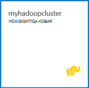

<properties
   pageTitle="Hadoopi õpetus: alustamine Windows Hadoopi | Microsoft Azure'i"
   description="Alustamine Hadoopi Hdinsightiga sisse. Andmete põhjal saate teada, kuidas luua Hadoopi kogumite Windowsi taru päringut ja väljundi Excelis analüüsida."
   keywords="Hadoopi õpetuses Hadoopi windows Hadoopi kobar, lugege Hadoopi taru päring"
   services="hdinsight"
   documentationCenter=""
   authors="nitinme"
   manager="jhubbard"
   editor="cgronlun"
   tags="azure-portal"/>

<tags
   ms.service="hdinsight"
   ms.devlang="na"
   ms.topic="article"
   ms.tgt_pltfrm="na"
   ms.workload="big-data"
   ms.date="03/07/2016"
   ms.author="nitinme"/>

# Hadoopi õpetus: alustamine Hadoopi kasutamine opsüsteemis Windows Hdinsightiga

> [AZURE.SELECTOR]
- [Linux-põhine](../hdinsight-hadoop-linux-tutorial-get-started.md)
- [Windowsi-põhiste](../hdinsight-hadoop-tutorial-get-started-windows.md)

Selleks et saaksite teada Windowsi Hadoopi ja kasutuselevõtt Hdinsightiga, selles õpetuses näidatakse, kuidas käivitada taru päringu Hadoopi kobar struktureerimata andmed ja seejärel analüüsida tulemusi Microsoft Exceli.

>[AZURE.NOTE] Teave selles dokumendis on Windowsi-põhiste Hdinsightiga kogumite. Linux-põhine kogumite kohta leiate teavet teemast [Hadoopi õpetus: alustamine Linux-põhine Hadoopi kasutamine Hdinsightiga](hdinsight-hadoop-linux-tutorial-get-started.md).

Oletame, et teil on suur struktureerimata andmekomplekt ja soovite seda mõtestatud teabe ekstraktimiseks päringut taru. See on täpselt, mida te ei kavatse teha selles õpetuses. Siin on, kuidas saate saavutada.

   !["Hadoopi õpetus: Looge konto; loomine Hadoopi kobar; Esitage taru päringu; Exceli andmete analüüsiks.][image-hdi-getstarted-flow]

Vaadake demo video selle õpetuse Hadoopi Hdinsightiga teavet.

![Video esimene Hadoopi õpetus: Hadoopi klaster taru päringu edastamist ja analüüsida Exceli tulemusi.][img-hdi-getstarted-video]

**[Olge Hadoopi õpetuse Hdinsightiga YouTube](https://www.youtube.com/watch?v=Y4aNjnoeaHA&list=PLDrz-Fkcb9WWdY-Yp6D4fTC1ll_3lU-QS)**

Koos Windows Azure Hdinsightiga üldine kättesaadavus, Microsoft osutab Hdinsightiga emulaator Azure, varem *Microsoft Hdinsightiga arendaja eelvaade*. Emulaator on suunatud arendaja stsenaariumid ja toetab vaid ühe sõlme juurutuste. Hdinsightiga emulaator kasutamise kohta leiate artiklist [Alustamine Hdinsightiga emulaator][hdinsight-emulator].

[AZURE.INCLUDE [delete-cluster-warning](../../includes/hdinsight-delete-cluster-warning.md)]

## Eeltingimused

Enne alustamist selles õpetuses Hadoopi Windowsi jaoks, peab teil olema järgmised:

- **An Azure'i tellimus**. Leiate [Azure'i saada tasuta prooviversioon](https://azure.microsoft.com/documentation/videos/get-azure-free-trial-for-testing-hadoop-in-hdinsight/).
- Office 2013 Professional Plus, Office 365 Pro Plusi, Excel 2013 eraldiseisev versioon või Office 2010 Professional Plus **A töökoha arvuti** .

### Accessi kontrolli nõuded

[AZURE.INCLUDE [access-control](../../includes/hdinsight-access-control-requirements.md)]

##Hadoopi kogumite loomine

Kui loote klaster, saate luua Azure Arvuta ressursse, mis sisaldavad Hadoopi ja seotud rakendusi. Selles jaotises saate luua ka Hdinsightiga versioon 3,2 kobar. Saate luua ka Hadoopi kogumite versioonidega. Juhised leiate teemast [kohandatud suvandite abil luua Hdinsightiga kogumite][hdinsight-provision]. Hdinsightiga versioonid ja nende SLAs kohta leiate teavet teemast [Hdinsightiga komponendi Versioonimine](hdinsight-component-versioning.md).

**Loomine Hadoopi kobar**

1. [Azure'i portaali](https://portal.azure.com/)sisse logima.
2. Klõpsake nuppu **Uus**, klõpsake **Andmete analüüsimise**ja seejärel käsku **Hdinsightiga**. Portaali avab **Uue Hdinsightiga kobar** tera.

    ![Loo uus klaster Azure'i portaalis] (./media/hdinsight-hadoop-tutorial-get-started-windows/HDI.CreateCluster.1.png "Loo uus klaster Azure'i portaalis")

3. Sisestage või valige üks järgmistest:

    ![Sisestage kobar nimi ja tüüp] (./media/hdinsight-hadoop-tutorial-get-started-windows/HDI.CreateCluster.2.png "Sisestage kobar nimi ja tüüp")
    
  	|Välja nimi| Väärtus|
  	|----------|------|
  	|Kobar nimi| Kordumatu nimi klaster tuvastamine|
  	|Kobar tüüp| Valige **Hadoopi** selles õpetuses. |
  	|Kobar operatsioonisüsteem| Valige **Windows Server 2012 R2 andmekeskuse** selles õpetuses.|
  	|Hdinsightiga versioon| Valige selle õpetuse uusim versioon.|
  	|Tellimuse| Valige Azure'i tellimus, mida kasutatakse klaster.|
  	|Ressursirühm | Valige Azure ressursi olemasolevasse rühma või luua uue ressursirühma. Põhilised Hdinsightiga kobar sisaldab klaster ja selle vaikekonto salvestusruumi.  Kahe rühma ressursi lihtne haldamise saate rühmitada.|
  	|Identimisteave| Sisestage kobar sisselogimise kasutajanimi ja parool. Windowsi vastavalt kobar võib olla 2 Kasutajakontod.  Kobar kasutaja (või HTTP kasutaja) saab hallata klaster ning edastab tööd.  Soovi korral saate luua kaugtöölaua (RDP) klaster ühenduse loomine Remote kasutajakonto. Kui valite Luba kaugtöölaud, loote RDP kasutajakonto.|
  	|Andmeallikas| Klõpsake nuppu Loo uus vaikimisi Azure storage uue konto loomiseks. Kasutage vaikenime container kobar nimi. Iga Hdinsightiga kobar on vaikimisi bloobimälu container on Azure storage accont kohta.  Azure'i salvestusruumi vaikekonto asukoht määrab Hdinsightiga kobar asukoht.|
  	|Hinnad astme sõlm| 1 või 2 töötaja sõlmed kasutamine vaikimisi töötaja sõlm ja pea märkme hinnad taseme jaoks selles õpetuses.|
  	|Valikuline konfigureerimine| Jäta see osa.|

9. Enne **Uue Hdinsightiga kobar** , veenduge, et **Kinnita Startboard** on valitud, ja klõpsake nuppu **Loo**. See loob klaster ja seda paani lisamine oma Azure portaali Startboard. Ikoon näitab, et klaster loob ja muudab Hdinsightiga ikooni kuvamise pärast loomine on lõpule viidud.

  	| Loomise ajal | Täieliku loomine |
  	| ------------------ | --------------------- |
  	|  |  |

    > [AZURE.NOTE] Kulub aega kobar luuakse tavaliselt umbes 15 minutit. Kasutada paani soovitud Startboard või klõpsake lehe vasakus servas **teatised** kirje loomisprotsessi kontrollida.

10. Kui loomine on lõpule jõudnud, klõpsake paani kaudu käivitada kobar tera Startboard klaster.

## Portaalist taru päringu käivitamine
Nüüd, kui olete loonud mõne Hdinsightiga kobar, on järgmiseks taru töö valimi taru tabeli päringu käivitamiseks. Kasutame *hivesampletable*, mis on kaasas Hdinsightiga kogumite. Tabel sisaldab andmeid mobiilsideseadme tootjad, platvormid ja mudelid. Selle tabeli taru päringu laadib andmed konkreetse tootja mobiilsideseadmete jaoks.

> [AZURE.NOTE] Hdinsightiga Tools for Visual Studio kaasas Azure'i SDK .NET 2,5 või uuem versioon. Tööriistade abil Visual Studios, te saate ühenduse Hdinsightiga kobar, taru tabelite, päringute loomine ja käitamine taru. Lisateabe saamiseks lugege teemat [kasutuselevõtt Hdinsightiga Hadoopi Tools for Visual Studio][1].

**Taru töö käivitamiseks armatuurlaualt kobar**

1. [Azure'i portaali](https://portal.azure.com/)sisse logima.
2. Klõpsake nuppu **SIRVI kõik** ja seejärel käsku **Hdinsightiga kogumite** kogumite, sh kobar, vastloodud eelmises jaotises loendi kuvamiseks.
3. Klõpsake kobar, mida soovite kasutada taru töö nime ja klõpsake **armatuurlaua** ülaosas tera.
4. Veebilehe avab vahekaardil muu brauser. Sisestage Hadoopi konto ja parool. Vaikimisi kasutajanimi on **admin**; parool on sisestatud klaster loomisel.
5. Armatuurlaual vahekaarti **Taru redaktor** . Järgmised Veebileht avatakse.

    ![Taru Editor menüü Hdinsightiga kobar armatuurlaud.][img-hdi-dashboard]

    On mitu vahekaarti lehe ülaosas. Vaikemenüü on **Taru Editor**ja muud vahekaardid **Varasem töökogemus** ning **Faili brauseris**. Armatuurlaua abil saate esitada päringuid taru, märkige ruut Hadoopi töö logid ja salvestusruumi failide sirvimine.

    > [AZURE.NOTE] Pange tähele, et veebilehe URL on * &lt;ClusterName&gt;. azurehdinsight.net*. Nii asemel avada portaali armatuurlaud, saate avada armatuurlaua veebibrauseri kaudu, kasutades URL-i.

6. Sisestage menüü **Taru Editor** **Päringu nimi** **HTC20**.  Päringu nimi on ametinimetus. Sisestage paanil päringu taru päringu, nagu pildil näidatud:

    ![Taru päringu sisestatud päringu paanil taru redaktor.][img-hdi-dashboard-query-select]

4. Klõpsake **esitada**. Mõni hetk tagasi tulemuse saamiseks. Kuva värskendab iga 30 sekundi järel. Võite klõpsata ka kuva värskendamiseks **värskendamine** .

    ![Armatuurlaua kobar allosas loetletud taru päringu tulemused.][img-hdi-dashboard-query-select-result]

5. Kui olek on kuvatud, et töö on lõpule viidud, klõpsake päringu nime väljund kuvamiseks ekraanil. Kirjutage **Töö alustamine kellaaeg (UTC)**. Teil on vaja hiljem.

    ![Töö alustamine aeg Hdinsightiga kobar armatuurlaua varasem töökogemus menüüs loetletud.][img-hdi-dashboard-query-select-result-output]

    Lehel kuvatakse ka **Töö väljund** ja **Töö Log**. Teil on olemas ka võimalus alla laadida väljundfail (\_stdout) ja logifaili \(_stderr).

**Sirvimiseks väljundfail**

1. Klõpsake armatuurlaual kobar **Faili brauseris**.
2. Klõpsake oma salvestusruumikonto nimi, valige oma container nimi (mis on sama, mis teie kobar-nimi) ja klõpsake siis **kasutaja**.
3. Valige **administraator** ja seejärel käsku GUID, mis sisaldab viimase muutmise aja (veidi pärast töö alguskellaaeg eespool märgitud). Kopeerige see GUID. Järgmises jaotises on vaja seda.

    ![Taru päringu väljund GUID loendis faili brauseris menüüd fail.][img-hdi-dashboard-query-browse-output]

##Microsofti ärianalüüsitööriistade ühenduse loomine Excelis

Saate Power Query lisandmooduli Microsoft Exceli hdinsightist importimise töö väljund Excelisse, kus saab kasutada Microsofti ärianalüüsitööriistade tulemused täpsemaks analüüsimiseks.

Excel 2013 või 2010 installitud selle õpetuse osa lõpuleviimiseks peab teil.

**Kui soovite alla laadida Microsoft Power Query for Excel**

- Microsoft Power Query Microsoft Excel [Microsofti allalaadimiskeskusest](http://www.microsoft.com/download/details.aspx?id=39379) alla laadida ja installida.

**Saate importida andmed Hdinsightiga**

1. Avage Excelis ja looge uus töövihik.
3. Klõpsake menüüs **Power Query** , nuppu **Muudest allikatest**ja klõpsake **Azure Hdinsightiga**.

    ![Exceli PowerQuery impordi menüü avamine Windows Azure Hdinsightiga jaoks.][image-hdi-gettingstarted-powerquery-importdata]

3. Sisestage **Konto nimi** konto Azure'i bloobimälu, mis on seotud klaster ning seejärel klõpsake nuppu **OK**. (See on loodud, kuvatakse õpetuses salvestusruumi konto).
4. Sisestage **Konto võti** Azure'i bloobimälu konto ja klõpsake siis nuppu **Salvesta**.
5. Klõpsake parempoolsel paanil topeltklõpsake bloobimälu nime. Vaikimisi bloobimälu nimi on sama mis kobar nimi.

6. Otsige üles **stdout** veeru **nimi** . Veenduge, et GUID **Kausta tee** vastava veeru vastab varem kopeeritud GUID. Vaste viitab sellele, et väljundi andmed vastab teie esitatud töö. Klõpsake **kahendarvu** **stdout**vasakus veerus.

    ![Otsimise andmete väljund, GUID sisu loendit.][image-hdi-gettingstarted-powerquery-importdata2]

9. Ülemises vasakus nurgas taru töö väljund Excelisse importimiseks klõpsake nuppu **Sule ja laadi** .

##Käivitage näidised

Hdinsightiga kobar pakub päringu konsooli, mis sisaldab alustamine Galerii käivitamiseks näidised otse portaalis. Näidiste abil saate teada, kuidas töötada Hdinsightiga kõndides läbi mõne lihtsa stsenaariumi. Need näited on kõik nõutavad komponendid, nt andmete analüüsimiseks ja päringute käivitamiseks klõpsake menüüs andmed. Näidised galeriis alustamine kohta leiate lisateavet teemast [Lugege Hadoopi Hdinsightiga Hdinsightiga kasutamise alustamine galerii abil sisse](hdinsight-learn-hadoop-use-sample-gallery.md).

**Valimi käivitamiseks**

1. Azure portaali startboard, klõpsake paani äsja loodud klaster.
 
2. Enne uue kobar, valige **armatuurlaud**. Küsimise korral sisestage klaster administraatori kasutajanime ja parooliga.

    ![Käivitage kobar armatuurlaud] (./media/hdinsight-hadoop-tutorial-get-started-windows/HDI.Cluster.Dashboard.png "Käivitage kobar armatuurlaud")
 
3. Veebilehelt, mis avaneb, klõpsake vahekaarti **Kasutamise alustamine Galerii** ja klõpsake kategoorias **lahenduste näidisandmetega** näidis, mille soovite käivitada. Veebilehel valimi lõpuleviimiseks järgige juhiseid. Järgmises tabelis on loetletud mõned näited ja annab rohkem teavet, mida iga valimi ei.

Näidis | Mida see teeb?
------ | ---------------
[Andur Andmeanalüüs][hdinsight-sensor-data-sample] | Saate teada, kuidas kasutada Hdinsightiga ajaloolisi andmeid, mis on toodetud Küte, ventilatsioon ja air kliimaseadmed süsteemide süsteemid, mida ei saa usaldusväärselt määramine temperatuuri tuvastamiseks.
[Veebisaidi logi analüüs][hdinsight-weblogs-sample] | Saate teada, kuidas kasutada Hdinsightiga saada ülevaate päevas suunavate veebisaidi külastamise sagedus ja veebisaidi kasutajate kogemusi tõrkeid kokkuvõtte veebisaidi logifailide analüüsimiseks.
[Twitteri trendi analüüs](hdinsight-analyze-twitter-data.md) | Saate teada, kuidas kasutada Hdinsightiga trende Twitteri analüüsimiseks.

##Klaster kustutamine

[AZURE.INCLUDE [delete-cluster-warning](../../includes/hdinsight-delete-cluster-warning.md)]

##Järgmised sammud
Hadoopi selles õpetuses olete õppinud, kuidas luua Hadoopi kobar aknad Hdinsightiga, käivitage taru päringu andmete põhjal ja importida Exceli, kus neid saab töödelda ja ärianalüüsitööriistade graafiliselt kuvada tulemused. Lisateabe saamiseks vaadake järgmist õpetused:

- [Visual Studio Hdinsightiga Hadoopi tööriistade kasutamise alustamine][1]
- [Hdinsightiga emulaator kasutamise alustamine][hdinsight-emulator]
- [Azure'i bloobimälu abil Hdinsightiga][hdinsight-storage]
- [PowerShelli kasutamine Hdinsightiga haldamine][hdinsight-admin-powershell]
- [Laadi andmed Hdinsightiga][hdinsight-upload-data]
- [Hdinsightiga MapReduce kasutamine][hdinsight-use-mapreduce]
- [Hdinsightiga taru kasutamine][hdinsight-use-hive]
- [Kasutage siga Hdinsightiga][hdinsight-use-pig]
- [Hdinsightiga Oozie kasutamine][hdinsight-use-oozie]
- [Töötada Java MapReduce programmide Hdinsightiga][hdinsight-develop-mapreduce]

[1]: ../HDInsight/hdinsight-hadoop-visual-studio-tools-get-started.md

[hdinsight-versions]: hdinsight-component-versioning.md

[hdinsight-provision]: hdinsight-provision-clusters.md
[hdinsight-admin-powershell]: hdinsight-administer-use-powershell.md
[hdinsight-upload-data]: hdinsight-upload-data.md
[hdinsight-use-mapreduce]: hdinsight-use-mapreduce.md
[hdinsight-use-hive]: hdinsight-use-hive.md
[hdinsight-use-pig]: hdinsight-use-pig.md
[hdinsight-use-oozie]: hdinsight-use-oozie.md
[hdinsight-storage]: hdinsight-hadoop-use-blob-storage.md
[hdinsight-emulator]: hdinsight-hadoop-emulator-get-started.md
[hdinsight-develop-mapreduce]: hdinsight-develop-deploy-java-mapreduce-linux.md
[hadoop-hdinsight-intro]: hdinsight-hadoop-introduction.md
[hdinsight-weblogs-sample]: hdinsight-hive-analyze-website-log.md
[hdinsight-sensor-data-sample]: hdinsight-hive-analyze-sensor-data.md

[azure-purchase-options]: http://azure.microsoft.com/pricing/purchase-options/
[azure-member-offers]: http://azure.microsoft.com/pricing/member-offers/
[azure-free-trial]: http://azure.microsoft.com/pricing/free-trial/
[azure-management-portal]: https://portal.azure.com/
[azure-create-storageaccount]: ../storage-create-storage-account.md

[apache-hadoop]: http://go.microsoft.com/fwlink/?LinkId=510084
[apache-hive]: http://go.microsoft.com/fwlink/?LinkId=510085
[apache-mapreduce]: http://go.microsoft.com/fwlink/?LinkId=510086
[apache-hdfs]: http://go.microsoft.com/fwlink/?LinkId=510087
[hdinsight-hbase-custom-provision]: hdinsight-hbase-tutorial-get-started.md

[powershell-download]: http://go.microsoft.com/fwlink/p/?linkid=320376&clcid=0x409
[powershell-install-configure]: powershell-install-configure.md
[powershell-open]: powershell-install-configure.md#step-1-install

[img-hdi-dashboard]: ./media/hdinsight-hadoop-tutorial-get-started-windows/HDI.dashboard.png
[img-hdi-dashboard-query-select]: ./media/hdinsight-hadoop-tutorial-get-started-windows/HDI.dashboard.query.select.png
[img-hdi-dashboard-query-select-result]: ./media/hdinsight-hadoop-tutorial-get-started-windows/HDI.dashboard.query.select.result.png
[img-hdi-dashboard-query-select-result-output]: ./media/hdinsight-hadoop-tutorial-get-started-windows/HDI.dashboard.query.select.result.output.png
[img-hdi-dashboard-query-browse-output]: ./media/hdinsight-hadoop-tutorial-get-started-windows/HDI.dashboard.query.browse.output.png

[img-hdi-getstarted-video]: ./media/hdinsight-hadoop-tutorial-get-started-windows/hdi-get-started-video.png

[image-hdi-storageaccount-quickcreate]: ./media/hdinsight-hadoop-tutorial-get-started-windows/HDI.StorageAccount.QuickCreate.png
[image-hdi-clusterstatus]: ./media/hdinsight-hadoop-tutorial-get-started-windows/HDI.ClusterStatus.png
[image-hdi-quickcreatecluster]: ./media/hdinsight-hadoop-tutorial-get-started-windows/HDI.QuickCreateCluster.png
[image-hdi-getstarted-flow]: ./media/hdinsight-hadoop-tutorial-get-started-windows/HDI.GetStartedFlow.png

[image-hdi-gettingstarted-powerquery-importdata]: ./media/hdinsight-hadoop-tutorial-get-started-windows/HDI.GettingStarted.PowerQuery.ImportData.png
[image-hdi-gettingstarted-powerquery-importdata2]: ./media/hdinsight-hadoop-tutorial-get-started-windows/HDI.GettingStarted.PowerQuery.ImportData2.png
 
