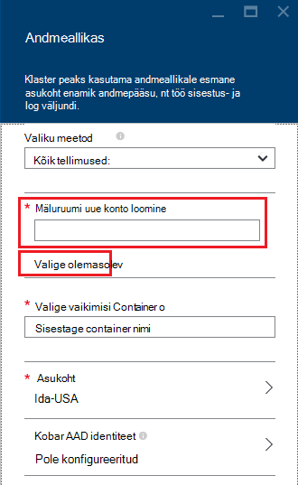

<properties
    pageTitle="Päringu andmete HDFS-ga ühilduva bloobimälu | Microsoft Azure'i"
    description="Hdinsightiga kasutab Azure'i bloobimälu nimega suur andmesalve HDFS jaoks. Saate teada, kuidas andmepäringuid bloobimälu ja salvestada oma analüüsi tulemused."
    keywords="Bloobivahemälu salvestusruumi, hdfs, Liigendatud andmete ja struktureerimata andmed"
    services="hdinsight,storage"
    documentationCenter=""
    tags="azure-portal"
    authors="mumian"
    manager="jhubbard"
    editor="cgronlun"/>

<tags
    ms.service="hdinsight"
    ms.workload="big-data"
    ms.tgt_pltfrm="na"
    ms.devlang="na"
    ms.topic="get-started-article"
    ms.date="09/06/2016"
    ms.author="jgao"/>

# Hadoopi sisse Hdinsightiga HDFS-ga ühilduva Azure'i bloobimälu kasutamine

Saate teada, kuidas madala hinnaga Azure'i bloobimälu abil Hdinsightiga, Azure storage konto ja bloobimälu salvestusruumi container loomine ja seejärel aadress andmed sees.

Azure'i bloobimälu on robustne, üldotstarbeline salvestusruumi lahenduse, mis ühendab sujuvalt Hdinsightiga. Hadoopi jaotatud faili hajusfailisüsteemiga (HDFS) kasutajaliidese kaudu komponendid Hdinsightiga täiskomplekti saate töötada otse bloobimälu struktureeritud või struktureerimata andmed.

Andmete talletamine bloobimälu võimaldab turvaline kustutamine Hdinsightiga rühmad kasutatavate arvutus ilma kasutaja andmeid.

> [AZURE.IMPORTANT] Hdinsightiga toetab ainult Blokeeri plekid. See leht või lisa plekid.

Mõne Hdinsightiga kobar loomise kohta leiate artiklist [Alustamine Hdinsightiga] [ hdinsight-get-started] või [luua Hdinsightiga kogumite][hdinsight-creation].

## Hdinsightiga salvestusruumi arhitektuur
Järgmisel joonisel pakub Hdinsightiga salvestusruumi arhitektuur abstraktsed ülevaate.

![Hadoopi kogumite HDFS API abil juurde ja salvestada struktureeritud ja struktureerimata andmed bloobimälu.] (./media/hdinsight-hadoop-use-blob-storage/HDI.WASB.Arch.png "Hdinsightiga salvestusruumi arhitektuur")

Hdinsightiga annab juurdepääsu kohalikult seotud Arvuta sõlmed jaotatud failisüsteemis. Seda failisüsteemi juurde, kasutades täielikult kvalifitseeritud URI, näiteks:

    hdfs://<namenodehost>/<path>

Lisaks Hdinsightiga pakub Accessi andmeid, mis on talletatud Azure'i bloobimälu võimalus. Süntaks on järgmine:

    wasb[s]://<containername>@<accountname>.blob.core.windows.net/<path>

> [AZURE.NOTE] Klõpsake Hdinsightiga versioonidega 3.0, kui `asv://` asemel kasutatud `wasb://`. `asv://`ei tohi kasutada koos Hdinsightiga kogumite 3.0 või uuem versioon, nagu on tulemuseks viga.

Hadoopi toetab mõiste failisüsteemi. Failisüsteemi tähendab vaikimisi värviskeemi ja asutus. Seda saab kasutada ka lahendamiseks suhtelised teed. Hdinsightiga loomisprotsessi, Azure Storage konto ja teatud Azure'i bloobimälu container sellelt kontolt määratud failisüsteemi.

Lisaks selle salvestusruumi konto, saate lisada täiendavat salvestusruumi kontod sama Azure tellimuse või muu Azure'i tellimused loomisprotsessi või pärast klaster loomist. Juhised täiendav salvestusruum kontode lisamise kohta leiate teemast [loomine Hdinsightiga kogumite][hdinsight-creation].

- **Ümbriste rakenduses salvestusruumi kontod, mis on ühendatud arvutikobaras:** Kuna konto nimi ja klahvi on seostatud klaster loomise ajal, peate need pakendis plekid täielik juurdepääs.

- **Avaliku ümbriste või avaliku plekid salvestusruumi kontod, mis on ühendatud arvutikobaras:** Teil on pakendis plekid kirjutuskaitstud õigus.

    > [AZURE.NOTE]
        > Avaliku ümbriste võimaldavad teil saada kõik plekid, mis on saadaval, et ümbrises ja saada container metaandmete loendit. Avaliku plekid võimaldavad juurdepääsu plekid ainult juhul, kui te ei tea täpselt URL-i. Lisateavet leiate teemast <a href="http://msdn.microsoft.com/library/windowsazure/dd179354.aspx">ümbriste ja plekid piira juurdepääsu</a>.

- **Privaatne ümbriste rakenduses salvestusruumi kontod, mis on ühendatud arvutikobaras:** Klõpsake soovitud ümbriste plekid ei pääse kui määratlete salvestusruumi konto, kui saadate WebHCat tööde haldamine. See on selgitatud selle artikli.

Salvestusruumi kontod, mis on määratletud loomisprotsessi ja nende võtmed on talletatud %HADOOP_HOME%/conf/core-site.xml kobar sõlmed. Hdinsightiga vaikekäitumine on salvestusruumi kontod, mis on määratletud core-site.xml faili kasutada. See on soovitatav core-site.xml faili redigeerimiseks, kuna kobar pea node(master) võib reimaged või viiakse igal ajal ja nende failide muudatused lähevad kaotsi.

Mitme WebHCat töö, sh taru, MapReduce, Hadoop streaming ja siga, saate teha salvestusruumi kontod ja nendega metaandmete kirjeldus. (See praegu töötab siga salvestusruumi kontod, kuid mitte metaandmete.) Selles artiklis jaotises [juurdepääs plekid Azure PowerShelli kaudu](#powershell) on selle funktsiooni valim. Lisateabe saamiseks vt [mõne alternatiivse salvestusruumi kontod ja Metastores Hdinsightiga kobar abil](http://social.technet.microsoft.com/wiki/contents/articles/23256.using-an-hdinsight-cluster-with-alternate-storage-accounts-and-metastores.aspx).

Bloobimälu saab kasutada struktureeritud ja struktureerimata andmed. Bloobimälu salvestusruumi ümbriste nimega /-väärtuse paarideks andmete talletamiseks ja puudub directory hierarhia. Märgi kaldkriips (/) saate siiski kasutada võtme nimi ilmuks, kui fail on salvestatud kataloogi struktuuri. Näiteks võib mõne bloobimälu klahvi *input/log1.txt*. Tegelik *Sisestuskeel* kataloogi olemas, kuid tõttu kaldkriips märgi võtme nimi, on selle faili tee ilmet.

###Bloobimälu eelised
Võtta pole ka mitte kaudset jõudluse maksumus arvutada kogumite ja salvestusruumi ressursid on leevendada nii lähedale salvestusruumi konto ressursside Azure piirkonna, kus läbilaskevõimega võrgu teeb väga tõhus Arvuta sõlmed sees Azure'i bloobimälu andmetele juurdepääsuks luuakse Arvuta rühmad.

On seostatud andmete talletamine Azure'i bloobimälu asemel HDFS eeliseid.

* **Andmete taaskasutuse ja ühiskasutus:** Andmete HDFS asub käitamiseks arvutikobaras sees. Ainult rakendusi, mis on juurdepääs käitamiseks arvutikobaras saate kasutada andmete HDFS API abil. Azure'i bloobimälu andmete pääseb HDFS API-d või [bloobimälu salvestusruumi REST API-de]kaudu[blob-storage-restAPI]. Seetõttu saab suuremast (sh muude Hdinsightiga kogumite) ja tööriistu aedvili ja tarbimine andmed.
* **Andmete arhiveerimise:** Andmete talletamine Azure'i bloobimälu võimaldab ilma kasutaja andmeid turvaliselt kustutada arvutamiseks kasutada Hdinsightiga rühmad.
* **Andmete salvestusruumi maksumus:** Andmete talletamine DFS pikemaks ajaks on kui Azure'i bloobimälu andmete säilitamise, kuna arvutikobaraga maksumus on suurem kui toote hind on Azure'i bloobimälu salvestusruumi ümbrises. Lisaks, kuna andmeid ei pea iga Arvuta kobar loomise uuesti laadida, ka salvestamisel andmete laadimine kulud.
* **Elastne skaala-out:** Kuigi HDFS pakub teile mastaabitud kontorist failisüsteemi, määratakse skaala sõlmed klaster loodud arv. Skaala muutmise keerulisem kui tuginedes skaleerimist võimalusi, mis kuvatakse automaatselt Azure'i bloobimälu kummipael protsess võib muutuda.
* **Geo-dispersioonanalüüs:** Oma Azure'i bloobimälu salvestusruumi ümbriste võib olla geo kopeeritud. Kuigi see annab teile geograafilised taastamine ja andmete koondamine, Tõrkesiirde geo kopeeritud asukohta tööd mõjutab jõudluse ja seda võivad olla tasulised. Nii, et meie soovitus on geo-dispersioonanalüüs hoolikas valimine ja ainult siis, kui väärt täiendavate andmete väärtus.

Teatud MapReduce töökohtade ja pakettide luua vahe tulemid, mida te ei soovi tingimata Azure'i bloobimälu talletamiseks. Sel juhul saate valida soovitud andmete talletamiseks kohalikku HDFS. Tegelikult Hdinsightiga kasutab DFS mitut nende vahe tulemuste taru töö ja muud protsessid.

> [AZURE.NOTE] Enamik HDFS käske (nt <b>ls</b>, <b>copyFromLocal</b> ja <b>mkdir</b>) toimivad ootuspäraselt. Käsud, mis on omased kohalikke HDFS rakendamist (mida nimetatakse DFS), nt <b>fschk</b> ja <b>dfsadmin</b>, näitab Azure'i bloobimälu erinevat käitumist.

## Bloobimälu ümbriste loomine

Plekid kasutamiseks loomisel [Azure Storage konto][azure-storage-create]. Osa, saate määrata Azure piirkond, mis salvestab objektide loomist, kasutades selle konto. Piirkonna peab olema majutatud klaster ja salvestusruumi konto. Taru metastore SQL Serveri andmebaas ja Oozie metastore SQL serveri andmebaasi ka asuma samas piirkonnas.

Kõikjal, kus see asub, kuulub iga bloobimälu loomist on container Azure Storage konto. See ümbris võib olemasoleva bloobimälu, mis on loodud väljaspool Hdinsightiga või võib olla ümbrises, mis on loodud mõne Hdinsightiga kobar.

Vaikimisi bloobimälu container talletab kobar kindla teabe nt töö ajalugu ja logid. Mitme Hdinsightiga kogumite vaikimisi bloobimälu container ei jaga. See võib rikutud varasem töökogemus ning klaster on halvasti käituma. Soovitatav on kasutada eri container iga kobar ja ühiskasutuses andmed panema määratud juurutuse kõik oluline kogumite, mitte salvestusruumi vaikekonto lingitud salvestusruumi kontol. Lingitud salvestusruumi kontod konfigureerimise kohta leiate lisateavet teemast [loomine Hdinsightiga kogumite][hdinsight-creation]. Siiski saate kasutada vaikimisi salvestusruumi container pärast algse Hdinsightiga kobar on kustutatud. HBase kogumite, saate säilitada tegelikult HBase tabeli skeemi ja andmeid, luua uus HBase klaster abil vaikimisi bloobimälu salvestusruumi ümbris, mida kasutatakse HBase kobar, mis on kustutatud.

### Azure'i portaalis

Portaalist on Hdinsightiga kobar loomisel on teil kasutada salvestusruumi konto või luua uue salvestusruumi konto suvandid.

###Azure'i CLI abil

[AZURE.INCLUDE [use-latest-version](../../includes/hdinsight-use-latest-cli.md)]

Kui olete [installinud ja konfigureerinud Azure'i CLI](../xplat-cli-install.md), saab järgmine käsk salvestusruumi konto ja ümbrises.

    azure storage account create <storageaccountname> --type LRS

> [AZURE.NOTE] Funktsiooni `--type` parameeter näitab, kuidas salvestusruumi konto tuleb korrata. Lisateabe saamiseks lugege teemat [Azure salvestusruumi kopeerimine](../storage/storage-redundancy.md). Ärge kasutage ZRS nagu ZRS ei toeta lehe bloobimälu, faili, tabel või järjekorda.

Teil palutakse määramiseks soovitud konto salvestusruum hakkab asuma geograafilised piirkond. Salvestusruumi konto tuleks luua sama piirkonna, millega kavatsete klaster Hdinsightiga loomise kohta.

Kui salvestusruumi konto on loodud, kasutada toomiseks salvestusruumi konto klahvid järgmine käsk:

    azure storage account keys list <storageaccountname>

Ümbris loomiseks kasutage järgmine käsk:

    azure storage container create <containername> --account-name <storageaccountname> --account-key <storageaccountkey>

### Azure'i PowerShelli abil

Kui olete [installinud ja konfigureerinud Azure PowerShelli][powershell-install],: Azure'i PowerShelli käsuviibas järgmine abil saate luua salvestusruumi konto ja container:

[AZURE.INCLUDE [upgrade-powershell](../../includes/hdinsight-use-latest-powershell.md)]

    $SubscriptionID = "<Your Azure Subscription ID>"
    $ResourceGroupName = "<New Azure Resource Group Name>"
    $Location = "EAST US 2"
    
    $StorageAccountName = "<New Azure Storage Account Name>"
    $containerName = "<New Azure Blob Container Name>"
    
    Add-AzureRmAccount
    Select-AzureRmSubscription -SubscriptionId $SubscriptionID
    
    # Create resource group
    New-AzureRmResourceGroup -name $ResourceGroupName -Location $Location
    
    # Create default storage account
    New-AzureRmStorageAccount -ResourceGroupName $ResourceGroupName -Name $StorageAccountName -Location $Location -Type Standard_LRS 
    
    # Create default blob containers
    $storageAccountKey = (Get-AzureRmStorageAccountKey -ResourceGroupName $resourceGroupName -StorageAccountName $StorageAccountName)[0].Value
    $destContext = New-AzureStorageContext -StorageAccountName $storageAccountName -StorageAccountKey $storageAccountKey  
    New-AzureStorageContainer -Name $containerName -Context $destContext

## Failide bloobimälu

Juurdepääsuks bloobimälu failide hdinsightist URI-skeem on järgmine:

    wasb[s]://<BlobStorageContainerName>@<StorageAccountName>.blob.core.windows.net/<path>

URI-skeemi pakub krüptimata (koos selle *wasb:* eesliide) ja SSL krüptitud access (koos *wasbs*). Soovitame kasutada *wasbs* võimaluse korral isegi siis, kui andmeid, mis asub sama piirkonna Azure juurdepääs.

Funktsiooni &lt;BlobStorageContainerName&gt; tuvastab container rakenduses Azure'i bloobimälu nime.
Funktsiooni &lt;StorageAccountName&gt; tuvastab selle Azure'i Salvestusruumikonto nimi. Täielik domeeninimi (FQDN) on nõutav.

Kui määratud pole kumbagi &lt;BlobStorageContainerName&gt; ega &lt;StorageAccountName&gt; on määratud, kasutatakse vaikimisi failisüsteemis. Failisüsteemi failidele, saate kasutada suhteline tee või absoluutne tee. Näiteks Hdinsightiga kogumite kaasneva *hadoop-mapreduce-examples.jar* faili saab viidata, kasutades ühte järgmistest:

    wasbs://mycontainer@myaccount.blob.core.windows.net/example/jars/hadoop-mapreduce-examples.jar
    wasbs:///example/jars/hadoop-mapreduce-examples.jar
    /example/jars/hadoop-mapreduce-examples.jar

> [AZURE.NOTE] Faili nimi on <i>hadoop-examples.jar</i> Hdinsightiga versioonid 2.1 ja 1,6 rühmades.

Funktsiooni &lt;tee&gt; on faili või kausta HDFS tee nimi. Ümbriste rakenduses Azure'i bloobimälu on lihtsalt võti väärtus poed, on tõene hierarhilise failisüsteemis. Directory eraldaja tõlgendatakse sees bloobimälu klahvi märk kaldkriips (/). Näiteks *hadoop-mapreduce-examples.jar* bloobimälu nimi on:

    example/jars/hadoop-mapreduce-examples.jar

> [AZURE.NOTE] Plekid väljaspool Hdinsightiga töötamisel enamik Utiliidid ei tunne WASB vorming ja hoopis oodata lihtsa tee vorming, näiteks `example/jars/hadoop-mapreduce-examples.jar`.

## Accessi plekid Azure CLI abil

Järgmise käsu abil saate loendi bloobimälu seotud käsud:

    azure storage blob

**Näide Azure'i CLI abil faili üles laadimine**

    azure storage blob upload <sourcefilename> <containername> <blobname> --account-name <storageaccountname> --account-key <storageaccountkey>

**Azure'i CLI alla laadida faili kasutamise näide**

    azure storage blob download <containername> <blobname> <destinationfilename> --account-name <storageaccountname> --account-key <storageaccountkey>

**Näide Azure'i CLI abil faili kustutamine**

    azure storage blob delete <containername> <blobname> --account-name <storageaccountname> --account-key <storageaccountkey>

**Azure'i CLI loendi failide kasutamise näide**

    azure storage blob list <containername> <blobname|prefix> --account-name <storageaccountname> --account-key <storageaccountkey>

## Accessi plekid Azure PowerShelli abil

> [AZURE.NOTE] Selles jaotises käsud pakuvad lihtne näide PowerShelli kaudu juurdepääsu andmetele, mis on talletatud plekid. Vaadake veel kõiki võimalusi pakkuva näide, mis on kohandatud töötamiseks Hdinsightiga, [Hdinsightiga tööriistad](https://github.com/Blackmist/hdinsight-tools).

Järgmise käsu abil saate loendi bloobimälu seotud cmdlet-käsud:

    Get-Command *blob*

![PowerShelli cmdlet-käskude bloobimälu seotud loend.][img-hdi-powershell-blobcommands]

###Failide üleslaadimine

Vt [üles laadida Hdinsightiga andmeid][hdinsight-upload-data].

###Failide allalaadimine

Järgmised tähik allalaaditavate failide blokeerimise bloobimälu praeguse kausta. Enne käivitamist skripti, muuta kataloogi kausta, kus teil on kirjutamisõigused.

    $resourceGroupName = "<AzureResourceGroupName>"
    $storageAccountName = "<AzureStorageAccountName>"   # The storage account used for the default file system specified at creation.
    $containerName = "<BlobStorageContainerName>"  # The default file system container has the same name as the cluster.
    $blob = "example/data/sample.log" # The name of the blob to be downloaded.
    
    # Use Add-AzureAccount if you haven't connected to your Azure subscription
    Login-AzureRmAccount 
    Select-AzureRmSubscription -SubscriptionID "<Your Azure Subscription ID>"
    
    Write-Host "Create a context object ... " -ForegroundColor Green
    $storageAccountKey = (Get-AzureRmStorageAccountKey -ResourceGroupName $resourceGroupName -Name $storageAccountName)[0].Value
    $storageContext = New-AzureStorageContext -StorageAccountName $storageAccountName -StorageAccountKey $storageAccountKey  
    
    Write-Host "Download the blob ..." -ForegroundColor Green
    Get-AzureStorageBlobContent -Container $ContainerName -Blob $blob -Context $storageContext -Force
    
    Write-Host "List the downloaded file ..." -ForegroundColor Green
    cat "./$blob"

Andes ressursi rühma nime ja kobar nime, saate järgmine kood:

    $resourceGroupName = "<AzureResourceGroupName>"
    $clusterName = "<HDInsightClusterName>"
    $blob = "example/data/sample.log" # The name of the blob to be downloaded.
    
    $cluster = Get-AzureRmHDInsightCluster -ResourceGroupName $resourceGroupName -ClusterName $clusterName
    $defaultStorageAccount = $cluster.DefaultStorageAccount -replace '.blob.core.windows.net'
    $defaultStorageAccountKey = (Get-AzureRmStorageAccountKey -ResourceGroupName $resourceGroupName -Name $defaultStorageAccount)[0].Value
    $defaultStorageContainer = $cluster.DefaultStorageContainer
    $storageContext = New-AzureStorageContext -StorageAccountName $defaultStorageAccount -StorageAccountKey $defaultStorageAccountKey 
    
    Write-Host "Download the blob ..." -ForegroundColor Green
    Get-AzureStorageBlobContent -Container $defaultStorageContainer -Blob $blob -Context $storageContext -Force

###Failide kustutamine

    Remove-AzureStorageBlob -Container $containerName -Context $storageContext -blob $blob

###Failide loend

    Get-AzureStorageBlob -Container $containerName -Context $storageContext -prefix "example/data/"

###Määratlemata salvestusruumi konto abil taru päringute sooritamine

Selles näites kujutatakse loendis kausta salvestusruumi konto, mis pole määratud loomise käigus.
$clusterName = "<HDInsightClusterName>"

    $undefinedStorageAccount = "<UnboundedStorageAccountUnderTheSameSubscription>"
    $undefinedContainer = "<UnboundedBlobContainerAssociatedWithTheStorageAccount>"

    $undefinedStorageKey = Get-AzureStorageKey $undefinedStorageAccount | %{ $_.Primary }

    Use-AzureRmHDInsightCluster $clusterName

    $defines = @{}
    $defines.Add("fs.azure.account.key.$undefinedStorageAccount.blob.core.windows.net", $undefinedStorageKey)

    Invoke-AzureRmHDInsightHiveJob -Defines $defines -Query "dfs -ls wasbs://$undefinedContainer@$undefinedStorageAccount.blob.core.windows.net/;"

## Järgmised sammud

Selles artiklis soovite õpitut koos Hdinsightiga HDFS-ga ühilduva Azure'i bloobimälu kasutamise kohta ja saate teada, et Azure'i bloobimälu on oluline osa Hdinsightiga. See võimaldab teil koostada scalable, pikaajalise arhiveerimise andmeid tuua lahendusi Azure'i bloobimälu ja Hdinsightiga abil avada teabe sees salvestatud struktureeritud kui ka struktureerimata andmeid.

Lisateavet leiate teemast:

* [Alustamine Azure Hdinsightiga][hdinsight-get-started]
* [Laadi andmed Hdinsightiga][hdinsight-upload-data]
* [Hdinsightiga taru kasutamine][hdinsight-use-hive]
* [Kasutage siga Hdinsightiga][hdinsight-use-pig]
* [Azure'i salvestusruumi ühiskasutusse Accessi allkirjade juurdepääsu piiramiseks Hdinsightiga andmete kasutamine][hdinsight-use-sas]

[hdinsight-use-sas]: hdinsight-storage-sharedaccesssignature-permissions.md
[powershell-install]: ../powershell-install-configure.md
[hdinsight-creation]: hdinsight-provision-clusters.md
[hdinsight-get-started]: hdinsight-hadoop-tutorial-get-started-windows.md
[hdinsight-upload-data]: hdinsight-upload-data.md
[hdinsight-use-hive]: hdinsight-use-hive.md
[hdinsight-use-pig]: hdinsight-use-pig.md

[blob-storage-restAPI]: http://msdn.microsoft.com/library/windowsazure/dd135733.aspx
[azure-storage-create]: ../storage/storage-create-storage-account.md

[img-hdi-powershell-blobcommands]: ./media/hdinsight-hadoop-use-blob-storage/HDI.PowerShell.BlobCommands.png
[img-hdi-quick-create]: ./media/hdinsight-hadoop-use-blob-storage/HDI.QuickCreateCluster.png
[img-hdi-custom-create-storage-account]: ./media/hdinsight-hadoop-use-blob-storage/HDI.CustomCreateStorageAccount.png  
