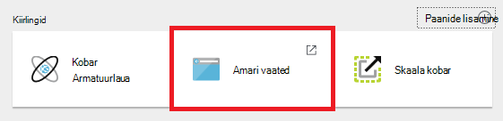
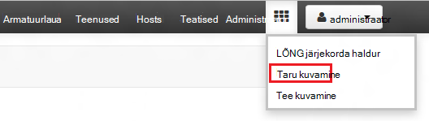
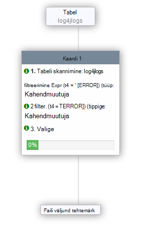
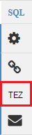

<properties
   pageTitle="Töötamine taru kohta Hdinsightiga (Hadoopi) Ambari vaadete abil | Microsoft Azure'i"
   description="Saate teada, kuidas taru päringute esitada veebibrauseri kaudu taru vaate kasutamine. Taru vaade on varustatud klaster Linux-põhine Hdinsightiga Ambari Web Kasutajaliidese osa."
   services="hdinsight"
   documentationCenter=""
   authors="Blackmist"
   manager="jhubbard"
   editor="cgronlun"
    tags="azure-portal"/>

<tags
   ms.service="hdinsight"
   ms.devlang="na"
   ms.topic="article"
   ms.tgt_pltfrm="na"
   ms.workload="big-data"
   ms.date="10/28/2016"
   ms.author="larryfr"/>

#Hadoopi rakenduses Hdinsightiga taru vaate kasutamine

[AZURE.INCLUDE [hive-selector](../../includes/hdinsight-selector-use-hive.md)]

Ambari on haldus ja esitanud Linux-põhine Hdinsightiga kogumite jälgimisega seotud kasuliku. Üks Ambari kaudu saadaolevad funktsioonid on Web UI, mida saab kasutada taru päringuid käivitada. See on __Taru vaade__koos Hdinsightiga klaster Ambari vaadete osa.

> [AZURE.NOTE] Ambari on palju võimalusi, mida ei arutada selles dokumendis. Lisateabe saamiseks vt [haldamine Hdinsightiga kogumite Ambari Web Kasutajaliidese abil](hdinsight-hadoop-manage-ambari.md).

##Eeltingimused

- Linux-põhine Hdinsightiga kobar. Uus klaster loomise kohta leiate teavet teemast [Alustamine Linux-põhine Hdinsightiga](hdinsight-hadoop-linux-tutorial-get-started.md).

##Avada taru vaade

Saate Ambari vaadete Azure'i portaalis; Valige Hdinsightiga klaster ja seejärel valige __Ambari vaadete__ __Kiirlingid__ jaotise.

Saate ka liikuda otse Ambari minnes https://CLUSTERNAME.azurehdinsight.net veebibrauseris (kus __CLUSTERNAME__ on Hdinsightiga klaster nime) ja valige soovitud ruutude ( __administraatori__ link ja klõpsake lehe vasakus servas nuppu) kõrval menüüst lehe loendis Saadaolevad vaated. Valige __taru vaade__.

.

> [AZURE.NOTE] Kui Ambari, küsitakse teilt, kas soovite autentida saidile. Sisestage admin (vaikimisi `admin`,) konto nimi ja parool, mida kasutasite klaster loomisel.

Peaksite nägema Järgmine leht:

##Kuva tabelid

Valige lehe jaotises __Andmebaasi Exploreris__ __vaikimisi__ kirje kohta vahekaarti __andmebaasid__ . Tabelite loendi kuvatakse vaikimisi andmebaasis. Uus Hdinsightiga klaster, ainult ühest tabelist peaks olemas; __hivesampletable__.

Uue tabeli lisamisel selles dokumendis toodud juhiseid, saate värskendamise ikoon andmebaasi Exploreri paremas ülanurgas saadaolevate tabelite loendi värskendamiseks.

##Päringuredaktor

Taru vaates järgmist abil saate päringut taru kaasas klaster andmetega.

1. Lehe jaotises __Päringuredaktori__ kleepige töölehe HiveQL järgmistest:

        DROP TABLE log4jLogs;
        CREATE EXTERNAL TABLE log4jLogs(t1 string, t2 string, t3 string, t4 string, t5 string, t6 string, t7 string)
        ROW FORMAT DELIMITED FIELDS TERMINATED BY ' '
        STORED AS TEXTFILE LOCATION 'wasbs:///example/data/';
        SELECT t4 AS sev, COUNT(*) AS cnt FROM log4jLogs WHERE t4 = '[ERROR]' GROUP BY t4;

    Need teatised järgmisi toiminguid:

    - **Tabeli DROP** - kustutab tabeli ja selle andmefaili juhuks, kui tabel on juba olemas.
    - **Välise tabeli loomine** – loob uue tabeli "välise" taru. Välise tabeleid talletada tabeli määratlus taru; andmed on jäänud algsesse asukohta.
    - **Rea vorming** – taru saate teada, kuidas andmed on vormindatud. Sel juhul iga log väljad on eraldatud ruumi.
    - **Salvestatud AS TEKSTIFAILIDE asukoht** – ütleb taru, kus andmed on salvestatud (nt/andmete kataloogi) ja see, et tekstina.
    - **Valige** - valib kõik read, kus veerus t4 sisaldab väärtust [ERROR] arv.

    >[AZURE.NOTE] Kui eeldate alusandmete tuleb värskendada välise andmeallikaga, nagu on automaatne andmete üleslaadimine või mõne muu MapReduce toiming, mida tuleb kasutada välise tabeleid, kuid soovite alati taru päringute kasutada uusimaid andmeid. Kas pukseerimine on Välistabel *ei* Kustuta andmed tabeli määratlus.

2. Päringu alustamiseks kasutada allosas akna Päringuredaktor nuppu __Käivita__ . See peaks oranžiks ja teksti muudab __toimingu__peatamiseks. Jaotise __Päringutulemite protsess__ peaks Päringuredaktori all kuvatakse ja kuvada teavet töö.

    > [AZURE.IMPORTANT] Mõnes brauseris õigesti Värskenda Logi või tulemid teabe. Kui käivitate töö ja tundub, et käivitada terve igavik värskendamata Logi või tagasta tulemeid, proovige, Mozilla FireFox või Google Chrome selle asemel kasutada.

3. Kui päring on lõpule jõudnud, kuvatakse __Protsessi päringutulemite__ jaotise toimingu tulemusi. Nupp __Peata täitmise__ muudab ka tagasi rohelist nuppu __Käivita__ . Vahekaardi __tulemuste__ peaks sisaldama järgmist teavet:

        sev       cnt
        [ERROR]   3

    __Logide__ vahekaardil saab töö loodud logimine teabe kuvamiseks. Saate selle päringu abil probleemide tõrkeotsinguks.

    > [AZURE.TIP] Pange tähele, __salvestada tulemused__ drop-down dialoogiboksi jaotise __Protsessi päringutulemite__ vasakus ülanurgas Saate selle tulemused alla laadida või neid Hdinsightiga salvestusruumi CSV-failina salvestada.

3. Valige selle päringu neli esimest rida, valige __Käivita__. Pange tähele, et tulemusi pole pärast töö lõpulejõudmist. See on __käivitamine__ nupu abil, kui on valitud osa päring käivitub ainult valitud teksti. Sel juhul valiku ei kaasata lõplik lause, mis toob ridade tabelist. Kui valite ainult sellel real ja kasutada __käivitamine__, peaksite nägema oodatud tulemusi.

3. Uue töölehe loomiseks kasutada __Päringuredaktori__ allosas nupp __Uus tööleht__ . Sisestage uue töölehe HiveQL järgmistest:

        CREATE TABLE IF NOT EXISTS errorLogs (t1 string, t2 string, t3 string, t4 string, t5 string, t6 string, t7 string) STORED AS ORC;
        INSERT OVERWRITE TABLE errorLogs SELECT t1, t2, t3, t4, t5, t6, t7 FROM log4jLogs WHERE t4 = '[ERROR]';

    Need teatised järgmisi toiminguid:

    - **Looge tabel kui pole olemas** - loob tabeli, kui see pole juba olemas. Kuna **väline** märksõna ei kasutata, see on sisemine tabel, mis on talletatud taru andmebaas ja hallatakse täielikult taru. Erinevalt välise tabeleid, pukseerimine on sisemine tabel kustutatakse ka aluseks olevad andmed.
    - **Salvestatud AS ORC** - salvestab andmed optimeeritud rea piklikku (ORC) vormingus. See on väga optimeeritud ja tõhusa vorming taru andmete talletamiseks.
    - **Lisa kirjutada... Valige** - klõpsab ridade **log4jLogs** tabeli, mis sisaldavad [ERROR] ja seejärel lisab andmed tabelisse **errorLogs** .

    Kasutage selle päringu käivitamiseks nuppu __Käivita__ . Vahekaardi __tulemuste__ ei sisalda teavet selle päringu tagastatud ridu, aga olek peaks kuvada __õnnestus__.

###Taru sätted

Valige redaktori paremal ikooni __sätted__ .

Sätteid saab muuta erinevate taru sätteid, näiteks muutmine täitmise mootori mesilaspere Tez (vaikeväärtus): MapReduce.

###Visual selgitatakse

Valige paremas servas redaktori __Visuaalse selgitatakse__ ikoon.

See on __Visuaalse selgitavad,__ päringu, mis võib olla kasulik mõista keerukate päringute voo vaade. Päringuredaktoris __selgitage__ nupu abil saate vaadata teksti moodustab see vaade.

###Tez

Valige paremas servas redaktori __Tez__ ikoon.

See kuvab suunatud atsüklilised graafik (DAG) kasutavad Tez selle päringu, kui see on saadaval. Kui soovite vaadata DAG päringuid olete käivitasite kasutusel varasemast või silumine Tez protsessi [Tez vaate](hdinsight-debug-ambari-tez-view.md) asemel.

###Teatised

Valige __teatiste__ ikoon redaktori paremal.

Mis on loodud päringu käivitamisel on teatised. Näiteks saate teatise, kui päring on esitatud või kui ilmneb tõrge.

##Salvestatud päringud

1. Päringuredaktori: looge uus tööleht ja sisestage järgmine päring.

        SELECT * from errorLogs;

    Käivita päring kinnitamaks, et see toimib. Tulemused on järgmine:

        errorlogs.t1    errorlogs.t2    errorlogs.t3    errorlogs.t4    errorlogs.t5    errorlogs.t6    errorlogs.t7
        2012-02-03  18:35:34    SampleClass0    [ERROR]     incorrect   id  
        2012-02-03  18:55:54    SampleClass1    [ERROR]     incorrect   id  
        2012-02-03  19:25:27    SampleClass4    [ERROR]     incorrect   id

2. Kasutage redaktori allservas nuppu __Salvesta nimega__ . Selle päringu __Errorlogs__ nimi ja klõpsake nuppu __OK__. Pange tähele, et töölehe nimeks __Errorlogs__.

3. Valige vahekaart __Salvestatud päringute__ taru vaate ülaosas. Pange tähele, et __Errorlogs__ on nüüd salvestatud päringu loetletud. See jääb selles loendis, kuni te selle eemaldada. Valides nime avatakse päring aknas Päringuredaktor.

##Päringu ajalugu

Taru vaate ülaosas nuppu __ajalugu__ võimaldab kuvamine päringutele teil käivitasite varem. Kasutage seda nüüd ja valige mõned päringud, mis teil oli varem. Kui valite päringu, see avatakse see Päringuredaktoris.

##Kasutaja määratletud funktsioonid (UDF)

Taru saab **kasutaja määratletud funktsioonid (UDF)**kaudu pikendada. Soovitud UDF võimaldab teil rakendada funktsioone või loogika, mis pole kerge vaevaga kujundatud HiveQL.

Kui lisate mõne UDF osana HiveQL laused päringus, taru vaate ülaosas vahekaarti UDF võimaldab teil deklareerida ja UDF-ID, mida saab kasutada __Päringuredaktori__saate salvestada.

Kui olete lisanud on UDF taru vaate, kuvatakse __Päringuredaktori__allservas kuvatakse nupp __Lisa UDF-ID__ . Valige see kuvab rippmenüü loendi UDF-ID määratletud taru vaates. Valige soovitud UDF lisab HiveQL laused päringu lubamiseks UDF.

Oletagem näiteks, kui olete määratlenud mõne UDF koos järgmised atribuudid:

* Ressursi nimi: myudfs
* Ressursi tee: wasbs:///myudfs.jar
* UDF-i nimi: myawesomeudf
* UDF klassinimi: com.myudfs.Awesome

Nupp __Lisa UDF-ID__ abil kuvatakse kirje nimega __myudfs__, koos mõne muu ripploendi iga UDF selle ressursi jaoks määratletud. Sel juhul __myawesomeudf__. Valides kirje lisamine järgmine päring algusse:

    add jar wasbs:///myudfs.jar;

    create temporary function myawesomeudf as 'com.myudfs.Awesome';

Seejärel saate UDF päringus. Näiteks `SELECT myawesomeudf(name) FROM people;`.

UDF-ID abil taru Hdinsightiga kohta lisateabe saamiseks vaadake järgmist:

* [Kasutades Python taru ja Hdinsightiga siga](hdinsight-python.md)

* [Kuidas lisada kohandatud taru UDF Hdinsightiga](http://blogs.msdn.com/b/bigdatasupport/archive/2014/01/14/how-to-add-custom-hive-udfs-to-hdinsight.aspx)

##Järgmised sammud

Üldteavet taru sisse Hdinsightiga:

* [Hadoopi Hdinsightiga taru kasutamine](hdinsight-use-hive.md)

Teavet teiste mooduste kohta, saate töötada Hadoopi Hdinsightiga:

* [Kasutage siga Hadoopi Hdinsightiga](hdinsight-use-pig.md)

* [Hadoopi Hdinsightiga MapReduce kasutamine](hdinsight-use-mapreduce.md)
