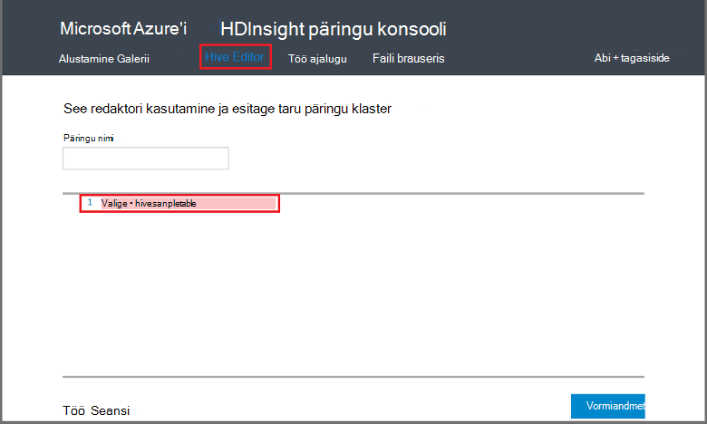

<properties
   pageTitle="Hadoopi taru kasutamine päringu konsooli Hdinsightiga | Microsoft Azure'i"
   description="Saate teada, kuidas päringu veebipõhise konsooli abil saate käivitada taru päringud on Hdinsightiga Hadoopi kobar brauseri kaudu."
   services="hdinsight"
   documentationCenter=""
   authors="Blackmist"
   manager="jhubbard"
   editor="cgronlun"
    tags="azure-portal"/>

<tags
   ms.service="hdinsight"
   ms.devlang="na"
   ms.topic="article"
   ms.tgt_pltfrm="na"
   ms.workload="big-data"
   ms.date="09/20/2016"
   ms.author="larryfr"/>

# Päringu konsooli abil taru päringute sooritamine

[AZURE.INCLUDE [hive-selector](../../includes/hdinsight-selector-use-hive.md)]

Selles artiklis saate teada, kuidas kasutada Hdinsightiga päringu konsooli taru päringute käitamist on Hdinsightiga Hadoopi kobar brauseri kaudu.

> [AZURE.IMPORTANT] Hdinsightiga päringu konsooli on saadaval Windowsi-põhiste Hdinsightiga kogumite ainult. Kui kasutate Linux-põhine Hdinsightiga kobar, kohta leiate artiklist [käivitada taru päringute taru vaate kasutamine](hdinsight-hadoop-use-hive-ambari-view.md).

##Eeltingimused

Selles artiklis toodud juhiseid tegemiseks on vaja järgmist.

* Windowsi-põhiste Hdinsightiga Hadoopi kobar

* Tänapäevane veebibrauseris

##Päringu konsooli abil taru päringute sooritamine

1. Avage veebibrauser ja liikuge __https://CLUSTERNAME.azurehdinsight.net__, kus __CLUSTERNAME__ on klaster Hdinsightiga nimi. Kui kuvatakse vastav viip, sisestage kasutajanimi ja parool, mida kasutasite klaster loomisel.

2. Valige lehe ülaosas linke, **Taru redigeerija**. Kuvatakse vorm, mis saab sisestada HiveQL laused, mis Hdinsightiga klaster käivitada.

    

    Teksti asendamine `Select * from hivesampletable` koos HiveQL järgmistest:

        set hive.execution.engine=tez;
        DROP TABLE log4jLogs;
        CREATE EXTERNAL TABLE log4jLogs (t1 string, t2 string, t3 string, t4 string, t5 string, t6 string, t7 string)
        ROW FORMAT DELIMITED FIELDS TERMINATED BY ' '
        STORED AS TEXTFILE LOCATION 'wasbs:///example/data/';
        SELECT t4 AS sev, COUNT(*) AS count FROM log4jLogs WHERE t4 = '[ERROR]' AND INPUT__FILE__NAME LIKE '%.log' GROUP BY t4;

    Need teatised järgmisi toiminguid:

    * **Tabeli LANGEV**: kustutab tabeli ja andmefaili, kui tabel on juba olemas.
    * **Välise tabeli loomine**: loob uue tabeli "väline" taru. Välise tabeleid talletada tabeli määratlus taru; andmed on jäänud algsesse asukohta.

    > [AZURE.NOTE] Kui eeldate alusandmete tuleb värskendada välise andmeallikaga (nt automaatne andmete üleslaadimine) või mõni muu MapReduce toiming tuleb kasutada välise tabeleid, kuid tahate alati taru päringute kasutada uusimaid andmeid.
    >
    > Kas pukseerimine on Välistabel **ei** Kustuta andmed tabeli määratlus.

    * **Rea vorming**: taru saate teada, kuidas andmed on vormindatud. Sel juhul iga log väljad on eraldatud ruumi.
    * **Salvestatud AS TEKSTIFAILIDE asukoht**: ütleb taru, kus andmed on salvestatud (nt/andmete kataloogi) ja tekstina talletatud
    * **Valige**: valige kui veeru **t4** sisaldavad väärtust **[ERROR]**kõigi ridade arv. See peaks tagastama väärtus **3** , sest seal on kolm rida, mis sisaldavad seda väärtust.
    * **INPUT__FILE__NAME nagu "%.log"** - kirjeldatakse, mida me ainult tagasi andmete failidest, mille lõpus on taru. log. See piirab otsingu sample.log faili, mis sisaldab andmeid, ja tagastab andmed muu näiteks andmefailid, mis ei vasta meil määratletud skeemiga hoiab.

2. Klõpsake **esitada**. **Töö seansi** lehe allosas peaks olema kuvatud projekti üksikasjad.

3. Kui välja **olek** muutub **lõpule viidud**, valige **Kuva üksikasjad** töö. Klõpsake lehel üksikasjad **Töö väljund** sisaldab `[ERROR]   3`. Saate **alla laadida** nupp selle välja alla, töö väljund sisaldava faili alla laadida.

##Kokkuvõte

Nagu näete, päringu konsooli abil on lihtne taru päringute käivitamiseks on Hdinsightiga kobar, töö oleku jälgimine ja tuua väljund.

Taru päringu konsooli abil saate käivitada taru tööd kohta lisateabe saamiseks valige **Alustamine** päringu konsooli ülaosas ja seejärel kasutage näidised, mis on esitatud. Iga valimi tutvustatakse protsessi kasutades taru analüüsimiseks, sh selgitused HiveQL laused, kasutatakse valimi kohta.

##Järgmised sammud

Üldist teavet rakenduses Hdinsightiga taru kohta:

* [Hadoopi Hdinsightiga taru kasutamine](hdinsight-use-hive.md)

Teavet teiste mooduste kohta saate töötada Hadoopi Hdinsightiga:

* [Kasutage siga Hadoopi Hdinsightiga](hdinsight-use-pig.md)

* [Hadoopi Hdinsightiga MapReduce kasutamine](hdinsight-use-mapreduce.md)

Kui kasutate Tez taru, leiate teavet silumine järgmised dokumendid.

* [Windowsi-põhiste Hdinsightiga Tez UI kasutamine](hdinsight-debug-tez-ui.md)

* [Kasutage Linux-põhine Hdinsightiga Ambari Tez vaade](hdinsight-debug-ambari-tez-view.md)

[1]: ../HDInsight/hdinsight-hadoop-visual-studio-tools-get-started.md

[hdinsight-sdk-documentation]: http://msdnstage.redmond.corp.microsoft.com/library/dn479185.aspx

[azure-purchase-options]: http://azure.microsoft.com/pricing/purchase-options/
[azure-member-offers]: http://azure.microsoft.com/pricing/member-offers/
[azure-free-trial]: http://azure.microsoft.com/pricing/free-trial/

[apache-tez]: http://tez.apache.org
[apache-hive]: http://hive.apache.org/
[apache-log4j]: http://en.wikipedia.org/wiki/Log4j
[hive-on-tez-wiki]: https://cwiki.apache.org/confluence/display/Hive/Hive+on+Tez
[import-to-excel]: http://azure.microsoft.com/documentation/articles/hdinsight-connect-excel-power-query/

[hdinsight-use-oozie]: hdinsight-use-oozie.md
[hdinsight-analyze-flight-data]: hdinsight-analyze-flight-delay-data.md

[hdinsight-storage]: hdinsight-hadoop-use-blob-storage.md

[hdinsight-provision]: hdinsight-provision-clusters.md
[hdinsight-submit-jobs]: hdinsight-submit-hadoop-jobs-programmatically.md
[hdinsight-upload-data]: hdinsight-upload-data.md
[hdinsight-get-started]: hdinsight-hadoop-linux-tutorial-get-started.md

[Powershell-install-configure]: powershell-install-configure.md
[powershell-here-strings]: http://technet.microsoft.com/library/ee692792.aspx

[img-hdi-hive-powershell-output]: ./media/hdinsight-use-hive/HDI.Hive.PowerShell.Output.png
