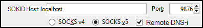
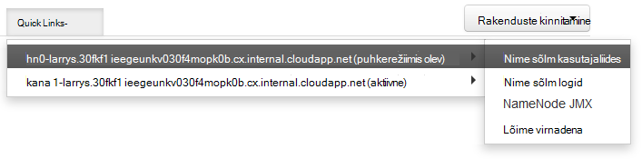

<properties
pageTitle="Juurdepääs Ambari web UI, ResourceManager, JobHistory, NameNode, Oozie ja muud web UI SSH Tunneling abil"
description="Saate teada, kuidas kasutada mõne SSH tunneliga turvaliselt sirvida oma Linuxi-põhiste Hdinsightiga sõlmed majutatud veebiressursid."
services="hdinsight"
documentationCenter=""
authors="Blackmist"
manager="jhubbard"
editor="cgronlun"/>

<tags
ms.service="hdinsight"
ms.devlang="na"
ms.topic="article"
ms.tgt_pltfrm="na"
ms.workload="big-data"
ms.date="10/17/2016"
ms.author="larryfr"/>

# Juurdepääs Ambari web UI, JobHistory, NameNode, Oozie ja muud web UI SSH Tunneling abil

Linux-põhine Hdinsightiga kogumite juurdepääsu Ambari web UI Interneti kaudu, kuid mõned funktsioonid UI pole. Näiteks veebist UI muude teenustega, mis on uurinud Ambari kaudu. Ambari kasutajaliides Web täisfunktsionaalsuse, peate kasutama mõne SSH tunneliga kobar pähe.

## Mida nõuab mõne SSH tunneliga?

Mitut Ambari menüüsid pole täielikult asustada ilma on SSH tunneliga, nagu toetuvad veebilehti ja teenuseid, mis on esitatud klaster muude Hadoopi teenuseid. Sageli nende veebisaitide ei ole turvatud, seega ei ole turvalised otse neilt Interneti-ühendus. Mõnikord töötab teenus veebisaidi teise kobar sõlme, nt Zookeeper sõlm.

Järgnevalt on teenused, mis kasutab Ambari web UI, ei pääse mõne SSH tunneliga ilma.

* JobHistory,
* NameNode,
* Lõime virnadena,
* Oozie web UI
* HBase juhtslaidi ja logid kasutajaliides

Kui skripti toimingute abil saate kohandada klaster, mis tahes teenuseid või Utiliidid, mille saate installida jätke kasutajaliides web on SSH tunneliga vajavad. Näiteks kui installite tooni skript toimingu abil, peate kasutama mõne SSH tunneliga juurde pääseda tooni web UI.

## Mis on mõni SSH tunneliga?

[Secure Shell (SSH) tunneling](https://en.wikipedia.org/wiki/Tunneling_protocol#Secure_Shell_tunneling) marsruudib liikluse oma kohaliku töökoha SSH ühenduse oma Hdinsightiga kobar pea sõlme, kaudu, kui taotluse seejärel lahendada nagu siis, kui see on pärit pea sõlme porti saadetud. Vastuse marsruuditakse siis tunneliga, et oma töökoha piires tagasi.

## Eeltingimused

Web liiklus on SSH tunneliga kasutamisel peab teil olema järgmised:

* SSH kliendi. Unix ja Linux jaotuse või Mac OS X, on `ssh` käsk on esitatud operatsioonisüsteemi. Windowsi jaoks, siis soovitame [PuTTY](http://www.chiark.greenend.org.uk/~sgtatham/putty/download.html)

    > [AZURE.NOTE] Kui soovite kasutada SSH kliendi kui `ssh` või pahtel, pöörduge oma kliendi kohta, kuidas luua mõne SSH tunneliga dokumentatsiooni.

* Veebibrauseris, mida saab konfigureerida sokid puhverserveri kasutamine

## Mõne käsuga SSH tunneliga loomine

Kasutage järgmine käsk luua mõne SSH tunneli abil soovitud `ssh` käsk. Asendage __kasutajanimi__ SSH kasutajaga klaster Hdinsightiga jaoks, ja __CLUSTERNAME__ klaster Hdinsightiga nimi

    ssh -C2qTnNf -D 9876 USERNAME@CLUSTERNAME-ssh.azurehdinsight.net

See loob ühenduse, mis marsruudib liikluse kohaliku port 9876 klaster üle SSH. Valikud on järgmised:

* **D 9876** – kohaliku portide, mis kuvatakse marsruutida liikluse kaudu soovitud tunneliga.

* **C** - tihendamine kõik andmed, sest web liiklus on peamiselt teksti.

* **2** - Jõusta SSH protokolli versiooni 2 ainult proovida.

* **k** - vaikne režiim.

* **T** - Keela pseudo-tty eraldatud, kuna me on lihtsalt edastada port.

* **n** - vältida lugemine STDIN, kuna me on lihtsalt edastada port.

* **N** - käivitada kaugjuhtimine, kuna me on lihtsalt edastada port.

* **f** - taustal.

Kui olete konfigureerinud klaster on SSH võti, peate kasutamine on `-i` parameetri ja määrake SSH privaatvõti tee.

Kui käsk viimistluse liikluse suunamiseks pordi 9876 kohalikus arvutis suunatakse üle Secure Sockets Layer (SSL) klaster pea sõlm ja seal pärinevad kuvada.

## Looge tunneliga, mis on kitt abil

Järgmiste juhiste abil saate luua SSH tunneliga, mis PuTTY abil.

1. Avage PuTTY ja sisestage oma ühenduse teave. Kui olete tuttav kitt, leiate teavet [Kasutada SSH koos Linux-põhine Hadoopi Hdinsightiga Windows](hdinsight-hadoop-linux-use-ssh-windows.md) kohta, kuidas seda kasutada koos Hdinsightiga.

2. Dialoogiboksi vasakul jaotises **kategooria** laiendamiseks **ühendust**, laiendage **SSH**ja valige **tunnelid**.

3. Vormi **Valikud juhtimine SSH pordi suunamise** järgmist teavet:

    * **Lähteport** - porti klient, mida soovite edastada. Näiteks **9876**.

    * **Sihtkoha** - The SSH aadress Linux-põhine Hdinsightiga kobar. Näiteks **mycluster-ssh.azurehdinsight.net**.

    * **Dünaamiliste** - lubab dünaamiline sokid puhverserveri marsruutimist.

    

4. Lisamiseks klõpsake nuppu **Lisa** sätted ja valige SSH ühendus avamiseks **avage** .

5. Kui palutakse, logige sisse server. See luua mõne SSH seanssi ja luba selle tunneliga.

## Kasutage tunneliga brauseri kaudu

> [AZURE.NOTE] Selle jaotise juhised kasutada Firefoxi brauseris, kui see on allalaadimiseks saadaval Linuxi, Unix, Mac OS X-ja Windows. Muud tänapäevane brauserite kaudu sokid proxy töötab ka.

1. Brauseri kasutamiseks **localhost:9876** **sokid v5** puhverserveri konfigureerimine. Siin on Firefoxi sätted näha. Kui kasutasite erinevat porti kui 9876, mida kasutati pordi muutmine

    

    > [AZURE.NOTE] Valige **Remote DNS-i** lahendada süsteemi (DNS) taotlusi Hdinsightiga kobar abil. Kui see on valimata, lahendada DNS-i kohalikult.

2. Veenduge, et liikluse marsruuditakse läbi soovitud tunneliga, ment saidi [http://www.whatismyip.com/](http://www.whatismyip.com/) puhverserveri sätete abil lubatud ja keelatud Firefox. Ajal sätted on lubatud, saab Microsoft Azure'i andmekeskuses masina IP-aadress.

##Ambari Web UI kinnitamine

Kui klaster on loodud, järgige järgmisi juhiseid kinnitamaks, et pääseksite teenuse web UIs Ambari veebi kaudu:

1. Avage oma brauseris http://headnodehost:8080. Funktsiooni `headnodehost` aadress saadetakse üle soovitud tunneliga klaster ning headnode, mis töötab Ambari lahendamiseks. Küsimise korral sisestage klaster administraatori kasutajanime (haldus) ja parool. Teilt võidakse teist korda Ambari Web UI. Sel juhul teavet uuesti sisestada.
    
    > [AZURE.NOTE] Http://headnodehost:8080 aadressi kasutamisel klaster ühenduse loote otse üle tunneliga pea sõlme, mis Ambari töötab HTTP kaudu ja suhtlus on turvatud SSH tunneliga abil. loomisel on tunneliga kasutamine ilma Interneti side on turvatud HTTPS-i kaudu. Internetis HTTPS-i abil ühenduse kasutamine https://CLUSTERNAME.azurehdinsight.net, kus __CLUSTERNAME__ on klaster nimi.

2. Valige Ambari Web UI, HDFS loendist klõpsake lehe vasakus servas.

    

3. Kui kuvatakse HDFS teenuseteabe, valige __Kiirlingid__. Kuvatakse loend kobar pea sõlmed. Valige üks pea sõlmed ja valige __NameNode UI__.

    

    > [AZURE.NOTE] Kui teil on aeglane Interneti-ühendus või pea sõlme on väga hõivatud, võite saada ootamine indikaator asemel menüü __Kiirlingid__valimisel. Kui jah, oodake paar minutit kaks serverist saadud andmed ja seejärel proovige uuesti loendi.
    >
    > Kui teil on väiksem eraldusvõime või brauseriaknas pole suurendatud, võib mõni kirje __Kiirlingid__ menüüs lõigata, ekraani paremas servas. Sel juhul laiendada menüü hiire abil ja seejärel kerige ekraani paremas menüü ülejäänud paremnoolt abil.

4. Kuvatakse leht sarnaneb järgmisega:

    

    > [AZURE.NOTE] Pange tähele, URL-i sellelt lehelt; See peaks sarnanema __http://hn1-CLUSTERNAME.randomcharacters.cx.internal.cloudapp.net:8088/kobar__. See on kasutusel sõlme sisemine täielik domeeninimi (FQDN) ja see pole saadaval ka SSH tunneliga kasutamata.

## Järgmised sammud

Nüüd, kui olete õppinud, kuidas luua ja kasutada ka SSH tunneliga, jälgimine ja haldamine klaster Ambari kasutamise kohta vaadake järgmist teavet:

* [Hdinsightiga kogumite abil Ambari haldamine](hdinsight-hadoop-manage-ambari.md)

Hdinsightiga SSH kasutamise kohta lisateabe saamiseks vt järgmist:

* [Kasutada SSH Linux-põhine Hadoopi Hdinsightiga Linux, Unix või OS X](hdinsight-hadoop-linux-use-ssh-unix.md)

* [Kasutada SSH Linux-põhine Hadoopi Windows Hdinsightiga](hdinsight-hadoop-linux-use-ssh-windows.md)
