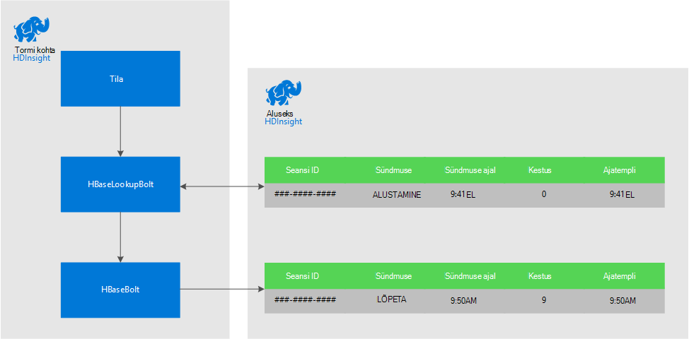
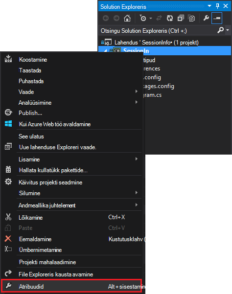
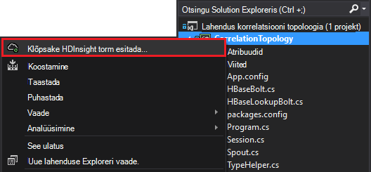

<properties
 pageTitle="Aja jooksul torm ja klõpsake Hdinsightiga HBase seostada sündmused"
 description="Saate teada, kuidas oleksid sündmused, mis saabu korda Hdinsightiga torm ja HBase abil."
 services="hdinsight"
 documentationCenter=""
 authors="Blackmist"
 manager="jhubbard"
 editor="cgronlun"
 tags="azure-portal"/>

<tags
 ms.service="hdinsight"
 ms.devlang="dotnet"
 ms.topic="article"
 ms.tgt_pltfrm="na"
 ms.workload="big-data"
 ms.date="10/27/2016"
 ms.author="larryfr"/>

# Aja jooksul torm ja klõpsake Hdinsightiga HBase seostada sündmused

Apache torm püsivate andmesalve abil saate oleksid andmete sisestamist, mis eri aegadel kohale. Näiteks linkimise Logi sisse ja välja logida sündmuste kasutaja seansi arvutamiseks, kui kaua kestis seansi jaoks.

Selles dokumendis saate teada, kuidas luua lihtsa C# Storm topoloogia, mis jälgib sündmuste logi sisse ja välja logida kasutaja seansid ja seansi kestuse arvutab. Topoloogia kasutab HBase püsivate andmesalve. HBase võimaldab teil teha paketi päringute eelnevate andmete, andes täiendavad ülevaateid, nt mitu kasutaja seanssi olid alustamine või lõppenud kindla ajavahemiku jooksul.

## Eeltingimused

- Visual Studio ja Visual Studio Hdinsightiga Tööriistad: installi lisateabe saamiseks vt [Hdinsightiga tööriistad Visual Studio kasutamise alustamine](../HDInsight/hdinsight-hadoop-visual-studio-tools-get-started.md) .

- Apache Storm klõpsake Hdinsightiga klaster (Windowsi-põhises). See käivitab Storm topoloogia, mis töötleb sissetulevaid andmeid ja talletab selle HBase.

    > [AZURE.IMPORTANT] Ajal SCP.NET topoloogiatest on toetatud pärast 28-10-2016 loodud Linuxi-põhiste Storm kogumite, HBase SDK .NET paketi kättesaadavad 28-10-2016 ei tööta õigesti Linux.

- Klõpsake Hdinsightiga kobar Apache HBase (Linux või Windowsi-põhiste). See on andmesalve selle näite puhul.

## Arhitektuur

Sündmuste tõestusmeetodid nõuab levinud identifikaator Sündmuse allikas. For example, kasutaja ID, seansi ID või muud, mis on a) kordumatu ja b) kaasatud kõik andmed, mis on saadetud torm. Selles näites kasutatakse GUID väärtus tähistada seansi ID-ga.

Selles näites koosneb kahest Hdinsightiga kogumite.

-   HBase: püsivate andmesalve andmeid

-   Tormi: kasutatud neelata sissetulevad andmed

Andmed on genereeritud juhusliku ID-ga Storm topoloogia ja koosneb järgmistest osadest.

-   Seansi ID: GUID, mis tuvastab kordumatult iga seanss

-   Sündmuse: algus- või end-klahv sündmus. Selle näite puhul ilmneb START alati enne lõppu

-   Aeg: sündmuse ajal.

Andmeid töödeldakse ja talletatud HBase.

### Torm topoloogia

Seansi käivitamisel **käivitamine** sündmuse saadud topoloogia ja HBase logitud. Sündmuse **END** saabumisel topoloogia toob sündmuse **käivitamine** ja arvutab kahe sündmuste. Selle **kestus** väärtus talletatakse seejärel HBase koos **END** sündmuse teabe.

> [AZURE.IMPORTANT] Kuigi see topoloogia näitab tavaline muster, tootmise lahenduse oleks vaja võtta kujundus järgmistel juhtudel:
>
> - Välja tellimuse saabuvate sündmuste
> - Dubleeritud sündmused
> - Läbi mitme rea ulatuva sündmused

Valimi topoloogia koosneb järgmistest osadest:

-   Session.CS: jäljendab kasutaja seansi loomisega juhusliku seansi ID, start aega ja kaua kestab seanss

-   Spout.CS: loob 100 seansid, eraldab algus sündmuse, ei pea iga seansi juhusliku ajalõpp ja seejärel eraldab sündmuse lõpp. Seejärel ringlusse lõ seansid uusi faile luua.

-   HBaseLookupBolt.cs: kasutab seansi ID HBase seansi teabe otsimiseks. Kui END sündmuse töödeldakse, leiab see vastava algus sündmuse ja arvutab seansi kestus.

-   HBaseBolt.cs: Talletatud teabe importimine HBase.

-   TypeHelper.cs: Aitab tüübi teisendamise kui lugemine ja kirjutamine HBase.

### HBase skeem

HBase, talletatakse andmeid tabel koos skeemi/sätted:

-   Rea võti: seansi ID-d kasutatakse selle tabeli ridade võti

-   Veeru pere: perekonna nimi on "vt". Veerud, salvestatakse see pere on:

    -   sündmuse: algus- või end-klahv

    -   korda: aeg millisekundites, sündmusele

    -   Kestus: algus ja lõpp sündmuse vaheline

-   VERSIOONID: "vt" perekond on seatud alles 5 hoida iga rea kohta

    > [AZURE.NOTE] On Logi eelmised väärtused, mis on talletatud kindla rea võti. Vaikimisi HBase tagastab ainult uusima versiooni rea väärtus. Sel juhul kasutatakse sama rea iga rea versiooni on tähistatud ajatempli väärtus kõik sündmused (algus, lõpp.). See pakub ajalooliste vaadet sündmused sisseloginud jaoks teatud ID-ga.

## Projekti allalaadimine

Proovi projekti saab alla laadida [https://github.com/Azure-Samples/hdinsight-storm-dotnet-event-correlation](https://github.com/Azure-Samples/hdinsight-storm-dotnet-event-correlation).

Selle alla laadida sisaldab järgmisi projekte C#:

-   CorrelationTopology: C# Storm topoloogia, mis eraldab CEIP algus- ja sündmuste kasutaja seansi jaoks. Iga seanss kestab vahemikus 1 kuni 5 minutit.

-   SessionInfo: C# konsooli rakendus, mis loob HBase tabeli ja pakub näide päringute salvestatud seansi andmete kohta käiva teabe tagastamiseks.

## Tabeli loomine

1. Avage projekt **SessionInfo** Visual Studios.

2. **Lahenduste Explorer**, paremklõpsake **SessionInfo** projekti ja valige **Atribuudid**.

    

3. Valige **sätted**ja seejärel määrake järgmised väärtused.

    -   HBaseClusterURL: HBase klaster URL. Näiteks https://myhbasecluster.azurehdinsight.net

    -   HBaseClusterUserName: administraator/http kaudu kasutajakonto klaster jaoks

    -   HBaseClusterPassword: administraator/http kaudu kasutajakonto parooli

    -   HBaseTableName: selles näites kasutamiseks tabeli nimi

    -   HBaseTableColumnFamily: Veergu perekonnanimi

    

5. Käivitage lahendus. Vastava viiba kuvamisel valige "c" klahvi HBase klaster tabelit luua.

## Luua ja juurutada Storm topoloogia

1.  Avage **CorrelationTopology** lahenduse Visual Studios.

2.  **Solution Exploreris** **CorrelationTopology** projekti paremklõps ja valige Atribuudid.

3.  Aken Atribuudid nuppu **sätted** ja sisestage järgmine teave. Esimese 5 peaksid olema samad väärtused, mis kasutavad **SessionInfo** projekti:

    -   HBaseClusterURL: HBase klaster URL. Näiteks https://myhbasecluster.azurehdinsight.net

    -   HBaseClusterUserName: administraator/http kaudu kasutajakonto klaster jaoks

    -   HBaseClusterPassword: administraator/http kaudu kasutajakonto parooli

    -   HBaseTableName: selles näites kasutamiseks tabeli nimi. See peaks sisaldama sama tabeli nimi, mida kasutatakse SessionInfo projekti

    -   HBaseTableColumnFamily: Veeru pere nimi. See peaks sisaldama sama veeru pere nimi, mida kasutatakse SessionInfo projekti

    > [AZURE.IMPORTANT] Muuta HBaseTableColumnNames, kui vaikesätteid on kasutada andmete toomiseks **SessionInfo** nimed.

4.  Salvestage atribuudid ja seejärel luua projekti.

5.  **Solution Exploreris**projekti paremklõps ja valige **Edasta torm Hdinsightiga kohta**. Kui kuvatakse vastav viip, sisestage mandaat Azure tellimuse.

    

6.  Märkige dialoogiboksis **Esitada topoloogia** Storm kobar, mis töötab see topoloogia.

    > [AZURE.NOTE] Esimest korda, kui saadate topoloogia, võib kuluda mõne hetke tuua oma Hdinsightiga kogumite nime.

7.  Kui topoloogia on üles laaditud ja esitada klaster, **Storm topoloogia vaate** avamine ja kuvada esitatava topoloogia. Valige **CorrelationTopology** ja kasutada ülaosas nuppu Värskenda topoloogia teabe värskendamiseks lehe paremas ülanurgas.

    

    Kui topoloogia hakkab andmeid, kuvatakse inkrementida **Emitted** veerus olevat väärtust.

    > [AZURE.NOTE] Kui **Torm topoloogia vaade** automaatselt ei avane, kasutada selle avamiseks järgmist:
    >
    > 1. **Solution Exploreris**, laiendage **Azure**ja seejärel laiendage **Hdinsightiga**.
    >
    > 2. Paremklõpsake Storm kobar, mis töötab topoloogia ja seejärel valige **Kuva Storm topoloogiatest**

## Päringu andmete

Pärast andmete emiteerimist järgmiste juhiste abil päringu andmed.

1. Naaske **SessionInfo** projekt. Kui ei tööta, käivitage uue eksemplari.

2. Vastava viiba kuvamisel valige **s** otsimiseks Alusta sündmus. Teil palutakse sisestada algus- ja kellaaja määratleda ajavahemiku – tagastatakse ainult sündmuste vahel need kaks korda.

    Kasutage järgmist vormingut, algus- ja lõpuaegade sisestamisel: hh: mm ja "olen" või "pm. Näiteks 11:20 pm.

    Kuna topoloogia on hakanud, kasutage algus aega enne, kui see on juurutatud ja nüüd lõppaega. See peaks jäädvustada enamik START sündmusi, mis loodi selle käivitamisel. Kui päring, peaksite nägema loendi kirjed, mis on järgmine:

        Session e6992b3e-79be-4991-afcf-5cb47dd1c81c started at 6/5/2015 6:10:15 PM. Timestamp = 1433527820737

Lõpeta sündmuste otsimine toimib sarnaselt algus sündmused. Siiski luuakse END sündmuste CEIP 1 kuni 5 minutit pärast algus sündmuse vahel. Seega peate Proovige mõne aja vahemike selleks, et leida END sündmused. Lõpeta sündmuste sisaldab seansi - vahe sündmuse alguskellaaeg ja lõppkellaaeg sündmuse kestus. Siin on näide andmeid END sündmuste jaoks:

    Session fc9fa8e6-6892-4073-93b3-a587040d892e lasted 2 minutes, and ended at 6/5/2015 6:12:15 PM

> [AZURE.NOTE] Kuigi kellaaja väärtuste sisestamisel on kohalikku aega, saab päringu tagastatud aeg UTC.

##Topoloogia peatamine

Kui olete valmis topoloogia lõpetada, naaske **CorrelationTopology** projekti Visual Studios. **Torm topoloogia vaade**, valige soovitud topoloogia ja seejärel kasutage **tappa** nupp topoloogia vaate ülaosas.

##Klaster kustutamine

[AZURE.INCLUDE [delete-cluster-warning](../../includes/hdinsight-delete-cluster-warning.md)]

##Järgmised sammud

Torm veel näiteid, vt [näide topoloogiatest Storm Hdinsightiga kohta](hdinsight-storm-example-topology.md).
 
