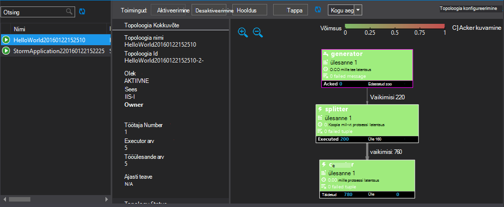

<properties
   pageTitle="Juurutada ja hallata Apache Storm topoloogiatest kohta Hdinsightiga | Microsoft Azure'i"
   description="Saate teada, kuidas juurutada, jälgimine ja haldamine Apache Storm topoloogiatest Storm armatuurlaua kasutamine Hdinsightiga. Hadoopi tööriistu saate kasutada Visual Studio."
   services="hdinsight"
   documentationCenter=""
   authors="Blackmist"
   manager="jhubbard"
   editor="cgronlun"
    tags="azure-portal"/>

<tags
   ms.service="hdinsight"
   ms.devlang="java"
   ms.topic="article"
   ms.tgt_pltfrm="na"
   ms.workload="big-data"
   ms.date="10/11/2016"
   ms.author="larryfr"/>

#Juurutada ja hallata Apache Storm topoloogiatest sisse Windowsi-põhiste Hdinsightiga

Armatuurlaua Storm võimaldab teil hõlpsasti juurutada ja käivitada Apache Storm topoloogiatest klaster Hdinsightile oma veebibrauseri abil. Saate armatuurlaua jälgimine ja haldamine töötava topoloogiatest. Kui kasutate Visual Studios, sisestage Hdinsightile Tools for Visual Studio Visual Studio sarnaseid funktsioone.

Torm armatuurlaua ja Storm funktsioonide Hdinsightiga tööriistad toetuvad Storm REST API, mida saab kasutada luua oma jälgimise ja halduse lahendusi.

> [AZURE.IMPORTANT] Juhised selle dokumendi jaoks on vaja Windowsi-põhiste torm Hdinsightiga kobar kohta. Linux-põhine kobar kasutamise kohta leiate teemast [Deploy ja hallata Apache Storm topoloogiatest kohta Linux-põhine Hdinsightiga](hdinsight-storm-deploy-monitor-topology-linux.md)

##Eeltingimused

* **Apache Storm klõpsake Hdinsightiga** - <a href="../hdinsight-storm-getting-started/" target="_blank">Alustamine Apache Storm Hdinsightiga kohta</a> leiate juhised luua klaster

* **Torm armatuurlaua**: tänapäevane veebibrauseris, mis toetab HTML5

* **Visual Studio** - Azure'i SDK 2.5.1 või uuemat versiooni ja Hdinsightile Tools for Visual Studio. Teemast installida ja konfigureerida Hdinsightiga tools for Visual Studio <a href="../hdinsight-hadoop-visual-studio-tools-get-started/" target="_blank">Hdinsightiga Tools for Visual Studio kasutamise alustamine</a> .

    Üks Visual Studio järgmisi versioone:

    * Visual Studio 2012 koos <a href="http://www.microsoft.com/download/details.aspx?id=39305" target="_blank">4 värskendamine</a>

    * Visual Studio 2013 <a href="http://www.microsoft.com/download/details.aspx?id=44921" target="_blank">värskendus 4</a> või <a href="http://go.microsoft.com/fwlink/?LinkId=517284" target="_blank">Visual Studio 2013 ühenduse</a>

    * <a href="http://visualstudio.com/downloads/visual-studio-2015-ctp-vs" target="_blank">Visual Studio 2015 CTP6</a>

    > [AZURE.NOTE] Praegu Hdinsightile Tools for Visual Studio toetavad ainult torm Hdinsightiga kobar versiooni 3,2.

##Torm armatuurlaud

Torm armatuurlaud on saadaval klaster Storm veebilehele. URL on **https://&lt;clustername >.azurehdinsight.net/**, kus on **clustername** nimi oma Storm Hdinsightiga kobar kohta.

Valige Storm armatuurlaua ülaosas **Topoloogia esitada**. Järgige lehel näidis topoloogia käivitamiseks või üles laadida ja käivitada topoloogia, mille lõite.

![Edasta topoloogia leht][storm-dashboard-submit]

###Torm kasutajaliides

Valige armatuurlaualt torm **Torm UI** link. See kuvab teavet kobar, lisaks kõik töötab topoloogiatest.

![torm kasutajaliides][storm-dashboard-ui]

> [AZURE.NOTE] Mõne versiooniga Internet Explorer, võite avastada, et torm Kasutajaliidese värskendamine pärast külastatud kõigepealt see. See võib näidata näiteks uue topoloogiatest saatsite või kui te varem inaktiveeritud see selle Kuva topoloogia aktiivsed. Microsoft on teadlik probleemi ja lahenduse töötab.

####Avaleht

Põhilehe Storm UI pakub järgmist teavet:

* **Kobar Kokkuvõte**: torm kobar põhiteavet.

* **Topoloogia Kokkuvõte**: installitud topoloogiatest loend. Selle jaotise linkide abil vaadata täpsemat teavet teatud topoloogiatest.

* **Inspektori Kokkuvõte**: torm juhendajaga teavet.

* **Nimbus konfigureerimine**: Nimbus klaster konfigureerimine.

####Topoloogia Kokkuvõte

Lingi valimine jaotises **topoloogia Kokkuvõte** kuvab topoloogia kohta järgmine teave:

* **Topoloogia Kokkuvõte**: topoloogia põhiteavet.

* **Topoloogia toimingud**: haldamise toiminguid, mida saate teha topoloogia.

    * **Aktiveeri**: desaktiveeritakse topoloogia elulookirjeldused töötlemine.

    * **Desaktiveeri**: peatab töötava topoloogia.

    * **Taastub**: reguleerib topoloogia paralleelsust. Töötava topoloogiatest peaks taastub, kui olete muutnud sõlmed klaster arv. See võimaldab topoloogia kohandada paralleelsus hüvitamine sõlmed klaster suurenemine või vähenemine arv.

        Lisateabe saamiseks lugege teemat <a href="http://storm.apache.org/documentation/Understanding-the-parallelism-of-a-Storm-topology.html" target="_blank">Storm topoloogia paralleelsust mõistmine</a>.

    * **Tappa**: lõpeb määratud ajalõpu Storm topoloogia.

* **Topoloogia statistika**: topoloogia statistikat. **Akna** veerus linkide abil määrata ajavahemiku ülejäänud kirjed lehel.

* **Spouts**: otsikuid, mis kasutavad topoloogia. Selle jaotise linkide abil vaadata täpsemat teavet teatud otsikuid.

* **Poldid**: kasutatavaid topoloogia poldid. Selle jaotise linkide abil vaadata täpsemat teavet teatud poldid.

* **Topoloogia konfigureerimine**: valitud topoloogia konfigureerimine.

####Tila ja polt Kokkuvõte

Valides tila **Spouts** või **poldid** jaotiste kuvab valitud üksuse kohta järgmine teave:

* **Komponendi Kokkuvõte**: põhiteavet tila või polt.

* **Tila/polt statistika**: statistikat tila või polt. **Akna** veerus linkide abil määrata ajavahemiku ülejäänud kirjed lehel.

* **Sisestusmeetodi statistika** (ainult polt): teavet sisendi voole, tarbitud polt.

* **Väljundi statistika**: voole, kiiratava seda teavet tila või polt.

* **Haldavad isikud**: teavet tila või polt eksemplarid. Valige **Port** kirje teatud Executor toodeti töövooeksemplari diagnostikateave Logi kuvamiseks.

* **Tõrgete**: tõrgete teave selle tila või polt.

##Hdinsightiga Tools for Visual Studio

Hdinsightiga tööriistad saab esitada oma Storm arvutikobaras C# või hübriid topoloogiatest. Järgmised toimingud valimi rakenduse kasutamine Hdinsightiga tööriistade abil oma topoloogiatest loomise kohta leiate teavet teemast [arendamise C# topoloogiatest Hdinsightile Tools for Visual Studio abil](hdinsight-storm-develop-csharp-visual-studio-topology.md).

Järgmiste juhiste abil saate juurutada valimi oma Storm Hdinsightiga kobar, klõpsake seejärel vaadata ja hallata topoloogia.

1. Kui teil on juba installitud uusim versioon Hdinsightiga tööriistad Visual Studio, lugege teemat <a href="../hdinsight-hadoop-visual-studio-tools-get-started/" target="_blank">Hdinsightiga Tools for Visual Studio kasutamise alustamine</a>.

2. Avage Visual Studio ja valige **fail** > **Uus** > **projekti**.

3. Laiendage dialoogiboksis **Uue projekti** **installitud** > **Mallid**, ja seejärel valige **Hdinsightiga**. Valige loendis malle, **Storm valimi**. Tippige dialoogiboksi allservas rakenduse nimi.

    

1. **Lahenduste Explorer**, paremklõpsake projekti ja valige **Esita torm Hdinsightiga kohta**.

    > [AZURE.NOTE] Kui kuvatakse vastav viip, Sisestage sisselogimise Azure tellimuse. Kui teil on mitu tellimust, logige sisse ühe, mis sisaldab teie Storm Hdinsightiga kobar kohta.

2. Valige oma Storm klõpsake Hdinsightiga kobar **Storm kobar** ripploendist ja valige **Edasta**. Kas esitamise õnnestumise **väljundi** aknas abil saate jälgida.

3. Kui topoloogia on edukalt esitatud, **Storm topoloogiatest** jaoks klaster peaks kuvatama. Valige loendist saate vaadata teavet esitatava topoloogia topoloogia.

    

    > [AZURE.NOTE] Saate vaadata ka **Storm topoloogiatest** **Serveri** Explorerist laiendamine **Azure** > **Hdinsightiga**, ja seejärel paremklõpsates torm Hdinsightiga kobar sisse ja valides **Vaade Storm topoloogiatest**.

    Valige kujund, otsikuid või poldid nende komponentide kohta teabe kuvamiseks. Iga valitud avatakse uus aken.
    
    > [AZURE.NOTE] Topoloogia nimi on selle tunni nime topoloogia (sel juhul `HelloWord`,) koos lisatud ajatempel.

4. Valige **Topoloogia** koondvaate **tappa** topoloogia lõpetada.

    > [AZURE.NOTE] Torm topoloogiatest jätkata enne, kui need on peatatud või klaster on kustutatud.

##REST API-GA

Torm UI on ehitatud peal REST API-ga, et sarnaseid haldamise ja järelevalve funktsiooni REST API abil saate teha. REST API abil saate luua kohandatud tööriistade juhtimiseks ja Storm topoloogiatest.

Lisateabe saamiseks vt [Storm UI REST API -ga](https://github.com/apache/storm/blob/0.9.3-branch/STORM-UI-REST-API.md). Teatud REST API kasutamine Apache Storm Hdinsightiga kohta on järgmine teave.

###Base URI

Base URI REST API Hdinsightiga kogumite kohta on **https://&lt;clustername >.azurehdinsight.net/stormui/api/v1/**, kus on **clustername** nimi oma Storm Hdinsightiga kobar kohta.

###Autentimine

REST API taotluste peate kasutama **elementaarautentimine**nii, et kasutate Hdinsightiga kobar administraatori nimi ja parool.

> [AZURE.NOTE] Kuna elementaarautentimine saadetakse avateksti abil, tuleks **alati** HTTPS suhtlemine klaster turvamiseks kasutamine.

###Väärtuste tagastamiseks

Kasutatav kobar või virtuaalmasinates sama Azure virtuaalse võrgus klaster võib ainult teavet, mis on tagastatud REST API-ga. Näiteks kuvatakse täielik domeeninimi (FQDN) tagastatud jaoks Zookeeper serverid ei pääse Interneti kaudu.

##Järgmised sammud

Nüüd, kui olete õppinud, kuidas juurutada ja jälgida topoloogiatest Storm armatuurlaua abil, saate teada, kuidas:

* [Arendamise C# topoloogiatest Visual Studio Hdinsightiga tööriistade abil](hdinsight-storm-develop-csharp-visual-studio-topology.md)

* [Arendamise Java-põhine topoloogiatest Maven abil](hdinsight-storm-develop-java-topology.md)

Veel näide topoloogiatest loendi leiate teemast [näide topoloogiatest Storm Hdinsightiga kohta](hdinsight-storm-example-topology.md).

[hdinsight-dashboard]: ./media/hdinsight-storm-deploy-monitor-topology/dashboard-link.png
[storm-dashboard-submit]: ./media/hdinsight-storm-deploy-monitor-topology/submit.png
[storm-dashboard-ui]: ./media/hdinsight-storm-deploy-monitor-topology/storm-ui-summary.png
