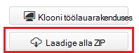
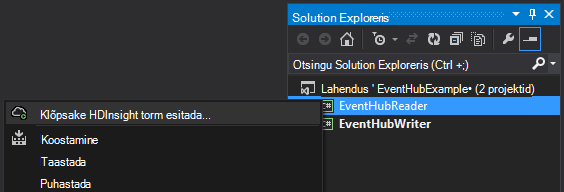
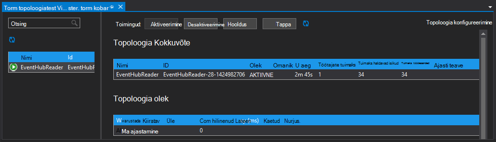

<properties
   pageTitle="Töödelda sündmused sündmus jaoturi torm kohta Hdinsightile | Microsoft Azure'i"
   description="Saate teada, kuidas koos C# Storm topoloogia, Visual Studio Visual Studio Hdinsightiga tööriistade abil loodud sündmuse jaoturi andmete töötlemiseks."
   services="hdinsight,notification hubs"
   documentationCenter=""
   authors="Blackmist"
   manager="jhubbard"
   editor="cgronlun"/>

<tags
   ms.service="hdinsight"
   ms.devlang="dotnet"
   ms.topic="article"
   ms.tgt_pltfrm="na"
   ms.workload="big-data"
   ms.date="10/27/2016"
   ms.author="larryfr"/>

# Protsessi sündmuste Azure'i sündmuse jaoturi torm klõpsake Hdinsightiga (C#)

Azure'i sündmuse jaoturi saab protsessi suurel hulgal veebisaite, rakendused ja seadmed. Sündmuse jaoturi tila muudab lihtne kasutada Apache Storm Hdinsightiga reaalajas andmed analüüsimiseks. Ka saate kirjutada andmete sündmuse jaoturi kaudu Storm, polt sündmuse jaoturi abil.

Selles õppetükis saate teada, kuidas luua kaks topoloogiatest, mis töötavad Azure sündmuse jaoturi Hdinsightiga Tools for Visual Studio abil installitud Visual Studio malli abil.

* **EventHubWriter**: CEIP genereeritud andmed ja kirjutab selle sündmuse jaoturi

* **EventHubReader**: loeb andmed sündmuse jaoturi ja logib andmed Storm logid

> [AZURE.NOTE] Ajal juhised selle dokumendi toetuvad Windowsi arenduskeskkond Visual Studio, saab esitada kompileeritud projekti Linuxi või Windowsi-põhiste Hdinsightiga kobar. Ainult Linuxi-põhiste kogumite loodud pärast 28-10-2016 tugi SCP.NET topoloogiatest.
>
> C# topoloogia Linux-põhine kobar kasutamiseks peate värskendama Microsoft.SCP.Net.SDK Nugeti pakett kasutatud projekti versioon 0.10.0.6 või uuem versioon. Paketi versioon peab vastama ka Storm installitud Hdinsightiga põhiversiooni. Torm Hdinsightiga versioonid 3.3 ja 3.4 kasutada näiteks torm versioon 0.10.x ajal Hdinsightiga 3.5 kasutab Storm 1.0.x.
> 
> C# topoloogiatest Linux-põhine kogumite kohta tuleb kasutada .NET 4.5 ja ühe abil saate käivitada Hdinsightiga kobar. Enamik asju töötab, kuid Kontrollige [Ühilduvust ühe](http://www.mono-project.com/docs/about-mono/compatibility/) dokumendi võimalike vastuolude puhul.
>
> Java versiooni selle projekti, mis töötab ka Linux-põhine või Windowsi-põhiste klaster, vt [protsessi sündmuste Azure'i sündmuse jaoturi torm Hdinsightiga (Java) kohta](hdinsight-storm-develop-java-event-hub-topology.md).

## Eeltingimused

* Mõne [Apache Storm klõpsake Hdinsightiga kobar](hdinsight-apache-storm-tutorial-get-started.md)

* Mõne [Azure sündmuse jaoturi](../event-hubs/event-hubs-csharp-ephcs-getstarted.md)

* [Azure'i .NET SDK](http://azure.microsoft.com/downloads/)

* [Hdinsightiga Tools for Visual Studio](hdinsight-hadoop-visual-studio-tools-get-started.md)

## Lõpetatud projekti

Selles õpetuses GitHub põhjal loodud projekti täieliku versiooni saate alla laadida: [eventhub torm-hübriid](https://github.com/Azure-Samples/hdinsight-dotnet-java-storm-eventhub). Siiski peate endiselt pakkuda konfiguratsioonisätted selles õpetuses juhiste järgi.

## Sündmuse jaoturi tila ja polt

Sündmuse jaoturiga tila ja bolt on Java komponendid, mis võimaldavad hõlpsalt töötamine sündmuse jaoturi kaudu Apache torm. Ehkki järgmised komponendid on kirjutatud Java, Hdinsightile Tools for Visual Studio võimaldab teil luua hübriidjuurutuse topoloogiatest, mis mix C# ja Java komponendid.

Tila ja polt on jaotatud ühe Java arhiivi (laiendid) faili nimega **eventhubs-storm-spout-#.#-jar-with-dependencies.jar**, kus #. # on faili versioon.

### Laiendid faili alla laadida

Uusima versiooni jar faili sisaldub [Hdinsightiga torm näited](https://github.com/hdinsight/hdinsight-storm-examples) projekti **eventhubs/teegi** kausta. Faili alla laadida, kasutage üht järgmistest meetoditest.

> [AZURE.NOTE] Tila ja polt on esitatud kandmiseks Apache torm projekt. Lisateavet leiate teemast [STORM-583: esialgne sisseregistreerimise storm-sündmuse jaoturi](https://github.com/apache/storm/pull/336/files) ka GitHub.

* **Laadige alla ZIP-fail**: saidilt [Hdinsightiga torm näited](https://github.com/hdinsight/hdinsight-storm-examples) valige **Laadi alla ZIP** parempoolsel paanil alla ZIP-faili, mis sisaldab projekti.

    

    Kui fail on alla laaditud, saate ekstraktida arhiivi ja faili saab **teegi** kausta.

* **Projekti klooni**: kui teil on [Git](http://git-scm.com/) installitud, kasutage järgmist käsku klooni hoidla kohalikult ja seejärel faili üles leidnud **teegi** kausta.

        git clone https://github.com/hdinsight/hdinsight-storm-examples

## Sündmuse jaoturi konfigureerimine

Sündmuse jaoturi on selles näites andmeallikas. Kasutage __mõnda sündmust keskuse loomine__ jaotises dokumendi [Alustamine sündmuse jaoturi](../event-hubs/event-hubs-csharp-ephcs-getstarted.md) teavet.

3. Pärast sündmuse jaoturi on loodud, vaadata EventHub tera Azure'i portaal ja valige __ühiskasutuses juurdepääsu poliitika__. Kasutage __+ Lisa__ kirje lisamiseks järgmised poliitikad.

  	| Nimi | Õigused |
  	| ----- | ----- |
  	| kirjutaja | Saatmine |
  	| lugeja | Kuulake |

    

5. Valige __lugeja__ ja __kirjutaja__ poliitika. Kopeerige ja salvestage __PRIMAARVÕTME__ väärtus nii poliitikate nagu kasutatakse hiljem.

## Funktsiooni EventHubWriter konfigureerimine

1. Kui teil on juba installitud uusim versioon Hdinsightiga tööriistad Visual Studio, lugege teemat [Hdinsightiga Tools for Visual Studio kasutamise alustamine](hdinsight-hadoop-visual-studio-tools-get-started.md).

2. Lahendus alla [eventhub storm-hübriid](https://github.com/Azure-Samples/hdinsight-dotnet-java-storm-eventhub). Avage lahendus ja võtta mõne hetke aega __EventHubWriter__ projekti koodi läbi vaadata.

4. Projectis __EventHubWriter__ __App.config__ faili avada. Kasutage teavet varem konfigureeritud sündmuse keskuse kaudu täitke järgmised võtmed väärtus:

  	| Klahv | Väärtus |
  	| ----- | ----- |
  	| EventHubPolicyName | kirjutaja (kui kasutasite erineva nimega jaoks poliitikale _saatmise_ õigus, kasutage selle asemel.) |
  	| EventHubPolicyKey | Võti kirjutaja poliitika |
  	| EventHubNamespace | Nimeruumi, mis sisaldab teie sündmuse jaoturi |
  	| EventHubName | Oma sündmuse jaoturi nimi |
  	| EventHubPartitionCount | Arvu sektsioonid oma sündmuse keskuses. |

4. Salvestage ja sulgege **App.config** faili.

## Funktsiooni EventHubReader konfigureerimine

1. Avage projekt __EventHubReader__ ja võtta mõne momoents koodi läbi vaadata.

2. Saate avada __App.config__ __EventHubWriter__. Kasutage teavet varem konfigureeritud sündmuse keskuse kaudu täitke järgmised võtmed väärtus:

  	| Klahv | Väärtus |
  	| ----- | ----- |
  	| EventHubPolicyName | lugeja (kui kasutasite erineva nimega jaoks poliitika õigustega _kuulata_ , kasutage selle asemel.) |
  	| EventHubPolicyKey | Lugeja poliitika võti |
  	| EventHubNamespace | Nimeruumi, mis sisaldab teie sündmuse jaoturi |
  	| EventHubName | Oma sündmuse jaoturi nimi |
  	| EventHubPartitionCount | Arvu sektsioonid oma sündmuse keskuses. |

3. Salvestage ja sulgege **App.config** faili.

## Funktsiooni topoloogiatest juurutamine

1. **Lahenduste Explorer**, paremklõpsake **EventHubReader** projekti ja valige **Esita torm Hdinsightiga kohta**.

    

2. Valige kuval **Topoloogia esitada** oma **Storm kobar**. Laiendage **Täiendavad konfiguratsioone**, valige **Java faili tee**, valige **...** ja valige **eventhubs-storm-spout-0.9-jar-with-dependencies.jar** varem allalaaditud faili sisaldava kausta. Lõpuks klõpsake nuppu **Edasta**.

    

3. Kui topoloogia on esitatud, kuvatakse **Storm topoloogiatest Viewer** . Valige vasakul paanil topoloogia statistika vaatamiseks **EventHubReader** topoloogia. Praegu midagi peaks juhtu, kuna pole sündmusi on kirjutanud sündmuse jaoturi veel.

    

4. **Lahenduste Explorer**, paremklõpsake **EventHubWriter** projekti ja valige **Esita torm Hdinsightiga kohta**.

2. Valige kuval **Topoloogia esitada** oma **Storm kobar**. Laiendage **Täiendavad konfiguratsioone**, valige **Java faili tee**, valige **...** ja valige **eventhubs-storm-spout-0.9-jar-with-dependencies.jar** varem allalaaditud faili sisaldava kausta. Lõpuks klõpsake nuppu **Edasta**.

5. Kui topoloogia on esitatud, **Storm topoloogiatest Vieweri** kinnitamaks, et nii topoloogiatest töötavad klaster topoloogia loendi värskendada.

6. Valige **Storm topoloogiatest Vieweri** **EventHubReader** topoloogia.

4. Topeltklõpsake vaates Graphi __LogBolt__ komponent. See avab poldid __Komponent__ kokkuvõtteleht.

3. Valige jaotises __haldavad isikud__ üks __Port__ veerus linkide. See kuvab teabe komponendi sisse logitud. Logitud teave on järgmine:

        2016-10-20 13:26:44.186 m.s.s.b.ScpNetBolt [INFO] Processing tuple: source: com.microsoft.eventhubs.spout.EventHubSpout:7, stream: default, id: {5769732396213255808=520853934697489134}, [{"deviceId":3,"deviceValue":1379915540}]
        2016-10-20 13:26:44.234 m.s.s.b.ScpNetBolt [INFO] Processing tuple: source: com.microsoft.eventhubs.spout.EventHubSpout:7, stream: default, id: {7154038361491319965=4543766486572976404}, [{"deviceId":3,"deviceValue":459399321}]
        2016-10-20 13:26:44.335 m.s.s.b.ScpNetBolt [INFO] Processing tuple: source: com.microsoft.eventhubs.spout.EventHubSpout:6, stream: default, id: {513308780877039680=-7571211415704099042}, [{"deviceId":5,"deviceValue":845561159}]
        2016-10-20 13:26:44.445 m.s.s.b.ScpNetBolt [INFO] Processing tuple: source: com.microsoft.eventhubs.spout.EventHubSpout:7, stream: default, id: {-2409895457033895206=5479027861202203517}, [{"deviceId":8,"deviceValue":2105860655}]

## Funktsiooni topoloogiatest peatamine

Funktsiooni topoloogiatest peatamiseks valige iga topoloogia **Storm topoloogia Viewer**ja klõpsake nuppu **tappa**.

## Klaster kustutamine

[AZURE.INCLUDE [delete-cluster-warning](../../includes/hdinsight-delete-cluster-warning.md)]

## Märkmete

### Checkpointing

Funktsiooni EventHubSpout perioodiliselt postkastid seisu Zookeeper sõlm, mis salvestab praeguse offset sõnumeid lugeda järjekorda. See võimaldab komponent alustamiseks sõnumeid veebisaidil salvestatud offset järgmistel juhtudel:

* Osa eksemplari nurjub ja on taaskäivitada.

* Kasvata või Kahanda klaster lisada või eemaldada sõlmed.

* Topoloogia tappis ja **sama nimega**taaskäivitada.

Saate eksportida ja importida nõutud postkastid WASB (Azure Storage kasutatavaid klaster Hdinsightiga.) Selleks skriptide asuvad torm Hdinsightiga kobar veebisaidil **c:\apps\dist\storm-0.9.3.2.2.1.0-2340\zkdatatool-1.0\bin**, klõpsake.

>[AZURE.NOTE] Versiooninumbri tee võib olla erinev, nagu versiooni installitud klaster torm võib tulevikus muutuda.

Selles kaustas skriptid on:

* **stormmeta_import.cmd**: kõigi Storm metaandmete kobar vaikimisi salvestusruumi container importimine Zookeeper.

* **stormmeta_export.cmd**: Zookeeper kõik Storm metaandmete eksportimine kobar vaikimisi salvestusruumi ümbrises.

* **stormmeta_delete.cmd**: kustutada kõik Storm metaandmete Zookeeper.

Ekspordi impordi võimaldab kontrollpunkt andmed ei kao, kui soovite kustutada klaster, kuid soovite jätkata töötlemine praeguse offset jaoturi kaudu, kui uus klaster taastamisel tuua.

> [AZURE.NOTE] Kuna andmed on jätkunud vaikimisi salvestusruumi ümbris, uue kobar **tuleb** kasutada sama salvestusruumi konto ja container eelmise kobar.

## Järgmised sammud

Selles dokumendis on õppinud, kuidas kasutada Java sündmuse jaoturi tila ja polt: C# topoloogia Azure'i sündmuse keskuses andmetega töötamiseks. C# topoloogiatest loomise kohta lisateabe saamiseks vaadake järgmist.

* [C# topoloogiatest arendamise Apache Storm klõpsake Visual Studio abil Hdinsightiga](hdinsight-storm-develop-csharp-visual-studio-topology.md)

* [SCP programmeerimise juhend](hdinsight-storm-scp-programming-guide.md)

* [Näide topoloogiatest Storm Hdinsightiga kohta](hdinsight-storm-example-topology.md)
 
