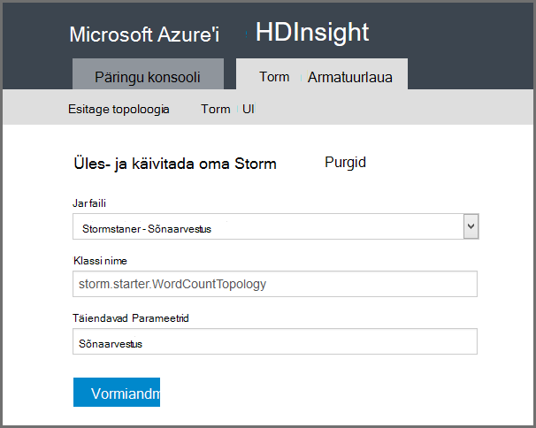

<properties
    pageTitle="Sissejuhatus Apache Storm Hdinsightiga kohta | Microsoft Azure'i"
    description="Saada Apache Storm tutvustus ning teadmisi kasutamist Storm Hdinsightiga kohta luua reaalajas andmed analytics lahendusi pilveteenuses."
    services="hdinsight"
    documentationCenter=""
    authors="Blackmist"
    manager="jhubbard"
    editor="cgronlun"
    tags="azure-portal"/>

<tags
   ms.service="hdinsight"
   ms.devlang="na"
   ms.topic="get-started-article"
   ms.tgt_pltfrm="na"
   ms.workload="big-data"
   ms.date="10/11/2016"
   ms.author="larryfr"/>

#Sissejuhatus Apache Storm Hdinsightiga kohta: reaalajas analytics Hadoopi

Apache Storm klõpsake Hdinsightiga võimaldab teil luua jaotatud, reaalajas analytics lahenduste Azure keskkonnas [Apache Hadoop](http://hadoop.apache.org)abil.

##Mis on Apache torm?

Apache Storm on jaotatud, tõrketaluvusega, avatud lähtekoodi arvutus süsteem, mis võimaldab teil töötlemine andmete reaalajas Hadoopi. Torm lahendused võivad pakkuda ka tagatud andmete töötlemise võimalus kordus andmeid, mis on edukalt töödeldud esimest korda.

##Miks kasutada Storm Hdinsightiga?

Klõpsake Hdinsightiga Apache Storm on hallatavate kobar, integreeritud Azure keskkonda. Pakub võtme järgmised eelised:

* Hallatav teenus koos SLA 99,9% aegu, mis teeb

* Teie valitud keele kasutamiseks: toetab kirjutatud **Java**, **C#**ja **Python** Storm komponendid

    * Toetab mix programmeerimise keeled: Java abil andmeid lugeda, siis töödelda, kasutades C#
    
        > [AZURE.NOTE] Windowsi-põhiste Hdinsightiga kogumite on toetatud ainult C# topoloogiatest.

    * Sõnumite, "selgituseks" andmesalve püsimine ja levinud voo analytics toimingute Storm topoloogiatest, mis toetavad "täpselt kui" loomiseks kasutada **Trident** Java kasutajaliides

* Sisaldab skaala üles ja alla skaala valmisfunktsioone: mastaapimiseks Hdinsightiga kobar töötab Storm topoloogiatest ei mõjuta

* Muude Azure teenuste, sh sündmuse jaoturi, Azure virtuaalse võrgu, SQL-andmebaasiga, bloobimälu ja DocumentDB integreerimine

    * Ühendada mitu Hdinsightiga kogumite võimaluste Azure virtuaalse võrgu kaudu: analüütiliste torustikud kasutada Hdinsightiga, HBase või Hadoopi kogumite loomine

Ettevõtted, kes kasutate Apache Storm saavad reaalajas analytics lahenduste loendi leiate teemast [Ettevõtete abil Apache torm](https://storm.apache.org/documentation/Powered-By.html).

Alustamiseks Storm, lugege teemat [Alustamine Storm kohta Hdinsightile][gettingstarted].

###Lihtne ettevalmistamine

Saate uue tormi kohta Hdinsightiga kobar minutiga ette valmistada. Määrake kobar nimi, suurus, administraatori konto ja konto salvestusruumi. Azure'i loob kobar, sh valimi topoloogiatest ja veebi-halduse armatuurlaua.

> [AZURE.NOTE] Torm kogumite sätteid [Azure'i CLI](../xplat-cli-install.md) või [Azure PowerShelli](../powershell-install-configure.md)abil.

15 minuti jooksul esitamise, on teil uus torm klaster töötab ja valmis oma esimese reaalajas analytics torujuhe.

###Kasutuslihtsus

__Linuxi jaoks vastavalt Storm klõpsake Hdinsightiga kogumite__, saate luua ühenduse kobar, kasutades SSH ja kasutage soovitud `storm` käsk käivitada ja hallata topoloogiatest. Lisaks saate Ambari torm teenuse ja Storm UI jälgimine ja haldamine töötava topoloogiatest jälgimiseks.

Linux-põhine Storm kogumite töötamise kohta leiate lisateavet teemast [Alustamine Apache Storm Linux-põhine Hdinsightiga kohta](hdinsight-apache-storm-tutorial-get-started-linux.md).

__Windowsi-põhise Storm Hdinsightiga kogumite kohta__, Hdinsightile Tools for Visual Studio võimaldab teil luua C# ja hübriid C# / Java topoloogiatest, ja seejärel neid esitada oma Storm Hdinsightiga kobar kohta.  

Hdinsightiga Tools for Visual Studio pakub kasutajaliides, mis võimaldab teil jälgida ja Storm topoloogiatest klaster juhtida.

Näiteks Hdinsightiga tööriistade abil Storm rakenduse loomine, leiate teemast [arendamise C# Storm topoloogiatest Visual Studio Hdinsightiga tööriistu](hdinsight-storm-develop-csharp-visual-studio-topology.md).

Vt lisateavet Hdinsightiga tööriistad Visual Studio [Hdinsightile Tools for Visual Studio kasutamise alustamine](../HDInsight/hdinsight-hadoop-visual-studio-tools-get-started.md).

Iga torm klõpsake Hdinsightiga kobar pakub veebipõhine Storm armatuurlaud, mis võimaldab teil esitada, jälgimine ja haldamine Storm topoloogiatest klaster töötab.

Torm armatuurlaua kasutamise kohta leiate lisateavet teemast [Deploy ja hallata Apache Storm topoloogiatest kohta Hdinsightiga](hdinsight-storm-deploy-monitor-topology.md).

Tormi kohta Hdinsightiga pakub hõlbus integreerimine Azure sündmuse jaoturi kaudu **Sündmuse jaoturi tila**. Selle komponendi uusim versioon on saadaval aadressil [https://github.com/hdinsight/hdinsight-storm-examples/tree/master/lib/eventhubs](https://github.com/hdinsight/hdinsight-storm-examples/tree/master/lib/eventhubs). Selle komponendi kasutamise kohta leiate lisateavet teemast järgmised dokumendid.

* [Arendamise topoloogia C#, mis kasutab Azure sündmuse jaoturi](hdinsight-storm-develop-csharp-event-hub-topology.md)

* [Java topoloogia, mis kasutab Azure sündmuse jaoturi töötada](hdinsight-storm-develop-java-event-hub-topology.md)

###Töökindluse

Apache Storm alati tagab, et sissetulevate sõnumite täielikult töödeldakse, isegi siis, kui andmete analüüsi on sadu sõlmed jaotada.

**Nimbus sõlm** pakub sarnast funktsionaalsust Hadoopi JobTracker ja seda määrab tööülesannete sõlmi kobar **Zookeeper**kaudu. Zookeeper sõlmed pakkuda koordineerimine klaster ja hõlbustada suhtlemine Nimbus ja **halduri** protsessi töötaja sõlmed. Kui üks töötlemine sõlm läheb alla, teatatakse Nimbus sõlm ja seda määrab tööülesande ja nendega seotud andmete teise sõlme.

Vaikimisi konfiguratsiooni Apache Storm on ainult üks Nimbus sõlm. Tormi kohta Hdinsightiga töötab kaks Nimbus sõlme. Esmane sõlme nurjumisel lülitub Hdinsightiga kobar teisene sõlm ajal esmane sõlm on taastatud.

###Skaala

Kuigi saate määrata sõlmed arvu klaster loomise ajal, võite kasvata või Kahanda kobar, et need vastaksid töökoormus. Kõik Hdinsightiga kogumite võimaldavad arvu sõlmed kobar, isegi andmete töötlemise ajal muuta.

> [AZURE.NOTE] Ära skaleerimist kaudu lisatud uusi sõlmi, peate taastub topoloogiatest enne kobar maht on suurem.

###Tugi

Torm Hdinsightiga kohta on täielik ettevõtte tasemel 24/7 tugi. Torm Hdinsightiga kohta on ka SLA 99,9%. Mida tähendab, et me tagada, et klaster on välise ühenduvuse vähemalt 99,9% ajast.

##Ühise kasutamise juhtudel reaalajas Analyticsi

Järgnevalt on mõne levinud stsenaariumi, mille võib kasutada Apache torm Hdinsightiga. Tegelike stsenaariumid, leiate lisateavet lugeda, [Kuidas ettevõtted kasutavad torm](https://storm.apache.org/documentation/Powered-By.html).

* Asjade internet
* Pettuse tuvastamine
* Social analytics
* Eraldada, transformatsioon, laadimine (ETL)
* Võrgu jälgimine
* Otsing
* Mobiilse kaasamine

##Kuidas Hdinsightiga torm andmeid töödeldakse?

Apache Storm käivitatakse **topoloogiatest** MapReduce tööd, mis on tuttav Hdinsightiga või Hadoopi asemel. Tormi kohta Hdinsightiga kobar sisaldab kahte tüüpi sõlmed: pea sõlmed, mis töötavad **Nimbus** ja töötaja sõlmed, mis töötavad **halduri**.

* **Nimbus**: sarnaselt JobTracker sisse Hadoopi, on levitamise kood kogu klaster, virtuaalmasinates tööülesannete määramine ja jälgimine tõrge. Hdinsightiga pakub kahte Nimbus sõlme, seega ei ole ühe ebaõnnestumise Storm Hdinsightiga kohta

* **Inspektori**: iga töötaja sõlme juhendajaga vastutab käivitamine ja peatamine **töötaja protsesside** sõlme.

* **Töötaja protsessi**: töötab **topoloogia**alamhulga. Töötava topoloogia levitatakse üle mitme töötaja protsesside kogu klaster.

* **Topoloogia**: määratleb arvutus, mille töötleb andmete **voogu** diagrammi. Erinevalt MapReduce töö, käivitage topoloogiatest seni, kuni te neid peatada.

* **Voo**: mõne **kordseid**sidumata kogum. Voole on koostatud **spouts** ja **poldid**ning need tarbib **poldid**.

* **Korteeži**: nimega dünaamiliselt tipitud väärtuste loendi.

* **Tila**: tarbib andmeallikast pärinevate andmete ja eraldab ühe või mitme **voogu**.

    > [AZURE.NOTE] Paljudel juhtudel andmeid lugeda järjekorda, nt Kafka, Azure'i teenus siini järjekorrad või sündmuse jaoturi. Kuhjuda tagab, et andmed on jätkunud kui ka katkestuste.

* **Polt**: tarbib **voole**, sooritab töötlemine **kordseid**ja võib eraldavad **voogu**. Poldid vastutate ka välise salvestusruumi, nt järjekorda, Hdinsightiga, HBase, on bloobimälu või muude andmesalve andmete kirjutamise.

* **Apache ökonoomsus**: tarkvara raamistiku scalable rist-keele teenuse arendamise. See võimaldab teil koostada teenused, mille vahel C++, Java, Python, PHP, Ruby, Erlangi, Perl, Haskell, C#, kakao, JavaScripti, Node.js, Smalltalk ja muudes keeltes.

    * **Nimbus** on ökonoomsus teenus ja **topoloogia** on ökonoomsus määratlus, nii et see on võimalik töötada, kasutades erinevaid programmeerimise keeled topoloogiatest.

Torm komponentide kohta leiate lisateavet teemast [Storm õpetuse] [ apachetutorial] apache.org juures.

##Programmeerimise keelte saab kasutada?

C#, Java ja Python toetab torm Hdinsightiga kobar kohta.

### K & #35;

Hdinsightile Tools for Visual Studio luba .NET arendajad kavandada ja rakendada mõne topoloogia C#. Saate luua ka hübriid topoloogiatest, mis kasutavad Java ja C# komponendid.

Lisateabe saamiseks lugege teemat [arendada C# topoloogiatest Apache Storm Hdinsightiga Visual Studio abil sisse](hdinsight-storm-develop-csharp-visual-studio-topology.md).

###Java

Enamik Java näited ilmneda on tavaline Java või Trident. Trident on üksikasjalik võtmiseks, mis hõlbustab näiteks ühenduste liitmised, rühmitamist ja filtreerimist. Siiski toimib Trident hulga kordseid, arvestades töötlemata Java lahenduse töötleb korteeži voo ühe korraga.

Trident kohta lisateabe saamiseks vt selle [õpetuse Trident](https://storm.apache.org/documentation/Trident-tutorial.html) apache.org.

Näiteid Java ja Trident topoloogiatest, vt [loendi näide Storm topoloogiatest](hdinsight-storm-example-topology.md) või torm-starter näited Hdinsightiga klaster.

Torm-starter näited asuvad __/usr/hdp/current/storm-client/contrib/storm-starter__ kataloogi kogumite Linux-põhine ja Windowsi-põhiste kogumite **%storm_home%\contrib\storm-starter** kaust.

##Mis on mõned levinud arengu mustrid?

###Tagatud teate automaattöötlus

Torm saate sisestada tagatud teate automaattöötlus erinevaid tasemeid. Näiteks lihtsa Storm rakenduse saab vähim-korraga töötlemine, ja Trident saate tagatise täpselt – kui töötlemine.

Lisateabe saamiseks vaadake [garantiid andmete töötlemise](https://storm.apache.org/about/guarantees-data-processing.html) aadressil apache.org.

###IBasicBolt

Mustri lugemine Sisestuskeel korteeži, tekitavate null või rohkem kordseid ja seejärel käima Sisestuskeel korteeži kohe täita meetod lõpus on väga levinud ja Storm pakub [IBasicBolt](https://storm.apache.org/apidocs/backtype/storm/topology/IBasicBolt.html) kasutajaliidese see muster automatiseerimiseks.

###Ühendab

Ühendab kaks voole andmete erinevad rakenduste vahel. Näiteks võib liitute iga kordse: mitme voogu üheks uue või ei saanud liituda ainult hulga kordseid teatud akna. Mõlemal juhul liitumise suunamist, kasutades [fieldsGrouping](http://javadox.com/org.apache.storm/storm-core/0.9.1-incubating/backtype/storm/topology/InputDeclarer.html#fieldsGrouping%28java.lang.String,%20backtype.storm.tuple.Fields%29), mis on viis, kuidas kordseid marsruuditakse poldid määratlemine.

Java järgmises näites kasutatakse fieldsGrouping kordseid, mis pärinevad komponendid "1", "2" ja "3" ning **MyJoiner** polt marsruutimiseks.

    builder.setBolt("join", new MyJoiner(), parallelism) .fieldsGrouping("1", new Fields("joinfield1", "joinfield2")) .fieldsGrouping("2", new Fields("joinfield1", "joinfield2")) .fieldsGrouping("3", new Fields("joinfield1", "joinfield2"));

###Partiide

Partiide suunamist mitu võimalust. Tavaline Storm Java topoloogia, võib kasutada lihtsa vastuolus paketi X arv kordseid enne nende tekitavate või kasutada ettevõttesisese ajastus süsteem, mis tuntud korteeži"rist" eraldavad partii iga X sekundi järel.

Kasutamise näide rist kordseid, vt [analüüsitakse andurite andmeid Storm ja HBase Hdinsightiga kohta](hdinsight-storm-sensor-data-analysis.md).

Kui kasutate Trident, põhineb hulga kordseid töötlemine.

###Vahemällu talletamine

-Mälu vahemällu kasutatakse enamasti süsteem kiirendada töötlemine, sest see hoiab sageli kasutatud varad mälu. Kuna topoloogia levitatakse üle mitme sõlmed ja iga sõlme mitme protsesside, võiksite kasutada [fieldsGrouping](http://javadox.com/org.apache.storm/storm-core/0.9.1-incubating/backtype/storm/topology/InputDeclarer.html#fieldsGrouping%28java.lang.String,%20backtype.storm.tuple.Fields%29) tagamaks, et kordseid, mis sisaldavad välju, mida kasutatakse vahemälu otsing marsruuditakse alati sama toimingut. See aitab vältida kattumise vahemälu kirjete protsesside üle.

###Streaming ülemised N

Kui teie topoloogia sõltub arvutamise väärtuse "ülemised N" ülemist 5 trendide Twitter, nt peaks paralleelselt ülemised N väärtuse arvutamiseks ja seejärel nende arvutuste väljund ühendamine üldine väärtus. Seda saab teha, kasutades [fieldsGrouping](http://javadox.com/org.apache.storm/storm-core/0.9.1-incubating/backtype/storm/topology/InputDeclarer.html#fieldsGrouping%28java.lang.String,%20backtype.storm.tuple.Fields%29) mööda välja paralleelselt poldid (mis piirded andmed välja väärtuse järgi) ja seejärel tee polt, mis määratleb globaalselt ülemised N väärtus.

Näiteks, lugege teemat [RollingTopWords](https://github.com/nathanmarz/storm-starter/blob/master/src/jvm/storm/starter/RollingTopWords.java) näide.

##Mis tüüpi logimine ei kasuta torm?

Storm kasutab Apache Log4j Logiteave. Vaikimisi logitakse suurt hulka andmeid ja võib olla keeruline kaudu andmed sortida. Logimise konfigureerimise faili saate lisada oma Storm topoloogia juhtelemendile logimine käitumine osana.

Näide topoloogia, mis näitab, kuidas logisse kandmise konfigureerimine, vt [Java-põhine WordCount](hdinsight-storm-develop-java-topology.md) näide Storm Hdinsightiga kohta.

##Järgmised sammud

Lisateave Apache torm Hdinsightiga reaalajas analytics lahendusi.

* [Alustamine: torm Hdinsightiga kohta][gettingstarted]

* [Näide topoloogiatest Storm Hdinsightiga kohta](hdinsight-storm-example-topology.md)

[stormtrident]: https://storm.apache.org/documentation/Trident-API-Overview.html
[samoa]: http://yahooeng.tumblr.com/post/65453012905/introducing-samoa-an-open-source-platform-for-mining
[apachetutorial]: https://storm.apache.org/documentation/Tutorial.html
[gettingstarted]: hdinsight-apache-storm-tutorial-get-started-linux.md
