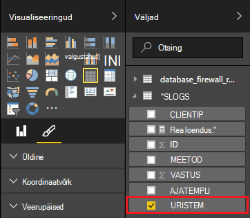

<properties
 pageTitle="Power BI Apache Storm kasutamine | Microsoft Azure'i"
 description="Andmete abil C# topoloogia töötavate on Apache Storm kobar Hdinsightiga rakenduses Power BI aruande loomine."
 services="hdinsight"
 documentationCenter=""
 authors="Blackmist"
 manager="jhubbard"
 editor="cgronlun"
    tags="azure-portal"/>

<tags
 ms.service="hdinsight"
 ms.devlang="dotnet"
 ms.topic="article"
 ms.tgt_pltfrm="na"
 ms.workload="big-data"
 ms.date="10/27/2016"
 ms.author="larryfr"/>

# Mõne Apache Storm topoloogia andmete visualiseerimine Power BI abil

Power BI abil saab kuvada andmeid visuaalselt aruandeid. Visual Studio mallide kasutamise Storm Hdinsightiga kohta, saate hõlpsalt kasutada poeandmete topoloogia on Apache tormi kohta Hdinsightiga kobar töötab SQL Azure'i ja seejärel visualiseerida andmeid Power BI abil.

Selles dokumendis saate teada, kuidas kasutada Power BI Apache Storm topoloogia on loodud ja talletatud Azure'i SQL-andmebaasi andmete põhjal aruande loomine.

> [AZURE.NOTE] Ajal juhised selle dokumendi toetuvad Windowsi arenduskeskkond Visual Studio, saab esitada kompileeritud projekti Linuxi või Windowsi-põhiste Hdinsightiga kobar. Ainult Linuxi-põhiste kogumite loodud pärast 28-10-2016 tugi SCP.NET topoloogiatest.
>
> C# topoloogia Linux-põhine kobar kasutamiseks peate värskendama Microsoft.SCP.Net.SDK Nugeti pakett kasutatud projekti versioon 0.10.0.6 või uuem versioon. Paketi versioon peab vastama ka Storm installitud Hdinsightiga põhiversiooni. Torm Hdinsightiga versioonid 3.3 ja 3.4 kasutada näiteks torm versioon 0.10.x ajal Hdinsightiga 3.5 kasutab Storm 1.0.x.
> 
> C# topoloogiatest Linux-põhine kogumite kohta tuleb kasutada .NET 4.5 ja ühe abil saate käivitada Hdinsightiga kobar. Enamik asju töötab, kuid Kontrollige [Ühilduvust ühe](http://www.mono-project.com/docs/about-mono/compatibility/) dokumendi võimalike vastuolude puhul.
>
> Java versiooni selle projekti, mis töötab ka Linux-põhine või Windowsi-põhiste klaster, vt [protsessi sündmuste Azure'i sündmuse jaoturi torm Hdinsightiga (Java) kohta](hdinsight-storm-develop-java-event-hub-topology.md).

## Eeltingimused

- Azure'i tellimuse. Leiate [Azure'i saada tasuta prooviversioon](https://azure.microsoft.com/documentation/videos/get-azure-free-trial-for-testing-hadoop-in-hdinsight/).

* Azure Active Directory rakendust [Power BI](https://powerbi.com) Accessiga

* Visual Studio (üks järgmistest versioonid)

    * Visual Studio 2012 koos [4 värskendamine](http://www.microsoft.com/download/details.aspx?id=39305)

    * Visual Studio 2013 [värskendus 4](http://www.microsoft.com/download/details.aspx?id=44921) või [Visual Studio 2013 kogukond](http://go.microsoft.com/fwlink/?linkid=517284&clcid=0x409)

    * [Visual Studio 2015](https://www.visualstudio.com/downloads/download-visual-studio-vs.aspx)

* Visual Studio Hdinsightiga Tööriistad: Vaadake teavet installiteave [Hdinsightile Tools for Visual Studio kasutamise alustamine](../HDInsight/hdinsight-hadoop-visual-studio-tools-get-started.md) .

## Kuidas see toimib

Selles näites sisaldab C# Storm topoloogia, mis on genereeritud juhusliku ID-ga logiandmed Internet Information Services (IIS). Andmed on kirjutatud siis SQL-andmebaasiga, ja seal on kasutatud Power BI aruannete loomiseks.

Järgmises loendis faile, mis rakendamiseks peamine selles näites.

* **SqlAzureBolt.cs**: kirjutab Storm topoloogias SQL-andmebaasiga andmed.

* **IISLogsTable.sql**: The Transact-SQL-lausete abil saate luua andmebaasi, mis on talletatud andmed.

> [AZURE.WARNING] Enne alustamist topoloogia Hdinsightiga klaster kohta peate looma SQL-andmebaasis tabeli.

## Laadige alla näide

Laadige alla [Hdinsightiga C# Storm Power BI näide](https://github.com/Azure-Samples/hdinsight-dotnet-storm-powerbi). Selle allalaadimiseks kahvel/klooni [git](http://git-scm.com/)abil või kasutage lingi **alla laadida** alla ZIP arhiivi.

## Andmebaasi loomine

1. [SQL-andmebaasi õpetuse](../sql-database/sql-database-get-started.md) dokumendi juhiste abil saate luua uue SQL-andmebaasi.

2. Loo ühendus andmebaasiga ühenduse loomiseks andmebaasiga [ühenduse loomine SQL-andmebaasi Visual Studio](../sql-database/sql-database-connect-query.md) dokumendi juhiste järgi.

4. Paremklõpsake objekti Exploreri andmebaasis ja looge __Uus päring__. Kaasatud allalaaditud projekti päring aknasse __IISLogsTable.sql__ faili sisu kleepida, ja seejärel kasutage klahvikombinatsiooni Ctrl + Shift + E päringu. Peaksite nägema sõnumi command(s) on lõpule viidud.

    Kui see on lõpule jõudnud, on nimega __IISLOGS__ andmebaasi uude tabelisse.

## Valimi konfigureerimine

1. Valige [portaalis Azure](https://portal.azure.com)SQL-andmebaasi. SQL-i andmebaasi tera __Essentialsi__ jaotises Valige __Kuva andmebaasi ühendusstringi__. Kopeerige loend, mis kuvatakse, __ADO.NET (SQL-i autentimise)__ teavet.

1. Avage valimi Visual Studios. **Solution Exploreris**, avage **App.config** faili ja seejärel otsige järgmine kirje.

        <add key="SqlAzureConnectionString" value="##TOBEFILLED##" />
    
    Asendage väärtus __##TOBEFILLED##__ eelmises etapis kopeeritud andmebaasi ühendusstringi. Asendage __{oma\_username}__ ja __{oma\_parooli}__ kasutajanime ja parooli andmebaasi.

2. Salvestage ja sulgege failid.

## Valimi juurutamine

1. **Lahenduste Explorer**, paremklõpsake **StormToSQL** projekti ja valige **Esita torm Hdinsightiga kohta**. Valige Hdinsightiga kobar **Storm kobar** ripploend dialoogiboksi.

    > [AZURE.NOTE] Võib kuluda mõne hetke **Storm kobar** ripploend asustada serverite nimed.
    >
    > Kui kuvatakse vastav viip, Sisestage sisselogimise Azure tellimuse. Kui teil on mitu tellimust, logige sisse ühe, mis sisaldab teie Storm Hdinsightiga kobar kohta.

2. Kui topoloogia on edukalt esitatud, Storm topoloogiatest jaoks klaster peaks kuvatama. Valige loendist, et vaadata teavet esitatava topoloogia SqlAzureWriterTopology kirje.

    

    See vaade abil vaadake teave topoloogia või topeltklõpsake täpsemat teavet kindla osa topoloogias kirjeid (nt SqlAzureBolt).

3. Pärast topoloogia on parandusfunktsiooni paar minutit, saatja, andmebaasi loomiseks kasutatud SQL-i päring aknasse. Asendage olemasolevast järgmist.

        select * from iislogs;
    
    Kasutage Ctrl + Shift + E käivitada päring, ja saavate järgmisega sarnase tulemuse.
    
        1   2016-05-27 17:57:14.797 255.255.255.255 /bar    GET 200
        2   2016-05-27 17:57:14.843 127.0.0.1   /spam/eggs  POST    500
        3   2016-05-27 17:57:14.850 123.123.123.123 /eggs   DELETE  200
        4   2016-05-27 17:57:14.853 127.0.0.1   /foo    POST    404
        5   2016-05-27 17:57:14.853 10.9.8.7    /bar    GET 200
        6   2016-05-27 17:57:14.857 192.168.1.1 /spam   DELETE  200

    See on andmeid, mis on kirjutatud Storm topoloogia kaudu.

## Aruande loomine

1. Ühenduse [Azure'i SQL-andmebaasi konnektor](https://app.powerbi.com/getdata/bigdata/azure-sql-database-with-live-connect) Power BI.

2. Sees __andmebaase__, valige __saada__.

3. Valige __Azure SQL-andmebaas__ja seejärel valige __Loo ühendus__.

4. Sisestage oma Azure SQL-i andmebaasiga ühenduse loomiseks. See leiate [Azure'i portaalis](https://portal.azure.com) külastades ja valides SQL-andmebaasi.

    > [AZURE.NOTE] Samuti saate värskendusintervalli ja kohandatud filtrite abil ühendus dialoogiboksi __Lubamine Täpsemad suvandid__ .

5. Kui olete loonud ühenduse, kuvatakse uus andmekomplekti sama nimega andmebaasi, mis on ühendatud. Valige andmekomplekti alustamiseks aruande kujundamine.

3. __Väljad__, laiendage __IISLOGS__ kirjet. Märkige ruut __URISTEM__jaoks. See loob uue aruande, kus on loetletud URI tuleneb (/ foo/riba, jne) andmebaasi logitud.

    

5. Seejärel lohistage __meetod__ aruanne. Aruannet värskendatakse loendis soovitud tuleneb ja vastavate HTTP meetod HTTP-päring.

    

4. __Visualiseeringute__ veerust, valige __väljade__ ikoon ja valige __väärtused__ jaotises __meetod__ kõrval olevat allanoolt. Valige loendist, mis kuvatakse __arv__. See muudab aruande loendis arvu, mitu korda on külastatud teatud URI.

    

6. Seejärel valige __Virnkihtdiagramm tulpdiagrammi__ , et teave kuvamisviisi muutmine.

    

7. Kui olete aruande kuidas soovite, kasutage __salvestada__ menüü sisestage nimi ja salvestage aruanne.

## Topoloogia peatamine

Topoloogia jätkavad seni, kuni selle peatada või kustutada torm Hdinsightiga kobar kohta. Järgmiste toimingute topoloogia lõpetada.

1. Visual Studio topoloogia Vieweri naasmiseks ja valige topoloogia.

2. Valige nupp **tappa** topoloogia lõpetada.

    

## Klaster kustutamine

[AZURE.INCLUDE [delete-cluster-warning](../../includes/hdinsight-delete-cluster-warning.md)]

## Järgmised sammud

Selles dokumendis saate õppinud, kuidas saata andmeid Storm topoloogia SQL-andmebaasiga, siis Power BI kasutamine andmete visualiseerimiseks. Tehnoloogiad Azure Hdinsightiga torm kasutamine töötamise kohta leiate teavet teemast järgmist:

* [Näide topoloogiatest Storm Hdinsightiga kohta](hdinsight-storm-example-topology.md)
