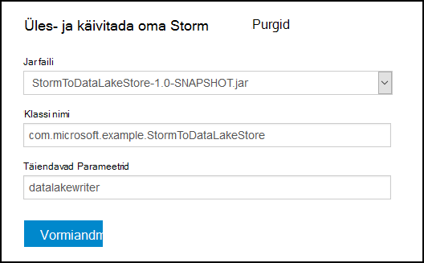

<properties
pageTitle="Kasutage Azure'i Lake poe Apache torm klõpsake Azure Hdinsightiga"
description="Saate teada, kuidas kirjutamise andmete Azure'i andmesalve Lake on Apache Storm topoloogia Hdinsightiga kohta. Selles dokumendis ja seotud näiteks näitavad, kuidas saab kasutada HdfsBolt komponent Lake andmesalve kirjutada."
services="hdinsight"
documentationCenter="na"
authors="Blackmist"
manager="jhubbard"
editor="cgronlun"/>

<tags
ms.service="hdinsight"
ms.devlang="na"
ms.topic="article"
ms.tgt_pltfrm="na"
ms.workload="big-data"
ms.date="09/06/2016"
ms.author="larryfr"/>

#Kasuta Azure'i andmed Lake poe Apache tormi Hdinsightiga

Azure'i andmesalve Lake on HDFS ühilduvad pilveteenuse salvestusruumi teenus, mis pakub kõrge läbilaskevõime, kättesaadavus, kestvus ja töökindluse teie andmete jaoks. Selles dokumendis saate teada, kuidas kasutada Java-põhine Storm topoloogia Azure'i Lake andmesalve andmeid kirjutada abil [HdfsBolt](http://storm.apache.org/javadoc/apidocs/org/apache/storm/hdfs/bolt/HdfsBolt.html) osa, mis on esitatud Apache Storm osana.

> [AZURE.IMPORTANT] Selles dokumendis kasutatud näide topoloogia tugineb komponendid, mis on kaasas Storm Hdinsightiga kogumite ja võib-olla vaja muuta Azure'i Lake andmesalve kasutamisel koos muude Apache Storm kogumite töötamiseks.

##Eeltingimused

* [Java JDK 1.7](https://www.oracle.com/technetwork/java/javase/downloads/jdk7-downloads-1880260.html) või uuem versioon
* [Maven 3.x](https://maven.apache.org/download.cgi)
* Azure'i tellimuse
* Torm Hdinsightiga kobar versiooni 3,2. Luua uue torm Hdinsightiga kobar, kasutage [kasutada Hdinsightiga Lake andmesalve abil Azure'i](../data-lake-store/data-lake-store-hdinsight-hadoop-use-portal.md) dokumendis olevaid juhiseid. Juhised selle dokumendi juhendab teid uue Hdinsightiga kobar- ja Azure andmesalve Lake loomine.  

    > [AZURE.IMPORTANT] Kui loote Hdinsightiga kobar, valige __Storm__ kobar tüüp ja versioon __3,2__ . OS võib olla Windows või Linux.  

###Keskkonna muutujaid konfigureerimine

Järgmiste keskkonna muutujate võib määrata, kui installite oma töökoha arengu Java ja selle JDK. Siiski peaksite, et need on olemas ja sisaldaksid teie süsteemi õigete väärtuste.

* Kuhu on installitud Java runtime keskkond (JRE) osutama __JAVA_HOME__ . Näiteks Unix või Linux jaotus peaks olema umbes väärtus `/usr/lib/jvm/java-7-oracle`. Windowsi oleks väärtus, mis on sarnane `c:\Program Files (x86)\Java\jre1.7`.

* __Tee__ - peaks sisaldama järgmine tee:

    * __JAVA\_HOME__ (või samaväärne tee)
    
    * __JAVA\_HOME\bin__ (või samaväärne tee)
    
    * Kuhu on installitud Maven

##Topoloogia rakendamine

Selles dokumendis kasutatud näide on kirjutatud Java ja kasutab järgmised komponendid.

* __TickSpout__: genereeritud muude komponentide topoloogias kasutatud andmed.

* __PartialCount__: loendab sündmused, mis on loodud TickSpout.

* __FinalCount__: agregaadid loendamine PartialCount andmeid.

* __ADLStoreBolt__: kirjutab andmed Azure'i Lake andmesalve kasutades [HdfsBolt](http://storm.apache.org/javadoc/apidocs/org/apache/storm/hdfs/bolt/HdfsBolt.html) osa.

Projekti, mis sisaldab selle topoloogia on [https://github.com/Azure-Samples/hdinsight-storm-azure-data-lake-store](https://github.com/Azure-Samples/hdinsight-storm-azure-data-lake-store)allalaadimiseks saadaval.

###ADLStoreBolt mõistmine

Funktsiooni ADLStoreBolt on kasutatud HdfsBolt eksemplari topoloogias, mis kirjutab Azure'i andmed Lake nimi. See pole teisiti versiooni HdfsBolt loodud Microsoft; kuid see toetuvad core – saidile väärtused, samuti Hadoopi komponendid, mis on kaasas Windows Azure Hdinsightiga andmete Lake suhtlus.

Täpsemalt on Hdinsightiga kobar loomisel saate seostada selle Azure'i andmesalve Lake. See kirjutab kirjed core – saidile Lake andmesalve valisite, mida kasutavad komponendid, nt hadoop-kliendi ja hadoop-hdfs lubamiseks Lake andmesalve suhtlus.

> [AZURE.NOTE] Microsoft muutis koodi Apache Hadoop ja Storm projektid, mis võimaldab suhtlemine Azure'i andmesalve Lake ja Azure'i bloobimälu salvestusruumi, kuid see funktsioon neid ei kaasata muude Hadoopi ja Storm viimati vaikimisi.

HdfsBolt topoloogias konfigureerimine on järgmine:

    // 1. Create sync and rotation policies to control when data is synched
    //    (written) to the file system and when to roll over into a new file.
    SyncPolicy syncPolicy = new CountSyncPolicy(1000);
    FileRotationPolicy rotationPolicy = new FileSizeRotationPolicy(0.5f, Units.KB);
    // 2. Set the format. In this case, comma delimited
    RecordFormat recordFormat = new DelimitedRecordFormat().withFieldDelimiter(",");
    // 3. Set the directory name. In this case, '/stormdata/'
    FileNameFormat fileNameFormat = new DefaultFileNameFormat().withPath("/stormdata/");
    // 4. Create the bolt using the previously created settings,
    //    and also tell it the base URL to your Data Lake Store.
    // NOTE! Replace 'MYDATALAKE' below with the name of your data lake store.
    HdfsBolt adlsBolt = new HdfsBolt()
        .withFsUrl("adl://MYDATALAKE.azuredatalakestore.net/")
        .withRecordFormat(recordFormat)
        .withFileNameFormat(fileNameFormat)
        .withRotationPolicy(rotationPolicy)
        .withSyncPolicy(syncPolicy);
    // 4. Give it a name and wire it up to the bolt it accepts data
    //    from. NOTE: The name used here is also used as part of the
    //    file name for the files written to Data Lake Store.
    builder.setBolt("ADLStoreBolt", adlsBolt, 1)
      .globalGrouping("finalcount");
      
Kui olete tuttav, kasutades HdfsBolt, siis märkate, et see on kõik päris tavaline konfiguratsiooni, välja arvatud URL-i. URL-i pakub oma Azure'i andmed Lake salve tee.

Kuna kirjutamise Lake andmesalve kasutab HdfsBolt ja URL-i muutmine on, peaks oskama olemasoleva topoloogia, mis kirjutab HDFS või WASB abil HdfsBolt võtta ja seda kasutada Azure andmesalve Lake hõlpsalt muuta.

##Koostamine ja pakkimine topoloogia

1. Näide projekti [https://github.com/Azure-Samples/hdinsight-storm-azure-data-lake-store](https://github.com/Azure-Samples/hdinsight-storm-azure-data-lake-store
) alla laadida oma arengu keskkonnas.

2. Avage soovitud `StormToDataLake\src\main\java\com\microsoft\example\StormToDataLakeStore.java` fail toimetaja ja otsige üles rida, mis sisaldab `.withFsUrl("adl://MYDATALAKE.azuredatalakestore.net/")`. Saate muuta __MYDATALAKE__ Azure Lake andmesalve saate kasutada, kui loote Hdinsightile oma serveri nimi.

3. Käsu viip, terminalis või shell seansi muutmine kataloogide allalaaditud projekti juurkausta ja käivitage järgmised käsud koostamine ja paketti topoloogia.

        mvn compile
        mvn package
    
    Kui koostamine ja pakendit lõpule jõudnud, on uus kaust nimega `target`, mis sisaldab faili nimega `StormToDataLakeStore-1.0-SNAPSHOT.jar`. See sisaldab kompileeritud topoloogia.

##Juurutada ja käivitada Linuxi-põhiste Hdinsightiga

Kui loodud Linuxi-põhiste torm Hdinsightiga kobar, kasutage allolevaid juhiseid juurutada ja käivitada topoloogia.

1. Järgmise käsu abil saate kopeerida Hdinsightiga kobar topoloogia. Saate kasutada, kui loote klaster SSH kasutajanimi __kasutaja__ asendada. Asendage __CLUSTERNAME__ klaster nime.

        scp target\StormToDataLakeStore-1.0-SNAPSHOT.jar USER@CLUSTERNAME-ssh.azurehdinsight.net:StormToDataLakeStore-1.0-SNAPSHOT.jar
    
    Küsimise korral sisestage parool SSH kasutaja jaoks klaster loomisel kasutada. Kui kasutasite parooli asemel avalik võti, peate kasutama funktsiooni `-i` parameetri kattuvad privaatvõti tee.
    
    > [AZURE.NOTE] Kui kasutate Windowsi kliendi arengu, ei pruugi teil olla mõni `scp` käsk. Kui jah, saate kasutada `pscp`, mis on saadaval [http://www.chiark.greenend.org.uk/~sgtatham/putty/download.html](http://www.chiark.greenend.org.uk/~sgtatham/putty/download.html).

2. Kui üleslaadimine on lõpule jõudnud, kasutada järgmisi ühenduse Hdinsightiga klaster SSH abil. Saate kasutada, kui loote klaster SSH kasutajanimi __kasutaja__ asendada. Asendage __CLUSTERNAME__ klaster nime.

        ssh USER@CLUSTERNAME-ssh.azurehdinsight.net

    Küsimise korral sisestage parool SSH kasutaja jaoks klaster loomisel kasutada. Kui kasutasite parooli asemel avalik võti, peate kasutama funktsiooni `-i` parameetri kattuvad privaatvõti tee.
    
    > [AZURE.NOTE] Kui kasutate Windowsi kliendi arengu, järgige [ühenduse loomine Windows SSH Linux-põhine hdinsightiga](hdinsight-hadoop-linux-use-ssh-windows.md) teave teavet ühendamine klaster kitt kliendi abil.
    
3. Kui ühendus on loodud, kasutage topoloogia alustamiseks järgmist:

        storm jar StormToDataLakeStore-1.0-SNAPSHOT.jar com.microsoft.example.StormToDataLakeStore datalakewriter
    
    See käivitab topoloogia sõbralik nimi `datalakewriter`.

##Juurutada ja käivitada Windowsi-põhiste Hdinsightiga

1. Avage veebibrauser ja minge HTTPS://CLUSTERNAME.azurehdinsight.net, kus __CLUSTERNAME__ on klaster Hdinsightiga nimi. Küsimise korral sisestage administraatori kasutajanime (`admin`) ja parool, mida kasutasite selle konto klaster loomisel.

2. Torm armatuurlaual __sirvimine__ __Jar faili__ ripploendist valige StormToDataLakeStore-1,0-SNAPSHOT.jar fail soovitud `target` kataloogi. Kasutage kirjeid vormil järgmised väärtused:

    * Klassi nimi: com.microsoft.example.StormToDataLakeStore
    * Täiendavad parameetrid: datalakewriter
    
    

3. Üles laadida ja selle topoloogia alustamiseks nuppu __Edasta__ . Tulem välja all nuppu __saada__ tuleks kuvada järgmine teave pärast topoloogia on hakanud:

        Process exit code: 0
        Currently running topologies:
        Topology_name        Status     Num_tasks  Num_workers  Uptime_secs
        -------------------------------------------------------------------
        datalakewriter       ACTIVE     68         8            10        

##Väljundi andmete kuvamine

On mitu võimalust andmete kuvamiseks. Selles jaotises kasutame Azure portaali ja `hdfs` käsk andmete kuvamiseks.

> [AZURE.NOTE] Saate lubada käivitamiseks mitu minutit enne kontrollimine väljundi andmeid, nii, et andmed on antud sünkroonita mitu failide Azure'i Lake poes topoloogiatest.

* __ [Azure portaali](https://portal.azure.com)__: portaalis valige Azure Lake andmesalv kasutasite Hdinsightiga.

    > [AZURE.NOTE] Kui kinnitate ei Lake andmesalve Azure portaali armatuurlaud, leiate __sirvimine__ allosas vasakul, siis __Lake andmesalve__loendist ja lõpuks klõpsake pood.
    
    Lake andmesalve ülaosas ikoonid, valige __Andmete Explorer__.
    
    
    
    Seejärel valige __stormdata__ kausta. Peaks olema kuvatud tekst failide loend.
    
    
    
    Valige üks failide sisu vaatamiseks.

* __Klaster kaudu__: kui on ühendatud Hdinsightiga klaster SSH (Linux klaster) abil või kaugtöölaua (Windowsi klaster), saate kasutada järgmisi andmete kuvamiseks. Asendage __DATALAKE__ oma Lake andmesalve nimi

        hdfs dfs -cat adl://DATALAKE.azuredatalakestore.net/stormdata/*.txt

    See on concatenate salvestatud kataloogi ja kuvatava teabe järgmine tekst failid:
    
        406000000
        407000000
        408000000
        409000000
        410000000
        411000000
        412000000
        413000000
        414000000
        415000000
        
##Topoloogia peatamine

Torm topoloogiatest kestab kuni peatamiseni või klaster kustutatakse. Kasutage funktsiooni topoloogiatest peatamiseks järgmist teavet.

__Linux-põhine Hdinsightiga jaoks__:

SSH seanss klaster, kasutage järgmist käsku:

    storm kill datalakewriter

__Windowsi-põhiste Hdinsightiga jaoks__:

1. Torm armatuurlaua (https://CLUSTERNAME.azurehdinsight.net), valige lehe ülaosas linki __Storm UI__ .

2. Kui torm UI laadib, valige __datalakewriter__ link.

    

3. Jaotises __Topoloogia toimingud__ valige __tappa__ ja seejärel klõpsake kuvatavas dialoogiboksis nuppu OK.

    

## Klaster kustutamine

[AZURE.INCLUDE [delete-cluster-warning](../../includes/hdinsight-delete-cluster-warning.md)]

##Järgmised sammud

Nüüd, kui te õppinud, kuidas kasutada Storm Azure'i Lake andmesalve kirjutada, vaadake [Hdinsightiga torm näited](hdinsight-storm-example-topology.md).
