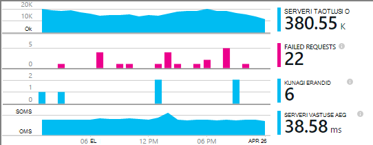

<properties
    pageTitle="MyDriving Azure asjade näide: ehitada | Microsoft Azure'i"
    description="Koostada rakendus, mis on täielik tutvustamise arhitekt soovitud asjade süsteemi Microsoft Azure'i, sh voo Analytics, seadme õppimine ja sündmuse jaoturi abil tehke järgmist."
    services=""
    documentationCenter=".net"
    suite=""
    authors="harikmenon"
    manager="douge"/>

<tags
    ms.service="multiple"
    ms.workload="tbd"
    ms.tgt_pltfrm="ibiza"
    ms.devlang="dotnet"
    ms.topic="article"
    ms.date="03/25/2016"
    ms.author="harikm"/>


# <a name="build-and-deploy-the-mydriving-solution-to-your-environment"></a>Koostage ja Juurutage MyDriving lahendus teie keskkonnas

MyDriving on Internet, asjade lahenduse, mis kogub andmeid auto, töötleb selle seadme õ abil ja esitab selle oma mobiiltelefonis. Tagasi lõpuks sisaldab mitmesuguseid Microsoft Azure'i teenused. Kliendid võivad olla Androidi, iOS-i või Windows 10 telefonid.

Lõime MyDriving lahenduse teile on kiire luua oma asjade süsteem. [MyDriving hoidla github](https://github.com/Azure-Samples/MyDriving), saate Azure'i ressursihaldur skriptide juurutamiseks tagaandmebaas arhitektuur Azure'i kontosse sisse. Sealt, saate konfigureerida erinevad teenused, muuta päringud vastavalt oma andmeid ja muudeks tegevusteks. Saate otsida nende skriptide--koos koodi mobiilirakenduse, projekti Azure'i rakenduse teenuse API ja muud--MyDriving hoidla.

Kui te pole veel rakendust proovinud, vaadake [toomine alustamise juhend](iot-solution-get-started.md).

Üksikasjalik ülevaade [MyDriving Lühijuhend](http://aka.ms/mydrivingdocs)arhitektuur on. Kokkuvõttes on mitu tükeldatud, et saaksime häälestamine ja, et soovite määrata kuni sarnase projekti loomine:

* Või **kliendi rakendus** töötab Android, iOS-i ja Windows 10 telefonis. Kasutame Xamarin platvormi osa palju koodi, mis on talletatud github jaotises `src/MobileApp`. Rakenduse sooritab tegelikult kaks erinevat funktsiooni.
 * See edastab telemeetria rongis diagnostika (OBD) seadmest ja oma asukohta teenuse süsteemi cloud tagasi lõppu.
 * See on kasutajaliides, kus kasutajad saavad oma salvestatud tee reisi kohta päringuid.
* **Pilveteenuses** saaks tee-reisi andmete reaalajas ja töötleb. Peamised töö loomise see teenus on valida, parameterize ja traat üles erinevaid Azure teenuseid. Mõned osad on vaja skriptide filter ja protsessi sissetulevad andmed. Mõni Azure ressursihaldur mall abil kõik osad konfigureerimine.
* Või **mobiilsideteenuse rakendus** on veebiteenuse taha kasutaja kasutajaliidese osa seadme rakendus. Oma peamist tööd on talletatud, töödeldud andmete andmebaasi päringu. Selle kood on GitHub jaotises `src/MobileAppService`.
* **Visual Studio Xamarin** on meie arenduskeskkond. Xamarin, mis on olemas, nii nagu komponendi Visual Studio ja omaette integreeritud arenduskeskkond (IDE), saab luua mitu platvormi seadme koodi. IOS-i kood koostamiseks, on vaja opsüsteemi OS X arvutis on Xamarin kohta. Vajaduse korral saab seda käivitada agent Visual Studio hallata.
* **Ühiku testimine** seadme rakenduste tehakse Xamarin Test pilveteenuses.
* **GitHub** on hoidla, kus oleme talletada kõik kood, skripte ja mallid.
* **Visual Studio Team Services** on pilveteenus kasutatava pidev koostamine ja katse teenuse ja seadme veebirakenduste haldamine.
* **HockeyApp** saab jagada versioonides seadme kood. Kogub ka krahh ja kasutusaruannete ja kasutajale tagasiside.
* **Visual Studio rakenduse ülevaated** jälgib Mobiiliversiooni veebiteenus.

Seega vaatame, kuidas me kõik, et häälestada. Pange tähele, et paljud juhiseid on valikuline.

## <a name="sign-up-for-accounts"></a>Kontode kasutajaks registreerumine

-   [Visual Studio arendaja Essentialsi](https://www.visualstudio.com/products/visual-studio-dev-essentials-vs.aspx). See tasuta programm lihtsasti palju Arendaja tööriistad ja teenuseid, sh Visual Studios, Visual Studio Team Services ja Azure. Siit leiate 25 eurot kuus krediitkaardiga Azure 12 kuu jooksul. See hõlmab ka Pluralsight koolitus ja Xamarin University tellimused. Saate ka kasutajaks eraldi tasuta astme [Azure](https://azure.com) ja [Visual Studio meeskonnatöö teenuste](https://www.visualstudio.com/products/visual-studio-team-services-vs.aspx), kuid need ei paku Azure krediidi summa liitmisel.

-   [HockeyApp](https://rink.hockeyapp.net/) (valikuline), haldamise testi jaotuse mobiilirakendused ja nõutakse telemeetria.

-   [Xamarin](https://xamarin.com/) (nõutav), mobiilirakenduse koostamise ja käitamise silumine käivitatakse ja testib [Xamarin testi](https://xamarin.com/test-cloud)pilve.

-   [GitHub](https://github.com/Azure-Samples/MyDriving/) (valikuline), luua tasuta avaliku hoidlate oma koodi (privaatne hoidlate makstakse). Teise võimalusena saate lihtsa leping Visual Studio meeskonnatöö teenused privaatne hoidlate.

-   [Power BI](https://powerbi.microsoft.com/) (valikuline), üle kogu süsteemi andmete rikkalike visualiseeringute loomiseks.

> [AZURE.NOTE] Te ei pea GitHub kontole juurdepääsemiseks [GitHub MyDriving hoidla](https://github.com/Azure-Samples/MyDriving)MyDriving koodi.

## <a name="install-development-tools"></a>Installige arengu tööriistad

Järgnevalt on täielik lahendus arendamise: on iOS-i, Androidi ja Windows 10 Mobile platvormidel rakendus, mis Azure tagasi end.

Teise võimalusena saate Xamarin Studio Mac-arvutisse või Windows Mobile'i rakendused töötada, kui te ei tööta on Azure tagasi end.

On [pikem kirjeldus See häälestus](https://msdn.microsoft.com/library/mt613162.aspx).

### <a name="windows-development-machine"></a>Windowsi arengu arvutisse

Opsüsteemis Windows keskne tööriist on Visual Studio MyDriving app for Androidi ja Windowsi rakenduse teenuse API projekti ja microservice laiendid töötamiseks.

Xamarin, Git, emulators ja muud kasulikud komponendid on kõik integreeritud Visual Studio.

Installimiseks tehke järgmist.

-   [Visual Studio 2015 Xamarin abil](https://www.visualstudio.com/products/visual-studio-community-vs) (mis tahes väljaande--ühenduse on tasuta).

-   [Universaalne Windowsi platvormi SQLite](https://visualstudiogallery.msdn.microsoft.com/4913e7d5-96c9-4dde-a1a1-69820d615936). Windows 10 Mobile koodi koostamiseks vajalik.

-   [Azure'i SDK Visual Studio 2015](https://go.microsoft.com/fwlink/?linkid=518003&clcid=0x409). Annab teile SDK installitud rakenduste Azure, haldamise Azure'i käsurea tööriistad koos.

-   [Azure teenuse struktuuri SDK](http://www.microsoft.com/web/handlers/webpi.ashx?command=getinstallerredirect&appid=MicrosoftAzure-ServiceFabric). Nõutav [microservice](../service-fabric/service-fabric-get-started.md) laiend koostamiseks.

Samuti veenduge, et teil on õige Visual Studio laiendid. Kontrollige, et **Tööriistad**, näete **Android, iOS-i, Xamarin …**. Kui ei, avage juhtpaneel ja valige **programmid ja funktsioonid** > **Microsoft** > **Visual Studio 2015** > **Muuda**. Valige jaotises **platvormidel arengu**, **C\#/.Net (Xamarin)**. Ootavad, kontrollige, kas **Windowsi Git** on installitud.

### <a name="mac-development-machine"></a>Maci arengu arvutisse

Mac-arvutis (Yosemite või uuem versioon) on nõutav, kui soovite töötada iOS-i. Kuigi kasutame Visual Studio Xamarin Windowsis välja töötada ja hallata kõik kood, kasutab Xamarin agent koostamine ja logige iOS-i kood Mac-arvutisse installitud.


(Teise võimalusena saate Xamarin Studio otse Macis platvormidel rakenduste arendamise.)

Te ei pea Mac-arvutis, kui te ei soovi arvutamiseks viitesse lisada iOS-i siht platvormi.

Installimiseks tehke järgmist.

-   [Xamarin Studio iOS-i](https://developer.xamarin.com/guides/ios/getting_started/installation/mac/). Te saate häälestada ka Visual Studio ja Mac-arvutis, kus töötab Windows virtuaalse masina Xamarin. MSDN-is leiate [häälestamise, installimist ja kontrolle Maci kasutajad](https://msdn.microsoft.com/library/mt488770.aspx) .

-   [Azure'i arengu tööriistad](https://azure.microsoft.com/downloads/) (valikuline).

Luba kaugarvuti sisselogimine on Mac-arvutisse. Avatud **System Preferences** > **ühiskasutus**ja seejärel valige **Remote Logi sisse**.

Visual Studio Windows on iOS-i projekt avamisel lisandmooduli Xamarin küsib teilt ID-d Mac.

## <a name="fetch-the-github-repository"></a>Toomiseks GitHub hoidla

**Laadige alla ZIP** GitHub, Visual Studio või mõne muu Git kliendi nupu abil toomiseks [GitHub MyDriving hoidla](https://github.com/Azure-Samples/MyDriving) kohaliku eksemplari.

Faili tee lühike nimi, näiteks C: kausta pakkige lahti\\kood.

Teine võimalus, kui soovite kursis hoida või panuse meie kood klooni hoidla järgmiselt:

**git klooni https://github.com/Azure-Samples/MyDriving.git**

## <a name="get-a-bing-maps-api-key"></a>Saada lisamine Bingi kaartide API võti

[Bingi kaartide API võti registreerida](https://msdn.microsoft.com/library/ff428642.aspx).

Peate asendama see rida 22 `src/MobileApps/MyDriving/MyDriving.Utils/Logger.cs`.


## <a name="build-the-demo-app"></a>Demo rakenduse koostamine

Avage Visual Studio järgmisi lahendusi.

-   src\MobileApps\MyDriving.SLN

-   src\MobileAppService\MyDrivingService.SLN

-   src\Extensions\ServiceFabric\VINLookUpApplication\VINLookUpApplication.SLN

Kuvatakse viipasid.

-   Usalda mõned potentsiaalselt untrustworthy projektid. Valige nende avamine, kui soovite minna.

-   Kui töötate värske Windows 10 seadmesse, määrake arendaja režiimis.

-   Sisestage mandaat Xamarin.

-   Ühenduse loomine Xamarin Mac-arvutisse. Kui teil pole Mac-arvutisse, paremklõpsake iOS-i projekti Visual Studio ja seejärel valige **maha laadida projekti**.

Lahendus taastada.

Kui teil on probleeme koostamise, proovige quirks, mis leidsime lahendusi.

-   *VINLookupApplication projekti ei laadita*: Veenduge, et olete installinud [Visual Studio 2015 Azure'i SDK](https://go.microsoft.com/fwlink/?linkid=518003&clcid=0x409).

-   *Teenuse struktuuri projekti ei koostamine*: koostamine projektide kasutajaliidese esmalt ja veenduge, et installitud teenuse struktuuri SDK.

-   *Androidi ei koostada*:

    -   Avage **Tööriistad** > **Androidi** > **Android SDK Manager**ja veenduge, et Android 6 (API 23) / SDK Platform on installitud.

    -   Selle kausta kustutada, ja seejärel taastada.<br/>
        `%LocalAppData%\Xamarin\zips`

## <a name="get-to-know-the-code"></a>Koodi tutvustus

Lahenduse leiate:

-   Azure'i laiendid: teenuse struktuuri.

-   Azure Hdinsightiga: Skriptide Azure reisi andmete töötlemiseks.

-   Mobiilirakenduste: Seadme rakendused.

-   MobileAppsService/MyDrivingService: Web tagasi lõpetamiseks.

-   Power BI: Aruande määratlus.

-   Skriptide:

    -   Ressursihaldur: Mallid koostamiseks Azure ressursse.

    -   PowerShelli: Skriptide käitamiseks ressursihaldur mallid.

    -   Azure'i SQL-andmebaasi: Silumine andmebaasid.

-   SQL-andmebaasi: CreateTables: skeemi määratlusi.

-   Azure'i voo Analytics: Päringud, mis sissetuleva andmevoos muuta.

## <a name="run-the-apps-in-development-mode"></a>Käivitage rakenduste arendamise režiimis

Tehke toimingu sooritamiseks rakendusi, seadmes, mida te kasutate.

-  Tagasi end: määramine MyDrivingService käivitamise projektiga ja tagaandmebaas veebiteenuse käivitamiseks vajutage klahvi F5. Avaneb brauseri vaate API kirjet.

-  Mobiilikliendid: [mobiilirakendused on välja töötatud Xamarin](https://developer.xamarin.com/guides/cross-platform/deployment,_testing,_and_metrics/debugging_with_xamarin/).
 -  Android: Lisateavet leiate teemast [Silumine Android Xamarin sisse](http://developer.xamarin.com/guides/android/deployment,_testing,_and_metrics/debugging_with_xamarin_android/).

 -  iOS: leiate teemast [silumine iOS-i](http://developer.xamarin.com/guides/ios/deployment,_testing,_and_metrics/debugging_in_xamarin_ios/).

 -  Windows Phone: Lisateavet leiate teemast [Xamarin + Windows Phone](https://developer.xamarin.com/guides/cross-platform/windows/phone/).

## <a name="upload-the-mobile-app-to-hockeyapp"></a>Mobiilirakenduse kaudu üles HockeyApp

HockeyApp haldab testimiseks kasutajad, Android, iOS-i või Windowsi rakenduse jaotuse teavitades kasutajaid, uued. Kogub ka kasulik krahh aruanded, kasutaja tagasiside ja kuvatõmmised kasutus mõõdikute.

[Alustuseks üleslaadimise](http://support.hockeyapp.net/kb/app-management-2/how-to-create-a-new-app) rakenduse koostamine. Seejärel logige sisse [HockeyApp](https://rink.hockeyapp.net) arengu teie arvutist. Arendaja armatuurlaud, klõpsake nuppu **Uus rakendus**ja seejärel lohistage akna ehitatud failide. (Uuemates versioonides saate automatiseerida Koosta teenust selleks.)

Nüüd olete rakenduse armatuurlauale.


Korrake toimingut iga platvormi, mis töötab teie rakendus. Seejärel saate teha järgmist:

-  Kasutage [rakenduse ID](http://support.hockeyapp.net/kb/app-management-2/how-to-find-the-app-id) armatuurlaualt teie rakenduse krahhi andmed ja tagasiside saatmiseks. Värskenda MyDriving, klõpsake src/MobileApps/MyDriving/MyDriving.Utils/Logger.cs ID-d.

-  [Kutsu kasutajaid](http://support.hockeyapp.net/kb/app-management-2/how-to-invite-beta-testers). Saate URL-i tööle testijad kasutajad. Nad juurde oma meeskonna jaoks registreeruda, laadige rakendus alla ja tagasiside saatmine.

-  Kui soovite veel avatud beetaversiooni, määramine avaliku jaotuse. Klõpsake **rakenduse haldamine** > **jaotuse** > **allalaadimine = avaliku**. Nüüd kõik rakenduse alla laadida ja tagasiside saatmine ja need kuvatakse teavitus sisestamisel uus versioon. Võite saada mõned krahh aruanded nende eest liiga.

    

-  [Link krahh Visual Studio Team Services aruandeid](http://support.hockeyapp.net/kb/third-party-bug-trackers-services-and-webhooks/how-to-use-hockeyapp-with-visual-studio-team-services-vsts-or-team-foundation-server-tfs). Klõpsake **rakenduse haldamine** > **Visual Studio Team Services**. HockeyApp saate luua automaatselt tööüksusi meeskonnatöö teenused, kui on krahhi aruanded või kui tagasiside vastu.

Lugege lisateavet [HockeyApp saidi](https://hockeyapp.net).

## <a name="test-the-mobile-app-on-xamarin-test-cloud"></a>Testige Xamarin testi pilve mobiilirakenduse

[Xamarin testi Cloud](https://developer.xamarin.com/guides/testcloud/introduction-to-test-cloud/) automatiseerib UI testimine pilveteenuses reaal seadmetes. Kasutades NUnit raames, peaksite kirjutama testide, mis töötavad rakenduse kasutajaliidese kaudu.

Xamarin kasutamiseks saate lisada [Xamarin.UITests](https://developer.xamarin.com/guides/testcloud/uitest/intro-to-uitest/) SDK teie rakendus, mis on Nugeti paketina. Demo rakenduse leiate ja see on kaasatud, kui loote uue testi projektide Xamarin mallide abil.


Näide testi projekt, mis on kaasas rakenduse hoidla. Otsige jaotises [src](https://github.com/Azure-Samples/MyDriving/tree/master/src)/MobileApps/[MyDriving](https://github.com/Azure-Samples/MyDriving/tree/master/src/MobileApps/MyDriving)/MyDriving.UITests/ [MyDriving](https://github.com/Azure-Samples/MyDriving/tree/master/src/MobileAppService).

Kui kasutate Visual Studio Team Services koostamine, on lihtne kirjutada Xamarin UI ühiku kontrollib ja kasutada neid oma koostamine osana.

## <a name="deploy-azure-services"></a>Azure'i teenuste juurutamine

Teha automaatse kasutuselevõtu Azure ja meeskonnatöö teenuste Koosta teenused, lugege üksikasjalikke juhiseid **scripts/README.md**.

Microsoft Azure'i pakub hulgaliselt erinevad teenused, mille abil saate luua rakendusi pilve. Ehkki paljud saab kasutada eraldi (nt rakenduse teenuse/veebirakenduste), nad oma parima, kui nad on omavahel seotud integreeritud, näiteks, et kasutame MyDriving vormile.

On võimalik luua ja omavahel Azure'i teenuste käsitsi, kuid on palju kiirem ja usaldusväärne kasutada Azure ressursihaldur mallid. [Ressursihaldur](../azure-resource-manager/resource-group-overview.md) automatiseerib lahenduse ressursid ja muutes nende vahel.

Leiate malli MyDriving süsteemi GitHub hoidlas [](https://github.com/Azure-Samples/MyDriving/tree/master/scripts/ARM)skriptide/osa. Kuidas erinevad teenused meie arhitektuur on omavahel seotud täielik ja lühike vaate pakub. Kõik need on üksikasjalikult [MyDriving Lühijuhend](http://aka.ms/mydrivingdocs)selgitame, kuid leiate palju lihtsalt lugedes malli.

> [AZURE.NOTE] Kõige Azure teenused on seotud maksumus, olenevalt hinnakirjad taseme. Kui olete kasutanud Azure, saate [proovida tasuta](https://azure.microsoft.com/free/). Kui plaanite ei MyDriving süsteemi kasutamine teatud komponendid, siiski veenduge, et need proovima kulud eemaldada. Selle artikli jaotises "Hinnangul tegevusega kulud" annab ülevaate tüüpiline teenuse kulud.

### <a name="edit-the-template"></a>Malli redigeerimine

Kohandada oma juurutuse ehk mittevajalikud komponendid eemaldada või lisada teisi, veenduge koopiate stsenaarium\_complete.params.json ja stsenaarium\_complete.json, kuhu soovite muuta.

Saate kasutada seda stsenaariumi\_complete.params.json faili alistada erinevaid vaikeväärtusi, näiteks teenuse SKU-ga või salvestusruumi dispersioonanalüüs tüüp, nagu on kirjeldatud järgmises tabelis. Vaikeväärtused kõige Valikud.

| **Parameetri**         | **Kirjeldus**                | **Vaikeväärtus** |
|--------|---------|-------|
| Asjade jaoturi SKU-ga           | Esimese taseme Azure'i asjade jaoturi teenuse jaoks | F1                |
| Salvestusruumi konto tüüp  | Tüübi talletusruumi dispersioonanalüüs       | Standardse LRS      |
| SQL-i teenuse eesmärk | Kokkulangevus pesa tarbimine   | DW100             |
| Hosting kava SKU-ga      | Rakenduse teenuse teenusleping   | F1                |

Stsenaariumi\_complete.json:

-   Otsige "baseName" ja selle nime, mida soovite muuta.

-   Otsing "Loo". Kõigi jaotiste loob ressursi.

-   Määrake sqlServerAdminLogin ja sqlServerAdminPassword sobivad väärtused.

-   Enne kui kustutate osa, mis loob ressursi, kontrollige, kas see on järgnevusi, kui otsite selle mujalt faili nime. Pange tähele, sisaldab iga jaotise, mis loob teenus *ei leia dependsOn* jaotis, kus on loetletud sõltuvustega.

Siin on, mis konfigureerib mall. [Juhend](http://aka.ms/mydrivingdocs)on üksikasjad.

| **Teenus**                 | **Kirjeldus ja üksikasjad**  
|---|----
| Salvestusruumi kontod            | Mall loob kolm kontot.                                                                                                                                                                       
|| -SQL-i andmebaasi, mis võtab vastu liidetud telemeetria voo Analytics ja toimib varundamise poe Azure'i rakendust Service tabelid, mis edastavad andmed läbi API lõpp-punktid.                      
|| -Bloobimälu, mis liidetakse teise voo Analytics töö töödeldavate Hdinsightiga andmed.                                                                                         
|| -SQL-i andmebaasi, mis saab töödelda Hdinsightiga Power BI kasutamiseks tulemused.                                                                                                                 
| Azure'i asjade jaoturi                     | Loob kahesuunalise ühenduse iga ühendatud seadet. MyDriving lahendus, toimib mobiilirakenduse välja lüüsi Azure'i asjade jaoturi andmeid saata. Azure'i asjade jaoturi toimib siis tuleb sisestada voo Analytics. |
| Azure'i sündmuse jaoturi                   | Voo Analytics töö, mis järjekorrad laiendid, mis on loodud Azure teenuse struktuuri väljund väljund.                                                                                               
| SQL Azure'i andmebaas          |                                                                                                                                                                                                            
| Voo Analytics tööde haldamine | Ühendage sisendi ja väljundi päringu, mida kasutatakse nii andmete reaalajas ja ajalooliste rakenduse teenuse API-d, Azure seadme õ, laiendid ja Power BI liita.                               
| Seadme õ tööruumi  | Sisaldab katsete, R koodi ja API teenus.                                                                                                                                                              
| Azure'i andmed Factory                | Ajastatud arvuti õ ümberõpet.                                                                                                                                                                     
| Teenuse struktuuri hosting kava | Jaoks laiendid.                                                                                                                                                                                            
| Rakenduse teenuse ("mobiilirakenduse")  | Majutab Mobile'i rakendused API projekti, mis annab lõpp-punktid mobiilirakenduse kaudu. API koodi saab juurutada teenusesse rakenduse Visual Studio.                                                         
| Teatiste reeglid                 | Saadab meilid, kui rakenduse vastused näitavad ebaõnnestumist.                                                                                                                                            
| Rakenduse ülevaated        | Jõudluse API-de rakenduse teenuses jälgimiseks. Teil on konfigureeriks Visual Studios.                                                                                          
| Azure'i võtme Vault                   | Salvestamise veebi teenuse kobar sert.                                                                                                                                                                

### <a name="run-the-template"></a>Käivitage Mall

**Scripts/README.md**, on üksikasjalikud juhised töötab mall.

Kõik need teenused Azure'i konto ettevalmistamise skripti kaudu, tehke ühte järgmistest.

-   PowerShelli kasutamine:

    ```

    cd scripts/PowerShell;
    deploy.ps1 *location* *resourceGroupName*
    ```

 -   *asukoht* on [Azure asukohta](https://azure.microsoft.com/regions/), näiteks `North Europe` või `West US`. Kasutage `Get-AzureLocation` leidmiseks asukoht saadaolevate asukohtade loendit.

 -   *resourceGroupName* on nimi, mille soovite anda rühma, mis kuuluvad kõik ressursid. Kui olete lõpetanud ressursside, saate neid kustutades selle rühma kõik koos kustutada.

-   Käivita DeploymentScripts/Bash/deploy.sh Bash.

-   Avage ja Visual Studio lahendus DeploymentScripts/VS/DeployARM.sln koostamine.

Pange tähele, et iga kord, kui mall on käivitada, loob see uus komplekt ressursid uue nimedega. Ressursside kustutamiseks portaalis ja kustutage ressursirühma.

Kui mingil põhjusel ei skripti, saate selle uuesti käivitada.

Skripti pakub teile võimalust pidev integratsioon Visual Studio Team Services konfigureerimine. Kui olete seadistanud meeskonnatöö teenuste projekti, tuleb teil URL: https://yourAccountName.visualstudio.com. Kui teilt küsitakse, sisestage täielik URL. Saate anda selle projekti meeskonnatöö teenuste uude või olemasolevasse nimi.

## <a name="set-up-build-and-test-definitions-in-visual-studio-team-services"></a>Koostamine häälestamine ja testimine määratlused Visual Studio meeskonnatöö teenused

Me kasutada meeskonnatöö teenuste selle projekti enamasti selle koostamine ja funktsioone testida. Kuid pakub suurepäraseid koostöö tuge, nt Kanban tahvleid ja ülesannete haldus, koodi läbivaatus integreeritud tööülesandeid ja andmeallika juhtelemendi ja avatavad koostab. See ühendab ka muud tööriistad, nt GitHub, Xamarin HockeyApp ja loomulikult Visual Studio. Sellele juurde pääsevad kasutajaliides web või Visual Studio kaudu, kumb on mugavam igal ajal.

Koostamine ja väljaanne määratlused juhiseid kasutada mitmesuguseid lisandmooduli Team Services [turuplatsi](https://marketplace.visualstudio.com/VSTS)saadaolevaid teenuseid. Lisaks lihtsa Utiliidid käivitada käsk read või faile kopeerida, on teenuste mis autonoomsest järgud Xamarin, Androidi ja muude tarnijatele ja mis ühenduse HockeyApp.


### <a name="build-definitions"></a>Määratlused koostamine

Meil on iga peamised eesmärgid Koosta määratlusi. Meil on ka variatsioonide funktsioon ja regressiooni testimine. Mis annab meile:

-   MyDriving.Services (tagaandmebaas web app mobiilirakenduse kaudu)

-   MyDriving.Xamarin.Android

    -   Funktsioon MyDriving.Xamarin.Android

    -   MyDriving.Xamarin.Android-regressiooni

-   MyDriving.Xamarin.iOS

    -   Funktsioon MyDriving.Xamarin.iOS

    -   MyDriving.Xamarin.iOS-regressiooni

-   MyDriving.Xamarin.UWP

    -   Funktsioon MyDriving.Xamarin.UWP

    -   MyDriving.Xamarin.UWP-regressiooni

Kui soovite meie konfiguratsiooni üksikasjade, vaadake jaotist 4.7 [MyDriving Lühijuhend](http://aka.ms/mydrivingdocs)"Koostamine ja väljaanne konfiguratsiooni." See järgib sama üldine muster. Skripti:

1.  Taastab Nugeti pakett. Me ei hoidlas, kompileeritud kood hoida, et iga Koosta esimesed sammud on nõutav Nugeti paketid taastamiseks.

2.  Aktiveerib selle litsentsi. Sooritatakse koostamine pilves, nii kui läheb vaja litsentsi--eelkõige Xamarin koostamine teenuse--meil aktiveerida meie litsentsi praeguse Koosta arvutisse. Me inaktiveerige see kohe pärast seda, et ta saaks kasutada mõnda teise arvutisse.

3.  Koostab vastav teenuse abil. Kasutame Xamarin järgud mobiilirakenduste ja Visual Studio koostab tagaandmebaas veebiteenuse.

4.  Koostab kontrollib.

5.  Käivitatakse kontrollib. Võtame mobiilirakenduse testide Xamarin testi pilveteenuses.

6.  Koosta tulemi avaldab ripploendi asukoht.

Peamised järgud jaoks päästik on seatud pidev integratsioon. Mis on koostamine käivitatakse iga kord, kui kood on märgitud juhtslaidi haru.


### <a name="release-definitions"></a>Vabastage määratlused

Väljalaske määratlused on häälestatud palju samal viisil.

Veebiteenuse, meil loodud juurutamise kui Azure web app:


Ja me väljaanne päästik pidev juurutusega. Mis on iga sisse-ja järgneb eduka Koosta tulemuste värskendus web appi.


Mobiilirakendused, saame võtta kasutusele HockeyApp:


## <a name="explore-telemetry-by-using-application-insights"></a>Tutvumine telemeetria abil rakenduse ülevaated

[Rakenduse ülevaated](../application-insights/app-insights-overview.md) kogub telemeetria web teenuste kasutamist ja jõudluse kohta. Rakenduse ülevaateid SDK saadab telemeetria teenuse rakenduse ülevaated ressursi Azure.

Liikuge sirvides rakenduse ülevaated ressursi malli häälestatud. Olemas, saate uurida [mobiilsideteenuse rakenduse project](https://github.com/Azure-Samples/MyDriving/tree/master/src/MobileAppService)täitmise diagrammid. Serveri taotlusi ja vastuse korda, tõrkeid, kuvatakse ja loendab erand. Olemas on ka sõltuvus vastuse korda--, kõnede andmebaas ja seadme õ nt REST API-de diagrammid. Kui määratud on mõni jõudlusprobleemide, saate küll vaadata, mis teie süsteemi tükk põhjustab neid.



Kui teil on veebiteenus, mille seadistasite käsitsi, on teil lihtne pääseda juurde sama diagrammide. Enne web service, klõpsake nuppu **Tööriistad** > **laiendid** > **lisamine**. Valige **Rakenduse ülevaated**.


See funktsioon toimib instrumenting rakenduse ülevaateid SDK rakenduse.

Saate lisada kohandatud telemeetria (või dokumendi rakendus, mis töötab Azure), [lisades rakenduse ülevaateid SDK](../application-insights/app-insights-asp-net.md) arengu ajal. See on kasulik rakendus, nt kasutajate Keskmine reisi pikkus või kokku läbitud vahemaa sõltuvad log mõõdikute. Visual Studios, paremklõpsake projekti ja seejärel valige **Lisa rakenduse ülevaated**.


Rakenduse ülevaated saadab teatiste e-kirju, kui ta näeb ebatavalised tõrge vastuste arvu. Saate häälestada ka oma erinevate mõõdikute, nt vastuse korda teatised.

Et olla kindel, et teie veebiteenuse on alati ajakohasuse ja töötab, saate häälestada [kättesaadavus kontrollib](../application-insights/app-insights-monitor-web-app-availability.md). Need katsed ping saidi erinevatest asukohtadest kogu maailmas iga 15 minuti järel. Uuesti, saate e-posti, kui tundub, et probleem.

## <a name="estimate-operational-costs"></a>Funktsionaalseid kulude

See on märkimisväärselt odav umbes selline väikeses ulatuses rakenduse käivitamiseks. Paljud teenused on tasuta algtaseme astme, arendus- ja väikesemahuliste maksumus väga vähe. Ja muidugi oma rakendusi kasutada kõiki funktsioone, mis on näidatud MyDriving pole.

Siin on meie hindade kohta häälestamise arengu konfiguratsiooni MyDriving ligikaudne. Me samuti võtke arvesse mõned alternatiivid, et me ei *ei* kasuta. See teave võib olla kasulik, kui teie enda kulude.

Oleme endale:

-   Meeskonna kuni viis (pluss jälgides huvirühmade).

-   Opsüsteemi kohta kuus.

-   neli reisi päevas 100 kasutajad.

>[AZURE.NOTE] Kui olete kasutanud Azure, on olemas [tasuta konto](https://azure.microsoft.com/free/).

| **Teenuse/komponent**  | **Märkmete** | **Maksumus kuus** |
|--------|--------|----------------|
| [Visual Studio 2015 ühenduse](https://www.visualstudio.com/products/visual-studio-community-vs) [Xamarin](https://visualstudiogallery.msdn.microsoft.com/dcd5b7bd-48f0-4245-80b6-002d22ea6eee) <br/>Mitu platvormi arenduskeskkond| Visual Studio ühenduse. (Peate [Visual Studio Professional](https://www.visualstudio.com/vs-2015-product-editions) [Xamarin.Forms](https://xamarin.com/forms), mitu platvormi kaudu ühe kood base kujundamise jaoks.)  | $0   |
| [Azure'i asjade jaoturi](https://azure.microsoft.com/pricing/details/iot-hub/) <br/>Kahesuunalise andmeühenduse seadmed | 8 000 sõnumite + 0,5 KB/sõnumi tasuta. | $0             |
| [Voo Analytics](https://azure.microsoft.com/pricing/details/stream-analytics/)  <br/>   Suure mahu voo andmete töötlemiseks                                                                                                                                                              | Tasuta $0,031 kohta streaming ühiku tund, kui lubatud. Saate valida streaming ühikute, mida soovite; Lisateave skaalal. | $23            |
| [Seadme õpetused](https://azure.microsoft.com/documentation/services/machine-learning/)<br/> Kohandatavad vastused                                                                                                                                                                              |  kuu / $10/asukoht. <br/>                                                                                                                                                                                 + 3-tunnise katse \* $1 / katsetamiseks tund. <br/>                                                                                                                                                           + 3.5-tunnise API CPU \* $2 / tootmise CPU tund. <br/>                                                                                                                                                          API CPU aega eeldab 5 min päevas ümberõppe, kuigi see kasvab veel Sisestuskeel andmetega.                   <br/>                                                                                                                                                                     + 2 min päevas töödelda 400 reisi päevas hinded.  | 20            |
| [Rakenduse teenus](https://azure.microsoft.com/pricing/details/app-service/)  <br/> Host mobiilsideseadmete tagasi end                                                                                                                                                                              | Esimese taseme B1--tootmise veebirakenduste. | $56            |
| [Visual Studio Team Services](https://azure.microsoft.com/pricing/details/visual-studio-team-services/)  <br/> Koostamine ja ühiku test Redaktsioonide; ülesannete haldamine | Privaatne agentide viis kasutajat.| $0             |
| [Rakenduse ülevaated](https://azure.microsoft.com/pricing/details/application-insights/) <br/>Jälgimine ja jõudluse kasutamist veebiteenustele ja saidid| Tasuta taseme.  | $0             |
| [HockeyApp](http://hockeyapp.net/pricing/) <br/> Jaotuse beeta rakendused, millele tagasiside, kasutus ja krahhi andmete kogum.                                                                                                                                      | Kahe tasuta rakendused uute kasutajate jaoks.<br/> 30 eurot/kuu.  | $0    |
| [Xamarin](https://store.xamarin.com/)<br/> Tõrkekood ühtse platvormi, mitu seadmete jaoks | Tasuta prooviversioon. <br/>25 eurot/kuu.| $0    |
| Azure'i rakendust Service [SQL-andmebaas](https://azure.microsoft.com/pricing/details/sql-database/)| Tavaline taseme; ühe andmebaasi mudel. | $5             |
| [Teenuse struktuuri](https://azure.microsoft.com/pricing/details/service-fabric/) (valikuline)  | Käivitage kohaliku kobar. | $0             |
| [Power BI](https://powerbi.microsoft.com/pricing/)<br/> Kuvab mitmekülgne ja voona ja staatilise andmete uurimine| Tasuta taseme: 1 GB, 10 000 rida/tund, Värskenda iga päev. <br/> $10/kasutaja kohta kuus [kõrgema piirangud](https://powerbi.microsoft.com/documentation/powerbi-power-bi-pro-content-what-is-it/), ühendussuvandid, koostöö.    | $0             |
| [Salvestusruumi](https://azure.microsoft.com/pricing/details/storage/)   | L (kohalik üleliigsed) &lt; 100 G $ 0,024/GB.  | $3             |
| [Andmete Factory](https://azure.microsoft.com/pricing/details/data-factory/)                                                                                                                       | $0,60 tegevuse \* (5 – 8 FOC).| $2             |
| [Hdinsightiga](https://azure.microsoft.com/pricing/details/hdinsight/) <br/>  Igapäevane ümberõppe nõudmisel kobar   | Kolm A3 sõlmed $ 0,32/tund 1 tund iga päev * 31 päeva. | 30 eurot            |
| [Sündmuse jaoturi](https://azure.microsoft.com/pricing/details/event-hubs/)  | Tavaline $11/ kuu läbilaskevõime ühiku + $0.028 sissepääsu. | $11            |
| OBD dongle  || $12            |
| **Kogusumma**|    | **$157**       |

Lisateavet leiate teemast:

-   Kokkuvõte [Azure teenuse kvootide](../azure-subscription-service-limits.md#iot-hub-limits) ja piirangud

-   Azure'i [hinnad kalkulaator](https://azure.microsoft.com/pricing/calculator/)

## <a name="send-us-your-feedback"></a>Saatke meile tagasisidet

Kuna me loodud MyDriving kiire abil oma asjade süsteemide, kindlasti Soovime kuulda teie kohta, kuidas see töötab. Andke meile teada, kui:

-  Tekib probleeme või probleeme.

-  On laiend punkti, et oleks rohkem sobilik stsenaariumist.

-  Te ei leia tõhusam viis täita teatud vajadustele.

-  Teil on muid ettepanekuid parandada MyDriving või need dokumendid.

Tagasiside andmiseks [GitHub probleemi] või arhiivida kommentaar allpool (en-us edition).

Vaatame edasi kuulamine teie!

## <a name="next-steps"></a>Järgmised sammud

Soovitame [MyDriving Lühijuhend](http://aka.ms/mydrivingdocs), mis on süsteemi ja selle komponentide täielik kirjeldus.
