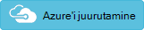

<properties
    pageTitle="Keskkonna Log Analytics lahendusega teenuse struktuuri optimeerimine | Microsoft Azure'i"
    description="Saate teenuse struktuuri lahendus risk ja teenuse struktuuri rakendused, mikro-teenused, sõlmed ja kogumite hindamiseks."
    services="log-analytics"
    documentationCenter=""
    authors="niniikhena"
    manager="jochan"
    editor=""/>

<tags
    ms.service="log-analytics"
    ms.workload="na"
    ms.tgt_pltfrm="na"
    ms.devlang="na"
    ms.topic="article"
    ms.date="09/21/2016"
    ms.author="nini"/>


# <a name="service-fabric-solution-in-log-analytics"></a>Teenuse struktuuri lahenduse Log Analytics

> [AZURE.SELECTOR]
- [Ressursihaldur](log-analytics-service-fabric-azure-resource-manager.md)
- [PowerShelli](log-analytics-service-fabric.md)

Selles artiklis kirjeldatakse, kuidas kasutada teenuse struktuuri lahenduse Log Analytics tuvastamiseks ja üle klaster teenuse struktuuri probleemide tõrkeotsing.

Teenuse struktuuri lahendus kasutab Azure diagnostika teie teenuse struktuuri VMs koguda andmeid tabelitest Azure'i WAD. Log Analytics loeb teenuse struktuuri framework sündmused, sh **Usaldusväärne teenuse sündmused**, **Näitleja sündmused**, **Funktsionaalseid sündmused**ja **kohandatud ETW sündmused**. Lahendus armatuurlaud, kus olete vaadata teie teenuse struktuuri keskkonnas märkimisväärne probleemide ja sündmuste jaoks oluline.

Lahendus alustada, peate teenuse struktuuri klaster ühenduse Log Analytics tööruumi. Siin on kõigi kolme stsenaariumi puhul silmas pidada.

1. Kui teil on juurutatud klaster teenuse struktuuri, järgige ***Deploy teenuse struktuuri kobar ühendatud Log Analytics tööruumi*** Juurutage uus klaster ja on see konfigureeritud Logi Analytics aruande.

2. Kui teil on vaja oma hosts kasutada muid OMS lahendusi, nt turvalisuse teenuse struktuuri klaster jõudluse hinnale kogumine, järgige ***teenuse struktuuri kobar ühendatud OMS tööruumi VM laiendiga installitud Deploy.***

3. Kui olete juba juurutanud oma teenuse struktuuri kobar ja soovite ühenduse Log Analytics, järgige ***salvestusruumi konto lisamine Log Analytics.***


##<a name="deploy-a-service-fabric-cluster-connected-to-a-log-analytics-workspace"></a>Teenuse struktuuri kobar ühendatud Log Analytics tööruumi juurutamine.
Selle malli teeb järgmist.


1. Kasutab Azure teenuse struktuuri kobar, mis juba ühendatud Log Analytics tööruumi. Teil on võimalus uue tööruumi loomine malli juurutamisel või sisestusmeetodi Log Analytics juba olemasoleva tööruumi nimi.
2. Lisab diagnostika salvestusruumi konto Log Analytics tööruumi.
3. Võimaldab teenuse struktuuri lahendus teie Log Analytics tööruumis.

[](https://portal.azure.com/#create/Microsoft.Template/uri/https%3A%2F%2Fraw.githubusercontent.com%2Fazure%2Fazure-quickstart-templates%2Fmaster%2Fservice-fabric-oms%2F%2Fazuredeploy.json)


Kui valite deploy nuppu ülal, jõuate Azure'i portaalis parameetritega redigeerida. Veenduge, et luua uue ressursirühma, kui sisestate Log Analytics tööruumi uus nimi: 


Juriidiline nõustumine ja vajuta "Loo" juurutamise alustamiseks. Kui juurutamise on lõpule viidud, peaksite nägema uue tööruumi ja kobar loodud ja selle WADServiceFabric * sündmus, WADWindowsEventLogs ja WADETWEvent tabelid on:


##<a name="deploy-a-service-fabric-cluster-connected-to-an-oms-workspace-with-vm-extension-installed"></a>Juurutada teenuse struktuuri kobar ühendatud OMS tööruumi VM laiendiga installitud.
Selle malli teeb järgmist.

1. Kasutab Azure teenuse struktuuri kobar, mis juba ühendatud Log Analytics tööruumi. Saate uue tööruumi loomine või olemasoleva kasutamiseks.
2. Lisab Log Analytics tööruumi diagnostika salvestusruumi kontod.
3. Võimaldab teenuse struktuuri lahendus Log Analytics tööruumis.
4. Installib MMA agent laiend VM skaala klaster teenuse struktuuri määrata. Installitud MMA agent olete jõudluse mõõdikute kohta oma sõlmed vaadata.


[](https://portal.azure.com/#create/Microsoft.Template/uri/https%3A%2F%2Fraw.githubusercontent.com%2Fazure%2Fazure-quickstart-templates%2Fmaster%2Fservice-fabric-vmss-oms%2F%2Fazuredeploy.json)


Pärast ülaltoodud samu juhiseid, vajalikud sisendparameetrid ja võrgukoosolekuga juurutamine. Taas peaksite nägema uue tööruumi, kobar ja WAD tabelite kõik loodud:


###<a name="viewing-performance-data"></a>Tulemustega seotud andmete vaatamine

Oma sõlmed täiuslik andmete vaatamine
</br>
- Käivitage Log Analytics tööruumi Azure portaalist.


- Valige vasakul paanil sätted ja valige andmed >> Windowsi jõudlus hinnale >> "Lisa valitud jõudluse hinnale": 

- Log otsinguväljale kasutada järgmistele küsimustele võtme mõõdikute kohta oma sõlmed süveneda.
</br>

    lisamine. Võrrelda keskmise CPU kasutamine kõik teie sõlmed viimase üks tund näha, millised sõlmed on probleeme ja mis ajavahemiku sõlm oli on kühvli.

    ``` Type=Perf ObjectName=Processor CounterName="% Processor Time"|measure avg(CounterValue) by Computer Interval 1HOUR. ```

    


    b. Iga sõlme selle päringuga sarnaseid joondiagrammide jaoks saadaoleva mäluga vaatamiseks tehke järgmist.

    ```Type=Perf ObjectName=Memory CounterName="Available MBytes Memory" | measure avg(CounterValue) by Computer Interval 1HOUR.```

    Saate vaadata kõiki oma sõlmed, näitab täpse keskmise väärtuse jaoks saadaval megabaiti iga sõlme kasutage selle päringu.

    ```Type=Perf (ObjectName=Memory) (CounterName="Available MBytes") | measure avg(CounterValue) by Computer ```

    


    c. Juhul, kui soovite teatud sõlm uurides kord tunnis Keskmine, miinimum, maksimum ja 75 protsentiil CPU hõivatus süvitsiminek, saate selleks kasutada selle päringu (asendage arvuti väli):

    ```Type=Perf CounterName="% Processor Time" InstanceName=_Total Computer="BaconDC01.BaconLand.com"| measure min(CounterValue), avg(CounterValue), percentile75(CounterValue), max(CounterValue) by Computer Interval 1HOUR```

    

    Lugege lisateavet jõudluse mõõdikute Log Analytics [siin]. (https://blogs.technet.microsoft.com/msoms/tag/metrics/)


##<a name="adding-an-existing-storage-account-to-log-analytics"></a>Log Analytics salvestusruumi konto lisamine

Selle malli lihtsalt lisab teie salvestusruumi olemasolevaid kontosid uude või olemasolevasse Log Analytics tööruumi.
</br>

[](https://portal.azure.com/#create/Microsoft.Template/uri/https%3A%2F%2Fraw.githubusercontent.com%2FAzure%2Fazure-quickstart-templates%2Fmaster%2Foms-existing-storage-account%2Fazuredeploy.json)

>[AZURE.NOTE] Ressursirühm, valides kui töötate juba olemasoleva Log Analytics tööruumi, valige "Kasuta olemasolevaid" ja otsige ressursirühm, mis sisaldab OMS tööruumi. Saate luua uue teisiti.


Pärast seda malli on kasutusele võetud, on võimalik vaadata oma Log Analytics tööruumi ühendatud konto salvestusruumi. Käesoleval juhul lisamist ühe rohkem mäluruumi kontoga Exchange'i tööruumi loodud kohal.


## <a name="view-service-fabric-events"></a>Teenuse struktuuri sündmuste vaatamine

Kui kasutuselevõttu on lõpule viidud ja teenuse struktuuri lahendus on lubatud teie tööruumis, valige Logi Analytics portaalis käivitada teenuse struktuuri armatuurlaua **Teenuse struktuuri** paan. Armatuurlaua sisaldab järgmises tabelis veerud. Iga veeru loendid kümme sündmusi teatud ajavahemiku jaoks selle veeru kriteeriumidele vastavaid arvu järgi. Saate käivitada log otsing, mis pakub tervet loendit, klõpsates nuppu, et **näha kõiki** iga veeru paremas allservas või klõpsake selle veeru päist.

| **Teenuse struktuuri sündmuse** | **kirjeldus** |
| --- | --- |
| Kuid probleemid | Kuva RunAsyncFailures RunAsynCancellations ja sõlm Downs. |
| Funktsionaalseid sündmused | Kuid funktsionaalseid sündmusi, näiteks rakenduse täiendamine ja juurutuste. |
| Usaldusväärne teenus sündmused | Kuid töökindlat sündmuste sellise Runasyncinvocations. |
| Näitleja sündmused | Kuid näitleja sündmuste loodud mikro-teenused, nt erandid visanud sisestusmeetod näitleja, näitleja sisselülitamise ja desaktiveerimiste jne. |
| Rakenduse sündmused | Kõikide kohandatud ETW sündmuste loodud rakenduste. |


Järgmises tabelis on andmete kogumise meetodite ja muud üksikasjad, kuidas koguda andmeid teenuse struktuuri kohta.

| platvorm | Otsest Agent | SCOM agent | Azure'i salvestusruum | SCOM on nõutav? | Rühma kaudu saadetud SCOM agendi andmed | saidikogumi sagedus |
|---|---|---|---|---|---|---|
|Windows||| |            ||10 minuti |


>[AZURE.NOTE] Teenuse struktuuri lahenduse nende sündmuste ulatuse saate muuta, klõpsates armatuurlaua ülaosas **andmete põhjal viimase 7 päeva jooksul** . Saate kuvada sündmused, mis on loodud viimase 7 päeva jooksul, 1 päeva või kuus tundi. Või valige **kohandatud** kohandatud kuupäevavahemiku määramiseks.


## <a name="next-steps"></a>Järgmised sammud

- [Log otsingud Log Analytics](log-analytics-log-searches.md) abil saate vaadata üksikasjalikku teenuse struktuuri sündmuse andmed.
