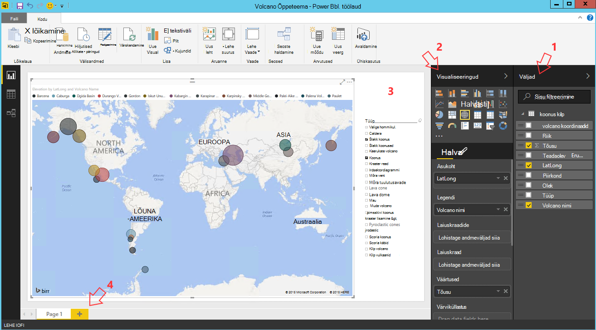

<properties
    pageTitle="Kümme asja, mida saate teha andmete teadus virtuaalse masina | Microsoft Azure'i"
    description="Sooritada erinevaid andmete uurimine ja modelleerimine ülesande andmete teadus virtuaalse masina."
    services="machine-learning"
    documentationCenter=""
    authors="bradsev"
    manager="jhubbard"
    editor="cgronlun"  />

<tags
    ms.service="machine-learning"
    ms.workload="data-services"
    ms.tgt_pltfrm="na"
    ms.devlang="na"
    ms.topic="article"
    ms.date="08/29/2016"
    ms.author="gokuma;weig;bradsev" />

# <a name="ten-things-you-can-do-on-the-data-science-virtual-machine"></a>Kümme asja, mida saate teha andmete science virtuaalse masina

Microsoft andmete teadus virtuaalse masina (DSVM) on võimas andmete teadus arenduskeskkond, mis võimaldab teil teha erinevaid andmete uurimine ja modelleerimine toiminguid. Keskkonna on juba ehitatud ja kogumisse seotud mitu populaarsed andmete analüüsi tööriistu, mis on lihtne alustada kiiresti oma analüüsi jaoks asutusesiseselt, Cloud või hübriid juurutuste. Funktsiooni DSVM tihedat koostööd mitme Azure'i teenuste ja saab lugeda ja andmeid, mis on juba salvestatud Azure SQL Azure'i andmebaas, Azure'i andmed Lake, Azure Storage või DocumentDB. Samuti saate seda kasutada muude analüütilisi tööriistu, nt Azure seadme õppimine ja Azure andmete Factory.


Selles artiklis tutvustame teile oma DSVM erinevad Andmetoimingute teadus teha ja suhelda muude Azure'i teenuste kasutamise kohta. Järgnevalt mõned asjad, mida saate teha selle DSVM.

1. Andmete uurimine ja arendada mudelites kohalikult DSVM, kasutades Python R äriteave
2. Jupyter märkmiku kasutamiseks eksperimenteerida oma brauseri kaudu Python 2, Python 3, Microsoft R andmete enterprise valmis versiooni R mõeldud skaleeritavus ja jõudlus
3. Kiireks abil R ja Python Azure seadme õ nii klientrakendustes pääsete juurde oma mudelite lihtsa liidese services abil loodud mudelid
4. Hallata oma Azure ressursse, mis on Azure portaali või PowerShelli abil
5. Salvestusruumi laiendamine ja suurte andmekomplektide ühiskasutus / kood üle kogu teie meeskond loomisega Azure'i mälu paigaldatud Drive oma DSVM kohta
6. Ühiskasutus meeskonnaga abil Github kood ja kasutada oma andmebaasi eelinstallitud Git klientide - Git Bash, Git GUI abil.
7. Erinevate Azure'i andmed ja analüüsi teenustele juurdepääs Azure'i bloobimälu, nagu Azure'i andmed Lake, Windows Azure Hdinsightiga (Hadoopi), Azure'i DocumentDB, SQL Azure'i andmebaas ja andmebaasid
8. Aruannete ja Power BI Desktopi eelinstallitud opsüsteemi soovitud DSVM armatuurlaua luua ja juurutada neid pilve
9. Dünaamiliselt skaala oma DSVM oma projekti vajadustele.
10. Täiendavad tööriistad oma virtual arvutisse installida   


>[AZURE.NOTE] Täiendavad kasutus hinnad paljude selles artiklis toodud täiendavad andmed salvestusruumi ja analüüsi teenuste jaoks. Leiate [Azure'i hinnad](https://azure.microsoft.com/pricing/) lehelt.


**Eeltingimused**

- Peate Azure tellimuse. Saate registreeruda on tasuta prooviversiooni [siin](https://azure.microsoft.com/free/).

- Juhised ettevalmistamise andmete teadus virtuaalse masina Azure'i portaalis on võimalik [luua virtuaalse masina](https://portal.azure.com/#create/microsoft-ads.standard-data-science-vmstandard-data-science-vm).

## <a name="1-explore-data-and-develop-models-using-microsoft-r-server-or-python"></a>1 andmete uurimine ja arendada mudeleid Microsoft R Server või Python abil

Saate teha oma andmeanalüüsi paremale klõpsake soovitud DSVM keelte nagu R ja Python.

R, saate kasutada ka IDE nimega "Revolutsioon R Enterprise 8.0", leiate menüü start või töölaua. Microsoft on andnud teeke peal avatud allika/CRAN-R lubamiseks scalable analüüsi- ja võimalus suurem mälumahuga lubatud, tehes paralleelselt chunked analüüsi andmete analüüsiks. Saate installida ka teie valitud [RStudio](https://www.rstudio.com/products/rstudio-desktop/)nagu ka R-IDE.

Python, saate kasutada ka IDE nagu Visual Studio ühenduse Edition, mis on Python tööriistad Visual Studio (PTVS) pikendamise eelinstallitud. Vaikimisi on ainult lihtsa Python 2.7 konfigureeritud PTVS (ilma mis tahes analytics teek, näiteks SciKit Pandas). Anaconda Python 2.7 ja 3.5 lubamiseks peate tegema järgmist:

* Luua kohandatud keskkonnas iga versiooni navigeerides **Tööriistad** -> **Python tööriistad** -> **Python keskkonnas** ja klõpsates siis käsku "**+ kohandatud**" Visual Studio 2015 ühenduse Edition
* Kirjelduse ja seadmine keskkonna eesliite teed *c:\anaconda* jaoks Anaconda Python 2.7 või *c:\anaconda\envs\py35* Anaconda Python 3.5
* Klõpsake **Automaattuvastus** ja seejärel **Rakenda** keskkonna salvestamiseks.

Siin on kohandatud keskkonna häälestamine näeb Visual Studios.


Vaadake, kuidas luua Python keskkonnas [PTVS dokumentatsiooni](https://github.com/Microsoft/PTVS/wiki/Selecting-and-Installing-Python-Interpreters#hey-i-already-have-an-interpreter-on-my-machine-but-ptvs-doesnt-seem-to-know-about-it) kohta lisateabe saamiseks.

Nüüd on häälestatud Python uue projekti loomiseks. Avage **fail** -> **Uus** -> **projekti** -> **Python** ja valige soovitud tüüpi Python rakendus on loomine. Saate seada Python keskkonna praeguse projekti soovitud versiooni (Anaconda 2.7 või 3.5): Paremklõpsake **Python keskkonnas**, valige **Lisa/eemalda Python keskkonnas**ja seejärel valige soovitud keskkonna projekti seostada. Leiate lisateavet toote [dokumentatsiooni](https://github.com/Microsoft/PTVS/wiki) lehel PTVS töötamise kohta.

## <a name="2-using-a-jupyter-notebook-to-explore-and-model-your-data-with-python-or-r"></a>2 Jupyter märkmiku kasutamise uurimiseks ja Python või R andmete modelleerimise

Jupyter märkmik on võimas keskkond, mis pakub andmete uurimine ja modelleerimise jaoks on veebipõhine "IDE". Saate Jupyter märkmikku Python 2, Python 3 või R (Ava allikas ja äriteave R).

Käivitada Jupyter märkmiku klõpsake menüü start ikooni / ikooni pealkirjaga **Jupyter märkmik**. Klõpsake soovitud DSVM saate ka sirvides "https://localhost:9999 /" Jupiter märkmiku avamiseks. Kui ta küsib parooli, keeruka parooli Jupyter märkmiku avamiseks loomiseks kasutada [sätte Microsoft andmete teadus virtuaalse masina](machine-learning-data-science-provision-vm.md) teema ***kohta serveris Jupyter märkmiku keeruka parooli loomine*** jaotises toodud juhiseid. 

Kui olete avanud märkmik, näete kataloogi, mis sisaldab mõni eelnevalt pakitud üheks soovitud DSVM näide märkmike. Nüüd saate teha järgmist.

- märkmiku koodi kuvamiseks klõpsake nuppu.
- käivitada iga lahtrit, vajutades klahvikombinatsiooni **SHIFT + ENTER**.
- käivitada kogu märkmiku klõpsates **lahtri** -> **käivitamine**
- Looge uus märkmik, klõpsates ikooni Jupyter (vasakus ülanurgas) ja klõpsates siis käsku paremal nuppu **Uus** ja valides märkmiku keele (tuntud ka kui tuumad).   


>[AZURE.NOTE] Praegu toetame Python 2.7, Python 3.5 ja R. R tuum toetab programmeerimine nii avatud allika R kui ka ettevõtte scalable R äriteave.   


Kui olete märkmikku, saate uurida oma andmete koostamine mudeli, Testige oma valiku teekide abil mudel.


## <a name="3-build-models-using-r-or-python-and-operationalize-them-using-azure-machine-learning"></a>3. R või Python abil mudelid ja kiireks neid kasutades Azure seadme õpetused

Kui teil on loodud ja kinnitatud mudelisse järgmise juhise juurde on tavaliselt selle tootmisse juurutamine. See võimaldab teie klient rakendusi kasutada mudeli prognoose reaalajas või paketi režiimi alusel. Azure'i masina õ võimaldab kiireks sisseehitatud R- või Python mudel.

Kui te kiireks mudelisse Azure seadme õ, veebiteenuse on avatud, mis võimaldab klientidel helistada ülejäänud sisendparameetrite edastada ja saada prognoose mudelist väljundeid.   


>[AZURE.NOTE] Kui te pole veel AzureML kasutajaks registreerunud, saate hankida tasuta tööruumi või standard tööruumi külastades [AzureML Studio](https://studio.azureml.net/) avalehel ja klõpsates "Get Started".   


### <a name="build-and-operationalize-python-models"></a>Koostamine ja kiireks Python mudelite

Siin on välja töötatud Python Jupyter märkmikku, mis loob lihtsa mudeli SciKit lugege teegi kood tekstifail.

    #IRIS classification
    from sklearn import datasets
    from sklearn import svm
    clf = svm.SVC()
    iris = datasets.load_iris()
    X, y = iris.data, iris.target
    clf.fit(X, y)

Meetod, millega teie python mudelite juurutada Azure seadme õ murtakse ennustamine mudeli funktsiooni sisse ja kaunistab selle esitatud eelinstallitud Azure seadme õ python teegi atribuute, mis tähistavad oma Azure seadme õ tööruumi ID-d, API võti ja sisend ja tagastada parameetrite abil.  

    from azureml import services
    @services.publish(workspaceid, auth_token)
    @services.types(sep_l = float, sep_w = float, pet_l=float, pet_w=float)
    @services.returns(int) #0, or 1, or 2
    def predictIris(sep_l, sep_w, pet_l, pet_w):
    inputArray = [sep_l, sep_w, pet_l, pet_w]
    return clf.predict(inputArray)

Kliendi saate nüüd teha veebiteenuse kõnesid. Seal on mugavuse mis ehitada REST API kutsed. Siin on proovi kood veebiteenuse kasutamine.

    # Consume through web service URL and keys
    from azureml import services
    @services.service(url, api_key)
    @services.types(sep_l = float, sep_w = float, pet_l=float, pet_w=float)
    @services.returns(float)
    def IrisPredictor(sep_l, sep_w, pet_l, pet_w):
    pass

    IrisPredictor(3,2,3,4)


>[AZURE.NOTE] Azure'i masina õ teegis on toetatud ainult Python 2.7 praegu.   


### <a name="build-and-operationalize-r-models"></a>Koostamine ja kiireks R mudelite

Saate juurutada R mudelite kohta andmete teadus virtuaalse masina või mujalt peale Azure seadme õ ehitatud viisil, mis on sarnane, kuidas seda tehakse Python. Tema vajalikud toimingud:

- Kui soovite esitada oma tööruumi ID ja auth settings.json faili loomine Turbeloa.
- Kirjutage ümbrisesse mudeli prognoosida funktsioon.
- kõne ```publishWebService``` Azure seadme õ teegis funktsioon ümbris edasi.  

Siin on häälestada, koostada, avaldamine ja tarbimine mudeli nimega veebiteenuse Azure seadme õppe kasutatavate protseduuri ja koodi pikad.

#### <a name="setup"></a>Häälestamine

1.  Installige AzureML R pakett, tippides ```install.packages("AzureML")``` revolutsioon R Enterprise 8.0 IDE või oma R-IDE.
2.  Laadige alla [siin](https://cran.r-project.org/bin/windows/Rtools/)RTools. Peate zip kasuliku tee (ja nimega zip.exe) käivitama oma R paketi AzureML sisse.
3.  Jaotises nimega kataloog settings.json faili loomine ```.azureml``` oma kodune Directory ja sisestage soovitud parameetrid tööruumist Azure'i ML:

Settings.JSON failistruktuur:

    {"workspace":{
    "id"                  : "ENTER YOUR AZUREML WORKSPACE ID",
    "authorization_token" : "ENTER YOUR AZUREML AUTH TOKEN"
    }}


#### <a name="build-a-model-in-r-and-publish-it-in-azure-ml"></a>Mudeli R luua ja avaldada Azure ml

    library(AzureML)
    ws <- workspace(config="~/.azureml/settings.json")

    if(!require("lme4")) install.packages("lme4")
    library(lme4)
    set.seed(1)
    train <- sleepstudy[sample(nrow(sleepstudy), 120),]
    m <- lm(Reaction ~ Days + Subject, data = train)

    # Define a prediction function to publish based on the model:
    sleepyPredict <- function(newdata){
        predict(m, newdata=newdata)
    }

    ep <- publishWebService(ws, fun = sleepyPredict, name="sleepy lm", inputSchema = sleepstudy, data.frame=TRUE)

#### <a name="consume-the-model-deployed-in-azure-ml"></a>Azure'i ml juurutatud mudeli kasutamine

Kliendi rakendus mudeli kasutamine, kasutame Azure seadme õ teegi nime abil avaldatud veebiteenuse otsimiseks selle `services` API kõne lõpp-punkti määramiseks. Klõpsake lihtsalt helistate funktsiooni `consume` funktsioon ja andmete raami prognoosida edastada.
Järgmine kood kasutatakse peab olema avaldatud teenuse Azure seadme õ web mudel.


    library(AzureML)
    library(lme4)
    ws <- workspace(config="~/.azureml/settings.json")

    s <-  services(ws, name = "sleepy lm")
    s <- tail(s, 1) # use the last published function, in case of duplicate function names

    ep <- endpoints(ws, s)

    # OK, try this out, and compare with raw data
    ans = consume(ep, sleepstudy)$ans

Leiate Azure'i masina õ R teegi kohta lisateabe saamiseks [siin](https://cran.r-project.org/web/packages/AzureML/AzureML.pdf).


## <a name="4-administer-your-azure-resources-using-azure-portal-or-powershell"></a>4. hallata oma Azure ressursse, mis on Azure portaali või PowerShelli abil

Funktsiooni DSVM mitte ainult võimaldab teil luua oma analytics lahenduse kohalik virtual arvutisse, kuid ka võimaldab kasutada teenust Microsoft Azure'i pilve. Azure'i pakub mitu Arvuta, salvestusruumi, andmete analüüsi ja muude teenuste saate hallata ja oma DSVM pääseda.

Hallata Azure tellimust ja pilveteenuse ressursid saate brauseris ja osutage [Azure portaali](https://portal.azure.com). Azure PowerShelli abil saate hallata oma Azure tellimust ja ressursside skripti kaudu.
Azure'i PowerShelli käivitada töölaua otsetee või pealkirjaga "Microsoft Azure'i PowerShelli" menüü start kaudu. Lugege lisateavet selle kohta, kuidas saate hallata oma Azure tellimust ja Windows PowerShelli skriptide abil [Microsoft Azure'i PowerShelli dokumentatsiooni](../powershell-azure-resource-manager.md) .


## <a name="5-extend-your-storage-space-with-a-shared-file-system"></a>5. laiendamine salvestusruumi süsteemiga ühiskasutusega faili poole

Andmeteadlaste saate ühiskasutusse anda, suurte andmekogumite, koodi või muud ressursid meeskonna sees. DSVM, ise on umbes 70GB vaba ruumi. Salvestusruumi laiendada saate Azure'i fail teenust ning kas kinnitage soovitud DSVM või juurde pääsevad REST API kaudu.   


>[AZURE.NOTE] Azure'i teenus ühiskasutus kuni ruumi 5TB ja üksikute failimahupiirangut on 1TB.   


Azure'i PowerShelli abil saate luua ka Azure'i teenus ühiskasutus. Siit leiate Azure'i PowerShelli on Azure failikettal teenuse loomiseks klõpsake jaotises või skripti.

    # Authenticate to Azure.
    Login-AzureRmAccount
    # Select your subscription
    Get-AzureRmSubscription –SubscriptionName "<your subscription name>" | Select-AzureRmSubscription
    # Create a new resource group.
    New-AzureRmResourceGroup -Name <dsvmdatarg>
    # Create a new storage account. You can reuse existing storage account if you wish.
    New-AzureRmStorageAccount -Name <mydatadisk> -ResourceGroupName <dsvmdatarg> -Location "<Azure Data Center Name For eg. South Central US>" -Type "Standard_LRS"
    # Set your current working storage account
    Set-AzureRmCurrentStorageAccount –ResourceGroupName "<dsvmdatarg>" –StorageAccountName <mydatadisk>

    # Create a Azure File Service Share
    $s = New-AzureStorageShare <<teamsharename>>
    # Create a directory under the FIle share. You can give it any name
    New-AzureStorageDirectory -Share $s -Path <directory name>
    # List the share to confirm that everything worked
    Get-AzureStorageFile -Share $s


Nüüd, kui olete loonud mõne Azure faili ühiskasutus, saate ühendate selle mis tahes virtual kohapeal Azure. On soovitatav, et VM on sama Azure andmekeskuse salvestusruumi konto latentsus ja andmete edastamine kulude vältimiseks. Siin on ühendada ketas sisse DSVM, mida saate käitada Azure PowerShelli käske.


    # Get storage key of the storage account that has the Azure file share from Azure portal. Store it securely on the VM to avoid prompted in next command.
    cmdkey /add:<<mydatadisk>>.file.core.windows.net /user:<<mydatadisk>> /pass:<storage key>

    # Mount the Azure file share as Z: drive on the VM. You can chose another drive letter if you wish
    net use z:  \\<mydatadisk>.file.core.windows.net\<<teamsharename>>


Nüüd pääsete see ketas, mis tahes tavaline draivi VM tavapärasel viisil.

## <a name="6-share-code-with-your-team-using-github"></a>6. ühiskasutus koodi abil Github meeskonnaga

Github on kood hoidla, kus leiate palju proovi kood ja allikate eri tööriista erinevate tehnoloogiate arendaja ühenduse ühiskasutuses. See kasutab Git tehnoloogia jälgimise ja versioonide kood faile talletada. Github on ka platvorm, kus saate luua oma hoidla teie meeskond jagatud koodi ja dokumentatsiooni talletamiseks, rakendada versiooni kontrolli ja ka juhtida, kellel on juurdepääs vaadata ja täiendada kood. Külastage [Github aitab lehtede](https://help.github.com/) Lisateavet Git kasutamise kohta. Saate kasutada Github ühel viisil koostöö meeskonnaga, kasutage teel ühenduse ja osaleda koodi uuesti ühenduse.

Funktsiooni DSVM juba on koormatud klienttööriistade nii käsureale hästi GUI Github hoidla juurdepääsu. Käsurea tööriista töötada Git ja Github nimetatakse Git Bash. Visual Studio installitud on DSVM on Git laiendid. Leiate nende tööriistade menüüs start ja töölaua käivitamise ikoonid.

Koodi alla Github hoidla, kasutage funktsiooni ```git clone``` käsk. Näide andmete teadus Hoidla andnud Microsoft praeguse kataloogi allalaadimiseks saate käivitage järgmine käsk kui olete ```git-bash```.

    git clone https://github.com/Azure/Azure-MachineLearning-DataScience.git

Visual Studios, mida saab teha sama klooni käigus. Allpool kuvatõmmis kujutatakse Git ja Github tööriistad Visual Studio.


Töötada koos oma Github hoidla mitu võimalust: github.com Git kasutamise kohta lisateabe otsimine [Petma lehte](https://training.github.com/kit/downloads/github-git-cheat-sheet.pdf) on kasulik viide.


## <a name="7-access-various-azure-data-and-analytics-services"></a>7. erinevate Azure'i andmed ja analytics teenustele juurdepääs puudub

### <a name="azure-blob"></a>Azure'i bloobimälu

Azure'i bloobimälu on usaldusväärne, ökonoomne salvestusruumi andmete suur- ja väikeettevõtete jaoks. Vaatame kuidas liigutamist andmete Azure'i bloobimälu ja juurdepääsu andmetele Azure'i bloobimälu on talletatud.

**Nõutav**

- **Looge konto Azure'i bloobimälu salvestusruumi [Azure](https://portal.azure.com)portaalist.**


- Kinnitage eelinstallitud käsurea AzCopy tööriista aadressil ```C:\Program Files (x86)\Microsoft SDKs\Azure\AzCopy\azcopy.exe```. Saate lisada kataloogi sisaldava azcopy.exe oma tee keskkonna muutuja vältimiseks tippimist käsk täielik tee, kui see tööriist. AzCopy tööriista kohta lisateabe saamiseks vaadake [AzCopy dokumentatsioon](../storage/storage-use-azcopy.md)

- Azure'i salvestusruumi Exploreri tööriista käivitamine. See saab alla laadida [Microsoft Azure'i salvestusruumi Explorer](http://storageexplorer.com/). 


**Teisaldage andmed VM Azure'i bloobimälu: AzCopy**

Andmete teisaldamine kohaliku faile ja bloobimälu, saate kasutada AzCopy käsurea või PowerShelli:

    AzCopy /Source:C:\myfolder /Dest:https://<mystorageaccount>.blob.core.windows.net/<mycontainer> /DestKey:<storage account key> /Pattern:abc.txt

Asenda **C:\myfolder** tee, kus teie fail on salvestatud, **mystorageaccount** abil oma bloobimälu salvestusruumikonto nimi, **mycontainer** container nime, bloobimälu salvestusruumi kiirklahv **salvestusruumi konto võti** . Salvestusruumi konto identimisteave leiate [Azure'i](https://portal.azure.com)portaalis.


Käsu AzCopy PowerShelli või käsureale. Siin on mõned näide kasutamist AzCopy käsk:


    # Copy *.sql from local machine to a Azure Blob
    "C:\Program Files (x86)\Microsoft SDKs\Azure\AzCopy\azcopy" /Source:"c:\Aaqs\Data Science Scripts" /Dest:https://[ENTER STORAGE ACCOUNT].blob.core.windows.net/[ENTER CONTAINER] /DestKey:[ENTER STORAGE KEY] /S /Pattern:*.sql

    # Copy back all files from Azure Blob container to Local machine

    "C:\Program Files (x86)\Microsoft SDKs\Azure\AzCopy\azcopy" /Dest:"c:\Aaqs\Data Science Scripts\temp" /Source:https://[ENTER STORAGE ACCOUNT].blob.core.windows.net/[ENTER CONTAINER] /SourceKey:[ENTER STORAGE KEY] /S


Kui teie AzCopy käsk kopeerimiseks mõnda Azure'i bloobimälu näete oma faili ilmub Azure'i salvestusruumi Exploreris varsti.


**Teisaldage andmed VM Azure'i bloobimälu: Azure'i salvestusruumi Explorer**

Andmete kohaliku faili saate üles laadida ka sisse oma VM Azure salvestusruumi Exploreriga:

- Andmete üleslaadimiseks ümbris valige siht-ümbrisest ja klõpsake nuppu **üles laadida** .
- Klõpsake **…** välja **failide** paremal, valige üks või mitu faili failisüsteemi kaudu üles laadida ja **üles laadida** failide üleslaadimise alustamiseks klõpsake.


**Azure'i bloobimälu andmeid lugeda: koostamisel lugeja mooduli**

Azure'i masina õ Studio saate soovitud **andmete importimine mooduli** bloobimälu oma andmeid lugeda.


**Azure'i bloobimälu andmeid lugeda: Python ODBC**

**BlobService** teegi abil saate andmeid lugeda otse bloobimälu Jupyter märkmikku või Python programmis.

Esmalt importida nõutav paketid.

    import pandas as pd
    from pandas import Series, DataFrame
    import numpy as np
    import matplotlib.pyplot as plt
    from time import time
    import pyodbc
    import os
    from azure.storage.blob import BlobService
    import tables
    import time
    import zipfile
    import random

Seejärel ühendage Azure'i bloobimälu konto identimisteave ja bloobimälu andmeid lugeda.

    CONTAINERNAME = 'xxx'
    STORAGEACCOUNTNAME = 'xxxx'
    STORAGEACCOUNTKEY = 'xxxxxxxxxxxxxxxx'
    BLOBNAME = 'nyctaxidataset/nyctaxitrip/trip_data_1.csv'
    localfilename = 'trip_data_1.csv'
    LOCALDIRECTORY = os.getcwd()
    LOCALFILE =  os.path.join(LOCALDIRECTORY, localfilename)

    #download from blob
    t1 = time.time()
    blob_service = BlobService(account_name=STORAGEACCOUNTNAME,account_key=STORAGEACCOUNTKEY)
    blob_service.get_blob_to_path(CONTAINERNAME,BLOBNAME,LOCALFILE)
    t2 = time.time()
    print(("It takes %s seconds to download "+BLOBNAME) % (t2 - t1))

    #unzipping downloaded files if needed
    #with zipfile.ZipFile(ZIPPEDLOCALFILE, "r") as z:
    #    z.extractall(LOCALDIRECTORY)

    df1 = pd.read_csv(LOCALFILE, header=0)
    df1.columns = ['medallion','hack_license','vendor_id','rate_code','store_and_fwd_flag','pickup_datetime','dropoff_datetime','passenger_count','trip_time_in_secs','trip_distance','pickup_longitude','pickup_latitude','dropoff_longitude','dropoff_latitude']
    print 'the size of the data is: %d rows and  %d columns' % df1.shape

Andmed on lugeda andmete raami:


### <a name="azure-data-lake"></a>Azure'i andmed Lake

Azure'i Lake andmesalv on suur andmed analytics töökoormus ja ühilduv koos Hadoopi jaotatud faili süsteemi (HDFS) hyper skaala hoidla. See töötab nii Hadoopi ökosüsteemi ja Azure andmeanalüüsi Lake. Näitame saate andmete teisaldamiseks Azure'i andmesalve Lake ja käivitage andmekaevandustööriistade abil Azure'i andmeanalüüsi Lake.

**Nõutav**

- Luua oma Azure'i andmeanalüüsi Lake [Azure'i](https://portal.azure.com)portaalis.


- **Azure'i Andmeriistad Lake** **Visual Studio** leitud see [link](https://www.microsoft.com/download/details.aspx?id=49504) on juba installitud Visual Studio ühenduse väljaanne, mis on virtuaalse masina. Pärast alates Visual Studio ja Azure tellimuse logimata, kuvatakse Azure'i andmeanalüüsi konto ja salvestusruumi Visual Studio vasakul paanil.


**Teisaldage andmed VM andmete Lake: Azure'i andmed Lake Explorer**

**Azure'i andmed Lake Exploreri** abil saate andmeid kohalike failide üleslaadimiseks Virtual masina andmete Lake salvestusruumi.


Saate ka koostada andmete müügivõimaluste, et productionize oma andmete liikumine Azure'i andmed Lake [Azure'i andmed Factory(ADF)](https://azure.microsoft.com/services/data-factory/)abil. Tere viidata selles [artiklis](https://azure.microsoft.com/blog/creating-big-data-pipelines-using-azure-data-lake-and-azure-data-factory/) juhatavad teid koostamiseks andmete torujuhtmete juhiseid.

**Azure'i bloobimälu andmeid lugeda andmete Lake: U-SQL-is**

Kui teie andmed asuvad Azure'i bloobimälu rakenduses, saate lugeda andmed otse salvestusruumi Azure'i bloobimälu U-SQL-päringu kaudu. Enne oma A-SQL-päringu koostamise, veenduge, et konto bloobimälu salvestusruumi on lingitud teie Azure'i andmed Lake. Avage **Azure portaali**otsimine armatuurlauale Azure'i andmeanalüüsi Lake, käsku **Lisa andmeallikas**, **Azure Storage** tüübi talletusruumi valimine ja ühendage oma Azure'i Salvestusruumikonto nimi ja võti. Siis on võimalik viidata salvestusruumi konto talletatud andmed.


Visual Studio, saate lugeda andmete bloobimälu, teha mõned andmete käsitlemise, funktsioonide matemaatika erifunktsioonid ja Azure andmete Lake või Azure'i bloobimälu saadud andmeid. Kui te viidata bloobimälu andmeid, kasutada **wasb: / /**; Kui viidatava Azure'i andmed Lake andmeid, kasutada **swbhdfs: / /**


Võite kasutada järgmist U-SQL-i päringute Visual Studio:

    @a =
        EXTRACT medallion string,
                hack_license string,
                vendor_id string,
                rate_code string,
                store_and_fwd_flag string,
                pickup_datetime string,
                dropoff_datetime string,
                passenger_count int,
                trip_time_in_secs double,
                trip_distance double,
                pickup_longitude string,
                pickup_latitude string,
                dropoff_longitude string,
                dropoff_latitude string

        FROM "wasb://<Container name>@<Azure Blob Storage Account Name>.blob.core.windows.net/<Input Data File Name>"
        USING Extractors.Csv();

    @b =
        SELECT vendor_id,
        COUNT(medallion) AS cnt_medallion,
        SUM(passenger_count) AS cnt_passenger,
        AVG(trip_distance) AS avg_trip_dist,
        MIN(trip_distance) AS min_trip_dist,
        MAX(trip_distance) AS max_trip_dist,
        AVG(trip_time_in_secs) AS avg_trip_time
        FROM @a
        GROUP BY vendor_id;

    OUTPUT @b   
    TO "swebhdfs://<Azure Data Lake Storage Account Name>.azuredatalakestore.net/<Folder Name>/<Output Data File Name>"
    USING Outputters.Csv();

    OUTPUT @b   
    TO "wasb://<Container name>@<Azure Blob Storage Account Name>.blob.core.windows.net/<Output Data File Name>"
    USING Outputters.Csv();


Kui päring on esitatud serveriga, kuvatakse teie töö oleku diagramm.


**Päringu andmete andmete Lake: U-SQL-is**

Pärast andmekomplekti on märkimisväärselt Azure'i andmed järve, saate [U-SQL-i keele](../data-lake-analytics/data-lake-analytics-u-sql-get-started.md) päringu ja andmete uurimine. A-SQL-i keele on sarnane T-SQL-i, kuid ühendab mõned funktsioonid C#: nii, et kasutajad saavad kirjutada kohandatud moodulid, kasutaja määratletud funktsioonid ja jne. Kasutage eelmises etapis skriptide.

Pärast päringu esitatakse server, tripdata_summary. Varsti Exploreris **Azure'i andmed Lake**leiate CSV, võib eelvaate andmed, paremklõpsake faili.


Faili teabe vaatamiseks tehke järgmist.


### <a name="hdinsight-hadoop-clusters"></a>Hdinsightiga Hadoopi kogumite

Azure Hdinsightiga on hallatavate Apache Hadoop, säde, HBase ja torm teenus pilve. Saate hõlpsalt töötada Windows Azure Hdinsightiga kogumite arvutist andmete teadus virtual.

**Nõutav**

- Looge konto Azure'i bloobimälu salvestusruumi [Azure](https://portal.azure.com)portaalist. Seda salvestusruumi kontot kasutatakse Hdinsightiga kogumite andmete talletamiseks.


- Azure Hdinsightiga Hadoopi kogumite [Azure](machine-learning-data-science-customize-hadoop-cluster.md) portaalist kohandamine

  - Salvestusruumi konto loodud klaster Hdinsightiga loomisel tuleb linkida. Seda salvestusruumi kontot kasutatakse juurdepääsuks andmeid, mida saab töödelda klaster sees.


  - Teil tuleb lubada **Kaugpöördusteenuse** klaster pea sõlme, pärast selle loomist. Pidage meeles Kaugpöördusteenuse identimisteabe siin määratud (erinevad kobar veebisaidil selle loomise jaoks määratud): te peate neid allpool.


  - Mõne Azure'i ML tööruumi loomine Teie arvuti õ katsete salvestatakse see ML tööruum. Valige esiletõstetud portaalis, nagu on näidatud pildil.


  - Sisestage oma Azure'i ML tööruumi parameetrid


  - Laadige andmete IPython märkmik. Esmalt importida nõutav paketid, ühendage mandaat, luua mõne db salvestusruumi konto, siis HDI kogumite andmete laadimine.


        #Import required Packages
        import pyodbc
        import time as time
        import json
        import os
        import urllib
        import urllib2
        import warnings
        import re
        import pandas as pd
        import matplotlib.pyplot as plt
        from azure.storage.blob import BlobService
        warnings.filterwarnings("ignore", category=UserWarning, module='urllib2')


        #Create the connection to Hive using ODBC
        SERVER_NAME='xxx.azurehdinsight.net'
        DATABASE_NAME='nyctaxidb'
        USERID='xxx'
        PASSWORD='xxxx'
        DB_DRIVER='Microsoft Hive ODBC Driver'
        driver = 'DRIVER={' + DB_DRIVER + '}'
        server = 'Host=' + SERVER_NAME + ';Port=443'
        database = 'Schema=' + DATABASE_NAME
        hiveserv = 'HiveServerType=2'
        auth = 'AuthMech=6'
        uid = 'UID=' + USERID
        pwd = 'PWD=' + PASSWORD
        CONNECTION_STRING = ';'.join([driver,server,database,hiveserv,auth,uid,pwd])
        connection = pyodbc.connect(CONNECTION_STRING, autocommit=True)
        cursor=connection.cursor()


        #Create Hive database and tables
        queryString = "create database if not exists nyctaxidb;"
        cursor.execute(queryString)

        queryString = """
                        create external table if not exists nyctaxidb.trip
                        (
                            medallion string,
                            hack_license string,
                            vendor_id string,
                            rate_code string,
                            store_and_fwd_flag string,
                            pickup_datetime string,
                            dropoff_datetime string,
                            passenger_count int,
                            trip_time_in_secs double,
                            trip_distance double,
                            pickup_longitude double,
                            pickup_latitude double,
                            dropoff_longitude double,
                            dropoff_latitude double)  
                        PARTITIONED BY (month int)
                        ROW FORMAT DELIMITED FIELDS TERMINATED BY ',' lines terminated by '\\n'
                        STORED AS TEXTFILE LOCATION 'wasb:///nyctaxidbdata/trip' TBLPROPERTIES('skip.header.line.count'='1');
                    """
        cursor.execute(queryString)

        queryString = """
                        create external table if not exists nyctaxidb.fare
                        (
                            medallion string,
                            hack_license string,
                            vendor_id string,
                            pickup_datetime string,
                            payment_type string,
                            fare_amount double,
                            surcharge double,
                            mta_tax double,
                            tip_amount double,
                            tolls_amount double,
                            total_amount double)
                        PARTITIONED BY (month int)
                        ROW FORMAT DELIMITED FIELDS TERMINATED BY ',' lines terminated by '\\n'
                        STORED AS TEXTFILE LOCATION 'wasb:///nyctaxidbdata/fare' TBLPROPERTIES('skip.header.line.count'='1');
                    """
        cursor.execute(queryString)


        #Upload data from blob storage to HDI cluster
        for i in range(1,13):
            queryString = "LOAD DATA INPATH 'wasb:///nyctaxitripraw2/trip_data_%d.csv' INTO TABLE nyctaxidb2.trip PARTITION (month=%d);"%(i,i)
            cursor.execute(queryString)
            queryString = "LOAD DATA INPATH 'wasb:///nyctaxifareraw2/trip_fare_%d.csv' INTO TABLE nyctaxidb2.fare PARTITION (month=%d);"%(i,i)  
            cursor.execute(queryString)


- Vaheldumisi, võite järgida selles [kiirtutvustus](machine-learning-data-science-process-hive-walkthrough.md) HDI kobar NYC takso andmete üleslaadimiseks. Põhietappi on järgmised.

    - AzCopy: allalaadimine ZIP CSV avaliku bloobimälu oma kohalikus kaustas
    - AzCopy: üleslaadimine mahalaadimist CSV's kohaliku kaustast HDI arvutikobaras
    - Logida Hadoopi kobar pea sõlme ja uurimuslikud analüüsi ettevalmistamine

Pärast andmete laaditakse HDI kobar, saate andmete Azure'i salvestusruumi Explorer. Ja teil on loodud HDI kobar andmebaasi nyctaxidb.


**Andmete uurimine: Python taru päringud**

Kuna andmed on Hadoopi kobar, saate pyodbc paketi Hadoopi kogumite ja päringu abil teha uurimine ja funktsioonide matemaatika taru andmebaasiga ühenduse loomiseks. Saate vaadata olemasolevate tabelite lõime eelnevalt nõutud etapis.

    queryString = """
        show tables in nyctaxidb2;
        """
    pd.read_sql(queryString,connection)


Heitkem pilk kirjete arv igas kuus ja sagedus kaldus või pole tabelis koostada ärireisi:

    queryString = """
        select month, count(*) from nyctaxidb.trip group by month;
        """
    results = pd.read_sql(queryString,connection)

    %matplotlib inline

    results.columns = ['month', 'trip_count']
    df = results.copy()
    df.index = df['month']
    df['trip_count'].plot(kind='bar')


    queryString = """
        SELECT tipped, COUNT(*) AS tip_freq
        FROM
        (
            SELECT if(tip_amount > 0, 1, 0) as tipped, tip_amount
            FROM nyctaxidb.fare
        )tc
        GROUP BY tipped;
        """
    results = pd.read_sql(queryString,connection)

    results.columns = ['tipped', 'trip_count']
    df = results.copy()
    df.index = df['tipped']
    df['trip_count'].plot(kind='bar')


Me samuti arvutada kättesaamise koht ja dropoff asukoha vahelise kauguse ja seejärel võrrelge seda reisi kaugus.

    queryString = """
                    select pickup_longitude, pickup_latitude, dropoff_longitude, dropoff_latitude, trip_distance, trip_time_in_secs,
                        3959*2*2*atan((1-sqrt(1-pow(sin((dropoff_latitude-pickup_latitude)
                        *radians(180)/180/2),2)-cos(pickup_latitude*radians(180)/180)
                        *cos(dropoff_latitude*radians(180)/180)*pow(sin((dropoff_longitude-pickup_longitude)*radians(180)/180/2),2)))
                        /sqrt(pow(sin((dropoff_latitude-pickup_latitude)*radians(180)/180/2),2)
                        +cos(pickup_latitude*radians(180)/180)*cos(dropoff_latitude*radians(180)/180)*
                        pow(sin((dropoff_longitude-pickup_longitude)*radians(180)/180/2),2))) as direct_distance
                        from nyctaxidb.trip
                        where month=1
                            and pickup_longitude between -90 and -30
                            and pickup_latitude between 30 and 90
                            and dropoff_longitude between -90 and -30
                            and dropoff_latitude between 30 and 90;
                """
    results = pd.read_sql(queryString,connection)
    results.head(5)


    results.columns = ['pickup_longitude', 'pickup_latitude', 'dropoff_longitude',
                       'dropoff_latitude', 'trip_distance', 'trip_time_in_secs', 'direct_distance']
    df = results.loc[results['trip_distance']<=100] #remove outliers
    df = df.loc[df['direct_distance']<=100] #remove outliers
    plt.scatter(df['direct_distance'], df['trip_distance'])


Nüüd vaatame valmistada alla valimisse (1%) ette andmete modelleerimiseks. Kasutame neid andmeid koostamisel lugeja moodulis.


        queryString = """
        create  table if not exists nyctaxi_downsampled_dataset_testNEW (
        medallion string,
        hack_license string,
        vendor_id string,
        rate_code string,
        store_and_fwd_flag string,
        pickup_datetime string,
        dropoff_datetime string,
        pickup_hour string,
        pickup_week string,
        weekday string,
        passenger_count int,
        trip_time_in_secs double,
        trip_distance double,
        pickup_longitude double,
        pickup_latitude double,
        dropoff_longitude double,
        dropoff_latitude double,
        direct_distance double,
        payment_type string,
        fare_amount double,
        surcharge double,
        mta_tax double,
        tip_amount double,
        tolls_amount double,
        total_amount double,
        tipped string,
        tip_class string
        )
        row format delimited fields terminated by ','
        lines terminated by '\\n'
        stored as textfile;
        """
        cursor.execute(queryString)

        --- now insert contents of the join into the above internal table

        queryString = """
        insert overwrite table nyctaxi_downsampled_dataset_testNEW
        select
        t.medallion,
        t.hack_license,
        t.vendor_id,
        t.rate_code,
        t.store_and_fwd_flag,
        t.pickup_datetime,
        t.dropoff_datetime,
        hour(t.pickup_datetime) as pickup_hour,
        weekofyear(t.pickup_datetime) as pickup_week,
        from_unixtime(unix_timestamp(t.pickup_datetime, 'yyyy-MM-dd HH:mm:ss'),'u') as weekday,
        t.passenger_count,
        t.trip_time_in_secs,
        t.trip_distance,
        t.pickup_longitude,
        t.pickup_latitude,
        t.dropoff_longitude,
        t.dropoff_latitude,
        t.direct_distance,
        f.payment_type,
        f.fare_amount,
        f.surcharge,
        f.mta_tax,
        f.tip_amount,
        f.tolls_amount,
        f.total_amount,
        if(tip_amount>0,1,0) as tipped,
        if(tip_amount=0,0,
        if(tip_amount>0 and tip_amount<=5,1,
        if(tip_amount>5 and tip_amount<=10,2,
        if(tip_amount>10 and tip_amount<=20,3,4)))) as tip_class
        from
        (
        select
        medallion,
        hack_license,
        vendor_id,
        rate_code,
        store_and_fwd_flag,
        pickup_datetime,
        dropoff_datetime,
        passenger_count,
        trip_time_in_secs,
        trip_distance,
        pickup_longitude,
        pickup_latitude,
        dropoff_longitude,
        dropoff_latitude,
        3959*2*2*atan((1-sqrt(1-pow(sin((dropoff_latitude-pickup_latitude)
        radians(180)/180/2),2)-cos(pickup_latitude*radians(180)/180)
        *cos(dropoff_latitude*radians(180)/180)*pow(sin((dropoff_longitude-pickup_longitude)*radians(180)/180/2),2)))
        /sqrt(pow(sin((dropoff_latitude-pickup_latitude)*radians(180)/180/2),2)
        +cos(pickup_latitude*radians(180)/180)*cos(dropoff_latitude*radians(180)/180)*pow(sin((dropoff_longitude-pickup_longitude)*radians(180)/180/2),2))) as direct_distance,
        rand() as sample_key

        from trip
        where pickup_latitude between 30 and 90
            and pickup_longitude between -90 and -30
            and dropoff_latitude between 30 and 90
            and dropoff_longitude between -90 and -30
        )t
        join
        (
        select
        medallion,
        hack_license,
        vendor_id,
        pickup_datetime,
        payment_type,
        fare_amount,
        surcharge,
        mta_tax,
        tip_amount,
        tolls_amount,
        total_amount
        from fare
        )f
        on t.medallion=f.medallion and t.hack_license=f.hack_license and t.pickup_datetime=f.pickup_datetime
        where t.sample_key<=0.01
        """
        cursor.execute(queryString)

Mõne aja pärast, näete, andmed on laaditud Hadoopi rühmades:

    queryString = """
        select * from nyctaxi_downsampled_dataset limit 10;
        """
    cursor.execute(queryString)
    pd.read_sql(queryString,connection)


**Andmete lugemiseks HDI abil koostamisel: lugeja mooduli**

Samuti võite **lugeja** mooduli koostamisel Studios Hadoopi klaster andmebaasile juurde pääseda. Ühendage oma HDI kogumite ja Azure Storage konto mandaat saab koostada arvuti õ mudelite abil andmebaasi HDI rühmades.


Poolitusjoonega andmekomplekti seejärel saab vaadata:


### <a name="azure-sql-data-warehouse--databases"></a>Azure SQL-i andmebaas ja andmebaasid

SQL Azure'i andmebaas on kogemusega äriklassi SQL Serveri teenuse elastne andmebaas.

Selles [artiklis](../sql-data-warehouse/sql-data-warehouse-get-started-provision.md)esitatud juhiste järgi saate ette valmistada Azure SQL-i andmebaas. Kui olete ette oma SQL Azure'i andmebaas, saate selle [kiirtutvustus](machine-learning-data-science-process-sqldw-walkthrough.md) teha andmed üles laadida, avastamine ja modelleerimine andmete kasutamise jooksul SQL-i andmebaas.

#### <a name="azure-documentdb"></a>Azure'i DocumentDB

Azure'i DocumentDB on pilves NoSQL andmebaas. See võimaldab töötada dokumentidega nagu JSON ja saate talletada ja päringu dokumendid.

Mida on vaja teha juurde pääseda soovitud DSVM DocumentDB rekvisiitide kohta järgmist.

1. Installige DocumentDB Python SDK (Käivita ```pip install pydocumentdb``` Käsuviip)
1. [Azure'i](https://portal.azure.com) portaalis DocumentDB konto ja dokumendi DB andmebaasi loomine
1. Laadige alla "DocumentDB Migreerimistööriista" [siin](http://www.microsoft.com/downloads/details.aspx?FamilyID=cda7703a-2774-4c07-adcc-ad02ddc1a44d) ja teie valitud kausta eraldamiseks
1. Importida salvestatud [avaliku bloobimälu](https://cahandson.blob.core.windows.net/samples/volcano.json) üheks DocumentDB järgmine käsk parameetrite migreerimise tööriista (dtui.exe kataloogist, kuhu installisite DocumentDB Migreerimistööriista) JSON andmed (volcano andmed). Sisestage allika ja suunata asukoht parameetrite alt.

    /s:JsonFile /s.Files:https://cahandson.blob.core.windows.net/samples/volcano.json /t:DocumentDBBulk /t.ConnectionString:AccountEndpoint=https://[DocDBAccountName].documents.azure.com:443/; AccountKey = [[võti]; andmebaasi = volcano /t.Collection:volcano1

Kui impordite andmeid, saate minge Jupyter ja avage soovitud märkmik nimega *DocumentDBSample* , mis sisaldab python koodi juurdepääsu DocumentDB ja tehke põhilised päringu. Te saate lisateavet DocumentDB külastades teenuse [dokumentatsiooni leht](https://azure.microsoft.com/documentation/learning-paths/documentdb/)


## <a name="8-build-reports-and-dashboard-using-the-power-bi-desktop"></a>8. koostada aruandeid ja armatuurlaua Power BI Desktopi kasutamine

Andke meile visualiseerida Volcano JSON faili me kuvati Power BI Ülaltoodud näites DocumentDB andmed visuaalse ülevaate saada. Üksikasjalikud juhised on saadaval [Power BI artikkel](../documentdb/documentdb-powerbi-visualize.md). Allpool on kõrge juhiseid.

1. Avage Power BI Desktopi ja tehke "Saada andmed". Määrake nimega URL: https://cahandson.blob.core.windows.net/samples/volcano.json
2. Peaksite nägema imporditud loendina JSON kirjed
3. Loendi teisendamine tabeliks, et PowerBI töötada sama
4. Laiendage veerud, klõpsates nuppu Laienda ikooni (üks veerg paremal ikooni "vasakule ja paremale allanoolt")
5. Pange tähele, et asukoht on "Kirje" välja. Laiendage kirje ja valige ainult koordinaate. Koordinaatide on loendi veerg
6. Uue veeru lisada loendiveeru koordinaatide teisendamine koma eraldi LatLong veeru ühendades kahe elementide koordinaatide loendis väli valemi ```Text.From([coordinates]{1})&","&Text.From([coordinates]{0})```.
7. Seejärel teisendage funktsiooni ```Elevation``` veeru koma ja valige käsk **Sule** ja **Rakenda**.

Ülaltoodud juhiseid asemel saate kleepida järgmine kood, et skriptide välja PowerBI, mis võimaldab teil kirjutada andmete teisendused päringukeele täpsemale redaktorile ülaltoodud juhiseid.


    let
        Source = Json.Document(Web.Contents("https://cahandson.blob.core.windows.net/samples/volcano.json")),
        #"Converted to Table" = Table.FromList(Source, Splitter.SplitByNothing(), null, null, ExtraValues.Error),
        #"Expanded Column1" = Table.ExpandRecordColumn(#"Converted to Table", "Column1", {"Volcano Name", "Country", "Region", "Location", "Elevation", "Type", "Status", "Last Known Eruption", "id"}, {"Volcano Name", "Country", "Region", "Location", "Elevation", "Type", "Status", "Last Known Eruption", "id"}),
        #"Expanded Location" = Table.ExpandRecordColumn(#"Expanded Column1", "Location", {"coordinates"}, {"coordinates"}),
        #"Added Custom" = Table.AddColumn(#"Expanded Location", "LatLong", each Text.From([coordinates]{1})&","&Text.From([coordinates]{0})),
        #"Changed Type" = Table.TransformColumnTypes(#"Added Custom",{{"Elevation", type number}})
    in
        #"Changed Type"


Nüüd saate andmeid oma Power BI andmemudeli. Power BI töölaua peaks välja nägema, nagu allpool näidatud.


Saate alustada koostamise aruandeid ja visualiseeringuid andmemudeli abil. Te saate järgige selle [artikli Power BI](../documentdb/documentdb-powerbi-visualize.md#build-the-reports) aruande koostamiseks. Seetõttu saab aruande, mis näeb välja umbes järgmine.



## <a name="9-dynamically-scale-your-dsvm-to-meet-your-project-needs"></a>9. dünaamiliselt skaala oma DSVM oma projekti vajadustele.

Kui muudate, teie projekti vajadustele DSVM üles ja alla. Kui te ei pea kasutama VM õhtused või nädalavahetustel, saate sulgeda lihtsalt VM [Azure portaali](https://portal.azure.com).

>[AZURE.NOTE]  Kui kasutate ainult operatsioonisüsteemi sulgemise nupp VM kaasneb Arvuta kulud.  

Kui teil on vaja teha mõned suuremahuliste analüüsi ja teil on vaja rohkem vaba/CPU või mälu võimsus leiate palju erinevaid VM suuruses CPU südamikud, mälumahu ja ketta tüüpi (sh ühtlase olekus draivid) vastavad teie Arvuta ja eelarve vajadustele. VMs täielik loend koos oma tunni arvutada hinnad on saadaval lehel [Azure'i Virtuaalmasinates hinnad](https://azure.microsoft.com/pricing/details/virtual-machines/) .

Samamoodi kui oma vajadust VM töötlemise võimsus vähendab (nt: põhi töökoormus teisaldatakse loomine Hadoopi või säde kobar), muudate klaster [Azure portaali](https://portal.azure.com) ja avada oma VM eksemplari sätete alla. Siin on kuvatõmmis.


## <a name="10-install-additional-tools-on-your-virtual-machine"></a>10. virtuaalne oma arvutisse installida täiendavad tööriistad

Me on pakitud me loomise turvalisuses kindel, on võimalik käsitletakse paljusid levinud andmete analüüsi peab tööriistades ja et peaks aega säästa vältimine, et installida ja konfigureerida teie keskkonnas ükshaaval ja säästa raha makstes ainult ressursse, mida kasutate.

Saate kasutada muude Azure'i andmed ja analüüsi teenuste profiil artiklit täiustamiseks analytics keskkonna. Me aru, et mõnel juhul võib teie vajadustele nõuda täiendavad tööriistad, sh mõned kaitstud kolmanda osapoole tööriistu. Teil on täielik juurdepääs virtual arvutisse installimiseks peate uusi tööriistu. Saate installida ka pakette Python ja R, mis ei ole eelinstallitud. Python saate kasutada ühte ```conda``` või ```pip```. R saate kasutada funktsiooni ```install.packages()``` r konsool või kasutada IDE ja valige "**pakette** -> **Installida pakettide**".

## <a name="summary"></a>Kokkuvõte
Need on vaid mõned asjad, mida saate teha sisse Microsofti andmete teadus virtuaalse masina. On palju rohkem asju, saate teha, et oleks tõhus analytics keskkonnas.
