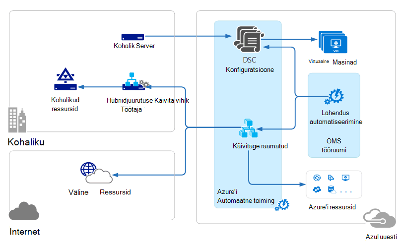

<properties 
   pageTitle="Toimingute haldus komplekti (OMS) arhitektuur | Microsoft Azure'i"
   description="Microsoft toimingute komplekti (OMS) on Microsofti pilvepõhise IT lahendus, mis aitab hallata ja kaitsta oma kohapealse ja pilveteenuse taristu.  Selles artiklis tuvastab kaasatud OMS erinevad teenused ja nende üksikasjalik sisu lingid."
   services="operations-management-suite"
   documentationCenter=""
   authors="bwren"
   manager="jwhit"
   editor="tysonn" />
<tags 
   ms.service="operations-management-suite"
   ms.devlang="na"
   ms.topic="get-started-article"
   ms.tgt_pltfrm="na"
   ms.workload="infrastructure-services"
   ms.date="10/27/2016"
   ms.author="bwren" />

# OMS arhitektuur

[Toimingute haldus komplekti (OMS)](https://azure.microsoft.com/documentation/services/operations-management-suite/) on pilvepõhist teenusekomplekt haldamise asutusesisese ja pilvepõhises keskkonnas.  Selles artiklis kirjeldatakse erinevatest asutusesisestest ja pilveteenuse komponendid OMS ja nende kõrge taseme cloud arvuti arhitektuur.  Leiate täpsemat teavet iga teenuse dokumentatsioonist.

## Log Analytics

[Log](https://azure.microsoft.com/documentation/services/log-analytics/) Analytics kogutud kõik andmed on salvestatud OMS hoidlas, mis on majutatud Azure.  Ühendatud andmeallikate luua hoidlasse OMS kogutud andmete.  Praegu on kolme tüüpi ühendatud allikad, mis on toetatud.

- [Windowsi](../log-analytics/log-analytics-windows-agents.md) või [Linuxi](../log-analytics/log-analytics-linux-agents.md) arvutisse installitud agenti ühendatud otse OMS.
- On süsteemi Center toimingute Manager (SCOM) halduse rühma [Log Analytics ühendatud](../log-analytics/log-analytics-om-agents.md) .  SCOM agentide jätkuvalt management serverid, mis edastada sündmused ja tulemustega seotud andmete Log Analytics suhelda.
- [Azure storage konto](../log-analytics/log-analytics-azure-storage.md) , mis kogub töötaja roll, web rolli või virtuaalse masina Azure'i [Azure diagnostika](../cloud-services/cloud-services-dotnet-diagnostics.md) andmed.

Andmeallikate määratleda Log Analytics kogub sündmuselogide ja jõudluse hinnale ühendatud allikatest pärit andmeid.  Lahenduste lisada funktsioone OMS ja saab hõlpsasti lisada oma tööruumi [OMS lahendusegaleriisse](../log-analytics/log-analytics-add-solutions.md).  Mõned lahendused võivad nõuda otse abil Log Analytics SCOM agentide aga võib vajavad täiendavad agent olema installitud.

Log Analytics on veebipõhine portaal, mille abil saate hallata OMS ressursid, lisamine ja konfigureerimine OMS lahendusi, vaadata ja OMS hoidla andmete analüüsiks.

## Azure'i automatiseerimine

[Azure'i automaatika tegevusraamatud](http://azure.microsoft.com/documentation/services/automation) täidetakse Azure'i pilves ja ressursse, mis on Azure muude cloud Services või puuetega inimestele juurdepääsetavate avalike Interneti kaudu pääsete juurde.  Kohalikud andmed keskuses kasutamine [Hü Käitusjuhendi töötaja](../automation/automation-hybrid-runbook-worker.md) tegevusraamatud pääseks juurde kohalikud ressursid saate määrata ka kohapealse masinad.

Azure'i virtuaalmasinates saab otse rakendada [DSC konfiguratsioone](../automation/automation-dsc-overview.md) talletatud Azure automatiseerimine.  Muud füüsilise ja virtuaalmasinates saate taotleda konfiguratsioone Azure automatiseerimine DSC pull serverist.

Azure'i automaatika on OMS lahenduse, kuvatakse statistika ja linke, mis tahes toimingute Azure portaali käivitamiseks.

## Azure'i varukoopiad

Varukoopiate hoidla kindla geograafilise piirkonnas on salvestatud kaitstud andmete [Azure varukoopia](http://azure.microsoft.com/documentation/services/backup) .  Andmed on kopeeritud samasse piirkonda ja ka võib sõltuvalt vault, mõne muu piirkonna jaoks põhjalikumaks koondamise paljundada.

Azure'i varukoopiad on kolm olulise stsenaariumi.

- Windows Azure'i varundus agent masina.  See võimaldab teil varukoopia faile ja kaustu Windows server või kliendi otse oma Azure varukoopiate hoidla.  
- System Center andmete kaitse Manager (DPM) või Microsoft Azure varukoopia serverisse. See võimaldab teil ära kasutada DPM või Microsoft Azure varukoopia Serveri varundada faile ja kaustu Lisaks rakenduse töökoormus nagu SQL-i ja SharePointi kohaliku mäluruumi ja seejärel oma Azure varukoopiate hoidla korrata.
- Azure virtuaalse masina laiendid.  See võimaldab teil varundada Azure'i virtuaalmasinates, et teie Azure varukoopiate hoidla.

Azure'i varukoopiad on OMS lahenduse, kuvatakse statistika ja linke, mis tahes toimingute Azure portaali käivitamiseks.

## Azure'i saidi taastamine

[Azure'i saidi taastamine](http://azure.microsoft.com/documentation/services/site-recovery) orchestrates dispersioonanalüüs, Tõrkesiirde ja failback virtuaalmasinates ja füüsilise serveri. Andmete kopeerimine vahetatakse Hyper-V hosts, VMware hypervisors ja füüsilise serveri esmaseid ja teiseseid andmekeskuste või andmekeskuse ja Azure salvestusruumi vahel.  Saidi taastamine salvestab metaandmete võlvid asub kindla geograafilise Azure piirkond. Kopeeritud andmed talletatakse teenuse saidi taastamine.

Azure'i saidi taastamine on kolm olulise dispersioonanalüüs stsenaariumi.

**Hyper-V virtuaalmasinates kopeerimine**
- Kui Hyper-V virtuaalmasinates hallatakse VMM pilved, saate kopeerida, teisene andmekeskuse või Azure salvestusruumi.  Kopeerimine Azure on turvaline Interneti-ühenduse kaudu.  Kopeerimine teisene andmekeskusesse on kohtvõrgu.
- Kui Hyper-V virtuaalmasinates pole haldab VMM, saab paljundada ainult Azure salvestusruumi.  Kopeerimine Azure on turvaline Interneti-ühenduse kaudu.
 
**VMWare virtuaalmasinates kopeerimine**
- VMware virtuaalmasinates saate korrata, teisene andmekeskuses, töötab VMware või Azure salvestusruumi.  Azure'i dispersioonanalüüs võib juhtuda-saidilt VPN-või Azure'i ExpressRoute või turvalist Interneti-ühenduse kaudu. Teisene andmekeskusesse dispersioonanalüüs ilmneb üle andmekanali InMage otsima.
 
**Füüsilise Windows ja Linux serverite dispersioonanalüüs** 
- Füüsilise serveri saate korrata, teisene andmekeskuse või Azure salvestusruumi. Azure'i dispersioonanalüüs võib juhtuda-saidilt VPN-või Azure'i ExpressRoute või turvalist Interneti-ühenduse kaudu. Teisene andmekeskusesse dispersioonanalüüs ilmneb üle andmekanali InMage otsima.  Azure'i saidi taastamine on OMS lahenduse, mis kuvatakse mõned statistika, kuid mis tahes toimingute jaoks peate kasutama Azure portaali.

## Järgmised sammud

- Lisateavet [Log Kasutusanalüüsi](http://azure.microsoft.com/documentation/services/log-analytics).
- Lisateavet [Azure automatiseerimine](https://azure.microsoft.com/documentation/services/automation).
- Lisateavet [Azure'i varukoopiad](http://azure.microsoft.com/documentation/services/backup).
- Lisateavet [Azure'i saidi taastamine](http://azure.microsoft.com/documentation/services/site-recovery).
