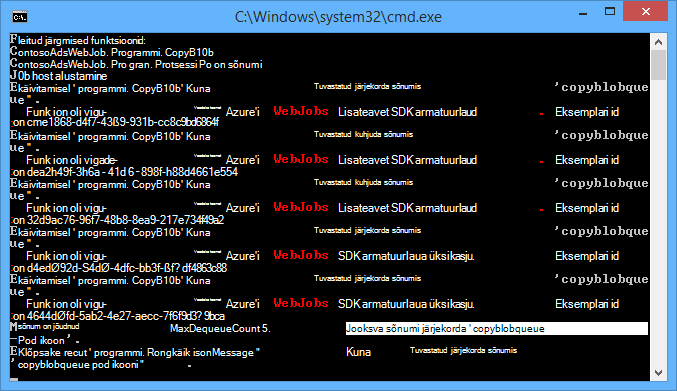
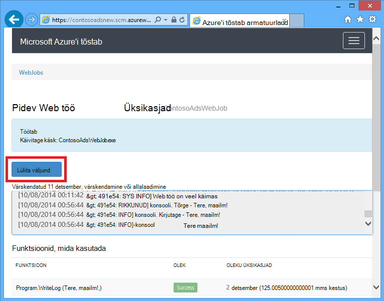
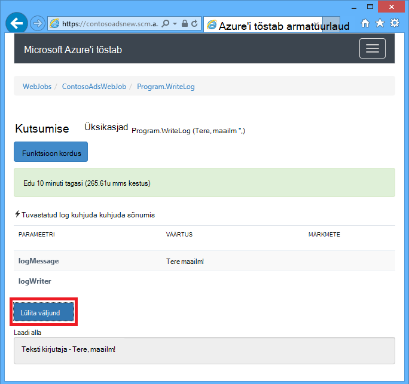
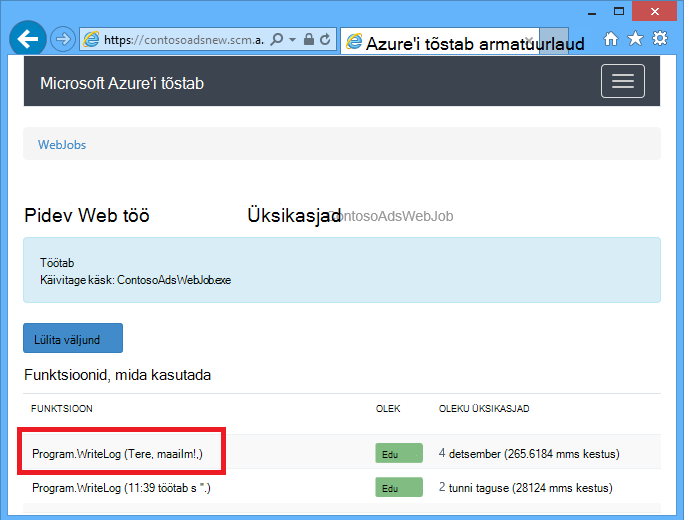
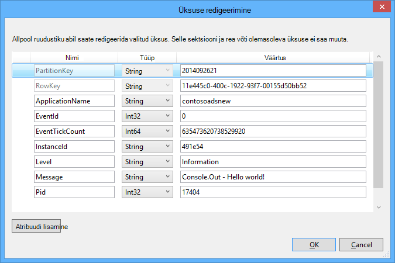
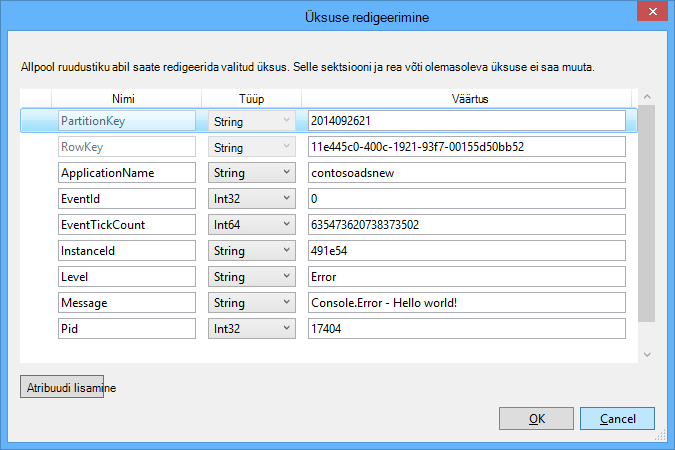

<properties
    pageTitle="Alustamine järjekorda salvestusruumi ja Visual Studio ühendatud teenused (WebJob projektid) | Microsoft Azure'i"
    description="Kuidas alustada Azure'i järjekorda mäluruumi kasutamine WebJob projekti pärast salvestusruumi Visual Studio abil kontoga ühenduse ühendatud teenused."
    services="storage"
    documentationCenter=""
    authors="TomArcher"
    manager="douge"
    editor=""/>

<tags
    ms.service="storage"
    ms.workload="web"
    ms.tgt_pltfrm="vs-getting-started"
    ms.devlang="na"
    ms.topic="article"
    ms.date="07/18/2016"
    ms.author="tarcher"/>

# Alustamine: Azure'i järjekorda salvestusruumi ja Visual Studio ühendatud teenused (WebJob projektid)

[AZURE.INCLUDE [storage-try-azure-tools-queues](../../includes/storage-try-azure-tools-queues.md)]

## Ülevaade

Selles artiklis kirjeldatakse, kuidas kasutamise alustamine Azure'i järjekorda salvestusruumi rakenduses Visual Studio Azure'i WebJob projekti, kui olete loonud või Visual Studio **Ühendatud teenuste lisamine** dialoogiboksis konto Azure storage viidatud. Salvestusruumi konto lisamisel Visual Studio **Ühendatud teenuste lisamine** dialoogiboksi kaudu WebJob projekti vastav Azure'i salvestusruumi Nugeti paketid on installitud, vastavad .net-i viited lisatakse projekti ja ühendusstringi salvestusruumi konto on värskendatud App.config faili.  

Selles artiklis on toodud C# koodi näidised, mis näitab, kuidas kasutada Azure WebJobs SDK versioon 1.x teenusega Azure'i järjekorda salvestusruumi.

Azure'i järjekorda salvestusruumi on teenus hoidke ühiskaustas palju sõnumeid, millele pääseb juurde kõikjalt maailmas autenditud telefonikõned HTTP- või HTTPS-i kaudu. Ühe järjekorda sõnumi võib olla kuni 64 KB suurust ja järjekorda võib sisaldada miljonite sõnumitega salvestusruumi konto koguvõimsus ulatuses. Lisateavet leiate [Azure'i järjekorda salvestusruumi kasutades .net-i kasutamise alustamine](storage-dotnet-how-to-use-queues.md) . ASP.net-i kohta leiate lisateavet teemast [ASP.net-i](http://www.asp.net).

## Kuidas funktsiooni käivitamiseks järjekorda sõnumi saabumisel

Kasutage funktsiooni WebJobs SDK kõned järjekorda sõnumi saabumisel kirjutamiseks **QueueTrigger** atribuuti. Atribuut ehitaja võtab stringi parameeter, mis määrab nime kuhjuda küsitlus. Kui soovite teada, kuidas määrata järjekorra nimi dünaamiliselt, lugege teemat [Kuidas konfiguratsiooni suvandite määramine](#how-to-set-configuration-options).

### Stringi järjekorda sõnumid

Järgmises näites kuhjuda sisaldab stringi sõnumile **QueueTrigger** rakendatakse stringi parameeter nimega **logMessage** , mis sisaldab järjekorda sõnumi sisu. Selle funktsiooni [kirjutab log sõnumi armatuurlaud](#how-to-write-logs).

        public static void ProcessQueueMessage([QueueTrigger("logqueue")] string logMessage, TextWriter logger)
        {
            logger.WriteLine(logMessage);
        }

Lisaks **stringi**, võib parameetri baitide massiivis, **CloudQueueMessage** objekti või POCO, et määratleda.

### POCO [(tavaline vana CLR-i objekti](http://en.wikipedia.org/wiki/Plain_Old_CLR_Object)) sõnumite järjekord

Järgmises näites sisaldab järjekorda sõnumi JSON **BlobInformation** objekti, mis sisaldab **BlobName** atribuuti. SDK deserializes automaatselt objekti.

        public static void WriteLogPOCO([QueueTrigger("logqueue")] BlobInformation blobInfo, TextWriter logger)
        {
            logger.WriteLine("Queue message refers to blob: " + blobInfo.BlobName);
        }

SDK kasutab [Newtonsoft.Json Nugeti pakett](http://www.nuget.org/packages/Newtonsoft.Json) serialiseerida ja andmeatribuutide sõnumeid. Kui loote programmis, mis ei kasuta WebJobs SDK järjekorda sõnumeid, saate kirjutada koodi, nagu järgmises näites POCO järjekorda sõnumi SDK saab sõeluda loomiseks.

        BlobInformation blobInfo = new BlobInformation() { BlobName = "log.txt" };
        var queueMessage = new CloudQueueMessage(JsonConvert.SerializeObject(blobInfo));
        logQueue.AddMessage(queueMessage);

### Asünkroonse funktsioonid

Kuvatakse järgmised asünkroonse funktsioon [kirjutab Logi armatuurlaud](#how-to-write-logs).

        public async static Task ProcessQueueMessageAsync([QueueTrigger("logqueue")] string logMessage, TextWriter logger)
        {
            await logger.WriteLineAsync(logMessage);
        }

Asünkroonse funktsioonid võib kuluda [loobumise luba](http://www.asp.net/mvc/overview/performance/using-asynchronous-methods-in-aspnet-mvc-4#CancelToken), nagu on näidatud järgmises näites, mis on bloobimälu kopeeritakse. (Selgitused selle kohatäite **queueTrigger** , jaotisest [plekid](#how-to-read-and-write-blobs-and-tables-while-processing-a-queue-message) .)

        public async static Task ProcessQueueMessageAsyncCancellationToken(
            [QueueTrigger("blobcopyqueue")] string blobName,
            [Blob("textblobs/{queueTrigger}",FileAccess.Read)] Stream blobInput,
            [Blob("textblobs/{queueTrigger}-new",FileAccess.Write)] Stream blobOutput,
            CancellationToken token)
        {
            await blobInput.CopyToAsync(blobOutput, 4096, token);
        }

## Atribuut QueueTrigger töötab koos tüübid

Saate **QueueTrigger** järgmist tüüpi:

* **string**
* Kui JSON seeriasertide POCO tüüp
* **byte]**
* **CloudQueueMessage**

## Küsitlused algoritmi

SDK rakendab on juhusliku eksponentsiaalse tagasi välja algoritmi jõude järjekorda küsitlused salvestusruumi tehingu kulude mõju vähendada.  Kui sõnum on leitud, SDK ootab kaks sekundit ja seejärel kontrollimise teise sõnumi; Kui leitakse teadet selle ootab umbes neli sekundit enne uuesti. Pärast nurjunud edasiste katsete järjekorda teade, et, ajal jätkuvalt suurendada, kuni see jõuab maksimaalne ootama aega, mis on vaikimisi üks minut. [Suurim lubatud ajal on konfigureeritav](#how-to-set-configuration-options).

## Mitmes eksemplaris

Kui teie web app töötab mitmes eksemplaris, pidev WebJobs töötab igas arvutis, ja igas arvutis, kuvatakse oodata päästikute ja proovite käitada funktsioonid. Mõnel juhul võib see põhjustada mõned funktsioonid samad andmed kaks korda töötlemine nii funktsioonid tuleks idempotent (kirjutatud nii, et kutsudes neid korduvalt sama sisendandmete ei tulemusi dubleeritud).  

## Paralleelne

Kui teil on mitme eri järjekordadesse listening funktsioone, SDK kutsuvad neid samal ajal kui saadetud meilisõnumid korraga.

Sama kehtib, kui ühe järjekorra saadetud mitme meilisõnumid. Vaikimisi SDK paketi 16 järjekorda sõnumeid saab korraga ja käivitab funktsiooni, mis töötleb neid samal ajal. [Paketi maht on konfigureeritav](#how-to-set-configuration-options). Kui arvu, et töödelda saab poole paketi suurus, SDK saab teise paketi ja käivitab nende sõnumite töötlemist. Samaaegseid sõnumite kohta funktsioon töödelda maksimumarv on seega poolteist korda paketi suurus. See piirang kehtib eraldi iga funktsiooni, mis on atribuut **QueueTrigger** . Kui te ei soovi paralleelne ühe järjekorra saadud sõnumeid, määrata paketi suurus 1.

## Saada järjekorda või järjekorda sõnumi metaandmed

Saate oma sõnumi järgmised atribuudid, lisades parameetrite meetodit allkirja.

* **DateTimeOffset** expirationTime
* **DateTimeOffset** insertionTime
* **DateTimeOffset** nextVisibleTime
* **stringi** queueTrigger (sisaldab sõnumi tekst)
* **stringi** id
* **stringi** popReceipt
* **int** dequeueCount

Kui soovite töötada otse Azure storage API, saate lisada ka **CloudStorageAccount** parameeter.

Järgmises näites kirjutab kõik selle metaandmete soovitud teave rakenduse Logi. Näites nii logMessage ja queueTrigger sisaldavad järjekorda sõnumi sisu.

        public static void WriteLog([QueueTrigger("logqueue")] string logMessage,
            DateTimeOffset expirationTime,
            DateTimeOffset insertionTime,
            DateTimeOffset nextVisibleTime,
            string id,
            string popReceipt,
            int dequeueCount,
            string queueTrigger,
            CloudStorageAccount cloudStorageAccount,
            TextWriter logger)
        {
            logger.WriteLine(
                "logMessage={0}\n" +
            "expirationTime={1}\ninsertionTime={2}\n" +
                "nextVisibleTime={3}\n" +
                "id={4}\npopReceipt={5}\ndequeueCount={6}\n" +
                "queue endpoint={7} queueTrigger={8}",
                logMessage, expirationTime,
                insertionTime,
                nextVisibleTime, id,
                popReceipt, dequeueCount,
                cloudStorageAccount.QueueEndpoint,
                queueTrigger);
        }

Siin on näide samamoodi kirjutanud proovi kood:

        logMessage=Hello world!
        expirationTime=10/14/2014 10:31:04 PM +00:00
        insertionTime=10/7/2014 10:31:04 PM +00:00
        nextVisibleTime=10/7/2014 10:41:23 PM +00:00
        id=262e49cd-26d3-4303-ae88-33baf8796d91
        popReceipt=AgAAAAMAAAAAAAAAfc9H0n/izwE=
        dequeueCount=1
        queue endpoint=https://contosoads.queue.core.windows.net/
        queueTrigger=Hello world!

## Graatsiline sulgemine

Funktsioon, mis töötab pidev WebJob aktsepteerida **CancellationToken** parameeter, mis võimaldab operatsioonisüsteemi funktsiooni teavitada, kui selle WebJob on lõpetada. See teatis abil saate veenduge, et funktsioon ei nii, et jäetakse andmed vastuolu ootamatult lõpetada.

Järgmises näites kujutatakse eelseisva WebJob lõpetamise funktsiooni kontrollida.

    public static void GracefulShutdownDemo(
                [QueueTrigger("inputqueue")] string inputText,
                TextWriter logger,
                CancellationToken token)
    {
        for (int i = 0; i < 100; i++)
        {
            if (token.IsCancellationRequested)
            {
                logger.WriteLine("Function was cancelled at iteration {0}", i);
                break;
            }
            Thread.Sleep(1000);
            logger.WriteLine("Normal processing for queue message={0}", inputText);
        }
    }

**Märkus:** Armatuurlaua võidakse kuvada õigesti, oleku ja väljundi funktsioone, mis on sulgeda.

Lisateavet leiate teemast [WebJobs graatsiline sulgumist](http://blog.amitapple.com/post/2014/05/webjobs-graceful-shutdown/#.VCt1GXl0wpR).   

## Kuidas luua järjekorda sõnumi järjekorda sõnumi töötlemise ajal

Funktsioon, mis loob uue järjekorda sõnumi kirjutamiseks kasutage atribuuti **järjekorda** . **QueueTrigger**, nagu te kaotate järjekorra nimi stringina või saate [määrata dünaamiliselt järjekorra nimi](#how-to-set-configuration-options).

### Stringi järjekorda sõnumid

Järgmine kood näidis asünkroonse loob uue sõnumi järjekorda nimega "outputqueue" sama sisuga saanud nimega "inputqueue" järjekorras kuhjuda sõnumina järjekorda. (Asünkroonse funktsioonide kasutamiseks **IAsyncCollector<T> ** nagu on näidatud selles jaotises allpool.)

        public static void CreateQueueMessage(
            [QueueTrigger("inputqueue")] string queueMessage,
            [Queue("outputqueue")] out string outputQueueMessage )
        {
            outputQueueMessage = queueMessage;
        }

### POCO [(tavaline vana CLR-i objekti](http://en.wikipedia.org/wiki/Plain_Old_CLR_Object)) sõnumite järjekord

Luua järjekorda sõnum, mis sisaldab soovitud POCO asemel tekstistring, läheb POCO tüüp on väljundi parameetrina **järjekorda** atribuut ehitaja.

        public static void CreateQueueMessage(
            [QueueTrigger("inputqueue")] BlobInformation blobInfoInput,
            [Queue("outputqueue")] out BlobInformation blobInfoOutput )
        {
            blobInfoOutput = blobInfoInput;
        }

SDK serializes automaatselt JSON objekti. Sõnumi järjekorda luuakse alati, isegi juhul, kui objekt on tühi.

### Mitme meilisõnumi loomine või asünkroonse funktsioonid

Mitme sõnumi koostamiseks tehke parameetri tüüp väljundi järjekorra **ICollector<T> ** või **IAsyncCollector<T>**, nagu on näidatud järgmises näites.

        public static void CreateQueueMessages(
            [QueueTrigger("inputqueue")] string queueMessage,
            [Queue("outputqueue")] ICollector<string> outputQueueMessage,
            TextWriter logger)
        {
            logger.WriteLine("Creating 2 messages in outputqueue");
            outputQueueMessage.Add(queueMessage + "1");
            outputQueueMessage.Add(queueMessage + "2");
        }

Iga sõnumi järjekorda luuakse kohe, kui **Lisa** meetodit nimetatakse.

### Atribuut järjekorda opsüsteemiga tüübid

Järgmiste parameetrite puhul saate kasutada **järjekorda** atribuuti.

* **välja string** (kui parameetri väärtus on tühi, funktsioon lõppemisel loob järjekorda sõnumi)
* **välja byte]** (toimib nagu **stringi**)
* **välja CloudQueueMessage** (toimib nagu **stringi**)
* **välja POCO** (sarjadesse jaotatav tüüp, loob sõnumi null objekti kui selle paramter on null, funktsioon lõppemisel)
* **ICollector**
* **IAsyncCollector**
* **CloudQueue** (sõnumite käsitsi loomise abil Azure Storage API otse)

### Kasutage funktsiooni kehas WebJobs SDK atribuudid

Kui teil on vaja teha mõned tööd oma funktsiooni enne WebJobs SDK atribuut, nt **järjekorda**, **bloobimälu**või **tabeli**abil saate **IBinder** kasutajaliidese.

Järgmises näites võtab meilisõnumi Sisestuskeel kuhjuda ja loob uue sõnumi, millel on sama sisu ja väljundi. Väljundi järjekorra nimi on määratud koodi funktsiooni kehas.

        public static void CreateQueueMessage(
            [QueueTrigger("inputqueue")] string queueMessage,
            IBinder binder)
        {
            string outputQueueName = "outputqueue" + DateTime.Now.Month.ToString();
            QueueAttribute queueAttribute = new QueueAttribute(outputQueueName);
            CloudQueue outputQueue = binder.Bind<CloudQueue>(queueAttribute);
            outputQueue.AddMessage(new CloudQueueMessage(queueMessage));
        }

**IBinder** kasutajaliidese saate kasutada ka **tabeli** ja **bloobimälu** atribuutidega.

## Kuidas lugeda ja kirjutada plekid ja tabelite järjekorda sõnumi töötlemise ajal

**Bloobimälu** ja **tabeli** atribuudid võimaldavad teil lugeda ja kirjutada plekid ja tabeleid. Selles jaotises näidised rakendada plekid. Koodinäiteid, mis näitab, kuidas, mis käivitab protsessid plekid on loodud või värskendatud, vaadake, [Kuidas kasutada Azure'i bloobimälu WebJobs SDK](../app-service-web/websites-dotnet-webjobs-sdk-storage-blobs-how-to.md)ja koodinäiteid, mille lugemine ja kirjutamine tabelid, leiate [Azure'i tabelimälu WebJobs SDK kasutamise kohta](../app-service-web/websites-dotnet-webjobs-sdk-storage-tables-how-to.md).

### Stringi järjekorda sõnumite käivitamise bloobimälu toimingud

**QueueTrigger** on järjekorra sõnum, mis sisaldab stringi, saate kasutada atribuuti **bloobimälu** **blobPath** parameeter, mis sisaldab sõnumi sisu kohatäide.

Järgmises näites kasutatakse **voo** objektide lugeda ja kirjutada plekid. Järjekorra sõnum on nimi on bloobimälu asub textblobs ümbrises. Koopia bloobimälu koos "-uus" lisatud nimi luuakse samasse container.

        public static void ProcessQueueMessage(
            [QueueTrigger("blobcopyqueue")] string blobName,
            [Blob("textblobs/{queueTrigger}",FileAccess.Read)] Stream blobInput,
            [Blob("textblobs/{queueTrigger}-new",FileAccess.Write)] Stream blobOutput)
        {
            blobInput.CopyTo(blobOutput, 4096);
        }

Atribuut **bloobimälu** ehitaja võtab **blobPath** parameeter, mis määrab container ja bloobimälu nimi. Lisateavet selle kohatäite leiate [Azure'i bloobimälu WebJobs SDK kasutamise kohta](../app-service-web/websites-dotnet-webjobs-sdk-storage-blobs-how-to.md).

Kui atribuut kaunistab **voo** objekti, määrab teise konstruktori parameeter **FileAccess** režiimi lugemine, kirjutamine või lugemis-ja kirjutamisõigusega.

Järgmises näites kasutatakse **CloudBlockBlob** objekti kustutamiseks on bloobimälu. Järjekorra sõnum on selle bloobimälu nime.

        public static void DeleteBlob(
            [QueueTrigger("deleteblobqueue")] string blobName,
            [Blob("textblobs/{queueTrigger}")] CloudBlockBlob blobToDelete)
        {
            blobToDelete.Delete();
        }

### POCO [(tavaline vana CLR-i objekti](http://en.wikipedia.org/wiki/Plain_Old_CLR_Object)) sõnumite järjekord

POCO, mis salvestatud JSON järjekorda sõnumis, kasutage kohatäited selle nime objekti atribuutide **järjekorda** atribuut **blobPath** parameeter. Samuti saate järjekorda metaandmete atribuutide nimesid kohatäidetena. Lugege teemat [järjekorda või järjekorda sõnumi metaandmete](#get-queue-or-queue-message-metadata).

Järgmises näites on bloobimälu kopeerib uue bloobimälu erineva laiendiga. Järjekorra sõnum on **BlobInformation** objekti, mis sisaldab **BlobName** ja **BlobNameWithoutExtension** atribuudid. Atribuutide nimesid kasutatakse kohatäidetena bloobimälu tee **bloobimälu** atribuute.

        public static void CopyBlobPOCO(
            [QueueTrigger("copyblobqueue")] BlobInformation blobInfo,
            [Blob("textblobs/{BlobName}", FileAccess.Read)] Stream blobInput,
            [Blob("textblobs/{BlobNameWithoutExtension}.txt", FileAccess.Write)] Stream blobOutput)
        {
            blobInput.CopyTo(blobOutput, 4096);
        }

SDK kasutab [Newtonsoft.Json Nugeti pakett](http://www.nuget.org/packages/Newtonsoft.Json) serialiseerida ja andmeatribuutide sõnumeid. Kui loote programmis, mis ei kasuta WebJobs SDK järjekorda sõnumeid, saate kirjutada koodi, nagu järgmises näites POCO järjekorda sõnumi SDK saab sõeluda loomiseks.

        BlobInformation blobInfo = new BlobInformation() { BlobName = "boot.log", BlobNameWithoutExtension = "boot" };
        var queueMessage = new CloudQueueMessage(JsonConvert.SerializeObject(blobInfo));
        logQueue.AddMessage(queueMessage);

Kui teil on vaja teha mõned tööd oma funktsiooni enne objekti lisamine bloobimälu sidumine, saate kasutada atribuuti kehas funktsiooni, nagu on näidatud [kasutada WebJobs SDK atribuute funktsiooni kehas](#use-webjobs-sdk-attributes-in-the-body-of-a-function).

###Saate kasutada atribuuti bloobimälu tüübid

Atribuut **bloobimälu** saab kasutada järgmist tüüpi:

* **Voo** (lugeda või kirjutada, kasutades parameetrit FileAccess ehitaja määratud)
* **TextWriterit**
* **TextWriterit**
* **string** (lugege)
* **välja string** (kirjutamine; loob mõne bloobimälu ainult siis, kui päringustringi parameetri on tühi, tagastab funktsioon)
* POCO (vt)
* välja POCO (kirjutamine; alati loob mõne bloobimälu, loob null objektina, kui parameeter POCO on null, tagastab funktsioon)
* **CloudBlobStream** (kirjutada)
* **ICloudBlob** (lugeda või kirjutada)
* **CloudBlockBlob** (lugeda või kirjutada)
* **CloudPageBlob** (lugeda või kirjutada)

##Mürki sõnumite reageerimine

Sõnumid, mille sisu põhjustab nurjumise funktsiooni nimetatakse *mürki sõnumeid*. Kui funktsioon nurjub, järjekorra sõnum on kustutatud ja lõpuks on peale uuesti, põhjustades tsükli korrata. SDK saab automaatselt katkestada pärast iteratsiooni teatud tsükkel või saate seda teha käsitsi.

### Sõnumite automaatse mürki töötlemine

SDK helistavad koosolekule funktsiooni 5 korda järjekorda sõnumi töötlemine. Viienda proovige nurjumisel sõnum mürki järjekorda. Saate vaadata konfigureerimise korduskatsed maksimumarv [konfiguratsiooni suvandite häälestamise](#how-to-set-configuration-options)kohta.

Mürki kuhjuda nimega *{originalqueuename}*-mürki. Saate kirjutada funktsiooni protsessi sõnumeid kaudu mürki kuhjuda logimine neid või teade selle käsitsi tähelepanu on vajalik.

Järgmises näites **CopyBlob** funktsioon nurjub, kui järjekorda sõnum sisaldab nime bloobimälu, mida pole olemas. Sel juhul sõnum: copyblobqueue järjekorda copyblobqueue-mürki järjekorda. Seejärel logib **ProcessPoisonMessage** mürki sõnum.

        public static void CopyBlob(
            [QueueTrigger("copyblobqueue")] string blobName,
            [Blob("textblobs/{queueTrigger}", FileAccess.Read)] Stream blobInput,
            [Blob("textblobs/{queueTrigger}-new", FileAccess.Write)] Stream blobOutput)
        {
            blobInput.CopyTo(blobOutput, 4096);
        }

        public static void ProcessPoisonMessage(
            [QueueTrigger("copyblobqueue-poison")] string blobName, TextWriter logger)
        {
            logger.WriteLine("Failed to copy blob, name=" + blobName);
        }

Järgmisel joonisel on need funktsioonid konsooli väljund kui mürki sõnumi töötlemise.

### Käsitsi mürki sõnumite töötlemine

Saate mitu korda on sõnumi peale töötlemiseks, lisades on nimega **dequeueCount** oma funktsiooni **int** parameeter. Saate kontrollida dequeue count funktsioon koodi ja tehke oma mürki sõnumite töötlemise kui arv ületab läve, nagu on näidatud järgmises näites.

        public static void CopyBlob(
            [QueueTrigger("copyblobqueue")] string blobName, int dequeueCount,
            [Blob("textblobs/{queueTrigger}", FileAccess.Read)] Stream blobInput,
            [Blob("textblobs/{queueTrigger}-new", FileAccess.Write)] Stream blobOutput,
            TextWriter logger)
        {
            if (dequeueCount > 3)
            {
                logger.WriteLine("Failed to copy blob, name=" + blobName);
            }
            else
            {
            blobInput.CopyTo(blobOutput, 4096);
            }
        }

## Kuidas konfiguratsiooni suvandite määramine

**JobHostConfiguration** tüübi abil saate määrata konfiguratsiooni järgmised suvandid:

* Saate seada SDK ühendusstringi kood.
* Konfigureerimine **QueueTrigger** dequeue sätteid, nt maksimaalne arv.
* Saada järjekorda nimed konfigureerimine.

###Koodi SDK ühendusstringi määramine

Määramise SDK ühendusstringi kood võimaldab teil kasutada oma stringi nimede failid või keskkonna muutujate, nagu on näidatud järgmises näites.

        static void Main(string[] args)
        {
            var _storageConn = ConfigurationManager
                .ConnectionStrings["MyStorageConnection"].ConnectionString;

            var _dashboardConn = ConfigurationManager
                .ConnectionStrings["MyDashboardConnection"].ConnectionString;

            var _serviceBusConn = ConfigurationManager
                .ConnectionStrings["MyServiceBusConnection"].ConnectionString;

            JobHostConfiguration config = new JobHostConfiguration();
            config.StorageConnectionString = _storageConn;
            config.DashboardConnectionString = _dashboardConn;
            config.ServiceBusConnectionString = _serviceBusConn;
            JobHost host = new JobHost(config);
            host.RunAndBlock();
        }

### QueueTrigger sätete konfigureerimine

Saate konfigureerida selle sõnumi töötlemine rakenduvad järgmised sätted.

- Järjekorda sõnumid, mis on peale korraga samal ajal käivituma maksimumarv (vaikimisi 16).
- Korduskatsed enne järjekorda sõnumi saatmist mürki järjekorda suurima arvu (vaikimisi on 5).
- Maksimumväärtus oodake enne küsitlused uuesti, kui järjekord on tühi (vaikeväärtus on 1 minutid).

Järgmises näites kirjeldatakse, kuidas nende sätete konfigureerimiseks.

        static void Main(string[] args)
        {
            JobHostConfiguration config = new JobHostConfiguration();
            config.Queues.BatchSize = 8;
            config.Queues.MaxDequeueCount = 4;
            config.Queues.MaxPollingInterval = TimeSpan.FromSeconds(15);
            JobHost host = new JobHost(config);
            host.RunAndBlock();
        }

### Seada väärtusi WebJobs SDK ehitaja parameetrite kood

Vahel soovite määrata järjekorra nimi, bloobimälu nime või container või tabeli nimi kood, mitte suur-kood. Näiteks võite määrata järjekorra nimi **QueueTrigger** konfiguratsiooni faili või keskkonna muutujana.

Saate seda teha mille **NameResolver** objekti **JobHostConfiguration** tüüp. Kaasate teisiti kohatäidete ümbritsetud WebJobs SDK atribuut ehitaja parameetrid % märgid ja oma **NameResolver** koodi määrab tegelike väärtuste asemel nende kohatäidete kasutada.

Oletame näiteks, et soovite kasutada nimega logqueuetest testi keskkonnas ja ühe nimega logqueueprod valmistamisel järjekorda. Asemel kõva kodeeritud järjekorra nimi, mida soovite määrata kirje nimi **appSettings** saidikogumi, et oleks tegelik järjekorra nimi. Kui **appSettings** on logqueue, võib teie funktsiooni näevad välja nagu järgmises näites.

        public static void WriteLog([QueueTrigger("%logqueue%")] string logMessage)
        {
            Console.WriteLine(logMessage);
        }

Seejärel võiks **NameResolver** tunni saada **appSettings** järjekorra nimi, nagu on näidatud järgmises näites:

        public class QueueNameResolver : INameResolver
        {
            public string Resolve(string name)
            {
                return ConfigurationManager.AppSettings[name].ToString();
            }
        }

Te kaotate **NameResolver** klassi **JobHost** objekti, nagu on näidatud järgmises näites.

        static void Main(string[] args)
        {
            JobHostConfiguration config = new JobHostConfiguration();
            config.NameResolver = new QueueNameResolver();
            JobHost host = new JobHost(config);
            host.RunAndBlock();
        }

**Märkus:** Järjekorda, tabeli ja bloobimälu nimed lahendatakse iga kord, kui nimetatakse funktsiooni, kuid bloobimälu container nimed lahendatakse ainult siis, kui käivitub. Bloobimälu container nime ei saa muuta, kui töö töötab.

## Kuidas funktsiooni käsitsi käivitamine

Funktsiooni käsitsi käivitamiseks kasutage **kõne** või **CallAsync** meetodit **JobHost** objekti ja **NoAutomaticTrigger** atribuut funktsioonile, nagu on näidatud järgmises näites.

        public class Program
        {
            static void Main(string[] args)
            {
                JobHost host = new JobHost();
                host.Call(typeof(Program).GetMethod("CreateQueueMessage"), new { value = "Hello world!" });
            }

            [NoAutomaticTrigger]
            public static void CreateQueueMessage(
                TextWriter logger,
                string value,
                [Queue("outputqueue")] out string message)
            {
                message = value;
                logger.WriteLine("Creating queue message: ", message);
            }
        }

## Kuidas kirjutada logid

Armatuurlaual logid kahes kohas: lehel soovitud WebJob ja kindla WebJob kutsumise leht.

Konsooli viise, mida helistate funktsiooni või **Main()** meetodit väljund kuvatakse Armatuurlaua leht on WebJob, mitte kindla meetod kutsumise leht. TextWriterit objekt, mille saate parameetri signatuuri meetodit väljund kuvatakse meetod kutsumise Armatuurlaua leht.

Konsooli väljundi ei saa teatud meetod kutsumise lingitud, kuna konsooli on ühelõimelised, kui palju tööd funktsioonid võivad töötada samal ajal. Sellepärast SDK pakub iga funktsioon kutsumise kordumatu log kirjutaja omaette objektiga.

Kirjutage [logid jälgimine](web-sites-dotnet-troubleshoot-visual-studio.md#logsoverview), kasutage **Console.Out** (loob logid teave märgitud) ja **Console.Error** (loob logid märgitud tõrge). Teine võimalus on kasutada [Jälita või TraceSource](http://blogs.msdn.com/b/mcsuksoldev/archive/2014/09/04/adding-trace-to-azure-web-sites-and-web-jobs.aspx), mis pakub lisaks teave ja tõrge Verbose, hoiatused ja kriitiline tasemed. Web appi logifailid Azure tabelid, kuvatakse logid jälgimine või Azure plekid sõltuvalt oma Azure veebirakenduse konfigureerimise. Nagu kõik konsooli väljundi kehtib viimase 100 logid kuvatakse ka armatuurlaua lehe jaoks WebJob, mitte lehe funktsioon kutsumise jaoks.

Konsooli väljundi kuvatakse ainult siis, kui programm töötab ka Azure'i WebJob ei, kui programm töötab kohalikult armatuurlaua või mõne muu keskkonnas.

Logimise keelamiseks armatuurlaua ühendusstringi väärtuseks null. Lisateavet leiate teemast [konfiguratsiooni suvandite määramine](#how-to-set-configuration-options).

Järgmises näites on kujutatud logid kirjutamiseks mitu võimalust:

        public static void WriteLog(
            [QueueTrigger("logqueue")] string logMessage,
            TextWriter logger)
        {
            Console.WriteLine("Console.Write - " + logMessage);
            Console.Out.WriteLine("Console.Out - " + logMessage);
            Console.Error.WriteLine("Console.Error - " + logMessage);
            logger.WriteLine("TextWriter - " + logMessage);
        }

Armatuurlaual WebJobs SDK **TextWriterit** objekti väljund näitab üles, kui lähete lehele konkreetne funktsioon kutsumise jaoks ja valige **Lülita väljundi**:

Armatuurlaual WebJobs SDK väljund on viimase 100 ridade konsooli kuva üles kui minna lehele WebJob (mitte funktsioon kutsumise) jaoks ja valige **Lülita väljundi**.

Pidev WebJob, klõpsake logid ilmu/andmete/töö/pidev /*{webjobname}*/job_log.txt web appi failisüsteemis.

        [09/26/2014 21:01:13 > 491e54: INFO] Console.Write - Hello world!
        [09/26/2014 21:01:13 > 491e54: ERR ] Console.Error - Hello world!
        [09/26/2014 21:01:13 > 491e54: INFO] Console.Out - Hello world!

Mõne Azure Bloobivahemälu rakenduse logide näevad välja sellised: 2014-09-26T21:01:13,Information,contosoadsnew,491e54,635473620738373502,0,17404,17,Console.Write - Tere, maailm!, 2014-09-26T21:01:13,Error,contosoadsnew,491e54,635473620738373502,0,17404,19,Console.Error - Tere, maailm!, 2014-09-26T21:01:13,Information,contosoadsnew,491e54,635473620738529920,0,17404,17,Console.Out - Tere, maailm!,

Ja Azure tabeli **Console.Out** ja **Console.Error** logid välja nägema järgmine:

##Järgmised sammud

Selles artiklis on andnud koodinäiteid, reageerimine tavastsenaariumid töötamine Azure järjekorrad kuvavate. Azure'i WebJobs ja WebJobs SDK kasutamise kohta leiate lisateavet teemast [Azure WebJobs dokumentatsiooni ressursid](http://go.microsoft.com/fwlink/?linkid=390226).
