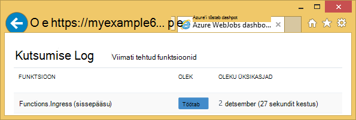
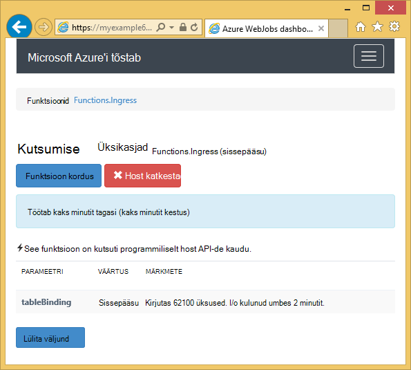
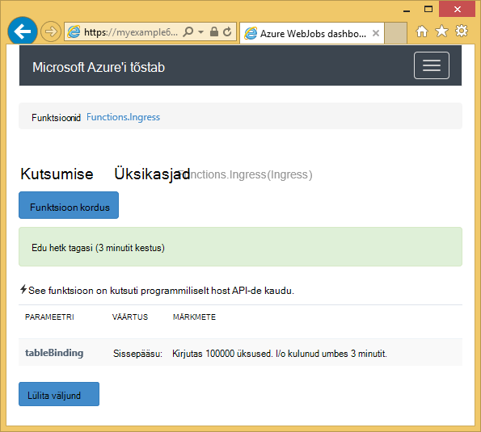

<properties
    pageTitle="Alustamine: Azure'i salvestusruumi ja Visual Studio ühendatud teenused (WebJob projektid)"
    description="Kuidas alustada, kasutades Azure'i tabelimälu Azure WebJobs Projectis Visual Studio pärast salvestusruumi Visual Studio abil kontoga ühenduse ühendatud teenused"
    services="storage"
    documentationCenter=""
    authors="TomArcher"
    manager="douge"
    editor=""/>

<tags
    ms.service="storage"
    ms.workload="web"
    ms.tgt_pltfrm="vs-getting-started"
    ms.devlang="na"
    ms.topic="article"
    ms.date="07/18/2016"
    ms.author="tarcher"/>

# Alustamine: Azure'i salvestusruumi (Azure'i WebJob projektid)

[AZURE.INCLUDE [storage-try-azure-tools-tables](../../includes/storage-try-azure-tools-tables.md)]

## Ülevaade

Selles artiklis on toodud C# koodi näidised, et kuvada näitab, kuidas kasutada Azure WebJobs SDK versioon 1.x teenusega Azure'i tabeli salvestusruumi. Proovi kood kasutada [WebJobs SDK](../app-service-web/websites-dotnet-webjobs-sdk.md) versioon 1.x.

Azure'i tabeli salvestusteenus võimaldab Liigendatud andmete talletamiseks. Teenus on NoSQL andmesalve, mida aktsepteerib autenditud kõnede ja sellest väljaspool Azure pilve. Azure'i tabelid on optimaalne liigendatud, mitte relatsiooniliste andmete talletamiseks.  Lisateavet leiate [Azure'i tabelimälu kasutades .net-i kasutamise alustamine](storage-dotnet-how-to-use-tables.md#create-a-table) .

Osa selle Koodilõigud Kuva kasutatud funktsioonid, mida nimetatakse käsitsi, seega pole, kasutades ühte järgmistest päästik atribuutide **tabeli** atribuudi.

## Üksuste lisamine tabelisse

Üksuste lisamine tabelisse, kasutage selle **tabeli** atribuudi mõne **ICollector<T> ** või **IAsyncCollector<T> ** parameeter, kus **T** määrab skeemi üksused, mille soovite lisada. Atribuut ehitaja võtab päringustringi parameetri, mis määrab tabeli nimi.

Järgmine kood näidis **isiku** üksused lisatakse tabelis nimega *sissepääsu*.

        [NoAutomaticTrigger]
        public static void IngressDemo(
            [Table("Ingress")] ICollector<Person> tableBinding)
        {
            for (int i = 0; i < 100000; i++)
            {
                tableBinding.Add(
                    new Person() {
                        PartitionKey = "Test",
                        RowKey = i.ToString(),
                        Name = "Name" }
                    );
            }
        }

Tavaliselt kasutamisel **ICollector** tüüp tuleneb **TableEntity** või rakendab **ITableEntity**, kuid see ei pea. Kas järgmine **isiku** tunnid töötada eelnev **sissepääsu** meetod näidatud koodi.

        public class Person : TableEntity
        {
            public string Name { get; set; }
        }

        public class Person
        {
            public string PartitionKey { get; set; }
            public string RowKey { get; set; }
            public string Name { get; set; }
        }

Kui soovite töötada otse Azure storage API, saate lisada allkirja meetod **CloudStorageAccount** parameeter.

## Reaalajas jälgimine

Kuna sissepääsu andmefunktsioonid töötlemine sageli suuri andmemahtusid, pakub WebJobs SDK armatuurlaua reaalajas jälgimisega seotud andmed. Jaotise **Kutsumise Log** ütleb, kui funktsioon töötab endiselt.

**Kutsumise üksikasjade** lehe aruannete funktsiooni edenemist (kirjutada üksuste arv) Kuigi see töötab ja pakub teile võimalust katkestada seda.

Kui funktsioon lõpetab, **Kutsumise üksikasjade** lehe aruannete kirjutada ridade arv.

## Kuidas lugeda mitme üksuste tabelist

Tabeli lugemiseks kasutada koos **tabeli** atribuut on **IQueryable<T> ** parameeter, kus tippige **T** tuleneb **TableEntity** või rakendab **ITableEntity**.

Järgmine kood näidis loeb ja logib **sissepääsu** tabelist kõik read.

        public static void ReadTable(
            [Table("Ingress")] IQueryable<Person> tableBinding,
            TextWriter logger)
        {
            var query = from p in tableBinding select p;
            foreach (Person person in query)
            {
                logger.WriteLine("PK:{0}, RK:{1}, Name:{2}",
                    person.PartitionKey, person.RowKey, person.Name);
            }
        }

### Kuidas lugeda ühe üksuse tabelist

On kaks täiendavaid parameetreid, mis võimaldavad teil määrata partition klahvi ja klahvi rea, kui soovite siduda ühe tabeli üksusele **tabeli** atribuudi konstruktorit.

Järgmine kood näidis tabelirida **isiku** üksust sektsiooni võti ja rea väärtused järjekorda meilisõnumi põhjal on järgmine:  

        public static void ReadTableEntity(
            [QueueTrigger("inputqueue")] Person personInQueue,
            [Table("persontable","{PartitionKey}", "{RowKey}")] Person personInTable,
            TextWriter logger)
        {
            if (personInTable == null)
            {
                logger.WriteLine("Person not found: PK:{0}, RK:{1}",
                        personInQueue.PartitionKey, personInQueue.RowKey);
            }
            else
            {
                logger.WriteLine("Person found: PK:{0}, RK:{1}, Name:{2}",
                        personInTable.PartitionKey, personInTable.RowKey, personInTable.Name);
            }
        }

**Isiku** klassi selles näites ei ole **ITableEntity**rakendada.

## Kuidas kasutada .NET salvestusruumi API otse tabeli töötamine

Samuti saate **tabeli** atribuudi **CloudTable** objekti suurema paindlikkuse tagamiseks tabeli töötamine.

Järgmine kood näidis kasutab **CloudTable** objekti *sissepääsu* tabelisse lisada ühe üksuse.

        public static void UseStorageAPI(
            [Table("Ingress")] CloudTable tableBinding,
            TextWriter logger)
        {
            var person = new Person()
                {
                    PartitionKey = "Test",
                    RowKey = "100",
                    Name = "Name"
                };
            TableOperation insertOperation = TableOperation.Insert(person);
            tableBinding.Execute(insertOperation);
        }

**CloudTable** objekti kasutamise kohta leiate lisateavet teemast [Alustamine Azure'i tabelimälu .net-i abil](storage-dotnet-how-to-use-tables.md).

## Seotud teemad järjekorrad juhise järgi

Lisateavet reageerimine tabeli töötlemine vallandanud järjekorda sõnumi või WebJobs SDK stsenaariumid, pole teatud tabeli töötlemine, vaadake teemat [Alustamine Azure'i järjekorda salvestusruumi ja Visual Studio ühendatud teenused (WebJob projektid)](vs-storage-webjobs-getting-started-queues.md).

## Järgmised sammud

Selles artiklis on andnud koodinäiteid kuvavate reageerimine tavastsenaariumid Azure tabelitega töötamine. Azure'i WebJobs ja WebJobs SDK kasutamise kohta leiate lisateavet teemast [Azure WebJobs dokumentatsiooni ressursid](http://go.microsoft.com/fwlink/?linkid=390226).
